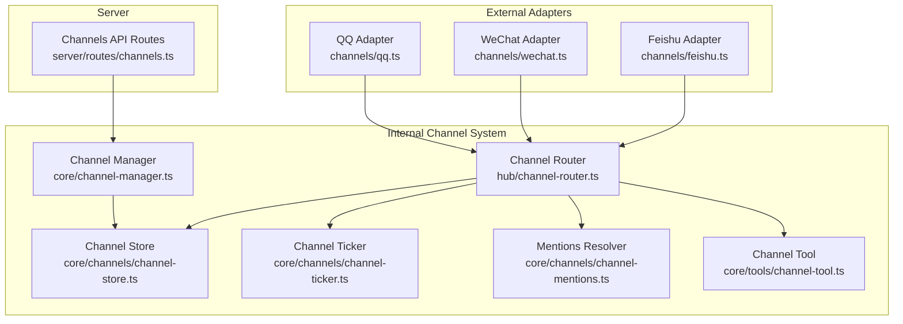
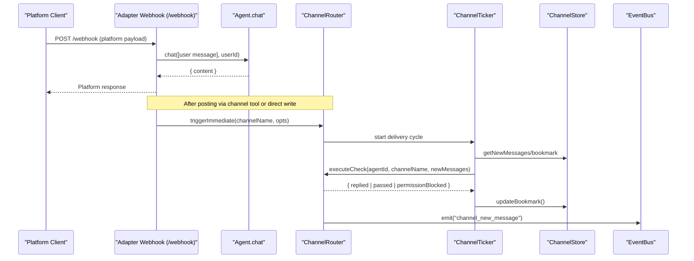
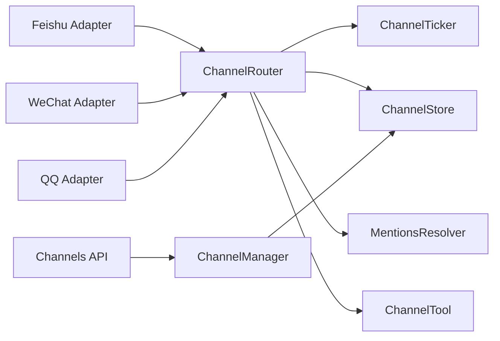
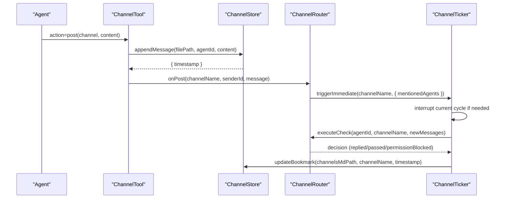
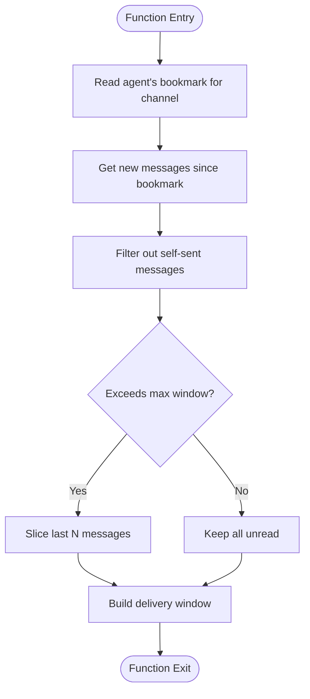

# Custom Channel Development

<cite>
**Referenced Files in This Document**
- [feishu.ts](file://channels/feishu.ts)
- [wechat.ts](file://channels/wechat.ts)
- [qq.ts](file://channels/qq.ts)
- [channel-manager.ts](file://core/channel-manager.ts)
- [channel-store.ts](file://core/channels/channel-store.ts)
- [channel-ticker.ts](file://core/channels/channel-ticker.ts)
- [channel-mentions.ts](file://core/channels/channel-mentions.ts)
- [channel-tool.ts](file://core/tools/channel-tool.ts)
- [channel-router.ts](file://hub/channel-router.ts)
- [channels.ts](file://server/routes/channels.ts)
</cite>

## Table of Contents
1. Introduction
2. Project Structure
3. Core Components
4. Architecture Overview
5. Detailed Component Analysis
6. Dependency Analysis
7. Performance Considerations
8. Troubleshooting Guide
9. Conclusion
10. Appendices

## Introduction
This document explains how to develop custom channel adapters for OpenShadow. It covers the channel adapter interface, required methods, implementation patterns, base channel class structure, event handling contracts, and message format specifications. It also provides step-by-step guidance for building a new channel adapter from scratch, including authentication, sending/receiving messages, error handling, lifecycle management, connection pooling, resource cleanup, testing strategies, logging conventions, performance optimization, packaging/distribution, version compatibility, and migration strategies.

## Project Structure
OpenShadow’s channel system is composed of:
- External platform adapters (e.g., Feishu, WeChat, QQ) that expose HTTP endpoints and translate inbound/outbound traffic into OpenShadow’s internal model.
- Internal channel subsystems that persist channels as Markdown files, schedule “phone” delivery to agents, and provide tools for agents to read/post/pass within channels.
- A router that orchestrates agent phone sessions and integrates with the engine and event bus.

**Diagram sources**
- [feishu.ts:1-77](file://channels/feishu.ts#L1-L77)
- [wechat.ts:1-80](file://channels/wechat.ts#L1-L80)
- [qq.ts:1-70](file://channels/qq.ts#L1-L70)
- [channel-store.ts:1-532](file://core/channels/channel-store.ts#L1-L532)
- [channel-ticker.ts:1-723](file://core/channels/channel-ticker.ts#L1-L723)
- [channel-mentions.ts:1-103](file://core/channels/channel-mentions.ts#L1-L103)
- [channel-tool.ts:1-370](file://core/tools/channel-tool.ts#L1-L370)
- [channel-router.ts:1-800](file://hub/channel-router.ts#L1-L800)
- [channel-manager.ts:1-280](file://core/channel-manager.ts#L1-L280)
- [channels.ts:648-672](file://server/routes/channels.ts#L648-L672)

**Section sources**
- [feishu.ts:1-77](file://channels/feishu.ts#L1-L77)
- [wechat.ts:1-80](file://channels/wechat.ts#L1-L80)
- [qq.ts:1-70](file://channels/qq.ts#L1-L70)
- [channel-store.ts:1-532](file://core/channels/channel-store.ts#L1-L532)
- [channel-ticker.ts:1-723](file://core/channels/channel-ticker.ts#L1-L723)
- [channel-mentions.ts:1-103](file://core/channels/channel-mentions.ts#L1-L103)
- [channel-tool.ts:1-370](file://core/tools/channel-tool.ts#L1-L370)
- [channel-router.ts:1-800](file://hub/channel-router.ts#L1-L800)
- [channel-manager.ts:1-280](file://core/channel-manager.ts#L1-L280)
- [channels.ts:648-672](file://server/routes/channels.ts#L648-L672)

## Core Components
- External adapters: Each external platform is implemented as a small Hono app exposing /health and /webhook endpoints. They parse incoming payloads, call Agent.chat, and respond in the platform-specific format.
- Channel store: File-based persistence for channels and bookmarks. Channels are Markdown files with frontmatter metadata and message blocks. Bookmarks track per-agent last-read positions.
- Channel ticker: Schedules periodic checks and immediate deliveries when new messages arrive. It builds delivery windows, invokes agent phone sessions via callbacks, and updates bookmarks.
- Mentions resolver: Extracts @mentions from text and maps them to member agent IDs based on display names or IDs.
- Channel tool: Provides agents with actions to read, post, create, and list channels; triggers phone delivery after posts.
- Channel router: Orchestrates phone sessions, formats prompts, records activity, and wires up post handlers to trigger immediate delivery.
- Channel manager: High-level CRUD operations for channels, bookmark maintenance, and integration with Hub events.

**Section sources**
- [feishu.ts:1-77](file://channels/feishu.ts#L1-L77)
- [wechat.ts:1-80](file://channels/wechat.ts#L1-L80)
- [qq.ts:1-70](file://channels/qq.ts#L1-L70)
- [channel-store.ts:1-532](file://core/channels/channel-store.ts#L1-L532)
- [channel-ticker.ts:1-723](file://core/channels/channel-ticker.ts#L1-L723)
- [channel-mentions.ts:1-103](file://core/channels/channel-mentions.ts#L1-L103)
- [channel-tool.ts:1-370](file://core/tools/channel-tool.ts#L1-L370)
- [channel-router.ts:1-800](file://hub/channel-router.ts#L1-L800)
- [channel-manager.ts:1-280](file://core/channel-manager.ts#L1-L280)

## Architecture Overview
The adapter layer translates platform-specific webhooks into OpenShadow’s internal model and routes them through the ChannelRouter. The router uses the ticker to deliver unread messages to agents’ phone sessions. Agents use channel tools to reply or pass. Replies are persisted by the channel store and can trigger further deliveries.

**Diagram sources**
- [feishu.ts:1-77](file://channels/feishu.ts#L1-L77)
- [wechat.ts:1-80](file://channels/wechat.ts#L1-L80)
- [qq.ts:1-70](file://channels/qq.ts#L1-L70)
- [channel-router.ts:1-800](file://hub/channel-router.ts#L1-L800)
- [channel-ticker.ts:1-723](file://core/channels/channel-ticker.ts#L1-L723)
- [channel-store.ts:1-532](file://core/channels/channel-store.ts#L1-L532)

## Detailed Component Analysis

### External Channel Adapter Interface
Each external adapter should:
- Export a factory function that returns a Hono app instance.
- Provide a health endpoint at GET /health returning a status object.
- Provide a webhook endpoint at POST /webhook that:
  - Parses the platform-specific payload.
  - Validates message type and content.
  - Calls Agent.chat with user role and content.
  - Returns a platform-compatible response.
- Optionally export a server helper that exposes fetch and port for local testing.

Implementation pattern examples:
- Feishu adapter: parses im.message schema, calls Agent.chat, logs response, returns code/message.
- WeChat adapter: validates msgtype=text, calls Agent.chat, returns text response.
- QQ adapter: validates guilds.message schema, calls Agent.chat, returns code/message.

Best practices:
- Validate and sanitize input fields before calling Agent.chat.
- Use consistent error responses and log errors with context.
- Keep adapters stateless; rely on OpenShadow’s channel store for persistence.

**Section sources**
- [feishu.ts:1-77](file://channels/feishu.ts#L1-L77)
- [wechat.ts:1-80](file://channels/wechat.ts#L1-L80)
- [qq.ts:1-70](file://channels/qq.ts#L1-L70)

### Base Channel Class Structure
There is no single “base channel class.” Instead, adapters follow a common pattern:
- Factory function returning a Hono app.
- Health check route.
- Webhook handler that converts platform messages to Agent.chat calls.
- Optional server helper for local development.

This pattern ensures consistency across platforms and simplifies integration with OpenShadow’s routing and lifecycle.

**Section sources**
- [feishu.ts:1-77](file://channels/feishu.ts#L1-L77)
- [wechat.ts:1-80](file://channels/wechat.ts#L1-L80)
- [qq.ts:1-70](file://channels/qq.ts#L1-L70)

### Event Handling Contracts
- ChannelRouter emits events such as "channel_cycle_start", "channel_cycle_done", and "channel_new_message".
- Adapters can integrate with these events indirectly by triggering immediate delivery after posts.
- The ticker supports an onEvent callback to forward events to the hub’s event bus.

Operational implications:
- Use events for observability and UI feedback.
- Ensure idempotency where possible; the ticker serializes deliveries and aborts ongoing work on new arrivals.

**Section sources**
- [channel-ticker.ts:1-723](file://core/channels/channel-ticker.ts#L1-L723)
- [channel-router.ts:1-800](file://hub/channel-router.ts#L1-L800)

### Message Format Specifications
- Channel transcript format:
  - Frontmatter contains metadata like id, name, description, members.
  - Messages are blocks prefixed by headers with sender and timestamp.
- Bookmark format:
  - Per-agent channels.md lists channels with last-read timestamps.
- Delivery window:
  - Built per agent using their bookmark and filtering out self-sent messages.
  - Supports proactive reminders and mention-aware prioritization.

Data flow:
- appendMessage writes a new block with timestamp.
- getNewMessages filters by bookmark and self-name.
- updateBookmark persists the latest processed timestamp.

**Section sources**
- [channel-store.ts:1-532](file://core/channels/channel-store.ts#L1-L532)
- [channel-ticker.ts:1-723](file://core/channels/channel-ticker.ts#L1-L723)

### Building a New Channel Adapter From Scratch
Steps:
1. Create a new file under channels/ with a factory function returning a Hono app.
2. Implement GET /health returning a simple status object.
3. Implement POST /webhook:
   - Parse and validate the platform payload.
   - Call Agent.chat with user role and content.
   - Return a platform-compatible response.
4. Optionally implement a server helper for local testing.
5. Integrate with OpenShadow:
   - If your adapter writes directly to channels, ensure it triggers ChannelRouter.triggerImmediate.
   - Otherwise, rely on agents posting via channel tools to trigger delivery.

Authentication:
- For outbound replies, use platform APIs with credentials stored securely.
- For inbound webhooks, verify signatures if supported by the platform.

Error handling:
- Log errors with context and return appropriate platform responses.
- Avoid leaking sensitive information in error messages.

Testing:
- Use the provided server helpers to run locally and simulate webhooks.
- Assert health endpoint and webhook behavior with sample payloads.

**Section sources**
- [feishu.ts:1-77](file://channels/feishu.ts#L1-L77)
- [wechat.ts:1-80](file://channels/wechat.ts#L1-L80)
- [qq.ts:1-70](file://channels/qq.ts#L1-L70)

### Implementing Authentication
- Inbound verification:
  - Validate webhook signatures and timestamps.
  - Reject malformed requests early.
- Outbound API calls:
  - Load credentials from secure storage.
  - Rotate tokens as needed and handle refresh flows.
- Authorization:
  - Map platform user identifiers to OpenShadow userIds consistently.
  - Enforce membership checks before posting to channels.

**Section sources**
- [feishu.ts:1-77](file://channels/feishu.ts#L1-L77)
- [wechat.ts:1-80](file://channels/wechat.ts#L1-L80)
- [qq.ts:1-70](file://channels/qq.ts#L1-L70)

### Sending and Receiving Messages
- Receiving:
  - Webhook handler parses payload and calls Agent.chat.
  - Normalize sender identity and content.
- Sending:
  - Prefer using channel tools to post messages so that phone delivery is triggered automatically.
  - If writing directly to the channel store, ensure you call ChannelRouter.triggerImmediate afterward.

**Section sources**
- [channel-tool.ts:1-370](file://core/tools/channel-tool.ts#L1-L370)
- [channel-router.ts:1-800](file://hub/channel-router.ts#L1-L800)
- [channel-store.ts:1-532](file://core/channels/channel-store.ts#L1-L532)

### Error Handling
- Validate inputs and reject invalid requests promptly.
- Catch exceptions around network calls and LLM interactions.
- Return structured responses indicating success/failure.
- Log errors with contextual details without exposing secrets.

**Section sources**
- [feishu.ts:1-77](file://channels/feishu.ts#L1-L77)
- [wechat.ts:1-80](file://channels/wechat.ts#L1-L80)
- [qq.ts:1-70](file://channels/qq.ts#L1-L70)

### Best Practices for Channel Development
- Testing strategies:
  - Use local server helpers to simulate webhooks.
  - Write unit tests for parsing and validation logic.
  - Mock Agent.chat to avoid real LLM calls during tests.
- Logging conventions:
  - Include channel name, sender ID, and operation type in logs.
  - Use module-scoped loggers for consistent formatting.
- Performance optimization:
  - Avoid heavy processing in webhook handlers; offload to async tasks if necessary.
  - Batch operations where possible and respect rate limits.
  - Use AbortController to cancel long-running deliveries on new arrivals.

**Section sources**
- [channel-ticker.ts:1-723](file://core/channels/channel-ticker.ts#L1-L723)
- [channel-router.ts:1-800](file://hub/channel-router.ts#L1-L800)

### Channel Lifecycle Management
- Start/stop:
  - ChannelRouter.start initializes the ticker and sets up post handlers.
  - ChannelRouter.stop halts timers and aborts active deliveries.
- Toggle:
  - Server route toggles channels enabled/disabled and coordinates router lifecycle.
- Immediate delivery:
  - On new messages or agent posts, triggerImmediate interrupts current cycles and restarts with latest context.

**Section sources**
- [channel-router.ts:1-800](file://hub/channel-router.ts#L1-L800)
- [channels.ts:648-672](file://server/routes/channels.ts#L648-L672)
- [channel-ticker.ts:1-723](file://core/channels/channel-ticker.ts#L1-L723)

### Connection Pooling and Resource Cleanup
- Adapters should manage HTTP clients with connection pooling and timeouts.
- Clean up resources on shutdown:
  - Close connections and release locks.
  - Stop timers and abort pending operations.
- Use atomic writes and file locks in channel store to prevent corruption.

**Section sources**
- [channel-store.ts:1-532](file://core/channels/channel-store.ts#L1-L532)
- [channel-ticker.ts:1-723](file://core/channels/channel-ticker.ts#L1-L723)

### Packaging and Distributing Custom Channels
- Place adapter code under channels/ and export factory functions.
- Provide clear documentation for configuration and credentials.
- Version your adapter and maintain backward compatibility for webhook payloads.
- Include health endpoints and example payloads for integration testing.

**Section sources**
- [feishu.ts:1-77](file://channels/feishu.ts#L1-L77)
- [wechat.ts:1-80](file://channels/wechat.ts#L1-L80)
- [qq.ts:1-70](file://channels/qq.ts#L1-L70)

### Version Compatibility and Migration Strategies
- Maintain stable webhook schemas; deprecate old versions gradually.
- Support both legacy and new payload formats during transition periods.
- Update channel store parsers and frontmatter keys carefully to preserve history.
- Use migration scripts to normalize existing data if needed.

**Section sources**
- [channel-store.ts:1-532](file://core/channels/channel-store.ts#L1-L532)

## Dependency Analysis
The following diagram shows key dependencies between components involved in channel development.

**Diagram sources**
- [feishu.ts:1-77](file://channels/feishu.ts#L1-L77)
- [wechat.ts:1-80](file://channels/wechat.ts#L1-L80)
- [qq.ts:1-70](file://channels/qq.ts#L1-L70)
- [channel-router.ts:1-800](file://hub/channel-router.ts#L1-L800)
- [channel-ticker.ts:1-723](file://core/channels/channel-ticker.ts#L1-L723)
- [channel-store.ts:1-532](file://core/channels/channel-store.ts#L1-L532)
- [channel-mentions.ts:1-103](file://core/channels/channel-mentions.ts#L1-L103)
- [channel-tool.ts:1-370](file://core/tools/channel-tool.ts#L1-L370)
- [channel-manager.ts:1-280](file://core/channel-manager.ts#L1-L280)
- [channels.ts:648-672](file://server/routes/channels.ts#L648-L672)

**Section sources**
- [channel-router.ts:1-800](file://hub/channel-router.ts#L1-L800)
- [channel-ticker.ts:1-723](file://core/channels/channel-ticker.ts#L1-L723)
- [channel-store.ts:1-532](file://core/channels/channel-store.ts#L1-L532)
- [channel-mentions.ts:1-103](file://core/channels/channel-mentions.ts#L1-L103)
- [channel-tool.ts:1-370](file://core/tools/channel-tool.ts#L1-L370)
- [channel-manager.ts:1-280](file://core/channel-manager.ts#L1-L280)
- [channels.ts:648-672](file://server/routes/channels.ts#L648-L672)

## Performance Considerations
- Minimize synchronous I/O in webhook handlers; prefer asynchronous operations.
- Use delivery windows to limit message volume per turn and avoid overwhelming agents.
- Leverage AbortController to cancel long-running tasks when new messages arrive.
- Cache agent order and channel metadata with short TTLs to reduce filesystem reads.
- Employ atomic writes and file locks to prevent contention and corruption.

[No sources needed since this section provides general guidance]

## Troubleshooting Guide
Common issues and resolutions:
- Webhook not received:
  - Verify health endpoint responds correctly.
  - Check firewall and reverse proxy configurations.
- No agent replies:
  - Ensure ChannelRouter is started and channels are enabled.
  - Confirm agent membership in the channel frontmatter.
- Duplicate or missed messages:
  - Inspect bookmarks and delivery windows.
  - Review ticker logs for interruptions and checkpoints.
- Permission blocked:
  - Verify agent membership changes and tool mode settings.

**Section sources**
- [channel-ticker.ts:1-723](file://core/channels/channel-ticker.ts#L1-L723)
- [channel-router.ts:1-800](file://hub/channel-router.ts#L1-L800)
- [channel-store.ts:1-532](file://core/channels/channel-store.ts#L1-L532)

## Conclusion
Custom channel adapters in OpenShadow follow a consistent pattern: a Hono app with health and webhook endpoints, robust validation, and integration with Agent.chat. The internal channel subsystem persists transcripts as Markdown, schedules phone delivery, and provides tools for agents to interact. By adhering to the recommended interfaces, lifecycle management, and best practices, developers can build reliable, scalable, and maintainable channel integrations.

[No sources needed since this section summarizes without analyzing specific files]

## Appendices

### Sequence Diagram: Channel Post and Phone Delivery

**Diagram sources**
- [channel-tool.ts:1-370](file://core/tools/channel-tool.ts#L1-L370)
- [channel-store.ts:1-532](file://core/channels/channel-store.ts#L1-L532)
- [channel-router.ts:1-800](file://hub/channel-router.ts#L1-L800)
- [channel-ticker.ts:1-723](file://core/channels/channel-ticker.ts#L1-L723)

### Flowchart: Unread Delivery Window Construction

**Diagram sources**
- [channel-ticker.ts:1-723](file://core/channels/channel-ticker.ts#L1-L723)
- [channel-store.ts:1-532](file://core/channels/channel-store.ts#L1-L532)