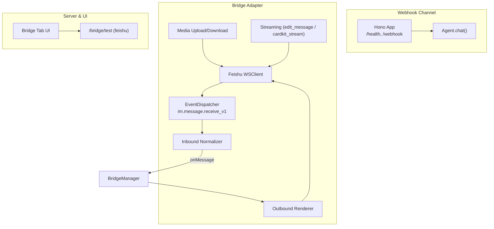
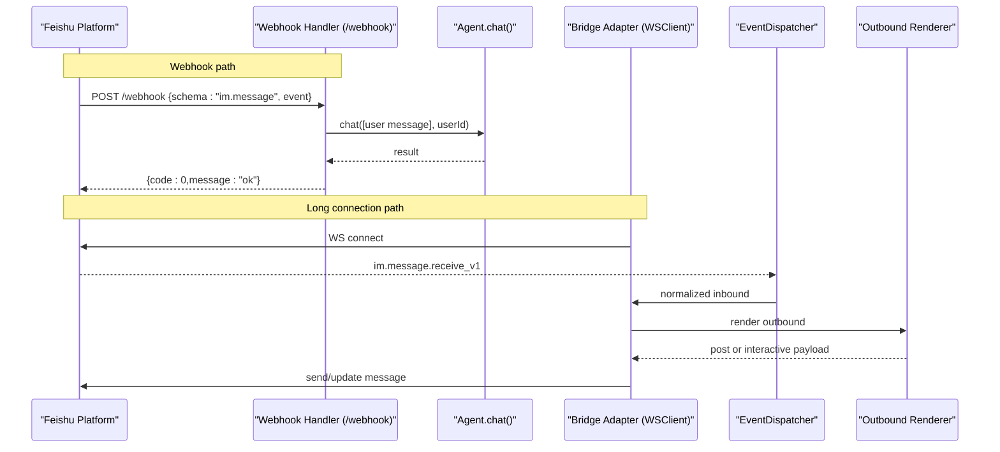
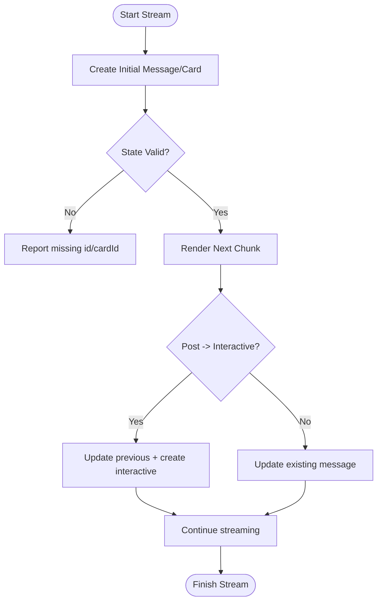
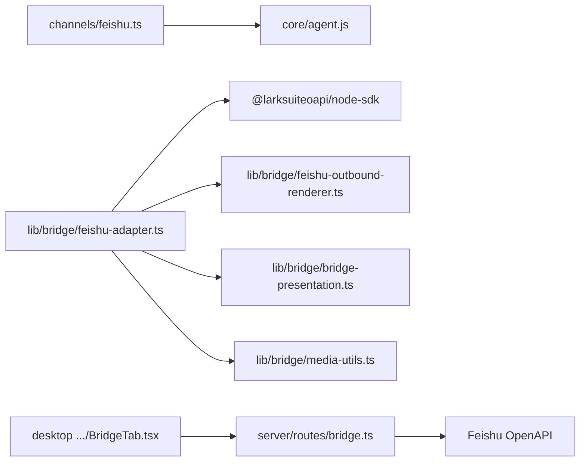

# Feishu Integration

<cite>
**Referenced Files in This Document**
- [feishu.ts](file://channels/feishu.ts)
- [feishu-adapter.ts](file://lib/bridge/feishu-adapter.ts)
- [feishu-outbound-renderer.ts](file://lib/bridge/feishu-outbound-renderer.ts)
- [bridge-presentation.ts](file://lib/bridge/bridge-presentation.ts)
- [bridge.ts](file://server/routes/bridge.ts)
- [BridgeTab.tsx](file://desktop/src/react/settings/tabs/BridgeTab.tsx)
</cite>

## Table of Contents
1. Introduction
2. Project Structure
3. Core Components
4. Architecture Overview
5. Detailed Component Analysis
6. Dependency Analysis
7. Performance Considerations
8. Troubleshooting Guide
9. Conclusion

## Introduction
This document explains the Feishu (Lark) messaging integration, covering two complementary approaches:
- A lightweight webhook-based channel for simple text flows.
- A full-featured WebSocket-based adapter supporting rich inbound/outbound messages, media handling, and streaming updates via message editing or interactive cards.

It also documents authentication setup, event subscription patterns, bidirectional synchronization, platform-specific features (rich text formatting, interactive cards, file sharing), error handling, rate limiting considerations, and troubleshooting techniques.

## Project Structure
The Feishu integration spans a minimal webhook channel and a comprehensive bridge adapter:
- channels/feishu.ts: Hono-based HTTP server exposing a health endpoint and a webhook handler that forwards text to an Agent.
- lib/bridge/feishu-adapter.ts: Production-grade adapter using the official Feishu SDK with WebSocket long connection, inbound normalization, outbound rendering, media upload/download, and streaming support.
- lib/bridge/feishu-outbound-renderer.ts: Renders outbound messages as either post (rich text) or interactive (markdown card).
- lib/bridge/bridge-presentation.ts: Shared presentation utilities for CardKit streaming content.
- server/routes/bridge.ts: Server-side credential verification for Feishu app credentials.
- desktop/src/react/settings/tabs/BridgeTab.tsx: UI for configuring Feishu credentials and toggling the connector.

**Diagram sources**
- [feishu.ts:1-77](file://channels/feishu.ts#L1-L77)
- [feishu-adapter.ts:1-838](file://lib/bridge/feishu-adapter.ts#L1-L838)
- [bridge.ts:30-71](file://server/routes/bridge.ts#L30-L71)
- [BridgeTab.tsx:149-171](file://desktop/src/react/settings/tabs/BridgeTab.tsx#L149-L171)

**Section sources**
- [feishu.ts:1-77](file://channels/feishu.ts#L1-L77)
- [feishu-adapter.ts:1-838](file://lib/bridge/feishu-adapter.ts#L1-L838)
- [bridge.ts:30-71](file://server/routes/bridge.ts#L30-L71)
- [BridgeTab.tsx:149-171](file://desktop/src/react/settings/tabs/BridgeTab.tsx#L149-L171)

## Core Components
- Webhook Channel (channels/feishu.ts): Exposes /health and /webhook; parses incoming events, filters non-message events, calls Agent.chat(), and logs responses. Suitable for quick setups where Feishu pushes events to your server.
- Bridge Adapter (lib/bridge/feishu-adapter.ts): Uses @larksuiteoapi/node-sdk to maintain a persistent WebSocket connection, register im.message.receive_v1 events, normalize inbound messages (text, post, image, file, audio, media), render outbound messages (post or interactive), handle media uploads/downloads, and implement streaming via message update or CardKit streaming.
- Outbound Renderer (lib/bridge/feishu-outbound-renderer.ts): Converts text into Feishu post content or interactive markdown card content; supports @mentions and table detection to choose interactive mode when needed.
- Presentation Utilities (lib/bridge/bridge-presentation.ts): Builds CardKit card JSON and settings for streaming mode.
- Credential Verification (server/routes/bridge.ts): Validates appId/appSecret by requesting a tenant access token and reporting status.
- Settings UI (desktop/src/react/settings/tabs/BridgeTab.tsx): Provides fields for appId/appSecret, save and test actions, and hints for Feishu configuration.

**Section sources**
- [feishu.ts:1-77](file://channels/feishu.ts#L1-L77)
- [feishu-adapter.ts:1-838](file://lib/bridge/feishu-adapter.ts#L1-L838)
- [feishu-outbound-renderer.ts:1-87](file://lib/bridge/feishu-outbound-renderer.ts#L1-L87)
- [bridge-presentation.ts:1-81](file://lib/bridge/bridge-presentation.ts#L1-L81)
- [bridge.ts:30-71](file://server/routes/bridge.ts#L30-L71)
- [BridgeTab.tsx:149-171](file://desktop/src/react/settings/tabs/BridgeTab.tsx#L149-L171)

## Architecture Overview
Two integration paths are available:

- Webhook Path: Feishu POSTs events to your server’s /webhook; the handler invokes the agent and returns a response.
- Long Connection Path: The adapter connects via WebSocket, receives events through the SDK’s EventDispatcher, normalizes them, and sends replies back via the SDK.

**Diagram sources**
- [feishu.ts:16-61](file://channels/feishu.ts#L16-L61)
- [feishu-adapter.ts:425-468](file://lib/bridge/feishu-adapter.ts#L425-L468)
- [feishu-outbound-renderer.ts:70-87](file://lib/bridge/feishu-outbound-renderer.ts#L70-L87)

## Detailed Component Analysis

### Webhook Channel Implementation
- Health check: GET /health returns a simple status object.
- Webhook handler: POST /webhook
  - Parses JSON body and validates schema and event structure.
  - Skips non-message events and empty text.
  - Calls Agent.chat with user role and extracted text.
  - Logs chat_id, message_id, and a truncated response snippet.
  - Returns standard success/error JSON.

Operational notes:
- For production, configure Feishu to POST to your public /webhook URL.
- Currently, the handler does not send replies back via Feishu API; it only logs. Extend this to call the adapter’s sendReply if you need immediate reply via webhook.

**Section sources**
- [feishu.ts:16-61](file://channels/feishu.ts#L16-L61)

### Bridge Adapter: Authentication and Long Connection
- Client initialization: Creates a Feishu client with appId and appSecret.
- WebSocket client: Establishes a persistent connection with automatic reconnection.
- Event registration: Registers im.message.receive_v1 to receive inbound messages.
- Self-bot echo filtering: Ignores messages from the same bot/app to avoid loops.
- Status reporting: Reports connected/error states and schedules periodic health checks.

Credential verification:
- Server route tests credentials by requesting a tenant token and returning structured info including code/msg/log_id.

**Section sources**
- [feishu-adapter.ts:381-575](file://lib/bridge/feishu-adapter.ts#L381-L575)
- [bridge.ts:553-584](file://server/routes/bridge.ts#L553-L584)

### Inbound Message Normalization
Supported inbound types:
- text: Extracts plain text.
- post: Parses rich content blocks, extracts mentions (@), images, and videos; aggregates diagnostics for unsupported tags.
- image: Captures image_key attachment.
- file: Captures file_key and filename.
- audio: Captures file_key and duration.
- media: Captures video file_key, filename, and duration.

Normalization details:
- Content parsing handles both object and stringified JSON payloads.
- Post normalization builds lines and attachments, logging warnings for unsupported elements.
- Max message size guard truncates oversized text.

**Section sources**
- [feishu-adapter.ts:203-354](file://lib/bridge/feishu-adapter.ts#L203-L354)

### Outbound Rendering and Rich Text Features
Rendering modes:
- post: Rich text paragraphs with @mention support.
- interactive: Markdown card suitable for tables and richer layouts.

Key behaviors:
- Detects markdown tables to force interactive mode.
- Renders @mentions into Feishu at tokens with user_id and user_name.
- Supports CardKit streaming via dedicated renderer and settings.

**Section sources**
- [feishu-outbound-renderer.ts:1-87](file://lib/bridge/feishu-outbound-renderer.ts#L1-L87)
- [bridge-presentation.ts:60-80](file://lib/bridge/bridge-presentation.ts#L60-L80)

### Streaming Updates (Bidirectional Synchronization)
Two streaming strategies:
- edit_message: Create a message once, then update its content repeatedly.
- cardkit_stream: Create a CardKit card, send a card instance message, enable streaming mode, and update element content incrementally.

Flow highlights:
- startStreamReply creates initial message and tracks messageId and renderKind.
- updateStreamReply renders new content; if transitioning from post to interactive, posts a transition note and switches to interactive.
- finishStreamReply finalizes the stream.
- Rich streaming uses CardKit APIs to create card, set streaming mode, and update markdown content.

**Diagram sources**
- [feishu-adapter.ts:707-764](file://lib/bridge/feishu-adapter.ts#L707-L764)

### Media Handling (Images, Files, Audio, Video)
Capabilities:
- Input modes: buffer, remote_url, public_url.
- Supported kinds: image, video, audio, document.
- Size limits enforced per kind.

Upload flow:
- Images: Upload via image.create, then send message with image_key.
- Other files: Upload via file.create, determine fileType based on mime/filename, then send message with file_key and appropriate msgType.

Download flow:
- Images: Use messageResource.get (for user-sent images) or image.get (for bot-uploaded images).
- Files/Audio/Video: Use messageResource.get with file type.

**Section sources**
- [feishu-adapter.ts:31-51](file://lib/bridge/feishu-adapter.ts#L31-L51)
- [feishu-adapter.ts:787-828](file://lib/bridge/feishu-adapter.ts#L787-L828)
- [feishu-adapter.ts:767-786](file://lib/bridge/feishu-adapter.ts#L767-L786)

### Configuration and User Experience
- Settings UI provides fields for appId and appSecret, validation before enabling, save-on-blur behavior, and a test action.
- Server-side test verifies credentials by calling the tenant token endpoint and returns detailed info including log_id for debugging.

**Section sources**
- [BridgeTab.tsx:149-171](file://desktop/src/react/settings/tabs/BridgeTab.tsx#L149-L171)
- [bridge.ts:553-584](file://server/routes/bridge.ts#L553-L584)

## Dependency Analysis
High-level dependencies:
- channels/feishu.ts depends on Hono and core Agent.
- lib/bridge/feishu-adapter.ts depends on @larksuiteoapi/node-sdk, media utilities, presentation utilities, and outbound renderer.
- lib/bridge/feishu-outbound-renderer.ts depends on markdown-it for table detection.
- server/routes/bridge.ts performs HTTP calls to Feishu endpoints for credential testing.
- Desktop UI consumes bridge state and triggers save/test operations.

**Diagram sources**
- [feishu.ts:1-77](file://channels/feishu.ts#L1-L77)
- [feishu-adapter.ts:1-838](file://lib/bridge/feishu-adapter.ts#L1-L838)
- [feishu-outbound-renderer.ts:1-87](file://lib/bridge/feishu-outbound-renderer.ts#L1-L87)
- [bridge-presentation.ts:1-81](file://lib/bridge/bridge-presentation.ts#L1-L81)
- [bridge.ts:30-71](file://server/routes/bridge.ts#L30-L71)
- [BridgeTab.tsx:149-171](file://desktop/src/react/settings/tabs/BridgeTab.tsx#L149-L171)

**Section sources**
- [feishu.ts:1-77](file://channels/feishu.ts#L1-L77)
- [feishu-adapter.ts:1-838](file://lib/bridge/feishu-adapter.ts#L1-L838)
- [feishu-outbound-renderer.ts:1-87](file://lib/bridge/feishu-outbound-renderer.ts#L1-L87)
- [bridge-presentation.ts:1-81](file://lib/bridge/bridge-presentation.ts#L1-L81)
- [bridge.ts:30-71](file://server/routes/bridge.ts#L30-L71)
- [BridgeTab.tsx:149-171](file://desktop/src/react/settings/tabs/BridgeTab.tsx#L149-L171)

## Performance Considerations
- Streaming intervals: Minimum interval between updates is configured to avoid excessive API calls.
- Human-like delays: Block streaming introduces randomized delays between bubble messages to mimic natural pacing.
- Memory management: LRU maps limit cached user info and last block timestamps to prevent unbounded growth.
- Message size guards: Truncation prevents oversized inbound text from overwhelming downstream processing.

[No sources needed since this section provides general guidance]

## Troubleshooting Guide
Common issues and remedies:
- Invalid content JSON: When inbound message content cannot be parsed, the adapter logs a diagnostic warning and continues with safe defaults.
- Unsupported post tags: Diagnostics are appended to the message text to indicate unsupported elements.
- Missing identifiers: If message creation returns no messageId or CardKit creation returns no cardId, updates are disabled for that lifecycle and warnings are logged.
- WebSocket connectivity: Health checks report disconnected errors and attempt reconnection; verify network/firewall rules and Feishu long connection permissions.
- Credential verification failures: The server route returns code/msg/log_id; use log_id to correlate with Feishu backend logs.

Debugging tips:
- Enable debug logging for bridge module to capture detailed Feishu operation traces.
- Inspect adapter status reports for connection state and error messages.
- Validate inbound payloads by checking normalized text and attachments.
- For media issues, confirm MIME detection and size limits align with Feishu constraints.

**Section sources**
- [feishu-adapter.ts:203-215](file://lib/bridge/feishu-adapter.ts#L203-L215)
- [feishu-adapter.ts:659-678](file://lib/bridge/feishu-adapter.ts#L659-L678)
- [feishu-adapter.ts:737-764](file://lib/bridge/feishu-adapter.ts#L737-L764)
- [bridge.ts:42-52](file://server/routes/bridge.ts#L42-L52)

## Conclusion
The Feishu integration offers both a simple webhook path and a robust long-connection adapter. The adapter supports rich inbound/outbound formats, media handling, and streaming updates via message edits or CardKit cards. Proper credential configuration, careful attention to message sizes and streaming intervals, and systematic debugging will ensure reliable operation.

[No sources needed since this section summarizes without analyzing specific files]