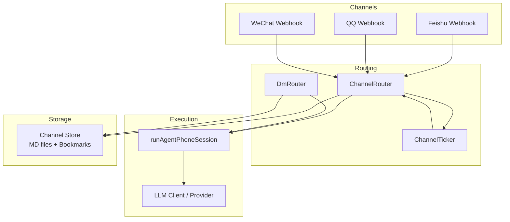
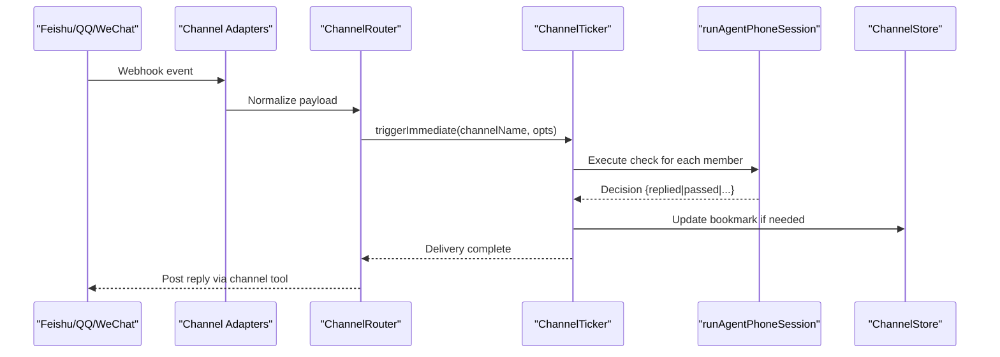
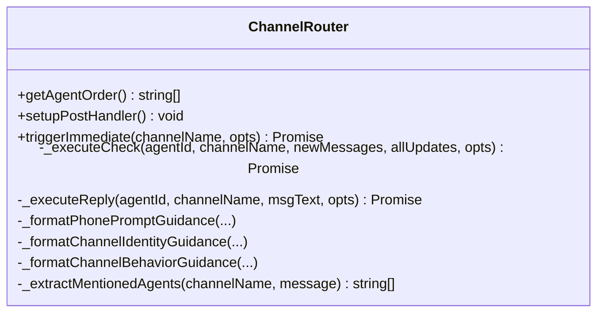
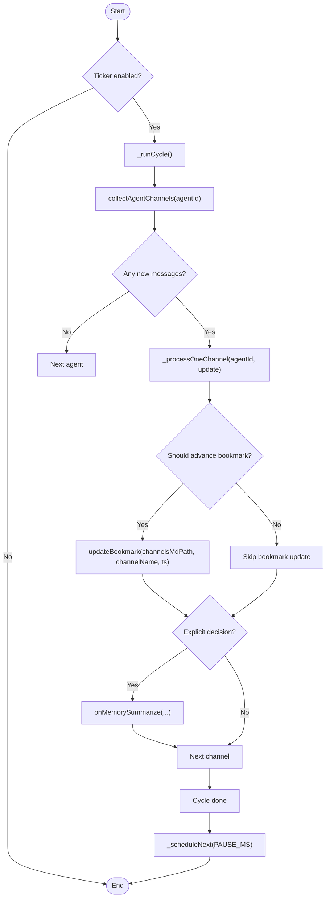
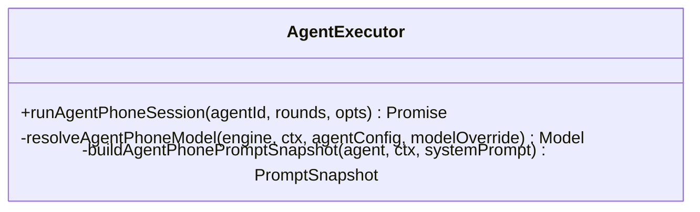
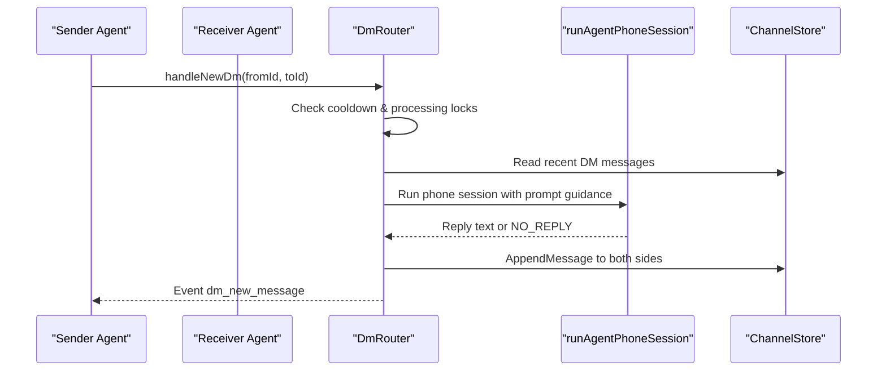
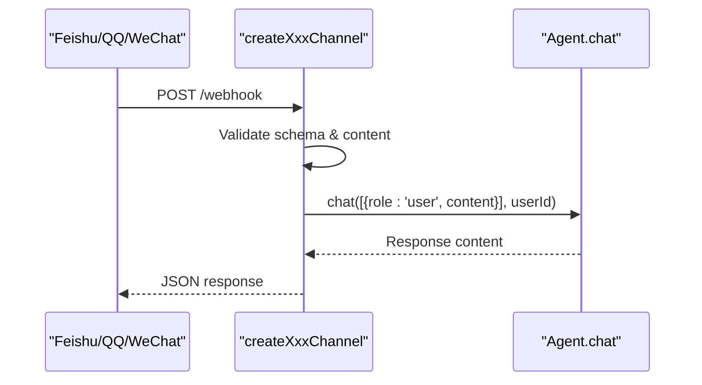
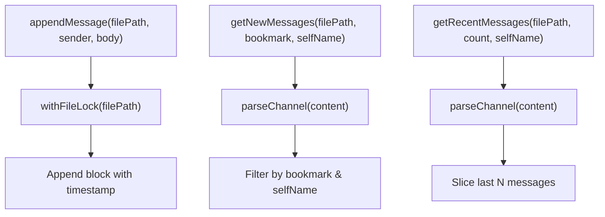
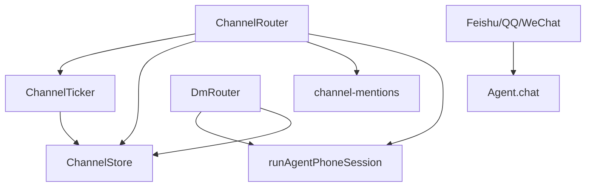

# Message Routing & Processing

<cite>
**Referenced Files in This Document**
- [channel-router.ts](file://hub/channel-router.ts)
- [agent-executor.ts](file://hub/agent-executor.ts)
- [dm-router.ts](file://hub/dm-router.ts)
- [channel-ticker.ts](file://lib/channels/channel-ticker.ts)
- [channel-store.ts](file://core/channels/channel-store.ts)
- [channel-mentions.ts](file://core/channels/channel-mentions.ts)
- [feishu.ts](file://channels/feishu.ts)
- [qq.ts](file://channels/qq.ts)
- [wechat.ts](file://channels/wechat.ts)
- [slash-command-dispatcher.ts](file://core/slash-command-dispatcher.ts)
- [message-utils.ts](file://core/message-utils.ts)
</cite>

## Table of Contents
1. [Introduction](#introduction)
2. [Project Structure](#project-structure)
3. [Core Components](#core-components)
4. [Architecture Overview](#architecture-overview)
5. [Detailed Component Analysis](#detailed-component-analysis)
6. [Dependency Analysis](#dependency-analysis)
7. [Performance Considerations](#performance-considerations)
8. [Troubleshooting Guide](#troubleshooting-guide)
9. [Conclusion](#conclusion)
10. [Appendices](#appendices)

## Introduction
This document explains how OpenShadow routes and processes messages across multiple channel integrations (Feishu, QQ, WeChat), normalizes them into a unified pipeline, selects agents, and executes the “Agent Phone” processing loop. It covers:
- ChannelRouter architecture for group channels
- Message transformation layer and normalization
- Agent selection algorithms and mention handling
- Command parsing and context injection
- Queuing, load balancing, concurrency, and interruption/resume
- Extensibility for custom processors and routing rules

## Project Structure
The message routing and processing system is composed of:
- Channel adapters that receive platform webhooks and normalize payloads
- A ticker-based scheduler that drives periodic and immediate delivery to agents
- A router that orchestrates agent phone sessions and decision tools
- A DM router for 1v1 conversations
- Shared storage utilities for channel transcripts and bookmarks

**Diagram sources**
- [channel-router.ts:1-120](file://hub/channel-router.ts#L1-L120)
- [channel-ticker.ts:1-120](file://lib/channels/channel-ticker.ts#L1-L120)
- [agent-executor.ts:280-360](file://hub/agent-executor.ts#L280-L360)
- [dm-router.ts:140-220](file://hub/dm-router.ts#L140-L220)
- [channel-store.ts:170-240](file://core/channels/channel-store.ts#L170-L240)

**Section sources**
- [channel-router.ts:1-120](file://hub/channel-router.ts#L1-L120)
- [channel-ticker.ts:1-120](file://lib/channels/channel-ticker.ts#L1-L120)
- [agent-executor.ts:280-360](file://hub/agent-executor.ts#L280-L360)
- [dm-router.ts:140-220](file://hub/dm-router.ts#L140-L220)
- [channel-store.ts:170-240](file://core/channels/channel-store.ts#L170-L240)

## Core Components
- ChannelRouter: Orchestrates group-channel phone delivery, builds prompts, manages decision tools, and integrates with the ticker.
- ChannelTicker: Schedules periodic checks and immediate deliveries; handles interruptions, checkpoints, reminders, and guard limits.
- runAgentPhoneSession: Executes an agent’s phone session with scoped tools, memory, and model overrides; captures decisions and diagnostics.
- DmRouter: Handles 1v1 DM flows between agents using the same phone session mechanism.
- ChannelStore: File-backed persistence for channel transcripts, frontmatter metadata, and per-agent bookmarks.
- Mention extractor: Parses @mentions to identify targeted agents.
- Slash command dispatcher: Parses and dispatches slash commands with role-based permissions.
- Message utils: Normalizes content blocks, extracts text/thinking/tool calls, and loads session history.

**Section sources**
- [channel-router.ts:460-520](file://hub/channel-router.ts#L460-L520)
- [channel-ticker.ts:240-340](file://lib/channels/channel-ticker.ts#L240-L340)
- [agent-executor.ts:294-360](file://hub/agent-executor.ts#L294-L360)
- [dm-router.ts:180-260](file://hub/dm-router.ts#L180-L260)
- [channel-store.ts:220-300](file://core/channels/channel-store.ts#L220-L300)
- [channel-mentions.ts:53-103](file://core/channels/channel-mentions.ts#L53-L103)
- [slash-command-dispatcher.ts:31-99](file://core/slash-command-dispatcher.ts#L31-L99)
- [message-utils.ts:40-80](file://core/message-utils.ts#L40-L80)

## Architecture Overview
Incoming messages from Feishu/QQ/WeChat are normalized and routed through ChannelRouter. The ChannelTicker schedules both immediate and proactive deliveries to agents based on unread windows and member lists. Agents execute phone sessions via runAgentPhoneSession, which injects identity, behavior guidance, and channel-specific tools. Decisions (reply or pass) are recorded and persisted, then forwarded back to channels.

**Diagram sources**
- [channel-router.ts:420-450](file://hub/channel-router.ts#L420-L450)
- [channel-ticker.ts:400-470](file://lib/channels/channel-ticker.ts#L400-L470)
- [agent-executor.ts:490-520](file://hub/agent-executor.ts#L490-L520)
- [channel-store.ts:220-260](file://core/channels/channel-store.ts#L220-L260)

## Detailed Component Analysis

### ChannelRouter
Responsibilities:
- Build prompt guidance (identity, behavior, delivery window, repair instructions)
- Provide channel tools: read_context, reply, pass
- Manage post handler to trigger immediate delivery when agents post
- Extract mentions and prioritize targeted agents
- Coordinate with ticker and event bus

Key behaviors:
- getAgentOrder: Lists available agents for rotation
- _executeCheck: Entry point for phone delivery; records activity, runs decision repair loop
- setupPostHandler: Injects callback to trigger delivery on agent posts
- _extractMentionedAgents: Uses mention extractor to determine targeted members

**Diagram sources**
- [channel-router.ts:450-520](file://hub/channel-router.ts#L450-L520)
- [channel-router.ts:420-450](file://hub/channel-router.ts#L420-L450)
- [channel-router.ts:414-424](file://hub/channel-router.ts#L414-L424)

**Section sources**
- [channel-router.ts:450-520](file://hub/channel-router.ts#L450-L520)
- [channel-router.ts:420-450](file://hub/channel-router.ts#L420-L450)
- [channel-router.ts:414-424](file://hub/channel-router.ts#L414-L424)

### ChannelTicker
Responsibilities:
- Periodic cycle over agents and channels
- Immediate delivery triggered by new messages
- Proactive reminders per channel settings
- Interrupt/resume with checkpointing
- Guard limits to prevent runaway loops

Key behaviors:
- buildChannelUnreadDeliveryWindow: Computes sliding window of unread messages per agent
- collectAgentChannels: Aggregates updates per agent based on bookmarks
- triggerImmediate: Serializes and aborts/restarts deliveries
- _doDelivery: Iterates agents, executes checks, advances bookmarks, expands scope after proactive replies
- refreshSchedule: Schedules next reminder based on channel meta

**Diagram sources**
- [channel-ticker.ts:274-340](file://lib/channels/channel-ticker.ts#L274-L340)
- [channel-ticker.ts:344-385](file://lib/channels/channel-ticker.ts#L344-L385)
- [channel-ticker.ts:402-470](file://lib/channels/channel-ticker.ts#L402-L470)
- [channel-ticker.ts:452-644](file://lib/channels/channel-ticker.ts#L452-L644)
- [channel-ticker.ts:648-670](file://lib/channels/channel-ticker.ts#L648-L670)

**Section sources**
- [channel-ticker.ts:274-340](file://lib/channels/channel-ticker.ts#L274-L340)
- [channel-ticker.ts:402-470](file://lib/channels/channel-ticker.ts#L402-L470)
- [channel-ticker.ts:452-644](file://lib/channels/channel-ticker.ts#L452-L644)
- [channel-ticker.ts:648-670](file://lib/channels/channel-ticker.ts#L648-L670)

### runAgentPhoneSession
Responsibilities:
- Create or reuse a persistent session per agent+conversation
- Build resource loader with prompt snapshot and skills
- Filter tools by conversation surface and permission mode
- Record usage and live activity events
- Support model override and diagnostics return

Key behaviors:
- Session lifecycle management and runtime sidecar tracking
- Tool filtering and active tool names
- Scoped memory search for channel conversations
- Abort signal integration and teardown

**Diagram sources**
- [agent-executor.ts:294-360](file://hub/agent-executor.ts#L294-L360)
- [agent-executor.ts:348-402](file://hub/agent-executor.ts#L348-L402)
- [agent-executor.ts:464-520](file://hub/agent-executor.ts#L464-L520)

**Section sources**
- [agent-executor.ts:294-360](file://hub/agent-executor.ts#L294-L360)
- [agent-executor.ts:348-402](file://hub/agent-executor.ts#L348-L402)
- [agent-executor.ts:464-520](file://hub/agent-executor.ts#L464-L520)

### DmRouter
Responsibilities:
- Handle 1v1 DM flows between agents
- Use phone session to generate replies with bounded rounds
- Persist replies to both sides’ dm files
- Emit events and record activities

Key behaviors:
- Cooldown and deduplication guards
- Round limit and termination markers
- Settings resolution per conversation

**Diagram sources**
- [dm-router.ts:144-178](file://hub/dm-router.ts#L144-L178)
- [dm-router.ts:183-260](file://hub/dm-router.ts#L183-L260)
- [dm-router.ts:292-340](file://hub/dm-router.ts#L292-L340)

**Section sources**
- [dm-router.ts:144-178](file://hub/dm-router.ts#L144-L178)
- [dm-router.ts:183-260](file://hub/dm-router.ts#L183-L260)
- [dm-router.ts:292-340](file://hub/dm-router.ts#L292-L340)

### Channel Adapters (Feishu, QQ, WeChat)
Responsibilities:
- Receive webhook events
- Validate schema and skip non-message events
- Normalize payload to user ID and text
- Call agent.chat for response generation
- Return platform-specific responses

**Diagram sources**
- [feishu.ts:23-58](file://channels/feishu.ts#L23-L58)
- [qq.ts:23-52](file://channels/qq.ts#L23-L52)
- [wechat.ts:26-62](file://channels/wechat.ts#L26-L62)

**Section sources**
- [feishu.ts:23-58](file://channels/feishu.ts#L23-L58)
- [qq.ts:23-52](file://channels/qq.ts#L23-L52)
- [wechat.ts:26-62](file://channels/wechat.ts#L26-L62)

### ChannelStore
Responsibilities:
- Parse/write channel MD files (frontmatter + message stream)
- Maintain per-agent bookmarks (last-read timestamps)
- Provide utilities for reading recent/new messages and managing members

Key behaviors:
- appendMessage: Atomic write with file locking
- getNewMessages/getRecentMessages: Filtering by bookmark and self-sender
- add/remove/update channel members and metadata

**Diagram sources**
- [channel-store.ts:220-260](file://core/channels/channel-store.ts#L220-L260)
- [channel-store.ts:270-282](file://core/channels/channel-store.ts#L270-L282)
- [channel-store.ts:359-384](file://core/channels/channel-store.ts#L359-L384)

**Section sources**
- [channel-store.ts:220-260](file://core/channels/channel-store.ts#L220-L260)
- [channel-store.ts:270-282](file://core/channels/channel-store.ts#L270-L282)
- [channel-store.ts:359-384](file://core/channels/channel-store.ts#L359-L384)

### Mention Handling
Responsibilities:
- Resolve textual @mentions to channel member agent IDs
- Enforce boundary conditions to avoid false positives
- Prefer unique display aliases and exact IDs

Key behaviors:
- extractMentionedAgentIds(text, { channelMembers, agents })
- Boundary checks for prefix/suffix characters
- Overlap detection to avoid duplicate matches

**Section sources**
- [channel-mentions.ts:53-103](file://core/channels/channel-mentions.ts#L53-L103)

### Slash Command Dispatcher
Responsibilities:
- Parse slash commands with regex
- Resolve sender role and enforce permissions
- Execute handlers with timeout protection and frozen context

Key behaviors:
- parse(text) → {commandName, args}
- tryDispatch(text, ctx) with role checks and error handling

**Section sources**
- [slash-command-dispatcher.ts:31-99](file://core/slash-command-dispatcher.ts#L31-L99)

### Message Utilities
Responsibilities:
- Extract text, thinking, tool uses, images from Pi SDK content blocks
- Load session history from JSONL or Pi session files
- Validate and classify desktop session paths

Key behaviors:
- extractTextContent(content, { stripThink })
- loadSessionHistoryMessages(engine, explicitPath)
- isActiveDesktopSessionPath/isArchivedDesktopSessionPath

**Section sources**
- [message-utils.ts:40-80](file://core/message-utils.ts#L40-L80)
- [message-utils.ts:95-136](file://core/message-utils.ts#L95-L136)
- [message-utils.ts:283-304](file://core/message-utils.ts#L283-L304)

## Dependency Analysis
High-level dependencies:
- ChannelRouter depends on ChannelTicker, ChannelStore, Mention extractor, i18n, and executor
- ChannelTicker depends on ChannelStore and phone prompt helpers
- runAgentPhoneSession depends on engine context, tools builder, and session manager
- DmRouter depends on ChannelStore and executor
- Channel adapters depend on Hono and Agent.chat

**Diagram sources**
- [channel-router.ts:450-520](file://hub/channel-router.ts#L450-L520)
- [channel-ticker.ts:240-340](file://lib/channels/channel-ticker.ts#L240-L340)
- [dm-router.ts:180-260](file://hub/dm-router.ts#L180-L260)
- [feishu.ts:23-58](file://channels/feishu.ts#L23-L58)

**Section sources**
- [channel-router.ts:450-520](file://hub/channel-router.ts#L450-L520)
- [channel-ticker.ts:240-340](file://lib/channels/channel-ticker.ts#L240-L340)
- [dm-router.ts:180-260](file://hub/dm-router.ts#L180-L260)
- [feishu.ts:23-58](file://channels/feishu.ts#L23-L58)

## Performance Considerations
- File locking: ChannelStore uses per-file locks to serialize concurrent writes, preventing corruption and TOCTOU issues.
- Sliding window: Delivery windows cap unread messages per agent to reduce LLM context size.
- Guard limits: Per-channel guard limits bound the number of phone checks to prevent runaway loops.
- Interruption and resume: Ticker supports checkpointing and abort signals to quickly respond to new messages.
- Serial delivery: triggerImmediate serializes requests to avoid reentrancy and ensures latest context.

[No sources needed since this section provides general guidance]

## Troubleshooting Guide
Common issues and remedies:
- Missing decision: If agent does not call channel_reply or channel_pass, the router performs limited repair attempts; ensure tools are active and prompt guidance is clear.
- Permission blocked: Membership changes can block actions; verify channel members and agent membership.
- Guard limit hit: Excessive checks indicate busy channels; adjust guardLimit or refine agent behavior.
- Bookmark not advancing: Ensure shouldAdvanceBookmark conditions are met; implicit pass also advances cursor.
- Session errors: Check usage ledger and diagnostics returned by runAgentPhoneSession; review activeToolNames and toolCallCount.

**Section sources**
- [channel-router.ts:520-648](file://hub/channel-router.ts#L520-L648)
- [channel-ticker.ts:508-625](file://lib/channels/channel-ticker.ts#L508-L625)
- [agent-executor.ts:524-538](file://hub/agent-executor.ts#L524-L538)

## Conclusion
OpenShadow’s message routing and processing pipeline combines robust scheduling, file-backed persistence, and flexible agent phone sessions. The design emphasizes safety (locking, guard limits), responsiveness (interruption and resume), and extensibility (custom tools, mention-driven prioritization). By following the patterns outlined here, you can implement custom processors, extend routing logic, and integrate additional channels seamlessly.

[No sources needed since this section summarizes without analyzing specific files]

## Appendices

### Practical Examples and Guidance

- Custom routing rules:
  - Implement mention-aware prioritization by leveraging extractMentionedAgentIds and passing mentionedAgents to triggerImmediate.
  - Adjust delivery windows via channel meta fields (e.g., agentPhoneReminderIntervalMinutes, agentPhoneGuardLimit).

- Message filtering:
  - Use getNewMessages and getRecentMessages to filter by bookmark and self-sender before processing.
  - Apply content filters in adapters before invoking agent.chat.

- Conditional processing based on content or sender:
  - In ChannelRouter’s _executeCheck, inspect deliveryWindow and mentionedAgents to tailor prompt guidance and behavior.
  - In DmRouter, use round limits and termination markers (<done/>) to control conversation flow.

- Mention handling:
  - Ensure alias uniqueness and boundary checks to avoid false positives.
  - Combine channel members and agent display names for robust matching.

- Command parsing:
  - Use SlashCommandDispatcher.parse and tryDispatch to handle slash commands with role-based permissions and timeouts.

- Context injection:
  - ChannelRouter injects identity and behavior guidance into phone sessions.
  - runAgentPhoneSession applies conversation-scoped memory search and tool filtering.

- Queuing, load balancing, concurrency:
  - ChannelTicker serializes deliveries and supports interrupt/resume.
  - Guard limits and sliding windows provide load control.
  - File locking ensures safe concurrent access.

- Extending routing logic:
  - Add new channel adapters by implementing createXxxChannel and integrating with ChannelRouter.
  - Extend ChannelRouter with additional decision tools or pre/post hooks.
  - Customize DmRouter behavior by adjusting round limits and settings resolution.

**Section sources**
- [channel-mentions.ts:53-103](file://core/channels/channel-mentions.ts#L53-L103)
- [channel-store.ts:220-260](file://core/channels/channel-store.ts#L220-L260)
- [channel-router.ts:414-424](file://hub/channel-router.ts#L414-L424)
- [dm-router.ts:183-260](file://hub/dm-router.ts#L183-L260)
- [slash-command-dispatcher.ts:31-99](file://core/slash-command-dispatcher.ts#L31-L99)
- [agent-executor.ts:348-402](file://hub/agent-executor.ts#L348-L402)
- [channel-ticker.ts:402-470](file://lib/channels/channel-ticker.ts#L402-L470)