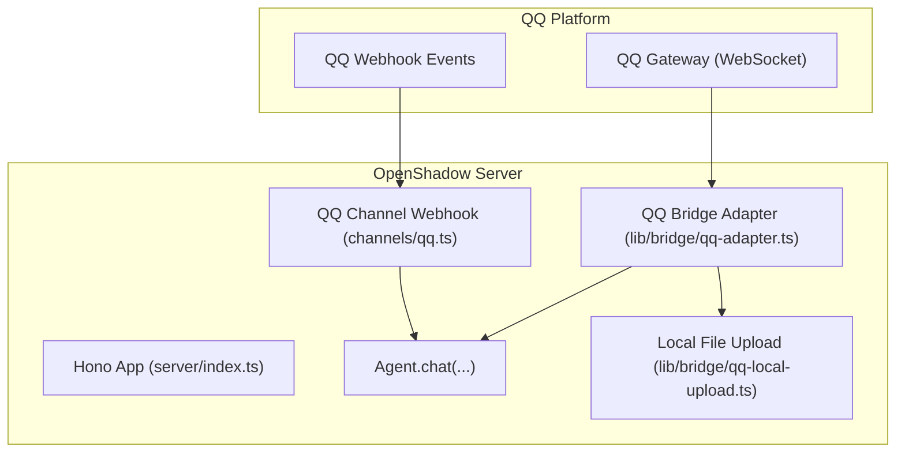
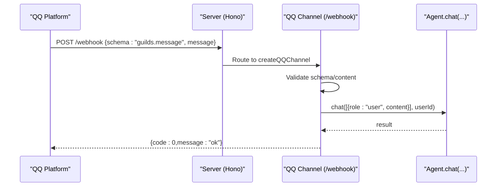
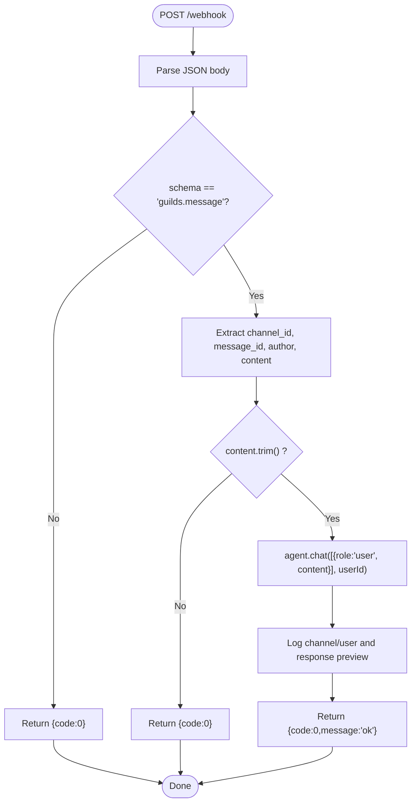
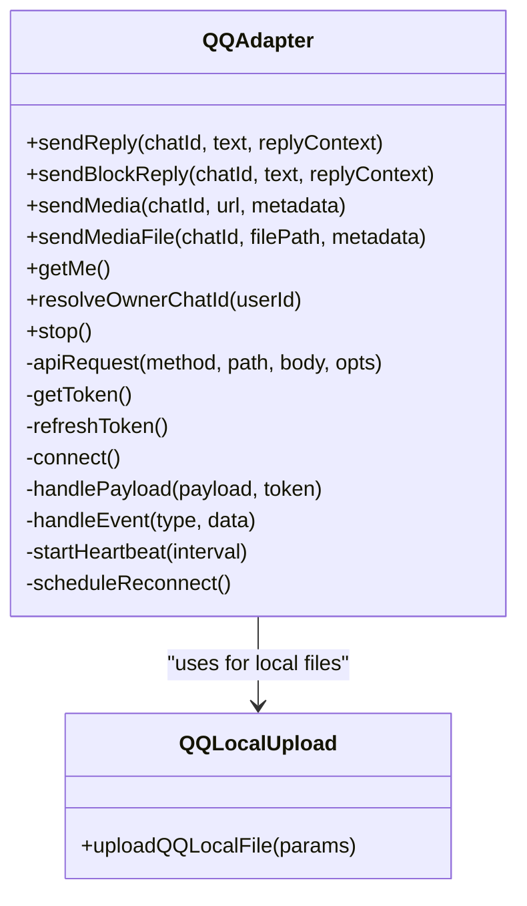
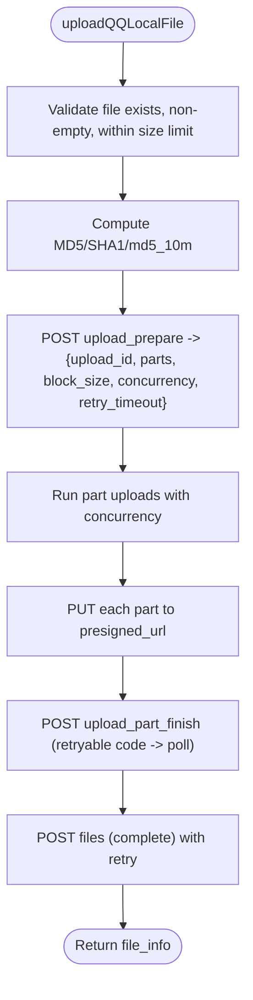
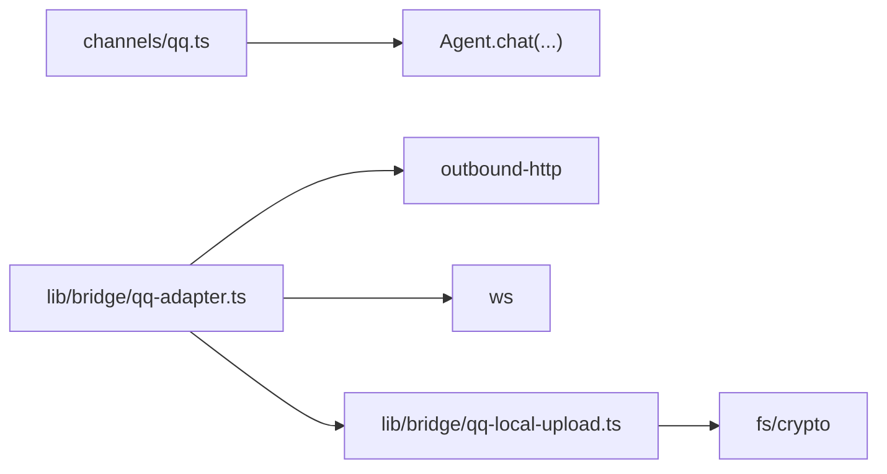

# QQ Integration

<cite>
**Referenced Files in This Document**
- [qq.ts](file://channels/qq.ts)
- [qq-adapter.ts](file://lib/bridge/qq-adapter.ts)
- [qq-local-upload.ts](file://lib/bridge/qq-local-upload.ts)
- [config.ts](file://core/config.ts)
- [index.ts](file://server/index.ts)
- [channel-manager.ts](file://core/channel-manager.ts)
</cite>

## Table of Contents
1. [Introduction](#introduction)
2. [Project Structure](#project-structure)
3. [Core Components](#core-components)
4. [Architecture Overview](#architecture-overview)
5. [Detailed Component Analysis](#detailed-component-analysis)
6. [Dependency Analysis](#dependency-analysis)
7. [Performance Considerations](#performance-considerations)
8. [Troubleshooting Guide](#troubleshooting-guide)
9. [Conclusion](#conclusion)
10. [Appendices](#appendices)

## Introduction
This document explains how the project integrates with the QQ messaging platform. It covers two integration approaches:
- A lightweight webhook channel that accepts events from QQ Open Platform and routes them to the internal agent.
- A full-featured QQ bridge adapter using QQ v2 API (AppID/AppSecret), WebSocket event streaming, rich media upload/send, group chat handling, user mentions, and robust connection management.

You will learn how to register a QQ bot, configure credentials, route messages, handle different message formats, manage groups and mentions, send attachments, and implement resilient connection and error recovery strategies.

## Project Structure
The QQ integration spans several modules:
- channels/qq.ts: Minimal Hono-based HTTP webhook endpoint for receiving QQ events and delegating to the agent.
- lib/bridge/qq-adapter.ts: Full QQ v2 client implementing authentication, WebSocket lifecycle, event normalization, reply sending, and rich media support.
- lib/bridge/qq-local-upload.ts: Chunked local file upload flow to QQ’s CDN via presigned URLs.
- core/config.ts: Configuration schema including QQ channel fields (appId/appSecret).
- server/index.ts: Server bootstrap and route mounting; can be extended to mount QQ endpoints.
- core/channel-manager.ts: Channel membership and delivery orchestration used by other parts of the system.

**Diagram sources**
- [index.ts:1-320](file://server/index.ts#L1-L320)
- [qq.ts:1-70](file://channels/qq.ts#L1-L70)
- [qq-adapter.ts:1-714](file://lib/bridge/qq-adapter.ts#L1-L714)
- [qq-local-upload.ts:1-297](file://lib/bridge/qq-local-upload.ts#L1-L297)

**Section sources**
- [qq.ts:1-70](file://channels/qq.ts#L1-L70)
- [qq-adapter.ts:1-714](file://lib/bridge/qq-adapter.ts#L1-L714)
- [qq-local-upload.ts:1-297](file://lib/bridge/qq-local-upload.ts#L1-L297)
- [config.ts:1-384](file://core/config.ts#L1-L384)
- [index.ts:1-320](file://server/index.ts#L1-L320)

## Core Components
- QQ Channel Webhook (channels/qq.ts): Accepts POST /webhook events, validates payload, extracts content, and calls agent.chat with the sender ID. Provides a health check and a simple standalone server helper.
- QQ Bridge Adapter (lib/bridge/qq-adapter.ts): Implements QQ v2 OAuth token refresh, gateway discovery, WebSocket identify/resume, heartbeat, event dispatching (C2C, group AT, channel AT, direct message), normalized message model, reply routing, and rich media send/upload flows.
- Local File Upload (lib/bridge/qq-local-upload.ts): Handles chunked uploads to QQ via presigned URLs, computes hashes, retries part finish and complete operations, and enforces size/type limits.
- Configuration (core/config.ts): Defines channels.qq with appId/appSecret and provides ConfigManager utilities.
- Server Bootstrap (server/index.ts): Initializes engine, mounts routes, and starts HTTP service; extensible to include QQ channel or bridge initialization.

**Section sources**
- [qq.ts:1-70](file://channels/qq.ts#L1-L70)
- [qq-adapter.ts:1-714](file://lib/bridge/qq-adapter.ts#L1-L714)
- [qq-local-upload.ts:1-297](file://lib/bridge/qq-local-upload.ts#L1-L297)
- [config.ts:1-384](file://core/config.ts#L1-L384)
- [index.ts:1-320](file://server/index.ts#L1-L320)

## Architecture Overview
Two complementary paths exist for integrating with QQ:

- Webhook path: QQ sends events to your server’s /webhook endpoint; the handler delegates to the agent. Suitable for quick setups without persistent connections.
- Bridge path: The adapter connects to QQ’s gateway via WebSocket, receives real-time events, normalizes them, and uses REST APIs to send replies and media.

**Diagram sources**
- [qq.ts:18-55](file://channels/qq.ts#L18-L55)
- [index.ts:160-210](file://server/index.ts#L160-L210)

## Detailed Component Analysis

### QQ Channel Webhook (channels/qq.ts)
Responsibilities:
- Expose GET /health and POST /webhook.
- Parse incoming JSON, skip non-message events, and ignore empty content.
- Extract author.id and channel_id, then call agent.chat with a single user message.
- Return a minimal success response; log basic info and errors.

Key behaviors:
- Event filtering by schema field.
- Simple logging for channel and user identification.
- Error handling returns a 500-like code with message.

**Diagram sources**
- [qq.ts:23-52](file://channels/qq.ts#L23-L52)

**Section sources**
- [qq.ts:1-70](file://channels/qq.ts#L1-L70)

### QQ Bridge Adapter (lib/bridge/qq-adapter.ts)
Responsibilities:
- Authentication: Obtain and cache access_token via QQ’s token endpoint; refresh proactively.
- Connection: Discover gateway URL, establish WebSocket, handle IDENTIFY/RESUME, HEARTBEAT, RECONNECT, INVALID_SESSION.
- Event Handling: Normalize C2C_MESSAGE_CREATE, GROUP_AT_MESSAGE_CREATE, AT_MESSAGE_CREATE, DIRECT_MESSAGE_CREATE into a unified message object.
- Messaging: Send text replies (markdown) with passive reply context (msg_id/msg_seq), and send rich media (images/video/audio/document).
- Media Upload: Two-step process—upload to obtain file_info, then send rich media message.
- Rate Limiting & Backoff: Built-in delays between block replies; reconnect backoff schedule; token refresh timer.

Authentication and Token Management:
- Token retrieval via POST to the token endpoint with appId/clientSecret.
- Cached token with early refresh window.
- Authorization header format: QQBot <token>.

Gateway and WebSocket Lifecycle:
- GET /gateway to obtain connection URL.
- On HELLO: start heartbeat, then IDENTIFY with intents (public guild messages, group and C2C).
- On READY: store session_id and report connected status.
- On RESUMED: resume with last sequence.
- Heartbeat ACK tracking; close and reconnect on timeout.
- Reconnect backoff with capped delays.

Event Normalization:
- Derive principal from author fields (id, user_openid, member_openid).
- Strip mention markers from group AT messages.
- Enforce max message length.
- Attachments extracted from data.attachments with type inference.

Reply Routing:
- Determine target endpoints based on metadata (group/user/channel).
- Build markdown reply bodies; attach passive reply fields for idempotent re-replies.
- Split long texts into chunks and iterate endpoints until success.

Rich Media:
- sendMedia: upload remote URL to QQ, get file_info, then send rich media message.
- sendMediaFile: upload local file via qq-local-upload, then send rich media message.
- sendMediaBuffer: not supported directly; requires staged file.

**Diagram sources**
- [qq-adapter.ts:193-714](file://lib/bridge/qq-adapter.ts#L193-L714)
- [qq-local-upload.ts:47-136](file://lib/bridge/qq-local-upload.ts#L47-L136)

**Section sources**
- [qq-adapter.ts:1-714](file://lib/bridge/qq-adapter.ts#L1-L714)
- [qq-local-upload.ts:1-297](file://lib/bridge/qq-local-upload.ts#L1-L297)

### Local File Upload Flow (lib/bridge/qq-local-upload.ts)
Responsibilities:
- Validate file type and size against QQ limits.
- Compute MD5/SHA1 and optional first-10MB MD5.
- Prepare upload via upload_prepare to receive upload_id, block_size, parts, concurrency, retry_timeout.
- Concurrently PUT each part to presigned URLs.
- Finish each part with upload_part_finish, handling retryable business codes with polling.
- Complete upload via files endpoint with exponential backoff.

**Diagram sources**
- [qq-local-upload.ts:47-136](file://lib/bridge/qq-local-upload.ts#L47-L136)
- [qq-local-upload.ts:234-286](file://lib/bridge/qq-local-upload.ts#L234-L286)

**Section sources**
- [qq-local-upload.ts:1-297](file://lib/bridge/qq-local-upload.ts#L1-L297)

### Configuration and Setup (core/config.ts)
- channels.qq supports appId and appSecret fields.
- ConfigManager loads, merges defaults, and persists configuration.
- Use these fields when initializing the QQ bridge adapter or webhook channel.

Practical steps:
- Add channels.qq.appId and channels.qq.appSecret to config.json.
- Ensure storage/security settings are appropriate for file operations if using local uploads.

**Section sources**
- [config.ts:14-18](file://core/config.ts#L14-L18)
- [config.ts:170-233](file://core/config.ts#L170-L233)

### Server Integration (server/index.ts)
- The server initializes the engine, creates the Hub, and mounts many routes under /api.
- To integrate the QQ channel webhook, you can mount the QQ Hono app at a path (e.g., /qq/webhook) and expose it behind a reverse proxy.
- For the bridge adapter, initialize it during startup with appID/appSecret and wire its onMessage callback to the agent/chat pipeline.

Note: The current server index does not explicitly mount QQ routes; extend it accordingly.

**Section sources**
- [index.ts:116-210](file://server/index.ts#L116-L210)

## Dependency Analysis
High-level dependencies:
- QQ Channel depends on Hono and Agent.chat.
- QQ Adapter depends on outbound HTTP helper, WebSocket library, and local upload module.
- Local Upload depends on Node fs/crypto and the adapter’s apiRequest/outboundHttp.

**Diagram sources**
- [qq.ts:1-70](file://channels/qq.ts#L1-L70)
- [qq-adapter.ts:1-714](file://lib/bridge/qq-adapter.ts#L1-L714)
- [qq-local-upload.ts:1-297](file://lib/bridge/qq-local-upload.ts#L1-L297)

**Section sources**
- [qq.ts:1-70](file://channels/qq.ts#L1-L70)
- [qq-adapter.ts:1-714](file://lib/bridge/qq-adapter.ts#L1-L714)
- [qq-local-upload.ts:1-297](file://lib/bridge/qq-local-upload.ts#L1-L297)

## Performance Considerations
- Message splitting: Long replies are split into chunks to respect QQ limits.
- Concurrency: Local file upload uses configurable concurrency for parts; tune based on network conditions.
- Heartbeat: Adaptive interval with ACK monitoring prevents stale connections.
- Reconnect backoff: Exponential delays reduce pressure on QQ servers during outages.
- Token refresh: Proactive refresh avoids mid-request failures.

[No sources needed since this section provides general guidance]

## Troubleshooting Guide
Common issues and remedies:
- Webhook not received: Verify external exposure of /webhook and correct schema filtering.
- No replies sent: Check endpoint selection logic (group/user/channel) and passive reply context fields.
- Media upload fails: Confirm file size/type limits and presigned URL availability; inspect retryable business codes and retry timeouts.
- Frequent disconnects: Inspect heartbeat ACK and reconnect logs; ensure stable network and proxy settings.
- Token errors: Validate appId/appSecret and network reachability to token/gateway endpoints.

Operational tips:
- Enable debug logs for bridge stages (token, gateway, send_reply, media_upload).
- Monitor status callbacks for connected/error states.
- Keep retry timeouts aligned with QQ’s guidance for part finish completion.

**Section sources**
- [qq-adapter.ts:321-412](file://lib/bridge/qq-adapter.ts#L321-L412)
- [qq-adapter.ts:556-567](file://lib/bridge/qq-adapter.ts#L556-L567)
- [qq-local-upload.ts:234-286](file://lib/bridge/qq-local-upload.ts#L234-L286)

## Conclusion
The project offers both a simple webhook-based QQ integration and a production-grade bridge adapter with robust authentication, real-time event handling, rich media support, and resilient connection management. Use the webhook for quick setups and the bridge adapter for comprehensive features like group chats, mentions, and file attachments. Configure credentials in config.json and extend the server bootstrap to mount or initialize the chosen integration path.

[No sources needed since this section summarizes without analyzing specific files]

## Appendices

### Setup Checklist
- Register a QQ bot on QQ Open Platform and obtain appId/appSecret.
- Add channels.qq.appId and channels.qq.appSecret to config.json.
- Choose integration path:
  - Webhook: Mount QQ channel at /qq/webhook and point QQ to your public endpoint.
  - Bridge: Initialize QQ adapter at startup with appID/appSecret and wire onMessage to agent/chat.
- For media: Ensure outbound HTTP and WebSocket proxies are configured if required.
- Test health endpoints and verify status transitions (connected/error).

**Section sources**
- [config.ts:14-18](file://core/config.ts#L14-L18)
- [qq.ts:18-55](file://channels/qq.ts#L18-L55)
- [qq-adapter.ts:193-269](file://lib/bridge/qq-adapter.ts#L193-L269)