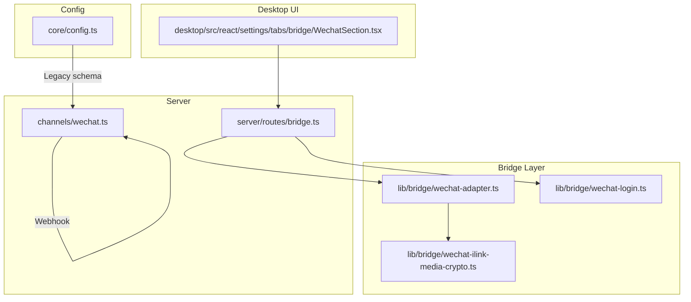
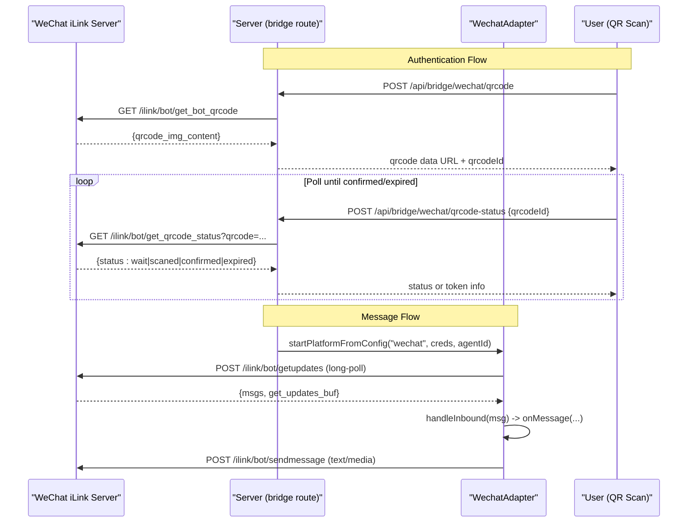
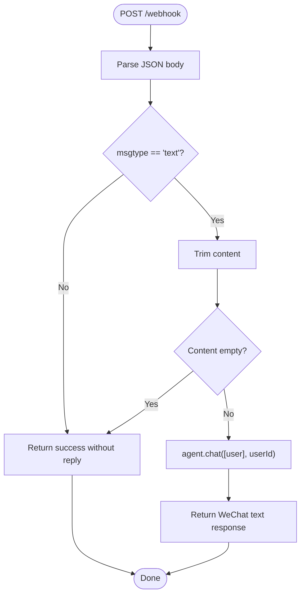
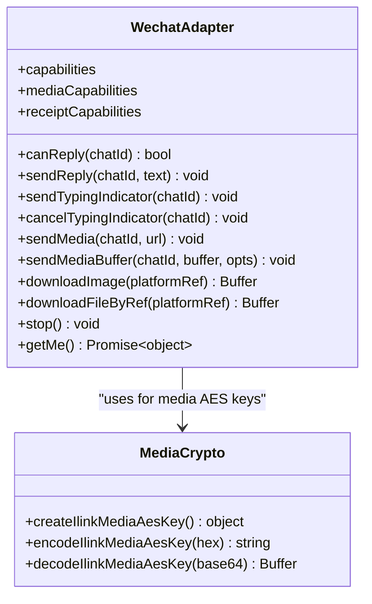
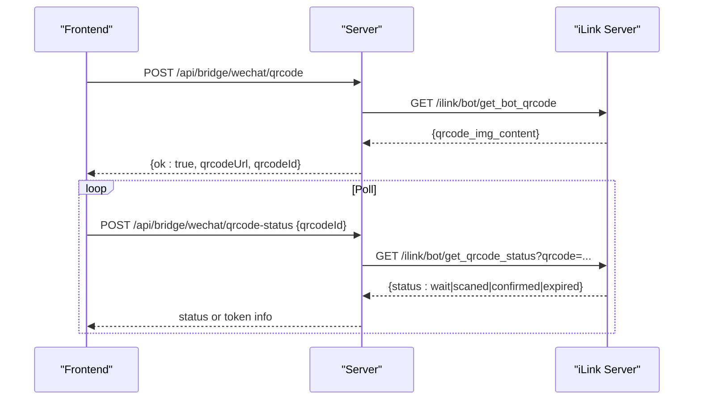
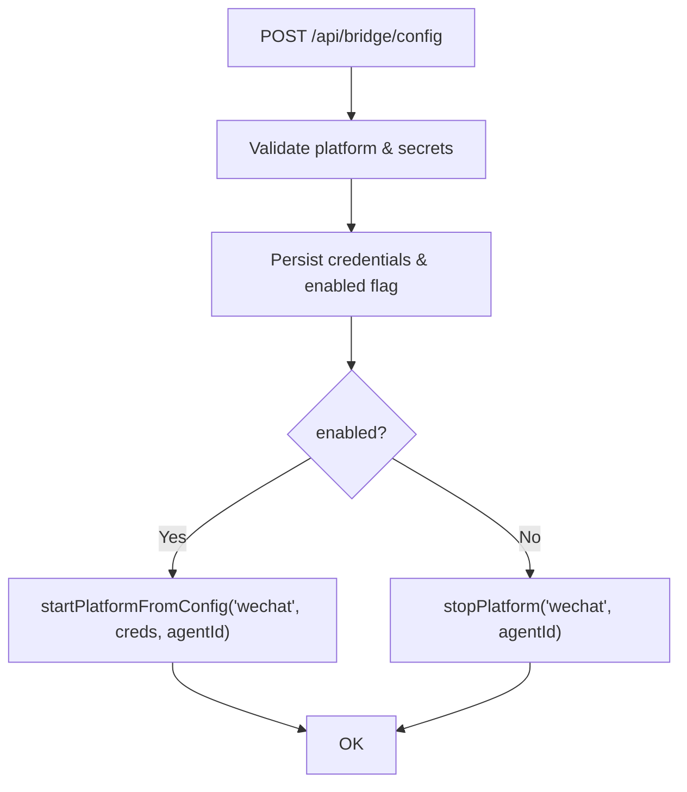
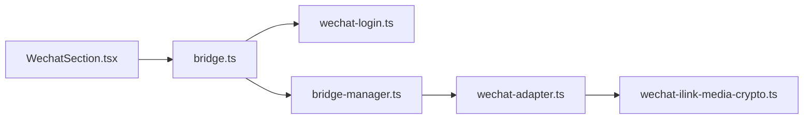

# WeChat Integration

<cite>
**Referenced Files in This Document**
- [channels/wechat.ts](file://channels/wechat.ts)
- [lib/bridge/wechat-adapter.ts](file://lib/bridge/wechat-adapter.ts)
- [lib/bridge/wechat-login.ts](file://lib/bridge/wechat-login.ts)
- [lib/bridge/wechat-ilink-media-crypto.ts](file://lib/bridge/wechat-ilink-media-crypto.ts)
- [server/routes/bridge.ts](file://server/routes/bridge.ts)
- [desktop/src/react/settings/tabs/bridge/WechatSection.tsx](file://desktop/src/react/settings/tabs/bridge/WechatSection.tsx)
- [core/config.ts](file://core/config.ts)
</cite>

## Table of Contents
1. [Introduction](#introduction)
2. [Project Structure](#project-structure)
3. [Core Components](#core-components)
4. [Architecture Overview](#architecture-overview)
5. [Detailed Component Analysis](#detailed-component-analysis)
6. [Dependency Analysis](#dependency-analysis)
7. [Performance Considerations](#performance-considerations)
8. [Troubleshooting Guide](#troubleshooting-guide)
9. [Conclusion](#conclusion)

## Introduction
This document explains the WeChat integration in the project, covering two complementary approaches:
- Webhook-based channel for WeChat Official Account or Enterprise WeChat (simple text handling).
- iLink Bridge adapter for WeChat Bot using long-polling, QR code authentication, typing indicators, and media upload/download.

It also documents configuration, multi-account support, message processing flows, platform-specific features, API limitations, compliance considerations, and troubleshooting guidance.

## Project Structure
The WeChat integration spans server routes, bridge adapters, login utilities, and desktop settings UI. The key areas are:
- channels/wechat.ts: Minimal Hono-based webhook channel for text messages.
- lib/bridge/*: iLink-based adapter, QR login helpers, and media crypto utilities.
- server/routes/bridge.ts: REST endpoints to manage bridge credentials, enable/disable platforms, and handle QR login flows.
- desktop/src/react/settings/tabs/bridge/WechatSection.tsx: Settings UI for enabling/disabling WeChat and unbinding accounts.
- core/config.ts: Legacy channels schema including a placeholder for WeChat enterprise fields.

**Diagram sources**
- [server/routes/bridge.ts](file://server/routes/bridge.ts)
- [channels/wechat.ts](file://channels/wechat.ts)
- [lib/bridge/wechat-adapter.ts](file://lib/bridge/wechat-adapter.ts)
- [lib/bridge/wechat-login.ts](file://lib/bridge/wechat-login.ts)
- [lib/bridge/wechat-ilink-media-crypto.ts](file://lib/bridge/wechat-ilink-media-crypto.ts)
- [desktop/src/react/settings/tabs/bridge/WechatSection.tsx](file://desktop/src/react/settings/tabs/bridge/WechatSection.tsx)
- [core/config.ts](file://core/config.ts)

**Section sources**
- [channels/wechat.ts](file://channels/wechat.ts)
- [lib/bridge/wechat-adapter.ts](file://lib/bridge/wechat-adapter.ts)
- [lib/bridge/wechat-login.ts](file://lib/bridge/wechat-login.ts)
- [lib/bridge/wechat-ilink-media-crypto.ts](file://lib/bridge/wechat-ilink-media-crypto.ts)
- [server/routes/bridge.ts](file://server/routes/bridge.ts)
- [desktop/src/react/settings/tabs/bridge/WechatSection.tsx](file://desktop/src/react/settings/tabs/bridge/WechatSection.tsx)
- [core/config.ts](file://core/config.ts)

## Core Components
- WeChat Webhook Channel: A lightweight Hono app exposing /health and /webhook endpoints. It accepts text messages, forwards them to an agent, and returns a WeChat-compatible JSON response.
- iLink Bridge Adapter: Implements long-polling with ilink/bot/getupdates, manages context tokens per chat, supports typing indicators, and handles media uploads/downloads via CDN with AES encryption.
- QR Login Module: Provides getWechatQrcode and pollWechatQrcodeStatus to obtain and monitor QR scan results, returning botToken and related identifiers.
- Media Crypto Utilities: Encodes/decodes AES keys used by iLink media operations.
- Server Routes: Expose endpoints to configure bridge credentials, toggle platform enablement, test connectivity, and drive QR login flows.
- Desktop Settings UI: Allows users to enable/disable WeChat, unbind owner, and shows connection status.

**Section sources**
- [channels/wechat.ts](file://channels/wechat.ts)
- [lib/bridge/wechat-adapter.ts](file://lib/bridge/wechat-adapter.ts)
- [lib/bridge/wechat-login.ts](file://lib/bridge/wechat-login.ts)
- [lib/bridge/wechat-ilink-media-crypto.ts](file://lib/bridge/wechat-ilink-media-crypto.ts)
- [server/routes/bridge.ts](file://server/routes/bridge.ts)
- [desktop/src/react/settings/tabs/bridge/WechatSection.tsx](file://desktop/src/react/settings/tabs/bridge/WechatSection.tsx)

## Architecture Overview
Two integration paths exist:
- Webhook path: External WeChat service posts to /webhook; server processes text and responds.
- iLink Bridge path: Server polls WeChat iLink for updates, authenticates via QR, and sends replies/media through iLink APIs.

**Diagram sources**
- [server/routes/bridge.ts](file://server/routes/bridge.ts)
- [lib/bridge/wechat-login.ts](file://lib/bridge/wechat-login.ts)
- [lib/bridge/wechat-adapter.ts](file://lib/bridge/wechat-adapter.ts)

## Detailed Component Analysis

### WeChat Webhook Channel
- Purpose: Provide a simple HTTP endpoint for WeChat Official Account or Enterprise WeChat to deliver text messages.
- Endpoints:
  - GET /health: Health check.
  - POST /webhook: Accepts WeChat message payload, validates text content, calls agent.chat, and returns a WeChat-compatible JSON response.
- Behavior:
  - Only processes text messages; ignores other types.
  - Uses userId from fromUserName or defaults to 'default'.
  - Returns error-friendly text if processing fails.

**Diagram sources**
- [channels/wechat.ts](file://channels/wechat.ts)

**Section sources**
- [channels/wechat.ts](file://channels/wechat.ts)

### iLink Bridge Adapter
- Purpose: Implement full-featured WeChat Bot integration using iLink protocol.
- Key responsibilities:
  - Long-polling for inbound messages via ilink/bot/getupdates.
  - Managing context_token per chatId for reply eligibility.
  - Typing indicators via ilink/bot/getconfig and ilink/bot/sendtyping.
  - Media upload/download with AES-128-ECB encryption and CDN URLs.
  - Robust error handling, backoff, and session expiration detection.
- Data persistence:
  - Sync buffer (get_updates_buf) persisted under bridge/wechat/sync-*.json.
  - Context cache (context_token) persisted under bridge/wechat/context-*.json.
- Capabilities:
  - Text sendReply with chunking for long messages.
  - Media sendMediaBuffer for images/files.
  - Download handlers for incoming media attachments.

**Diagram sources**
- [lib/bridge/wechat-adapter.ts](file://lib/bridge/wechat-adapter.ts)
- [lib/bridge/wechat-ilink-media-crypto.ts](file://lib/bridge/wechat-ilink-media-crypto.ts)

**Section sources**
- [lib/bridge/wechat-adapter.ts](file://lib/bridge/wechat-adapter.ts)
- [lib/bridge/wechat-ilink-media-crypto.ts](file://lib/bridge/wechat-ilink-media-crypto.ts)

### QR Code Authentication Flow
- Purpose: Obtain botToken and related identifiers via QR scan.
- Steps:
  - Request QR code via /api/bridge/wechat/qrcode.
  - Display QR to user; poll /api/bridge/wechat/qrcode-status until confirmed or expired.
  - On confirmed, store botToken and enable platform.

**Diagram sources**
- [server/routes/bridge.ts](file://server/routes/bridge.ts)
- [lib/bridge/wechat-login.ts](file://lib/bridge/wechat-login.ts)

**Section sources**
- [server/routes/bridge.ts](file://server/routes/bridge.ts)
- [lib/bridge/wechat-login.ts](file://lib/bridge/wechat-login.ts)

### Server Bridge Routes
- Configuration management:
  - POST /api/bridge/config: Save credentials (including wechat.botToken), toggle enabled flag, start/stop platform.
  - POST /api/bridge/owner: Set or clear owner user for a platform.
  - GET /api/bridge/status: Return platform statuses, including configured flags and masked tokens.
- QR endpoints:
  - POST /api/bridge/wechat/qrcode: Generate QR code.
  - POST /api/bridge/wechat/qrcode-status: Poll QR status.
- Connectivity test:
  - Tests iLink getconfig with provided botToken to validate connection.

**Diagram sources**
- [server/routes/bridge.ts](file://server/routes/bridge.ts)

**Section sources**
- [server/routes/bridge.ts](file://server/routes/bridge.ts)

### Desktop Settings UI
- Displays WeChat section with status dot and text.
- Toggle enables/disables WeChat; requires prior QR scan to have a token.
- Unbind action clears botToken and owner, then reloads state.

**Section sources**
- [desktop/src/react/settings/tabs/bridge/WechatSection.tsx](file://desktop/src/react/settings/tabs/bridge/WechatSection.tsx)

### Legacy Channels Schema
- core/config.ts includes a legacy channels.wechat entry with corpId and secret placeholders. This is not used by the iLink bridge but may be referenced by older integrations.

**Section sources**
- [core/config.ts](file://core/config.ts)

## Dependency Analysis
- Server routes depend on bridge manager and dynamically import QR login module.
- WechatAdapter depends on media crypto utilities and uses AbortController for lifecycle control.
- Desktop UI interacts with server routes to manage configuration and QR flow.

**Diagram sources**
- [server/routes/bridge.ts](file://server/routes/bridge.ts)
- [lib/bridge/wechat-login.ts](file://lib/bridge/wechat-login.ts)
- [lib/bridge/wechat-adapter.ts](file://lib/bridge/wechat-adapter.ts)
- [lib/bridge/wechat-ilink-media-crypto.ts](file://lib/bridge/wechat-ilink-media-crypto.ts)

**Section sources**
- [server/routes/bridge.ts](file://server/routes/bridge.ts)
- [lib/bridge/wechat-adapter.ts](file://lib/bridge/wechat-adapter.ts)
- [lib/bridge/wechat-login.ts](file://lib/bridge/wechat-login.ts)
- [lib/bridge/wechat-ilink-media-crypto.ts](file://lib/bridge/wechat-ilink-media-crypto.ts)

## Performance Considerations
- Long-polling timeout: The adapter uses a fixed timeout for getupdates to avoid indefinite waits.
- Backoff strategy: Consecutive failures trigger exponential-like delays capped at defined values.
- Message chunking: Long texts are split into chunks to respect platform limits.
- Media upload: Encrypts payloads before uploading to CDN; ensure network stability and size limits are considered.
- Context token TTL: Cached context tokens expire after a day; stale tokens require re-authentication.

[No sources needed since this section provides general guidance]

## Troubleshooting Guide
Common issues and resolutions:
- Session expired (errcode -14): Indicates invalid or expired botToken. Re-run QR login to obtain a new token.
- Missing context_token: Cannot reply until the user has sent a recent message; ensure conversation is active.
- Typing indicator failures: Requires valid context_token and successful getconfig call; verify permissions and token.
- Media upload/download errors: Check CDN responses and AES key encoding; ensure correct MIME types and file sizes.
- Platform disabled: Ensure enabled flag is true and credentials saved; restart platform via config update.

**Section sources**
- [lib/bridge/wechat-adapter.ts](file://lib/bridge/wechat-adapter.ts)
- [server/routes/bridge.ts](file://server/routes/bridge.ts)

## Conclusion
The project offers both a simple webhook channel and a robust iLink bridge for WeChat integration. The bridge supports QR authentication, typing indicators, and secure media handling, while adhering to platform constraints such as rate limits and context requirements. Use the server routes and desktop UI to configure and manage WeChat connections, and follow the troubleshooting guidance for common operational issues.