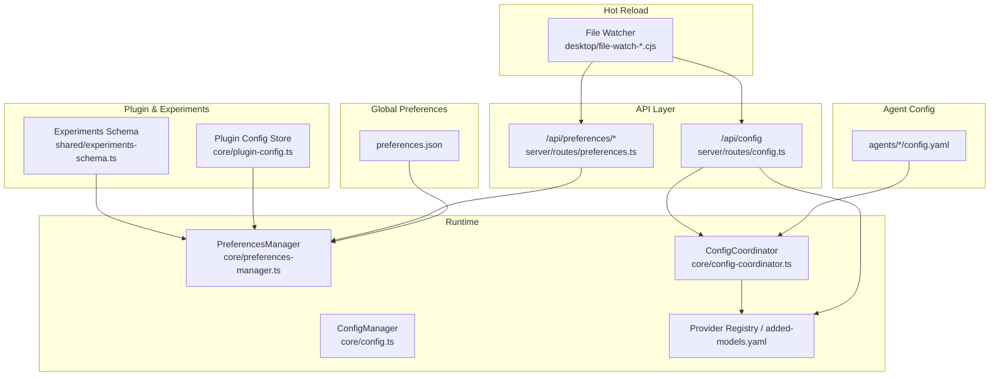
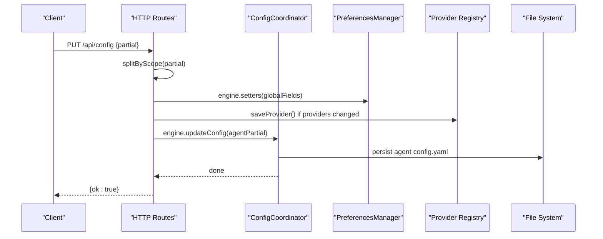
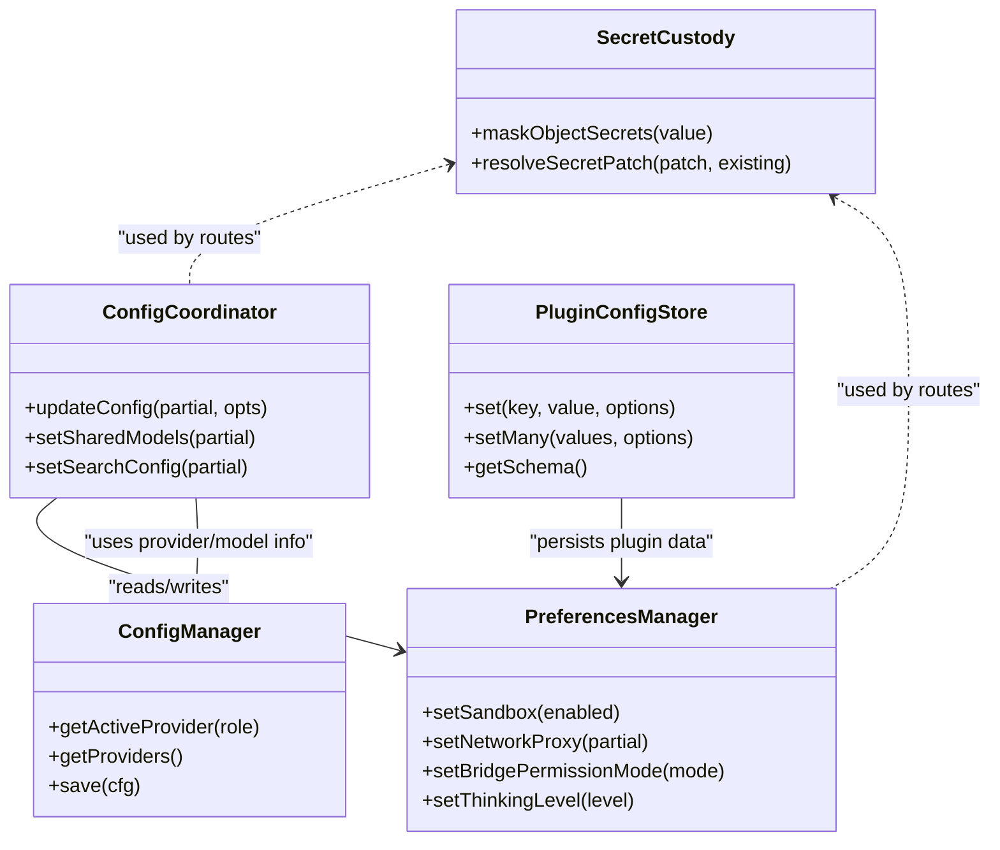

# Configuration Management

<cite>
**Referenced Files in This Document**
- [config.yaml](file://config.yaml)
- [lib/config.example.yaml](file://lib/config.example.yaml)
- [core/config.ts](file://core/config.ts)
- [shared/config-schema.ts](file://shared/config-schema.ts)
- [shared/config-scope.ts](file://shared/config-scope.ts)
- [shared/migrate-config-scope.ts](file://shared/migrate-config-scope.ts)
- [core/preferences-manager.ts](file://core/preferences-manager.ts)
- [core/config-coordinator.ts](file://core/config-coordinator.ts)
- [server/routes/config.ts](file://server/routes/config.ts)
- [server/routes/preferences.ts](file://server/routes/preferences.ts)
- [shared/secret-custody.ts](file://shared/secret-custody.ts)
- [server/routes/provider-credentials.ts](file://server/routes/provider-credentials.ts)
- [core/plugin-config.ts](file://core/plugin-config.ts)
- [shared/experiments-schema.ts](file://shared/experiments-schema.ts)
- [desktop/file-watch-adapter.cjs](file://desktop/file-watch-adapter.cjs)
- [desktop/file-watch-registry.cjs](file://desktop/file-watch-registry.cjs)
</cite>

## Table of Contents
1. Introduction
2. Project Structure
3. Core Components
4. Architecture Overview
5. Detailed Component Analysis
6. Dependency Analysis
7. Performance Considerations
8. Troubleshooting Guide
9. Conclusion
10. Appendices

## Introduction
This document explains the configuration management system for runtime settings and environment management. It covers configuration file structure, environment variables, preference management, validation, hot-reloading, schema definitions, inheritance and scoping, migration procedures, security and secret handling, backup strategies, best practices, troubleshooting, and automation guidance. The goal is to provide a comprehensive yet accessible guide for configuring providers, agents, plugins, and system settings.

## Project Structure
Configuration spans multiple layers:
- Agent-level YAML config files (per-agent)
- Global preferences JSON (user-wide)
- Runtime provider registry and secrets
- Plugin-scoped configuration with schemas
- Experiment feature flags
- HTTP routes that expose read/write APIs
- File watching for hot-reload behavior

**Diagram sources**
- [core/config.ts:1-384](file://core/config.ts#L1-L384)
- [core/preferences-manager.ts:1-800](file://core/preferences-manager.ts#L1-L800)
- [core/config-coordinator.ts:1-619](file://core/config-coordinator.ts#L1-L619)
- [server/routes/config.ts:1-757](file://server/routes/config.ts#L1-L757)
- [server/routes/preferences.ts:1-542](file://server/routes/preferences.ts#L1-L542)
- [core/plugin-config.ts:1-274](file://core/plugin-config.ts#L1-L274)
- [shared/experiments-schema.ts:1-53](file://shared/experiments-schema.ts#L1-L53)
- [desktop/file-watch-adapter.cjs:1-34](file://desktop/file-watch-adapter.cjs#L1-L34)
- [desktop/file-watch-registry.cjs:70-124](file://desktop/file-watch-registry.cjs#L70-L124)

**Section sources**
- [config.yaml:1-19](file://config.yaml#L1-L19)
- [lib/config.example.yaml:1-17](file://lib/config.example.yaml#L1-L17)
- [core/config.ts:1-384](file://core/config.ts#L1-L384)
- [shared/config-schema.ts:1-47](file://shared/config-schema.ts#L1-L47)
- [shared/config-scope.ts:1-72](file://shared/config-scope.ts#L1-L72)
- [shared/migrate-config-scope.ts:1-149](file://shared/migrate-config-scope.ts#L1-L149)
- [core/preferences-manager.ts:1-800](file://core/preferences-manager.ts#L1-L800)
- [core/config-coordinator.ts:1-619](file://core/config-coordinator.ts#L1-L619)
- [server/routes/config.ts:1-757](file://server/routes/config.ts#L1-L757)
- [server/routes/preferences.ts:1-542](file://server/routes/preferences.ts#L1-L542)
- [core/plugin-config.ts:1-274](file://core/plugin-config.ts#L1-L274)
- [shared/experiments-schema.ts:1-53](file://shared/experiments-schema.ts#L1-L53)
- [desktop/file-watch-adapter.cjs:1-34](file://desktop/file-watch-adapter.cjs#L1-L34)
- [desktop/file-watch-registry.cjs:70-124](file://desktop/file-watch-registry.cjs#L70-L124)

## Core Components
- ConfigManager: Loads and merges defaults with persisted config; resolves active provider from multi-provider registry or legacy fields; exposes helpers for agent, storage, security, scheduler, logging, theme, language, memory, and wizard state.
- PreferencesManager: Manages global user preferences (JSON), including sandbox, network proxy, bridge permissions, notifications, quick chat, browser, appearance, plugin UI, thinking level, update channel, and more. Provides normalization and safe atomic writes.
- ConfigCoordinator: Orchestrates per-agent model selection, shared models, search config, utility API, heartbeat master, channels master, and syncs changes to runtime components.
- API Routes: Provide REST endpoints to read/update configuration, manage providers, credentials, and preferences; enforce scopes and mask secrets.
- Secret Custody: Centralized masking and patch resolution for secrets across configuration updates.
- Plugin Config Store: Schema-driven scoped configuration for plugins with validation and redaction.
- Experiments Schema: Normalizes and validates experiment definitions and values.

**Section sources**
- [core/config.ts:1-384](file://core/config.ts#L1-L384)
- [core/preferences-manager.ts:1-800](file://core/preferences-manager.ts#L1-L800)
- [core/config-coordinator.ts:1-619](file://core/config-coordinator.ts#L1-L619)
- [server/routes/config.ts:1-757](file://server/routes/config.ts#L1-L757)
- [server/routes/preferences.ts:1-542](file://server/routes/preferences.ts#L1-L542)
- [shared/secret-custody.ts:1-107](file://shared/secret-custody.ts#L1-L107)
- [core/plugin-config.ts:1-274](file://core/plugin-config.ts#L1-L274)
- [shared/experiments-schema.ts:1-53](file://shared/experiments-schema.ts#L1-L53)

## Architecture Overview
The configuration system follows a layered approach:
- Per-agent YAML config defines agent-specific settings (e.g., home folder, heartbeat).
- Global preferences store user-wide settings and cross-agent features.
- Provider registry and added-models.yaml define available LLM backends and their credentials.
- API layer enforces authorization scopes, masks secrets, and triggers runtime updates.
- Hot reload via file watchers enables live updates without restarts.

**Diagram sources**
- [server/routes/config.ts:295-405](file://server/routes/config.ts#L295-L405)
- [shared/config-scope.ts:11-47](file://shared/config-scope.ts#L11-L47)
- [core/config-coordinator.ts:464-518](file://core/config-coordinator.ts#L464-L518)
- [core/preferences-manager.ts:96-107](file://core/preferences-manager.ts#L96-L107)

**Section sources**
- [server/routes/config.ts:1-757](file://server/routes/config.ts#L1-L757)
- [server/routes/preferences.ts:1-542](file://server/routes/preferences.ts#L1-L542)
- [shared/config-scope.ts:1-72](file://shared/config-scope.ts#L1-L72)
- [core/config-coordinator.ts:1-619](file://core/config-coordinator.ts#L1-L619)
- [core/preferences-manager.ts:1-800](file://core/preferences-manager.ts#L1-L800)

## Detailed Component Analysis

### Configuration File Structure and Environment Variables
- Agent-level YAML:
  - Example keys include agent identity, memory toggles, desk heartbeat settings, user name, and preferences container.
  - See example and actual config files for structure.
- Environment variables:
  - AGENT_MODEL, AGENT_API_KEY, AGENT_BASE_URL influence default provider resolution when no explicit provider is configured.
  - ALLOWED_PATHS influences allowed storage paths.
- Defaults and merging:
  - ConfigManager merges defaults with saved config; arrays like providers are fully overridden rather than merged.

Practical examples:
- Configure a provider by adding entries to the provider registry and referencing them via models.role = "providerId::modelName".
- Set heartbeat interval and enable/disable heartbeat at agent scope.
- Define user name and memory toggle at agent scope.

**Section sources**
- [config.yaml:1-19](file://config.yaml#L1-L19)
- [lib/config.example.yaml:1-17](file://lib/config.example.yaml#L1-L17)
- [core/config.ts:111-162](file://core/config.ts#L111-L162)
- [core/config.ts:269-315](file://core/config.ts#L269-L315)

### Preference Management System
- Global preferences cover:
  - Sandbox mode and network access
  - Bridge permission modes and streaming options
  - Notifications, quick chat, browser preferences
  - Appearance, editor typography, sidebar UI
  - Thinking level, update channel, keep awake
  - Computer Use settings and approvals
  - Workspace UI state and history
- Atomic writes and read-back verification ensure consistency.
- Normalization functions standardize complex objects before persistence.

Best practices:
- Prefer using setters on PreferencesManager to ensure normalization and validation.
- Avoid writing raw JSON directly unless you understand normalization requirements.

**Section sources**
- [core/preferences-manager.ts:96-107](file://core/preferences-manager.ts#L96-L107)
- [core/preferences-manager.ts:148-187](file://core/preferences-manager.ts#L148-L187)
- [core/preferences-manager.ts:232-303](file://core/preferences-manager.ts#L232-L303)
- [core/preferences-manager.ts:426-492](file://core/preferences-manager.ts#L426-L492)
- [core/preferences-manager.ts:553-563](file://core/preferences-manager.ts#L553-L563)
- [core/preferences-manager.ts:752-786](file://core/preferences-manager.ts#L752-L786)

### Configuration Validation and Schema Definitions
- Global field schema:
  - CONFIG_SCHEMA declares which fields are global vs agent scope, with optional setter/getter names and prefsPath mapping.
- Scope splitting and injection:
  - splitByScope separates incoming patches into global and agent parts based on schema.
  - injectGlobalFields populates responses with engine-provided global values.
- Plugin configuration:
  - PluginConfigStore validates against normalized schemas, supports types, enums, sensitive fields, and scoped buckets (global/per-agent/per-session).
- Experiments:
  - normalizeExperimentDefinition validates experiment metadata and value schemas.

Validation outcomes:
- Unknown fields, wrong scope, invalid enum/type errors are reported.
- Sensitive fields can be redacted in outputs.

**Section sources**
- [shared/config-schema.ts:22-43](file://shared/config-schema.ts#L22-L43)
- [shared/config-scope.ts:11-47](file://shared/config-scope.ts#L11-L47)
- [shared/config-scope.ts:55-71](file://shared/config-scope.ts#L55-L71)
- [core/plugin-config.ts:24-39](file://core/plugin-config.ts#L24-L39)
- [core/plugin-config.ts:131-155](file://core/plugin-config.ts#L131-L155)
- [core/plugin-config.ts:157-165](file://core/plugin-config.ts#L157-L165)
- [shared/experiments-schema.ts:10-36](file://shared/experiments-schema.ts#L10-L36)

### Hot-Reloading Capabilities
- File watchers monitor configuration files and notify subscribers.
- Debounced change propagation avoids excessive reloads.
- API routes trigger runtime refreshes after provider or config changes.

Operational notes:
- Ensure watchers ignore permission errors and handle atomic writes gracefully.
- Use clearConfigCache and engine.updateConfig to apply changes safely.

**Section sources**
- [desktop/file-watch-adapter.cjs:1-34](file://desktop/file-watch-adapter.cjs#L1-L34)
- [desktop/file-watch-registry.cjs:70-124](file://desktop/file-watch-registry.cjs#L70-L124)
- [server/routes/config.ts:365-379](file://server/routes/config.ts#L365-L379)

### Configuration Inheritance and Scope Management
- Global vs agent scope:
  - Fields declared in CONFIG_SCHEMA with scope 'global' are stored in preferences.json and injected into responses.
  - Unspecified fields default to agent scope and are persisted per agent.
- Migration tooling:
  - migrateConfigScope migrates global fields from agent configs to preferences.json, preserving user intent and backing up originals.

Guidance:
- Keep global settings truly global (e.g., locale, sandbox, update channel).
- Keep agent-specific settings (e.g., home_folder, heartbeat) under agent scope.

**Section sources**
- [shared/config-schema.ts:22-43](file://shared/config-schema.ts#L22-L43)
- [shared/config-scope.ts:11-47](file://shared/config-scope.ts#L11-L47)
- [shared/migrate-config-scope.ts:23-149](file://shared/migrate-config-scope.ts#L23-L149)

### Migration Procedures
- Versioned migrations run once per upgrade, updating both agent configs and preferences.
- Examples include:
  - Cleaning dangling provider references
  - Migrating bridge settings to per-agent
  - Normalizing model refs to composite keys
  - Moving channels.enabled to global preferences
  - Migrating provider catalog v2 cutover
- Each migration persists _dataVersion to prevent re-execution.

Recommendations:
- Always test migrations on backups.
- Log migration actions for auditability.

**Section sources**
- [core/migrations.ts:141-179](file://core/migrations.ts#L141-L179)
- [core/migrations.ts:190-281](file://core/migrations.ts#L190-L281)
- [core/migrations.ts:599-689](file://core/migrations.ts#L599-L689)
- [core/migrations.ts:710-770](file://core/migrations.ts#L710-L770)

### Security, Secrets, and Backup Strategies
- Secret masking:
  - maskObjectSecrets hides known secret keys in responses.
  - resolveSecretPatch preserves masked values during updates.
- Authorization scopes:
  - denyWithoutScope and denySecretMutationWithoutScope protect sensitive mutations.
- Inline provider credential updates:
  - Build updates from api_key/base_url blocks and clear inline fields after saving.
- Backups:
  - Migration tooling creates .pre-scope-migration backups.
  - Atomic writes reduce corruption risk.

Best practices:
- Never log secrets; rely on masking utilities.
- Use provider registry APIs to manage credentials securely.
- Maintain periodic backups of preferences.json and agent configs.

**Section sources**
- [shared/secret-custody.ts:26-45](file://shared/secret-custody.ts#L26-L45)
- [shared/secret-custody.ts:47-66](file://shared/secret-custody.ts#L47-L66)
- [server/routes/config.ts:307-312](file://server/routes/config.ts#L307-L312)
- [server/routes/provider-credentials.ts:10-29](file://server/routes/provider-credentials.ts#L10-L29)
- [shared/migrate-config-scope.ts:131-141](file://shared/migrate-config-scope.ts#L131-L141)

### Practical Configuration Examples
- Providers:
  - Add provider entries via provider registry; reference them in models.role as "providerId::modelName".
  - Update credentials through /api/config with providers block or inline api/embedding/utility_api blocks.
- Agents:
  - Set agent.name, agent.yuan, desk.home_folder, desk.heartbeat_enabled, desk.heartbeat_interval.
- Plugins:
  - Define plugin config schemas with properties, types, enums, and sensitive flags.
  - Use setMany and getSchema to manage plugin configurations safely.
- System settings:
  - Toggle sandbox, network proxy, thinking level, update channel, and keep awake via preferences endpoints.

**Section sources**
- [core/config.ts:269-315](file://core/config.ts#L269-L315)
- [server/routes/config.ts:319-368](file://server/routes/config.ts#L319-L368)
- [server/routes/preferences.ts:137-236](file://server/routes/preferences.ts#L137-L236)
- [core/plugin-config.ts:41-127](file://core/plugin-config.ts#L41-L127)

## Dependency Analysis
Key dependencies and relationships:
- API routes depend on ConfigCoordinator and PreferencesManager for applying changes.
- ConfigCoordinator depends on model manager, skills manager, session coordinator, and hub scheduler.
- PreferencesManager depends on normalization utilities and safe filesystem operations.
- Secret custody utilities are used across routes to mask and resolve secrets.
- File watchers integrate with API routes to support hot reloading.

**Diagram sources**
- [core/config.ts:170-384](file://core/config.ts#L170-L384)
- [core/preferences-manager.ts:148-187](file://core/preferences-manager.ts#L148-L187)
- [core/config-coordinator.ts:464-518](file://core/config-coordinator.ts#L464-L518)
- [shared/secret-custody.ts:26-66](file://shared/secret-custody.ts#L26-L66)
- [core/plugin-config.ts:41-127](file://core/plugin-config.ts#L41-L127)

**Section sources**
- [core/config.ts:1-384](file://core/config.ts#L1-L384)
- [core/preferences-manager.ts:1-800](file://core/preferences-manager.ts#L1-L800)
- [core/config-coordinator.ts:1-619](file://core/config-coordinator.ts#L1-L619)
- [shared/secret-custody.ts:1-107](file://shared/secret-custody.ts#L1-L107)
- [core/plugin-config.ts:1-274](file://core/plugin-config.ts#L1-L274)

## Performance Considerations
- Prefer batched updates (setMany) for plugin configurations to reduce disk I/O.
- Normalize and validate inputs early to avoid repeated processing.
- Use atomic writes to minimize lock contention and corruption risks.
- Debounce file watcher events to prevent thrashing during rapid edits.

[No sources needed since this section provides general guidance]

## Troubleshooting Guide
Common issues and resolutions:
- Invalid JSON body:
  - Ensure requests to /api/config and /api/preferences/* contain valid JSON.
- Missing provider or model:
  - Verify provider exists and models are listed; use /providers endpoints to inspect.
- Secret mutation denied:
  - Check capability scopes; ensure required permissions are granted.
- Hot reload not applied:
  - Confirm file watchers are active and debounce timers are not suppressing updates.
- Migration failures:
  - Review logs for specific migration IDs; restore from backups if necessary.

**Section sources**
- [server/routes/config.ts:295-312](file://server/routes/config.ts#L295-L312)
- [server/routes/preferences.ts:163-173](file://server/routes/preferences.ts#L163-L173)
- [desktop/file-watch-adapter.cjs:1-34](file://desktop/file-watch-adapter.cjs#L1-L34)
- [desktop/file-watch-registry.cjs:70-124](file://desktop/file-watch-registry.cjs#L70-L124)

## Conclusion
The configuration management system combines robust schema-driven validation, secure secret handling, and flexible scoping to support dynamic runtime updates. By leveraging global preferences, per-agent YAML configs, and provider registries, users can tailor behavior across agents, plugins, and system features while maintaining security and reliability.

[No sources needed since this section summarizes without analyzing specific files]

## Appendices

### API Endpoints Summary
- GET /api/config: Read current configuration with masked secrets and injected global fields.
- PUT /api/config: Apply partial updates; handles providers, inline credentials, and agent config.
- GET /api/preferences/models: Read shared models, search config, utility API.
- PUT /api/preferences/models: Update shared models, search config, utility API.
- Additional preferences endpoints for appearance, notifications, quick chat, browser, workspace UI, sidebar UI, plugin UI, and computer use.

**Section sources**
- [server/routes/config.ts:193-242](file://server/routes/config.ts#L193-L242)
- [server/routes/config.ts:295-405](file://server/routes/config.ts#L295-L405)
- [server/routes/preferences.ts:137-236](file://server/routes/preferences.ts#L137-L236)

### Best Practices
- Use setters and validators provided by managers and stores.
- Keep secrets out of logs; rely on masking utilities.
- Prefer provider registry over inline credentials where possible.
- Validate patches before sending to servers.
- Back up preferences.json and agent configs before major upgrades.

[No sources needed since this section provides general guidance]