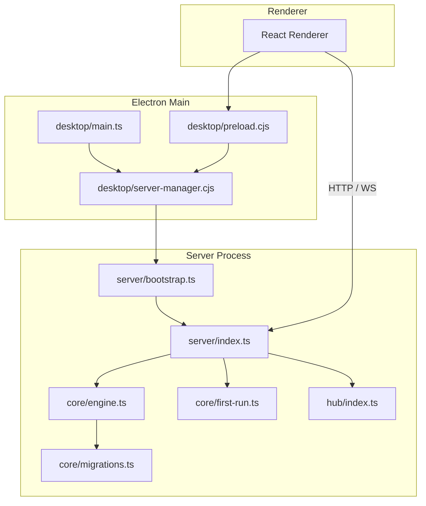
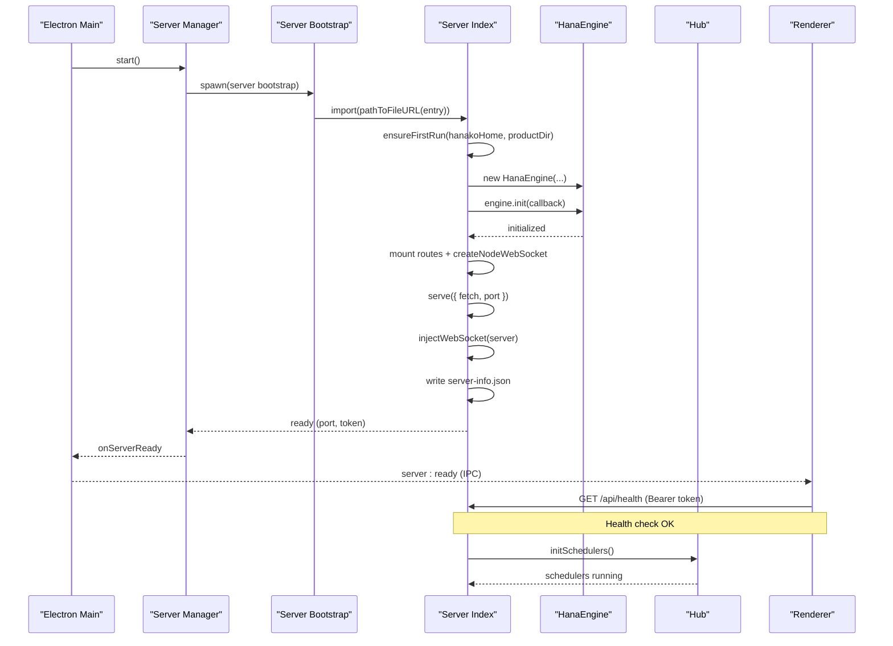
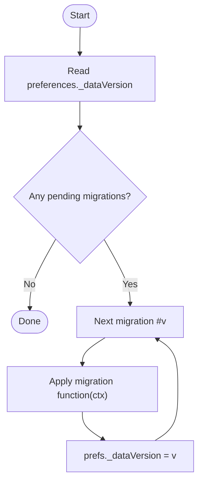
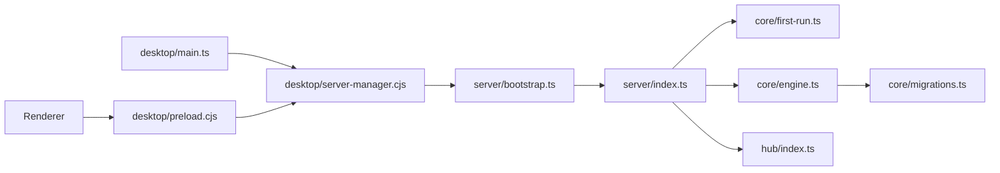

# Application Lifecycle

<cite>
**Referenced Files in This Document**
- [desktop/main.ts](file://desktop/main.ts)
- [desktop/server-manager.cjs](file://desktop/server-manager.cjs)
- [server/bootstrap.ts](file://server/bootstrap.ts)
- [server/index.ts](file://server/index.ts)
- [core/engine.ts](file://core/engine.ts)
- [core/first-run.ts](file://core/first-run.ts)
- [core/migrations.ts](file://core/migrations.ts)
- [hub/index.ts](file://hub/index.ts)
- [db/schema.sql](file://db/schema.sql)
- [desktop/preload.cjs](file://desktop/preload.cjs)
</cite>

## Table of Contents
1. [Introduction](#introduction)
2. [Project Structure](#project-structure)
3. [Core Components](#core-components)
4. [Architecture Overview](#architecture-overview)
5. [Detailed Component Analysis](#detailed-component-analysis)
6. [Dependency Analysis](#dependency-analysis)
7. [Performance Considerations](#performance-considerations)
8. [Troubleshooting Guide](#troubleshooting-guide)
9. [Conclusion](#conclusion)

## Introduction
This document explains OpenShadow’s application lifecycle from Electron bootstrap through server initialization and engine construction. It covers dependency injection order, resource allocation, graceful shutdown, initialization hooks, background task startup, service registration, migration system for data and configuration, error handling and health checks, recovery procedures, cross-process coordination (main, server, renderer), and debugging/profiling techniques for startup issues.

## Project Structure
OpenShadow runs as a multi-process desktop application:
- Electron main process manages the UI window and orchestrates the Node.js server process.
- The server process hosts HTTP/WebSocket APIs, initializes the core engine, and starts background services.
- The renderer process communicates with the main process via preload bridges and calls into the server over HTTP/WebSocket.

**Diagram sources**
- [desktop/main.ts:91-106](file://desktop/main.ts#L91-L106)
- [desktop/server-manager.cjs:160-256](file://desktop/server-manager.cjs#L160-L256)
- [server/bootstrap.ts:17-74](file://server/bootstrap.ts#L17-L74)
- [server/index.ts:116-268](file://server/index.ts#L116-L268)
- [core/engine.ts:241-513](file://core/engine.ts#L241-L513)
- [core/first-run.ts:51-128](file://core/first-run.ts#L51-L128)
- [core/migrations.ts:151-179](file://core/migrations.ts#L151-L179)
- [hub/index.ts:53-85](file://hub/index.ts#L53-L85)
- [desktop/preload.cjs:17-43](file://desktop/preload.cjs#L17-L43)

**Section sources**
- [desktop/main.ts:91-106](file://desktop/main.ts#L91-L106)
- [desktop/server-manager.cjs:160-256](file://desktop/server-manager.cjs#L160-L256)
- [server/bootstrap.ts:17-74](file://server/bootstrap.ts#L17-L74)
- [server/index.ts:116-268](file://server/index.ts#L116-L268)
- [core/engine.ts:241-513](file://core/engine.ts#L241-L513)
- [core/first-run.ts:51-128](file://core/first-run.ts#L51-L128)
- [core/migrations.ts:151-179](file://core/migrations.ts#L151-L179)
- [hub/index.ts:53-85](file://hub/index.ts#L53-L85)
- [desktop/preload.cjs:17-43](file://desktop/preload.cjs#L17-L43)

## Core Components
- Electron main process: creates the BrowserWindow, runs first-run wizard, and delegates server lifecycle to the server manager.
- Server manager: spawns the server process, waits for readiness via server-info.json, performs heartbeat monitoring, and handles graceful shutdown.
- Server bootstrap: ensures keepalive output during heavy imports and dynamically imports the server entry.
- Server index: resolves home directory, seeds first-run defaults, constructs HanaEngine, mounts routes, starts HTTP/WebSocket, writes server-info.json, and exposes health/shutdown endpoints.
- Engine: central runtime that composes managers (agents, sessions, config, models, skills, plugins, media, etc.), runs migrations, and provides APIs used by routes and hub.
- Hub: message routing, scheduler, channel router, and event bus integration; started after engine init.
- Renderer: uses preload IPC to discover server port/token and subscribe to server ready/restart events.

Key responsibilities and interactions are detailed in subsequent sections.

**Section sources**
- [desktop/main.ts:91-106](file://desktop/main.ts#L91-L106)
- [desktop/server-manager.cjs:160-256](file://desktop/server-manager.cjs#L160-L256)
- [server/bootstrap.ts:17-74](file://server/bootstrap.ts#L17-L74)
- [server/index.ts:116-268](file://server/index.ts#L116-L268)
- [core/engine.ts:241-513](file://core/engine.ts#L241-L513)
- [hub/index.ts:53-85](file://hub/index.ts#L53-L85)
- [desktop/preload.cjs:17-43](file://desktop/preload.cjs#L17-L43)

## Architecture Overview
The startup sequence spans three processes and several initialization phases:

**Diagram sources**
- [desktop/server-manager.cjs:160-256](file://desktop/server-manager.cjs#L160-L256)
- [server/bootstrap.ts:17-74](file://server/bootstrap.ts#L17-L74)
- [server/index.ts:116-268](file://server/index.ts#L116-L268)
- [core/engine.ts:241-513](file://core/engine.ts#L241-L513)
- [hub/index.ts:317-328](file://hub/index.ts#L317-L328)
- [desktop/preload.cjs:17-43](file://desktop/preload.cjs#L17-L43)

## Detailed Component Analysis

### Electron Main Process
- Creates the BrowserWindow and loads either dev or packaged renderer.
- Runs a first-run wizard to configure workspace roots if missing.
- Delegates server lifecycle to the server manager.

Startup flow highlights:
- First-run wizard reads/writes user config and sets security options.
- Window is shown when ready-to-show fires.
- App quits when all windows close (non-macOS).

**Section sources**
- [desktop/main.ts:11-45](file://desktop/main.ts#L11-L45)
- [desktop/main.ts:47-89](file://desktop/main.ts#L47-L89)
- [desktop/main.ts:91-106](file://desktop/main.ts#L91-L106)

### Server Manager (Main → Server)
Responsibilities:
- Resolve server binary/entry based on platform and packaging mode.
- Detect and reuse an existing server process via health check.
- Spawn server process with correct environment variables (SHADOW_HOME, OPENSHADOW_HOME).
- Poll server-info.json until server is ready.
- Monitor process exit and auto-restart once.
- Heartbeat checks against /api/health and restarts after repeated failures.
- Graceful shutdown via POST /api/shutdown followed by process termination fallback.

Readiness and diagnostics:
- Uses pollServerInfo with timeout and tail logs for failure context.
- Emits server:ready and server-restarted IPC events to renderer.

**Section sources**
- [desktop/server-manager.cjs:101-158](file://desktop/server-manager.cjs#L101-L158)
- [desktop/server-manager.cjs:160-256](file://desktop/server-manager.cjs#L160-L256)
- [desktop/server-manager.cjs:259-327](file://desktop/server-manager.cjs#L259-L327)
- [desktop/server-manager.cjs:348-402](file://desktop/server-manager.cjs#L348-L402)
- [desktop/preload.cjs:17-43](file://desktop/preload.cjs#L17-L43)

### Server Bootstrap
Purpose:
- Provide keepalive stdout messages from a worker thread while the main thread performs heavy imports (e.g., native modules).
- Dynamically import the server entry file using pathToFileURL.
- Log errors and set exit code on import failure.

**Section sources**
- [server/bootstrap.ts:17-74](file://server/bootstrap.ts#L17-L74)

### Server Index (HTTP + WebSocket API)
Startup steps:
- Load .env and resolve Shadow Home (SHADOW_HOME > OPENSHADOW_HOME > ~/.openshadow).
- Ensure Pi SDK directories and environment.
- Call ensureFirstRun to seed default agent and required files.
- Construct HanaEngine with hanakoHome/productDir/appVersion.
- Initialize engine with a logging callback.
- Create Hub with engine reference.
- Mount ~37 business routes under /api and also expose chat WS at root /.
- Start HTTP server and inject WebSocket support.
- Write server-info.json with pid/port/host/token/version and secure permissions.
- Expose /api/shutdown endpoint and handle SIGINT/SIGTERM for cleanup.

Health endpoints:
- GET / and GET /health return simple status objects.

**Section sources**
- [server/index.ts:94-111](file://server/index.ts#L94-L111)
- [server/index.ts:116-137](file://server/index.ts#L116-L137)
- [server/index.ts:139-160](file://server/index.ts#L139-L160)
- [server/index.ts:162-229](file://server/index.ts#L162-L229)
- [server/index.ts:250-292](file://server/index.ts#L250-L292)
- [server/index.ts:294-312](file://server/index.ts#L294-L312)

### HanaEngine Construction and Initialization
Construction:
- Initializes directories (agents, user, channels).
- Sets up StudioCronService, SessionFileRegistry, current-turn native media store, plugin install records, automation suggestion store, approval gateway.
- Composes core managers: PreferencesManager, ModelManager, SpeechRecognitionService, UniversalMediaManager, SessionProjectCatalogStore.
- Determines starting agent ID from preferences.
- Constructs ChannelManager, AgentManager, SessionCoordinator, ConfigCoordinator, VisionBridge, BridgeSessionManager, NotificationService, Slash System, TaskRegistry, TerminalSessionManager, CheckpointStore.
- Lazily initializes Computer Use providers/host.
- Prepares usage ledger, dev logs, UI context map, sandbox maintenance queue.

Initialization (engine.init):
- Loads configuration, agents, plugins, and other subsystems.
- Runs migrations (see next section).
- Establishes runtime context and resource access services.
- Provides hooks for external components (e.g., setEventBus, setHubCallbacks).

Resource allocation patterns:
- Lazy initialization for expensive subsystems (Computer Use).
- Centralized session file registry and checkpoint store for persistence.
- Event-driven notifications and activity tracking.

**Section sources**
- [core/engine.ts:241-513](file://core/engine.ts#L241-L513)
- [core/engine.ts:519-513](file://core/engine.ts#L519-L513)

### Migration System
Runner:
- Reads _dataVersion from preferences and executes pending migrations in ascending order.
- Persists version after each successful migration to avoid re-execution on crash.

Scope and examples:
- Provider references cleanup, bridge config per-agent migration, model ref normalization, channels enabled global default, video capability projection, identity registries, provider catalog v2 cutover, subagent run/thread registries, automation read model consolidation, session permission sidecars, and more.

Data schema:
- SQLite schema defines memories, facts, agents, cron_jobs tables with FTS5 virtual tables and triggers for search indexing.

**Diagram sources**
- [core/migrations.ts:151-179](file://core/migrations.ts#L151-L179)
- [db/schema.sql:1-104](file://db/schema.sql#L1-L104)

**Section sources**
- [core/migrations.ts:151-179](file://core/migrations.ts#L151-L179)
- [db/schema.sql:1-104](file://db/schema.sql#L1-L104)

### First-Run Seeding
ensureFirstRun:
- Ensures agents/user directories exist.
- Classifies agent directories; skips invalid ones without blocking startup.
- Seeds default agent (hanako) if none exists or default config is broken.
- Syncs built-in skills from product template to user directory.
- Touches optional files (identity.md, ishiki.md, public-ishiki.md, pinned.md).
- Creates user/preferences.json with primaryAgent default.

**Section sources**
- [core/first-run.ts:51-128](file://core/first-run.ts#L51-L128)
- [core/first-run.ts:159-237](file://core/first-run.ts#L159-L237)

### Hub and Background Services
Hub:
- Integrates EventBus, ChannelRouter, GuestHandler, Scheduler, DmRouter.
- Injects callbacks into engine (setHubCallbacks) and sets engine’s event bus.
- Provides send() routing for desktop owner, bridge guest/owner, and ephemeral isolated execution.
- initSchedulers starts heartbeat/cron and optionally channel router based on channels-enabled setting.
- pauseForAgentSwitch/resumeAfterAgentSwitch coordinate scheduler state across agent switches.

Background tasks:
- Scheduler runs heartbeat and cron jobs.
- Channel router can be toggled and supports immediate delivery/triage triggers.

**Section sources**
- [hub/index.ts:53-85](file://hub/index.ts#L53-L85)
- [hub/index.ts:158-299](file://hub/index.ts#L158-L299)
- [hub/index.ts:317-352](file://hub/index.ts#L317-L352)

### Renderer Coordination
Preload bridges:
- getServerPort/getServerToken retrieve server info via IPC.
- onServerReady/onServerRestarted listen for main process events.
- Additional IPC for file I/O, browser control, window management, settings sync.

Renderer behavior:
- Waits for server:ready before connecting to server APIs.
- Reconnects on server-restarted events.

**Section sources**
- [desktop/preload.cjs:17-43](file://desktop/preload.cjs#L17-L43)

## Dependency Analysis
High-level dependencies during startup:

**Diagram sources**
- [desktop/main.ts:91-106](file://desktop/main.ts#L91-L106)
- [desktop/server-manager.cjs:160-256](file://desktop/server-manager.cjs#L160-L256)
- [server/bootstrap.ts:17-74](file://server/bootstrap.ts#L17-L74)
- [server/index.ts:116-268](file://server/index.ts#L116-L268)
- [core/engine.ts:241-513](file://core/engine.ts#L241-L513)
- [core/first-run.ts:51-128](file://core/first-run.ts#L51-L128)
- [core/migrations.ts:151-179](file://core/migrations.ts#L151-L179)
- [hub/index.ts:53-85](file://hub/index.ts#L53-L85)
- [desktop/preload.cjs:17-43](file://desktop/preload.cjs#L17-L43)

**Section sources**
- [desktop/main.ts:91-106](file://desktop/main.ts#L91-L106)
- [desktop/server-manager.cjs:160-256](file://desktop/server-manager.cjs#L160-L256)
- [server/bootstrap.ts:17-74](file://server/bootstrap.ts#L17-L74)
- [server/index.ts:116-268](file://server/index.ts#L116-L268)
- [core/engine.ts:241-513](file://core/engine.ts#L241-L513)
- [core/first-run.ts:51-128](file://core/first-run.ts#L51-L128)
- [core/migrations.ts:151-179](file://core/migrations.ts#L151-L179)
- [hub/index.ts:53-85](file://hub/index.ts#L53-L85)
- [desktop/preload.cjs:17-43](file://desktop/preload.cjs#L17-L43)

## Performance Considerations
- Server bootstrap keepalive worker prevents false “startup failed” due to long import times or native module loading.
- Lazy initialization of Computer Use providers/host reduces cold-start overhead.
- Heartbeat-based health checks and single auto-restart attempt balance responsiveness and stability.
- Server readiness polling includes stderr tailing for faster diagnosis on timeouts.

[No sources needed since this section provides general guidance]

## Troubleshooting Guide
Common startup issues and remedies:
- Server not responding:
  - Verify server-info.json exists and contains valid pid/port/token.
  - Check /api/health with Bearer token.
  - Inspect server manager logs and last 20 lines of server stderr.
- Long import times:
  - Confirm keepalive worker is active; review bootstrap logs.
- Migration failures:
  - Review preferences._dataVersion and migration logs; migrations stop on first failure.
- Channels not starting:
  - Ensure channels_enabled preference is true; Hub only starts ChannelRouter when enabled.
- Graceful shutdown:
  - Use POST /api/shutdown; server cleans up server-info.json and exits.

Operational tips:
- Use server manager’s getLogs() to capture recent stdout/stderr.
- On Windows, bundled server executable may be used; verify path resolution.
- For renderer connectivity, ensure preload server:ready handler is registered.

**Section sources**
- [desktop/server-manager.cjs:26-67](file://desktop/server-manager.cjs#L26-L67)
- [desktop/server-manager.cjs:287-327](file://desktop/server-manager.cjs#L287-L327)
- [server/index.ts:294-312](file://server/index.ts#L294-L312)
- [core/migrations.ts:151-179](file://core/migrations.ts#L151-L179)
- [hub/index.ts:317-328](file://hub/index.ts#L317-L328)
- [desktop/preload.cjs:17-43](file://desktop/preload.cjs#L17-L43)

## Conclusion
OpenShadow’s lifecycle is orchestrated across Electron main, a dedicated server process, and the renderer. The server bootstrap ensures progress visibility during heavy initialization, while the server index coordinates first-run seeding, engine construction, route mounting, and background services. The engine centralizes resource management and runs migrations safely. The server manager guarantees resilience via readiness polling, heartbeat monitoring, and controlled restarts. Together, these layers provide robust startup, clear health signals, and graceful shutdown capabilities.