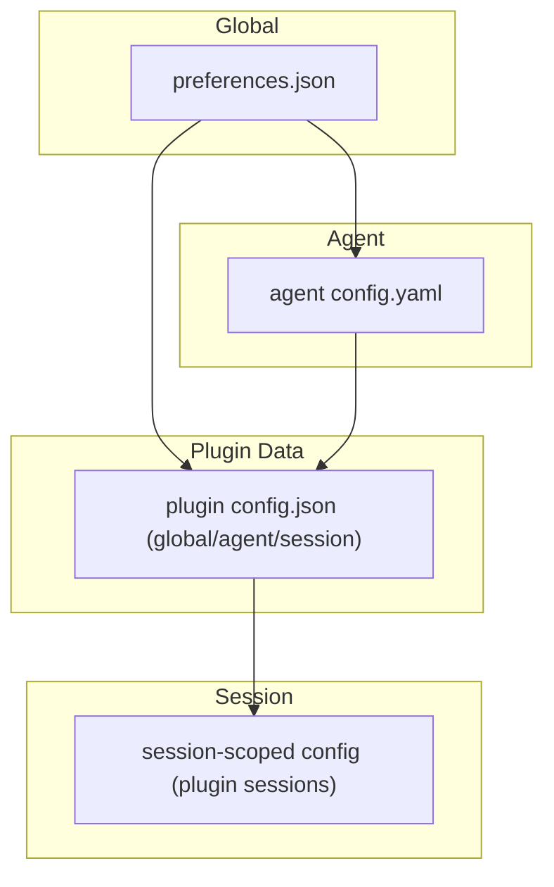
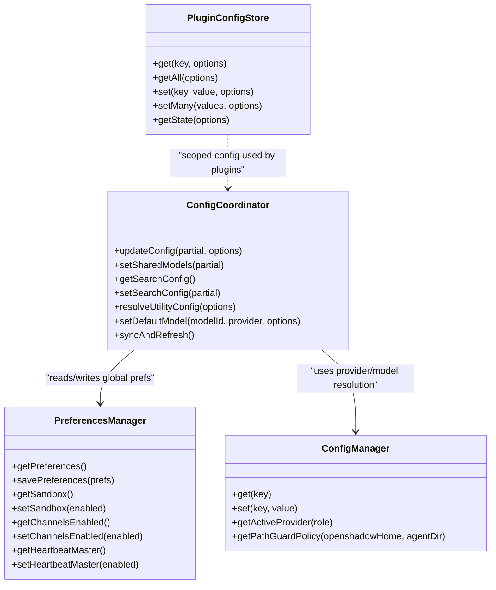
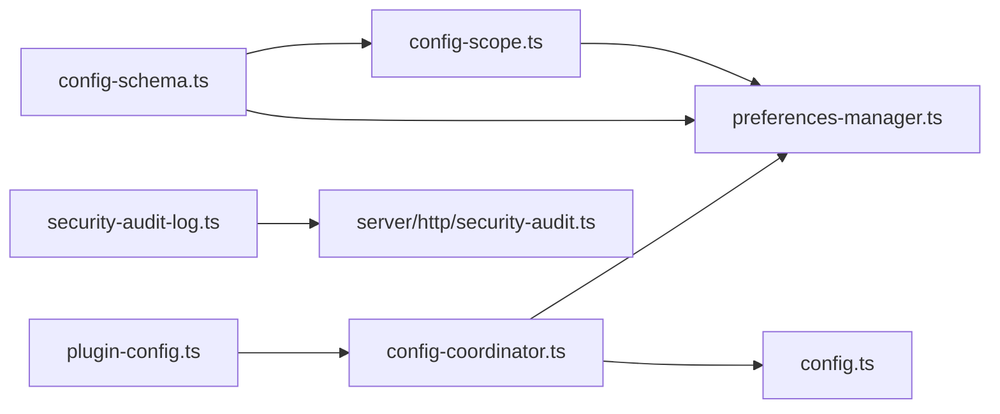
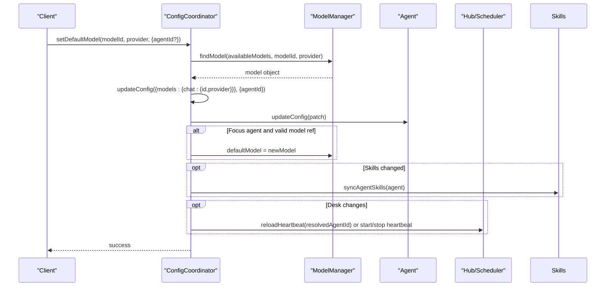

# Configuration Management

<cite>
**Referenced Files in This Document**
- [config.ts](file://core/config.ts)
- [config-coordinator.ts](file://core/config-coordinator.ts)
- [preferences-manager.ts](file://core/preferences-manager.ts)
- [config-schema.ts](file://shared/config-schema.ts)
- [config-scope.ts](file://shared/config-scope.ts)
- [migrate-config-scope.ts](file://shared/migrate-config-scope.ts)
- [plugin-config.ts](file://core/plugin-config.ts)
- [config.yaml](file://config.yaml)
- [agents/rem-default/config.yaml](file://agents/rem-default/config.yaml)
- [security-audit-log.ts](file://core/security-audit-log.ts)
- [security-audit.ts](file://server/http/security-audit.ts)
</cite>

## Table of Contents
1. [Introduction](#introduction)
2. [Project Structure](#project-structure)
3. [Core Components](#core-components)
4. [Architecture Overview](#architecture-overview)
5. [Detailed Component Analysis](#detailed-component-analysis)
6. [Dependency Analysis](#dependency-analysis)
7. [Performance Considerations](#performance-considerations)
8. [Troubleshooting Guide](#troubleshooting-guide)
9. [Conclusion](#conclusion)
10. [Appendices](#appendices)

## Introduction
This document explains OpenShadow’s configuration management system with a focus on:
- Hierarchical configuration structure across global, agent-specific, and session-scoped preferences
- The ConfigCoordinator implementation for runtime coordination
- Validation and schema enforcement for both core and plugin configurations
- Concrete examples of configuration formats, environment variable overrides, and runtime changes
- Preferences manager responsibilities for user settings
- Migration strategies and backup procedures
- Relationships with agent initialization, plugin loading, and feature toggles
- Security considerations, sensitive data handling, and audit logging
- Troubleshooting guidance for common issues and validation errors

## Project Structure
OpenShadow organizes configuration into multiple layers:
- Global preferences (user-level): stored in preferences.json under the user directory
- Agent-specific configuration: per-agent config.yaml files
- Session-scoped preferences: persisted per-session metadata and plugin session buckets
- Plugin configuration: scoped storage with schema-driven validation

[No sources needed since this diagram shows conceptual workflow, not actual code structure]

**Section sources**
- [config.ts:170-233](file://core/config.ts#L170-L233)
- [preferences-manager.ts:63-107](file://core/preferences-manager.ts#L63-L107)
- [plugin-config.ts:41-127](file://core/plugin-config.ts#L41-L127)

## Core Components
- ConfigManager: loads and persists application defaults and legacy single-provider fields; merges defaults with saved JSON; provides helpers for providers and environment fallbacks.
- PreferencesManager: manages global preferences.json with atomic writes, normalization, migrations, and UI/workspace state persistence.
- ConfigCoordinator: orchestrates runtime behavior such as shared models, search config, heartbeat master, channels master, utility API, and model selection updates.
- Schema and Scope Utilities: define global vs agent scopes and split/inject fields accordingly.
- Plugin Config Store: schema-based, scoped (global/per-agent/per-session) configuration with validation and redaction.

**Section sources**
- [config.ts:170-384](file://core/config.ts#L170-L384)
- [preferences-manager.ts:53-107](file://core/preferences-manager.ts#L53-L107)
- [config-coordinator.ts:88-619](file://core/config-coordinator.ts#L88-L619)
- [config-schema.ts:22-47](file://shared/config-schema.ts#L22-L47)
- [config-scope.ts:11-72](file://shared/config-scope.ts#L11-L72)
- [plugin-config.ts:24-127](file://core/plugin-config.ts#L24-L127)

## Architecture Overview
The configuration system is layered:
- Global scope (PreferencesManager) holds cross-agent settings and feature toggles
- Agent scope (per-agent config.yaml) holds agent-specific behavior and workspace bindings
- Session scope (plugin sessions bucket) holds ephemeral or session-bound settings
- ConfigCoordinator coordinates runtime effects when configuration changes

**Diagram sources**
- [config.ts:170-384](file://core/config.ts#L170-L384)
- [preferences-manager.ts:53-107](file://core/preferences-manager.ts#L53-L107)
- [config-coordinator.ts:88-619](file://core/config-coordinator.ts#L88-L619)
- [plugin-config.ts:41-127](file://core/plugin-config.ts#L41-L127)

## Detailed Component Analysis

### ConfigManager (Legacy and Provider Resolution)
Responsibilities:
- Load default configuration and merge with saved JSON
- Provide multi-provider resolution with role-based model references
- Fallback to environment variables if no explicit provider configured
- Expose security policy builder for path guard

Key behaviors:
- Deep merge strategy preserves nested objects while fully replacing arrays like providers
- getActiveProvider selects by role reference, default flag, legacy agent fields, then env vars
- getPathGuardPolicy translates security flags into PathGuard policy

Environment variable overrides:
- AGENT_API_KEY, AGENT_BASE_URL, AGENT_MODEL influence active provider when no file-backed provider is available
- ALLOWED_PATHS influences storage.allowedPaths

Example configuration format (JSON):
- See root-level config.json usage via ConfigManager constructor path and save/load methods

Security integration:
- Security flags map to sandbox mode and workspace roots for PathGuard

**Section sources**
- [config.ts:111-162](file://core/config.ts#L111-L162)
- [config.ts:185-233](file://core/config.ts#L185-L233)
- [config.ts:269-315](file://core/config.ts#L269-L315)
- [config.ts:361-371](file://core/config.ts#L361-L371)

### PreferencesManager (Global User Settings)
Responsibilities:
- Manage preferences.json with atomic writes and read-back verification
- Normalize and validate complex preference sections (bridge, automation, computer use, editor, notifications, browser, quick chat, experiments, update channel)
- Persist workspace UI state and sidebar UI preferences
- Migrate legacy defaults once and mark setup completion safely

Notable features:
- _preserveDiskSetupComplete ensures one-way completion marker survives subsequent writes
- GC utilities prune missing workspace UI state entries
- Many setters normalize values before persisting

Backup and migration:
- AtomicWriteSync reduces risk of partial writes
- Legacy defaults migration runs once at startup

**Section sources**
- [preferences-manager.ts:63-107](file://core/preferences-manager.ts#L63-L107)
- [preferences-manager.ts:129-138](file://core/preferences-manager.ts#L129-L138)
- [preferences-manager.ts:494-526](file://core/preferences-manager.ts#L494-L526)

### ConfigCoordinator (Runtime Orchestration)
Responsibilities:
- Resolve and sync shared models across agents
- Manage search provider configuration and API keys
- Control heartbeat master and channels master toggles
- Update agent configuration and refresh runtime components (skills, heartbeat scheduler)
- Persist session meta related to memory participation

Key flows:
- setSharedModels normalizes patches, persists to preferences, and syncs to agents
- setSearchConfig merges legacy and new key structures
- updateConfig applies patch to agent, updates default model for focus agent, and triggers dependent subsystems

**Section sources**
- [config-coordinator.ts:186-253](file://core/config-coordinator.ts#L186-L253)
- [config-coordinator.ts:257-310](file://core/config-coordinator.ts#L257-L310)
- [config-coordinator.ts:464-518](file://core/config-coordinator.ts#L464-L518)

### Schema and Scope Utilities
Responsibilities:
- Define which fields are global vs agent scope
- Split incoming config patches into global and agent parts based on schema
- Inject global fields into config objects for consumption by components

Usage:
- Frontend sends a unified patch; backend splits by scope using CONFIG_SCHEMA
- Global fields are routed to PreferencesManager setters; agent fields go to agent config.yaml

**Section sources**
- [config-schema.ts:22-47](file://shared/config-schema.ts#L22-L47)
- [config-scope.ts:11-47](file://shared/config-scope.ts#L11-L47)
- [config-scope.ts:55-72](file://shared/config-scope.ts#L55-L72)

### Plugin Configuration Store (Scoped and Validated)
Responsibilities:
- Maintain per-plugin config.json with global, per-agent, and per-session buckets
- Validate patches against normalized schema (type checks, enum constraints, scope enforcement)
- Redact sensitive fields for safe output

Validation outcomes:
- UNKNOWN_FIELD when field not declared and schema is closed
- WRONG_SCOPE when field belongs to different scope
- INVALID_TYPE / INVALID_ENUM for type mismatches

Redaction:
- Sensitive properties marked in schema are replaced with masked values in outputs

**Section sources**
- [plugin-config.ts:24-39](file://core/plugin-config.ts#L24-L39)
- [plugin-config.ts:131-155](file://core/plugin-config.ts#L131-L155)
- [plugin-config.ts:157-165](file://core/plugin-config.ts#L157-L165)

### Configuration File Formats and Examples
- Root-level YAML example: see config.yaml
- Per-agent YAML example: see agents/rem-default/config.yaml

These files include agent identity, memory toggles, desk heartbeat settings, and user name.

**Section sources**
- [config.yaml:1-19](file://config.yaml#L1-L19)
- [agents/rem-default/config.yaml:1-25](file://agents/rem-default/config.yaml#L1-L25)

### Environment Variable Overrides
- AGENT_API_KEY, AGENT_BASE_URL, AGENT_MODEL can supply a working provider when no file-backed provider exists
- ALLOWED_PATHS augments storage.allowedPaths

**Section sources**
- [config.ts:303-315](file://core/config.ts#L303-L315)
- [config.ts:127-128](file://core/config.ts#L127-L128)

### Runtime Configuration Changes
- updateConfig applies patches to agent, updates default model for focus agent, and triggers dependent subsystems (skills, heartbeat)
- setSharedModels persists shared model selections and syncs to agents
- setSearchConfig merges provider and API keys, supports legacy single-key migration

**Section sources**
- [config-coordinator.ts:464-518](file://core/config-coordinator.ts#L464-L518)
- [config-coordinator.ts:203-235](file://core/config-coordinator.ts#L203-L235)
- [config-coordinator.ts:275-310](file://core/config-coordinator.ts#L275-L310)

### Preferences Manager for User Settings
- Provides getters/setters for sandbox, network proxy, bridge modes, automation modes, editor typography, notifications, browser preferences, quick chat, experiments, update channel, keep awake, primary agent, and more
- Ensures normalized values and cleans up empty sections

**Section sources**
- [preferences-manager.ts:148-170](file://core/preferences-manager.ts#L148-L170)
- [preferences-manager.ts:220-230](file://core/preferences-manager.ts#L220-L230)
- [preferences-manager.ts:321-332](file://core/preferences-manager.ts#L321-L332)
- [preferences-manager.ts:426-437](file://core/preferences-manager.ts#L426-L437)
- [preferences-manager.ts:455-466](file://core/preferences-manager.ts#L455-L466)
- [preferences-manager.ts:481-492](file://core/preferences-manager.ts#L481-L492)
- [preferences-manager.ts:735-750](file://core/preferences-manager.ts#L735-L750)
- [preferences-manager.ts:752-762](file://core/preferences-manager.ts#L752-L762)
- [preferences-manager.ts:776-786](file://core/preferences-manager.ts#L776-L786)
- [preferences-manager.ts:788-798](file://core/preferences-manager.ts#L788-L798)

### Configuration Migration Strategies
- migrateConfigScope moves global fields from agent config.yaml into preferences.json, preserving non-default values and marking migration completion
- Backups created with .pre-scope-migration suffix before cleaning global fields from agent configs

**Section sources**
- [migrate-config-scope.ts:23-148](file://shared/migrate-config-scope.ts#L23-L148)

### Backup Procedures
- Atomic write pattern prevents partial writes during preference updates
- Pre-migration backups ensure recoverability after scope migration

**Section sources**
- [preferences-manager.ts:97-107](file://core/preferences-manager.ts#L97-L107)
- [migrate-config-scope.ts:131-141](file://shared/migrate-config-scope.ts#L131-L141)

### Relationships with Other Components
- Agent initialization: ConfigCoordinator.updateConfig triggers agent.updateConfig and may refresh descriptions and modules
- Plugin loading: PluginConfigStore validates and persists plugin configuration; sensitive fields are redacted in outputs
- Feature toggles: Channels master and heartbeat master toggles affect hub scheduler and channel lifecycle

**Section sources**
- [config-coordinator.ts:493-518](file://core/config-coordinator.ts#L493-L518)
- [plugin-config.ts:41-127](file://core/plugin-config.ts#L41-L127)
- [config-coordinator.ts:557-572](file://core/config-coordinator.ts#L557-L572)
- [config-coordinator.ts:576-599](file://core/config-coordinator.ts#L576-L599)

### Configuration Security and Sensitive Data Handling
- Plugin config schema supports sensitive flags; redaction replaces secrets with masked values
- Audit logging records security events with sanitized fields and actor context

**Section sources**
- [plugin-config.ts:157-165](file://core/plugin-config.ts#L157-L165)
- [security-audit-log.ts:15-29](file://core/security-audit-log.ts#L15-L29)
- [security-audit.ts:4-34](file://server/http/security-audit.ts#L4-L34)

### Audit Logging Integration
- Security audit events appended to logs/security-audit.jsonl with normalized fields and masked secrets
- HTTP layer helper records events with principal and decision context

**Section sources**
- [security-audit-log.ts:15-29](file://core/security-audit-log.ts#L15-L29)
- [security-audit.ts:4-34](file://server/http/security-audit.ts#L4-L34)

## Dependency Analysis

**Diagram sources**
- [config-schema.ts:22-47](file://shared/config-schema.ts#L22-L47)
- [config-scope.ts:11-72](file://shared/config-scope.ts#L11-L72)
- [preferences-manager.ts:53-107](file://core/preferences-manager.ts#L53-L107)
- [config-coordinator.ts:88-619](file://core/config-coordinator.ts#L88-L619)
- [config.ts:170-384](file://core/config.ts#L170-L384)
- [plugin-config.ts:24-127](file://core/plugin-config.ts#L24-L127)
- [security-audit-log.ts:15-29](file://core/security-audit-log.ts#L15-L29)
- [security-audit.ts:4-34](file://server/http/security-audit.ts#L4-L34)

**Section sources**
- [config-schema.ts:22-47](file://shared/config-schema.ts#L22-L47)
- [config-scope.ts:11-72](file://shared/config-scope.ts#L11-L72)
- [preferences-manager.ts:53-107](file://core/preferences-manager.ts#L53-L107)
- [config-coordinator.ts:88-619](file://core/config-coordinator.ts#L88-L619)
- [config.ts:170-384](file://core/config.ts#L170-L384)
- [plugin-config.ts:24-127](file://core/plugin-config.ts#L24-L127)
- [security-audit-log.ts:15-29](file://core/security-audit-log.ts#L15-L29)
- [security-audit.ts:4-34](file://server/http/security-audit.ts#L4-L34)

## Performance Considerations
- Prefer shallow copies and targeted updates to avoid heavy cloning; PreferencesManager uses mutable copy patterns for setters
- Use splitByScope to minimize unnecessary writes to agent configs when only global fields change
- Avoid frequent full resyncs; ConfigCoordinator.syncAndRefresh skips if models already injected

[No sources needed since this section provides general guidance]

## Troubleshooting Guide
Common issues and resolutions:
- Unknown field error in plugin config: Ensure the field is declared in the plugin schema and matches its scope
- Wrong scope error: Move the field to the correct scope (global/per-agent/per-session)
- Invalid type or enum: Verify the value conforms to the property’s type and allowed enum values
- Missing provider in model ref: When updating default model, include both id and provider; otherwise, the update is ignored
- Heartbeat not restarting after enabling: Confirm heartbeat_master is true and agent’s desk.heartbeat_enabled is true; scheduler reload may be required
- Sandbox network toggle disabled on Windows: Platform-specific behavior prevents disabling network access; adjust expectations accordingly

**Section sources**
- [plugin-config.ts:131-155](file://core/plugin-config.ts#L131-L155)
- [config-coordinator.ts:479-491](file://core/config-coordinator.ts#L479-L491)
- [config-coordinator.ts:498-517](file://core/config-coordinator.ts#L498-L517)

## Conclusion
OpenShadow’s configuration system combines robust schema-driven validation, clear scoping rules, and resilient persistence. ConfigCoordinator centralizes runtime effects, while PreferencesManager and PluginConfigStore provide secure, normalized storage for global and scoped settings. Migrations and backups safeguard user data, and audit logging supports security oversight.

[No sources needed since this section summarizes without analyzing specific files]

## Appendices

### Example: Updating Default Model via ConfigCoordinator

**Diagram sources**
- [config-coordinator.ts:401-414](file://core/config-coordinator.ts#L401-L414)
- [config-coordinator.ts:464-518](file://core/config-coordinator.ts#L464-L518)