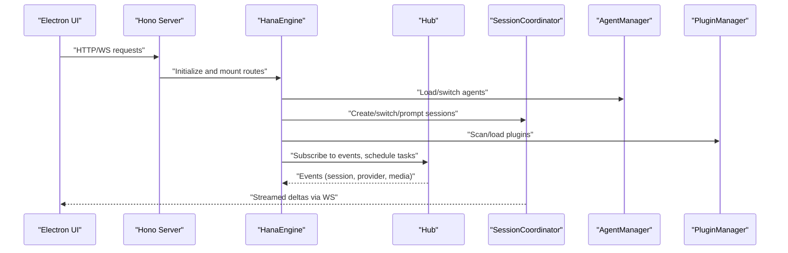
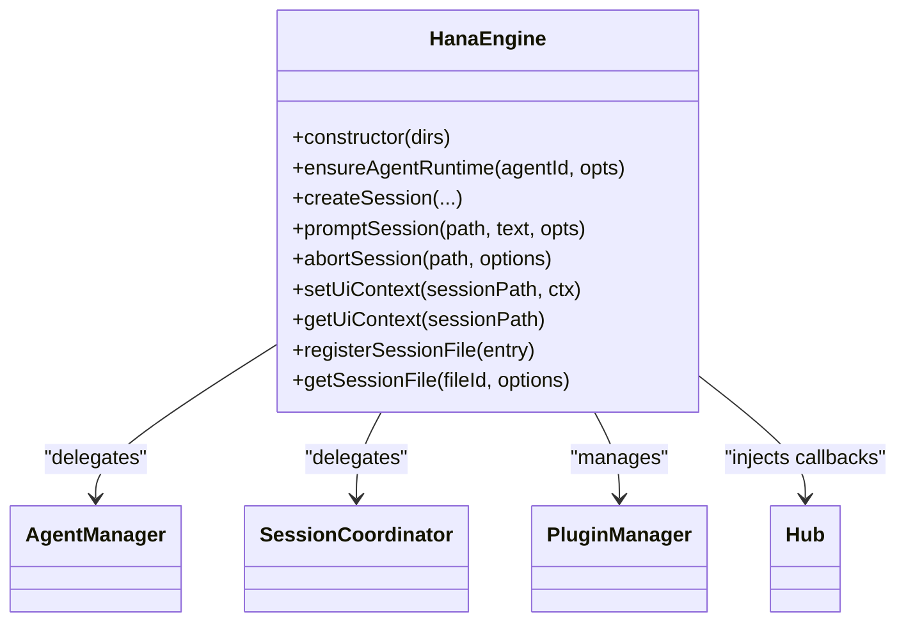
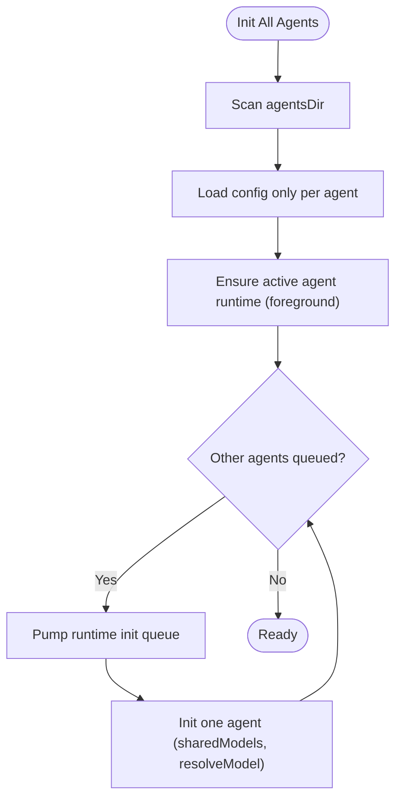
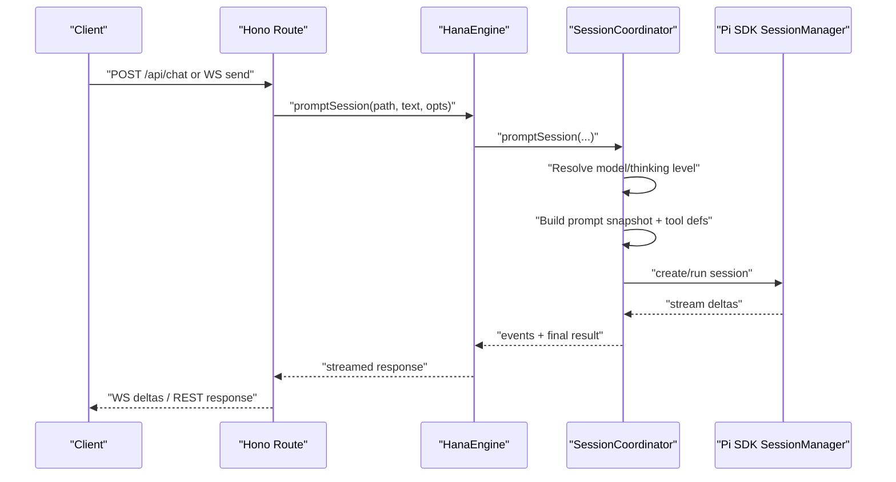
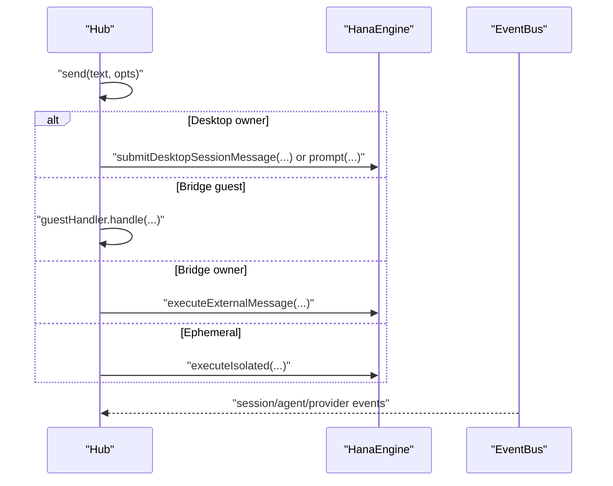
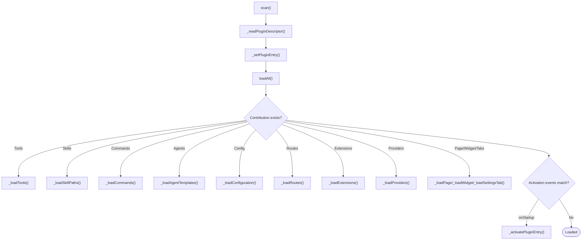
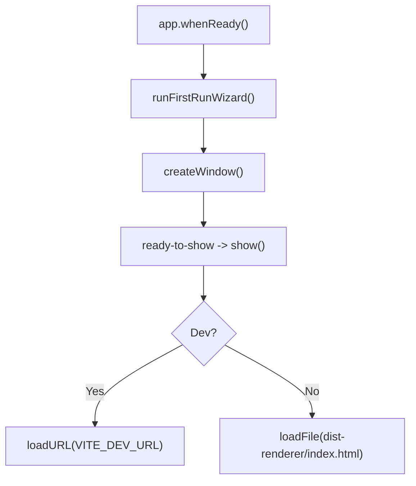
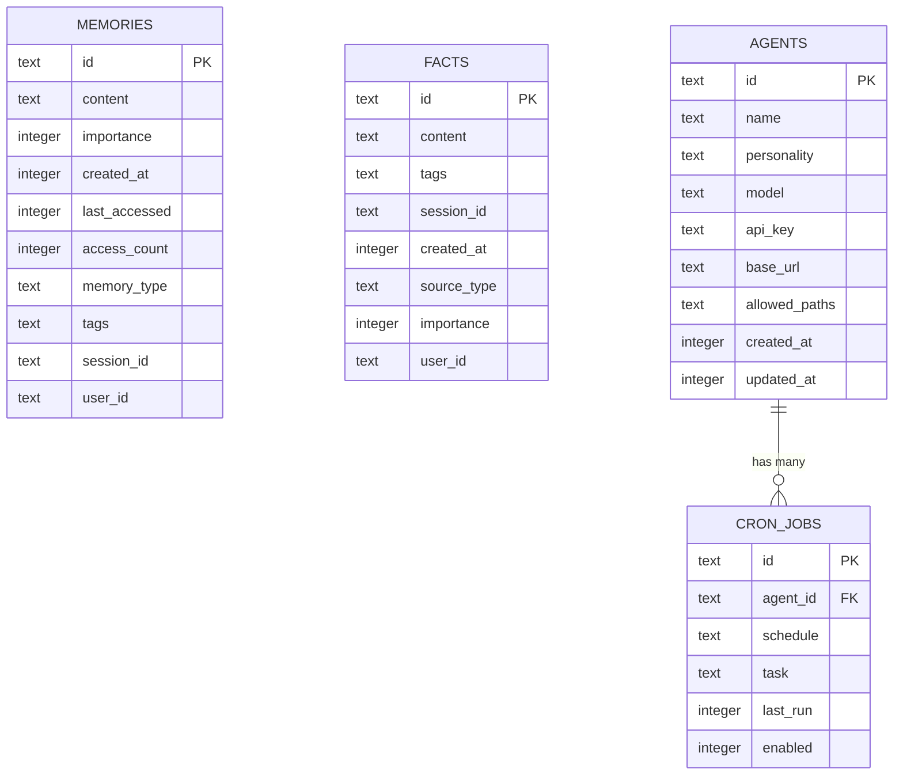
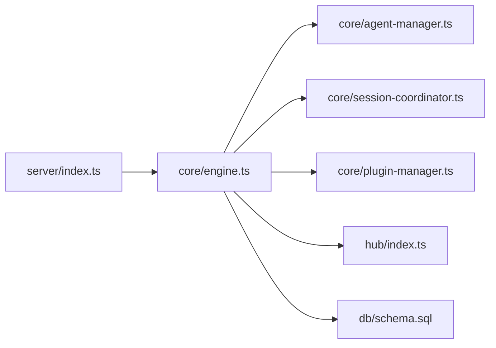

# Core Architecture

<cite>
**Referenced Files in This Document**
- [server/index.ts](file://server/index.ts)
- [core/engine.ts](file://core/engine.ts)
- [core/agent-manager.ts](file://core/agent-manager.ts)
- [core/session-coordinator.ts](file://core/session-coordinator.ts)
- [hub/index.ts](file://hub/index.ts)
- [desktop/main.ts](file://desktop/main.ts)
- [db/schema.sql](file://db/schema.sql)
- [core/plugin-manager.ts](file://core/plugin-manager.ts)
</cite>

## Table of Contents
1. [Introduction](#introduction)
2. [Project Structure](#project-structure)
3. [Core Components](#core-components)
4. [Architecture Overview](#architecture-overview)
5. [Detailed Component Analysis](#detailed-component-analysis)
6. [Dependency Analysis](#dependency-analysis)
7. [Performance Considerations](#performance-considerations)
8. [Troubleshooting Guide](#troubleshooting-guide)
9. [Conclusion](#conclusion)

## Introduction
This document describes OpenShadow’s core system architecture, focusing on the Electron desktop shell, Hono HTTP server, Pi SDK agent runtime integration, and SQLite-backed persistence. It explains how the central engine orchestrates agents, sessions, and plugins; how events flow across components; and how cross-cutting concerns like security sandboxing, memory management, and multi-agent coordination are handled.

## Project Structure
OpenShadow is organized into clear layers:
- Desktop Shell (Electron): Provides the UI window and process lifecycle.
- Server Layer (Hono + Node): Exposes REST and WebSocket APIs, wires business routes to the core engine.
- Core Engine: Central facade that composes managers for agents, sessions, configuration, channels, media, tools, and plugins.
- Hub: In-process message dispatcher and scheduler (heartbeat, cron), channel routing, and event bus.
- Persistence: JSONL session files plus optional SQLite schema for memories/facts/cron.
- Plugin System: Declarative contributions and optional lifecycle-based extensions.

```mermaid
graph TB
subgraph "Desktop"
DMain["Electron Main<br/>desktop/main.ts"]
end
subgraph "Server"
SIndex["Hono App & Routes<br/>server/index.ts"]
end
subgraph "Core"
Engine["HanaEngine Facade<br/>core/engine.ts"]
AgentMgr["AgentManager<br/>core/agent-manager.ts"]
SessionCoord["SessionCoordinator<br/>core/session-coordinator.ts"]
PluginMgr["PluginManager<br/>core/plugin-manager.ts"]
end
subgraph "Hub"
Hub["Hub (EventBus/Scheduler/Routers)<br/>hub/index.ts"]
end
subgraph "Persistence"
JSONL["JSONL Sessions"]
SQLite["SQLite Schema<br/>db/schema.sql"]
end
DMain --> |"IPC / WS"| SIndex
SIndex --> Engine
Engine --> AgentMgr
Engine --> SessionCoord
Engine --> PluginMgr
Engine --> Hub
Engine --> JSONL
Engine --> SQLite
```

**Diagram sources**
- [desktop/main.ts:1-109](file://desktop/main.ts#L1-L109)
- [server/index.ts:1-320](file://server/index.ts#L1-L320)
- [core/engine.ts:173-513](file://core/engine.ts#L173-L513)
- [core/agent-manager.ts:98-146](file://core/agent-manager.ts#L98-L146)
- [core/session-coordinator.ts:572-632](file://core/session-coordinator.ts#L572-L632)
- [core/plugin-manager.ts:155-236](file://core/plugin-manager.ts#L155-L236)
- [hub/index.ts:38-85](file://hub/index.ts#L38-L85)
- [db/schema.sql:1-104](file://db/schema.sql#L1-L104)

**Section sources**
- [desktop/main.ts:1-109](file://desktop/main.ts#L1-L109)
- [server/index.ts:1-320](file://server/index.ts#L1-L320)
- [core/engine.ts:173-513](file://core/engine.ts#L173-L513)
- [core/agent-manager.ts:98-146](file://core/agent-manager.ts#L98-L146)
- [core/session-coordinator.ts:572-632](file://core/session-coordinator.ts#L572-L632)
- [core/plugin-manager.ts:155-236](file://core/plugin-manager.ts#L155-L236)
- [hub/index.ts:38-85](file://hub/index.ts#L38-L85)
- [db/schema.sql:1-104](file://db/schema.sql#L1-L104)

## Core Components
- HanaEngine: Central facade composing managers and services; exposes unified APIs for agents, sessions, models, skills, resources, and plugin orchestration.
- AgentManager: Scans, initializes, switches, and manages multiple agents with concurrency control and background maintenance.
- SessionCoordinator: Owns session lifecycle, prompt execution, compaction, tool snapshots, thinking levels, and workspace scoping.
- Hub: In-process message router and scheduler; integrates EventBus, ChannelRouter, GuestHandler, Scheduler, and DM routing.
- PluginManager: Discovers, loads, activates, and unloads plugins; registers tools, commands, skills, providers, pages, widgets, and settings tabs.
- Server (Hono): Bootstraps engine, mounts routes, enables WebSocket, writes runtime info, and provides health/shutdown endpoints.
- Persistence: JSONL session transcripts; optional SQLite schema for memories, facts, agents, and cron jobs.

**Section sources**
- [core/engine.ts:173-513](file://core/engine.ts#L173-L513)
- [core/agent-manager.ts:98-146](file://core/agent-manager.ts#L98-L146)
- [core/session-coordinator.ts:572-632](file://core/session-coordinator.ts#L572-L632)
- [hub/index.ts:38-85](file://hub/index.ts#L38-L85)
- [core/plugin-manager.ts:155-236](file://core/plugin-manager.ts#L155-L236)
- [server/index.ts:116-210](file://server/index.ts#L116-L210)
- [db/schema.sql:1-104](file://db/schema.sql#L1-L104)

## Architecture Overview
The system follows a layered, event-driven design:
- The Electron main process hosts the UI and communicates with the local server via IPC/WebSocket.
- The Hono server initializes the engine, mounts REST and WebSocket routes, and delegates to the core engine.
- The engine coordinates agents, sessions, plugins, and hub services.
- The hub provides an in-process event bus and scheduling primitives used by channels and background tasks.
- Data persists as JSONL session transcripts and optionally via SQLite for memories/facts/cron.



**Diagram sources**
- [server/index.ts:116-210](file://server/index.ts#L116-L210)
- [core/engine.ts:173-513](file://core/engine.ts#L173-L513)
- [core/agent-manager.ts:231-336](file://core/agent-manager.ts#L231-L336)
- [core/session-coordinator.ts:734-800](file://core/session-coordinator.ts#L734-L800)
- [core/plugin-manager.ts:484-538](file://core/plugin-manager.ts#L484-L538)
- [hub/index.ts:158-299](file://hub/index.ts#L158-L299)

## Detailed Component Analysis

### HanaEngine (Central Facade)
Responsibilities:
- Compose and expose managers (agents, sessions, config, channels, bridge, models, preferences, skills).
- Initialize resource access, usage ledger, approval gateway, vision bridge, terminal sessions, and computer-use host.
- Provide path-aware session APIs and UI context management.
- Integrate plugin manager and dev service.

Key interactions:
- Delegates agent lifecycle to AgentManager.
- Delegates session lifecycle to SessionCoordinator.
- Wires Hub callbacks and EventBus.
- Registers slash commands and task registry.



**Diagram sources**
- [core/engine.ts:173-513](file://core/engine.ts#L173-L513)
- [core/agent-manager.ts:98-146](file://core/agent-manager.ts#L98-L146)
- [core/session-coordinator.ts:572-632](file://core/session-coordinator.ts#L572-L632)
- [core/plugin-manager.ts:155-236](file://core/plugin-manager.ts#L155-L236)
- [hub/index.ts:38-85](file://hub/index.ts#L38-L85)

**Section sources**
- [core/engine.ts:173-513](file://core/engine.ts#L173-L513)

### AgentManager (Multi-Agent Lifecycle)
Responsibilities:
- Scan agents directory, load configs, initialize runtime with concurrency limits.
- Maintain active agent pointer, list/delete/switch agents, and manage activity stores.
- Schedule memory maintenance and description refresh.

Concurrency and queues:
- Runtime init queue with priority and concurrency cap.
- Memory maintenance queue with controlled parallelism.



**Diagram sources**
- [core/agent-manager.ts:231-336](file://core/agent-manager.ts#L231-L336)

**Section sources**
- [core/agent-manager.ts:231-336](file://core/agent-manager.ts#L231-L336)

### SessionCoordinator (Session Orchestration)
Responsibilities:
- Create/restore sessions, set thinking level, build tool snapshots, handle compaction and teardown.
- Manage workspace scope, permission modes, and turn context.
- Record assistant usage and integrate with usage ledger.

Prompt flow highlights:
- Resolve model and thinking level.
- Build prompt snapshot and tool definitions.
- Execute isolated completion and stream results.



**Diagram sources**
- [core/session-coordinator.ts:734-800](file://core/session-coordinator.ts#L734-L800)

**Section sources**
- [core/session-coordinator.ts:734-800](file://core/session-coordinator.ts#L734-L800)

### Hub (Message Dispatcher and Scheduler)
Responsibilities:
- Unified message entry point with attachment preprocessing and routing.
- EventBus subscription and handlers for session/agent/provider operations.
- Scheduler start/stop and channel router integration.

Routing logic:
- Desktop owner messages route to desktop session submission or engine prompt.
- Bridge guest/owner messages routed accordingly.
- Ephemeral messages execute in isolation (cron/heartbeat/channel).



**Diagram sources**
- [hub/index.ts:158-299](file://hub/index.ts#L158-L299)

**Section sources**
- [hub/index.ts:158-299](file://hub/index.ts#L158-L299)

### PluginManager (Extension System)
Responsibilities:
- Discover plugins from configured directories, read manifests, reconcile missing directories.
- Load declarative contributions (tools, skills, commands, agent templates, configuration).
- Optionally activate lifecycle-enabled plugins with timeouts and disposables.
- Register dynamic tools and refresh route registries.



**Diagram sources**
- [core/plugin-manager.ts:417-538](file://core/plugin-manager.ts#L417-L538)
- [core/plugin-manager.ts:612-667](file://core/plugin-manager.ts#L612-L667)
- [core/plugin-manager.ts:669-723](file://core/plugin-manager.ts#L669-L723)

**Section sources**
- [core/plugin-manager.ts:417-538](file://core/plugin-manager.ts#L417-L538)
- [core/plugin-manager.ts:612-667](file://core/plugin-manager.ts#L612-L667)
- [core/plugin-manager.ts:669-723](file://core/plugin-manager.ts#L669-L723)

### Server (Hono HTTP + WebSocket)
Responsibilities:
- Resolve Shadow Home, ensure first-run defaults, initialize HanaEngine.
- Mount ~37 business routes under /api, including chat REST and WS.
- Enable WebSocket upgrade and write server-info.json for discovery.
- Provide health and shutdown endpoints.

```mermaid
sequenceDiagram
participant Proc as "Node Process"
participant Server as "Hono App"
participant Engine as "HanaEngine"
participant Hub as "Hub"
Proc->>Server : "start()"
Server->>Server : "ensureFirstRun(shadowHome, productDir)"
Server->>Engine : "new HanaEngine(...); await engine.init()"
Server->>Hub : "new Hub({ engine })"
Server->>Server : "app.route('/api', ...)"
Server->>Server : "serve({ fetch : app.fetch, port })"
Server->>Server : "injectWebSocket(server)"
Server-->>Proc : "server-info.json written"
```

**Diagram sources**
- [server/index.ts:116-210](file://server/index.ts#L116-L210)
- [server/index.ts:250-292](file://server/index.ts#L250-L292)

**Section sources**
- [server/index.ts:116-210](file://server/index.ts#L116-L210)
- [server/index.ts:250-292](file://server/index.ts#L250-L292)

### Desktop Shell (Electron)
Responsibilities:
- First-run wizard to configure workspace roots and sandbox policy.
- Create BrowserWindow with preload and secure webPreferences.
- Load renderer assets (dev or packaged).



**Diagram sources**
- [desktop/main.ts:11-45](file://desktop/main.ts#L11-L45)
- [desktop/main.ts:47-89](file://desktop/main.ts#L47-L89)
- [desktop/main.ts:91-106](file://desktop/main.ts#L91-L106)

**Section sources**
- [desktop/main.ts:11-45](file://desktop/main.ts#L11-L45)
- [desktop/main.ts:47-89](file://desktop/main.ts#L47-L89)
- [desktop/main.ts:91-106](file://desktop/main.ts#L91-L106)

### Data Models (SQLite Schema)
The schema defines tables for memories, facts, agents, and cron jobs, with FTS5 virtual tables and triggers for full-text search.



**Diagram sources**
- [db/schema.sql:1-104](file://db/schema.sql#L1-L104)

**Section sources**
- [db/schema.sql:1-104](file://db/schema.sql#L1-L104)

## Dependency Analysis
High-level dependencies:
- Server depends on HanaEngine and mounts routes.
- HanaEngine composes AgentManager, SessionCoordinator, PluginManager, and Hub.
- Hub uses EventBus and routers; it injects callbacks back into Engine.
- PluginManager contributes tools/routes/providers/pages/widgets/settings tabs to the engine surface.
- Persistence layer is primarily JSONL for sessions; SQLite schema provided for memories/facts/cron.



**Diagram sources**
- [server/index.ts:116-210](file://server/index.ts#L116-L210)
- [core/engine.ts:173-513](file://core/engine.ts#L173-L513)
- [core/agent-manager.ts:98-146](file://core/agent-manager.ts#L98-L146)
- [core/session-coordinator.ts:572-632](file://core/session-coordinator.ts#L572-L632)
- [core/plugin-manager.ts:155-236](file://core/plugin-manager.ts#L155-L236)
- [hub/index.ts:38-85](file://hub/index.ts#L38-L85)
- [db/schema.sql:1-104](file://db/schema.sql#L1-L104)

**Section sources**
- [server/index.ts:116-210](file://server/index.ts#L116-L210)
- [core/engine.ts:173-513](file://core/engine.ts#L173-L513)
- [core/agent-manager.ts:98-146](file://core/agent-manager.ts#L98-L146)
- [core/session-coordinator.ts:572-632](file://core/session-coordinator.ts#L572-L632)
- [core/plugin-manager.ts:155-236](file://core/plugin-manager.ts#L155-L236)
- [hub/index.ts:38-85](file://hub/index.ts#L38-L85)
- [db/schema.sql:1-104](file://db/schema.sql#L1-L104)

## Performance Considerations
- Concurrency controls:
  - Agent runtime initialization is queued with configurable concurrency to avoid startup spikes.
  - Memory maintenance runs with limited parallelism to prevent contention.
- Memory pressure handling:
  - Session coordinator includes thresholds and estimators to monitor retained bytes and RSS, enabling proactive compaction or cleanup.
- Streaming responses:
  - WebSocket streaming reduces latency and improves UX for long-running prompts.
- Caching:
  - Agent list caching with TTL; title and metadata caches reduce repeated I/O.
- Plugin loading:
  - Timeouts and staged loading prevent slow plugins from blocking startup.

[No sources needed since this section provides general guidance]

## Troubleshooting Guide
Common issues and diagnostics:
- Engine initialization failures:
  - Check ensureFirstRun seeding and provider/model availability before engine.init().
- Hub routing errors:
  - Validate role/sessionKey/ephemeral flags; ensure attachments are correctly preprocessed.
- Plugin load timeouts:
  - Inspect stage-specific logs and activation events; consider increasing timeout or disabling problematic plugins.
- Session creation errors:
  - Confirm model availability and thinking level resolution; verify workspace folders and permission mode.
- Shutdown behavior:
  - Use /api/shutdown to cleanly remove server-info.json and exit.

**Section sources**
- [server/index.ts:116-137](file://server/index.ts#L116-L137)
- [server/index.ts:296-312](file://server/index.ts#L296-L312)
- [hub/index.ts:158-299](file://hub/index.ts#L158-L299)
- [core/plugin-manager.ts:540-581](file://core/plugin-manager.ts#L540-L581)
- [core/session-coordinator.ts:734-800](file://core/session-coordinator.ts#L734-L800)

## Conclusion
OpenShadow’s architecture separates concerns across a thin Electron shell, a Hono-based server, a comprehensive core engine, and a flexible plugin system. The Hub provides robust in-process messaging and scheduling. Multi-agent coordination, session orchestration, and extensibility are achieved through well-defined managers and event-driven flows. Persistence leverages JSONL for sessions with optional SQLite support for richer data features. The design balances performance, safety, and extensibility while remaining approachable for developers and users alike.