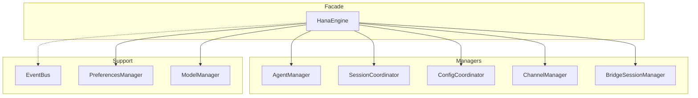
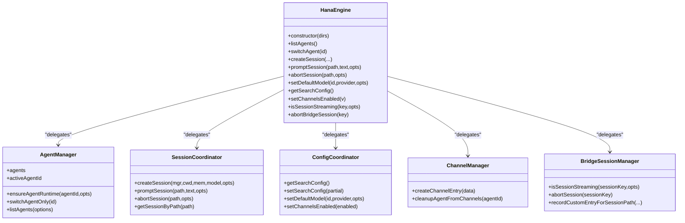
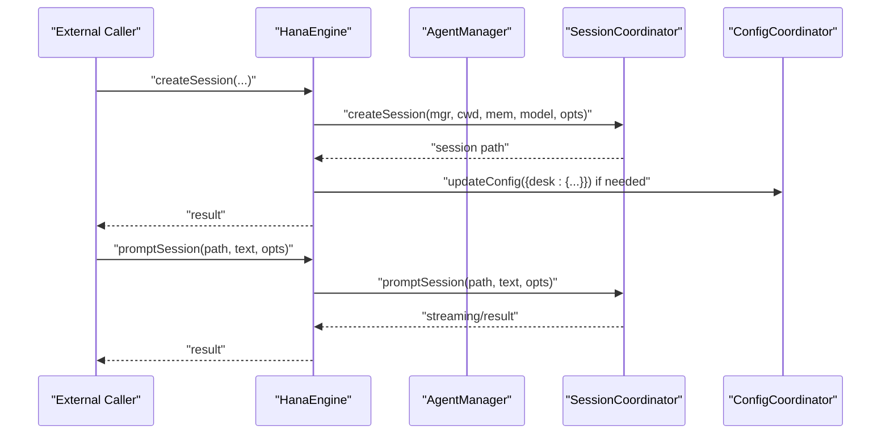
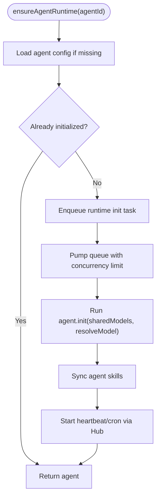
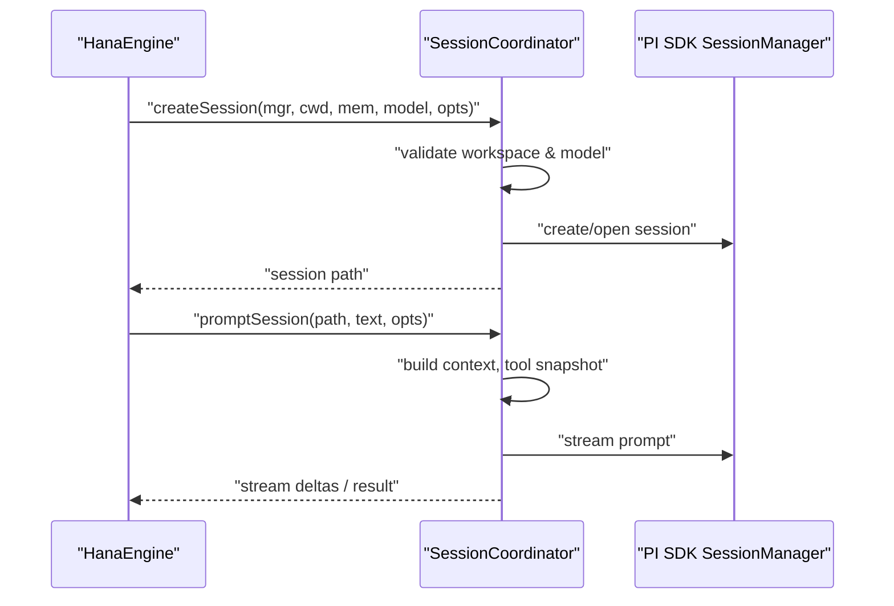
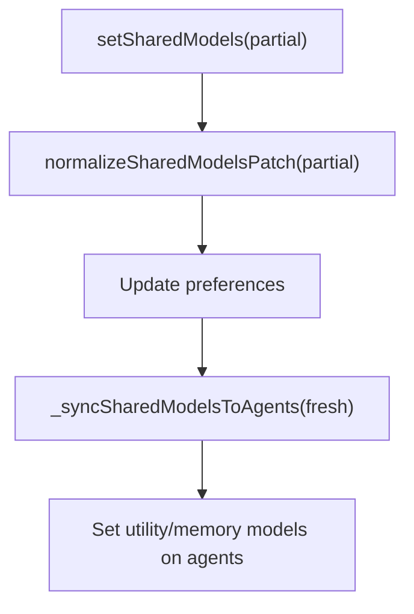
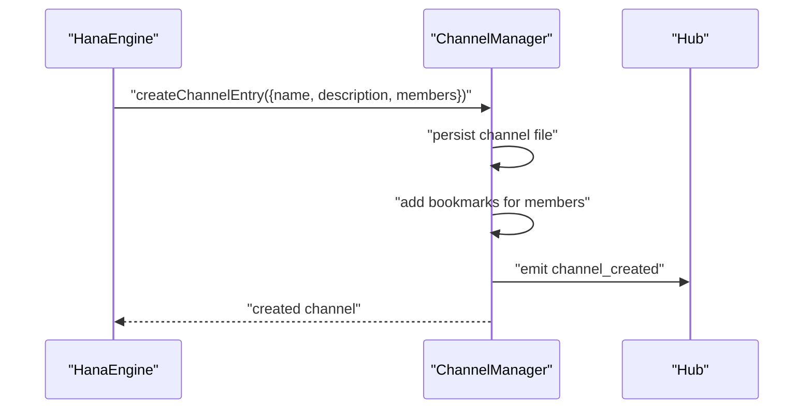
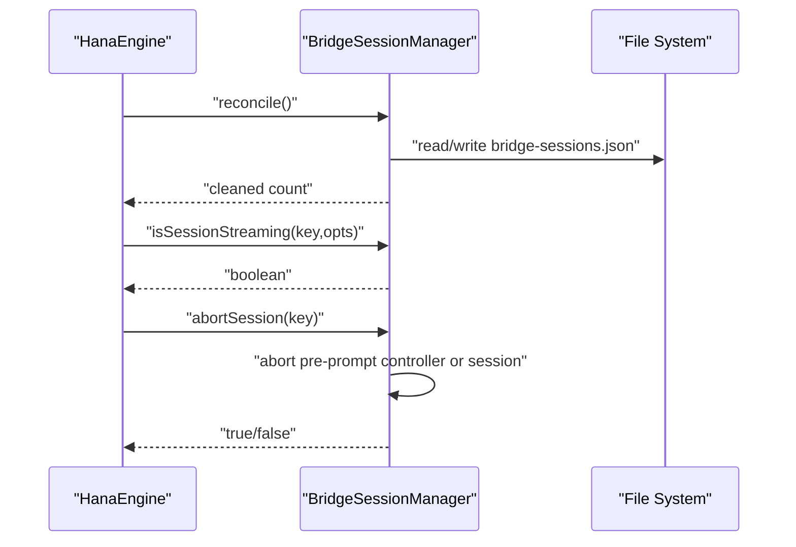
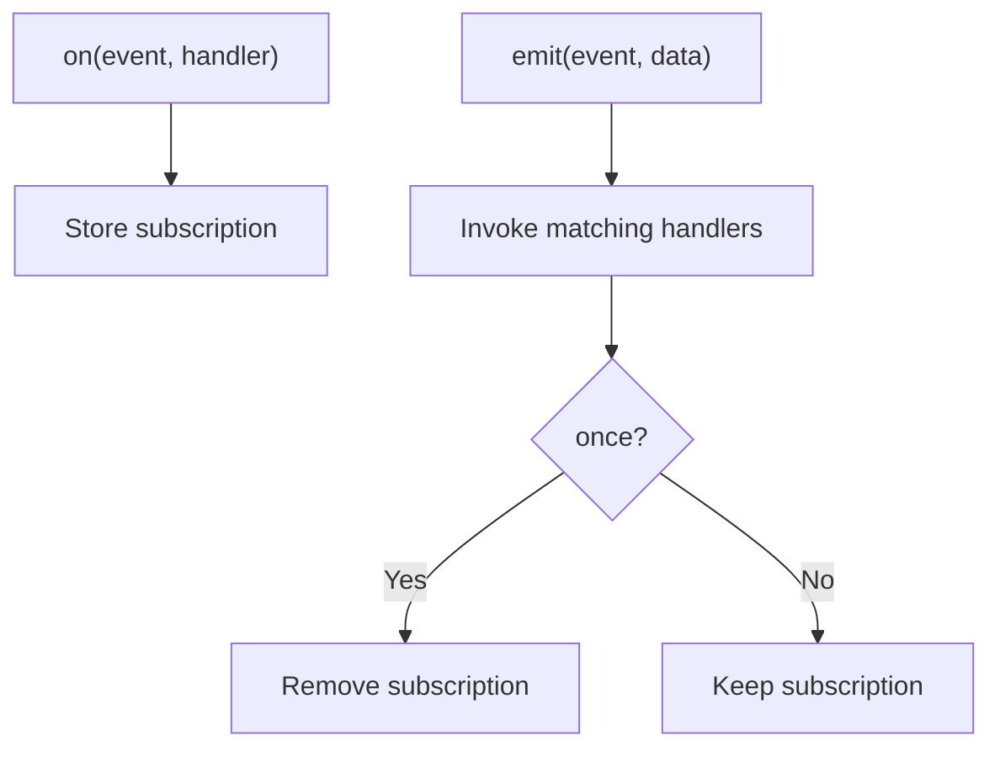
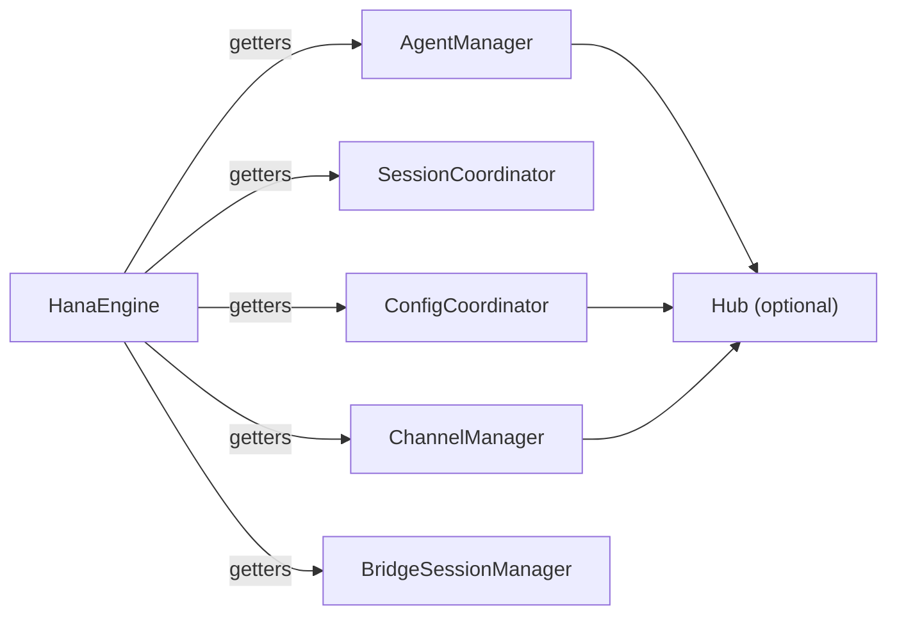

# Engine Facade Pattern

<cite>
**Referenced Files in This Document**
- [engine.ts](file://core/engine.ts)
- [agent-manager.ts](file://core/agent-manager.ts)
- [session-coordinator.ts](file://core/session-coordinator.ts)
- [config-coordinator.ts](file://core/config-coordinator.ts)
- [channel-manager.ts](file://core/channel-manager.ts)
- [bridge-session-manager.ts](file://core/bridge-session-manager.ts)
- [event-bus.ts](file://core/event-bus.ts)
</cite>

## Table of Contents
1. [Introduction](#introduction)
2. [Project Structure](#project-structure)
3. [Core Components](#core-components)
4. [Architecture Overview](#architecture-overview)
5. [Detailed Component Analysis](#detailed-component-analysis)
6. [Dependency Analysis](#dependency-analysis)
7. [Performance Considerations](#performance-considerations)
8. [Troubleshooting Guide](#troubleshooting-guide)
9. [Conclusion](#conclusion)
10. [Appendices](#appendices)

## Introduction
This document explains the Engine Facade Pattern implemented by HanaEngine in OpenShadow. HanaEngine acts as a thin facade over multiple managers (AgentManager, SessionCoordinator, ConfigCoordinator, ChannelManager, BridgeSessionManager, etc.), exposing a unified API while delegating responsibilities to specialized subsystems. The design emphasizes loose coupling via constructor-based dependency injection, clear lifecycle management, and an event-driven integration through an internal event bus.

## Project Structure
At runtime, HanaEngine constructs and wires core managers during initialization. It holds references to these managers and delegates most operations to them. External components interact with the engine through its public methods rather than directly with managers.

**Diagram sources**
- [engine.ts:241-513](file://core/engine.ts#L241-L513)
- [agent-manager.ts:98-146](file://core/agent-manager.ts#L98-L146)
- [session-coordinator.ts:572-632](file://core/session-coordinator.ts#L572-L632)
- [config-coordinator.ts:88-110](file://core/config-coordinator.ts#L88-L110)
- [channel-manager.ts:24-42](file://core/channel-manager.ts#L24-L42)
- [bridge-session-manager.ts:333-357](file://core/bridge-session-manager.ts#L333-L357)
- [event-bus.ts:37-122](file://core/event-bus.ts#L37-L122)

**Section sources**
- [engine.ts:241-513](file://core/engine.ts#L241-L513)

## Core Components
- HanaEngine: Thin facade that owns manager instances and exposes a stable API for agents, sessions, configuration, channels, bridge sessions, media, tools, and more.
- AgentManager: Manages agent discovery, lifecycle, switching, and per-agent resources.
- SessionCoordinator: Owns session creation, switching, streaming, compaction, and metadata persistence.
- ConfigCoordinator: Centralizes runtime configuration, shared models, search/utility settings, heartbeat master, and channel toggles.
- ChannelManager: Handles channel CRUD, member management, and bookmark projections.
- BridgeSessionManager: Manages external platform sessions, index reconciliation, and bridge-specific prompt snapshots.
- EventBus: Typed event system used by various subsystems to emit and consume events.

Key facade delegation patterns:
- Agent operations delegate to AgentManager (e.g., listAgents, switchAgent, ensureAgentRuntime).
- Session operations delegate to SessionCoordinator (e.g., createSession, promptSession, abortSession).
- Configuration operations delegate to ConfigCoordinator (e.g., setDefaultModel, getSearchConfig, setChannelsEnabled).
- Channel operations delegate to ChannelManager (e.g., createChannelEntry, cleanupAgentFromChannels).
- Bridge operations delegate to BridgeSessionManager (e.g., isSessionStreaming, abortSession, recordCustomEntryForSessionPath).

**Section sources**
- [engine.ts:519-1200](file://core/engine.ts#L519-L1200)
- [agent-manager.ts:98-146](file://core/agent-manager.ts#L98-L146)
- [session-coordinator.ts:572-632](file://core/session-coordinator.ts#L572-L632)
- [config-coordinator.ts:88-110](file://core/config-coordinator.ts#L88-L110)
- [channel-manager.ts:24-42](file://core/channel-manager.ts#L24-L42)
- [bridge-session-manager.ts:333-357](file://core/bridge-session-manager.ts#L333-L357)

## Architecture Overview
The facade pattern ensures that callers depend only on HanaEngine’s surface. Managers are constructed with explicit dependencies injected via options or getter functions, avoiding circular references and enabling testability.

**Diagram sources**
- [engine.ts:241-513](file://core/engine.ts#L241-L513)
- [agent-manager.ts:98-146](file://core/agent-manager.ts#L98-L146)
- [session-coordinator.ts:572-632](file://core/session-coordinator.ts#L572-L632)
- [config-coordinator.ts:88-110](file://core/config-coordinator.ts#L88-L110)
- [channel-manager.ts:24-42](file://core/channel-manager.ts#L24-L42)
- [bridge-session-manager.ts:333-357](file://core/bridge-session-manager.ts#L333-L357)

## Detailed Component Analysis

### HanaEngine Facade Responsibilities
- Construction and wiring: Initializes directories, services, and managers; sets up approval gateway, usage ledger, terminal sessions, computer use host, plugin dev service, and more.
- Dependency injection: Passes getters/callbacks to managers to avoid hard cycles and enable late binding (e.g., hub callbacks, resource loader).
- Method delegation: Exposes high-level APIs that forward calls to managers. Examples include agent CRUD, session lifecycle, model selection, search config, channels toggle, and bridge session control.
- Event emission: Uses an internal event bus to broadcast notifications and cross-subsystem signals.
- Lifecycle hooks: Provides hooks like onBeforeSessionCreate and onSessionRuntimeDiscarded to coordinate cross-cutting concerns (workspace skill sync, cleanup).

**Diagram sources**
- [engine.ts:762-800](file://core/engine.ts#L762-L800)
- [session-coordinator.ts:736-800](file://core/session-coordinator.ts#L736-L800)
- [config-coordinator.ts:464-518](file://core/config-coordinator.ts#L464-L518)

**Section sources**
- [engine.ts:241-513](file://core/engine.ts#L241-L513)
- [engine.ts:762-800](file://core/engine.ts#L762-L800)

### AgentManager Integration
- Initialization: Scans agents, loads configs, initializes focus agent runtime, and queues background init tasks.
- Switching: Queues switch operations to prevent concurrent transitions; supports both pointer-only and full switch flows.
- Roster and listing: Provides cached lists and filtered views for UI and subsystems.

**Diagram sources**
- [agent-manager.ts:282-336](file://core/agent-manager.ts#L282-L336)
- [agent-manager.ts:769-800](file://core/agent-manager.ts#L769-L800)

**Section sources**
- [agent-manager.ts:231-336](file://core/agent-manager.ts#L231-L336)
- [agent-manager.ts:769-800](file://core/agent-manager.ts#L769-L800)

### SessionCoordinator Integration
- Creation: Validates workspace, resolves model, restores state when requested, and builds prompt/tool snapshots.
- Streaming and abort: Tracks active sessions and pre-prompt abort controllers; supports per-session abort and streaming checks.
- Metadata and compaction: Persists thinking level, memory flags, and capability snapshots; coordinates compaction and health repairs.

**Diagram sources**
- [session-coordinator.ts:736-800](file://core/session-coordinator.ts#L736-L800)
- [session-coordinator.ts:572-632](file://core/session-coordinator.ts#L572-L632)

**Section sources**
- [session-coordinator.ts:736-800](file://core/session-coordinator.ts#L736-L800)

### ConfigCoordinator Integration
- Shared models: Normalizes patches, persists preferences, and propagates changes to agent runtimes.
- Search/utility: Reads/writes provider keys and base URLs; validates overrides against available models.
- Heartbeat and channels: Controls global heartbeat master and channel toggling, coordinating with scheduler/hub.

**Diagram sources**
- [config-coordinator.ts:203-253](file://core/config-coordinator.ts#L203-L253)
- [config-coordinator.ts:55-86](file://core/config-coordinator.ts#L55-L86)

**Section sources**
- [config-coordinator.ts:203-253](file://core/config-coordinator.ts#L203-L253)
- [config-coordinator.ts:55-86](file://core/config-coordinator.ts#L55-L86)

### ChannelManager Integration
- Channel lifecycle: Creates channels, manages members, cleans up after agent deletion, and maintains bookmark projections.
- Hub interaction: Emits channel events and triggers delivery/triage via hub callbacks.

**Diagram sources**
- [channel-manager.ts:44-77](file://core/channel-manager.ts#L44-L77)
- [channel-manager.ts:165-173](file://core/channel-manager.ts#L165-L173)

**Section sources**
- [channel-manager.ts:44-77](file://core/channel-manager.ts#L44-L77)
- [channel-manager.ts:165-173](file://core/channel-manager.ts#L165-L173)

### BridgeSessionManager Integration
- Index reconciliation: Cleans orphaned entries and normalizes index formats.
- Streaming and abort: Tracks active sessions and pre-prompt abort controllers; provides safe abort and disposal.
- Custom entries: Appends custom entries to live or file-backed bridge sessions.

**Diagram sources**
- [bridge-session-manager.ts:464-494](file://core/bridge-session-manager.ts#L464-L494)
- [bridge-session-manager.ts:386-418](file://core/bridge-session-manager.ts#L386-L418)

**Section sources**
- [bridge-session-manager.ts:464-494](file://core/bridge-session-manager.ts#L464-L494)
- [bridge-session-manager.ts:386-418](file://core/bridge-session-manager.ts#L386-L418)

### Event Bus Integration
- Types and handlers: Strongly typed event map and handler signatures.
- Subscription lifecycle: on/once/off/removeAllListeners with wildcard support.
- Emission flow: Async handler execution with error isolation and one-time subscription cleanup.

**Diagram sources**
- [event-bus.ts:37-122](file://core/event-bus.ts#L37-L122)

**Section sources**
- [event-bus.ts:37-122](file://core/event-bus.ts#L37-L122)

## Dependency Analysis
- Constructor-based DI: Each manager receives only what it needs via options or getter functions, minimizing coupling.
- Getter indirection: Engines pass getters (e.g., getAgent, getHub, getSkills) to avoid early circular references and allow late binding.
- Cohesion: Managers encapsulate domain logic (agents, sessions, config, channels, bridge), while HanaEngine orchestrates and exposes a stable facade.
- External integrations: Hub callbacks, scheduler, and event bus are accessed via optional getters to keep the engine resilient when hubs are not yet initialized.

**Diagram sources**
- [engine.ts:241-513](file://core/engine.ts#L241-L513)
- [agent-manager.ts:130-146](file://core/agent-manager.ts#L130-L146)
- [session-coordinator.ts:613-632](file://core/session-coordinator.ts#L613-L632)
- [config-coordinator.ts:108-110](file://core/config-coordinator.ts#L108-L110)
- [channel-manager.ts:37-42](file://core/channel-manager.ts#L37-L42)
- [bridge-session-manager.ts:351-357](file://core/bridge-session-manager.ts#L351-L357)

**Section sources**
- [engine.ts:241-513](file://core/engine.ts#L241-L513)

## Performance Considerations
- Concurrency controls: AgentManager uses bounded concurrency for runtime initialization and memory maintenance queues.
- Caching: Agent list caching and title/meta caches reduce I/O overhead.
- Lazy initialization: Computer Use host and providers are lazily created to avoid startup cost unless enabled.
- Stream handling: SessionCoordinator tracks streaming state and abort controllers to minimize resource leaks.

[No sources needed since this section provides general guidance]

## Troubleshooting Guide
- No agents found at startup: Ensure at least one valid agent exists or configure a primary agent before initializing the engine.
- Model resolution errors: When setting default or pending models, verify provider and id exist in the available models registry.
- Bridge session issues: Reconcile bridge index to remove orphaned entries; check file existence and role-bound states.
- Channels disabled: Toggle channels via ConfigCoordinator and confirm hub integration is available.

**Section sources**
- [engine.ts:301-303](file://core/engine.ts#L301-L303)
- [config-coordinator.ts:382-414](file://core/config-coordinator.ts#L382-L414)
- [bridge-session-manager.ts:464-494](file://core/bridge-session-manager.ts#L464-L494)
- [config-coordinator.ts:557-572](file://core/config-coordinator.ts#L557-L572)

## Conclusion
HanaEngine implements a clean facade pattern that centralizes orchestration while keeping subsystems loosely coupled through constructor-based dependency injection. Its method delegation strategy, event bus integration, and lifecycle hooks provide a robust foundation for extending the engine interface without entangling core managers.

[No sources needed since this section summarizes without analyzing specific files]

## Appendices

### Common Usage Patterns and Best Practices
- Prefer facade methods: Call HanaEngine APIs instead of accessing managers directly to maintain compatibility and stability.
- Use path-aware session APIs: For multi-session environments, prefer promptSession/steerSession/abortSession with explicit paths.
- Manage models carefully: Set pending models for next session creation; set default models for future sessions; avoid mutating active session models unexpectedly.
- Handle events asynchronously: Subscribe to event bus types relevant to your feature and ensure handlers are robust to errors.
- Respect lazy features: Do not force-enable unsupported features (e.g., Computer Use on unsupported platforms); rely on engine-provided guards.

[No sources needed since this section provides general guidance]