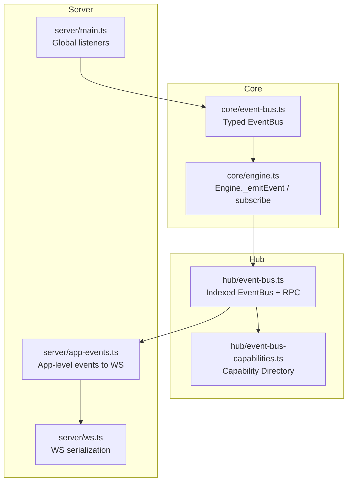
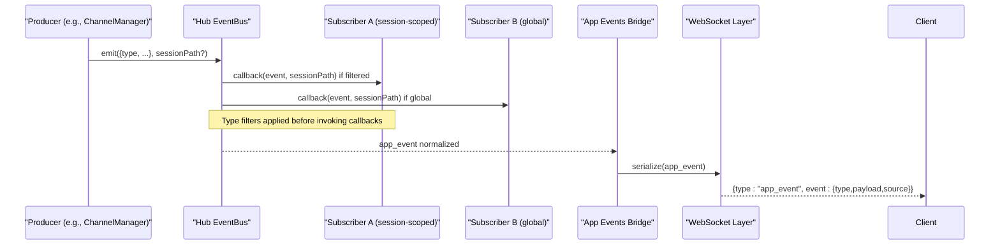
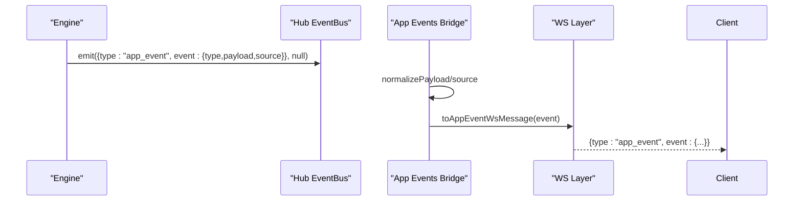
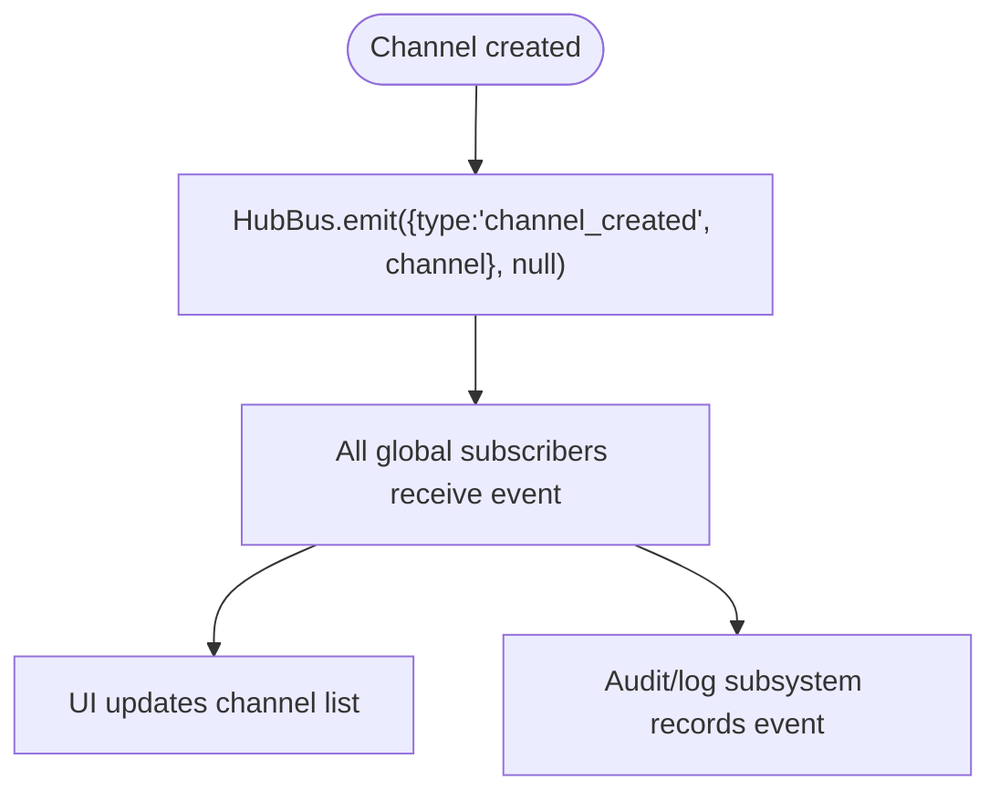
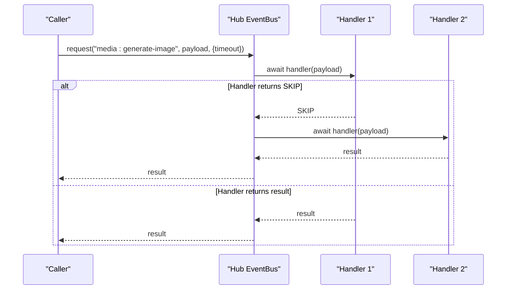
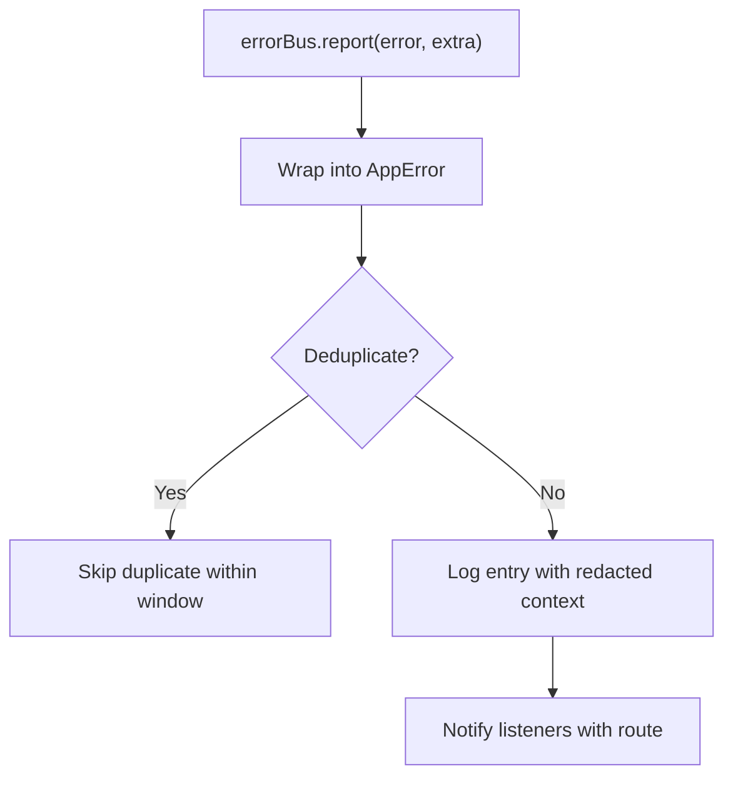
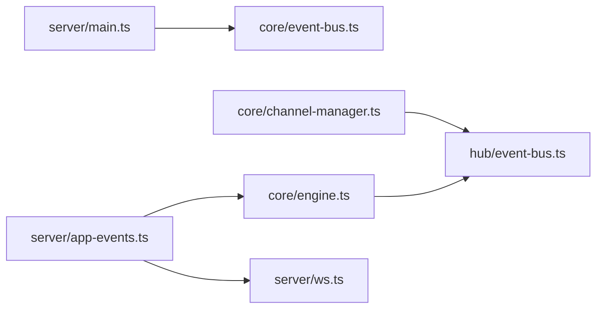

# Event-Driven Communication

<cite>
**Referenced Files in This Document**
- [core/event-bus.ts](file://core/event-bus.ts)
- [hub/event-bus.ts](file://hub/event-bus.ts)
- [hub/event-bus-capabilities.ts](file://hub/event-bus-capabilities.ts)
- [server/app-events.ts](file://server/app-events.ts)
- [shared/error-bus.ts](file://shared/error-bus.ts)
- [core/engine.ts](file://core/engine.ts)
- [core/channel-manager.ts](file://core/channel-manager.ts)
- [server/ws.ts](file://server/ws.ts)
- [server/main.ts](file://server/main.ts)
- [tests/core/event-bus.test.ts](file://tests/core/event-bus.test.ts)
</cite>

## Table of Contents
1. Introduction
2. Project Structure
3. Core Components
4. Architecture Overview
5. Detailed Component Analysis
6. Dependency Analysis
7. Performance Considerations
8. Troubleshooting Guide
9. Conclusion

## Introduction
This document explains OpenShadow’s event-driven communication system, focusing on the EventEmitter-based architecture, event types, message routing patterns, and cross-process propagation. It covers:
- The central event bus implementations for in-process and hub-level messaging
- Subscriber management and filtering
- Request/response pattern for inter-component/plugin communication
- How events facilitate loose coupling between agents, sessions, plugins, and UI components
- Error handling, ordering guarantees, performance characteristics
- Debugging and monitoring techniques for event-driven workflows

## Project Structure
OpenShadow uses two complementary event buses:
- In-process EventBus (typed, strongly typed events) used by core modules
- Hub-level EventBus (indexed, filterable subscriptions with request/handle RPC) used across subsystems and plugins



**Diagram sources**
- [core/event-bus.ts:1-122](file://core/event-bus.ts#L1-L122)
- [core/engine.ts:2100-2133](file://core/engine.ts#L2100-L2133)
- [hub/event-bus.ts:1-218](file://hub/event-bus.ts#L1-L218)
- [hub/event-bus-capabilities.ts:1-716](file://hub/event-bus-capabilities.ts#L1-L716)
- [server/app-events.ts:1-73](file://server/app-events.ts#L1-L73)
- [server/ws.ts:80-100](file://server/ws.ts#L80-L100)
- [server/main.ts:470-485](file://server/main.ts#L470-L485)

**Section sources**
- [core/event-bus.ts:1-122](file://core/event-bus.ts#L1-L122)
- [hub/event-bus.ts:1-218](file://hub/event-bus.ts#L1-L218)
- [hub/event-bus-capabilities.ts:1-716](file://hub/event-bus-capabilities.ts#L1-L716)
- [server/app-events.ts:1-73](file://server/app-events.ts#L1-L73)
- [core/engine.ts:2100-2133](file://core/engine.ts#L2100-L2133)

## Core Components
- Typed in-process EventBus: Strongly typed event map, once/any handlers, wildcard support, async handler execution, error isolation per handler.
- Hub-level EventBus: Indexed subscription by sessionPath and type filters; request/handle RPC with capability directory and timeouts; robust subscriber lifecycle.
- App-level event bridge: Normalizes app_event payloads and serializes them over WebSocket.
- ErrorBus: Centralized error reporting with breadcrumbs, deduplication, and auto-routing to UI routes.

Key responsibilities:
- Decouple producers from consumers
- Provide scoped delivery (per-session) and global broadcast
- Enable RPC-style interactions with capability declarations
- Surface errors consistently for UI and diagnostics

**Section sources**
- [core/event-bus.ts:1-122](file://core/event-bus.ts#L1-L122)
- [hub/event-bus.ts:1-218](file://hub/event-bus.ts#L1-L218)
- [hub/event-bus-capabilities.ts:1-716](file://hub/event-bus-capabilities.ts#L1-L716)
- [server/app-events.ts:1-73](file://server/app-events.ts#L1-L73)
- [shared/error-bus.ts:1-93](file://shared/error-bus.ts#L1-L93)

## Architecture Overview
The system composes an in-process typed bus with a hub-level indexed bus. Engine delegates to the hub bus when available, enabling consistent routing and filtering. App-level events are normalized and sent via WebSocket to clients.



**Diagram sources**
- [core/channel-manager.ts:165-173](file://core/channel-manager.ts#L165-L173)
- [hub/event-bus.ts:98-116](file://hub/event-bus.ts#L98-L116)
- [server/app-events.ts:34-73](file://server/app-events.ts#L34-L73)
- [server/ws.ts:80-100](file://server/ws.ts#L80-L100)

## Detailed Component Analysis

### Typed In-Process EventBus (core/event-bus.ts)
- EventMap defines all supported events and their payload shapes.
- Methods:
  - on(event, handler): register persistent listener
  - once(event, handler): one-time listener
  - onAny(handler): wildcard listener receives {event, data}
  - off(id): remove by id
  - emit(event, data): async dispatch with per-handler try/catch
  - listenerCount(event?): introspection
  - removeAllListeners(event?): cleanup
- Ordering: Handlers are invoked synchronously in registration order within each batch; once handlers are removed after invocation.
- Error handling: Each handler is wrapped in try/catch; errors are logged without aborting other handlers.

```mermaid
classDiagram
class EventBus {
- Map~string, Subscription~ subscriptions
- {id,handler,once}[] wildcardHandlers
- number idCounter
+ on(event, handler) () => void
+ once(event, handler) () => void
+ onAny(handler) () => void
+ off(id) void
+ emit(event, data) Promise~void~
+ listenerCount(event?) number
+ removeAllListeners(event?) void
}
class Subscription {
+ string id
+ string event
+ EventHandler handler
+ boolean once
}
EventBus --> Subscription : "manages"
```

**Diagram sources**
- [core/event-bus.ts:30-119](file://core/event-bus.ts#L30-L119)

**Section sources**
- [core/event-bus.ts:1-122](file://core/event-bus.ts#L1-L122)
- [tests/core/event-bus.test.ts:38-74](file://tests/core/event-bus.test.ts#L38-L74)

### Hub-Level EventBus (hub/event-bus.ts)
- Subscription model:
  - subscribe(callback, filter): filter supports sessionPath and types array (normalized to Set for O(1) matching)
  - Indexes:
    - _globalSubs: Set of ids for global subscribers
    - _sessionIndex: Map<sessionPath, Set<id>> for scoped subscribers
- Emit semantics:
  - Collect target ids from global set and session index
  - Apply type filter before invoking callback
  - Errors in callbacks are caught and logged
- Request/Handle RPC:
  - handle(type, handler, options): registers async handlers; optional capability registration
  - request(type, payload, options): calls first non-SKIP handler with timeout
  - hasHandler(type), listCapabilities(), getCapability(type)
- Capability directory:
  - Built-in capabilities define schemas, permissions, stability, and allowed errors

```mermaid
classDiagram
class EventBus {
- Map~number,{callback,filter}~ _subscribers
- Set~number~ _globalSubs
- Map~string,Set~number~~ _sessionIndex
- Map~string,Function[]~ _handlers
- EventBusCapabilityDirectory _capabilities
+ subscribe(callback, filter) () => void
+ emit(event, sessionPath) void
+ handle(type, handler, options) () => void
+ request(type, payload, options) Promise~any~
+ hasHandler(type) boolean
+ listCapabilities() any[]
+ getCapability(type) any
}
class EventBusCapabilityDirectory {
+ register(capability) any
+ unregister(type) void
+ get(type) any
+ list() any[]
}
EventBus --> EventBusCapabilityDirectory : "uses"
```

**Diagram sources**
- [hub/event-bus.ts:31-218](file://hub/event-bus.ts#L31-L218)
- [hub/event-bus-capabilities.ts:642-716](file://hub/event-bus-capabilities.ts#L642-L716)

**Section sources**
- [hub/event-bus.ts:1-218](file://hub/event-bus.ts#L1-L218)
- [hub/event-bus-capabilities.ts:1-716](file://hub/event-bus-capabilities.ts#L1-L716)

### Engine Integration and App-Level Events
- Engine delegates to hub bus when present; otherwise falls back to internal listeners.
- App-level events are normalized and emitted as app_event with source "server".
- Server-side WS layer serializes app_event messages for clients.



**Diagram sources**
- [core/engine.ts:2107-2133](file://core/engine.ts#L2107-L2133)
- [server/app-events.ts:34-73](file://server/app-events.ts#L34-L73)
- [server/ws.ts:80-100](file://server/ws.ts#L80-L100)

**Section sources**
- [core/engine.ts:2100-2133](file://core/engine.ts#L2100-L2133)
- [server/app-events.ts:1-73](file://server/app-events.ts#L1-L73)
- [server/ws.ts:80-100](file://server/ws.ts#L80-L100)

### Cross-Subsystem Usage Examples
- Channel creation emits channel_created with channel metadata.
- Global server listeners subscribe to chat:error and sandbox:violation for centralized logging and policy enforcement.



**Diagram sources**
- [core/channel-manager.ts:165-173](file://core/channel-manager.ts#L165-L173)
- [server/main.ts:470-485](file://server/main.ts#L470-L485)

**Section sources**
- [core/channel-manager.ts:165-173](file://core/channel-manager.ts#L165-L173)
- [server/main.ts:470-485](file://server/main.ts#L470-L485)

### Request/Handle Pattern (RPC)
- Producers call request(type, payload, options) to invoke the first non-SKIP handler.
- Handlers can opt out by returning SKIP; otherwise return a result.
- Timeouts are enforced; BusTimeoutError thrown if exceeded.
- Capabilities declare input/output schemas, permissions, and stable error codes.



**Diagram sources**
- [hub/event-bus.ts:160-186](file://hub/event-bus.ts#L160-L186)
- [hub/event-bus-capabilities.ts:12-126](file://hub/event-bus-capabilities.ts#L12-L126)

**Section sources**
- [hub/event-bus.ts:128-186](file://hub/event-bus.ts#L128-L186)
- [hub/event-bus-capabilities.ts:1-126](file://hub/event-bus-capabilities.ts#L1-L126)

### Error Handling and Diagnostics
- Per-handler try/catch prevents failures from blocking other handlers.
- ErrorBus aggregates errors with breadcrumbs, deduplication, and auto-routing to statusbar/boundary/toast.
- App-level normalization ensures only valid plain objects propagate as payloads.



**Diagram sources**
- [shared/error-bus.ts:41-88](file://shared/error-bus.ts#L41-L88)
- [server/app-events.ts:16-28](file://server/app-events.ts#L16-L28)

**Section sources**
- [shared/error-bus.ts:1-93](file://shared/error-bus.ts#L1-L93)
- [server/app-events.ts:1-73](file://server/app-events.ts#L1-L73)

## Dependency Analysis
- Engine depends on hub bus when injected; otherwise uses internal listeners.
- Channel manager emits hub events using hub.eventBus.
- Server main wires global listeners to typed bus for cross-cutting concerns.
- App events bridge depends on engine.emitEvent and WS serialization.



**Diagram sources**
- [core/engine.ts:2100-2133](file://core/engine.ts#L2100-L2133)
- [core/channel-manager.ts:165-173](file://core/channel-manager.ts#L165-L173)
- [server/main.ts:470-485](file://server/main.ts#L470-L485)
- [server/app-events.ts:34-73](file://server/app-events.ts#L34-L73)
- [server/ws.ts:80-100](file://server/ws.ts#L80-L100)

**Section sources**
- [core/engine.ts:2100-2133](file://core/engine.ts#L2100-L2133)
- [core/channel-manager.ts:165-173](file://core/channel-manager.ts#L165-L173)
- [server/main.ts:470-485](file://server/main.ts#L470-L485)
- [server/app-events.ts:34-73](file://server/app-events.ts#L34-L73)
- [server/ws.ts:80-100](file://server/ws.ts#L80-L100)

## Performance Considerations
- Hub bus indexes subscribers by sessionPath and converts type filters to Sets for O(1) checks during emit.
- Only relevant subscribers are notified, reducing overhead in multi-session environments.
- Async handlers are awaited sequentially per subscriber; avoid long-running work in handlers or offload to background tasks.
- Use once() for transient listeners to prevent memory growth.
- For high-frequency events, prefer type-filtered subscriptions to minimize handler invocations.

[No sources needed since this section provides general guidance]

## Troubleshooting Guide
- Verify handler registration:
  - Use hub bus hasHandler(type) and listCapabilities() to confirm availability.
- Inspect subscriptions:
  - For typed bus, use listenerCount(event?) to validate registrations.
- Trace app events:
  - Ensure payloads are plain objects and sources are strings; invalid values are rejected early.
- Monitor errors:
  - Subscribe to ErrorBus to capture breadcrumbs and deduplicated entries.
- Reproduce with tests:
  - Refer to unit tests for once(), unsubscribe, and wildcard behavior.

**Section sources**
- [hub/event-bus.ts:193-216](file://hub/event-bus.ts#L193-L216)
- [core/event-bus.ts:96-103](file://core/event-bus.ts#L96-L103)
- [server/app-events.ts:16-28](file://server/app-events.ts#L16-L28)
- [shared/error-bus.ts:41-88](file://shared/error-bus.ts#L41-L88)
- [tests/core/event-bus.test.ts:38-74](file://tests/core/event-bus.test.ts#L38-L74)

## Conclusion
OpenShadow’s event-driven architecture combines a strongly typed in-process bus with a powerful hub-level bus that supports scoped delivery, type filtering, and RPC-style communication with declared capabilities. This design enables loose coupling across agents, sessions, plugins, and UI components while providing robust error handling, clear debugging paths, and performance-conscious indexing.

[No sources needed since this section summarizes without analyzing specific files]