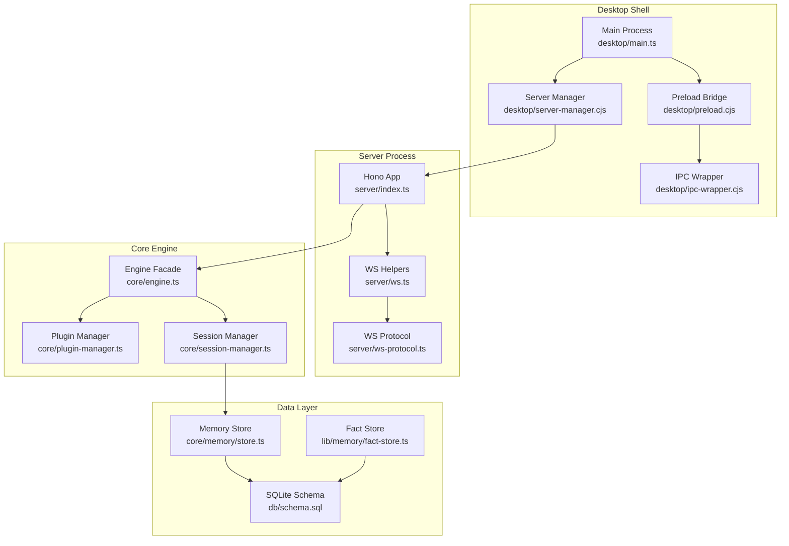
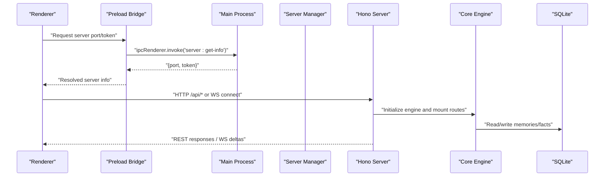
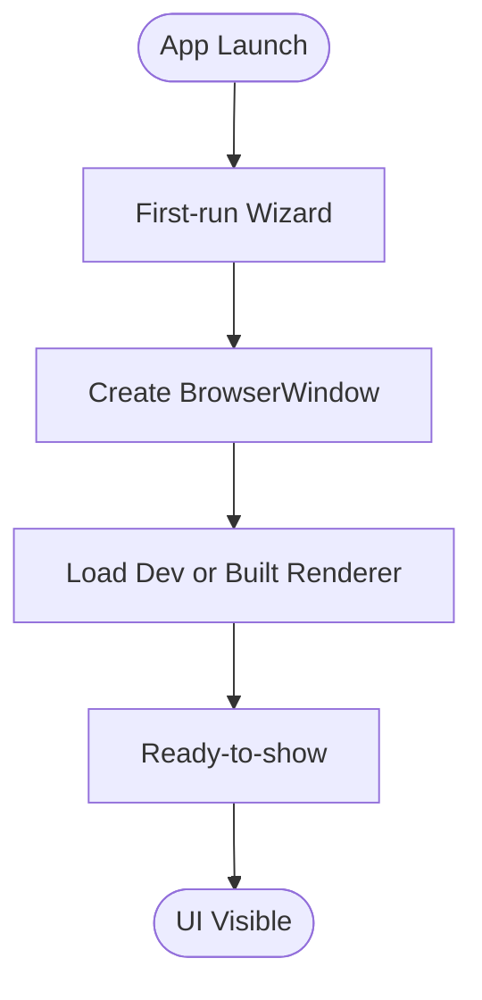
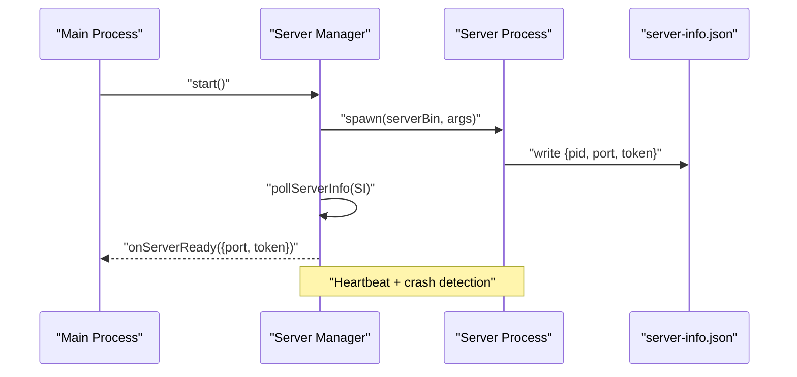
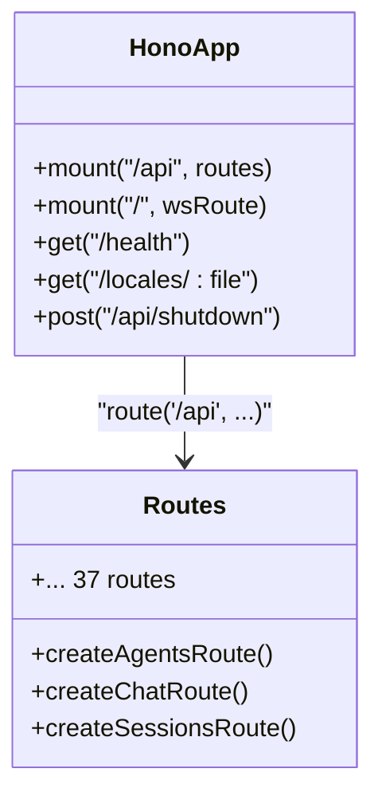
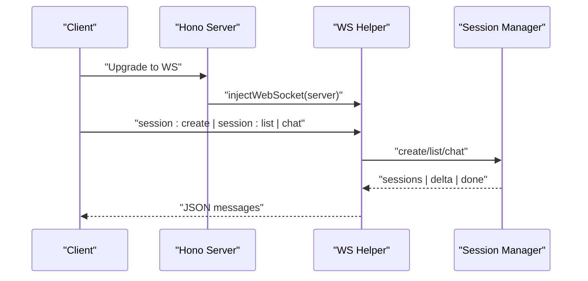
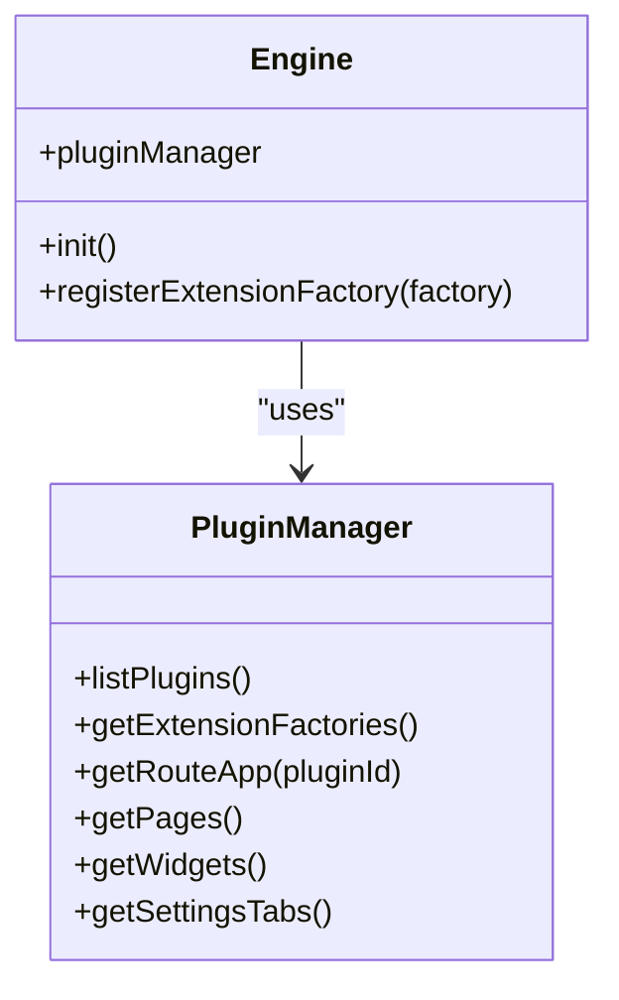
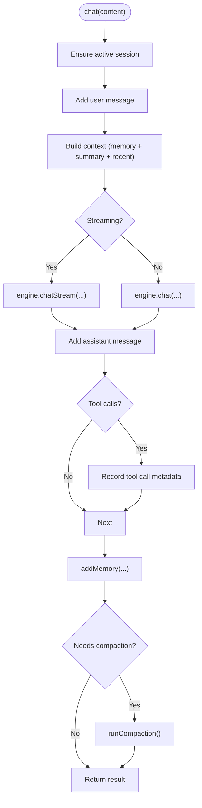
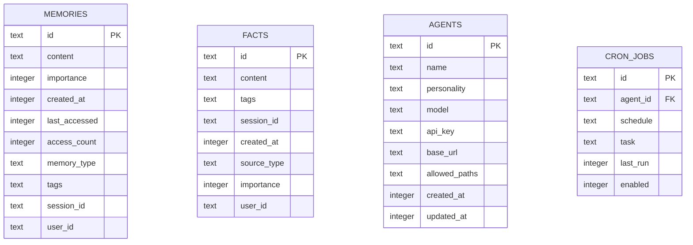
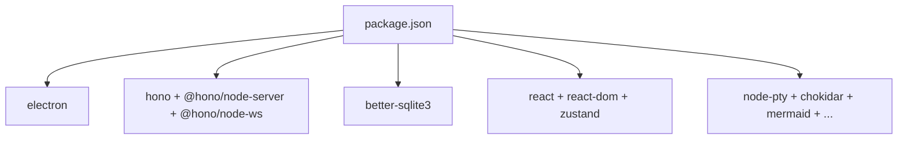

# System Overview

<cite>
**Referenced Files in This Document**
- [desktop/main.ts](file://desktop/main.ts)
- [desktop/preload.cjs](file://desktop/preload.cjs)
- [desktop/ipc-wrapper.cjs](file://desktop/ipc-wrapper.cjs)
- [desktop/server-manager.cjs](file://desktop/server-manager.cjs)
- [server/index.ts](file://server/index.ts)
- [server/ws.ts](file://server/ws.ts)
- [server/ws-protocol.ts](file://server/ws-protocol.ts)
- [core/engine.ts](file://core/engine.ts)
- [core/plugin-manager.ts](file://core/plugin-manager.ts)
- [core/session-manager.ts](file://core/session-manager.ts)
- [db/schema.sql](file://db/schema.sql)
- [core/memory/store.ts](file://core/memory/store.ts)
- [lib/memory/fact-store.ts](file://lib/memory/fact-store.ts)
- [packages/plugin-runtime/README.md](file://packages/plugin-runtime/README.md)
- [package.json](file://package.json)
</cite>

## Table of Contents
1. Introduction
2. Project Structure
3. Core Components
4. Architecture Overview
5. Detailed Component Analysis
6. Dependency Analysis
7. Performance Considerations
8. Troubleshooting Guide
9. Conclusion

## Introduction
OpenShadow is a desktop-first AI agent platform that combines an Electron-based UI shell with a local Hono HTTP server, a Pi SDK-driven agent runtime, and a SQLite-backed memory layer. The system follows a multi-process architecture: the Electron main process manages the renderer UI and spawns a dedicated server process; the server exposes REST and WebSocket APIs to orchestrate sessions, plugins, tools, and integrations; the core engine coordinates agents, providers, and plugin extensions; and SQLite persists memories, facts, and configuration artifacts.

This overview explains the high-level architecture, component boundaries, data flows, and extensibility model, and provides rationale for technology stack choices and design trade-offs.

## Project Structure
At a high level, OpenShadow organizes code into:
- Desktop shell (Electron): main process, preload bridge, IPC wrappers, and server lifecycle management
- Server (Hono): HTTP routes, WebSocket streaming, and session/event bus integration
- Core engine: agent orchestration, plugin manager, session coordination, provider compatibility, and tooling
- Data layer: SQLite schema and memory stores
- Plugin ecosystem: plugin discovery, activation, routing, and runtime contracts

**Diagram sources**
- [desktop/main.ts:1-109](file://desktop/main.ts#L1-L109)
- [desktop/preload.cjs:1-112](file://desktop/preload.cjs#L1-L112)
- [desktop/ipc-wrapper.cjs:1-74](file://desktop/ipc-wrapper.cjs#L1-L74)
- [desktop/server-manager.cjs:1-200](file://desktop/server-manager.cjs#L1-L200)
- [server/index.ts:1-320](file://server/index.ts#L1-L320)
- [server/ws.ts:1-177](file://server/ws.ts#L1-L177)
- [server/ws-protocol.ts:35-99](file://server/ws-protocol.ts#L35-L99)
- [core/engine.ts:1-200](file://core/engine.ts#L1-L200)
- [core/plugin-manager.ts:1-200](file://core/plugin-manager.ts#L1-L200)
- [core/session-manager.ts:1-165](file://core/session-manager.ts#L1-L165)
- [db/schema.sql:1-104](file://db/schema.sql#L1-L104)
- [core/memory/store.ts:44-88](file://core/memory/store.ts#L44-L88)
- [lib/memory/fact-store.ts:120-236](file://lib/memory/fact-store.ts#L120-L236)

**Section sources**
- [desktop/main.ts:1-109](file://desktop/main.ts#L1-L109)
- [server/index.ts:1-320](file://server/index.ts#L1-L320)
- [core/engine.ts:1-200](file://core/engine.ts#L1-L200)
- [db/schema.sql:1-104](file://db/schema.sql#L1-L104)

## Core Components
- Electron Main Process: Bootstraps the app window, runs first-run wizard, loads renderer, and delegates OS/browser capabilities via preload and IPC.
- Preload Bridge: Exposes safe, minimal APIs to the renderer (e.g., file I/O, browser automation, window control) using contextBridge and ipcRenderer.
- IPC Wrapper: Centralizes sender validation and structured error logging for all IPC handlers.
- Server Manager: Spawns and monitors the Hono server process, handles health checks, reuse of existing servers, restarts, and graceful shutdown.
- Hono Server: Initializes the engine, mounts business routes, enables CORS, integrates WebSocket upgrade, writes server-info.json for discovery, and exposes /api endpoints.
- Core Engine: Thin facade over managers (agents, sessions, config, channels, models, skills, preferences), orchestrates plugins, and wires extension factories.
- Plugin Manager: Discovers, validates, activates, and unloads plugins; normalizes capabilities, activation events, and UI contributions; exposes route apps and extension factories.
- Session Manager: Manages session lifecycle, chat flow, compaction, and memory integration.
- Memory Stores: Persist memories and facts with FTS5 full-text search and triggers; provide migration and indexing.

**Section sources**
- [desktop/preload.cjs:1-112](file://desktop/preload.cjs#L1-L112)
- [desktop/ipc-wrapper.cjs:1-74](file://desktop/ipc-wrapper.cjs#L1-L74)
- [desktop/server-manager.cjs:1-200](file://desktop/server-manager.cjs#L1-L200)
- [server/index.ts:1-320](file://server/index.ts#L1-L320)
- [core/engine.ts:1-200](file://core/engine.ts#L1-L200)
- [core/plugin-manager.ts:1-200](file://core/plugin-manager.ts#L1-L200)
- [core/session-manager.ts:1-165](file://core/session-manager.ts#L1-L165)
- [core/memory/store.ts:44-88](file://core/memory/store.ts#L44-L88)
- [lib/memory/fact-store.ts:120-236](file://lib/memory/fact-store.ts#L120-L236)

## Architecture Overview
The system uses a clear separation between UI, server, and core logic:
- Renderer processes communicate with the main process via IPC through the preload bridge.
- The main process controls the server lifecycle and proxies OS/browser features.
- The server hosts the Hono application, which initializes the engine and mounts routes for REST and WebSocket streaming.
- The engine coordinates agents, plugins, and sessions, while memory stores persist state in SQLite.

**Diagram sources**
- [desktop/preload.cjs:1-112](file://desktop/preload.cjs#L1-L112)
- [desktop/server-manager.cjs:1-200](file://desktop/server-manager.cjs#L1-L200)
- [server/index.ts:1-320](file://server/index.ts#L1-L320)
- [core/engine.ts:1-200](file://core/engine.ts#L1-L200)
- [db/schema.sql:1-104](file://db/schema.sql#L1-L104)

## Detailed Component Analysis

### Electron Desktop Shell
- Main process creates the BrowserWindow, sets secure webPreferences, and loads either dev Vite URL or built renderer. It also runs a first-run wizard to configure workspace roots and security settings.
- Preload bridge exposes a curated set of APIs to the renderer, including server discovery, file operations, browser automation, and window control. It also listens for server readiness and restart events.
- IPC wrapper enforces sender validation and logs structured errors for all IPC handlers.

**Diagram sources**
- [desktop/main.ts:1-109](file://desktop/main.ts#L1-L109)

**Section sources**
- [desktop/main.ts:1-109](file://desktop/main.ts#L1-L109)
- [desktop/preload.cjs:1-112](file://desktop/preload.cjs#L1-L112)
- [desktop/ipc-wrapper.cjs:1-74](file://desktop/ipc-wrapper.cjs#L1-L74)

### Server Lifecycle and Discovery
- Server Manager selects the appropriate server binary or entrypoint based on platform and packaging mode, then spawns the server process.
- It polls server-info.json for readiness, reuses an existing healthy server when possible, and handles crashes/restarts with heartbeat monitoring.
- The server writes server-info.json with pid, port, host, and token for discovery by the desktop shell.

**Diagram sources**
- [desktop/server-manager.cjs:1-200](file://desktop/server-manager.cjs#L1-L200)
- [server/index.ts:270-312](file://server/index.ts#L270-L312)

**Section sources**
- [desktop/server-manager.cjs:1-200](file://desktop/server-manager.cjs#L1-L200)
- [server/index.ts:270-312](file://server/index.ts#L270-L312)

### Hono HTTP Server and Routes
- The server initializes environment variables, resolves Shadow Home, ensures first-run defaults, and constructs the HanaEngine.
- It mounts numerous business routes under /api and also mounts WebSocket routes at both /api and root /.
- Health endpoints, locales static files, and shutdown endpoint are provided.

**Diagram sources**
- [server/index.ts:1-320](file://server/index.ts#L1-L320)

**Section sources**
- [server/index.ts:1-320](file://server/index.ts#L1-L320)

### WebSocket Streaming and Protocol
- The server integrates node-ws to enable WebSocket upgrades alongside HTTP.
- A lightweight WS helper demonstrates session creation, switching, listing, and chat streaming with typing/delta/done/error messages.
- The protocol module defines helpers for safe send/parsing and constructing session stream events and resume messages.

**Diagram sources**
- [server/index.ts:67-74](file://server/index.ts#L67-L74)
- [server/ws.ts:1-177](file://server/ws.ts#L1-L177)
- [server/ws-protocol.ts:35-99](file://server/ws-protocol.ts#L35-L99)

**Section sources**
- [server/ws.ts:1-177](file://server/ws.ts#L1-L177)
- [server/ws-protocol.ts:35-99](file://server/ws-protocol.ts#L35-L99)

### Core Engine and Plugin Extensibility
- The engine acts as a thin facade over managers (agent, session, config, channel, model, skill, preferences).
- It synchronizes extension factories from core, framework, and plugins into a shared array used by resource loaders.
- The plugin manager discovers plugins from multiple directories, normalizes manifests, validates capabilities, and supports activation events and UI contributions. It exposes route apps and extension factories to the engine.

**Diagram sources**
- [core/engine.ts:1823-1856](file://core/engine.ts#L1823-L1856)
- [core/plugin-manager.ts:1-200](file://core/plugin-manager.ts#L1-L200)
- [core/plugin-manager.ts:1476-1552](file://core/plugin-manager.ts#L1476-L1552)

**Section sources**
- [core/engine.ts:1-200](file://core/engine.ts#L1-L200)
- [core/engine.ts:1823-1856](file://core/engine.ts#L1823-L1856)
- [core/plugin-manager.ts:1-200](file://core/plugin-manager.ts#L1-L200)
- [core/plugin-manager.ts:1476-1552](file://core/plugin-manager.ts#L1476-L1552)

### Session Management and Chat Flow
- Session Manager maintains active sessions, persists messages, and integrates with memory systems.
- On chat, it builds message context (long-term memory, summaries, recent messages), streams results if requested, records assistant output, and triggers compaction when needed.
- Compaction summarizes older messages and trims history, notifying memory subsystems accordingly.

**Diagram sources**
- [core/session-manager.ts:1-165](file://core/session-manager.ts#L1-L165)

**Section sources**
- [core/session-manager.ts:1-165](file://core/session-manager.ts#L1-L165)

### Data Layer: SQLite Schema and Memory Stores
- The schema defines tables for memories, agents, cron jobs, and facts, along with FTS5 virtual tables and triggers for full-text search.
- Memory store initializes schema, migrates missing columns, and maps rows to domain objects.
- Fact store includes migrations, FTS5 rebuilds, and prepared statements for efficient queries.

**Diagram sources**
- [db/schema.sql:1-104](file://db/schema.sql#L1-L104)

**Section sources**
- [db/schema.sql:1-104](file://db/schema.sql#L1-L104)
- [core/memory/store.ts:44-88](file://core/memory/store.ts#L44-L88)
- [lib/memory/fact-store.ts:120-236](file://lib/memory/fact-store.ts#L120-L236)

### Plugin Runtime Contracts
- Plugins can register event bus handlers and request bus interactions using shared types and utilities.
- Capability declarations and permission scoping ensure safe interaction between plugins and host services.

**Section sources**
- [packages/plugin-runtime/README.md:39-81](file://packages/plugin-runtime/README.md#L39-L81)

## Dependency Analysis
OpenShadow’s dependencies reflect its architectural choices:
- Electron for cross-platform desktop shell and native integration
- Hono and @hono/node-server for lightweight HTTP and WebSocket support
- better-sqlite3 for embedded database persistence
- React and related libraries for the renderer UI
- Various LLM client adapters and tooling libraries for agent capabilities

**Diagram sources**
- [package.json:164-213](file://package.json#L164-L213)

**Section sources**
- [package.json:1-240](file://package.json#L1-L240)

## Performance Considerations
- Server startup: The server manager allows long startup timeouts to accommodate cold starts on Windows and other platforms.
- WebSocket efficiency: Serialized JSON sending avoids repeated serialization in broadcast scenarios.
- Database performance: FTS5 indexes and triggers improve search performance; periodic compaction reduces session size and improves responsiveness.
- IPC safety: Sender validation prevents unauthorized calls and reduces overhead from unsafe operations.

[No sources needed since this section provides general guidance]

## Troubleshooting Guide
- Server not ready: Check server-info.json existence and PID liveness; verify health endpoint and token usage.
- IPC errors: Review IPC wrapper logs for trace IDs and channel names; ensure sender validator permits trusted WebContents.
- WebSocket issues: Confirm upgrade injection and route mounting; validate message schemas and sequence numbers for stream resume.
- Plugin failures: Inspect plugin diagnostics, activation states, and capability declarations; confirm manifest correctness and directory structure.

**Section sources**
- [desktop/server-manager.cjs:1-200](file://desktop/server-manager.cjs#L1-L200)
- [desktop/ipc-wrapper.cjs:1-74](file://desktop/ipc-wrapper.cjs#L1-L74)
- [server/ws-protocol.ts:35-99](file://server/ws-protocol.ts#L35-L99)
- [core/plugin-manager.ts:1476-1552](file://core/plugin-manager.ts#L1476-L1552)

## Conclusion
OpenShadow’s architecture cleanly separates concerns across processes and layers: the Electron shell manages UI and OS integration, the Hono server exposes robust APIs and streaming, the core engine orchestrates agents and plugins, and SQLite persists critical state. The plugin-based extensibility model enables rich functionality while maintaining safety through capability declarations and IPC validation. Technology choices prioritize developer ergonomics, cross-platform compatibility, and operational resilience.

[No sources needed since this section summarizes without analyzing specific files]