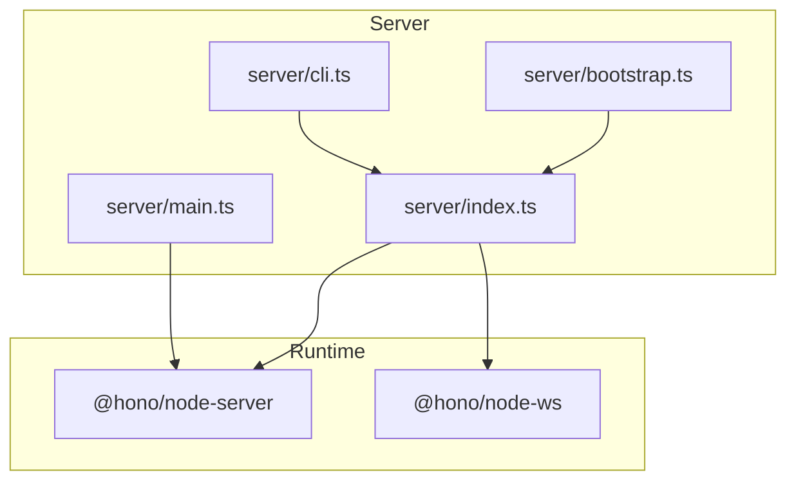
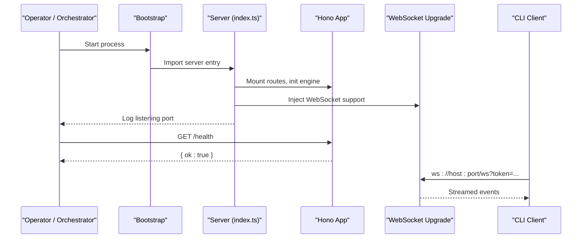
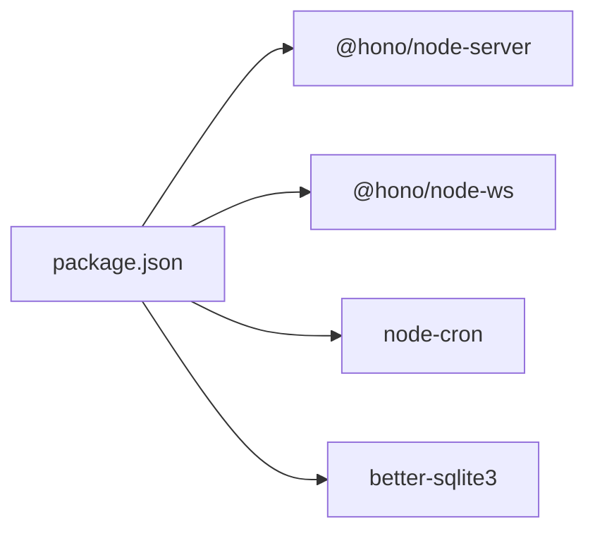

# Deployment & Operations

<cite>
**Referenced Files in This Document**
- [server/index.ts](file://server/index.ts)
- [server/main.ts](file://server/main.ts)
- [server/bootstrap.ts](file://server/bootstrap.ts)
- [server/cli.ts](file://server/cli.ts)
- [config.example.yaml](file://config.example.yaml)
- [package.json](file://package.json)
- [.github/workflows/release.yml](file:.github/workflows/release.yml)
- [core/security-audit-log.ts](file://core/security-audit-log.ts)
- [server/http/security-audit.ts](file://server/http/security-audit.ts)
- [core/server-auth.ts](file://core/server-auth.ts)
- [desktop/src/shared/error-bus.ts](file://desktop/src/shared/error-bus.ts)
- [shared/errors.ts](file://shared/errors.ts)
- [server/routes/config.ts](file://server/routes/config.ts)
</cite>

## Table of Contents
1. Introduction
2. Project Structure
3. Core Components
4. Architecture Overview
5. Detailed Component Analysis
6. Dependency Analysis
7. Performance Considerations
8. Troubleshooting Guide
9. Conclusion
10. Appendices

## Introduction
This document provides production-focused deployment and operations guidance for OpenShadow. It covers deployment strategies (standalone server, embedded server via Electron, containerized), monitoring and logging, alerting, scaling and high availability, backup and recovery, disaster planning, maintenance tasks, security hardening, performance tuning, troubleshooting, and automated pipelines with infrastructure as code practices.

## Project Structure
OpenShadow exposes a Node.js HTTP + WebSocket server with multiple entry points:
- Standalone server entry that initializes the engine, mounts routes, starts HTTP, and injects WebSocket support.
- A minimal server variant used by the desktop app’s internal server process.
- A bootstrap wrapper to improve startup robustness under heavy imports or native module loading.
- A CLI client that connects over WebSocket to the running server.

**Diagram sources**
- [server/index.ts:1-320](file://server/index.ts#L1-L320)
- [server/main.ts:1-544](file://server/main.ts#L1-L544)
- [server/bootstrap.ts:1-74](file://server/bootstrap.ts#L1-L74)
- [server/cli.ts:1-462](file://server/cli.ts#L1-L462)

**Section sources**
- [server/index.ts:1-320](file://server/index.ts#L1-L320)
- [server/main.ts:1-544](file://server/main.ts#L1-L544)
- [server/bootstrap.ts:1-74](file://server/bootstrap.ts#L1-L74)
- [server/cli.ts:1-462](file://server/cli.ts#L1-L462)

## Core Components
- Server bootstrap: Ensures reliable startup even when native modules or heavy imports block the main thread; writes keepalive logs from an independent worker.
- Main server: Initializes the engine, mounts business routes, starts HTTP on configurable ports, and enables WebSocket upgrade.
- Minimal server: Provides a smaller footprint server with health endpoints and route mounting.
- CLI client: Connects to the server over WebSocket using a token and supports interactive commands.

Key operational characteristics:
- Data directory resolution via environment variables and home directory fallback.
- Health check endpoints for readiness/liveness probes.
- Graceful shutdown endpoint and signal handling.
- Security audit logging to a JSONL file under the data directory.

**Section sources**
- [server/bootstrap.ts:1-74](file://server/bootstrap.ts#L1-L74)
- [server/index.ts:1-320](file://server/index.ts#L1-L320)
- [server/main.ts:1-544](file://server/main.ts#L1-L544)
- [server/cli.ts:1-462](file://server/cli.ts#L1-L462)
- [core/security-audit-log.ts:1-40](file://core/security-audit-log.ts#L1-L40)

## Architecture Overview
The runtime architecture centers around a single-process HTTP + WebSocket server backed by Hono. The bootstrap layer improves startup reliability. The CLI is a thin client over WebSocket.

**Diagram sources**
- [server/bootstrap.ts:1-74](file://server/bootstrap.ts#L1-L74)
- [server/index.ts:1-320](file://server/index.ts#L1-L320)
- [server/cli.ts:1-462](file://server/cli.ts#L1-L462)

## Detailed Component Analysis

### Standalone Server Deployment
- Entry point: server/index.ts initializes the engine, mounts routes, starts HTTP, and injects WebSocket support.
- Port selection: SHADOW_PORT > PORT > default 3000.
- Data directory: SHADOW_HOME/OPENSHADOW_HOME resolved at startup; defaults to ~/.openshadow if unset.
- Health endpoints: /, /health, /api/health return simple status objects suitable for liveness/readiness checks.
- Shutdown: POST /api/shutdown triggers graceful exit and cleanup of server-info.json.
- Signals: SIGINT/SIGTERM handled to clean up artifacts before exit.

Operational notes:
- Use a process manager (systemd, PM2, Docker Entrypoint) to supervise restarts.
- Configure reverse proxy (nginx/caddy) for TLS termination and static assets if needed.
- Ensure the data directory is persistent across restarts.

**Section sources**
- [server/index.ts:1-320](file://server/index.ts#L1-L320)

### Embedded Server (Electron Desktop)
- The desktop application embeds a local server instance and communicates via localhost HTTP/WebSocket.
- Bootstrap wrapper (server/bootstrap.ts) ensures progress reporting during heavy initialization.
- CLI client (server/cli.ts) demonstrates token-based WebSocket access patterns compatible with the embedded server.

Operational notes:
- For headless/embedded usage, ensure the server-info.json path is writable and readable by the host process.
- Keep the embedded server isolated to loopback unless explicitly configured otherwise.

**Section sources**
- [server/bootstrap.ts:1-74](file://server/bootstrap.ts#L1-L74)
- [server/cli.ts:1-462](file://server/cli.ts#L1-L462)

### Containerized Deployment
Recommended approach:
- Build a minimal Node image and run the standalone server entry.
- Expose the HTTP port (default 3000) and optionally the WebSocket port if used directly.
- Mount a persistent volume for the data directory (SHADOW_HOME).
- Provide secrets via environment variables (e.g., AGENT_API_KEY, AGENT_BASE_URL).
- Use liveness/readiness probes against /health and /api/health.

Example orchestration considerations:
- Set SHADOW_HOME to a mounted path.
- Configure resource limits and requests appropriate for workload.
- Enable horizontal scaling behind a load balancer if stateless design is adopted (see Scaling section).

[No sources needed since this section provides general guidance]

### Monitoring and Observability
- Health endpoints:
  - GET / returns application name/version/status.
  - GET /health and GET /api/health return { ok: true }.
- Memory ticker health:
  - Exposed via configuration routes; includes step-level health and failure counts.
- Security audit log:
  - JSONL file written under the data directory logs security decisions and actions.

Operational tips:
- Scrape /health periodically for liveness.
- Parse security-audit.jsonl for compliance and incident analysis.
- Integrate memory ticker health into dashboards to detect degraded memory processing.

**Section sources**
- [server/index.ts:1-320](file://server/index.ts#L1-L320)
- [server/routes/config.ts:139-184](file://server/routes/config.ts#L139-L184)
- [core/security-audit-log.ts:1-40](file://core/security-audit-log.ts#L1-L40)

### Logging Configuration
- Console logging: Standard output streams are used for startup and heartbeat messages.
- Security audit: Events appended to security-audit.jsonl under the data directory.
- Error bus (desktop): Centralized error reporting with breadcrumbs and deduplication.

Best practices:
- Forward stdout/stderr to your logging pipeline (e.g., journald, Fluent Bit, CloudWatch).
- Ship security-audit.jsonl to a secure SIEM or log aggregator.
- Avoid logging sensitive fields; redaction helpers exist in shared utilities.

**Section sources**
- [server/index.ts:1-320](file://server/index.ts#L1-L320)
- [core/security-audit-log.ts:1-40](file://core/security-audit-log.ts#L1-L40)
- [desktop/src/shared/error-bus.ts:1-92](file://desktop/src/shared/error-bus.ts#L1-L92)

### Alerting Setup
- Liveness alerts: Trigger when /health fails consecutive checks.
- Readiness alerts: If /api/health responds but critical subsystems report unhealthy (e.g., memory ticker degraded/unhealthy).
- Security alerts: Monitor spikes in blocked operations or repeated sandbox violations.
- Process health: Use process manager signals and crash counts to trigger restarts and alerts.

[No sources needed since this section provides general guidance]

### Scaling and High Availability
- Horizontal scaling:
  - Stateless API surface can be scaled behind a load balancer.
  - Persistent state resides in the data directory; use shared storage or externalize state where possible.
- Load balancing:
  - Place nginx/caddy/Traefik in front to terminate TLS and distribute traffic.
  - Sticky sessions may be required if in-memory state exists; prefer stateless design.
- WebSocket:
  - Ensure LB supports WebSocket upgrades.
  - Consider connection affinity if session state is not fully externalized.

[No sources needed since this section provides general guidance]

### Backup and Recovery
- Data directory: Back up SHADOW_HOME regularly (includes config, logs, and runtime artifacts).
- Checkpoints: UI exposes checkpoint listing and restore actions; integrate with scheduled backups.
- Migration backups: Existing migration-backups directories indicate versioned snapshots; preserve these for rollback paths.

Recovery steps:
- Stop the service.
- Restore SHADOW_HOME from latest snapshot.
- Restart the service and verify /health.

**Section sources**
- [desktop/src/react/settings/tabs/SecurityTab.tsx:236-265](file://desktop/src/react/settings/tabs/SecurityTab.tsx#L236-L265)
- [migration-backups/provider-catalog-v1-2026-06-18T16-43-16-564Z/added-models.yaml:1-4](file://migration-backups/provider-catalog-v1-2026-06-18T16-43-16-564Z/added-models.yaml#L1-L4)

### Disaster Planning
- Multi-region replication: Replicate SHADOW_HOME to secondary regions using object storage or filesystem replication.
- Runbooks: Document procedures for full restore, partial restore (e.g., config only), and failover.
- Testing: Periodically test restores in staging to validate RTO/RPO targets.

[No sources needed since this section provides general guidance]

### Maintenance Tasks
- Rotate logs: Archive and compress security-audit.jsonl and other logs.
- Clean old memories and usage logs: Built-in intervals perform periodic cleanup; monitor metrics to tune frequency.
- Update providers/models: Use configuration endpoints to update models and provider settings without downtime.

**Section sources**
- [server/main.ts:1-544](file://server/main.ts#L1-L544)
- [server/index.ts:1-320](file://server/index.ts#L1-L320)

### Security Hardening
- Authentication:
  - Loopback token and device credentials supported; enforce least privilege.
- Authorization:
  - Capability guards and principal resolution integrated into request handling.
- Audit:
  - Security audit events recorded per action with actor and decision metadata.
- Secrets management:
  - Redaction helpers mask sensitive keys in logs and responses.

Hardening checklist:
- Restrict network exposure to localhost or trusted networks.
- Enforce TLS at the reverse proxy.
- Limit writable paths and workspace roots.
- Regularly review security-audit.jsonl for anomalies.

**Section sources**
- [core/server-auth.ts:1-44](file://core/server-auth.ts#L1-L44)
- [server/http/security-audit.ts:1-34](file://server/http/security-audit.ts#L1-L34)
- [core/security-audit-log.ts:1-40](file://core/security-audit-log.ts#L1-L40)

### Performance Tuning
- Startup:
  - Bootstrap keeps progress alive during heavy imports/native loads.
- Concurrency:
  - Tune event loop backpressure by limiting concurrent long-running tasks.
- I/O:
  - Prefer asynchronous operations and avoid blocking calls.
- Memory:
  - Monitor memory ticker health and adjust compaction intervals based on workload.

**Section sources**
- [server/bootstrap.ts:1-74](file://server/bootstrap.ts#L1-L74)
- [server/routes/config.ts:139-184](file://server/routes/config.ts#L139-L184)

### Automated Deployment Pipelines and IaC
- CI/CD:
  - GitHub Actions workflow builds platform-specific packages and publishes releases on tags.
- Artifacts:
  - Linux (AppImage, deb), Windows (NSIS installer), macOS (dmg, zip) produced and uploaded.
- Infrastructure as Code:
  - Define container images, Kubernetes manifests, or cloud templates to provision servers and volumes consistently.
  - Use environment variables for secrets and configuration.

**Section sources**
- [.github/workflows/release.yml:1-143](file:.github/workflows/release.yml#L1-L143)

## Dependency Analysis
High-level dependencies relevant to deployment:
- @hono/node-server: HTTP server implementation.
- @hono/node-ws: WebSocket upgrade integration.
- node-cron: Scheduled jobs for memory summarization and cleanup.
- better-sqlite3: Native database binding (may affect startup time and require rebuild flags in containers).

**Diagram sources**
- [package.json:1-240](file://package.json#L1-L240)

**Section sources**
- [package.json:1-240](file://package.json#L1-L240)

## Performance Considerations
- Startup latency:
  - Use the bootstrap wrapper to avoid false-negative health checks during heavy initialization.
- Resource allocation:
  - Allocate sufficient CPU/memory for model inference and memory compaction tasks.
- Disk I/O:
  - Ensure fast disks for SHADOW_HOME to reduce lag in file operations and backups.
- Network:
  - Terminate TLS at the edge and keep internal traffic unencrypted for performance.

[No sources needed since this section provides general guidance]

## Troubleshooting Guide
Common issues and resolutions:
- Service not starting:
  - Check bootstrap logs for import timeouts or native module errors.
  - Verify SHADOW_HOME permissions and disk space.
- Health checks failing:
  - Confirm /health and /api/health respond; inspect process manager logs.
- WebSocket connectivity:
  - Ensure LB supports upgrades and tokens are valid.
- Security audit gaps:
  - Validate write permissions to the logs directory under SHADOW_HOME.
- Errors surfaced in desktop:
  - Review ErrorBus entries and breadcrumbs for context.

Diagnostic endpoints and files:
- GET /health, GET /api/health
- Security audit log: security-audit.jsonl under SHADOW_HOME/logs
- Server info: server-info.json written by the server process

**Section sources**
- [server/bootstrap.ts:1-74](file://server/bootstrap.ts#L1-L74)
- [server/index.ts:1-320](file://server/index.ts#L1-L320)
- [core/security-audit-log.ts:1-40](file://core/security-audit-log.ts#L1-L40)
- [desktop/src/shared/error-bus.ts:1-92](file://desktop/src/shared/error-bus.ts#L1-L92)
- [shared/errors.ts:51-80](file://shared/errors.ts#L51-L80)

## Conclusion
OpenShadow provides a flexible server with clear operational hooks for health, logging, and security auditing. By following the deployment strategies, monitoring practices, and security hardening guidelines outlined here, teams can reliably operate the system in standalone, embedded, and containerized environments. Automation through CI/CD and IaC further strengthens consistency and repeatability across deployments.

## Appendices

### Environment Variables and Configuration
- SHADOW_HOME / OPENSHADOW_HOME: Data directory root.
- SHADOW_PORT / PORT: HTTP listen port.
- AGENT_API_KEY / AGENT_BASE_URL: Provider credentials and base URL.
- SHADOW_TOKEN: Token used by clients (e.g., CLI) for authentication.
- config.example.yaml: Example configuration template for agent, memory, desk, user, and preferences.

**Section sources**
- [server/index.ts:1-320](file://server/index.ts#L1-L320)
- [config.example.yaml:1-17](file://config.example.yaml#L1-L17)