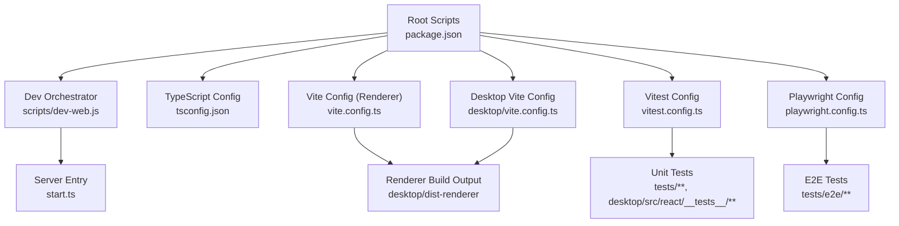
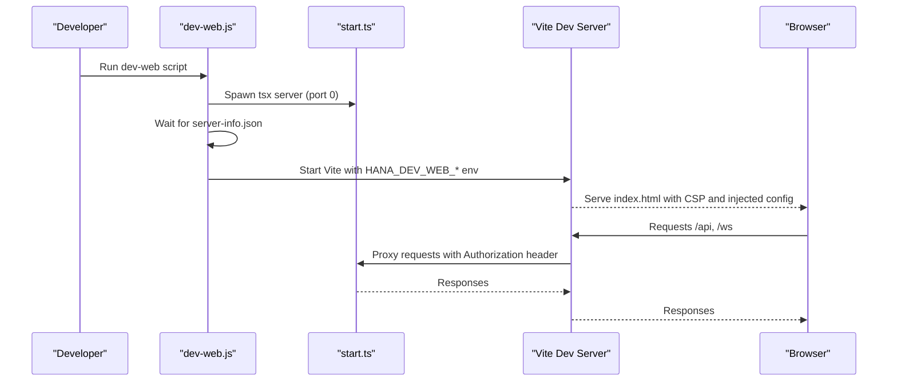
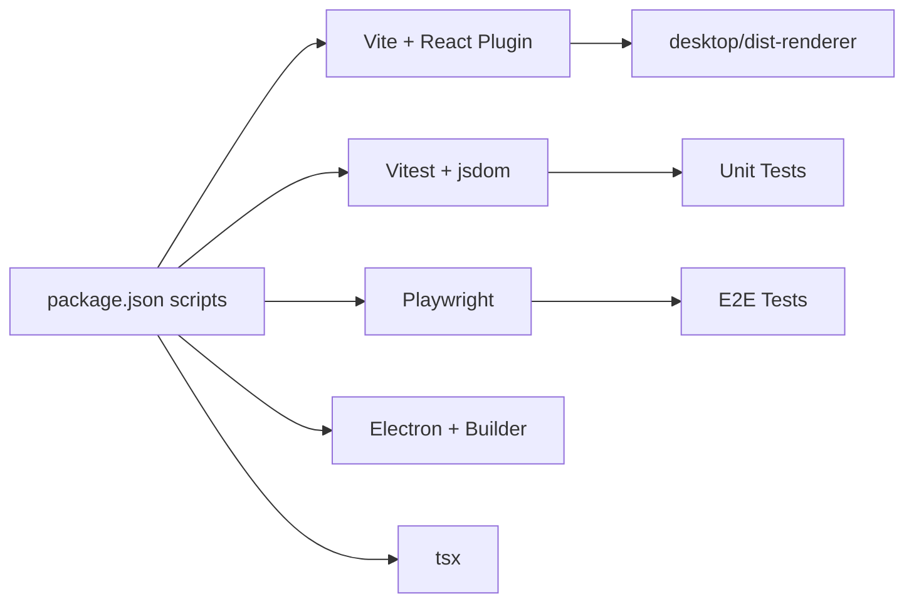

# Development Guide

<cite>
**Referenced Files in This Document**
- [package.json](file://package.json)
- [tsconfig.json](file://tsconfig.json)
- [vite.config.ts](file://vite.config.ts)
- [desktop/vite.config.ts](file://desktop/vite.config.ts)
- [vitest.config.ts](file://vitest.config.ts)
- [vitest.setup.ts](file://vitest.setup.ts)
- [playwright.config.ts](file://playwright.config.ts)
- [scripts/dev-web.js](file://scripts/dev-web.js)
- [scripts/dev-env.js](file://scripts/dev-env.js)
- [start.ts](file://start.ts)
- [tests/core/config.test.ts](file://tests/core/config.test.ts)
- [tests/e2e/chat.web.spec.ts](file://tests/e2e/chat.web.spec.ts)
</cite>

## Table of Contents
1. Introduction
2. Project Structure
3. Core Components
4. Architecture Overview
5. Detailed Component Analysis
6. Dependency Analysis
7. Performance Considerations
8. Troubleshooting Guide
9. Conclusion
10. Appendices

## Introduction
This guide explains how to set up the development environment, build and run the project, write and run tests, follow coding conventions, and extend features. It focuses on:
- Vite-based frontend build and dev server
- TypeScript configuration and module resolution
- Unit testing with Vitest and E2E testing with Playwright
- Practical commands for development, production builds, and debugging
- Code organization patterns, naming conventions, and contribution guidelines
- Performance profiling, memory leak detection, and optimization techniques
- Extending features and adding new providers

## Project Structure
High-level structure relevant to development:
- Root package scripts orchestrate dev, build, test, and packaging flows
- Desktop renderer is built by Vite (root vite.config.ts and desktop/vite.config.ts)
- Server entrypoint is start.ts which boots the Node server
- Tests are split into unit/functional (Vitest) and E2E (Playwright)
- Shared modules and plugin packages are aliased for both dev and test

**Diagram sources**
- [package.json](file://package.json)
- [scripts/dev-web.js](file://scripts/dev-web.js)
- [tsconfig.json](file://tsconfig.json)
- [vite.config.ts](file://vite.config.ts)
- [desktop/vite.config.ts](file://desktop/vite.config.ts)
- [vitest.config.ts](file://vitest.config.ts)
- [playwright.config.ts](file://playwright.config.ts)
- [start.ts](file://start.ts)

**Section sources**
- [package.json](file://package.json)
- [tsconfig.json](file://tsconfig.json)
- [vite.config.ts](file://vite.config.ts)
- [desktop/vite.config.ts](file://desktop/vite.config.ts)
- [vitest.config.ts](file://vitest.config.ts)
- [playwright.config.ts](file://playwright.config.ts)
- [scripts/dev-web.js](file://scripts/dev-web.js)
- [start.ts](file://start.ts)

## Core Components
- Build system: Vite for renderer, multiple configs for different targets; custom plugins handle CSP injection, legacy CSS preservation, dev web proxying, and asset copying.
- TypeScript: ES2022 target, ESM modules, bundler moduleResolution, React JSX runtime, strict mode, path aliases for @/* and plugin packages.
- Testing: Vitest for unit tests with jsdom for React components; Playwright for Web E2E with a local static server and API server managed via webServer.
- Dev workflow: scripts/dev-web.js orchestrates starting the server and Vite dev server with secure proxying using loopback tokens.

Key responsibilities:
- vite.config.ts: Renderer root, plugins, aliasing, CSS modules scoping, dev server proxy, test root.
- desktop/vite.config.ts: Additional shared resolver, dev web config injection, legacy assets copy, multi-entry build.
- vitest.config.ts: Aliases, extensions, React plugin, shared module resolution, jsdom for React tests.
- playwright.config.ts: Projects for web and electron, webServer to launch API and Vite, artifacts retention.

**Section sources**
- [vite.config.ts](file://vite.config.ts)
- [desktop/vite.config.ts](file://desktop/vite.config.ts)
- [vitest.config.ts](file://vitest.config.ts)
- [playwright.config.ts](file://playwright.config.ts)

## Architecture Overview
The development architecture connects three main parts:
- Server process (Node + tsx) started by start.ts
- Vite dev server serving the renderer with CSP and proxy rules
- Test runners (Vitest and Playwright) that use the same configurations and helpers

**Diagram sources**
- [scripts/dev-web.js](file://scripts/dev-web.js)
- [start.ts](file://start.ts)
- [vite.config.ts](file://vite.config.ts)

## Detailed Component Analysis

### Development Environment Setup
- Install dependencies and apply postinstall patches.
- Use scripts/dev-web.js to start both server and Vite dev server with secure proxying.
- For pure web dev without Electron, use npm run dev:web or run Vite directly with desktop/vite.config.ts.

Practical commands:
- Start full dev flow (server + Vite): npm run dev:web
- Start only Vite dev server (renderer): npm run desktop:vite
- Type check: npm run typecheck

Environment variables:
- SHADOW_HOME defaults to ~/.openshadow-dev during development.
- HANA_DEV_WEB enables dev web client mode and requires additional variables for proxying.

**Section sources**
- [package.json](file://package.json)
- [scripts/dev-env.js](file://scripts/dev-env.js)
- [scripts/dev-web.js](file://scripts/dev-web.js)
- [desktop/vite.config.ts](file://desktop/vite.config.ts)

### Build System Using Vite
- Root vite.config.ts defines renderer root, plugins, aliases, CSS modules scoping, dev server port/proxy, and test root.
- Custom plugins:
  - CSP injection per HTML file with dev-mode relaxations
  - Preserve legacy CSS links across build
  - Fix CSS MIME type during serve
  - Inject dev web client config into index.html
  - Copy legacy files to dist-renderer after build
- desktop/vite.config.ts adds shared module resolution, dev web config injection, and copies legacy assets.

Build outputs:
- Renderer output directory: desktop/dist-renderer
- Multiple HTML entries supported in desktop config

**Section sources**
- [vite.config.ts](file://vite.config.ts)
- [desktop/vite.config.ts](file://desktop/vite.config.ts)

### TypeScript Configuration
- Target ES2022, module ESNext, bundler moduleResolution, strict mode enabled.
- JSX react-jsx runtime for modern React.
- Path aliases:
  - @/* maps to desktop/src/react
  - Plugin packages aliased in Vite and Vitest configs
- Include/exclude scopes cover desktop renderer and plugin packages.

**Section sources**
- [tsconfig.json](file://tsconfig.json)
- [vite.config.ts](file://vite.config.ts)
- [vitest.config.ts](file://vitest.config.ts)

### Testing Strategies

#### Unit Tests with Vitest
- Configuration:
  - Environment node by default; jsdom for React component tests under desktop/src/react/__tests__
  - Setup file provides DOM polyfills for ProseMirror/TiPTap
  - Aliases include electron mock and plugin protocol/runtime
  - Extensions support .cjs resolution and shared module discovery
- Example test:
  - tests/core/config.test.ts validates configuration manager behavior

Run commands:
- Run all unit tests: npm run test:unit
- Watch mode: npm run test

**Section sources**
- [vitest.config.ts](file://vitest.config.ts)
- [vitest.setup.ts](file://vitest.setup.ts)
- [tests/core/config.test.ts](file://tests/core/config.test.ts)

#### E2E Tests with Playwright
- Configuration:
  - Projects: web (static site) and electron (Electron app)
  - webServer launches API server and Vite dev server automatically
  - Artifacts: traces, screenshots, videos retained on failure
  - Base URL points to static server; tests match *.web.spec.ts
- Example test:
  - tests/e2e/chat.web.spec.ts demonstrates chat flow with mocked streaming responses

Run commands:
- Run all E2E tests: npm run test:e2e
- Run specific suite: npm run test:e2e:chat

**Section sources**
- [playwright.config.ts](file://playwright.config.ts)
- [tests/e2e/chat.web.spec.ts](file://tests/e2e/chat.web.spec.ts)

### Coding Conventions and Organization Patterns
- Module resolution:
  - Use @/* for React components and UI under desktop/src/react
  - Use @hana/plugin-* aliases for plugin packages
  - Shared modules can be resolved via @shared/* through custom resolvers in Vite/Vitest
- Naming:
  - File names use kebab-case for styles and camelCase for modules
  - Test files end with .test.ts or .spec.ts
- React:
  - JSX automatic runtime configured
  - CSS Modules scoped with hana-* prefix preserved globally for animations
- Security:
  - CSP profiles defined centrally and injected per HTML file
  - Dev mode relaxations allow React Refresh and HMR

**Section sources**
- [tsconfig.json](file://tsconfig.json)
- [vite.config.ts](file://vite.config.ts)
- [desktop/vite.config.ts](file://desktop/vite.config.ts)

### Contribution Guidelines
- Before submitting changes:
  - Ensure type checks pass: npm run typecheck
  - Run unit tests: npm run test:unit
  - Run E2E tests: npm run test:e2e
- Keep CSP and dev proxy settings aligned when modifying HTML or dev flows.
- When adding new shared modules, ensure they are discoverable by @shared/* resolver in both Vite and Vitest.

[No sources needed since this section summarizes general practices]

### Extending Features and Adding New Providers
- Provider extension points:
  - Core provider registry and adapter patterns exist under core/providers and related compatibility modules
  - Add new provider implementations following existing contracts and register them via the provider registry
- Plugin ecosystem:
  - Use @hana/plugin-* packages for plugin interfaces and runtime
  - Place plugin code under plugins/ or provider-plugins/ and reference via manifest and index files
- Tool and route expansion:
  - Register tools and routes according to existing patterns in core and server directories

[No sources needed since this section provides general guidance]

## Dependency Analysis
Development-time dependencies and their roles:
- Vite and React plugin for building and serving the renderer
- Vitest for unit testing with jsdom for React components
- Playwright for E2E testing with webServer orchestration
- Electron and builder for packaging and distribution
- tsx for running TypeScript server entrypoints

**Diagram sources**
- [package.json](file://package.json)
- [vite.config.ts](file://vite.config.ts)
- [vitest.config.ts](file://vitest.config.ts)
- [playwright.config.ts](file://playwright.config.ts)

**Section sources**
- [package.json](file://package.json)

## Performance Considerations
- Profiling:
  - Use browser DevTools Performance panel to profile renderer interactions
  - Leverage Playwright tracing for E2E performance analysis
- Memory leaks:
  - Monitor heap snapshots in DevTools during long-running sessions
  - Inspect event listeners and timers in React components and hooks
- Optimization techniques:
  - Prefer lazy loading for heavy components and routes
  - Minimize re-renders by memoizing expensive computations and selectors
  - Avoid unnecessary state updates and batch operations where possible
  - Use CSS Modules carefully; keep global animation prefixes intact

[No sources needed since this section provides general guidance]

## Troubleshooting Guide
Common issues and resolutions:
- CSP errors in dev:
  - Ensure CSP profiles in vite.config.ts are updated and consistent with HTML fallbacks
  - In dev mode, unsafe-inline and ws connections are relaxed for React Refresh and HMR
- Legacy CSS not loading:
  - Verify preserveLegacyCss and restoreLegacyCss plugins are active
  - Confirm CSS MIME type fix middleware runs during serve
- Dev web proxy not working:
  - Check HANA_DEV_WEB_* environment variables are set correctly
  - Ensure Authorization headers are forwarded for HTTP and WebSocket proxies
- Shared module resolution failures:
  - Confirm @shared/* paths exist in expected directories and extensions are included
  - Validate custom resolver logic in Vite and Vitest configs

**Section sources**
- [vite.config.ts](file://vite.config.ts)
- [desktop/vite.config.ts](file://desktop/vite.config.ts)
- [vitest.config.ts](file://vitest.config.ts)

## Conclusion
This guide outlined the development setup, build system, TypeScript configuration, testing strategies, coding conventions, and extension points. By following these practices and leveraging the provided scripts and configurations, contributors can efficiently develop, test, and extend OpenShadow while maintaining security and performance standards.

[No sources needed since this section summarizes without analyzing specific files]

## Appendices

### Practical Commands Reference
- Development:
  - npm run dev:web
  - npm run desktop:vite
  - npm run typecheck
- Testing:
  - npm run test:unit
  - npm run test:e2e
  - npm run test:functional
- Building:
  - npm run build
  - npm run desktop:build
- Packaging:
  - npm run pack
  - npm run dist:win | npm run dist:linux | npm run dist:mac

**Section sources**
- [package.json](file://package.json)