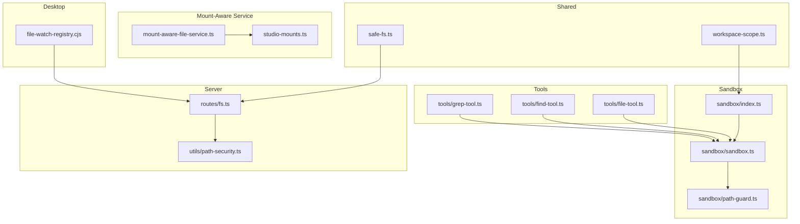
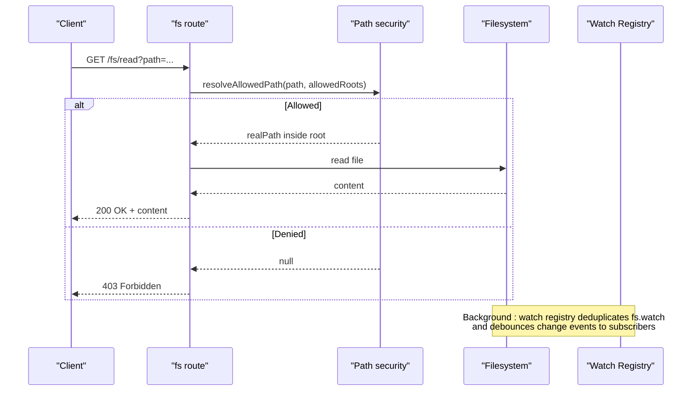
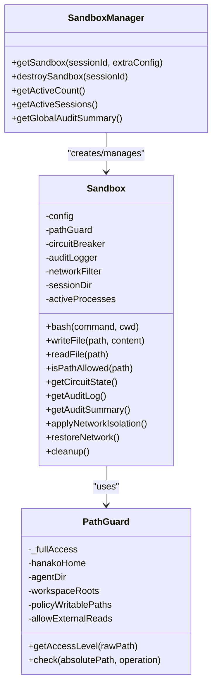
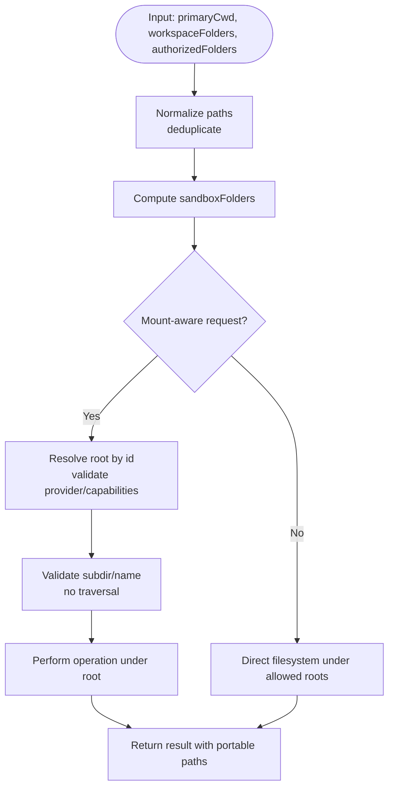
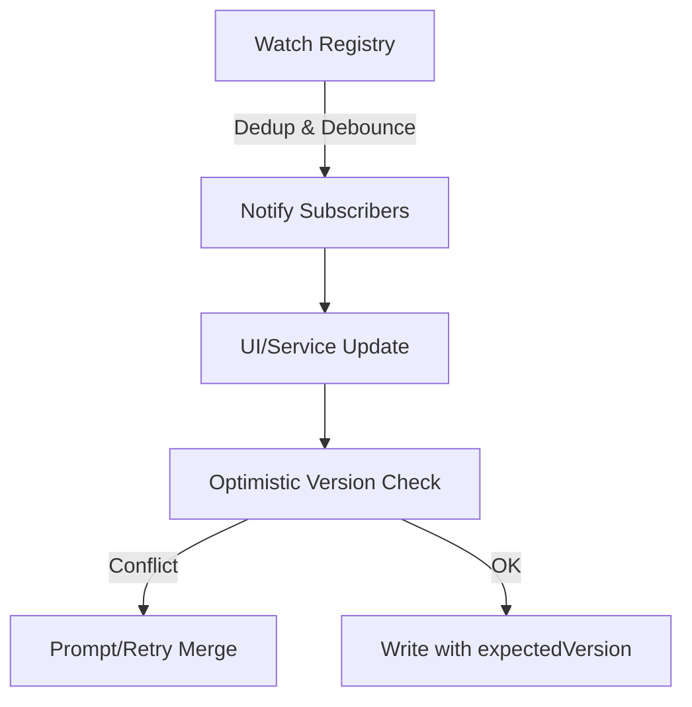
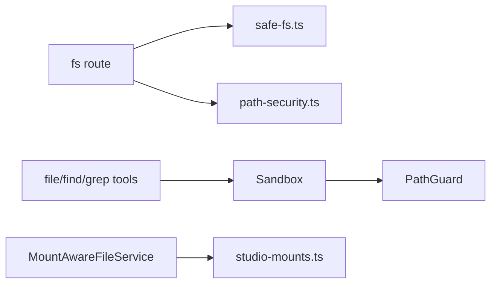

# File System Operations

<cite>
**Referenced Files in This Document**
- [core/shared/safe-fs.ts](file://core/shared/safe-fs.ts)
- [shared/safe-fs.ts](file://shared/safe-fs.ts)
- [core/shared/workspace-scope.ts](file://core/shared/workspace-scope.ts)
- [shared/workspace-scope.ts](file://shared/workspace-scope.ts)
- [core/sandbox/index.ts](file://core/sandbox/index.ts)
- [core/sandbox/sandbox.ts](file://core/sandbox/sandbox.ts)
- [core/sandbox/path-guard.ts](file://core/sandbox/path-guard.ts)
- [server/routes/fs.ts](file://server/routes/fs.ts)
- [server/utils/path-security.ts](file://server/utils/path-security.ts)
- [core/mount-aware-file-service.ts](file://core/mount-aware-file-service.ts)
- [core/studio-mounts.ts](file://core/studio-mounts.ts)
- [core/tools/file-tool.ts](file://core/tools/file-tool.ts)
- [core/tools/find-tool.ts](file://core/tools/find-tool.ts)
- [core/tools/grep-tool.ts](file://core/tools/grep-tool.ts)
- [desktop/file-watch-registry.cjs](file://desktop/file-watch-registry.cjs)
</cite>

## Table of Contents
1. [Introduction](#introduction)
2. [Project Structure](#project-structure)
3. [Core Components](#core-components)
4. [Architecture Overview](#architecture-overview)
5. [Detailed Component Analysis](#detailed-component-analysis)
6. [Dependency Analysis](#dependency-analysis)
7. [Performance Considerations](#performance-considerations)
8. [Troubleshooting Guide](#troubleshooting-guide)
9. [Conclusion](#conclusion)
10. [Appendices](#appendices)

## Introduction
This document explains secure file access and workspace management across the system. It covers sandboxed execution, path scoping, workspace mounting, supported file operations (read, write, search, batch), monitoring and change detection, synchronization strategies, cross-platform considerations, permission management, and performance optimization for large workspaces.

## Project Structure
The file system capabilities are implemented across several layers:
- Shared utilities for safe I/O and workspace scoping
- Sandbox subsystem enforcing process isolation and path guards
- Server routes exposing secure HTTP endpoints for reading files and browsing directories
- Mount-aware service providing a unified API over local and remote roots with capability checks
- Tools for file metadata, copy, find, and grep operations
- Desktop file watching registry for efficient event sharing

**Diagram sources**
- [core/shared/safe-fs.ts:1-55](file://core/shared/safe-fs.ts#L1-L55)
- [shared/safe-fs.ts:1-128](file://shared/safe-fs.ts#L1-L128)
- [core/shared/workspace-scope.ts:1-57](file://core/shared/workspace-scope.ts#L1-L57)
- [shared/workspace-scope.ts:1-96](file://shared/workspace-scope.ts#L1-L96)
- [core/sandbox/index.ts:1-102](file://core/sandbox/index.ts#L1-L102)
- [core/sandbox/sandbox.ts:1-336](file://core/sandbox/sandbox.ts#L1-L336)
- [core/sandbox/path-guard.ts:1-201](file://core/sandbox/path-guard.ts#L1-L201)
- [server/routes/fs.ts:1-166](file://server/routes/fs.ts#L1-L166)
- [server/utils/path-security.ts:1-40](file://server/utils/path-security.ts#L1-L40)
- [core/mount-aware-file-service.ts:1-498](file://core/mount-aware-file-service.ts#L1-L498)
- [core/studio-mounts.ts:1-195](file://core/studio-mounts.ts#L1-L195)
- [core/tools/file-tool.ts:1-90](file://core/tools/file-tool.ts#L1-L90)
- [core/tools/find-tool.ts:1-113](file://core/tools/find-tool.ts#L1-L113)
- [core/tools/grep-tool.ts:1-194](file://core/tools/grep-tool.ts#L1-L194)
- [desktop/file-watch-registry.cjs:1-125](file://desktop/file-watch-registry.cjs#L1-L125)

**Section sources**
- [core/shared/safe-fs.ts:1-55](file://core/shared/safe-fs.ts#L1-L55)
- [shared/safe-fs.ts:1-128](file://shared/safe-fs.ts#L1-L128)
- [core/shared/workspace-scope.ts:1-57](file://core/shared/workspace-scope.ts#L1-L57)
- [shared/workspace-scope.ts:1-96](file://shared/workspace-scope.ts#L1-L96)
- [core/sandbox/index.ts:1-102](file://core/sandbox/index.ts#L1-L102)
- [core/sandbox/sandbox.ts:1-336](file://core/sandbox/sandbox.ts#L1-L336)
- [core/sandbox/path-guard.ts:1-201](file://core/sandbox/path-guard.ts#L1-L201)
- [server/routes/fs.ts:1-166](file://server/routes/fs.ts#L1-L166)
- [server/utils/path-security.ts:1-40](file://server/utils/path-security.ts#L1-L40)
- [core/mount-aware-file-service.ts:1-498](file://core/mount-aware-file-service.ts#L1-L498)
- [core/studio-mounts.ts:1-195](file://core/studio-mounts.ts#L1-L195)
- [core/tools/file-tool.ts:1-90](file://core/tools/file-tool.ts#L1-L90)
- [core/tools/find-tool.ts:1-113](file://core/tools/find-tool.ts#L1-L113)
- [core/tools/grep-tool.ts:1-194](file://core/tools/grep-tool.ts#L1-L194)
- [desktop/file-watch-registry.cjs:1-125](file://desktop/file-watch-registry.cjs#L1-L125)

## Core Components
- Safe I/O utilities: atomic writes, safe reads, JSON/YAML parsing helpers, and robust directory copy with rollback.
- Workspace scoping: normalization of primary working directory and additional folders; computation of sandbox folder sets.
- Sandbox manager and runtime: per-session isolated environments with command allowlists, pattern blocking, circuit breaker, audit logging, and optional network filtering.
- Path guard: policy-driven access levels (blocked, read-only, read-write, full) with symlink-safe resolution.
- Server file routes: secure HTTP endpoints for text/base64/HTML content retrieval and directory tree listing with strict path validation.
- Mount-aware file service: unified API over multiple roots (local storage or studio links) with capability enforcement, versioned writes, safe delete to trash, and portable relative paths.
- Studio mounts registry: schema-validated persistence for mount definitions, including providers, capabilities, and lifecycle timestamps.
- File tools: stat/copy, recursive file name search, and content search with limits and skip patterns.
- Desktop watch registry: deduplicated fs.watch subscriptions with debounce and subscriber unbinding.

**Section sources**
- [shared/safe-fs.ts:1-128](file://shared/safe-fs.ts#L1-L128)
- [core/shared/workspace-scope.ts:1-57](file://core/shared/workspace-scope.ts#L1-L57)
- [core/sandbox/index.ts:1-102](file://core/sandbox/index.ts#L1-L102)
- [core/sandbox/sandbox.ts:1-336](file://core/sandbox/sandbox.ts#L1-L336)
- [core/sandbox/path-guard.ts:1-201](file://core/sandbox/path-guard.ts#L1-L201)
- [server/routes/fs.ts:1-166](file://server/routes/fs.ts#L1-L166)
- [core/mount-aware-file-service.ts:1-498](file://core/mount-aware-file-service.ts#L1-L498)
- [core/studio-mounts.ts:1-195](file://core/studio-mounts.ts#L1-L195)
- [core/tools/file-tool.ts:1-90](file://core/tools/file-tool.ts#L1-L90)
- [core/tools/find-tool.ts:1-113](file://core/tools/find-tool.ts#L1-L113)
- [core/tools/grep-tool.ts:1-194](file://core/tools/grep-tool.ts#L1-L194)
- [desktop/file-watch-registry.cjs:1-125](file://desktop/file-watch-registry.cjs#L1-L125)

## Architecture Overview
The architecture enforces least-privilege access at every layer:
- All external requests pass through server routes that validate and resolve allowed roots.
- The sandbox layer restricts working directories and commands, auditing all actions.
- The mount-aware service abstracts multiple roots behind capability gates and returns portable paths.
- Desktop watchers share underlying OS watches efficiently and debounce events.

**Diagram sources**
- [server/routes/fs.ts:1-166](file://server/routes/fs.ts#L1-L166)
- [server/utils/path-security.ts:1-40](file://server/utils/path-security.ts#L1-L40)
- [desktop/file-watch-registry.cjs:1-125](file://desktop/file-watch-registry.cjs#L1-L125)

## Detailed Component Analysis

### Sandboxed Execution and Path Guards
The sandbox provides an isolated environment per session with:
- Working directory restriction via PathGuard
- Command allowlist and dangerous pattern blocking
- Circuit breaker and concurrency limits
- Audit logging and optional network isolation
- Atomic file read/write within allowed scope

**Diagram sources**
- [core/sandbox/index.ts:1-102](file://core/sandbox/index.ts#L1-L102)
- [core/sandbox/sandbox.ts:1-336](file://core/sandbox/sandbox.ts#L1-L336)
- [core/sandbox/path-guard.ts:1-201](file://core/sandbox/path-guard.ts#L1-L201)

**Section sources**
- [core/sandbox/index.ts:1-102](file://core/sandbox/index.ts#L1-L102)
- [core/sandbox/sandbox.ts:1-336](file://core/sandbox/sandbox.ts#L1-L336)
- [core/sandbox/path-guard.ts:1-201](file://core/sandbox/path-guard.ts#L1-L201)

### Workspace Scoping and Mounting
Workspace scoping normalizes primary working directory and additional folders into a deterministic set used by sandboxes and policies. The mount-aware service exposes a consistent API over multiple roots, enforcing capabilities and returning portable relative paths. Studio mounts are persisted with schema validation and lifecycle metadata.

**Diagram sources**
- [shared/workspace-scope.ts:1-96](file://shared/workspace-scope.ts#L1-L96)
- [core/shared/workspace-scope.ts:1-57](file://core/shared/workspace-scope.ts#L1-L57)
- [core/mount-aware-file-service.ts:1-498](file://core/mount-aware-file-service.ts#L1-L498)
- [core/studio-mounts.ts:1-195](file://core/studio-mounts.ts#L1-L195)

**Section sources**
- [shared/workspace-scope.ts:1-96](file://shared/workspace-scope.ts#L1-L96)
- [core/shared/workspace-scope.ts:1-57](file://core/shared/workspace-scope.ts#L1-L57)
- [core/mount-aware-file-service.ts:1-498](file://core/mount-aware-file-service.ts#L1-L498)
- [core/studio-mounts.ts:1-195](file://core/studio-mounts.ts#L1-L195)

### Secure HTTP File Access
The server exposes read-only endpoints with strict path validation:
- Rejects symlinks and resolves real paths
- Ensures resolved paths remain within allowed roots
- Provides text, base64, and HTML conversion for specific formats
- Returns directory trees with depth limits

```mermaid
sequenceDiagram
participant C as "Client"
participant R as "fs route"
participant P as "resolveAllowedPath"
participant S as "safeReadFile"
C->>R : GET /fs/read?path=...
R->>P : resolveAllowedPath(path, allowedRoots)
alt Inside allowed roots
P-->>R : realPath
R->>S : safeReadFile(realPath)
S-->>R : content or null
R-->>C : 200 OK or 404 Not Found
else Outside or symlink
P-->>R : null
R-->>C : 403 Forbidden
end
```

**Diagram sources**
- [server/routes/fs.ts:1-166](file://server/routes/fs.ts#L1-L166)
- [shared/safe-fs.ts:1-128](file://shared/safe-fs.ts#L1-L128)

**Section sources**
- [server/routes/fs.ts:1-166](file://server/routes/fs.ts#L1-L166)
- [shared/safe-fs.ts:1-128](file://shared/safe-fs.ts#L1-L128)

### Supported File Operations
- Read: text and base64 via HTTP; direct read via sandbox; safe read helpers.
- Write: atomic writes via shared utilities; sandbox writeFile; mount-aware writeText with version conflict handling.
- Search: filename search (find) and content search (grep) with limits, skip patterns, and glob support.
- Batch processing: movePaths and safeDelete in mount-aware service; directory copy with rollback in safe-fs.

Practical examples:
- Tool usage: invoke file tool for stat/copy, find tool for pattern matching, grep tool for content search.
- Direct API calls: use HTTP endpoints for reading files and listing directories.
- Programmatic: call mount-aware service methods for listFiles, searchFiles, mkdir, writeText, rename, move, movePaths, safeDelete.

**Section sources**
- [core/tools/file-tool.ts:1-90](file://core/tools/file-tool.ts#L1-L90)
- [core/tools/find-tool.ts:1-113](file://core/tools/find-tool.ts#L1-L113)
- [core/tools/grep-tool.ts:1-194](file://core/tools/grep-tool.ts#L1-L194)
- [core/mount-aware-file-service.ts:1-498](file://core/mount-aware-file-service.ts#L1-L498)
- [shared/safe-fs.ts:1-128](file://shared/safe-fs.ts#L1-L128)
- [server/routes/fs.ts:1-166](file://server/routes/fs.ts#L1-L166)

### File Monitoring, Change Detection, and Synchronization
- Desktop watch registry deduplicates OS-level watches, supports multiple subscribers, and debounces events to reduce churn.
- Mount-aware service can integrate checkpoints on edits and returns version info for optimistic concurrency control.
- Recommended synchronization strategy:
  - Use versioned writes (expectedVersion) to detect conflicts.
  - On change events, refresh only affected subtrees using listFiles.
  - For large workspaces, prefer targeted updates and pagination-like depth limits.

**Diagram sources**
- [desktop/file-watch-registry.cjs:1-125](file://desktop/file-watch-registry.cjs#L1-L125)
- [core/mount-aware-file-service.ts:1-498](file://core/mount-aware-file-service.ts#L1-L498)

**Section sources**
- [desktop/file-watch-registry.cjs:1-125](file://desktop/file-watch-registry.cjs#L1-L125)
- [core/mount-aware-file-service.ts:1-498](file://core/mount-aware-file-service.ts#L1-L498)

### Cross-Platform Compatibility
- Path resolution uses platform-native separators and realpath to handle symlinks consistently.
- Directory copy handles Windows NTFS permission quirks during recursive copy.
- Watch registry normalizes file keys to avoid duplicate watchers across platforms.

**Section sources**
- [shared/safe-fs.ts:1-128](file://shared/safe-fs.ts#L1-L128)
- [desktop/file-watch-registry.cjs:1-125](file://desktop/file-watch-registry.cjs#L1-L125)
- [server/routes/fs.ts:1-166](file://server/routes/fs.ts#L1-L166)

### Permission Management and Security
- Path guard defines explicit blocked/read-only/read-write/full zones based on policy constants and workspace roots.
- Server routes enforce allowed roots and reject symlinks.
- Sensitive dot directories are flagged to prevent accidental exposure.

**Section sources**
- [core/sandbox/path-guard.ts:1-201](file://core/sandbox/path-guard.ts#L1-L201)
- [server/routes/fs.ts:1-166](file://server/routes/fs.ts#L1-L166)
- [server/utils/path-security.ts:1-40](file://server/utils/path-security.ts#L1-L40)

## Dependency Analysis
Key dependencies and relationships:
- Server routes depend on safe-read helpers and path security utilities.
- Sandbox depends on PathGuard and integrates audit logging and circuit breaking.
- Mount-aware service depends on studio mounts registry for root discovery and capability enforcement.
- Tools operate within sandbox constraints when invoked from agent workflows.

**Diagram sources**
- [server/routes/fs.ts:1-166](file://server/routes/fs.ts#L1-L166)
- [shared/safe-fs.ts:1-128](file://shared/safe-fs.ts#L1-L128)
- [server/utils/path-security.ts:1-40](file://server/utils/path-security.ts#L1-L40)
- [core/sandbox/sandbox.ts:1-336](file://core/sandbox/sandbox.ts#L1-L336)
- [core/sandbox/path-guard.ts:1-201](file://core/sandbox/path-guard.ts#L1-L201)
- [core/mount-aware-file-service.ts:1-498](file://core/mount-aware-file-service.ts#L1-L498)
- [core/studio-mounts.ts:1-195](file://core/studio-mounts.ts#L1-L195)
- [core/tools/file-tool.ts:1-90](file://core/tools/file-tool.ts#L1-L90)
- [core/tools/find-tool.ts:1-113](file://core/tools/find-tool.ts#L1-L113)
- [core/tools/grep-tool.ts:1-194](file://core/tools/grep-tool.ts#L1-L194)

**Section sources**
- [server/routes/fs.ts:1-166](file://server/routes/fs.ts#L1-L166)
- [shared/safe-fs.ts:1-128](file://shared/safe-fs.ts#L1-L128)
- [server/utils/path-security.ts:1-40](file://server/utils/path-security.ts#L1-L40)
- [core/sandbox/sandbox.ts:1-336](file://core/sandbox/sandbox.ts#L1-L336)
- [core/sandbox/path-guard.ts:1-201](file://core/sandbox/path-guard.ts#L1-L201)
- [core/mount-aware-file-service.ts:1-498](file://core/mount-aware-file-service.ts#L1-L498)
- [core/studio-mounts.ts:1-195](file://core/studio-mounts.ts#L1-L195)
- [core/tools/file-tool.ts:1-90](file://core/tools/file-tool.ts#L1-L90)
- [core/tools/find-tool.ts:1-113](file://core/tools/find-tool.ts#L1-L113)
- [core/tools/grep-tool.ts:1-194](file://core/tools/grep-tool.ts#L1-L194)

## Performance Considerations
- Limit search depth and result counts in find/grep to avoid scanning massive trees.
- Use depth-limited directory tree APIs to reduce payload size.
- Deduplicate file watchers and debounce events to minimize UI thrash.
- Prefer atomic writes and versioned writes to avoid expensive rollbacks.
- Skip known noisy directories (e.g., node_modules, dist) during scans.

[No sources needed since this section provides general guidance]

## Troubleshooting Guide
Common issues and resolutions:
- Path not allowed: ensure requested path is within allowed roots and not a symlink.
- Permission denied: verify access level for target path and operation type.
- Conflict on write: supply correct expectedVersion or implement merge logic.
- Watch events missing: confirm watcher entry exists and subscriber IDs are valid; check debounce timing.

**Section sources**
- [server/routes/fs.ts:1-166](file://server/routes/fs.ts#L1-L166)
- [core/sandbox/path-guard.ts:1-201](file://core/sandbox/path-guard.ts#L1-L201)
- [core/mount-aware-file-service.ts:1-498](file://core/mount-aware-file-service.ts#L1-L498)
- [desktop/file-watch-registry.cjs:1-125](file://desktop/file-watch-registry.cjs#L1-L125)

## Conclusion
The system implements layered security and scoping for file operations:
- Strict path validation and symlink protection at the server boundary
- Policy-driven access levels and sandbox confinement for agent workflows
- Unified mount-aware API with capability enforcement and portable paths
- Efficient monitoring and change propagation with deduplicated watchers
Adhering to these patterns ensures secure, predictable, and performant file interactions across platforms.

[No sources needed since this section summarizes without analyzing specific files]

## Appendices

### Practical Examples

- Using tools:
  - Stat/copy: invoke the file tool with action stat or copy.
  - Find: run the find tool with a pattern and optional path/limit.
  - Grep: run the grep tool with a pattern, optional glob, ignoreCase, literal, context, and limit.

- Direct API calls:
  - Read text: GET /fs/read?path=<allowed-path>
  - Read binary: GET /fs/read-base64?path=<allowed-path>
  - List directory: GET /fs/tree?path=<allowed-dir>&depth=<1..10>

- Programmatic usage:
  - Mount-aware service: listFiles(rootId, subdir), searchFiles(rootId, query), writeText(rootId, subdir, {name, content, expectedVersion}), movePaths(rootId, {items, destSubdir, currentSubdir}), safeDelete(rootId, subdir, {name}).

**Section sources**
- [core/tools/file-tool.ts:1-90](file://core/tools/file-tool.ts#L1-L90)
- [core/tools/find-tool.ts:1-113](file://core/tools/find-tool.ts#L1-L113)
- [core/tools/grep-tool.ts:1-194](file://core/tools/grep-tool.ts#L1-L194)
- [server/routes/fs.ts:1-166](file://server/routes/fs.ts#L1-L166)
- [core/mount-aware-file-service.ts:1-498](file://core/mount-aware-file-service.ts#L1-L498)