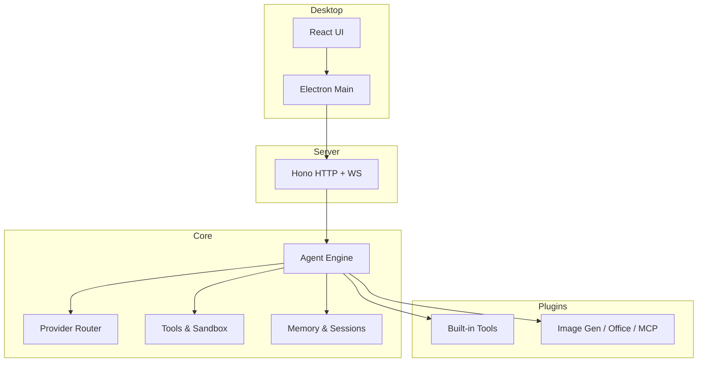
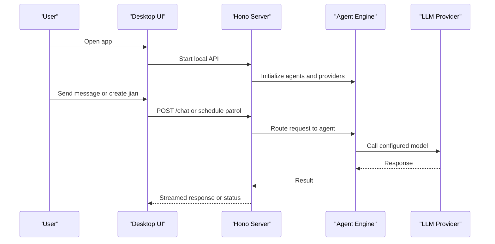
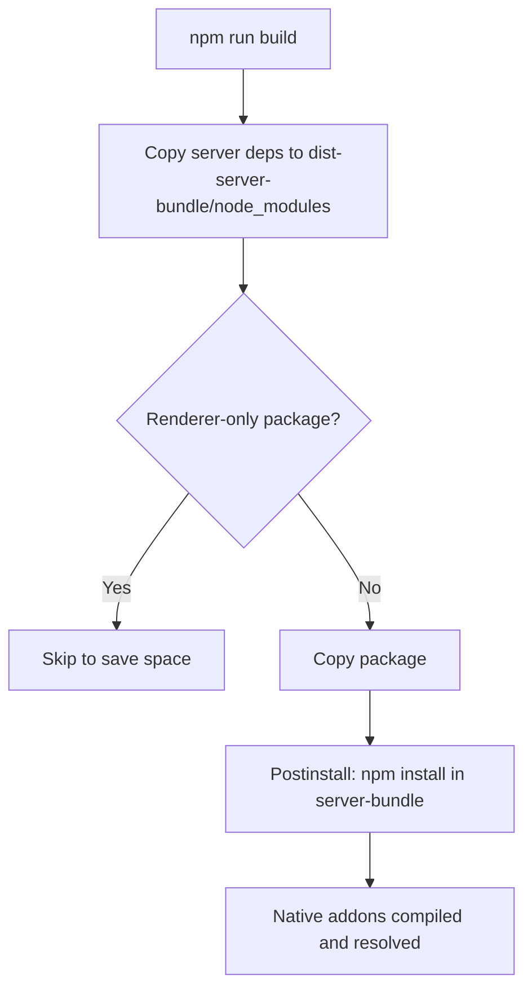

# Getting Started

<cite>
**Referenced Files in This Document**
- [README.md](file://README.md)
- [package.json](file://package.json)
- [config.example.yaml](file://config.example.yaml)
- [config.yaml](file://config.yaml)
- [start.ts](file://start.ts)
- [core/first-run.ts](file://core/first-run.ts)
- [lib/desk/heartbeat.ts](file://lib/desk/heartbeat.ts)
- [shared/default-workspace.ts](file://shared/default-workspace.ts)
- [provider-catalog.json](file://provider-catalog.json)
- [auth.json](file://auth.json)
- [scripts/copy-server-deps.js](file://scripts/copy-server-deps.js)
- [scripts/fix-modules.cjs](file://scripts/fix-modules.cjs)
</cite>

## Table of Contents
1. Introduction
2. Project Structure
3. Core Components
4. Architecture Overview
5. Detailed Component Analysis
6. Dependency Analysis
7. Performance Considerations
8. Troubleshooting Guide
9. Conclusion

## Introduction
OpenShadow is a desktop AI agent that works autonomously in your workspace. It watches your files, executes tasks in the background, and chats with you when needed. You can write a simple note (jian), and it will act on it without opening a chat. OpenShadow supports multiple LLM providers out of the box, including Chinese providers such as MiniMax, DeepSeek, Qwen (DashScope), and GLM (Zhipu).

Key capabilities:
- Autonomous patrol and task execution
- Conversational AI with file, terminal, search, and automation tools
- Multi-provider support with easy switching per session
- Multi-agent with independent memories and schedules
- Desktop app for Windows, macOS, and Linux

## Project Structure
High-level layout:
- desktop: Electron + React UI and main process
- core: Agent engine, sessions, provider routing, tools, memory, sandbox
- server: Hono HTTP + WebSocket API
- hub: Background scheduler, cron, heartbeat, channels
- plugins: Built-in tooling and integrations
- lib: Shared utilities and SDK compatibility
- shared: Cross-layer helpers (config, errors, workspace output)
- tests: E2E Playwright suite

[No sources needed since this diagram shows conceptual workflow, not actual code structure]

## Core Components
- First-run setup: On first launch, OpenShadow seeds default directories, creates a default agent, and ensures required files exist.
- Provider catalog: Centralized configuration for LLM providers and models; supports migration from legacy formats.
- Heartbeat and jian: Periodic patrol scans the workspace and processes jian notes to execute tasks autonomously.
- Default workspace: A convenient default folder under your Desktop for quick start.

Practical outcomes:
- After install, run once to create ~/.hanako-style data directory and default agent.
- Configure at least one provider (e.g., MiniMax or DeepSeek) before chatting.
- Create a jian.md in your workspace to let the agent work while you focus on other things.

**Section sources**
- [core/first-run.ts:51-128](file://core/first-run.ts#L51-L128)
- [core/first-run.ts:159-237](file://core/first-run.ts#L159-L237)
- [shared/default-workspace.ts:14-22](file://shared/default-workspace.ts#L14-L22)
- [lib/desk/heartbeat.ts:1-10](file://lib/desk/heartbeat.ts#L1-L10)

## Architecture Overview
The desktop app launches an embedded server and connects to the React UI. The server hosts routes for agents, sessions, providers, and tools. The core orchestrates agent runs, provider calls, and tool execution within a sandbox.

**Diagram sources**
- [start.ts:1-4](file://start.ts#L1-L4)
- [README.md:63-74](file://README.md#L63-L74)

**Section sources**
- [README.md:63-74](file://README.md#L63-L74)
- [start.ts:1-4](file://start.ts#L1-L4)

## Detailed Component Analysis

### Installation and System Requirements
- Node.js environment compatible with npm scripts used by the project.
- Platform support: Windows (x64) dev mode working; macOS and Linux supported but less tested.
- Recommended: Use npm to install dependencies and build artifacts.

Quick commands:
- Install dependencies: npm install
- Development (server + Vite + Electron): npm run electron:dev
- Build production: npm run build

Notes:
- The postinstall script patches internal SDKs.
- Production builds copy necessary server dependencies into dist-server-bundle so the bundled server can start.

**Section sources**
- [README.md:47-61](file://README.md#L47-L61)
- [README.md:109-116](file://README.md#L109-L116)
- [package.json:12-43](file://package.json#L12-L43)
- [package.json:35](file://package.json#L35)
- [scripts/copy-server-deps.js:1-16](file://scripts/copy-server-deps.js#L1-L16)

### First Run and Initial Setup
On first launch:
- Ensures data directories exist.
- Creates a default agent if none are present or if the default agent’s config is missing/unreadable.
- Synchronizes built-in skills and writes minimal preferences.

What you get:
- A default agent ready to use.
- A default workspace path created under your Desktop.

**Section sources**
- [core/first-run.ts:51-128](file://core/first-run.ts#L51-L128)
- [core/first-run.ts:159-237](file://core/first-run.ts#L159-L237)
- [shared/default-workspace.ts:14-22](file://shared/default-workspace.ts#L14-L22)

### Configuring LLM Providers (Chinese Providers)
OpenShadow supports MiniMax, DeepSeek, Qwen (DashScope), and GLM (Zhipu). You can configure providers via:
- provider-catalog.json: Central provider registry with base URLs, APIs, and models.
- auth.json: Per-provider credentials and endpoints.

Steps:
1. Choose a provider (e.g., deepseek, qwen, glm, minimax).
2. Add or update entries in provider-catalog.json with base_url, api, and models.
3. Set api_key in auth.json for each provider.
4. Optionally set a default model reference in agent config.

Example references:
- Provider catalog includes placeholders for DeepSeek, Qwen, and GLM.
- Auth file contains example endpoints for these providers.

Tip:
- If using OpenAI-compatible endpoints, ensure api and base_url match the provider’s specification.

**Section sources**
- [provider-catalog.json:1-48](file://provider-catalog.json#L1-L48)
- [auth.json:1-22](file://auth.json#L1-L22)
- [agents/rem-default/config.yaml:8-12](file://agents/rem-default/config.yaml#L8-L12)

### Creating Your First Agent
You can create additional agents beyond the default one. The system:
- Seeds a new agent from templates.
- Copies identity and personality templates based on locale.
- Initializes channels and skills.

How it works:
- New agent config inherits defaults and may inherit the current default model reference.
- Channels and skills are set up automatically.

**Section sources**
- [core/agent-manager.ts:578-727](file://core/agent-manager.ts#L578-L727)

### Writing Jian Notes and Running Basic Tasks
Jian is a lightweight way to instruct the agent asynchronously:
- Place a jian.md file in your workspace root or top-level folders.
- The heartbeat patrol reads jian.md, compares content fingerprints, and executes tasks accordingly.
- The agent updates progress and logs results using dedicated tools.

What happens during patrol:
- Scans for changes in the workspace.
- Processes jian.md instructions and maintains state across runs.
- Writes patrol logs and activity outputs to designated directories.

**Section sources**
- [lib/desk/heartbeat.ts:1-10](file://lib/desk/heartbeat.ts#L1-L10)
- [lib/desk/heartbeat.ts:181-202](file://lib/desk/heartbeat.ts#L181-L202)
- [lib/desk/heartbeat.ts:354-374](file://lib/desk/heartbeat.ts#L354-L374)
- [lib/desk/heartbeat.ts:450-494](file://lib/desk/heartbeat.ts#L450-L494)

### Quick Start Commands
Development:
- npm run dev: Start server with hot reload
- npm run electron:dev: Full stack (server + Vite + Electron)

Production:
- npm run build: Build server and copy assets
- npm run start: Run the built server bundle

Testing:
- npm run test:e2e: Run all Playwright E2E tests
- npm run test:unit: Run Vitest unit tests

**Section sources**
- [README.md:47-61](file://README.md#L47-L61)
- [README.md:117-134](file://README.md#L117-L134)
- [package.json:12-43](file://package.json#L12-L43)

## Dependency Analysis
Build-time and runtime dependency handling:
- During packaging, server dependencies are copied into dist-server-bundle/node_modules so the embedded server can resolve them at runtime.
- Renderer-only packages are skipped to reduce installer size.
- Native modules and exact versions are handled by npm install in the server bundle during postinstall.

**Diagram sources**
- [scripts/copy-server-deps.js:1-16](file://scripts/copy-server-deps.js#L1-L16)
- [scripts/copy-server-deps.js:28-42](file://scripts/copy-server-deps.js#L28-L42)
- [scripts/fix-modules.cjs:100-119](file://scripts/fix-modules.cjs#L100-L119)

**Section sources**
- [scripts/copy-server-deps.js:1-16](file://scripts/copy-server-deps.js#L1-L16)
- [scripts/copy-server-deps.js:28-42](file://scripts/copy-server-deps.js#L28-L42)
- [scripts/fix-modules.cjs:100-119](file://scripts/fix-modules.cjs#L100-L119)

## Performance Considerations
- Keep provider responses concise and avoid unnecessary large payloads.
- Use appropriate models per task (e.g., faster models for routine checks).
- Limit patrol frequency if running heavy operations frequently.
- Prefer incremental updates in jian.md rather than rewriting entire instructions.

[No sources needed since this section provides general guidance]

## Troubleshooting Guide
Common issues and fixes:
- Missing server dependencies at runtime: Ensure the build step completed and dist-server-bundle/node_modules exists. Rebuild if necessary.
- Native addon compilation failures: The postinstall script installs server-bundle dependencies; rerun npm install or rebuild.
- Provider authentication errors: Verify api_key and base_url in auth.json and provider-catalog.json match the provider’s documentation.
- First-run directory issues: If default agent config is unreadable, the system backs it up and re-seeds defaults. Check logs for backup paths.
- Workspace path problems: The default workspace is created under Desktop; confirm permissions and path availability.

Useful references:
- Postinstall patching and server-bundle installation steps.
- Copying server dependencies and skipping renderer-only packages.
- First-run seeding and default workspace creation.

**Section sources**
- [scripts/fix-modules.cjs:100-119](file://scripts/fix-modules.cjs#L100-L119)
- [scripts/copy-server-deps.js:1-16](file://scripts/copy-server-deps.js#L1-L16)
- [core/first-run.ts:84-97](file://core/first-run.ts#L84-L97)
- [shared/default-workspace.ts:14-22](file://shared/default-workspace.ts#L14-L22)

## Conclusion
You now have the essentials to install OpenShadow, configure Chinese LLM providers, create your first agent, and run autonomous tasks with jian. Start with development mode to iterate quickly, then build for production when ready. If you encounter issues, consult the troubleshooting guide and verify provider credentials and build artifacts.

[No sources needed since this section summarizes without analyzing specific files]