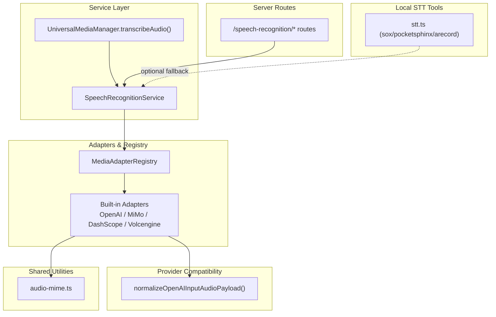
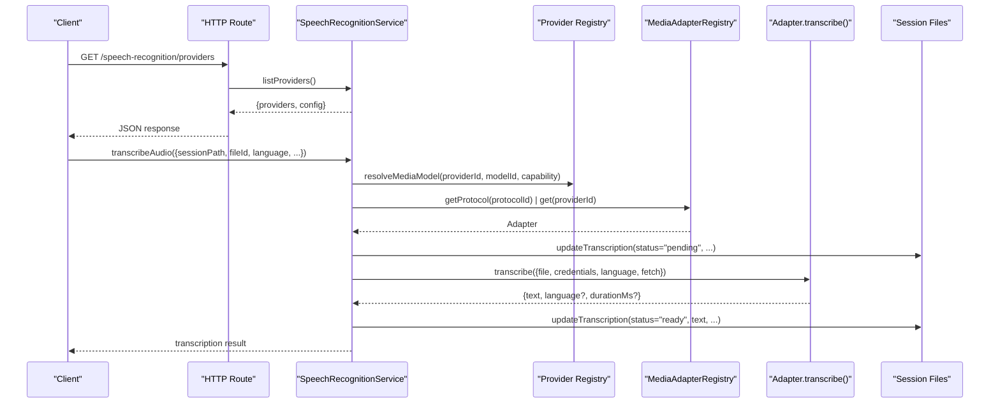
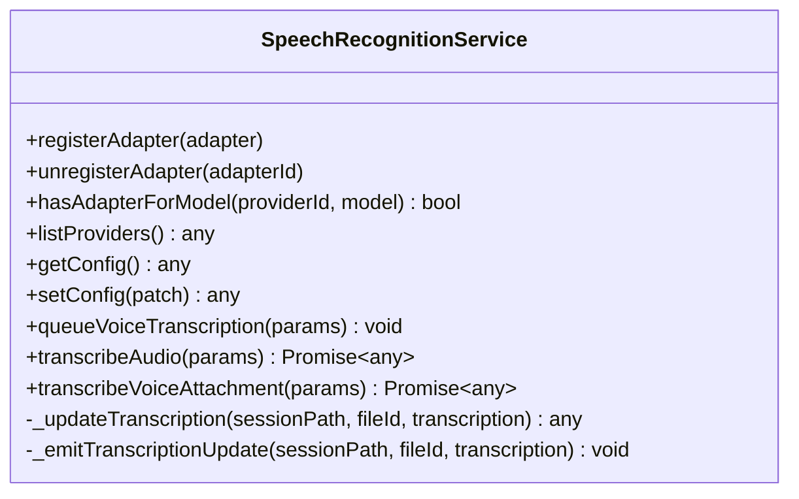
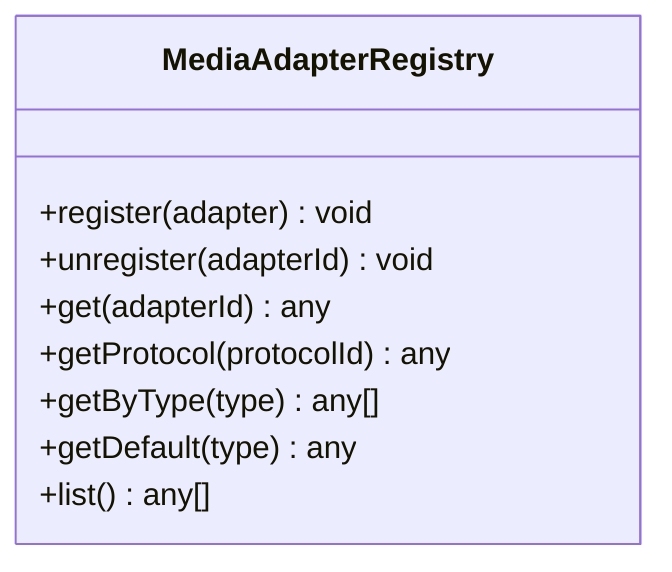
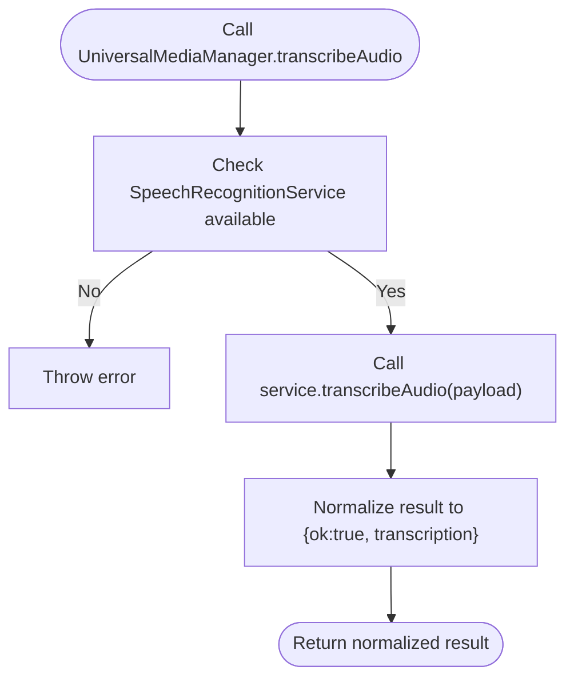
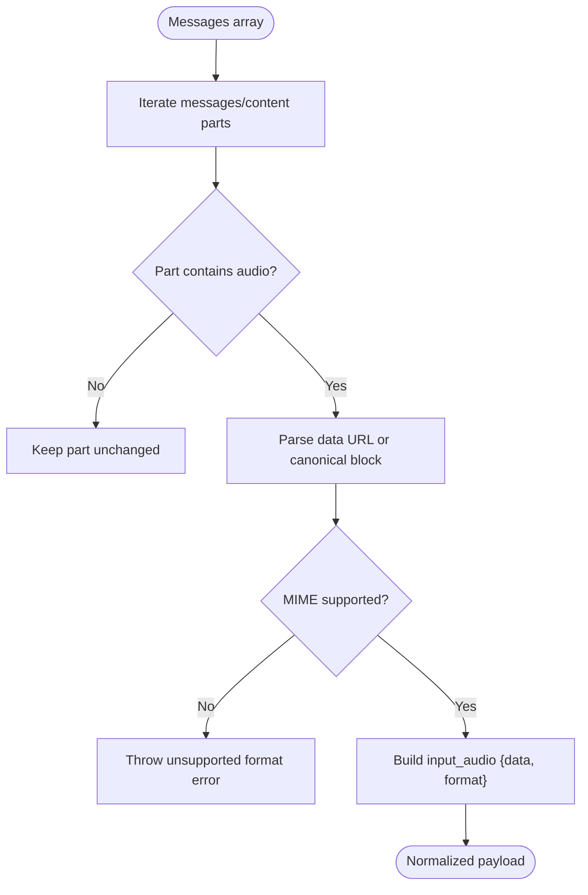
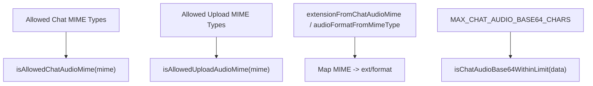
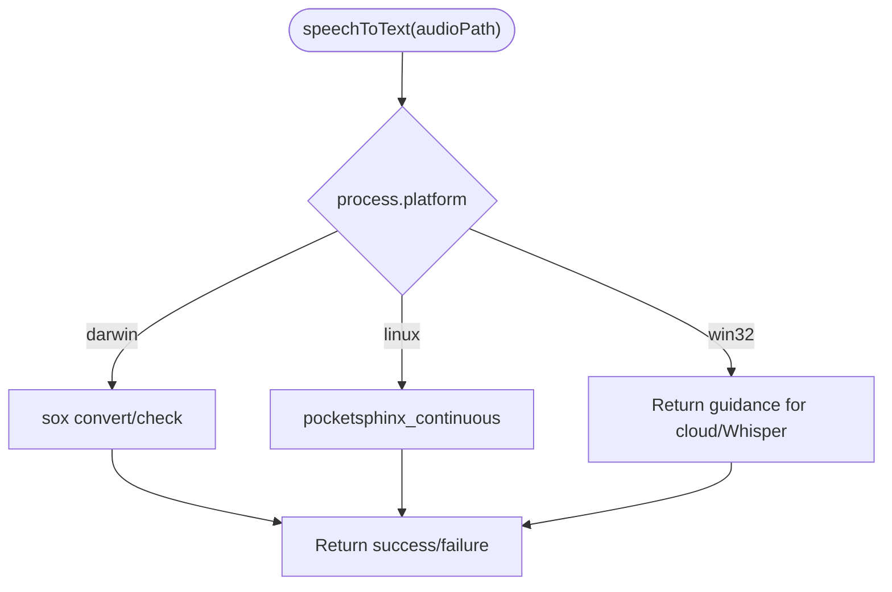
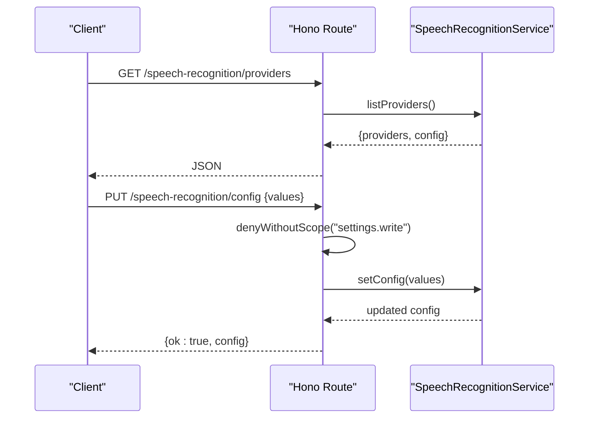
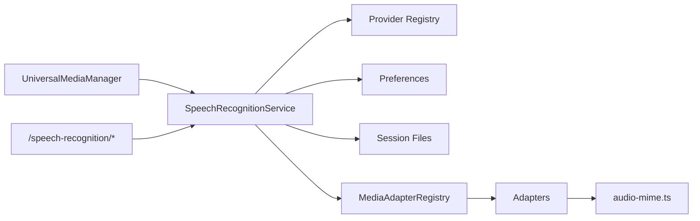

# Audio Processing

<cite>
**Referenced Files in This Document**
- [speech-recognition-service.ts](file://core/speech-recognition-service.ts)
- [adapters.ts](file://core/speech-recognition/adapters.ts)
- [media-adapter-registry.ts](file://core/media-adapter-registry.ts)
- [stt.ts](file://core/stt.ts)
- [audio-mime.ts](file://shared/audio-mime.ts)
- [input-audio.ts](file://core/provider-compat/input-audio.ts)
- [universal-media-manager.ts](file://core/media/universal-media-manager.ts)
- [speech-recognition.ts](file://server/routes/speech-recognition.ts)
- [system-speech.ts](file://lib/providers/system-speech.ts)
</cite>

## Table of Contents
1. [Introduction](#introduction)
2. [Project Structure](#project-structure)
3. [Core Components](#core-components)
4. [Architecture Overview](#architecture-overview)
5. [Detailed Component Analysis](#detailed-component-analysis)
6. [Dependency Analysis](#dependency-analysis)
7. [Performance Considerations](#performance-considerations)
8. [Troubleshooting Guide](#troubleshooting-guide)
9. [Conclusion](#conclusion)
10. [Appendices](#appendices)

## Introduction
This document explains the audio processing capabilities focused on speech-to-text transcription and audio analysis. It covers:
- Speech recognition service integration with multiple providers
- Supported audio formats and MIME handling
- Transcription workflows, including queued voice input and direct transcription
- STT implementation details for local tooling and cloud adapters
- Audio file preprocessing and language detection features
- Practical examples and configuration guidance
- Error handling and performance optimization strategies for large files
- Audio quality requirements, noise reduction considerations, and multi-language support

## Project Structure
The audio processing subsystem is composed of a service layer, adapter implementations, a registry for protocol-based dispatch, provider compatibility helpers, shared audio utilities, and server routes that expose configuration endpoints.



**Diagram sources**
- [speech-recognition-service.ts:1-286](file://core/speech-recognition-service.ts#L1-L286)
- [adapters.ts:1-205](file://core/speech-recognition/adapters.ts#L1-L205)
- [media-adapter-registry.ts:1-79](file://core/media-adapter-registry.ts#L1-L79)
- [universal-media-manager.ts:1081-1094](file://core/media/universal-media-manager.ts#L1081-L1094)
- [input-audio.ts:1-76](file://core/provider-compat/input-audio.ts#L1-L76)
- [audio-mime.ts:1-70](file://shared/audio-mime.ts#L1-L70)
- [stt.ts:1-111](file://core/stt.ts#L1-L111)
- [speech-recognition.ts:1-48](file://server/routes/speech-recognition.ts#L1-L48)

**Section sources**
- [speech-recognition-service.ts:1-286](file://core/speech-recognition-service.ts#L1-L286)
- [adapters.ts:1-205](file://core/speech-recognition/adapters.ts#L1-L205)
- [media-adapter-registry.ts:1-79](file://core/media-adapter-registry.ts#L1-L79)
- [universal-media-manager.ts:1081-1094](file://core/media/universal-media-manager.ts#L1081-L1094)
- [input-audio.ts:1-76](file://core/provider-compat/input-audio.ts#L1-L76)
- [audio-mime.ts:1-70](file://shared/audio-mime.ts#L1-L70)
- [stt.ts:1-111](file://core/stt.ts#L1-L111)
- [speech-recognition.ts:1-48](file://server/routes/speech-recognition.ts#L1-L48)

## Core Components
- SpeechRecognitionService: Orchestrates transcription by resolving configured providers/models, selecting an adapter via the registry, invoking the adapter’s transcribe method, updating session file transcription metadata, and emitting events.
- MediaAdapterRegistry: Maintains mappings from adapter IDs and protocol IDs to concrete adapter implementations; supports registration/unregistration and lookup by type or protocol.
- Built-in Adapters: Implementations for OpenAI, MiMo, DashScope Qwen ASR, and Volcengine BigASR, each translating the common adapter contract into provider-specific HTTP requests and responses.
- UniversalMediaManager: Exposes a high-level transcribeAudio API that delegates to the SpeechRecognitionService and normalizes results.
- Provider Compatibility Helpers: Normalize input payloads to OpenAI-compatible input_audio structures when required by certain providers.
- Shared Audio Utilities: Define allowed MIME types, size limits, and format conversions used across the system.
- Local STT Tools: Provide platform-specific recording and transcription using system tools as a fallback path.
- Server Routes: Expose endpoints to list providers and update speech recognition configuration.

**Section sources**
- [speech-recognition-service.ts:1-286](file://core/speech-recognition-service.ts#L1-L286)
- [media-adapter-registry.ts:1-79](file://core/media-adapter-registry.ts#L1-L79)
- [adapters.ts:1-205](file://core/speech-recognition/adapters.ts#L1-L205)
- [universal-media-manager.ts:1081-1094](file://core/media/universal-media-manager.ts#L1081-L1094)
- [input-audio.ts:1-76](file://core/provider-compat/input-audio.ts#L1-L76)
- [audio-mime.ts:1-70](file://shared/audio-mime.ts#L1-L70)
- [stt.ts:1-111](file://core/stt.ts#L1-L111)
- [speech-recognition.ts:1-48](file://server/routes/speech-recognition.ts#L1-L48)

## Architecture Overview
The transcription pipeline integrates configuration, provider resolution, adapter selection, and execution, with event-driven updates persisted to session files.



**Diagram sources**
- [speech-recognition-service.ts:103-178](file://core/speech-recognition-service.ts#L103-L178)
- [speech-recognition.ts:6-39](file://server/routes/speech-recognition.ts#L6-L39)
- [media-adapter-registry.ts:18-48](file://core/media-adapter-registry.ts#L18-L48)
- [adapters.ts:12-34](file://core/speech-recognition/adapters.ts#L12-L34)

## Detailed Component Analysis

### SpeechRecognitionService
Responsibilities:
- Configuration management: enable/disable feature and set default model
- Provider listing: enumerate available models filtered by adapter availability
- Transcription orchestration: resolve target provider/model, select adapter, invoke transcribe, persist status transitions, emit events
- Voice attachment queue: automatically process voice-input attachments if enabled

Key behaviors:
- Validates inputs (sessionPath, fileId), resolves provider/model, ensures adapter exists
- Emits pending/ready/failed transcription updates to session files and events
- Supports explicit language parameter; adapters may return detected language and duration



**Diagram sources**
- [speech-recognition-service.ts:8-254](file://core/speech-recognition-service.ts#L8-L254)

**Section sources**
- [speech-recognition-service.ts:79-93](file://core/speech-recognition-service.ts#L79-L93)
- [speech-recognition-service.ts:95-101](file://core/speech-recognition-service.ts#L95-L101)
- [speech-recognition-service.ts:103-178](file://core/speech-recognition-service.ts#L103-L178)
- [speech-recognition-service.ts:180-240](file://core/speech-recognition-service.ts#L180-L240)
- [speech-recognition-service.ts:242-253](file://core/speech-recognition-service.ts#L242-L253)

### MediaAdapterRegistry
Responsibilities:
- Register/unregister adapters by id and aliases
- Map protocolIds to adapters for protocol-based dispatch
- List and filter adapters by type



**Diagram sources**
- [media-adapter-registry.ts:8-78](file://core/media-adapter-registry.ts#L8-L78)

**Section sources**
- [media-adapter-registry.ts:18-48](file://core/media-adapter-registry.ts#L18-L48)
- [media-adapter-registry.ts:50-77](file://core/media-adapter-registry.ts#L50-L77)

### Built-in Speech Recognition Adapters
Common adapter contract:
- Input: file object, provider/model descriptors, credentials, optional language, fetch function
- Output: text string, optional language and durationMs

Implementations:
- OpenAI: multipart/form-data to /audio/transcriptions
- MiMo: chat/completions with input_audio message and asr_options.language
- DashScope Qwen ASR: chat/completions with input_audio and asr_options
- Volcengine BigASR: specialized endpoint with base64 audio payload and headers

```mermaid
classDiagram
class OpenAIAdapter {
+id : "openai"
+protocolId : "openai-audio-transcriptions"
+transcribe(input) Promise~{text, language?}~
}
class MimoAdapter {
+id : "mimo"
+protocolId : "mimo-chat-completions-asr"
+transcribe(input) Promise~{text, language}~
}
class DashScopeAdapter {
+id : "dashscope"
+protocolId : "dashscope-qwen-asr-chat"
+transcribe(input) Promise~{text, language?}~
}
class VolcengineAdapter {
+id : "volcengine-speech"
+protocolId : "volcengine-bigasr-transcription"
+transcribe(input) Promise~{text, durationMs?, language?}~
}
```

**Diagram sources**
- [adapters.ts:7-146](file://core/speech-recognition/adapters.ts#L7-L146)

**Section sources**
- [adapters.ts:12-34](file://core/speech-recognition/adapters.ts#L12-L34)
- [adapters.ts:41-65](file://core/speech-recognition/adapters.ts#L41-L65)
- [adapters.ts:72-99](file://core/speech-recognition/adapters.ts#L72-L99)
- [adapters.ts:106-139](file://core/speech-recognition/adapters.ts#L106-L139)

### UniversalMediaManager Integration
Provides a normalized entry point for transcription:
- Delegates to SpeechRecognitionService.transcribeAudio
- Normalizes result shape to include ok flag and transcription object



**Diagram sources**
- [universal-media-manager.ts:1081-1094](file://core/media/universal-media-manager.ts#L1081-L1094)

**Section sources**
- [universal-media-manager.ts:1081-1094](file://core/media/universal-media-manager.ts#L1081-L1094)

### Provider Compatibility: OpenAI-compatible input_audio
Transforms messages containing image_url or canonical audio blocks into OpenAI-compatible input_audio parts with data and format fields.



**Diagram sources**
- [input-audio.ts:11-39](file://core/provider-compat/input-audio.ts#L11-L39)
- [input-audio.ts:41-76](file://core/provider-compat/input-audio.ts#L41-L76)

**Section sources**
- [input-audio.ts:11-39](file://core/provider-compat/input-audio.ts#L11-L39)
- [input-audio.ts:41-76](file://core/provider-compat/input-audio.ts#L41-L76)

### Shared Audio Utilities
Defines allowed MIME types for chat and upload contexts, size limits, and conversion helpers between MIME and formats/extensions.



**Diagram sources**
- [audio-mime.ts:1-70](file://shared/audio-mime.ts#L1-L70)

**Section sources**
- [audio-mime.ts:1-70](file://shared/audio-mime.ts#L1-L70)

### Local STT Tools (Fallback Path)
Platform-specific recording and transcription using system tools:
- macOS: sox for recording/conversion; notes cloud API requirement for full STT
- Linux: arecord for recording; pocketsphinx_continuous for transcription
- Windows: returns guidance to use cloud APIs or install Whisper locally



**Diagram sources**
- [stt.ts:25-60](file://core/stt.ts#L25-L60)
- [stt.ts:65-104](file://core/stt.ts#L65-L104)

**Section sources**
- [stt.ts:25-60](file://core/stt.ts#L25-L60)
- [stt.ts:65-104](file://core/stt.ts#L65-L104)

### Server Routes for Speech Recognition
Endpoints:
- GET /speech-recognition/providers: lists providers and current configuration
- PUT /speech-recognition/config: updates configuration with write scope guard and audit logging



**Diagram sources**
- [speech-recognition.ts:6-39](file://server/routes/speech-recognition.ts#L6-L39)

**Section sources**
- [speech-recognition.ts:6-39](file://server/routes/speech-recognition.ts#L6-L39)

### System Speech Provider Declaration
Declares a system speech recognition lane with a protocolId for runtime adapter matching.

**Section sources**
- [system-speech.ts:9-31](file://lib/providers/system-speech.ts#L9-L31)

## Dependency Analysis
High-level dependencies:
- SpeechRecognitionService depends on Provider Registry, Preferences, Session Files, and MediaAdapterRegistry
- Adapters depend on fetch and shared audio utilities for MIME/format mapping
- UniversalMediaManager wraps SpeechRecognitionService for normalization
- Server routes depend on SpeechRecognitionService and security guards



**Diagram sources**
- [speech-recognition-service.ts:1-36](file://core/speech-recognition-service.ts#L1-L36)
- [media-adapter-registry.ts:1-30](file://core/media-adapter-registry.ts#L1-L30)
- [adapters.ts:1-20](file://core/speech-recognition/adapters.ts#L1-L20)
- [universal-media-manager.ts:1081-1094](file://core/media/universal-media-manager.ts#L1081-L1094)
- [speech-recognition.ts:1-15](file://server/routes/speech-recognition.ts#L1-L15)

**Section sources**
- [speech-recognition-service.ts:1-36](file://core/speech-recognition-service.ts#L1-L36)
- [media-adapter-registry.ts:1-30](file://core/media-adapter-registry.ts#L1-L30)
- [adapters.ts:1-20](file://core/speech-recognition/adapters.ts#L1-L20)
- [universal-media-manager.ts:1081-1094](file://core/media/universal-media-manager.ts#L1081-L1094)
- [speech-recognition.ts:1-15](file://server/routes/speech-recognition.ts#L1-L15)

## Performance Considerations
- Prefer streaming or chunked uploads where supported by providers to reduce memory pressure for large audio files
- Use appropriate sample rates and mono channels to minimize payload size while maintaining accuracy
- Avoid unnecessary re-encoding; pass original files when possible to adapters that accept them directly
- Cache provider listings and configuration to reduce repeated lookups
- For very long recordings, consider splitting into segments and transcribing incrementally, then merging results at the application level
- Monitor network latency and implement retries with exponential backoff for transient failures

[No sources needed since this section provides general guidance]

## Troubleshooting Guide
Common issues and resolutions:
- Missing or invalid configuration: ensure defaultModel.provider and defaultModel.id are set and available
- No adapter registered: verify adapter registration for the selected protocolId or providerId
- File not found: confirm sessionPath and fileId exist and the file presentation is compatible
- Network errors: check credentials, baseUrl overrides, and provider-specific headers
- Unsupported MIME/format: validate MIME against allowed lists and ensure format conversion aligns with provider expectations
- Local STT prerequisites: install sox on macOS, pocketsphinx/arecord on Linux, or configure cloud APIs on Windows

Operational checks:
- Use GET /speech-recognition/providers to inspect available models and credential status
- Use PUT /speech-recognition/config to update settings and verify audit logs
- Inspect transcription status transitions (pending -> ready/failed) in session files

**Section sources**
- [speech-recognition-service.ts:83-93](file://core/speech-recognition-service.ts#L83-L93)
- [speech-recognition-service.ts:103-178](file://core/speech-recognition-service.ts#L103-L178)
- [speech-recognition.ts:18-37](file://server/routes/speech-recognition.ts#L18-L37)
- [audio-mime.ts:1-70](file://shared/audio-mime.ts#L1-L70)
- [stt.ts:25-60](file://core/stt.ts#L25-L60)

## Conclusion
The audio processing subsystem provides a flexible, adapter-based architecture for speech-to-text transcription across multiple providers, with robust configuration, event-driven updates, and shared utilities for audio format handling. By leveraging the registry and provider compatibility helpers, the system can integrate new services seamlessly while maintaining consistent behavior and error handling.

[No sources needed since this section summarizes without analyzing specific files]

## Appendices

### Supported Audio Formats and Limits
- Allowed chat MIME types: audio/mpeg, audio/mp3, audio/wav, audio/x-wav, audio/mp4, audio/ogg, audio/flac
- Allowed upload MIME types: includes webm in addition to chat types
- Base64 limit for chat audio payloads defined in shared utilities

**Section sources**
- [audio-mime.ts:1-70](file://shared/audio-mime.ts#L1-L70)

### Language Detection and Multi-language Support
- Optional language parameter passed to adapters
- Some adapters may return detected language and duration
- Ensure provider models support desired languages

**Section sources**
- [adapters.ts:12-34](file://core/speech-recognition/adapters.ts#L12-L34)
- [adapters.ts:41-65](file://core/speech-recognition/adapters.ts#L41-L65)
- [adapters.ts:72-99](file://core/speech-recognition/adapters.ts#L72-L99)
- [adapters.ts:106-139](file://core/speech-recognition/adapters.ts#L106-L139)

### Practical Examples

- Configure speech recognition:
  - Update configuration via PUT /speech-recognition/config with values including enabled and defaultModel
  - Verify providers via GET /speech-recognition/providers

- Transcribe an audio file:
  - Call transcribeAudio with sessionPath, fileId, and optional language
  - Observe transcription status updates in session files and events

- Queue automatic transcription for voice input:
  - Enable feature and set defaultModel
  - Attach voice-input media; service will auto-process

- Use local STT tools (fallback):
  - Install required system tools per platform
  - Invoke recordAudio and speechToText functions

**Section sources**
- [speech-recognition.ts:6-39](file://server/routes/speech-recognition.ts#L6-L39)
- [speech-recognition-service.ts:95-101](file://core/speech-recognition-service.ts#L95-L101)
- [speech-recognition-service.ts:103-178](file://core/speech-recognition-service.ts#L103-L178)
- [stt.ts:65-104](file://core/stt.ts#L65-L104)