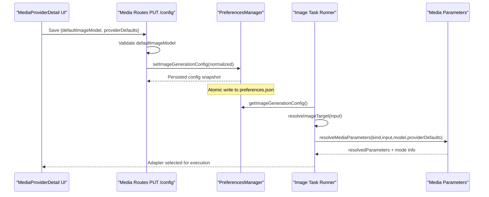
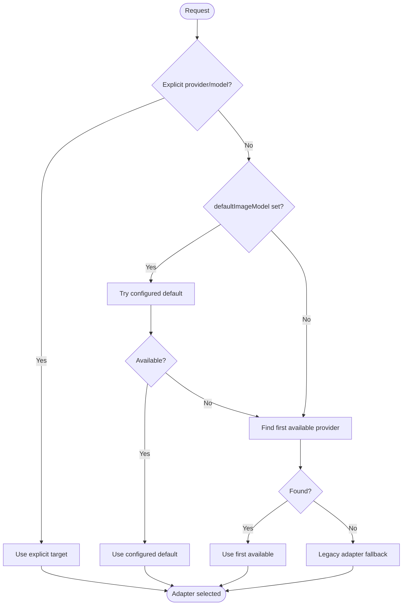
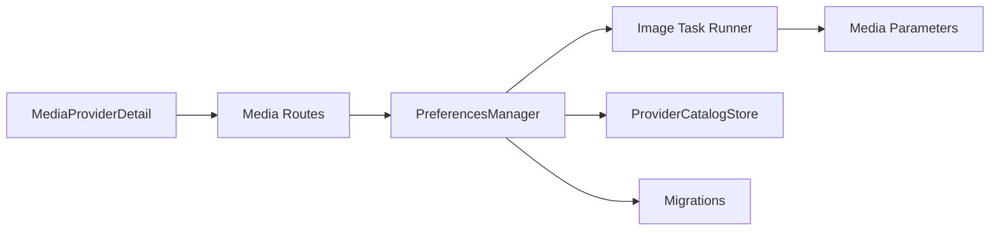

# Configuration Management

<cite>
**Referenced Files in This Document**
- [preferences-manager.ts](file://core/preferences-manager.ts)
- [media-parameters.ts](file://core/media/media-parameters.ts)
- [media.ts](file://plugins/image-gen/routes/media.ts)
- [image-task-runner.ts](file://plugins/image-gen/lib/image-task-runner.ts)
- [MediaProviderDetail.tsx](file://desktop/src/react/settings/tabs/media/MediaProviderDetail.tsx)
- [config-schema.ts](file://shared/config-schema.ts)
- [migrate-config-scope.ts](file://shared/migrate-config-scope.ts)
- [provider-catalog.ts](file://core/provider-catalog.ts)
- [migrations.ts](file://core/migrations.ts)
</cite>

## Table of Contents
1. Introduction
2. Project Structure
3. Core Components
4. Architecture Overview
5. Detailed Component Analysis
6. Dependency Analysis
7. Performance Considerations
8. Troubleshooting Guide
9. Conclusion

## Introduction
This document explains image generation configuration management with a focus on provider defaults, model selection, and runtime settings. It covers the configuration schema (defaultImageModel, providerDefaults, per-provider overrides), persistence and validation rules, migration strategies, and the relationship between global preferences and plugin-specific configurations. It also includes examples for programmatic updates, dynamic model switching, environment-specific settings, backup/restore procedures, and troubleshooting steps.

## Project Structure
The image generation configuration spans several layers:
- Global preferences store (user-level JSON)
- Plugin routes that validate and persist configuration
- Runtime resolution logic that selects providers/models at request time
- UI components that edit provider defaults and default model
- Shared parameter resolution and validation utilities
- Migration and catalog systems for data evolution and backups

```mermaid
graph TB
subgraph "Global Preferences"
PM["PreferencesManager<br/>imageGeneration config"]
end
subgraph "Plugin Routes"
MR["Media Routes<br/>PUT /config"]
end
subgraph "Runtime Resolution"
ITR["Image Task Runner<br/>resolveImageTarget"]
MP["Media Parameters<br/>resolveMediaParameters"]
end
subgraph "UI"
UI["MediaProviderDetail<br/>edit defaults"]
end
subgraph "Persistence & Catalog"
PC["ProviderCatalogStore<br/>backup/restore"]
MIG["Migrations<br/>_dataVersion"]
end
UI --> MR
MR --> PM
PM --> ITR
ITR --> MP
PM --> PC
PM --> MIG
```

**Diagram sources**
- [preferences-manager.ts:665-692](file://core/preferences-manager.ts#L665-L692)
- [media.ts:92-108](file://plugins/image-gen/routes/media.ts#L92-L108)
- [image-task-runner.ts:327-345](file://plugins/image-gen/lib/image-task-runner.ts#L327-L345)
- [media-parameters.ts:187-219](file://core/media/media-parameters.ts#L187-L219)
- [MediaProviderDetail.tsx:81-127](file://desktop/src/react/settings/tabs/media/MediaProviderDetail.tsx#L81-L127)
- [provider-catalog.ts:111-142](file://core/provider-catalog.ts#L111-L142)
- [migrations.ts:151-179](file://core/migrations.ts#L151-L179)

**Section sources**
- [preferences-manager.ts:665-692](file://core/preferences-manager.ts#L665-L692)
- [media.ts:92-108](file://plugins/image-gen/routes/media.ts#L92-L108)
- [image-task-runner.ts:327-345](file://plugins/image-gen/lib/image-task-runner.ts#L327-L345)
- [media-parameters.ts:187-219](file://core/media/media-parameters.ts#L187-L219)
- [MediaProviderDetail.tsx:81-127](file://desktop/src/react/settings/tabs/media/MediaProviderDetail.tsx#L81-L127)
- [provider-catalog.ts:111-142](file://core/provider-catalog.ts#L111-L142)
- [migrations.ts:151-179](file://core/migrations.ts#L151-L179)

## Core Components
- Image generation configuration normalization and merging
  - Normalizes defaultImageModel and providerDefaults; merges base and override configs safely.
- Provider defaults resolution
  - Resolves provider/model/mode defaults and options into final parameters.
- Validation and persistence
  - Validates defaultImageModel against registry before saving; persists via atomic writes.
- Runtime model selection
  - Chooses explicit provider/model, configured default, first available, or legacy fallback.
- UI-driven editing
  - Media settings UI edits default model and per-provider defaults by mode.

**Section sources**
- [preferences-manager.ts:818-884](file://core/preferences-manager.ts#L818-L884)
- [media-parameters.ts:64-82](file://core/media/media-parameters.ts#L64-L82)
- [media.ts:183-202](file://plugins/image-gen/routes/media.ts#L183-L202)
- [image-task-runner.ts:327-345](file://plugins/image-gen/lib/image-task-runner.ts#L327-L345)
- [MediaProviderDetail.tsx:81-127](file://desktop/src/react/settings/tabs/media/MediaProviderDetail.tsx#L81-L127)

## Architecture Overview
End-to-end flow from UI to runtime:



**Diagram sources**
- [MediaProviderDetail.tsx:81-127](file://desktop/src/react/settings/tabs/media/MediaProviderDetail.tsx#L81-L127)
- [media.ts:92-108](file://plugins/image-gen/routes/media.ts#L92-L108)
- [preferences-manager.ts:665-692](file://core/preferences-manager.ts#L665-L692)
- [image-task-runner.ts:327-345](file://plugins/image-gen/lib/image-task-runner.ts#L327-L345)
- [media-parameters.ts:187-219](file://core/media/media-parameters.ts#L187-L219)

## Detailed Component Analysis

### Configuration Schema and Persistence
- Storage location: user preferences file under user directory.
- Top-level keys for image generation:
  - defaultImageModel: object with provider and id
  - providerDefaults: nested object keyed by providerId, supporting models and modes overrides
- Normalization ensures only valid objects are persisted; trims strings; drops empty fields.
- Merging strategy:
  - defaultImageModel is overridden if present in override; otherwise falls back to base.
  - providerDefaults merges by providerId with shallow merge of values.

Programmatic update example (paths):
- Read current config: [getImageGenerationConfig:665-667](file://core/preferences-manager.ts#L665-L667)
- Normalize and set: [setImageGenerationConfig:687-692](file://core/preferences-manager.ts#L687-L692)
- Merge helper: [mergeImageGenerationConfig:852-861](file://core/preferences-manager.ts#L852-L861)

Validation and save path:
- Route validates defaultImageModel against registry: [validateDefaultImageModelConfig:183-202](file://plugins/image-gen/routes/media.ts#L183-L202)
- Route persists via ctx.config.set: [PUT /config:92-108](file://plugins/image-gen/routes/media.ts#L92-L108)

**Section sources**
- [preferences-manager.ts:818-884](file://core/preferences-manager.ts#L818-L884)
- [preferences-manager.ts:665-692](file://core/preferences-manager.ts#L665-L692)
- [media.ts:92-108](file://plugins/image-gen/routes/media.ts#L92-L108)
- [media.ts:183-202](file://plugins/image-gen/routes/media.ts#L183-L202)

### Provider Defaults and Per-Provider Overrides
- Structure:
  - providerDefaults[providerId] can include:
    - top-level keys (e.g., ratio, quality)
    - options map
    - models[modelId] with modes[modeId] overrides
- Resolution order (most specific wins):
  - Mode-level defaults and options
  - Model-level defaults and options
  - Provider-level defaults and options
  - Global providerDefaults top-level keys
- Parameter extraction and precedence:
  - Explicit input parameters take highest precedence
  - Size-related conflicts are normalized for images

Key functions:
- Resolve provider defaults for a mode: [providerDefaultsForMode:64-82](file://core/media/media-parameters.ts#L64-L82)
- Resolve final parameters with validation: [resolveMediaParameters:187-219](file://core/media/media-parameters.ts#L187-L219)
- Explicit size precedence for images: [applyExplicitImageSizePrecedence:150-163](file://core/media/media-parameters.ts#L150-L163)

**Section sources**
- [media-parameters.ts:64-82](file://core/media/media-parameters.ts#L64-L82)
- [media-parameters.ts:150-163](file://core/media/media-parameters.ts#L150-L163)
- [media-parameters.ts:187-219](file://core/media/media-parameters.ts#L187-L219)

### Default Model Selection and Dynamic Switching
Selection priority at runtime:
1. Explicit provider/model in request
2. Configured defaultImageModel (if valid and available)
3. First available provider/model
4. Legacy adapter fallback

Dynamic switching behavior:
- Changing defaultImageModel immediately affects subsequent requests without restart.
- If the new default is unavailable, system falls back to next available provider.

Key flows:
- Target resolution entry point: [resolveImageTarget:327-345](file://plugins/image-gen/lib/image-task-runner.ts#L327-L345)
- Configured default branch: [targetFromConfiguredDefault:286-293](file://plugins/image-gen/lib/image-task-runner.ts#L286-L293)
- Fallback to first available: [targetFromFirstAvailableProvider:295-308](file://plugins/image-gen/lib/image-task-runner.ts#L295-L308)



**Diagram sources**
- [image-task-runner.ts:327-345](file://plugins/image-gen/lib/image-task-runner.ts#L327-L345)
- [image-task-runner.ts:286-308](file://plugins/image-gen/lib/image-task-runner.ts#L286-L308)

**Section sources**
- [image-task-runner.ts:327-345](file://plugins/image-gen/lib/image-task-runner.ts#L327-L345)
- [image-task-runner.ts:286-308](file://plugins/image-gen/lib/image-task-runner.ts#L286-L308)

### UI Editing of Provider Defaults
- The Media settings tab allows selecting a default model and editing per-mode defaults.
- Updates providerDefaults by providerId and mode, using schema-driven properties when available.
- Persists changes through the same route used for defaultImageModel.

Relevant paths:
- UI reads default model and provider defaults: [MediaProviderDetail:81-127](file://desktop/src/react/settings/tabs/media/MediaProviderDetail.tsx#L81-L127)
- UI saves providerDefaults updates: [updateModeDefault/updateDefault:87-127](file://desktop/src/react/settings/tabs/media/MediaProviderDetail.tsx#L87-L127)

**Section sources**
- [MediaProviderDetail.tsx:81-127](file://desktop/src/react/settings/tabs/media/MediaProviderDetail.tsx#L81-L127)

### Global Preferences vs Plugin-Specific Configurations
- Global scope fields are declared in the shared schema and stored in preferences.json.
- Migration utility promotes agent-scoped values to global scope when appropriate.
- Image generation config is part of global preferences and applies across agents.

References:
- Global field declarations: [CONFIG_SCHEMA:22-43](file://shared/config-schema.ts#L22-L43)
- Migration up to global scope: [migrate-config-scope:85-105](file://shared/migrate-config-scope.ts#L85-L105)

**Section sources**
- [config-schema.ts:22-43](file://shared/config-schema.ts#L22-L43)
- [migrate-config-scope.ts:85-105](file://shared/migrate-config-scope.ts#L85-L105)

### Validation Rules
- defaultImageModel must be an object with non-empty provider and id strings.
- Validation consults the media registry to ensure the model exists and has a registered protocol.
- Parameter validation enforces types, enums, and numeric ranges based on mode/model schemas.

References:
- Default model validation: [validateDefaultImageModelConfig:183-202](file://plugins/image-gen/routes/media.ts#L183-L202)
- Parameter validation: [validateMediaParameters:141-148](file://core/media/media-parameters.ts#L141-L148)

**Section sources**
- [media.ts:183-202](file://plugins/image-gen/routes/media.ts#L183-L202)
- [media-parameters.ts:141-148](file://core/media/media-parameters.ts#L141-L148)

### Migration Strategies
- Data versioning: migrations run sequentially until failure; each successful step persists _dataVersion.
- Provider catalog cutover: migrates legacy added-models.yaml into provider-catalog.json with backups.
- Image generation legacy migration: one-time merge of legacy image generation config into new structure.

References:
- Migration runner and versioning: [runMigrations:151-179](file://core/migrations.ts#L151-L179)
- Provider catalog cutover and backups: [cutoverFromLegacy/_writeMigrationBackup:111-142](file://core/provider-catalog.ts#L111-L142)
- Image generation legacy migration: [migrateImageGenerationConfigFromLegacy:673-685](file://core/preferences-manager.ts#L673-L685)

**Section sources**
- [migrations.ts:151-179](file://core/migrations.ts#L151-L179)
- [provider-catalog.ts:111-142](file://core/provider-catalog.ts#L111-L142)
- [preferences-manager.ts:673-685](file://core/preferences-manager.ts#L673-L685)

## Dependency Analysis
High-level dependencies among core modules:



**Diagram sources**
- [preferences-manager.ts:665-692](file://core/preferences-manager.ts#L665-L692)
- [image-task-runner.ts:327-345](file://plugins/image-gen/lib/image-task-runner.ts#L327-L345)
- [media-parameters.ts:187-219](file://core/media/media-parameters.ts#L187-L219)
- [provider-catalog.ts:111-142](file://core/provider-catalog.ts#L111-L142)
- [migrations.ts:151-179](file://core/migrations.ts#L151-L179)
- [MediaProviderDetail.tsx:81-127](file://desktop/src/react/settings/tabs/media/MediaProviderDetail.tsx#L81-L127)
- [media.ts:92-108](file://plugins/image-gen/routes/media.ts#L92-L108)

**Section sources**
- [preferences-manager.ts:665-692](file://core/preferences-manager.ts#L665-L692)
- [image-task-runner.ts:327-345](file://plugins/image-gen/lib/image-task-runner.ts#L327-L345)
- [media-parameters.ts:187-219](file://core/media/media-parameters.ts#L187-L219)
- [provider-catalog.ts:111-142](file://core/provider-catalog.ts#L111-L142)
- [migrations.ts:151-179](file://core/migrations.ts#L151-L179)
- [MediaProviderDetail.tsx:81-127](file://desktop/src/react/settings/tabs/media/MediaProviderDetail.tsx#L81-L127)
- [media.ts:92-108](file://plugins/image-gen/routes/media.ts#L92-L108)

## Performance Considerations
- Prefer minimal providerDefaults depth; only override what differs from defaults.
- Avoid frequent large writes to preferences.json; batch updates where possible.
- Use schema-driven defaults in UI to reduce unnecessary parameter noise.
- Leverage first-available fallback to avoid repeated failures on unavailable providers.

## Troubleshooting Guide
Common issues and checks:
- Invalid defaultImageModel
  - Ensure provider and id are non-empty strings and correspond to a registered model.
  - Reference: [validateDefaultImageModelConfig:183-202](file://plugins/image-gen/routes/media.ts#L183-L202)
- Missing protocol adapter
  - If a model’s protocolId has no adapter, it will be hidden in settings and not selectable.
  - Reference: [annotateAdapterAvailability:151-181](file://plugins/image-gen/routes/media.ts#L151-L181)
- Parameter validation errors
  - Check type, enum, and range constraints defined by mode/model parameterSchema.
  - Reference: [validateMediaParameters:141-148](file://core/media/media-parameters.ts#L141-L148)
- Migration failures
  - Inspect _dataVersion and migration logs; migrations stop on first error.
  - Reference: [runMigrations:151-179](file://core/migrations.ts#L151-L179)
- Provider catalog inconsistencies
  - Verify catalog version and check migration-backups for pre-migration state.
  - Reference: [ProviderCatalogStore._readExistingCatalog:174-186](file://core/provider-catalog.ts#L174-L186)

**Section sources**
- [media.ts:183-202](file://plugins/image-gen/routes/media.ts#L183-L202)
- [media.ts:151-181](file://plugins/image-gen/routes/media.ts#L151-L181)
- [media-parameters.ts:141-148](file://core/media/media-parameters.ts#L141-L148)
- [migrations.ts:151-179](file://core/migrations.ts#L151-L179)
- [provider-catalog.ts:174-186](file://core/provider-catalog.ts#L174-L186)

## Conclusion
Image generation configuration is centrally managed in global preferences with robust normalization, validation, and merging. Provider defaults support fine-grained control per provider, model, and mode. Runtime selection prioritizes explicit inputs, then configured defaults, then availability, ensuring resilient operation. Backups and migrations protect data integrity during upgrades. For best results, keep providerDefaults concise, rely on schema-driven defaults, and use the provided APIs for safe updates.