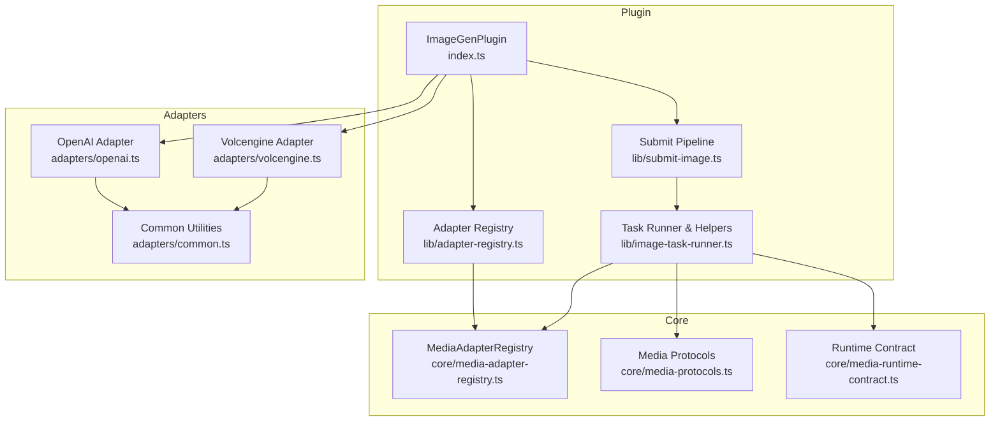
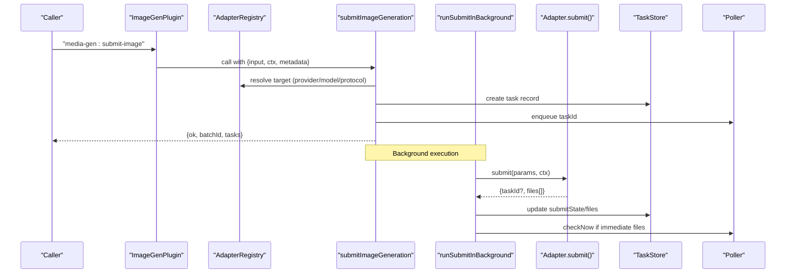
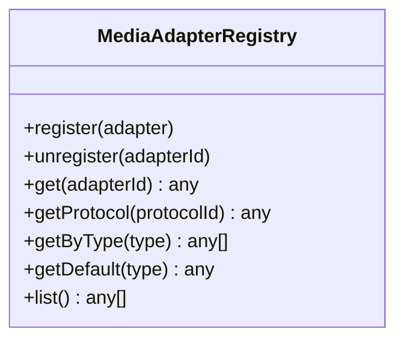
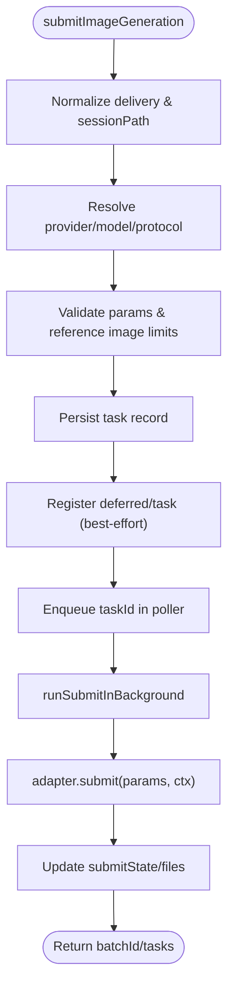
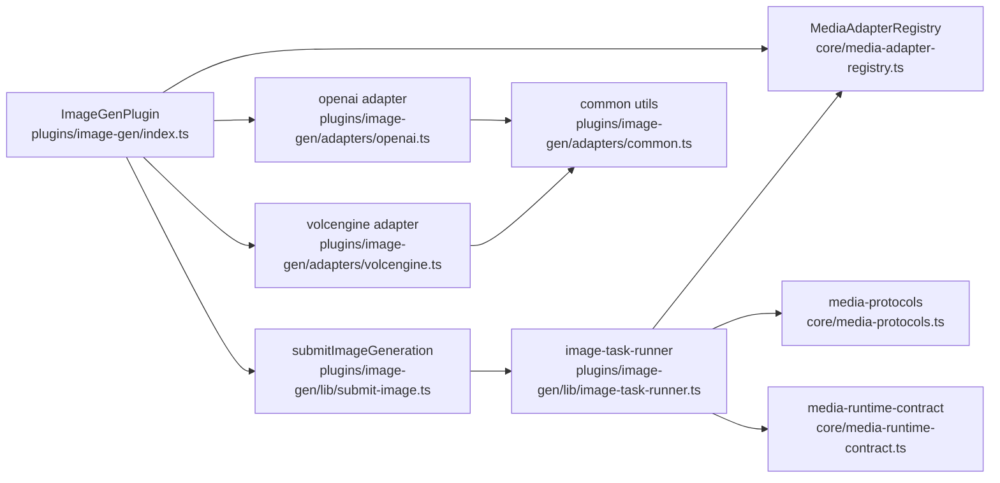

# Custom Adapter Development

<cite>
**Referenced Files in This Document**
- [media-adapter-registry.ts](file://core/media-adapter-registry.ts)
- [index.ts](file://plugins/image-gen/index.ts)
- [adapter-registry.ts](file://plugins/image-gen/lib/adapter-registry.ts)
- [common.ts](file://plugins/image-gen/adapters/common.ts)
- [submit-image.ts](file://plugins/image-gen/lib/submit-image.ts)
- [image-task-runner.ts](file://plugins/image-gen/lib/image-task-runner.ts)
- [openai.ts](file://plugins/image-gen/adapters/openai.ts)
- [volcengine.ts](file://plugins/image-gen/adapters/volcengine.ts)
- [media-protocols.ts](file://core/media-protocols.ts)
- [media-runtime-contract.ts](file://core/media-runtime-contract.ts)
</cite>

## Table of Contents
1. [Introduction](#introduction)
2. [Project Structure](#project-structure)
3. [Core Components](#core-components)
4. [Architecture Overview](#architecture-overview)
5. [Detailed Component Analysis](#detailed-component-analysis)
6. [Dependency Analysis](#dependency-analysis)
7. [Performance Considerations](#performance-considerations)
8. [Troubleshooting Guide](#troubleshooting-guide)
9. [Conclusion](#conclusion)
10. [Appendices](#appendices)

## Introduction
This document explains how to develop custom image generation adapters for the system, focusing on extending the adapter system. It covers the MediaAdapterRegistry interface and registration process, lifecycle management, the adapter contract (required methods, parameter validation, response formatting), common utilities, error handling patterns, logging conventions, step-by-step examples for creating a new adapter, authentication, handling different response formats, testing strategies, and packaging/distribution/versioning approaches.

## Project Structure
The image generation subsystem is implemented as a plugin that:
- Registers built-in adapters into an adapter registry
- Exposes bus handlers for adapter registration/unregistration and task management
- Submits image generation tasks through a unified submission pipeline
- Persists tasks and coordinates polling/completion via a poller

**Diagram sources**
- [index.ts:1-170](file://plugins/image-gen/index.ts#L1-L170)
- [adapter-registry.ts:1-2](file://plugins/image-gen/lib/adapter-registry.ts#L1-L2)
- [media-adapter-registry.ts:1-79](file://core/media-adapter-registry.ts#L1-L79)
- [submit-image.ts:1-139](file://plugins/image-gen/lib/submit-image.ts#L1-L139)
- [image-task-runner.ts:1-506](file://plugins/image-gen/lib/image-task-runner.ts#L1-L506)
- [media-protocols.ts:1-78](file://core/media-protocols.ts#L1-L78)
- [media-runtime-contract.ts:1-91](file://core/media-runtime-contract.ts#L1-L91)
- [openai.ts:1-257](file://plugins/image-gen/adapters/openai.ts#L1-L257)
- [volcengine.ts:1-252](file://plugins/image-gen/adapters/volcengine.ts#L1-L252)
- [common.ts:1-63](file://plugins/image-gen/adapters/common.ts#L1-L63)

**Section sources**
- [index.ts:1-170](file://plugins/image-gen/index.ts#L1-L170)
- [adapter-registry.ts:1-2](file://plugins/image-gen/lib/adapter-registry.ts#L1-L2)
- [media-adapter-registry.ts:1-79](file://core/media-adapter-registry.ts#L1-L79)

## Core Components
- MediaAdapterRegistry: Generic registry for provider-side media adapters with registration by id, aliases, and protocolId mapping; lookup by id, protocol, type, default, and listing.
- ImageGenPlugin: Bootstraps infrastructure (registry, store, poller), registers built-in adapters, exposes bus handlers for dynamic adapter registration/unregistration, and wires task submission and lifecycle.
- Submission pipeline: Normalizes input, resolves target provider/model/protocol, validates parameters, persists tasks, registers deferred results/tasks, and enqueues background execution.
- Task runner helpers: Parameter normalization, delivery mode handling, reference image limit enforcement, retry logic, and background submit orchestration.
- Adapters: Concrete implementations for providers (e.g., OpenAI, Volcengine) implementing the adapter contract.

Key responsibilities:
- Registry: Maintain adapter instances and protocol mappings; support dynamic add/remove.
- Plugin: Provide bus endpoints for external plugins to register/unregister adapters and manage tasks.
- Submission: Resolve targets, validate inputs, persist state, and coordinate async execution.
- Adapters: Implement checkAuth and submit; optionally query for long-running jobs.

**Section sources**
- [media-adapter-registry.ts:1-79](file://core/media-adapter-registry.ts#L1-L79)
- [index.ts:1-170](file://plugins/image-gen/index.ts#L1-L170)
- [submit-image.ts:1-139](file://plugins/image-gen/lib/submit-image.ts#L1-L139)
- [image-task-runner.ts:1-506](file://plugins/image-gen/lib/image-task-runner.ts#L1-L506)

## Architecture Overview
The runtime binds either to a native media runtime or falls back to the plugin’s internal runtime. The plugin initializes its own registry, store, and poller, then registers built-in adapters and bus handlers. External plugins can dynamically register additional adapters at runtime.

**Diagram sources**
- [index.ts:87-107](file://plugins/image-gen/index.ts#L87-L107)
- [submit-image.ts:25-139](file://plugins/image-gen/lib/submit-image.ts#L25-L139)
- [image-task-runner.ts:367-390](file://plugins/image-gen/lib/image-task-runner.ts#L367-L390)

## Detailed Component Analysis

### MediaAdapterRegistry Interface and Lifecycle
- Registration:
  - Accepts an adapter object with required id and optional aliases and protocolIds.
  - Stores canonical id, aliases, and protocol mappings.
- Unregistration:
  - Removes canonical id, all aliases, and protocol mappings.
- Lookup:
  - get(adapterId): returns adapter by id or alias.
  - getProtocol(protocolId): returns adapter bound to a protocol.
  - getByType(type): returns all adapters supporting a given type (e.g., "image").
  - getDefault(type): returns first adapter supporting a type.
  - list(): returns unique adapters.

Lifecycle integration:
- Built-in adapters are registered during plugin load.
- External plugins can register/unregister adapters via bus handlers.
- On plugin unload, poller stops and resources are cleaned up.

**Diagram sources**
- [media-adapter-registry.ts:8-78](file://core/media-adapter-registry.ts#L8-L78)

**Section sources**
- [media-adapter-registry.ts:1-79](file://core/media-adapter-registry.ts#L1-L79)
- [index.ts:62-81](file://plugins/image-gen/index.ts#L62-L81)

### Adapter Contract
An adapter must implement:
- id: string — unique identifier
- name: string — human-readable name
- types: string[] — capabilities (e.g., ["image"])
- protocolId?: string — protocol binding for model resolution
- aliases?: string[] — alternate ids for lookup
- capabilities?: object — advertised capabilities (ratios, resolutions, etc.)
- checkAuth?(ctx): Promise<{ok:boolean,message?:string}> — optional pre-flight auth check
- submit(params, ctx): Promise<{taskId?:string, files:string[]}> — required; performs generation and saves files
- query?(params, ctx): optional; used when provider requires polling

Parameter validation:
- Reference image limits enforced centrally using adapter.maxReferenceImages or nested capability fields.
- Model and ratio/resolution constraints validated per adapter implementation.

Response formatting:
- submit must return files array of saved filenames under generated directory.
- Optional taskId returned for asynchronous providers; otherwise fake-async pattern returns files immediately.

**Section sources**
- [openai.ts:94-257](file://plugins/image-gen/adapters/openai.ts#L94-L257)
- [volcengine.ts:118-252](file://plugins/image-gen/adapters/volcengine.ts#L118-L252)
- [image-task-runner.ts:104-114](file://plugins/image-gen/lib/image-task-runner.ts#L104-L114)

### Common Adapter Utilities
- normalizeBaseUrl: Trims trailing slashes from base URLs.
- localImageToDataUrl: Converts local file paths to data URLs.
- normalizeImageInput: Normalizes single or multiple images; converts absolute local paths to data URLs.
- saveBase64Images: Saves base64 images to disk with optional naming.
- downloadImageUrls: Downloads images from URLs and saves them.
- createLocalTaskId: Generates short random task identifiers.

These utilities simplify common operations across adapters.

**Section sources**
- [common.ts:1-63](file://plugins/image-gen/adapters/common.ts#L1-L63)

### Submission Flow and Target Resolution
- Input normalization:
  - Delivery mode normalized to "session" or "response".
  - Session path validated unless response delivery is requested.
- Target resolution:
  - Explicit provider/model selection
  - Configured default model
  - First available provider with credentials and matching protocol
  - Legacy fallback to adapter id/type
- Parameter resolution:
  - Provider defaults merged
  - Mode and resolved parameters computed
  - Reference image count validated against adapter limits
- Task persistence:
  - Task records created with metadata, sessionPath, delivery info
  - Deferred result and task registry registrations attempted
- Background execution:
  - Adapter.submit invoked asynchronously
  - Results persisted; poller notified if needed

**Diagram sources**
- [submit-image.ts:25-139](file://plugins/image-gen/lib/submit-image.ts#L25-L139)
- [image-task-runner.ts:327-349](file://plugins/image-gen/lib/image-task-runner.ts#L327-L349)
- [image-task-runner.ts:367-390](file://plugins/image-gen/lib/image-task-runner.ts#L367-L390)

**Section sources**
- [submit-image.ts:1-139](file://plugins/image-gen/lib/submit-image.ts#L1-L139)
- [image-task-runner.ts:1-506](file://plugins/image-gen/lib/image-task-runner.ts#L1-L506)

### Authentication Patterns
- checkAuth(ctx):
  - Fetches credentials via bus request "provider:credentials"
  - Returns ok:true if apiKey present; otherwise ok:false with message
- submit(params, ctx):
  - Resolves credentialProviderId/providerId
  - Throws descriptive errors if credentials missing
- Credential fallback:
  - Some adapters try multiple provider IDs (e.g., volcengine vs volcengine-coding)

Best practices:
- Always use bus.request("provider:credentials", ...) to obtain keys
- Surface user-friendly messages via i18n keys
- Fail fast with clear errors when credentials are unavailable

**Section sources**
- [openai.ts:104-122](file://plugins/image-gen/adapters/openai.ts#L104-L122)
- [volcengine.ts:102-146](file://plugins/image-gen/adapters/volcengine.ts#L102-L146)

### Handling Different Response Formats
- Base64 responses:
  - Decode buffer and save via saveImage utility
  - Determine MIME type based on format or extension
- URL/file_id references:
  - For edit workflows, build multipart or JSON bodies accordingly
- Output format mapping:
  - Map format strings to MIME types consistently
- Error propagation:
  - Parse API error payloads and throw descriptive errors

Examples:
- OpenAI adapter supports both generations and edits, handling multipart uploads for local files and JSON references for URLs/file_ids.
- Volcengine adapter normalizes size tiers and ratios, maps output_format to MIME, and handles reference images by converting local paths to data URLs.

**Section sources**
- [openai.ts:193-254](file://plugins/image-gen/adapters/openai.ts#L193-L254)
- [volcengine.ts:179-248](file://plugins/image-gen/adapters/volcengine.ts#L179-L248)

### Testing Strategies
- Unit tests:
  - Validate parameter normalization and resolution helpers
  - Mock bus requests for credentials and provider models
  - Assert adapter.checkAuth behavior under various credential states
- Integration tests:
  - Use test harness provided by the plugin framework to register adapters and submit tasks
  - Verify task persistence, deferred result registration, and poller interactions
- Mocking:
  - Mock fetch calls to simulate provider responses
  - Mock file system writes to avoid side effects

Recommended approach:
- Create a minimal adapter stub implementing checkAuth and submit
- Register it via bus handler "media-gen:register-adapter"
- Invoke "media-gen:submit-image" and assert outcomes

[No sources needed since this section provides general guidance]

### Packaging, Distribution, and Versioning
- Packaging:
  - Export a plugin entrypoint that registers adapters and exposes bus handlers
  - Include manifest describing plugin metadata and dependencies
- Distribution:
  - Publish as a plugin package installable by the host
  - Ensure adapter registration occurs on plugin load
- Versioning:
  - Follow semantic versioning for plugin releases
  - Maintain backward compatibility for adapter contract and bus interfaces
  - Document breaking changes in release notes

[No sources needed since this section provides general guidance]

## Dependency Analysis
The following diagram shows key dependencies between core modules and plugin components.

**Diagram sources**
- [media-adapter-registry.ts:1-79](file://core/media-adapter-registry.ts#L1-L79)
- [index.ts:1-170](file://plugins/image-gen/index.ts#L1-L170)
- [submit-image.ts:1-139](file://plugins/image-gen/lib/submit-image.ts#L1-L139)
- [image-task-runner.ts:1-506](file://plugins/image-gen/lib/image-task-runner.ts#L1-L506)
- [openai.ts:1-257](file://plugins/image-gen/adapters/openai.ts#L1-L257)
- [volcengine.ts:1-252](file://plugins/image-gen/adapters/volcengine.ts#L1-L252)
- [common.ts:1-63](file://plugins/image-gen/adapters/common.ts#L1-L63)
- [media-protocols.ts:1-78](file://core/media-protocols.ts#L1-L78)
- [media-runtime-contract.ts:1-91](file://core/media-runtime-contract.ts#L1-L91)

**Section sources**
- [index.ts:1-170](file://plugins/image-gen/index.ts#L1-L170)
- [submit-image.ts:1-139](file://plugins/image-gen/lib/submit-image.ts#L1-L139)
- [image-task-runner.ts:1-506](file://plugins/image-gen/lib/image-task-runner.ts#L1-L506)

## Performance Considerations
- Avoid unnecessary file I/O:
  - Prefer passing URLs/file_ids where supported to reduce local reads
- Batch operations:
  - When generating multiple images, reuse connections and minimize overhead
- Polling efficiency:
  - Only trigger checkNow when immediate files are available
- Memory usage:
  - Stream large buffers when possible; avoid holding entire responses in memory

[No sources needed since this section provides general guidance]

## Troubleshooting Guide
Common issues and diagnostics:
- Credentials not configured:
  - checkAuth returns ok:false; ensure provider:credentials returns apiKey
- No provider or model found:
  - Target resolution fails; verify provider configuration and model availability
- Reference image limit exceeded:
  - Validation throws error; reduce number of reference images
- API errors:
  - HTTP status and error messages propagated; inspect logs for details
- Not initialized:
  - Media runtime not ready; ensure plugin loaded and bus handlers registered

Logging conventions:
- Use ctx.log.info/warn/error for structured logging
- Include contextual identifiers like taskId, adapterId, providerId
- Redact sensitive information before logging

Error handling patterns:
- Throw descriptive errors with i18n keys for user-facing messages
- Mark tasks as failed and notify deferred/task systems on errors
- Best-effort registration of deferred results and tasks to avoid blocking

**Section sources**
- [openai.ts:215-228](file://plugins/image-gen/adapters/openai.ts#L215-L228)
- [volcengine.ts:220-233](file://plugins/image-gen/adapters/volcengine.ts#L220-L233)
- [image-task-runner.ts:351-365](file://plugins/image-gen/lib/image-task-runner.ts#L351-L365)
- [submit-image.ts:17-32](file://plugins/image-gen/lib/submit-image.ts#L17-L32)

## Conclusion
Custom image generation adapters integrate seamlessly via the MediaAdapterRegistry and plugin bus. By adhering to the adapter contract, leveraging common utilities, and following established error handling and logging conventions, developers can extend the system with new providers efficiently. Robust target resolution, parameter validation, and lifecycle management ensure reliable operation across diverse environments.

[No sources needed since this section summarizes without analyzing specific files]

## Appendices

### Step-by-Step: Creating a New Adapter
1. Define adapter object:
   - Set id, name, types, protocolId, aliases, capabilities
   - Implement checkAuth and submit
2. Register adapter:
   - During plugin load, call registry.register(adapter)
   - Or expose bus handler "media-gen:register-adapter" for dynamic registration
3. Handle authentication:
   - Use bus.request("provider:credentials", ...) to fetch apiKey
   - Return ok:true/false with message
4. Implement submit:
   - Normalize parameters and resolve model/ratio/resolution
   - Call provider API and save files using saveImage
   - Return {taskId?, files[]}
5. Test:
   - Register adapter via bus
   - Submit image generation and verify task persistence and results

**Section sources**
- [index.ts:52-67](file://plugins/image-gen/index.ts#L52-L67)
- [openai.ts:94-122](file://plugins/image-gen/adapters/openai.ts#L94-L122)
- [volcengine.ts:118-146](file://plugins/image-gen/adapters/volcengine.ts#L118-L146)

### Protocol Inference and Compatibility
- inferMediaProtocolId maps providerId/capability/modelId to protocolId
- Supports OpenAI-compatible gateways for user-defined providers
- Ensures consistent protocol selection across the system

**Section sources**
- [media-protocols.ts:47-64](file://core/media-protocols.ts#L47-L64)

### Runtime Contract Validation
- Validates runtime kinds and CLI command specs
- Ensures correct bindings and output contracts
- Builds CLI arguments from specifications

**Section sources**
- [media-runtime-contract.ts:16-91](file://core/media-runtime-contract.ts#L16-L91)