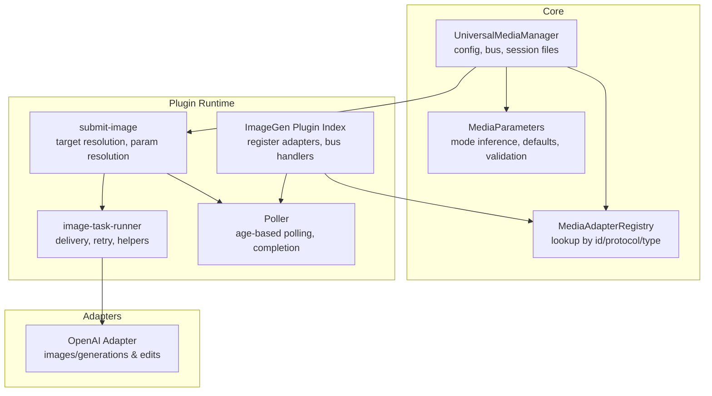
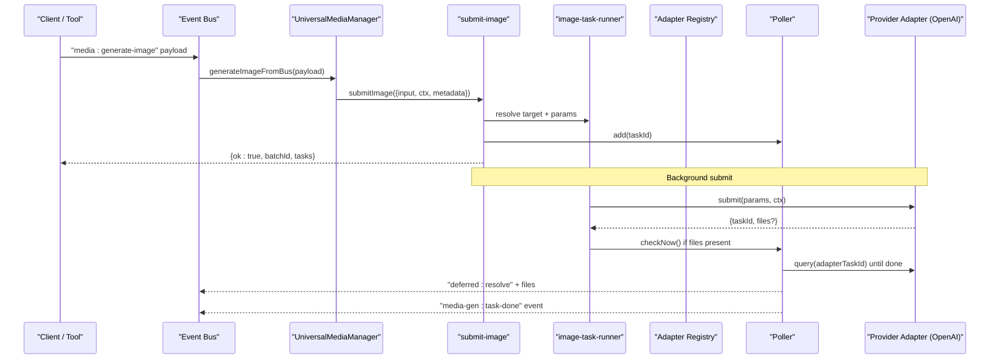
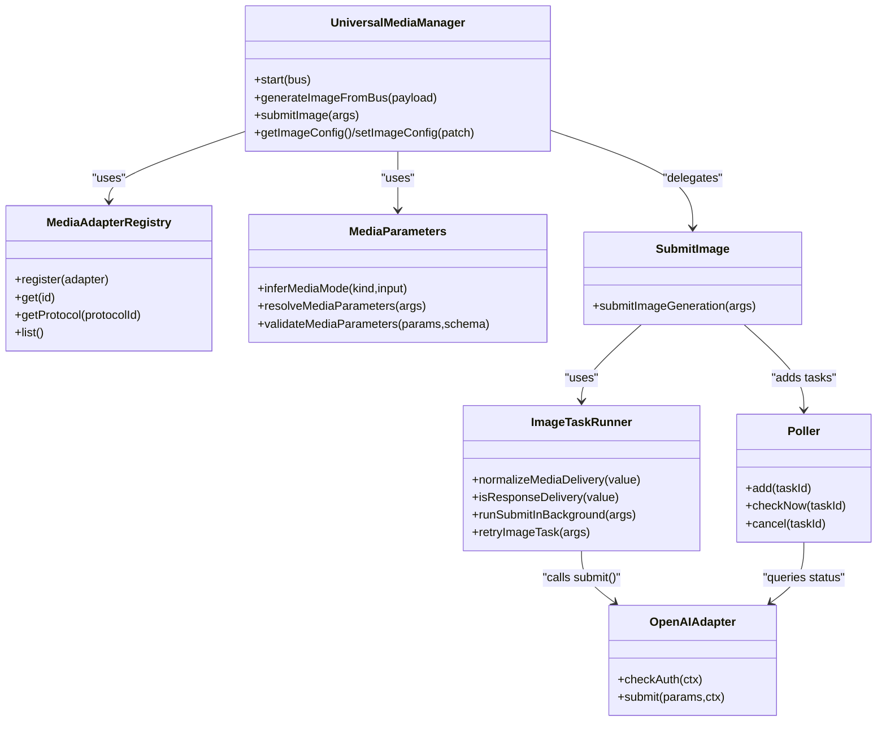

# Image Generation Overview

<cite>
**Referenced Files in This Document**
- [universal-media-manager.ts](file://core/media/universal-media-manager.ts)
- [media-parameters.ts](file://core/media/media-parameters.ts)
- [media-adapter-registry.ts](file://core/media-adapter-registry.ts)
- [submit-image.ts](file://plugins/image-gen/lib/submit-image.ts)
- [image-task-runner.ts](file://plugins/image-gen/lib/image-task-runner.ts)
- [poller.ts](file://plugins/image-gen/lib/poller.ts)
- [openai.ts](file://plugins/image-gen/adapters/openai.ts)
- [index.ts](file://plugins/image-gen/index.ts)
- [generate-image.ts](file://plugins/image-gen/tools/generate-image.ts)
</cite>

## Table of Contents
1. Introduction
2. Project Structure
3. Core Components
4. Architecture Overview
5. Detailed Component Analysis
6. Dependency Analysis
7. Performance Considerations
8. Troubleshooting Guide
9. Conclusion

## Introduction
This document explains the image generation system built around the UniversalMediaManager architecture. It covers the high-level design, adapter pattern for provider integration, task submission and polling workflow, supported capabilities (text-to-image, image-to-image, style transfer), configuration for default models and provider-specific settings, input/output formats, and delivery modes. Practical examples are provided to help you submit basic image generation requests and understand how results are delivered.

## Project Structure
The image generation capability is implemented as a plugin with a runtime that can be bound to the core media manager or run standalone. Key areas:
- Core orchestration and configuration: UniversalMediaManager and parameter resolution
- Plugin runtime: adapter registry, task store, poller, and bus handlers
- Provider adapters: concrete implementations like OpenAI
- Tools: non-blocking tool entry points for agents

**Diagram sources**
- [universal-media-manager.ts:244-332](file://core/media/universal-media-manager.ts#L244-L332)
- [media-adapter-registry.ts:8-78](file://core/media-adapter-registry.ts#L8-L78)
- [media-parameters.ts:31-42](file://core/media/media-parameters.ts#L31-L42)
- [index.ts:15-85](file://plugins/image-gen/index.ts#L15-L85)
- [submit-image.ts:25-138](file://plugins/image-gen/lib/submit-image.ts#L25-L138)
- [image-task-runner.ts:16-35](file://plugins/image-gen/lib/image-task-runner.ts#L16-L35)
- [poller.ts:37-78](file://plugins/image-gen/lib/poller.ts#L37-L78)
- [openai.ts:94-114](file://plugins/image-gen/adapters/openai.ts#L94-L114)

**Section sources**
- [universal-media-manager.ts:244-332](file://core/media/universal-media-manager.ts#L244-L332)
- [index.ts:15-85](file://plugins/image-gen/index.ts#L15-L85)

## Core Components
- UniversalMediaManager: Central orchestrator that binds to the bus, manages configuration, registers adapters, creates the task store and poller, and exposes generateImageFromBus and submitImage APIs.
- MediaAdapterRegistry: Generic registry for provider-side media adapters; supports lookup by id, aliases, protocolId, and type.
- MediaParameters: Infers mode (text2image vs image2image), merges provider/model/mode defaults, validates parameters against schemas, and enforces reference image limits.
- Plugin Runtime (index): Binds to native media runtime when available; otherwise initializes its own registry, store, poller, and bus handlers.
- Submit Pipeline (submit-image + image-task-runner): Resolves target provider/model, resolves parameters, persists tasks, registers deferred/task entries, and submits to adapters asynchronously.
- Poller: Age-based polling loop, fake-async detection, file registration into sessions, and result delivery via bus events and deferred results.
- Adapters (e.g., OpenAI): Implement submit (and optional query/checkAuth), translate normalized params to provider API calls, save images, and return taskId/files.

**Section sources**
- [universal-media-manager.ts:244-332](file://core/media/universal-media-manager.ts#L244-L332)
- [media-adapter-registry.ts:8-78](file://core/media-adapter-registry.ts#L8-L78)
- [media-parameters.ts:31-42](file://core/media/media-parameters.ts#L31-L42)
- [index.ts:15-85](file://plugins/image-gen/index.ts#L15-L85)
- [submit-image.ts:25-138](file://plugins/image-gen/lib/submit-image.ts#L25-L138)
- [image-task-runner.ts:16-35](file://plugins/image-gen/lib/image-task-runner.ts#L16-L35)
- [poller.ts:37-78](file://plugins/image-gen/lib/poller.ts#L37-L78)
- [openai.ts:94-114](file://plugins/image-gen/adapters/openai.ts#L94-L114)

## Architecture Overview
The system uses an adapter pattern to abstract multiple providers behind a uniform interface. The UniversalMediaManager coordinates configuration, adapter selection, parameter normalization, and lifecycle management. The plugin runtime provides bus handlers for external consumers and tools.

**Diagram sources**
- [universal-media-manager.ts:584-637](file://core/media/universal-media-manager.ts#L584-L637)
- [submit-image.ts:25-138](file://plugins/image-gen/lib/submit-image.ts#L25-L138)
- [image-task-runner.ts:367-390](file://plugins/image-gen/lib/image-task-runner.ts#L367-L390)
- [poller.ts:259-423](file://plugins/image-gen/lib/poller.ts#L259-L423)
- [openai.ts:116-254](file://plugins/image-gen/adapters/openai.ts#L116-L254)

## Detailed Component Analysis

### UniversalMediaManager
Responsibilities:
- Initialize data directories, legacy config migration, and config bridges for image/video.
- Register built-in adapters and expose runtime objects (registry, store, poller).
- Start/stop bus handlers and poller; provide generateImageFromBus and submitImage.
- Normalize inputs including session_file references and delivery modes.

Key behaviors:
- Input normalization: accepts prompt, count, image/referenceImages, ratio/resolution/quality, model/provider, suggestedFilename, delivery/deliveryMode.
- Delivery modes: response (synchronous) vs session (asynchronous).
- Configuration: defaultImageModel and per-providerDefaults; validated before persisting.

**Section sources**
- [universal-media-manager.ts:244-332](file://core/media/universal-media-manager.ts#L244-L332)
- [universal-media-manager.ts:379-442](file://core/media/universal-media-manager.ts#L379-L442)
- [universal-media-manager.ts:584-637](file://core/media/universal-media-manager.ts#L584-L637)

### MediaAdapterRegistry
Responsibilities:
- Register/unregister adapters by id and aliases.
- Map protocolId(s) to adapters for protocol-based routing.
- List and select adapters by type.

Usage:
- Used by UniversalMediaManager and plugin runtime to discover and invoke adapters.

**Section sources**
- [media-adapter-registry.ts:8-78](file://core/media-adapter-registry.ts#L8-L78)

### Parameter Resolution and Mode Inference
Responsibilities:
- Infer mode from input: text2image vs image2image based on presence of reference images.
- Merge defaults: mode defaults, provider/model/mode overrides, explicit parameters.
- Validate parameters against schema and enforce reference image limits.

Outputs:
- modeId, mode object, parameterSchema, inputLimits, resolvedParameters.

**Section sources**
- [media-parameters.ts:31-42](file://core/media/media-parameters.ts#L31-L42)
- [media-parameters.ts:187-219](file://core/media/media-parameters.ts#L187-L219)

### Submission Pipeline (submit-image + image-task-runner)
Responsibilities:
- Resolve target provider/model using explicit provider/model, configured default, first available provider, or legacy adapter fallback.
- Build normalized parameters and assert adapter constraints (e.g., reference image limits).
- Persist tasks, register deferred/task entries, and submit to adapter in background.
- Support retry of failed/cancelled tasks.

Delivery:
- normalizeMediaDelivery and isResponseDelivery control synchronous vs asynchronous flow.

**Section sources**
- [submit-image.ts:25-138](file://plugins/image-gen/lib/submit-image.ts#L25-L138)
- [image-task-runner.ts:16-35](file://plugins/image-gen/lib/image-task-runner.ts#L16-L35)
- [image-task-runner.ts:327-349](file://plugins/image-gen/lib/image-task-runner.ts#L327-L349)
- [image-task-runner.ts:367-390](file://plugins/image-gen/lib/image-task-runner.ts#L367-L390)
- [image-task-runner.ts:410-505](file://plugins/image-gen/lib/image-task-runner.ts#L410-L505)

### Poller
Responsibilities:
- Periodic tick with age-based intervals to reduce load.
- Fake-async detection: if files already exist, mark done immediately.
- Query adapters for async tasks; handle success/failure transitions.
- Register generated files into session storage and emit completion events.

Cancellation:
- Supports cancel via task handler; updates status and notifies deferred/task registries.

**Section sources**
- [poller.ts:37-78](file://plugins/image-gen/lib/poller.ts#L37-L78)
- [poller.ts:130-177](file://plugins/image-gen/lib/poller.ts#L130-L177)
- [poller.ts:259-423](file://plugins/image-gen/lib/poller.ts#L259-L423)

### OpenAI Adapter
Capabilities:
- Text-to-image via images/generations.
- Image-to-image via images/edits (supports HTTP(S) URLs, file_id, or local paths).
- Model-specific size/ratio handling (DALL·E 3 vs gpt-image-*).

Behavior:
- checkAuth to validate credentials.
- submit builds request body, calls API, saves base64 responses to disk, returns taskId and files.

**Section sources**
- [openai.ts:94-114](file://plugins/image-gen/adapters/openai.ts#L94-L114)
- [openai.ts:116-254](file://plugins/image-gen/adapters/openai.ts#L116-L254)

### Plugin Index (Runtime Bootstrap)
Responsibilities:
- Bind to native media runtime if available; otherwise initialize registry/store/poller.
- Register built-in adapters and bus handlers for adapter CRUD, listing, and image submission.
- Start poller and register media-generation task handler for cancellation.

**Section sources**
- [index.ts:15-85](file://plugins/image-gen/index.ts#L15-L85)
- [index.ts:87-151](file://plugins/image-gen/index.ts#L87-L151)

### Tool Entry Point
Responsibilities:
- Non-blocking tool that delegates to submitImageGeneration and returns structured details for UI/agent consumption.

**Section sources**
- [generate-image.ts:11-63](file://plugins/image-gen/tools/generate-image.ts#L11-L63)

## Dependency Analysis
High-level dependencies between components:

**Diagram sources**
- [universal-media-manager.ts:244-332](file://core/media/universal-media-manager.ts#L244-L332)
- [media-adapter-registry.ts:8-78](file://core/media-adapter-registry.ts#L8-L78)
- [media-parameters.ts:31-42](file://core/media/media-parameters.ts#L31-L42)
- [submit-image.ts:25-138](file://plugins/image-gen/lib/submit-image.ts#L25-L138)
- [image-task-runner.ts:16-35](file://plugins/image-gen/lib/image-task-runner.ts#L16-L35)
- [poller.ts:37-78](file://plugins/image-gen/lib/poller.ts#L37-L78)
- [openai.ts:94-114](file://plugins/image-gen/adapters/openai.ts#L94-L114)

**Section sources**
- [universal-media-manager.ts:244-332](file://core/media/universal-media-manager.ts#L244-L332)
- [media-adapter-registry.ts:8-78](file://core/media-adapter-registry.ts#L8-L78)
- [media-parameters.ts:31-42](file://core/media/media-parameters.ts#L31-L42)
- [submit-image.ts:25-138](file://plugins/image-gen/lib/submit-image.ts#L25-L138)
- [image-task-runner.ts:16-35](file://plugins/image-gen/lib/image-task-runner.ts#L16-L35)
- [poller.ts:37-78](file://plugins/image-gen/lib/poller.ts#L37-L78)
- [openai.ts:94-114](file://plugins/image-gen/adapters/openai.ts#L94-L114)

## Performance Considerations
- Age-based polling reduces network overhead by increasing intervals as tasks age.
- Fake-async optimization skips queries when adapters return files synchronously.
- Retry backoff is implicit via polling cadence; consecutive errors are counted and capped before marking failure.
- Batch submissions create multiple tasks under one batchId for efficient UI updates.

[No sources needed since this section provides general guidance]

## Troubleshooting Guide
Common issues and resolutions:
- Missing sessionPath for asynchronous delivery: ensure sessionPath is provided unless using response delivery.
- No provider or model configured: set defaultImageModel or pass provider/model explicitly; verify credentials.
- Reference image limit exceeded: check adapter.maxReferenceImages and adjust input accordingly.
- Task stuck in pending: confirm poller is running and adapter.query is reachable; review logs for repeated failures.
- Cancellation not taking effect: ensure task:register-handler is active and poller.cancel is invoked.

Operational hooks:
- Use media-gen:get-tasks and media-gen:get-task to inspect state.
- Use media-gen:update-task to favorite/unfavorite.
- Use media-gen:remove-task to delete artifacts and records.
- Use media-gen:remove-unfavorited to clean up.

**Section sources**
- [poller.ts:109-125](file://plugins/image-gen/lib/poller.ts#L109-L125)
- [poller.ts:259-423](file://plugins/image-gen/lib/poller.ts#L259-L423)
- [index.ts:109-148](file://plugins/image-gen/index.ts#L109-L148)

## Conclusion
The image generation system leverages a robust adapter pattern and a centralized UniversalMediaManager to unify multiple providers behind consistent APIs. It supports text-to-image and image-to-image workflows, with clear configuration for default models and provider-specific options. Asynchronous delivery through deferred results and task registries ensures reliable progress tracking and UI updates. With built-in retries, cancellation, and session file registration, the system balances performance and reliability across diverse providers.