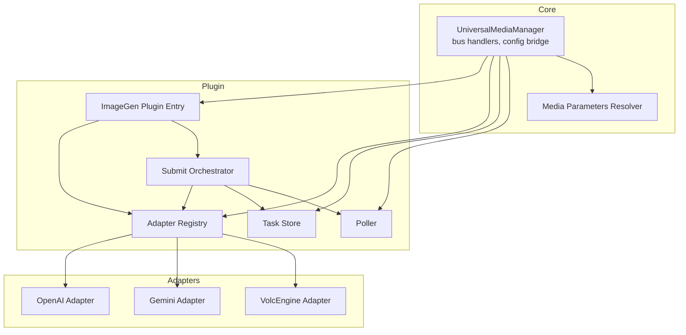
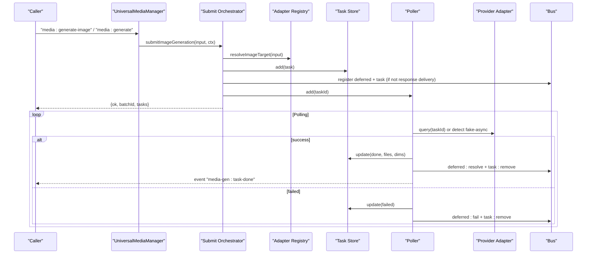
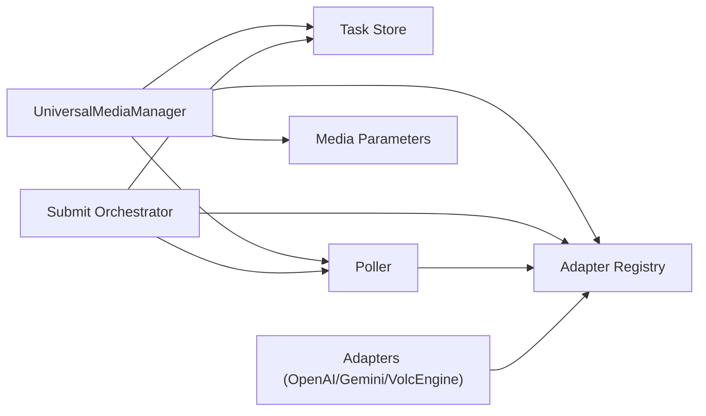

# Image Generation

<cite>
**Referenced Files in This Document**
- [universal-media-manager.ts](file://core/media/universal-media-manager.ts)
- [media-parameters.ts](file://core/media/media-parameters.ts)
- [index.ts](file://plugins/image-gen/index.ts)
- [openai.ts](file://plugins/image-gen/adapters/openai.ts)
- [gemini.ts](file://plugins/image-gen/adapters/gemini.ts)
- [volcengine.ts](file://plugins/image-gen/adapters/volcengine.ts)
- [submit-image.ts](file://plugins/image-gen/lib/submit-image.ts)
- [poller.ts](file://plugins/image-gen/lib/poller.ts)
- [task-store.ts](file://plugins/image-gen/lib/task-store.ts)
- [adapter-registry.ts](file://plugins/image-gen/lib/adapter-registry.ts)
- [common.ts](file://plugins/image-gen/adapters/common.ts)
</cite>

## Table of Contents
1. Introduction
2. Project Structure
3. Core Components
4. Architecture Overview
5. Detailed Component Analysis
6. Dependency Analysis
7. Performance Considerations
8. Troubleshooting Guide
9. Conclusion

## Introduction
This document explains the image generation capabilities with a focus on text-to-image and image-to-image workflows. It covers the UniversalMediaManager’s end-to-end workflow, the adapter system for multiple providers (OpenAI, Gemini, VolcEngine, and others), task submission and polling, result delivery patterns, configuration, batch processing, error handling, and supported formats and resolutions.

## Project Structure
The image generation feature is implemented as a plugin with a unified runtime exposed by the core media layer:
- Core orchestration and bus integration live in the core media manager.
- The plugin provides adapters for specific providers and shared utilities for persistence and polling.
- Parameter resolution and validation are centralized to ensure consistent behavior across providers.

**Diagram sources**
- [universal-media-manager.ts:244-332](file://core/media/universal-media-manager.ts#L244-L332)
- [index.ts:15-169](file://plugins/image-gen/index.ts#L15-L169)
- [submit-image.ts:25-139](file://plugins/image-gen/lib/submit-image.ts#L25-L139)
- [poller.ts:37-177](file://plugins/image-gen/lib/poller.ts#L37-L177)
- [task-store.ts:51-114](file://plugins/image-gen/lib/task-store.ts#L51-L114)
- [adapter-registry.ts:1-2](file://plugins/image-gen/lib/adapter-registry.ts#L1-L2)
- [openai.ts:94-257](file://plugins/image-gen/adapters/openai.ts#L94-L257)
- [gemini.ts:129-207](file://plugins/image-gen/adapters/gemini.ts#L129-L207)
- [volcengine.ts:118-252](file://plugins/image-gen/adapters/volcengine.ts#L118-L252)

**Section sources**
- [universal-media-manager.ts:244-332](file://core/media/universal-media-manager.ts#L244-L332)
- [index.ts:15-169](file://plugins/image-gen/index.ts#L15-L169)

## Core Components
- UniversalMediaManager: Central orchestrator that registers built-in adapters, exposes bus handlers for generation, manages configuration bridges, and integrates with the poller and task store.
- Media Parameters Resolver: Normalizes inputs, infers mode (text-to-image vs image-to-image), merges provider/model defaults, validates parameters against schemas, and enforces reference image limits.
- Submit Orchestrator: Validates session/delivery context, resolves target adapter, builds final parameters, persists tasks, registers deferred results/tasks, and triggers background submission.
- Poller: Periodically checks pending tasks, supports “fake-async” completion when files are already present, routes queries through the adapter registry, handles retries and failures, and emits completion events.
- Task Store: In-memory store with debounced disk persistence; supports listing, filtering, favoriting, and cleanup.
- Adapters: Provider-specific implementations for OpenAI, Gemini, and VolcEngine, each handling credentials, model selection, parameter translation, HTTP calls, and file saving.

**Section sources**
- [universal-media-manager.ts:244-332](file://core/media/universal-media-manager.ts#L244-L332)
- [media-parameters.ts:31-219](file://core/media/media-parameters.ts#L31-L219)
- [submit-image.ts:25-139](file://plugins/image-gen/lib/submit-image.ts#L25-L139)
- [poller.ts:37-177](file://plugins/image-gen/lib/poller.ts#L37-L177)
- [task-store.ts:51-114](file://plugins/image-gen/lib/task-store.ts#L51-L114)
- [openai.ts:94-257](file://plugins/image-gen/adapters/openai.ts#L94-L257)
- [gemini.ts:129-207](file://plugins/image-gen/adapters/gemini.ts#L129-L207)
- [volcengine.ts:118-252](file://plugins/image-gen/adapters/volcengine.ts#L118-L252)

## Architecture Overview
The image generation pipeline follows a clear separation of concerns:
- Input normalization and parameter resolution occur before submission.
- Submission creates persistent tasks and optionally registers them with deferred result and task registries.
- Background polling drives async progress and completion.
- Results are saved locally and delivered via session files or response payloads depending on delivery mode.

**Diagram sources**
- [universal-media-manager.ts:484-544](file://core/media/universal-media-manager.ts#L484-L544)
- [submit-image.ts:25-139](file://plugins/image-gen/lib/submit-image.ts#L25-L139)
- [poller.ts:259-423](file://plugins/image-gen/lib/poller.ts#L259-L423)
- [task-store.ts:77-114](file://plugins/image-gen/lib/task-store.ts#L77-L114)

## Detailed Component Analysis

### UniversalMediaManager
Responsibilities:
- Registers built-in adapters at startup.
- Exposes bus handlers for media generation, adapter management, and task CRUD.
- Bridges configuration for default models and per-provider defaults.
- Initializes and controls the poller and task store.

Key behaviors:
- normalizeImageInput resolves session_file references into local paths for reference images.
- generateImageFromBus normalizes input, validates prompt presence, and delegates to submitImage.
- start(bus) constructs the poller and registers bus handlers; stop cleans up resources.

Configuration:
- Default image model and per-provider defaults are normalized and validated.
- Legacy configuration migration is supported.

**Section sources**
- [universal-media-manager.ts:244-332](file://core/media/universal-media-manager.ts#L244-L332)
- [universal-media-manager.ts:484-544](file://core/media/universal-media-manager.ts#L484-L544)
- [universal-media-manager.ts:584-637](file://core/media/universal-media-manager.ts#L584-L637)
- [universal-media-manager.ts:379-442](file://core/media/universal-media-manager.ts#L379-L442)

### Media Parameters Resolution
Responsibilities:
- Infers mode based on input (text-to-image vs image-to-image).
- Merges defaults from provider/model/mode layers and explicit user parameters.
- Validates types, enums, ranges, and reference image limits.
- Applies precedence rules for size/resolution fields.

Highlights:
- inferMediaMode selects mode using reference image count.
- validateReferenceImageLimits enforces min/max constraints per model/mode.
- applyExplicitImageSizePrecedence ensures only one of resolution/size/resolution_type is active.

**Section sources**
- [media-parameters.ts:31-42](file://core/media/media-parameters.ts#L31-L42)
- [media-parameters.ts:165-185](file://core/media/media-parameters.ts#L165-L185)
- [media-parameters.ts:150-163](file://core/media/media-parameters.ts#L150-L163)
- [media-parameters.ts:187-219](file://core/media/media-parameters.ts#L187-L219)

### Submit Orchestrator
Responsibilities:
- Ensures required context (sessionPath or response delivery).
- Resolves target adapter and protocol metadata.
- Builds final parameters using the resolver and input builders.
- Persists tasks, registers deferred results and task entries, and triggers background submission.

Batching:
- Supports generating multiple images per request by looping submissions under a single batchId.

Delivery modes:
- Response delivery returns files immediately without deferred registration.
- Session delivery registers deferred results and tasks for later retrieval.

**Section sources**
- [submit-image.ts:25-139](file://plugins/image-gen/lib/submit-image.ts#L25-L139)

### Poller
Responsibilities:
- Runs every fixed interval and decides whether to check a task based on age.
- Detects “fake-async” tasks where files were populated synchronously during submit.
- Routes real async tasks to adapter.query via the registry.
- Handles retries with exponential backoff-like cadence and caps consecutive errors.
- Emits completion events and updates stores accordingly.

Cancellation:
- Integrates with task cancellation fences and aborts deferred results.

**Section sources**
- [poller.ts:31-35](file://plugins/image-gen/lib/poller.ts#L31-L35)
- [poller.ts:130-177](file://plugins/image-gen/lib/poller.ts#L130-L177)
- [poller.ts:259-423](file://plugins/image-gen/lib/poller.ts#L259-L423)

### Task Store
Responsibilities:
- Maintains an in-memory map of tasks with debounced JSON persistence.
- Provides list/get/update/remove operations and filters by adapter/batch/status.
- Normalizes legacy fields and enriches tasks with provider/model/protocol info.

Persistence:
- Atomic write via temp file rename to avoid corruption.

**Section sources**
- [task-store.ts:51-114](file://plugins/image-gen/lib/task-store.ts#L51-L114)
- [task-store.ts:261-303](file://plugins/image-gen/lib/task-store.ts#L261-L303)

### Adapters

#### OpenAI Adapter
Capabilities:
- Ratios and resolution tiers vary by model family (standard vs flexible).
- DALL·E 3 uses fixed sizes mapped from ratio; other models support size/ratio combinations.

Workflow:
- Resolves credentials and model id (catalog-aware for short names).
- Translates parameters into API body; supports edits endpoint for image-to-image using either JSON references or multipart uploads.
- Saves base64 responses to disk and returns taskId plus filenames.

Error handling:
- Throws descriptive errors for unsupported ratios/sizes and missing credentials.

**Section sources**
- [openai.ts:94-257](file://plugins/image-gen/adapters/openai.ts#L94-L257)

#### Gemini Adapter
Capabilities:
- Model families define supported aspect ratios and optional image sizes.
- Reference images can be provided as data URLs, HTTP(S) URLs, or file URIs.

Workflow:
- Resolves credentials and model id; normalizes image inputs and image config.
- Calls generateContent with inline image parts and returns saved files.

Error handling:
- Enforces max reference image counts and unsupported size/ratio errors.

**Section sources**
- [gemini.ts:129-207](file://plugins/image-gen/adapters/gemini.ts#L129-L207)

#### VolcEngine Adapter
Capabilities:
- Seedream models support specific ratios and resolution tiers; some variants support output format, guidance scale, seed, and reference images.

Workflow:
- Resolves credentials (primary or coding lane), model id, and provider defaults.
- Computes pixel size from tier and ratio; converts local reference images to data URLs.
- Calls images/generations and saves base64 responses.

Error handling:
- Validates supported formats and throws if reference images are unsupported by the selected model.

**Section sources**
- [volcengine.ts:118-252](file://plugins/image-gen/adapters/volcengine.ts#L118-L252)

### Adapter Registration System
- Built-in adapters are registered automatically by the UniversalMediaManager.
- External plugins can register/unregister adapters via bus handlers.
- The registry maps adapter ids and protocol ids to implementations used by the poller and submitter.

Custom adapter development:
- Implement the adapter contract with id, protocolId, name, types, capabilities, checkAuth, submit, and optionally query.
- Use common helpers for base URL normalization, image normalization, and saving base64 images.
- Register via bus handler or directly through the registry.

**Section sources**
- [universal-media-manager.ts:319-332](file://core/media/universal-media-manager.ts#L319-L332)
- [index.ts:62-85](file://plugins/image-gen/index.ts#L62-L85)
- [adapter-registry.ts:1-2](file://plugins/image-gen/lib/adapter-registry.ts#L1-L2)
- [common.ts:5-63](file://plugins/image-gen/adapters/common.ts#L5-L63)

### Practical Examples

- Text-to-image generation:
  - Provide a prompt and optional model/provider. The system infers text-to-image mode and submits a task.
  - Delivery can be response-based (immediate files) or session-based (deferred result).

- Image-to-image style transfer:
  - Include referenceImages or image pointing to session_file references or local paths.
  - The resolver infers image-to-image mode and enforces per-model reference image limits.

- Provider-specific parameters:
  - OpenAI: size/ratio, quality, background, moderation, output compression.
  - Gemini: aspectRatio, imageSize/resolution, inline image parts.
  - VolcEngine: size/tier, ratio, output_format, watermark, guidance_scale, seed.

- Batch processing:
  - Set count to generate multiple images under a single batchId.

- Configuration:
  - Configure defaultImageModel and providerDefaults via the config bridge.
  - Per-provider defaults are merged with model/mode defaults and explicit parameters.

[No sources needed since this section provides usage examples without analyzing specific files]

## Dependency Analysis
High-level dependencies between components:

**Diagram sources**
- [universal-media-manager.ts:244-332](file://core/media/universal-media-manager.ts#L244-L332)
- [submit-image.ts:25-139](file://plugins/image-gen/lib/submit-image.ts#L25-L139)
- [poller.ts:37-177](file://plugins/image-gen/lib/poller.ts#L37-L177)
- [adapter-registry.ts:1-2](file://plugins/image-gen/lib/adapter-registry.ts#L1-L2)

**Section sources**
- [universal-media-manager.ts:244-332](file://core/media/universal-media-manager.ts#L244-L332)
- [submit-image.ts:25-139](file://plugins/image-gen/lib/submit-image.ts#L25-L139)
- [poller.ts:37-177](file://plugins/image-gen/lib/poller.ts#L37-L177)

## Performance Considerations
- Polling cadence adapts to task age: frequent checks early, then less frequently over time.
- Fake-async detection avoids unnecessary adapter queries when files are already present.
- Debounced persistence reduces disk I/O while keeping memory authoritative.
- Batch submissions share a batchId and reduce overhead for UI updates.

[No sources needed since this section provides general guidance]

## Troubleshooting Guide
Common issues and strategies:
- Missing credentials: adapters throw explicit errors when apiKey is not configured. Ensure provider credentials are set.
- Unsupported parameters: parameter validation will reject invalid types, enums, or out-of-range values. Check model capabilities and provider defaults.
- Reference image limits: exceeding per-model limits raises errors; adjust input or choose a compatible model.
- No adapter found: verify adapter registration and protocol mapping; use list-adapters to inspect available adapters.
- Task stuck in pending: poller may retry transient errors; check logs for repeated failures and consider canceling and resubmitting.
- File delivery not visible: confirm sessionPath and delivery mode; for session delivery, ensure deferred results are resolved and session files are registered.

**Section sources**
- [openai.ts:104-114](file://plugins/image-gen/adapters/openai.ts#L104-L114)
- [gemini.ts:139-146](file://plugins/image-gen/adapters/gemini.ts#L139-L146)
- [volcengine.ts:129-139](file://plugins/image-gen/adapters/volcengine.ts#L129-L139)
- [media-parameters.ts:165-185](file://core/media/media-parameters.ts#L165-L185)
- [poller.ts:354-372](file://plugins/image-gen/lib/poller.ts#L354-L372)

## Conclusion
The image generation system provides a robust, extensible framework for text-to-image and image-to-image workflows across multiple providers. Centralized parameter resolution, reliable task persistence, adaptive polling, and clear delivery patterns enable consistent experiences. The adapter registration system allows easy extension with new providers while maintaining strong validation and error handling.