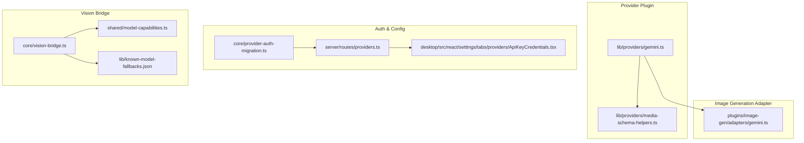
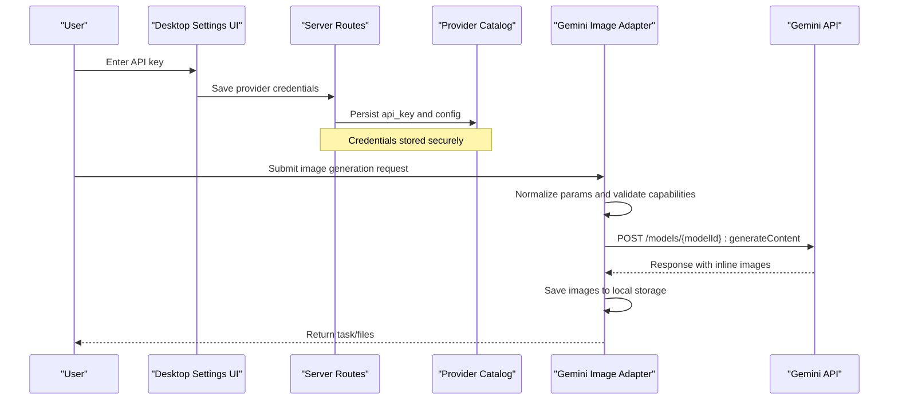
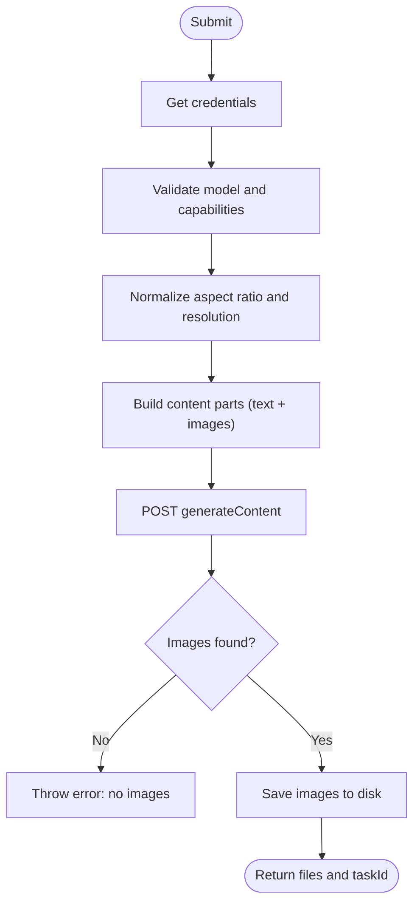
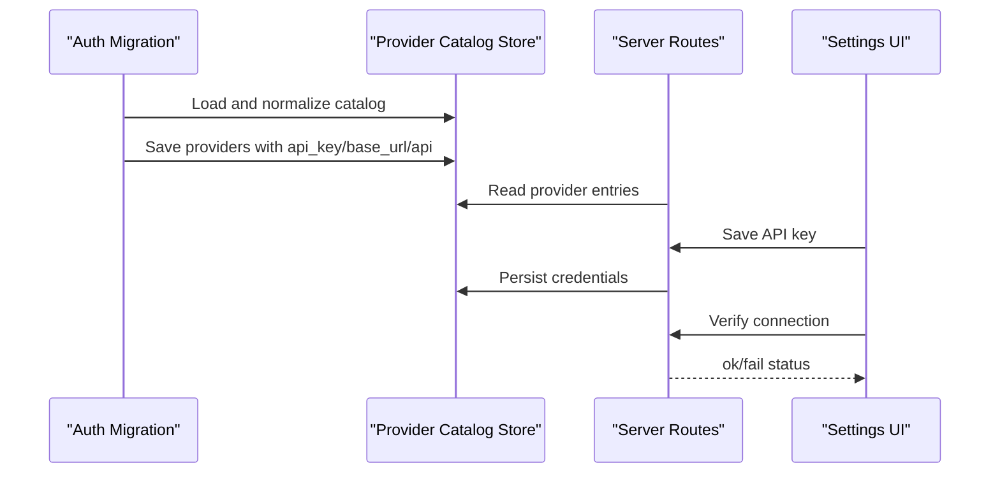
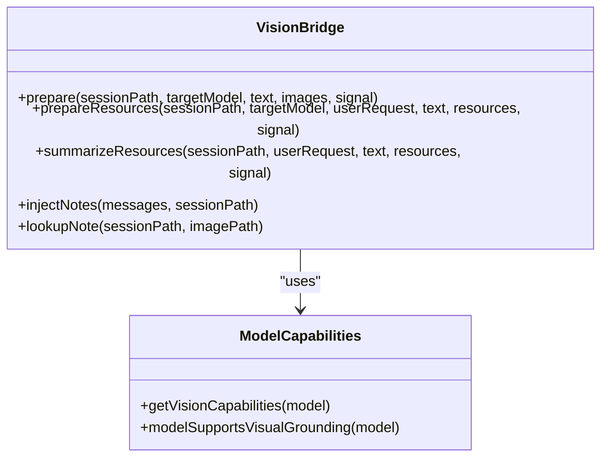
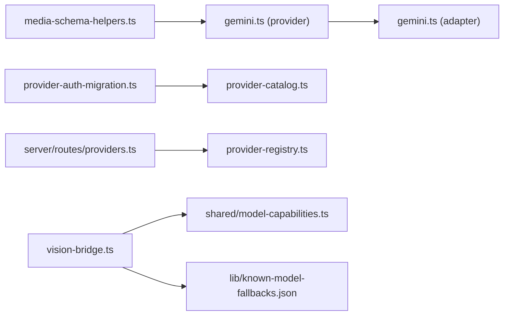

# Gemini Provider

<cite>
**Referenced Files in This Document**
- [lib/providers/gemini.ts](file://lib/providers/gemini.ts)
- [plugins/image-gen/adapters/gemini.ts](file://plugins/image-gen/adapters/gemini.ts)
- [lib/providers/media-schema-helpers.ts](file://lib/providers/media-schema-helpers.ts)
- [core/provider-auth-migration.ts](file://core/provider-auth-migration.ts)
- [server/routes/providers.ts](file://server/routes/providers.ts)
- [desktop/src/react/settings/tabs/providers/ApiKeyCredentials.tsx](file://desktop/src/react/settings/tabs/providers/ApiKeyCredentials.tsx)
- [core/vision-bridge.ts](file://core/vision-bridge.ts)
- [shared/model-capabilities.ts](file://shared/model-capabilities.ts)
- [lib/known-model-fallbacks.json](file://lib/known-model-fallbacks.json)
</cite>

## Table of Contents
1. Introduction
2. Project Structure
3. Core Components
4. Architecture Overview
5. Detailed Component Analysis
6. Dependency Analysis
7. Performance Considerations
8. Troubleshooting Guide
9. Conclusion

## Introduction
This document explains the Google Gemini provider integration for image generation and multimodal vision within the project. It covers:
- Available Gemini models for image generation, their supported aspect ratios, resolutions, and reference image limits
- Authentication setup using API keys via the provider catalog and UI flows
- Image generation parameters (aspect ratio, resolution), input formats (text + images), and output handling
- Multimodal vision capabilities through an auxiliary vision bridge that prepares structured notes for text-only targets
- Regional availability and performance considerations based on implementation details

## Project Structure
The Gemini integration spans several layers:
- Provider plugin declares Gemini’s identity, default base URL, and image generation model metadata
- Adapter implements the actual HTTP call to Gemini’s generateContent endpoint with normalized parameters
- Media schema helpers define enums and parameter schemas used by the provider plugin
- Provider auth migration ensures legacy API keys are migrated into the new provider catalog
- Server routes expose endpoints to manage provider credentials
- Desktop settings UI provides a user-facing flow to enter and verify API keys
- Vision bridge orchestrates auxiliary vision analysis when the target model cannot accept images directly

**Diagram sources**
- [lib/providers/gemini.ts:1-69](file://lib/providers/gemini.ts#L1-L69)
- [lib/providers/media-schema-helpers.ts:1-144](file://lib/providers/media-schema-helpers.ts#L1-L144)
- [plugins/image-gen/adapters/gemini.ts:1-207](file://plugins/image-gen/adapters/gemini.ts#L1-L207)
- [core/provider-auth-migration.ts:1-208](file://core/provider-auth-migration.ts#L1-L208)
- [server/routes/providers.ts:178-217](file://server/routes/providers.ts#L178-L217)
- [desktop/src/react/settings/tabs/providers/ApiKeyCredentials.tsx:194-227](file://desktop/src/react/settings/tabs/providers/ApiKeyCredentials.tsx#L194-L227)
- [core/vision-bridge.ts:1-760](file://core/vision-bridge.ts#L1-L760)
- [shared/model-capabilities.ts:616-651](file://shared/model-capabilities.ts#L616-L651)
- [lib/known-model-fallbacks.json:2151-2206](file://lib/known-model-fallbacks.json#L2151-L2206)

**Section sources**
- [lib/providers/gemini.ts:1-69](file://lib/providers/gemini.ts#L1-L69)
- [lib/providers/media-schema-helpers.ts:1-144](file://lib/providers/media-schema-helpers.ts#L1-L144)
- [plugins/image-gen/adapters/gemini.ts:1-207](file://plugins/image-gen/adapters/gemini.ts#L1-L207)
- [core/provider-auth-migration.ts:1-208](file://core/provider-auth-migration.ts#L1-L208)
- [server/routes/providers.ts:178-217](file://server/routes/providers.ts#L178-L217)
- [desktop/src/react/settings/tabs/providers/ApiKeyCredentials.tsx:194-227](file://desktop/src/react/settings/tabs/providers/ApiKeyCredentials.tsx#L194-L227)
- [core/vision-bridge.ts:1-760](file://core/vision-bridge.ts#L1-L760)
- [shared/model-capabilities.ts:616-651](file://shared/model-capabilities.ts#L616-L651)
- [lib/known-model-fallbacks.json:2151-2206](file://lib/known-model-fallbacks.json#L2151-L2206)

## Core Components
- Provider plugin (Gemini): Declares provider identity, authentication type, default base URL, and image generation models with supported modes and parameters.
- Image adapter (Gemini): Normalizes inputs, validates parameters against model capabilities, constructs the request body, calls the Gemini API, and persists generated images.
- Media schema helpers: Provides shared enums for supported aspect ratios and helper functions to build parameter schemas and mode definitions.
- Auth migration: Migrates legacy API keys from older locations into the provider catalog to ensure continuity.
- Server routes: Expose endpoints to list providers and read/write API keys securely.
- Desktop settings UI: Allows users to input and verify API keys with immediate feedback.
- Vision bridge: Prepares structured vision notes for text-only target models by analyzing images with an auxiliary vision model.

Key responsibilities and behaviors:
- Model capability detection per model family (e.g., 3.1-flash vs 3-pro vs 2.5-flash) determines allowed ratios, resolutions, and reference image limits.
- Parameter normalization enforces valid values and throws clear errors for unsupported combinations.
- Input images can be data URIs, remote URLs, or file paths; they are converted into inline parts for the API.
- Output images are extracted from the response and saved locally with optional naming conventions.

**Section sources**
- [lib/providers/gemini.ts:1-69](file://lib/providers/gemini.ts#L1-L69)
- [plugins/image-gen/adapters/gemini.ts:1-207](file://plugins/image-gen/adapters/gemini.ts#L1-L207)
- [lib/providers/media-schema-helpers.ts:1-144](file://lib/providers/media-schema-helpers.ts#L1-L144)
- [core/provider-auth-migration.ts:1-208](file://core/provider-auth-migration.ts#L1-L208)
- [server/routes/providers.ts:178-217](file://server/routes/providers.ts#L178-L217)
- [desktop/src/react/settings/tabs/providers/ApiKeyCredentials.tsx:194-227](file://desktop/src/react/settings/tabs/providers/ApiKeyCredentials.tsx#L194-L227)
- [core/vision-bridge.ts:1-760](file://core/vision-bridge.ts#L1-L760)

## Architecture Overview
The Gemini provider integrates at multiple levels:
- Configuration layer defines models and capabilities
- Runtime layer normalizes and validates parameters
- Network layer calls Gemini’s generateContent endpoint
- Vision layer augments text-only targets with structured image insights

**Diagram sources**
- [desktop/src/react/settings/tabs/providers/ApiKeyCredentials.tsx:194-227](file://desktop/src/react/settings/tabs/providers/ApiKeyCredentials.tsx#L194-L227)
- [server/routes/providers.ts:178-217](file://server/routes/providers.ts#L178-L217)
- [core/provider-auth-migration.ts:1-208](file://core/provider-auth-migration.ts#L1-L208)
- [plugins/image-gen/adapters/gemini.ts:148-207](file://plugins/image-gen/adapters/gemini.ts#L148-L207)

## Detailed Component Analysis

### Provider Plugin: Gemini
- Identity and defaults:
  - Provider ID: gemini
  - Display name: Google Gemini
  - Authentication type: api-key
  - Default base URL: https://generativelanguage.googleapis.com/v1beta
  - Default API: google-generative-ai
- Image generation models:
  - gemini-2.5-flash-image
    - Aliases: nano-banana
    - Supported ratios: standard set including 1:1, 3:2, 2:3, 3:4, 4:3, 4:5, 5:4, 9:16, 16:9, 21:9
    - Resolutions: none
    - Reference images max: 3
  - gemini-3.1-flash-image-preview
    - Aliases: nano-banana-2
    - Supported ratios: extended set including 1:4, 1:8, 4:1, 8:1 plus common ones
    - Resolutions: 512, 1K, 2K, 4K
    - Reference images max: 14
  - gemini-3-pro-image-preview
    - Aliases: nano-banana-pro
    - Supported ratios: standard set similar to 2.5-flash
    - Resolutions: 1K, 2K, 4K
    - Reference images max: 14
- Modes:
  - text2image: no reference images
  - image2image: supports reference images up to model-specific maximum

**Section sources**
- [lib/providers/gemini.ts:1-69](file://lib/providers/gemini.ts#L1-L69)
- [lib/providers/media-schema-helpers.ts:29-70](file://lib/providers/media-schema-helpers.ts#L29-L70)

### Image Generation Adapter: Gemini
- Capabilities detection:
  - Determines supported ratios, image sizes, default size, and max reference images based on model ID substring matching
- Parameter normalization:
  - Aspect ratio validation against model-specific sets
  - Resolution/size normalization with canonical mapping (e.g., 0.5K -> 512)
  - Conflict detection between size and resolution fields
- Input handling:
  - Accepts data URIs, remote URLs, or file paths
  - Converts remote images to inline base64 parts
  - Enforces maximum reference images per model
- Request construction:
  - Builds contents array with text and image parts
  - Sets responseModalities to TEXT and IMAGE
  - Adds responseFormat.image with normalized aspectRatio and imageSize when applicable
- Authentication:
  - Retrieves API key from provider credentials context
  - Sends x-goog-api-key header
- Response processing:
  - Extracts inline images from candidates
  - Saves images to local directory with optional filename patterns
  - Returns files and a local task ID

**Diagram sources**
- [plugins/image-gen/adapters/gemini.ts:42-106](file://plugins/image-gen/adapters/gemini.ts#L42-L106)
- [plugins/image-gen/adapters/gemini.ts:148-207](file://plugins/image-gen/adapters/gemini.ts#L148-L207)

**Section sources**
- [plugins/image-gen/adapters/gemini.ts:1-207](file://plugins/image-gen/adapters/gemini.ts#L1-L207)

### Authentication and Credential Management
- Legacy migration:
  - Migrates API keys from legacy locations into the provider catalog without overwriting existing values
  - Preserves base_url and api fields if present
  - Filters invalid model IDs and seeds defaults when needed
- Server routes:
  - Lists API-key providers and indicates missing fields
  - Provides a protected endpoint to read plaintext API keys with appropriate scopes
- Desktop settings UI:
  - Inputs API key, saves configuration, and verifies connectivity with success/failure feedback

**Diagram sources**
- [core/provider-auth-migration.ts:127-208](file://core/provider-auth-migration.ts#L127-L208)
- [server/routes/providers.ts:178-217](file://server/routes/providers.ts#L178-L217)
- [desktop/src/react/settings/tabs/providers/ApiKeyCredentials.tsx:194-227](file://desktop/src/react/settings/tabs/providers/ApiKeyCredentials.tsx#L194-L227)

**Section sources**
- [core/provider-auth-migration.ts:1-208](file://core/provider-auth-migration.ts#L1-L208)
- [server/routes/providers.ts:178-217](file://server/routes/providers.ts#L178-L217)
- [desktop/src/react/settings/tabs/providers/ApiKeyCredentials.tsx:194-227](file://desktop/src/react/settings/tabs/providers/ApiKeyCredentials.tsx#L194-L227)

### Multimodal Vision and Auxiliary Analysis
- Vision bridge:
  - Detects when a target model requires auxiliary vision (text-only model receiving images)
  - Analyzes images using an auxiliary vision model configured separately
  - Produces structured notes with sections like image_overview, visible_text, objects_and_layout, charts_or_data, user_request, user_request_answer, evidence, uncertainty
  - Supports visual primitives (boxes/points) with configurable coordinate systems and box orders
  - Caches analyses keyed by image content, user request, and model signature
  - Persists session-sidecar notes for reuse across runs
- Model capabilities:
  - Normalizes visionCapabilities including grounding, boxes, points, coordinateSpace, boxOrder, outputFormat, groundingMode
  - Known model fallbacks include visionCapabilities for certain Gemini models

**Diagram sources**
- [core/vision-bridge.ts:376-760](file://core/vision-bridge.ts#L376-L760)
- [shared/model-capabilities.ts:616-651](file://shared/model-capabilities.ts#L616-L651)
- [lib/known-model-fallbacks.json:2151-2206](file://lib/known-model-fallbacks.json#L2151-L2206)

**Section sources**
- [core/vision-bridge.ts:1-760](file://core/vision-bridge.ts#L1-L760)
- [shared/model-capabilities.ts:616-651](file://shared/model-capabilities.ts#L616-L651)
- [lib/known-model-fallbacks.json:2151-2206](file://lib/known-model-fallbacks.json#L2151-L2206)

## Dependency Analysis
- Provider plugin depends on media schema helpers for enums and parameter builders
- Adapter depends on provider credentials context and uses normalized parameters to construct requests
- Auth migration depends on provider registry and catalog store to reconcile legacy configurations
- Server routes depend on provider registry to enumerate providers and protect secret reads
- Vision bridge depends on model capabilities and known model fallbacks to tailor prompts and outputs

**Diagram sources**
- [lib/providers/media-schema-helpers.ts:1-144](file://lib/providers/media-schema-helpers.ts#L1-L144)
- [lib/providers/gemini.ts:1-69](file://lib/providers/gemini.ts#L1-L69)
- [plugins/image-gen/adapters/gemini.ts:1-207](file://plugins/image-gen/adapters/gemini.ts#L1-L207)
- [core/provider-auth-migration.ts:1-208](file://core/provider-auth-migration.ts#L1-L208)
- [core/provider-catalog.ts:1-235](file://core/provider-catalog.ts#L1-L235)
- [server/routes/providers.ts:178-217](file://server/routes/providers.ts#L178-L217)
- [core/vision-bridge.ts:1-760](file://core/vision-bridge.ts#L1-L760)
- [shared/model-capabilities.ts:616-651](file://shared/model-capabilities.ts#L616-L651)
- [lib/known-model-fallbacks.json:2151-2206](file://lib/known-model-fallbacks.json#L2151-L2206)

**Section sources**
- [lib/providers/media-schema-helpers.ts:1-144](file://lib/providers/media-schema-helpers.ts#L1-L144)
- [lib/providers/gemini.ts:1-69](file://lib/providers/gemini.ts#L1-L69)
- [plugins/image-gen/adapters/gemini.ts:1-207](file://plugins/image-gen/adapters/gemini.ts#L1-L207)
- [core/provider-auth-migration.ts:1-208](file://core/provider-auth-migration.ts#L1-L208)
- [core/provider-catalog.ts:1-235](file://core/provider-catalog.ts#L1-L235)
- [server/routes/providers.ts:178-217](file://server/routes/providers.ts#L178-L217)
- [core/vision-bridge.ts:1-760](file://core/vision-bridge.ts#L1-L760)
- [shared/model-capabilities.ts:616-651](file://shared/model-capabilities.ts#L616-L651)
- [lib/known-model-fallbacks.json:2151-2206](file://lib/known-model-fallbacks.json#L2151-L2206)

## Performance Considerations
- Image size selection:
  - Larger resolutions (e.g., 4K) increase network payload and server processing time
  - Prefer smaller sizes (e.g., 512 or 1K) for rapid iteration and lower latency
- Reference image limits:
  - Models support different maximums (e.g., 3 vs 14); exceeding these causes immediate errors
  - Batch fewer references to reduce request size and improve reliability
- Auxiliary vision caching:
  - The vision bridge caches analyses keyed by image content and prompt; repeated requests reuse results
  - Cache size is bounded; least recently used entries are trimmed automatically
- Rate limiting and retries:
  - While not specific to Gemini in this codebase, general rate-limiting utilities exist for other services; consider implementing client-side backoff for high-volume usage
- Regional availability:
  - The adapter uses the default base URL for Gemini; regional routing is managed by Google Cloud infrastructure
  - If you need custom endpoints, configure baseUrl in the provider catalog; ensure your account has access to the selected region

[No sources needed since this section provides general guidance]

## Troubleshooting Guide
Common issues and resolutions:
- Missing API key:
  - Ensure the provider credential exists and contains an api_key; use the settings UI to save and verify
  - Check server logs for “providerNoApiKey” messages indicating missing credentials
- Unsupported aspect ratio or resolution:
  - The adapter validates parameters against model capabilities; adjust to supported values
  - For 2.5-flash models, resolution is not supported; omit resolution or switch to 3.x models
- Size conflicts:
  - Do not specify both size and resolution with conflicting values; choose one
- No images returned:
  - The adapter expects inline images in the response; verify model selection and request format
- Vision auxiliary disabled:
  - When using text-only target models, auxiliary vision must be enabled and configured; otherwise, image analysis will fail and a notice will be injected into the conversation

**Section sources**
- [plugins/image-gen/adapters/gemini.ts:71-106](file://plugins/image-gen/adapters/gemini.ts#L71-L106)
- [plugins/image-gen/adapters/gemini.ts:148-207](file://plugins/image-gen/adapters/gemini.ts#L148-L207)
- [core/vision-bridge.ts:403-442](file://core/vision-bridge.ts#L403-L442)

## Conclusion
The Gemini provider integration offers robust image generation and multimodal vision capabilities:
- Clear model declarations with validated parameters and flexible input formats
- Secure credential management via provider catalog and UI verification
- Structured vision analysis for text-only targets with caching and persistence
- Practical guidance for performance tuning and troubleshooting

[No sources needed since this section summarizes without analyzing specific files]