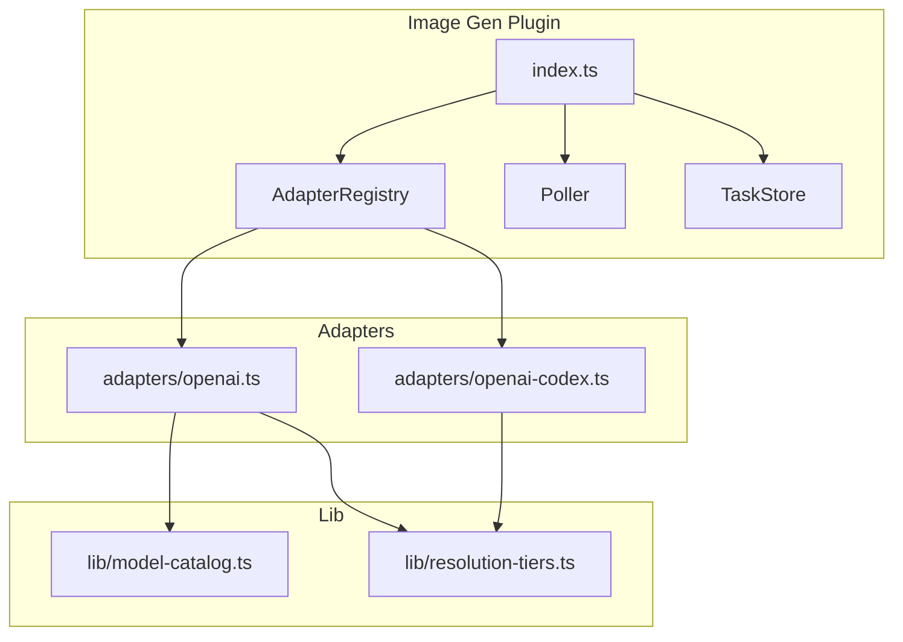
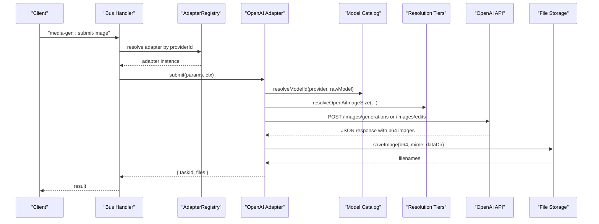
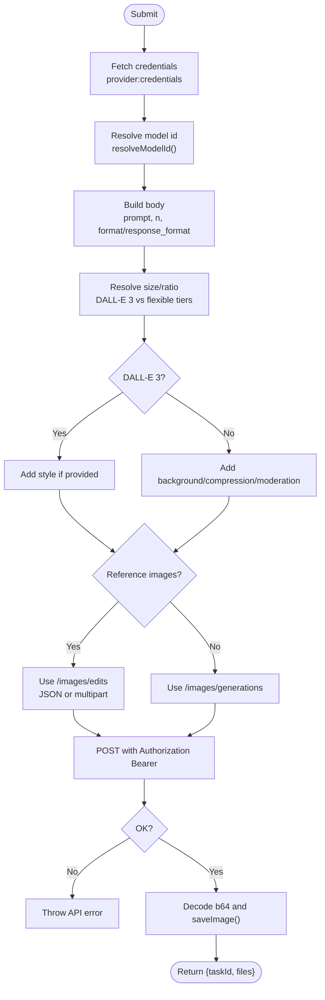
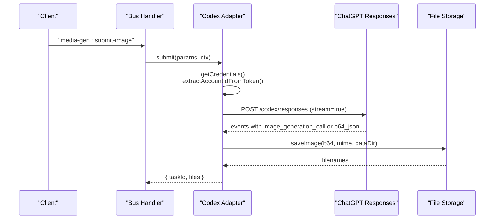
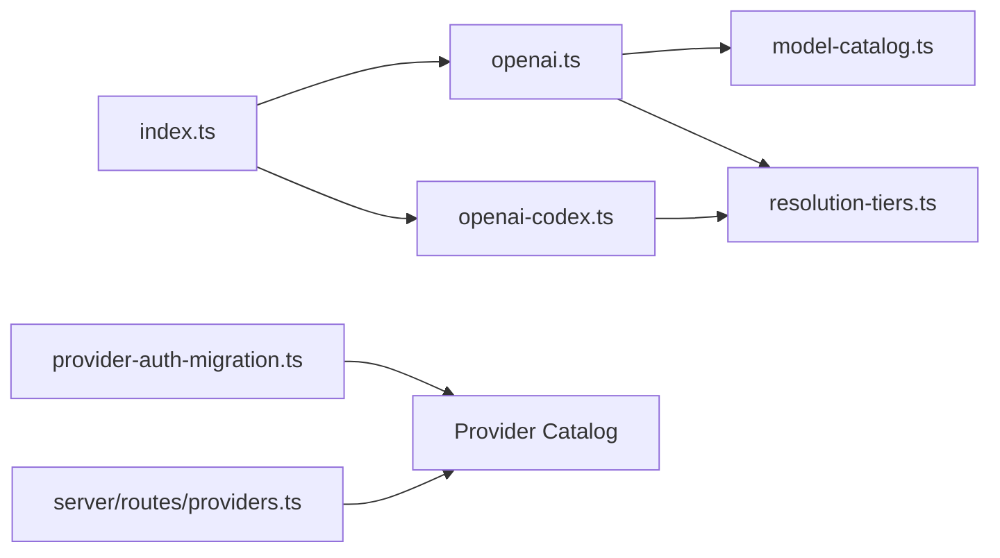

# OpenAI Provider

<cite>
**Referenced Files in This Document**
- [openai.ts](file://plugins/image-gen/adapters/openai.ts)
- [openai-codex.ts](file://plugins/image-gen/adapters/openai-codex.ts)
- [model-catalog.ts](file://plugins/image-gen/lib/model-catalog.ts)
- [resolution-tiers.ts](file://plugins/image-gen/lib/resolution-tiers.ts)
- [index.ts](file://plugins/image-gen/index.ts)
- [provider-auth-migration.ts](file://core/provider-auth-migration.ts)
- [providers.ts](file://server/routes/providers.ts)
</cite>

## Table of Contents
1. [Introduction](#introduction)
2. [Project Structure](#project-structure)
3. [Core Components](#core-components)
4. [Architecture Overview](#architecture-overview)
5. [Detailed Component Analysis](#detailed-component-analysis)
6. [Dependency Analysis](#dependency-analysis)
7. [Performance Considerations](#performance-considerations)
8. [Troubleshooting Guide](#troubleshooting-guide)
9. [Conclusion](#conclusion)
10. [Appendices](#appendices)

## Introduction
This document explains the OpenAI image generation provider integration, covering DALL-E models and Codex-based image generation. It documents available models (DALL-E 3 and GPT Image family), capabilities, resolution options, quality settings, authentication setup with API keys, rate limiting considerations, cost optimization strategies, and usage patterns including text-to-image generation, image editing with reference images, and batch processing workflows. Model-specific parameters such as aspect ratios, styles, and safety filters are also addressed.

## Project Structure
The OpenAI image generation functionality is implemented within a plugin that registers adapters for different providers and exposes bus handlers to submit image generation tasks. Key modules include:
- Adapters for OpenAI standard and Codex OAuth flows
- A model catalog mapping short names to full model IDs
- Resolution and ratio normalization utilities
- Plugin bootstrap and task orchestration

**Diagram sources**
- [index.ts:1-170](file://plugins/image-gen/index.ts#L1-L170)
- [openai.ts:1-257](file://plugins/image-gen/adapters/openai.ts#L1-L257)
- [openai-codex.ts:1-278](file://plugins/image-gen/adapters/openai-codex.ts#L1-L278)
- [model-catalog.ts:1-98](file://plugins/image-gen/lib/model-catalog.ts#L1-L98)
- [resolution-tiers.ts:1-261](file://plugins/image-gen/lib/resolution-tiers.ts#L1-L261)

**Section sources**
- [index.ts:1-170](file://plugins/image-gen/index.ts#L1-L170)

## Core Components
- OpenAI Adapter: Handles DALL-E 3 and GPT Image models, resolves sizes/ratios, builds requests, saves outputs, and supports edit endpoints when applicable.
- OpenAI Codex Adapter: Uses ChatGPT responses endpoint with an OAuth token to generate or edit images via tool calls.
- Model Catalog: Central registry mapping provider short names/aliases to canonical model IDs.
- Resolution Tiers: Normalizes and validates size, ratio, and tier inputs according to provider constraints.
- Plugin Bootstrap: Registers adapters, sets up polling, and exposes bus handlers for submission and task management.

**Section sources**
- [openai.ts:1-257](file://plugins/image-gen/adapters/openai.ts#L1-L257)
- [openai-codex.ts:1-278](file://plugins/image-gen/adapters/openai-codex.ts#L1-L278)
- [model-catalog.ts:1-98](file://plugins/image-gen/lib/model-catalog.ts#L1-L98)
- [resolution-tiers.ts:1-261](file://plugins/image-gen/lib/resolution-tiers.ts#L1-L261)
- [index.ts:1-170](file://plugins/image-gen/index.ts#L1-L170)

## Architecture Overview
The plugin orchestrates image generation by routing requests through adapters that translate user-friendly parameters into provider-specific payloads. Authentication is resolved from credentials stored per provider, and outputs are saved locally.

**Diagram sources**
- [index.ts:83-107](file://plugins/image-gen/index.ts#L83-L107)
- [openai.ts:116-254](file://plugins/image-gen/adapters/openai.ts#L116-L254)
- [model-catalog.ts:53-72](file://plugins/image-gen/lib/model-catalog.ts#L53-L72)
- [resolution-tiers.ts:220-261](file://plugins/image-gen/lib/resolution-tiers.ts#L220-L261)

## Detailed Component Analysis

### OpenAI Adapter (DALL-E 3 and GPT Image)
Responsibilities:
- Resolve credentials and base URL
- Normalize model ID using the catalog
- Translate parameters into provider bodies
- Enforce DALL-E 3 constraints (size, ratio, style)
- Support image edits via /images/edits with HTTP(S) URLs, file_id, or local files
- Save generated images and return file paths

Key behaviors:
- DALL-E 3 only supports specific sizes and ratios; style parameter is supported
- Non-DALL-E 3 models support background, output compression, moderation flags
- Edit mode requires valid references; otherwise throws an error
- Response includes optional revised_prompt logged internally

**Diagram sources**
- [openai.ts:116-254](file://plugins/image-gen/adapters/openai.ts#L116-L254)
- [model-catalog.ts:53-72](file://plugins/image-gen/lib/model-catalog.ts#L53-L72)
- [resolution-tiers.ts:220-261](file://plugins/image-gen/lib/resolution-tiers.ts#L220-L261)

**Section sources**
- [openai.ts:1-257](file://plugins/image-gen/adapters/openai.ts#L1-L257)
- [model-catalog.ts:1-98](file://plugins/image-gen/lib/model-catalog.ts#L1-L98)
- [resolution-tiers.ts:1-261](file://plugins/image-gen/lib/resolution-tiers.ts#L1-L261)

### OpenAI Codex Adapter (OAuth)
Responsibilities:
- Authenticate using ChatGPT OAuth token and extract account id
- Build a responses request with an image_generation tool
- Stream or parse non-streaming responses to collect base64 images
- Save images and return results

Key behaviors:
- Default base URL and responses model are defined
- Supports flexible ratios and 1K/2K resolution tiers
- Accepts input images as local files (converted to data URLs) or URLs
- Requires chatgpt-account-id header derived from JWT payload

**Diagram sources**
- [openai-codex.ts:1-278](file://plugins/image-gen/adapters/openai-codex.ts#L1-L278)

**Section sources**
- [openai-codex.ts:1-278](file://plugins/image-gen/adapters/openai-codex.ts#L1-L278)

### Model Catalog
Centralized mapping of provider short names and aliases to canonical model IDs. Provides defaults and UI-ready lists.

Highlights:
- OpenAI provider includes DALL-E 3 and GPT Image variants
- Codex provider includes GPT Image 2
- Short aliases like "dalle3", "1.5", "2" map to full IDs

**Section sources**
- [model-catalog.ts:1-98](file://plugins/image-gen/lib/model-catalog.ts#L1-L98)

### Resolution and Ratio Utilities
Normalization and validation for size, ratio, and resolution tiers across providers.

Highlights:
- Standard vs flexible ratios and tiers
- Constraint checks (multiples of 16, max edge, pixel limits, aspect ratio bounds)
- Automatic nearest-size selection based on requested ratio and tier

**Section sources**
- [resolution-tiers.ts:1-261](file://plugins/image-gen/lib/resolution-tiers.ts#L1-L261)

### Plugin Bootstrap and Task Orchestration
Registers adapters, initializes storage and polling, and exposes bus handlers for submission and task management.

Highlights:
- Binds to native media runtime if available, otherwise uses plugin runtime
- Provides list/update/remove task operations
- Integrates with task registry for abort/cancel

**Section sources**
- [index.ts:1-170](file://plugins/image-gen/index.ts#L1-L170)

## Dependency Analysis
The OpenAI provider depends on shared utilities for model resolution and sizing, and integrates with credential stores and server routes for configuration.

**Diagram sources**
- [openai.ts:1-257](file://plugins/image-gen/adapters/openai.ts#L1-L257)
- [openai-codex.ts:1-278](file://plugins/image-gen/adapters/openai-codex.ts#L1-L278)
- [model-catalog.ts:1-98](file://plugins/image-gen/lib/model-catalog.ts#L1-L98)
- [resolution-tiers.ts:1-261](file://plugins/image-gen/lib/resolution-tiers.ts#L1-L261)
- [index.ts:1-170](file://plugins/image-gen/index.ts#L1-L170)
- [provider-auth-migration.ts:1-208](file://core/provider-auth-migration.ts#L1-L208)
- [providers.ts:178-217](file://server/routes/providers.ts#L178-L217)

**Section sources**
- [provider-auth-migration.ts:1-208](file://core/provider-auth-migration.ts#L1-L208)
- [providers.ts:178-217](file://server/routes/providers.ts#L178-L217)

## Performance Considerations
- Prefer 1K resolution for faster generation and lower cost unless higher detail is required.
- Use appropriate aspect ratios to avoid unnecessary scaling overhead.
- Batch multiple requests where possible to reduce per-request overhead.
- For Codex streaming, handle partial events efficiently and avoid excessive buffering.

[No sources needed since this section provides general guidance]

## Troubleshooting Guide
Common issues and resolutions:
- Missing API key: Ensure provider credentials are configured; the adapter fetches them via bus and will throw if not present.
- Unsupported size or ratio: Validate against supported tiers and ratios; errors indicate unsupported values.
- DALL-E 3 reference images: Not supported; use non-DALL-E 3 models for edit workflows.
- Edit endpoint references: Must be HTTP(S) URLs, file_id, or absolute local file paths.
- Codex account id missing: Re-authenticate to obtain a valid token containing the account id.
- Legacy API key migration: If using older configurations, ensure legacy keys are migrated to the provider catalog.

**Section sources**
- [openai.ts:104-122](file://plugins/image-gen/adapters/openai.ts#L104-L122)
- [openai.ts:189-202](file://plugins/image-gen/adapters/openai.ts#L189-L202)
- [openai-codex.ts:167-177](file://plugins/image-gen/adapters/openai-codex.ts#L167-L177)
- [provider-auth-migration.ts:127-207](file://core/provider-auth-migration.ts#L127-L207)

## Conclusion
The OpenAI provider integration offers robust support for DALL-E 3 and GPT Image models, with flexible sizing and ratio handling, clear authentication flows, and practical utilities for building text-to-image and edit workflows. The Codex adapter extends capabilities via ChatGPT’s responses endpoint, enabling advanced image generation with OAuth. Following the guidelines here ensures reliable operation, optimal performance, and cost-effective usage.

[No sources needed since this section summarizes without analyzing specific files]

## Appendices

### Available Models and Capabilities
- DALL-E 3: Fixed sizes and ratios; style parameter supported; no reference images.
- GPT Image 1.x and 2.x: Flexible ratios and resolution tiers; background, compression, moderation flags supported.

**Section sources**
- [model-catalog.ts:25-35](file://plugins/image-gen/lib/model-catalog.ts#L25-L35)
- [openai.ts:139-187](file://plugins/image-gen/adapters/openai.ts#L139-L187)
- [resolution-tiers.ts:31-42](file://plugins/image-gen/lib/resolution-tiers.ts#L31-L42)

### Authentication Setup
- API key providers: Configure via provider catalog; legacy keys can be migrated automatically.
- OAuth (Codex): Provide a ChatGPT token; account id extracted from JWT payload.

**Section sources**
- [provider-auth-migration.ts:127-207](file://core/provider-auth-migration.ts#L127-L207)
- [providers.ts:178-217](file://server/routes/providers.ts#L178-L217)
- [openai-codex.ts:167-177](file://plugins/image-gen/adapters/openai-codex.ts#L167-L177)

### Rate Limiting and Cost Optimization
- Choose 1K resolution for speed and cost savings.
- Avoid unnecessary high-resolution generations.
- Use moderation and compression flags judiciously to balance quality and cost.

[No sources needed since this section provides general guidance]

### Usage Examples

- Text-to-image generation (DALL-E 3):
  - Set model to DALL-E 3, provide prompt, choose ratio (1:1, 16:9, 9:16), and optionally style.
  - Submit via media-gen:submit-image; adapter resolves size and returns files.

- Image editing with reference images (non-DALL-E 3):
  - Provide one or more reference images as HTTP(S) URLs, file_id, or local paths.
  - Use /images/edits endpoint; adapter builds multipart or JSON body accordingly.

- Batch processing workflows:
  - Issue multiple submissions with varying prompts and parameters.
  - Track tasks via media-gen:get-tasks and manage lifecycle with update/remove handlers.

**Section sources**
- [openai.ts:116-254](file://plugins/image-gen/adapters/openai.ts#L116-L254)
- [index.ts:109-148](file://plugins/image-gen/index.ts#L109-L148)