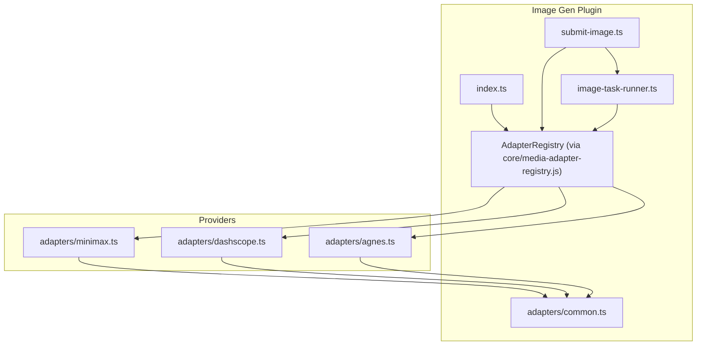
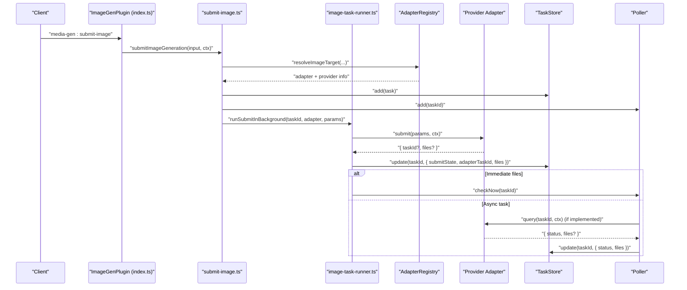
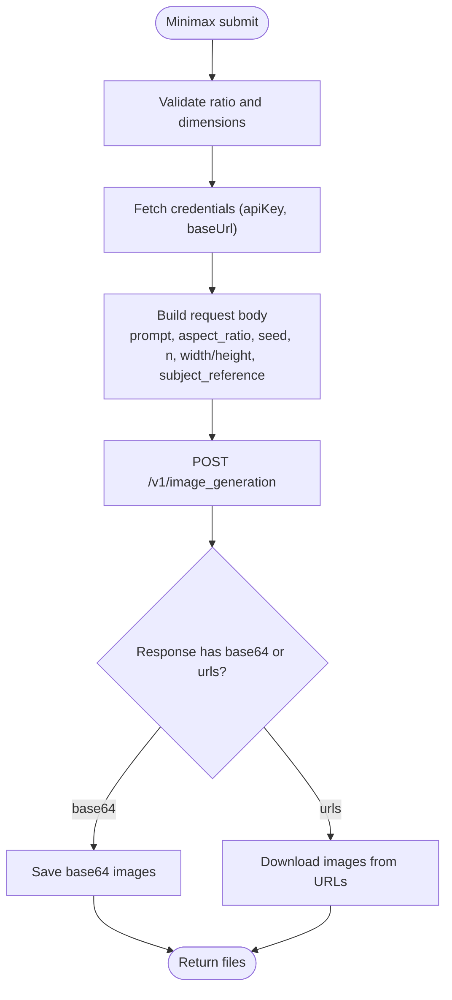
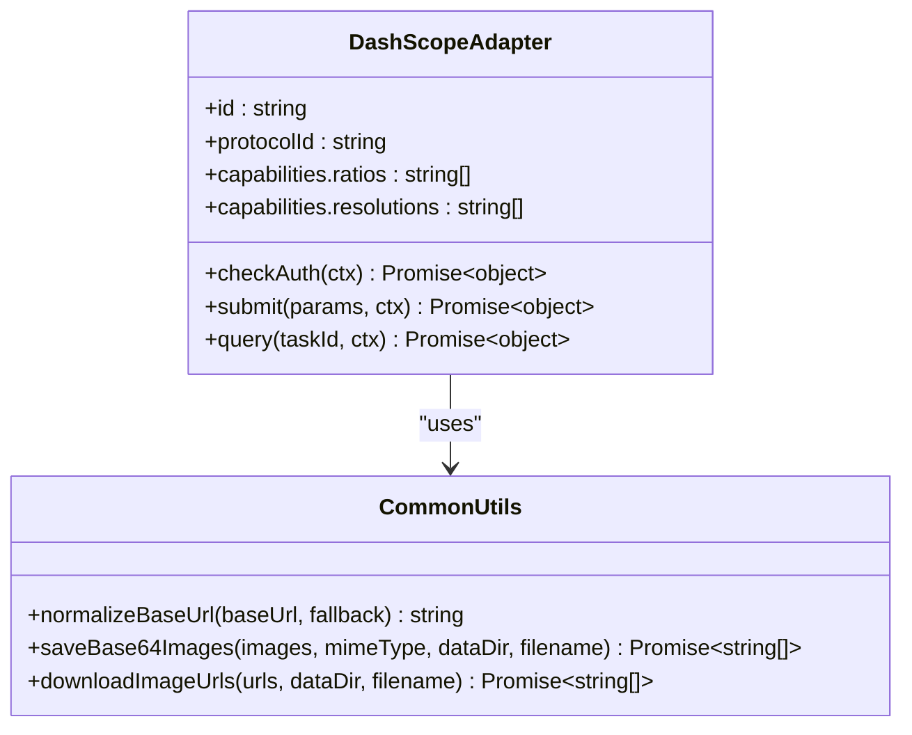
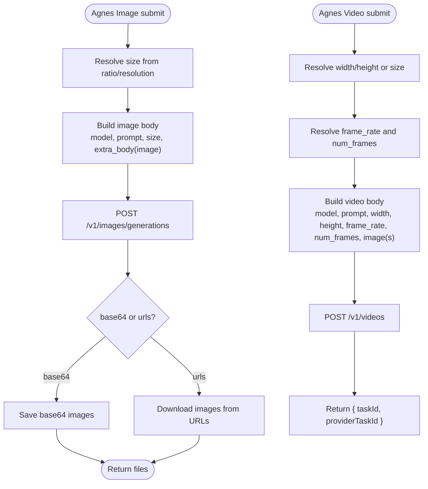
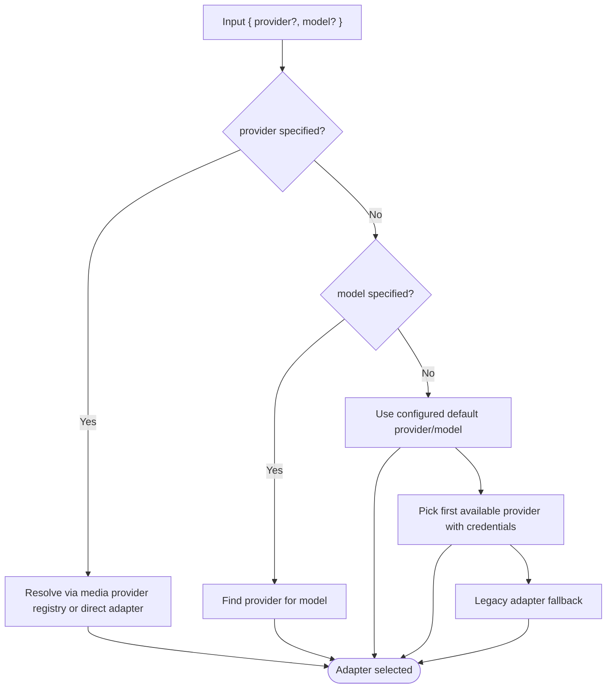
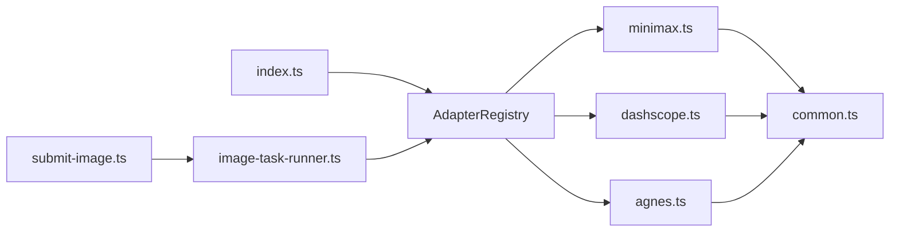

# Other Providers

<cite>
**Referenced Files in This Document**
- [minimax.ts](file://plugins/image-gen/adapters/minimax.ts)
- [dashscope.ts](file://plugins/image-gen/adapters/dashscope.ts)
- [agnes.ts](file://plugins/image-gen/adapters/agnes.ts)
- [common.ts](file://plugins/image-gen/adapters/common.ts)
- [index.ts](file://plugins/image-gen/index.ts)
- [submit-image.ts](file://plugins/image-gen/lib/submit-image.ts)
- [image-task-runner.ts](file://plugins/image-gen/lib/image-task-runner.ts)
- [model-catalog.ts](file://plugins/image-gen/lib/model-catalog.ts)
</cite>

## Table of Contents
1. [Introduction](#introduction)
2. [Project Structure](#project-structure)
3. [Core Components](#core-components)
4. [Architecture Overview](#architecture-overview)
5. [Detailed Component Analysis](#detailed-component-analysis)
6. [Dependency Analysis](#dependency-analysis)
7. [Performance Considerations](#performance-considerations)
8. [Troubleshooting Guide](#troubleshooting-guide)
9. [Conclusion](#conclusion)

## Introduction
This document provides detailed documentation for additional image generation providers: Minimax, DashScope, and Agnes. It covers each provider’s capabilities, supported models, authentication methods, parameter configurations, usage patterns, and integration specifics within the OpenShadow image-generation plugin. It also explains provider selection strategies and fallback mechanisms used by the system to route requests to the most suitable provider.

## Project Structure
The image-generation subsystem is implemented as a plugin that registers adapters for multiple providers. The three providers under focus are implemented as adapter modules and registered at plugin load time. A central submission pipeline resolves targets, normalizes parameters, submits tasks, and polls for completion.

**Diagram sources**
- [index.ts:1-170](file://plugins/image-gen/index.ts#L1-L170)
- [submit-image.ts:1-139](file://plugins/image-gen/lib/submit-image.ts#L1-L139)
- [image-task-runner.ts:1-506](file://plugins/image-gen/lib/image-task-runner.ts#L1-L506)
- [minimax.ts:1-142](file://plugins/image-gen/adapters/minimax.ts#L1-L142)
- [dashscope.ts:1-317](file://plugins/image-gen/adapters/dashscope.ts#L1-L317)
- [agnes.ts:1-397](file://plugins/image-gen/adapters/agnes.ts#L1-L397)
- [common.ts:1-63](file://plugins/image-gen/adapters/common.ts#L1-L63)

**Section sources**
- [index.ts:1-170](file://plugins/image-gen/index.ts#L1-L170)
- [submit-image.ts:1-139](file://plugins/image-gen/lib/submit-image.ts#L1-L139)
- [image-task-runner.ts:1-506](file://plugins/image-gen/lib/image-task-runner.ts#L1-L506)

## Core Components
- Adapter Registry: Central registry maps protocol IDs and provider IDs to concrete adapters. Adapters implement a common interface with submit and optional query/checkAuth methods.
- Submission Pipeline: Normalizes input, resolves target provider/model, validates constraints, persists task metadata, and enqueues background processing.
- Background Runner: Invokes adapter.submit, handles immediate file results or async task IDs, updates store, and triggers polling when needed.
- Common Utilities: Base URL normalization, image input normalization (including local path to data URL), base64 saving, and URL downloading.

Key responsibilities:
- Provider-specific validation and request formatting
- Authentication via credential bus
- Result extraction from provider responses (base64 or URLs)
- File persistence and task lifecycle management

**Section sources**
- [index.ts:1-170](file://plugins/image-gen/index.ts#L1-L170)
- [submit-image.ts:1-139](file://plugins/image-gen/lib/submit-image.ts#L1-L139)
- [image-task-runner.ts:1-506](file://plugins/image-gen/lib/image-task-runner.ts#L1-L506)
- [common.ts:1-63](file://plugins/image-gen/adapters/common.ts#L1-L63)

## Architecture Overview
The runtime flow for image generation involves:
- Client invokes media-gen:submit-image
- submit-image resolves target provider/model and builds normalized params
- A task record is created and added to the poller queue
- Background runner calls adapter.submit
- If files are returned immediately, they are saved; otherwise, an async task ID is stored and polled until completion

**Diagram sources**
- [index.ts:1-170](file://plugins/image-gen/index.ts#L1-L170)
- [submit-image.ts:1-139](file://plugins/image-gen/lib/submit-image.ts#L1-L139)
- [image-task-runner.ts:1-506](file://plugins/image-gen/lib/image-task-runner.ts#L1-L506)

## Detailed Component Analysis

### Minimax Image Adapter
Capabilities and model offerings:
- Aspect ratios: 1:1, 16:9, 9:16, 4:3, 3:4, 3:2, 2:3, 21:9
- Optional width/height integers between 512 and 2048, divisible by 8
- Reference images supported via subject_reference character references
- Model defaults to a specific image model if not provided

Authentication:
- Uses provider credentials bus with providerId minimax
- Requires apiKey; baseUrl can be customized and normalized

Parameter configuration:
- prompt, n, aspect_ratio, seed, prompt_optimizer
- width/height together required if provided
- size/resolution fields are explicitly unsupported

Usage patterns:
- POST to image_generation endpoint with Authorization Bearer token
- Returns either base64 images or image_urls; both paths are handled
- Error messages include provider status codes and messages

Provider-specific features:
- Character reference images for consistent subjects across generations
- Prompt optimizer toggle for enhanced prompts

**Diagram sources**
- [minimax.ts:1-142](file://plugins/image-gen/adapters/minimax.ts#L1-L142)
- [common.ts:1-63](file://plugins/image-gen/adapters/common.ts#L1-L63)

**Section sources**
- [minimax.ts:1-142](file://plugins/image-gen/adapters/minimax.ts#L1-L142)

### DashScope Image Adapter
Capabilities and model offerings:
- Supports multiple families:
  - Wan family: sizes 1K, 2K, 4K; aspect ratios including 1:1, 16:9, 9:16, 4:3, 3:4, 3:2, 2:3, 21:9
  - Qwen multimodal family: fixed sizes per ratio
  - Qwen text-to-image family: fixed sizes per ratio
- Negative prompts, watermark, seed, prompt_extend toggles supported

Authentication:
- Uses provider credentials bus with providerId dashscope
- Requires apiKey; baseUrl normalized to DashScope API v1 endpoints

Parameter configuration:
- Size and resolution mapping depends on model family
- Aspect ratio validated against family-supported set
- For qwen-text2image, reference images are not supported

Usage patterns:
- Different endpoints based on model family
- Asynchronous tasks enabled for non-multimodal families
- Query method supports polling task status and retrieving results

Provider-specific features:
- Alibaba ecosystem integration through DashScope APIs
- Flexible size/ratio handling across model families
- Task-based asynchronous generation with robust result parsing

**Diagram sources**
- [dashscope.ts:1-317](file://plugins/image-gen/adapters/dashscope.ts#L1-L317)
- [common.ts:1-63](file://plugins/image-gen/adapters/common.ts#L1-L63)

**Section sources**
- [dashscope.ts:1-317](file://plugins/image-gen/adapters/dashscope.ts#L1-L317)

### Agnes Image and Video Adapters
Capabilities and model offerings:
- Images:
  - Supported ratios map to explicit pixel sizes (e.g., 1:1 → 1024x1024)
  - Resolution support includes 1K
- Videos:
  - Default video model and frame rate
  - Supported resolutions and sizes constrained to specific values
  - Frame count must follow 8n+1 constraint within defined min/max range

Authentication:
- Uses provider credentials bus with providerId agnes
- Requires apiKey; baseUrl normalized to Agnes v1 endpoints

Parameter configuration:
- Image:
  - size or resolution accepted; ratio determines exact pixel size if not explicit
- Video:
  - width/height or size string; ratio fallback
  - frame_rate and num_frames or duration derived into valid frame counts
  - Single image input supported directly; multiple images passed via extra_body

Usage patterns:
- Image generation returns base64 or URLs; both handled
- Video generation returns a task ID; query method uses recommended endpoint with legacy fallback
- Video download saves to generated directory with content-type-based extension

Provider-specific features:
- Specialized image processing with strict size/ratio enforcement
- Video generation with precise frame constraints and flexible input modes
- Robust query flow with recommended and legacy endpoints

**Diagram sources**
- [agnes.ts:1-397](file://plugins/image-gen/adapters/agnes.ts#L1-L397)
- [common.ts:1-63](file://plugins/image-gen/adapters/common.ts#L1-L63)

**Section sources**
- [agnes.ts:1-397](file://plugins/image-gen/adapters/agnes.ts#L1-L397)

### Provider Selection Strategies and Fallback Mechanisms
The system selects a provider using a prioritized strategy:
- Explicit provider specified in input
- Explicit model resolved to a provider via media provider registry
- Configured default provider/model
- First available provider with credentials and matching protocol
- Legacy adapter fallback scanning all image adapters by registration order

Additional behaviors:
- Auth checks via adapter.checkAuth when available
- Strict mode errors when configured defaults or media models are missing
- Multiple providers returning the same model raise ambiguity errors

**Diagram sources**
- [image-task-runner.ts:1-506](file://plugins/image-gen/lib/image-task-runner.ts#L1-L506)

**Section sources**
- [image-task-runner.ts:1-506](file://plugins/image-gen/lib/image-task-runner.ts#L1-L506)

## Dependency Analysis
- Adapters depend on common utilities for base URL normalization, image input normalization, and result persistence.
- The plugin index registers adapters and wires up bus handlers for listing, submitting, and managing tasks.
- The submission pipeline orchestrates target resolution, parameter normalization, background execution, and polling.

**Diagram sources**
- [index.ts:1-170](file://plugins/image-gen/index.ts#L1-L170)
- [submit-image.ts:1-139](file://plugins/image-gen/lib/submit-image.ts#L1-L139)
- [image-task-runner.ts:1-506](file://plugins/image-gen/lib/image-task-runner.ts#L1-L506)
- [minimax.ts:1-142](file://plugins/image-gen/adapters/minimax.ts#L1-L142)
- [dashscope.ts:1-317](file://plugins/image-gen/adapters/dashscope.ts#L1-L317)
- [agnes.ts:1-397](file://plugins/image-gen/adapters/agnes.ts#L1-L397)
- [common.ts:1-63](file://plugins/image-gen/adapters/common.ts#L1-L63)

**Section sources**
- [index.ts:1-170](file://plugins/image-gen/index.ts#L1-L170)
- [submit-image.ts:1-139](file://plugins/image-gen/lib/submit-image.ts#L1-L139)
- [image-task-runner.ts:1-506](file://plugins/image-gen/lib/image-task-runner.ts#L1-L506)

## Performance Considerations
- Prefer immediate base64 or URL responses when possible to reduce polling overhead.
- Use appropriate aspect ratios and sizes to avoid unnecessary retries due to invalid parameters.
- For DashScope async tasks, ensure efficient polling intervals and handle failures promptly.
- Batch operations should respect provider limits and avoid excessive concurrent requests.

[No sources needed since this section provides general guidance]

## Troubleshooting Guide
Common issues and resolutions:
- Missing API key: Ensure provider credentials are configured via the credentials bus. Errors will indicate missing apiKey.
- Unsupported ratio or size: Validate inputs against provider-specific allowed sets before submission.
- No images returned: Check response parsing logic; some providers may return only URLs or base64 depending on configuration.
- Async task not completing: Verify query implementation and status mappings; ensure correct task IDs are used.

Error handling patterns:
- HTTP errors include status and parsed provider messages
- Provider-specific status codes mapped to user-friendly messages
- Task store updated with failure reasons and timestamps

**Section sources**
- [minimax.ts:1-142](file://plugins/image-gen/adapters/minimax.ts#L1-L142)
- [dashscope.ts:1-317](file://plugins/image-gen/adapters/dashscope.ts#L1-L317)
- [agnes.ts:1-397](file://plugins/image-gen/adapters/agnes.ts#L1-L397)
- [image-task-runner.ts:1-506](file://plugins/image-gen/lib/image-task-runner.ts#L1-L506)

## Conclusion
Minimax, DashScope, and Agnes provide complementary image generation capabilities within the OpenShadow plugin. Minimax emphasizes artistic styles and character references; DashScope integrates deeply with Alibaba’s ecosystem and supports diverse model families; Agnes offers specialized image and video processing with strict size and frame constraints. The unified submission pipeline ensures robust provider selection, parameter normalization, and resilient task management.

[No sources needed since this section summarizes without analyzing specific files]