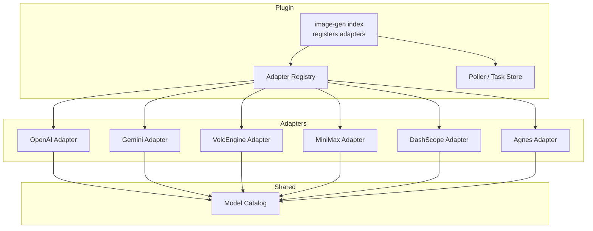
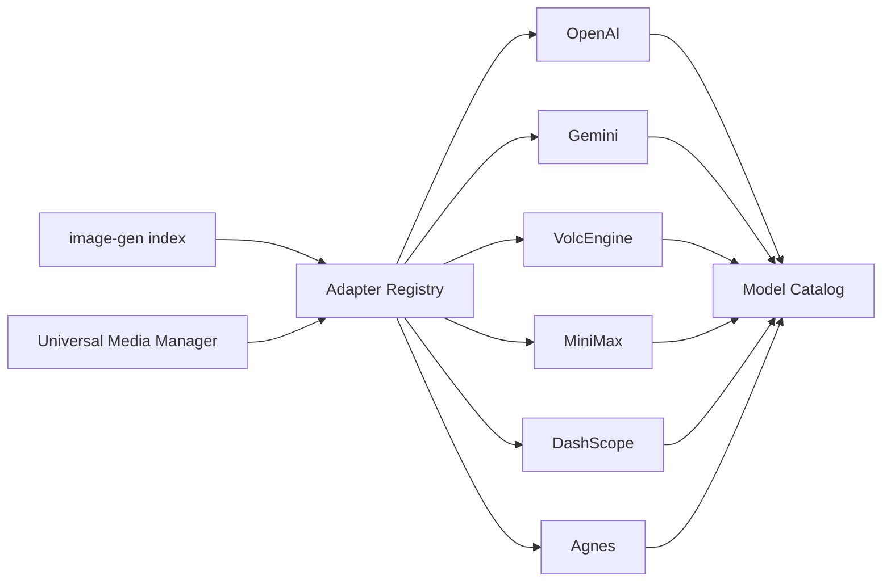

# Supported Providers

<cite>
**Referenced Files in This Document**
- [index.ts](file://plugins/image-gen/index.ts)
- [openai.ts](file://plugins/image-gen/adapters/openai.ts)
- [gemini.ts](file://plugins/image-gen/adapters/gemini.ts)
- [volcengine.ts](file://plugins/image-gen/adapters/volcengine.ts)
- [minimax.ts](file://plugins/image-gen/adapters/minimax.ts)
- [dashscope.ts](file://plugins/image-gen/adapters/dashscope.ts)
- [agnes.ts](file://plugins/image-gen/adapters/agnes.ts)
- [model-catalog.ts](file://plugins/image-gen/lib/model-catalog.ts)
- [universal-media-manager.ts](file://core/media/universal-media-manager.ts)
</cite>

## Table of Contents
1. Introduction
2. Project Structure
3. Core Components
4. Architecture Overview
5. Detailed Component Analysis
6. Dependency Analysis
7. Performance Considerations
8. Troubleshooting Guide
9. Conclusion

## Introduction
This document describes the supported image generation providers and their adapters: OpenAI, Gemini, VolcEngine (ByteDance Doubao), MiniMax, DashScope (Alibaba Cloud), and Agnes. It covers capabilities, authentication requirements, model options, parameter configurations, provider-specific limits, error handling, fallback behavior, and configuration examples for each provider.

## Project Structure
The image generation system is implemented as a plugin that registers built-in adapters and exposes bus handlers to submit image tasks, list adapters, and manage tasks. Adapters encapsulate provider-specific logic for authentication, request construction, response parsing, and file saving. A shared model catalog resolves short names or aliases into canonical model IDs.

**Diagram sources**
- [index.ts:18-60](file://plugins/image-gen/index.ts#L18-L60)
- [model-catalog.ts:17-35](file://plugins/image-gen/lib/model-catalog.ts#L17-L35)

**Section sources**
- [index.ts:18-60](file://plugins/image-gen/index.ts#L18-L60)
- [universal-media-manager.ts:319-332](file://core/media/universal-media-manager.ts#L319-L332)

## Core Components
- Adapter Registry: Central registry that maps adapter IDs, aliases, and protocol IDs to implementations.
- Model Catalog: Single source of truth for known models per provider with alias resolution and defaults.
- Plugin Entry: Registers adapters, exposes bus handlers for submission and task management, and starts polling.

Key responsibilities:
- Authentication via credentials bus requests.
- Parameter normalization and validation.
- HTTP calls to provider APIs.
- Saving images locally and returning file paths.
- Async task support where applicable.

**Section sources**
- [index.ts:18-60](file://plugins/image-gen/index.ts#L18-L60)
- [model-catalog.ts:53-97](file://plugins/image-gen/lib/model-catalog.ts#L53-L97)

## Architecture Overview
The runtime binds to either a native media runtime or falls back to the plugin’s internal runtime. The plugin registers all built-in adapters and provides bus endpoints for listing adapters, submitting image generation tasks, and managing tasks.

```mermaid
sequenceDiagram
participant Client as "Caller"
participant Bus as "Bus"
participant Plugin as "ImageGen Plugin"
participant Reg as "Adapter Registry"
participant Adapter as "Provider Adapter"
participant Provider as "Provider API"
Client->>Bus : "media-gen : submit-image"
Bus->>Plugin : handle submit
Plugin->>Reg : resolve adapter by id/protocolId
Reg-->>Plugin : adapter instance
Plugin->>Adapter : submit(params, ctx)
Adapter->>Adapter : checkAuth()
Adapter->>Provider : POST generate endpoint
Provider-->>Adapter : JSON + base64 or URLs
Adapter->>Adapter : save files
Adapter-->>Plugin : { taskId, files }
Plugin-->>Client : result
```

**Diagram sources**
- [index.ts:87-107](file://plugins/image-gen/index.ts#L87-L107)
- [openai.ts:104-114](file://plugins/image-gen/adapters/openai.ts#L104-L114)
- [gemini.ts:139-146](file://plugins/image-gen/adapters/gemini.ts#L139-L146)
- [volcengine.ts:129-139](file://plugins/image-gen/adapters/volcengine.ts#L129-L139)
- [minimax.ts:59-66](file://plugins/image-gen/adapters/minimax.ts#L59-L66)
- [dashscope.ts:226-233](file://plugins/image-gen/adapters/dashscope.ts#L226-L233)
- [agnes.ts:227-234](file://plugins/image-gen/adapters/agnes.ts#L227-L234)

## Detailed Component Analysis

### OpenAI Adapter
Capabilities
- Ratios: standard set defined by the adapter.
- Resolutions: standard tiers; flexible tiers for newer models.
- Image edit support via /images/edits when reference images are provided.

Authentication
- Requires an API key from the “openai” credential provider.

Models
- DALL·E 3: fixed sizes and ratios; no reference images.
- GPT Image family: supports size/resolution and optional quality/background/moderation fields.

Parameters
- prompt, n, format/output_format, size/resolution, aspect_ratio/ratio, quality, background, output_compression, moderation, style (DALL·E 3 only).
- Reference images: HTTP(S) URL, file_id, or local path.

Limits and Behavior
- DALL·E 3 does not accept reference images.
- Response includes b64_json; revised_prompt may be logged.

Error Handling
- Throws descriptive errors on unsupported sizes/ratios or missing API keys.
- Parses provider error messages from JSON responses.

Configuration Example
- Set provider default model and parameters under providerDefaults for “openai”.
- Provide API key via provider credentials for “openai”.

**Section sources**
- [openai.ts:94-102](file://plugins/image-gen/adapters/openai.ts#L94-L102)
- [openai.ts:104-114](file://plugins/image-gen/adapters/openai.ts#L104-L114)
- [openai.ts:116-187](file://plugins/image-gen/adapters/openai.ts#L116-L187)
- [openai.ts:189-202](file://plugins/image-gen/adapters/openai.ts#L189-L202)
- [openai.ts:209-254](file://plugins/image-gen/adapters/openai.ts#L209-L254)
- [model-catalog.ts:25-31](file://plugins/image-gen/lib/model-catalog.ts#L25-L31)

### Gemini Adapter
Capabilities
- Ratios: broad set including 1:4, 1:8, 4:1, 8:1 for 3.1 Flash; fewer for 3 Pro and 2.5.
- Resolutions: 512, 1K, 2K, 4K depending on model family.
- Supports inline images and remote references.

Authentication
- Requires an API key from the “gemini” credential provider.

Models
- gemini-3.1-flash-image-preview (default), gemini-3-pro variants, gemini-2.5 variants.

Parameters
- prompt, aspect_ratio/ratio, size/resolution, reference images (data URI, HTTP(S), or file path).

Limits and Behavior
- Max reference images varies by model family.
- Uses generateContent with IMAGE modality.

Error Handling
- Validates ratio and size against model capabilities.
- Parses error messages from provider responses.

Configuration Example
- Configure providerDefaults for “gemini” with default model, ratio, and size/resolution.
- Provide API key via provider credentials for “gemini”.

**Section sources**
- [gemini.ts:129-137](file://plugins/image-gen/adapters/gemini.ts#L129-L137)
- [gemini.ts:139-146](file://plugins/image-gen/adapters/gemini.ts#L139-L146)
- [gemini.ts:148-170](file://plugins/image-gen/adapters/gemini.ts#L148-L170)
- [gemini.ts:172-206](file://plugins/image-gen/adapters/gemini.ts#L172-L206)

### VolcEngine Adapter
Capabilities
- Ratios: 1:1, 4:3, 3:4, 16:9, 9:16, 3:2, 2:3, 21:9.
- Resolutions: 1K, 2K, 4K (Seedream 3 limited to 1K).
- Output formats: jpeg/png (Seedream 5+).
- Optional guidance_scale and seed (Seedream 3).
- Reference images supported except Seedream 3.

Authentication
- Credentials lookup order: preferred providerId if given, then “volcengine”, then “volcengine-coding”.

Models
- Seedream 3.0, 4.0, 4.5, 5.0 Lite.

Parameters
- prompt, size/resolution, aspect_ratio/ratio, format (Seedream 5+), watermark, guidance_scale, seed, reference images.

Limits and Behavior
- Size must match allowed pixel dimensions for selected resolution and ratio.
- Watermark defaults to false.

Error Handling
- Validates supported resolutions and ratios.
- Throws descriptive errors for unsupported inputs or missing credentials.

Configuration Example
- Set providerDefaults for “volcengine” with default model, resolution, ratio, watermark, guidance_scale, seed.
- Provide API key via provider credentials for “volcengine” or “volcengine-coding”.

**Section sources**
- [volcengine.ts:118-127](file://plugins/image-gen/adapters/volcengine.ts#L118-L127)
- [volcengine.ts:129-139](file://plugins/image-gen/adapters/volcengine.ts#L129-L139)
- [volcengine.ts:141-207](file://plugins/image-gen/adapters/volcengine.ts#L141-L207)
- [volcengine.ts:209-249](file://plugins/image-gen/adapters/volcengine.ts#L209-L249)
- [model-catalog.ts:19-24](file://plugins/image-gen/lib/model-catalog.ts#L19-L24)

### MiniMax Adapter
Capabilities
- Ratios: 1:1, 16:9, 9:16, 4:3, 3:4, 3:2, 2:3, 21:9.
- No explicit size/resolution; width/height must be multiples of 8 within 512–2048.

Authentication
- Requires an API key from the “minimax” credential provider.

Models
- Default model: image-01.

Parameters
- prompt, aspect_ratio/ratio, n, prompt_optimizer, seed, width, height, subject_reference images.

Limits and Behavior
- If width/height provided, both must be present and valid.
- Returns base64 images or URLs; downloads URLs automatically.

Error Handling
- Validates ratio and dimension constraints.
- Parses status_code and status_msg from provider responses.

Configuration Example
- Set providerDefaults for “minimax” with default model, ratio, and optional seed/prompt_optimizer.
- Provide API key via provider credentials for “minimax”.

**Section sources**
- [minimax.ts:49-57](file://plugins/image-gen/adapters/minimax.ts#L49-L57)
- [minimax.ts:59-66](file://plugins/image-gen/adapters/minimax.ts#L59-L66)
- [minimax.ts:68-106](file://plugins/image-gen/adapters/minimax.ts#L68-L106)
- [minimax.ts:108-141](file://plugins/image-gen/adapters/minimax.ts#L108-L141)

### DashScope Adapter
Capabilities
- Families: Wan, Qwen Multimodal, Qwen Text-to-Image.
- Ratios: family-dependent sets.
- Resolutions: 1K, 2K, 4K (Wan); fixed sizes for Qwen families.
- Async task support for non-multimodal families.

Authentication
- Requires an API key from the “dashscope” credential provider.

Models
- Default: wan2.7-image-pro.
- Qwen multimodal and text-to-image models supported.

Parameters
- prompt, negative_prompt, prompt_extend, watermark, seed, size/resolution, aspect_ratio/ratio, reference images (family-dependent).

Limits and Behavior
- Qwen text-to-image does not accept reference images.
- Non-multimodal endpoints run asynchronously; query() polls results.

Error Handling
- Validates ratios and resolutions per family.
- Parses code/message from provider responses.

Configuration Example
- Set providerDefaults for “dashscope” with default model, ratio, size/resolution, watermark, seed.
- Provide API key via provider credentials for “dashscope”.

**Section sources**
- [dashscope.ts:211-224](file://plugins/image-gen/adapters/dashscope.ts#L211-L224)
- [dashscope.ts:226-233](file://plugins/image-gen/adapters/dashscope.ts#L226-L233)
- [dashscope.ts:235-292](file://plugins/image-gen/adapters/dashscope.ts#L235-L292)
- [dashscope.ts:294-316](file://plugins/image-gen/adapters/dashscope.ts#L294-L316)

### Agnes Adapter
Capabilities
- Images: ratios mapped to fixed pixel sizes; 1K resolution.
- Videos: single supported resolution; frame rate and num_frames constraints; duration-based frame calculation.

Authentication
- Requires an API key from the “agnes” credential provider.

Models
- Image default: agnes-image-2.1-flash.
- Video default: agnes-video-v2.0.

Parameters
- Image: prompt, size/resolution, aspect_ratio/ratio, reference images.
- Video: prompt, width/height or size, frame_rate, num_frames or duration, optional reference image(s).

Limits and Behavior
- Video num_frames must be 8n+1 within a specific range; duration must map to a valid frame count.
- Returns base64 or URLs for images; downloads videos.

Error Handling
- Validates ratios, sizes, frame counts, and durations.
- Parses error messages from provider responses.

Configuration Example
- Set providerDefaults for “agnes” with default model, size/resolution, ratio, frame_rate, num_frames/duration.
- Provide API key via provider credentials for “agnes”.

**Section sources**
- [agnes.ts:217-225](file://plugins/image-gen/adapters/agnes.ts#L217-L225)
- [agnes.ts:227-234](file://plugins/image-gen/adapters/agnes.ts#L227-L234)
- [agnes.ts:236-286](file://plugins/image-gen/adapters/agnes.ts#L236-L286)
- [agnes.ts:288-396](file://plugins/image-gen/adapters/agnes.ts#L288-L396)

## Dependency Analysis
- The plugin entry registers adapters and exposes bus handlers for submission and task management.
- Universal media manager also registers the same adapters at runtime for native integration.
- All adapters rely on shared utilities for base URL normalization, image input normalization, and saving/downloading images.
- Model catalog centralizes model definitions and alias resolution used by multiple adapters.

**Diagram sources**
- [index.ts:52-57](file://plugins/image-gen/index.ts#L52-L57)
- [universal-media-manager.ts:319-332](file://core/media/universal-media-manager.ts#L319-L332)
- [model-catalog.ts:17-35](file://plugins/image-gen/lib/model-catalog.ts#L17-L35)

**Section sources**
- [index.ts:52-57](file://plugins/image-gen/index.ts#L52-L57)
- [universal-media-manager.ts:319-332](file://core/media/universal-media-manager.ts#L319-L332)

## Performance Considerations
- Prefer async-capable providers (e.g., DashScope non-multimodal) for large batches; use poller to fetch results efficiently.
- Use providerDefaults to avoid repeated parameter computation and reduce request overhead.
- For providers returning URLs, downloading images can add latency; consider caching strategies at higher layers.
- Avoid unnecessary reference images to reduce payload size and processing time.

[No sources needed since this section provides general guidance]

## Troubleshooting Guide
Common issues and remedies:
- Missing API key: Ensure credentials are configured for the relevant provider. Each adapter checks auth and throws clear errors when keys are absent.
- Unsupported ratio or size: Validate inputs against provider capabilities before submission.
- Reference image limitations: Some models do not accept reference images (e.g., DALL·E 3, certain DashScope models).
- Async task completion: For providers like DashScope and Agnes video, ensure polling is active and query() is called until done.

Operational notes:
- The plugin logs warnings when falling back to its own runtime if the native media runtime is unavailable.
- Task removal cleans up generated files and persists state changes.

**Section sources**
- [index.ts:22-33](file://plugins/image-gen/index.ts#L22-L33)
- [index.ts:129-148](file://plugins/image-gen/index.ts#L129-L148)
- [openai.ts:189-202](file://plugins/image-gen/adapters/openai.ts#L189-L202)
- [dashscope.ts:294-316](file://plugins/image-gen/adapters/dashscope.ts#L294-L316)
- [agnes.ts:355-396](file://plugins/image-gen/adapters/agnes.ts#L355-L396)

## Conclusion
The image generation subsystem provides a unified interface across multiple providers with consistent authentication, parameter normalization, and result handling. By leveraging the model catalog and adapter registry, new providers can be integrated with minimal friction. Proper configuration of providerDefaults and credentials ensures reliable operation, while provider-specific validations and error handling improve robustness.

[No sources needed since this section summarizes without analyzing specific files]