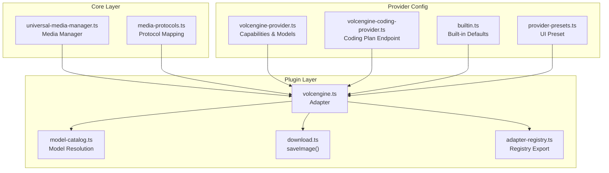
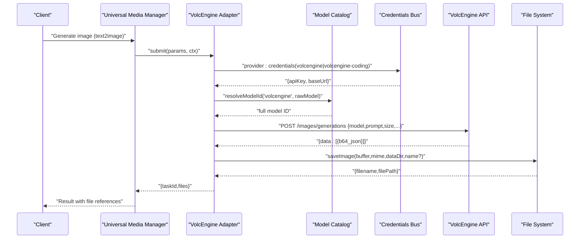
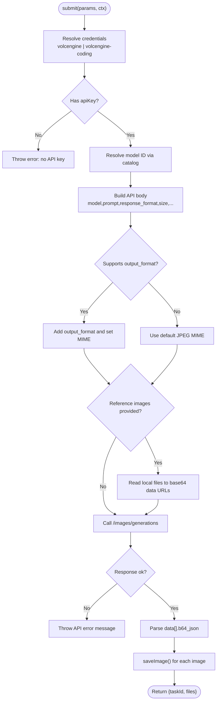
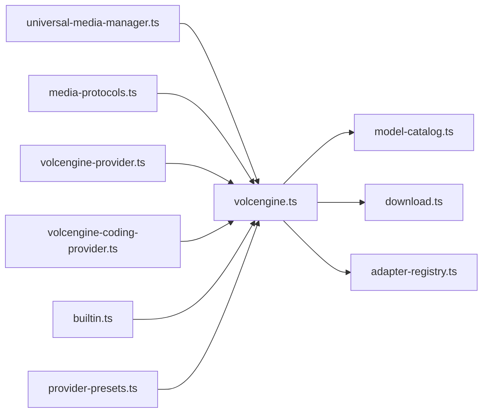

# VolcEngine Provider

<cite>
**Referenced Files in This Document**
- [volcengine.ts](file://plugins/image-gen/adapters/volcengine.ts)
- [model-catalog.ts](file://plugins/image-gen/lib/model-catalog.ts)
- [download.ts](file://plugins/image-gen/lib/download.ts)
- [adapter-registry.ts](file://plugins/image-gen/lib/adapter-registry.ts)
- [universal-media-manager.ts](file://core/media/universal-media-manager.ts)
- [media-protocols.ts](file://core/media-protocols.ts)
- [provider-presets.ts](file://desktop/src/react/utils/provider-presets.ts)
- [builtin.ts](file://core/providers/builtin.ts)
- [volcengine-provider.ts](file://lib/providers/volcengine.ts)
- [volcengine-coding-provider.ts](file://lib/providers/volcengine-coding.ts)
</cite>

## Table of Contents
1. [Introduction](#introduction)
2. [Project Structure](#project-structure)
3. [Core Components](#core-components)
4. [Architecture Overview](#architecture-overview)
5. [Detailed Component Analysis](#detailed-component-analysis)
6. [Dependency Analysis](#dependency-analysis)
7. [Performance Considerations](#performance-considerations)
8. [Troubleshooting Guide](#troubleshooting-guide)
9. [Conclusion](#conclusion)
10. [Appendices](#appendices)

## Introduction
This document provides comprehensive documentation for the VolcEngine image generation provider integration within the project. It covers available models, Chinese language support, region-specific endpoints, authentication setup, service configuration, and operational considerations such as output formats, resolution tiers, and watermarking. It also includes examples for text-to-image generation with Chinese prompts, guidance on cultural adaptation via reference images, and enterprise security options including credential lanes and data residency through regional endpoints.

## Project Structure
The VolcEngine image generation capability is implemented as a plugin adapter that integrates with the core media pipeline. The key files include:
- Adapter implementation for VolcEngine image generation
- Model catalog for short-name resolution
- Image saving utility for base64 responses
- Registry wiring to the universal media manager
- Protocol mapping for VolcEngine image protocol
- Provider presets and built-in defaults for default base URLs
- Provider plugins defining capabilities, credential lanes, and model metadata

**Diagram sources**
- [volcengine.ts:1-252](file://plugins/image-gen/adapters/volcengine.ts#L1-L252)
- [model-catalog.ts:1-98](file://plugins/image-gen/lib/model-catalog.ts#L1-L98)
- [download.ts:1-35](file://plugins/image-gen/lib/download.ts#L1-L35)
- [adapter-registry.ts:1-2](file://plugins/image-gen/lib/adapter-registry.ts#L1-L2)
- [universal-media-manager.ts:1-400](file://core/media/universal-media-manager.ts#L1-L400)
- [media-protocols.ts:1-120](file://core/media-protocols.ts#L1-L120)
- [volcengine-provider.ts:1-121](file://lib/providers/volcengine.ts#L1-L121)
- [volcengine-coding-provider.ts:1-18](file://lib/providers/volcengine-coding.ts#L1-L18)
- [builtin.ts:90-100](file://core/providers/builtin.ts#L90-L100)
- [provider-presets.ts:1-20](file://desktop/src/react/utils/provider-presets.ts#L1-L20)

**Section sources**
- [volcengine.ts:1-252](file://plugins/image-gen/adapters/volcengine.ts#L1-L252)
- [model-catalog.ts:1-98](file://plugins/image-gen/lib/model-catalog.ts#L1-L98)
- [download.ts:1-35](file://plugins/image-gen/lib/download.ts#L1-L35)
- [adapter-registry.ts:1-2](file://plugins/image-gen/lib/adapter-registry.ts#L1-L2)
- [universal-media-manager.ts:1-400](file://core/media/universal-media-manager.ts#L1-L400)
- [media-protocols.ts:1-120](file://core/media-protocols.ts#L1-L120)
- [volcengine-provider.ts:1-121](file://lib/providers/volcengine.ts#L1-L121)
- [volcengine-coding-provider.ts:1-18](file://lib/providers/volcengine-coding.ts#L1-L18)
- [builtin.ts:90-100](file://core/providers/builtin.ts#L90-L100)
- [provider-presets.ts:1-20](file://desktop/src/react/utils/provider-presets.ts#L1-L20)

## Core Components
- VolcEngine Image Adapter: Implements checkAuth and submit flows, resolves credentials from configured lanes, maps parameters to API body, handles size/ratio normalization, optional output format selection, reference image handling, and file persistence.
- Model Catalog: Provides short-name resolution (e.g., "5.0") to full model IDs for VolcEngine Seedream models.
- Image Save Utility: Converts base64 responses to local files under a generated directory with safe naming and extension mapping.
- Media Protocol Mapping: Routes VolcEngine seedream models to the internal "volcengine-images" protocol.
- Universal Media Manager: Registers the VolcEngine adapter into the media pipeline.
- Provider Plugins: Define capabilities, credential lanes, default base URLs, and model metadata for UI and runtime behavior.

Key behaviors:
- Credential lanes: Supports both standard API Key and Coding Plan endpoints.
- Size and ratio validation: Enforces supported resolutions and aspect ratios per model tier.
- Output format: Optional JPEG/PNG for newer models; otherwise defaults to JPEG.
- Reference images: Supported by non-Seedream 3.0 models; accepts local paths or URLs/base64.
- Watermark control: Default false unless overridden.

**Section sources**
- [volcengine.ts:102-252](file://plugins/image-gen/adapters/volcengine.ts#L102-L252)
- [model-catalog.ts:18-35](file://plugins/image-gen/lib/model-catalog.ts#L18-L35)
- [download.ts:19-34](file://plugins/image-gen/lib/download.ts#L19-L34)
- [media-protocols.ts:50-60](file://core/media-protocols.ts#L50-L60)
- [universal-media-manager.ts:300-330](file://core/media/universal-media-manager.ts#L300-L330)
- [volcengine-provider.ts:88-121](file://lib/providers/volcengine.ts#L88-L121)
- [volcengine-coding-provider.ts:10-18](file://lib/providers/volcengine-coding.ts#L10-L18)

## Architecture Overview
The VolcEngine provider integrates at the adapter layer and is invoked by the universal media manager when an image generation request targets a VolcEngine model. Authentication is resolved via credential lanes, and requests are sent to the configured base URL endpoint for image generations. Responses are saved locally and returned to the caller.

**Diagram sources**
- [volcengine.ts:141-252](file://plugins/image-gen/adapters/volcengine.ts#L141-L252)
- [model-catalog.ts:53-72](file://plugins/image-gen/lib/model-catalog.ts#L53-L72)
- [download.ts:19-34](file://plugins/image-gen/lib/download.ts#L19-L34)
- [universal-media-manager.ts:300-330](file://core/media/universal-media-manager.ts#L300-L330)

## Detailed Component Analysis

### VolcEngine Image Adapter
Responsibilities:
- Authentication check and credential resolution across lanes
- Parameter translation to API body (model, prompt, size, ratio, format, watermark, seed, guidance_scale)
- Reference image ingestion (local path to base64 data URL)
- HTTP call to VolcEngine endpoint
- Response parsing and file persistence
- Error propagation with user-friendly messages

**Diagram sources**
- [volcengine.ts:141-252](file://plugins/image-gen/adapters/volcengine.ts#L141-L252)
- [download.ts:19-34](file://plugins/image-gen/lib/download.ts#L19-L34)

**Section sources**
- [volcengine.ts:102-252](file://plugins/image-gen/adapters/volcengine.ts#L102-L252)

### Model Catalog and Short Names
- Provides a single source of truth for VolcEngine image models and aliases.
- Resolves short names like "5.0" to full IDs used by the API.
- Supplies known models list and default model ID for UI and runtime.

Supported models:
- doubao-seedream-3-0-t2i (Seedream 3.0)
- doubao-seedream-4-0-250828 (Seedream 4.0)
- doubao-seedream-4-5-251128 (Seedream 4.5)
- doubao-seedream-5-0-lite-260128 (Seedream 5.0 Lite)

**Section sources**
- [model-catalog.ts:18-35](file://plugins/image-gen/lib/model-catalog.ts#L18-L35)
- [model-catalog.ts:53-72](file://plugins/image-gen/lib/model-catalog.ts#L53-L72)

### Image Saving Utility
- Converts base64 image data to local files under a generated directory.
- Sanitizes custom filenames to allow alphanumeric, CJK characters, hyphens, underscores.
- Maps MIME types to extensions and uses deterministic hashing for deduplication.

**Section sources**
- [download.ts:19-34](file://plugins/image-gen/lib/download.ts#L19-L34)

### Media Protocol Mapping and Registration
- Maps VolcEngine seedream models to the internal "volcengine-images" protocol.
- Registers the adapter in the universal media manager for invocation.

**Section sources**
- [media-protocols.ts:50-60](file://core/media-protocols.ts#L50-L60)
- [universal-media-manager.ts:300-330](file://core/media/universal-media-manager.ts#L300-L330)

### Provider Plugins and Configuration
- Defines capabilities, credential lanes, default base URLs, and model metadata.
- Supports two credential lanes:
  - Standard API Key lane
  - Coding Plan lane with a dedicated endpoint path
- Sets default base URL for China region (Beijing).

Default base URLs:
- Standard: https://ark.cn-beijing.volces.com/api/v3
- Coding Plan: https://ark.cn-beijing.volces.com/api/coding/v3

**Section sources**
- [volcengine-provider.ts:88-121](file://lib/providers/volcengine.ts#L88-L121)
- [volcengine-coding-provider.ts:10-18](file://lib/providers/volcengine-coding.ts#L10-L18)
- [builtin.ts:90-100](file://core/providers/builtin.ts#L90-L100)
- [provider-presets.ts:1-20](file://desktop/src/react/utils/provider-presets.ts#L1-L20)

## Dependency Analysis
The adapter depends on:
- Model catalog for ID resolution
- Credentials bus for API keys and base URLs
- File system utilities for saving images
- Media protocol mapping for routing
- Universal media manager for orchestration

**Diagram sources**
- [volcengine.ts:1-252](file://plugins/image-gen/adapters/volcengine.ts#L1-L252)
- [model-catalog.ts:1-98](file://plugins/image-gen/lib/model-catalog.ts#L1-L98)
- [download.ts:1-35](file://plugins/image-gen/lib/download.ts#L1-L35)
- [adapter-registry.ts:1-2](file://plugins/image-gen/lib/adapter-registry.ts#L1-L2)
- [universal-media-manager.ts:300-330](file://core/media/universal-media-manager.ts#L300-L330)
- [media-protocols.ts:50-60](file://core/media-protocols.ts#L50-L60)
- [volcengine-provider.ts:88-121](file://lib/providers/volcengine.ts#L88-L121)
- [volcengine-coding-provider.ts:10-18](file://lib/providers/volcengine-coding.ts#L10-L18)
- [builtin.ts:90-100](file://core/providers/builtin.ts#L90-L100)
- [provider-presets.ts:1-20](file://desktop/src/react/utils/provider-presets.ts#L1-L20)

**Section sources**
- [volcengine.ts:1-252](file://plugins/image-gen/adapters/volcengine.ts#L1-L252)
- [universal-media-manager.ts:300-330](file://core/media/universal-media-manager.ts#L300-L330)
- [media-protocols.ts:50-60](file://core/media-protocols.ts#L50-L60)

## Performance Considerations
- Base64 processing: Large images increase memory usage during base64 decode and buffer creation. Prefer appropriate resolution tiers to balance quality and performance.
- Disk I/O: saveImage writes synchronously after mkdir; ensure adequate disk space and consider asynchronous batching if generating many images concurrently.
- Network latency: Use the nearest regional endpoint (cn-beijing) to minimize latency for Chinese deployments.
- Model capabilities: Newer models may support additional parameters (e.g., output_format), which can reduce post-processing overhead.

[No sources needed since this section provides general guidance]

## Troubleshooting Guide
Common issues and resolutions:
- Missing API key: Ensure either the standard API Key or Coding Plan lane has a valid apiKey configured. The adapter will throw a clear error if none is found.
- Unsupported format: Only jpeg/png are accepted; invalid values trigger an error message.
- Unsupported resolution or ratio: The adapter validates against supported tiers and ratios; adjust size/ratio accordingly.
- Reference image not supported: Seedream 3.0 does not support reference images; use other models for image-to-image workflows.
- API errors: Non-ok responses are parsed and rethrown with detailed messages; inspect status codes and error payloads.

Operational tips:
- Verify base URL correctness for your deployment region.
- Confirm model alias resolution matches expected full IDs.
- Check generated directory permissions and available disk space.

**Section sources**
- [volcengine.ts:129-173](file://plugins/image-gen/adapters/volcengine.ts#L129-L173)
- [volcengine.ts:220-233](file://plugins/image-gen/adapters/volcengine.ts#L220-L233)

## Conclusion
The VolcEngine provider integration offers robust text-to-image and reference-based image generation capabilities with strong support for Chinese language prompts and culturally relevant features. It supports multiple credential lanes, flexible output formats, and well-defined resolution tiers. For Chinese deployments, the default Beijing endpoint ensures data residency within the region. Enterprises can leverage these features alongside existing security controls to meet compliance requirements.

[No sources needed since this section summarizes without analyzing specific files]

## Appendices

### Available Models and Capabilities
- Seedream 3.0: Text-only mode, supports guidance_scale and seed, limited to 1K resolution.
- Seedream 4.0: Supports reference images, multiple resolutions (1K/2K/4K).
- Seedream 4.5: Supports reference images, multiple resolutions (1K/2K/4K).
- Seedream 5.0 Lite: Supports output_format (jpeg/png), multiple resolutions (1K/2K/4K).

**Section sources**
- [volcengine-provider.ts:111-116](file://lib/providers/volcengine.ts#L111-L116)
- [model-catalog.ts:18-35](file://plugins/image-gen/lib/model-catalog.ts#L18-L35)

### Authentication Setup
- Configure API Key for standard lane or Coding Plan lane.
- Set base URL to cn-beijing endpoint for China region.
- Use provider presets or built-in defaults to auto-fill common settings.

**Section sources**
- [volcengine-provider.ts:88-121](file://lib/providers/volcengine.ts#L88-L121)
- [volcengine-coding-provider.ts:10-18](file://lib/providers/volcengine-coding.ts#L10-L18)
- [builtin.ts:90-100](file://core/providers/builtin.ts#L90-L100)
- [provider-presets.ts:1-20](file://desktop/src/react/utils/provider-presets.ts#L1-L20)

### Examples: Text-to-Image Generation with Chinese Prompts
- Provide a Chinese-language prompt string to the adapter’s submit method.
- Choose model alias (e.g., "5.0") or full ID; the catalog resolves it automatically.
- Optionally specify aspect_ratio and resolution; the adapter normalizes to pixel dimensions.
- For Seedream 5.0 Lite, set output_format to png or jpeg.
- For Seedream 3.0, optionally set guidance_scale and seed for reproducibility.
- For reference-based generation, pass local file paths or URLs/base64 for supported models.

**Section sources**
- [volcengine.ts:141-207](file://plugins/image-gen/adapters/volcengine.ts#L141-L207)
- [model-catalog.ts:53-72](file://plugins/image-gen/lib/model-catalog.ts#L53-L72)

### Cultural Adaptation Features
- Use reference images to guide style and cultural elements (supported by Seedream 4.0/4.5/5.0 Lite).
- Provide Chinese prompts to leverage native language understanding.
- Adjust aspect ratios commonly used in Chinese media (e.g., 3:2, 16:9, 9:16).

**Section sources**
- [volcengine-provider.ts:70-86](file://lib/providers/volcengine.ts#L70-L86)
- [volcengine.ts:179-194](file://plugins/image-gen/adapters/volcengine.ts#L179-L194)

### Enterprise Security Options
- Credential lanes: Separate lanes for standard API Key and Coding Plan subscriptions.
- Regional endpoints: Default cn-beijing base URL ensures data stays within China.
- Watermark control: Default disabled; enable only if required by policy.

**Section sources**
- [volcengine-provider.ts:95-110](file://lib/providers/volcengine.ts#L95-L110)
- [volcengine-coding-provider.ts:10-18](file://lib/providers/volcengine-coding.ts#L10-L18)
- [volcengine.ts:196-207](file://plugins/image-gen/adapters/volcengine.ts#L196-L207)

### Compliance and Data Residency
- Region-specific endpoints: cn-beijing base URL aligns with data residency requirements for Chinese deployments.
- Local file storage: Generated images are saved under the plugin data directory, enabling controlled retention policies.
- Auditability: Errors and outcomes propagate with descriptive messages for logging and auditing.

**Section sources**
- [volcengine-provider.ts:92-94](file://lib/providers/volcengine.ts#L92-L94)
- [download.ts:29-33](file://plugins/image-gen/lib/download.ts#L29-L33)
- [volcengine.ts:220-233](file://plugins/image-gen/adapters/volcengine.ts#L220-L233)