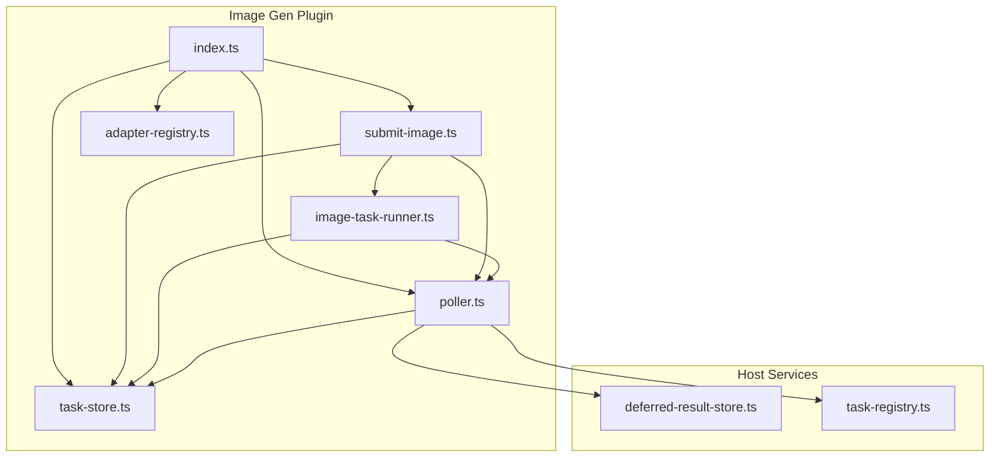
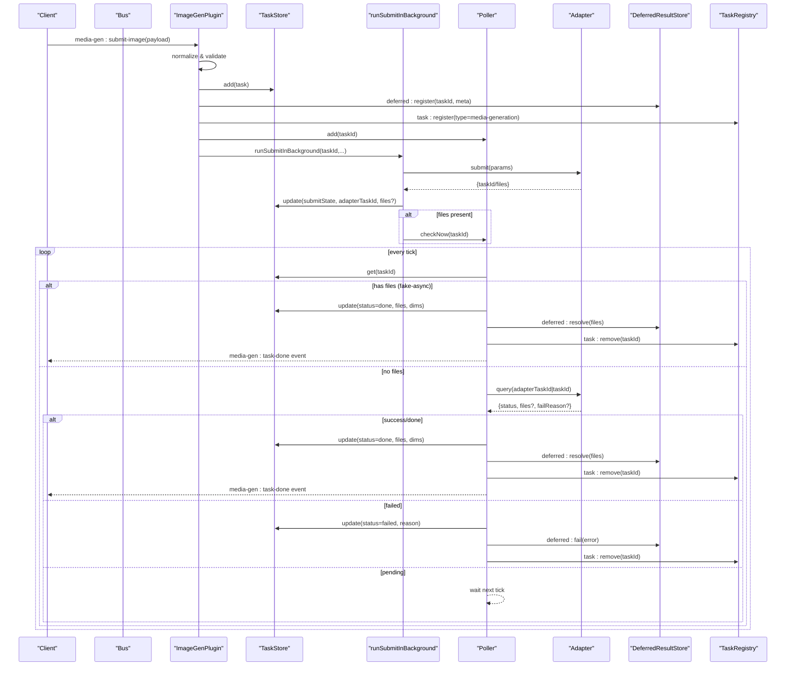
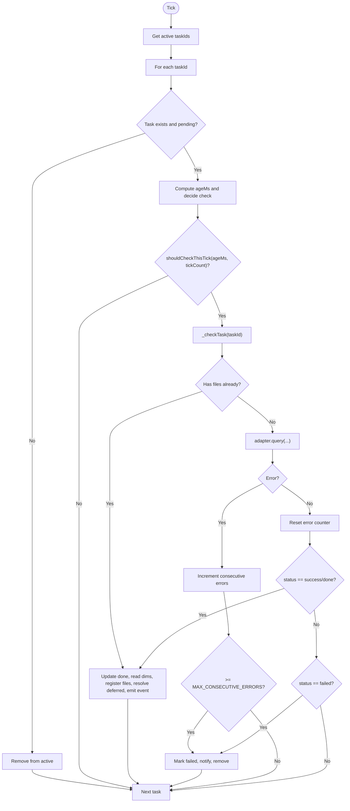
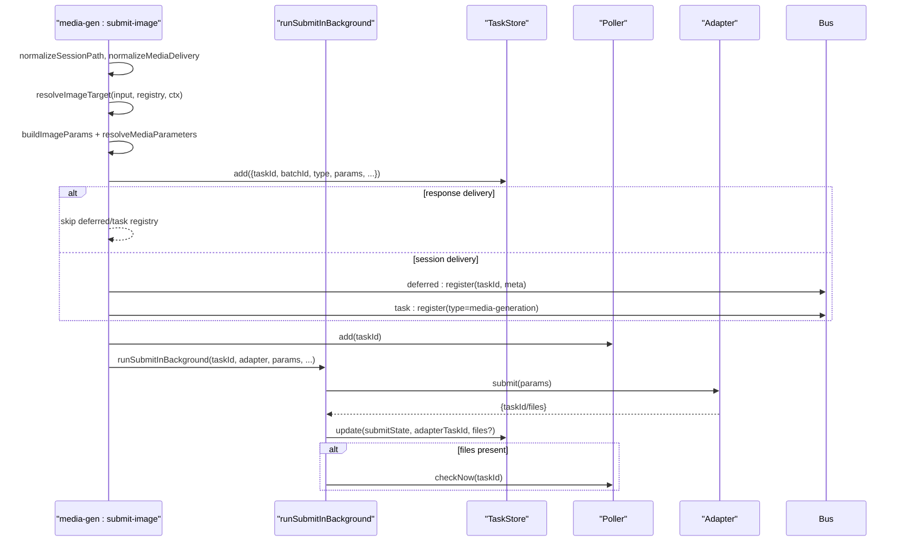

# Task Management

<cite>
**Referenced Files in This Document**
- [index.ts](file://plugins/image-gen/index.ts)
- [submit-image.ts](file://plugins/image-gen/lib/submit-image.ts)
- [image-task-runner.ts](file://plugins/image-gen/lib/image-task-runner.ts)
- [task-store.ts](file://plugins/image-gen/lib/task-store.ts)
- [poller.ts](file://plugins/image-gen/lib/poller.ts)
- [adapter-registry.ts](file://plugins/image-gen/lib/adapter-registry.ts)
- [deferred-result-store.ts](file://lib/deferred-result-store.ts)
- [task-registry.ts](file://lib/task-registry.ts)
</cite>

## Table of Contents
1. [Introduction](#introduction)
2. [Project Structure](#project-structure)
3. [Core Components](#core-components)
4. [Architecture Overview](#architecture-overview)
5. [Detailed Component Analysis](#detailed-component-analysis)
6. [Dependency Analysis](#dependency-analysis)
7. [Performance Considerations](#performance-considerations)
8. [Troubleshooting Guide](#troubleshooting-guide)
9. [Conclusion](#conclusion)
10. [Appendices](#appendices)

## Introduction
This document explains the end-to-end lifecycle of image generation tasks, focusing on the TaskStore, Poller, and submit-image workflow. It covers task states, status tracking, progress monitoring, asynchronous completion via polling, retry logic, error recovery, batch processing, prioritization, and resource management. The goal is to provide a clear mental model for both developers and operators integrating or extending the image generation subsystem.

## Project Structure
The image generation plugin wires together:
- A TaskStore for durable metadata (in-memory with debounced disk persistence).
- A Poller that periodically checks provider status and resolves tasks.
- A submit-image entry point that validates inputs, selects an adapter, persists tasks, and enqueues them for background submission and polling.
- Integration points with DeferredResultStore and TaskRegistry for cross-plugin visibility and delivery.



**Diagram sources**
- [index.ts:1-170](file://plugins/image-gen/index.ts#L1-L170)
- [submit-image.ts:1-139](file://plugins/image-gen/lib/submit-image.ts#L1-L139)
- [image-task-runner.ts:1-506](file://plugins/image-gen/lib/image-task-runner.ts#L1-L506)
- [task-store.ts:1-305](file://plugins/image-gen/lib/task-store.ts#L1-L305)
- [poller.ts:1-424](file://plugins/image-gen/lib/poller.ts#L1-L424)
- [adapter-registry.ts:1-2](file://plugins/image-gen/lib/adapter-registry.ts#L1-L2)
- [deferred-result-store.ts:1-319](file://lib/deferred-result-store.ts#L1-L319)
- [task-registry.ts:1-522](file://lib/task-registry.ts#L1-L522)

**Section sources**
- [index.ts:1-170](file://plugins/image-gen/index.ts#L1-L170)

## Core Components
- TaskStore: In-memory map of tasks with debounced atomic writes to disk; supports add/update/remove/list by filters; provides listPending for recovery.
- Poller: Background ticker with age-based smart intervals; handles fake-async detection, adapter query routing, cancellation fence, retry-on-error, and result delivery.
- Submit Image Workflow: Validates input, resolves target adapter/model, builds parameters, persists tasks, registers deferred results and task registry entries, enqueues background submission, and adds to poller.
- Adapter Registry: Resolves adapters by id or protocol; used by poller and submit flow.
- DeferredResultStore: Cross-plugin async result notification store with persistence, subscription, and cleanup.
- TaskRegistry: Host-level task visibility and abort/cancel coordination across plugins.

Key responsibilities and interactions are detailed in subsequent sections.

**Section sources**
- [task-store.ts:1-305](file://plugins/image-gen/lib/task-store.ts#L1-L305)
- [poller.ts:1-424](file://plugins/image-gen/lib/poller.ts#L1-L424)
- [submit-image.ts:1-139](file://plugins/image-gen/lib/submit-image.ts#L1-L139)
- [image-task-runner.ts:1-506](file://plugins/image-gen/lib/image-task-runner.ts#L1-L506)
- [adapter-registry.ts:1-2](file://plugins/image-gen/lib/adapter-registry.ts#L1-L2)
- [deferred-result-store.ts:1-319](file://lib/deferred-result-store.ts#L1-L319)
- [task-registry.ts:1-522](file://lib/task-registry.ts#L1-L522)

## Architecture Overview
The system separates concerns:
- Submission path: Input normalization, adapter selection, parameter resolution, persistence, registration, and enqueueing.
- Execution path: Asynchronous adapter.submit, optional immediate files (fake-async), and poller-driven status queries.
- Completion path: File discovery, dimension reading, session file registration, bus events, and deferred/result notifications.



**Diagram sources**
- [submit-image.ts:1-139](file://plugins/image-gen/lib/submit-image.ts#L1-L139)
- [image-task-runner.ts:367-390](file://plugins/image-gen/lib/image-task-runner.ts#L367-L390)
- [poller.ts:259-423](file://plugins/image-gen/lib/poller.ts#L259-L423)
- [task-store.ts:77-129](file://plugins/image-gen/lib/task-store.ts#L77-L129)
- [deferred-result-store.ts:59-101](file://lib/deferred-result-store.ts#L59-L101)
- [task-registry.ts:60-93](file://lib/task-registry.ts#L60-L93)

## Detailed Component Analysis

### TaskStore
- Purpose: Authoritative in-memory store of task metadata with debounced atomic JSON persistence for restart recovery.
- Key operations:
  - add: Creates a new task with normalized fields, defaults, timestamps, and initial status.
  - update: Merges partial updates and schedules save.
  - remove / removeUnfavorited: Deletes tasks and returns removed items for downstream cleanup.
  - listAll / listPending / getByBatch / getByAdapter: Query helpers returning shallow copies.
  - flushSync / destroy: Persistence control.
- Recovery: On construction, loads from disk, normalizes legacy fields, and rewrites if needed.

Operational notes:
- Debounce interval reduces disk I/O during bursts.
- Atomic write via tmp + rename ensures consistency.
- Non-fatal write errors do not break runtime state.

**Section sources**
- [task-store.ts:1-305](file://plugins/image-gen/lib/task-store.ts#L1-L305)

### Poller
- Purpose: Background worker that polls providers for task completion using age-based smart intervals and robust error handling.
- Lifecycle:
  - start: Recovers pending tasks, re-registers deferred/task registry entries, starts interval timer.
  - _tick: Iterates active tasks, decides whether to query based on age and tick count.
  - _checkTask: Handles fake-async, adapter lookup, query, cancellation fence, retries, and completion paths.
- Smart intervals:
  - < 2 minutes: every tick
  - 2–10 minutes: every 3rd tick
  - > 10 minutes: every 6th tick
- Error handling:
  - Tracks consecutive query errors per taskId; after threshold, marks task failed and notifies.
  - Cancellation fence prevents post-cancel side effects.
- Completion:
  - Reads image dimensions, registers generated files into session, emits media-gen:task-done, resolves deferred results, removes from task registry.



**Diagram sources**
- [poller.ts:259-423](file://plugins/image-gen/lib/poller.ts#L259-L423)

**Section sources**
- [poller.ts:1-424](file://plugins/image-gen/lib/poller.ts#L1-L424)

### Submit Image Workflow
- Entry: media-gen:submit-image handler constructs context, validates sessionPath, resolves target adapter/model, and builds parameters.
- Batch support:
  - count is clamped to [1, 9].
  - Each iteration creates a unique taskId but shares a batchId.
- Delivery modes:
  - response: Immediate return without deferred/task registry registration.
  - session: Registers deferred and task registry entries, uses bridgeDeliveryTarget when applicable.
- Background submission:
  - runSubmitInBackground calls adapter.submit, updates submitState and adapterTaskId, and triggers immediate check if files are returned.
- Retry:
  - retryImageTask validates eligibility, resets state, re-registers deferred/task registry, enqueues poller, and resubmits.



**Diagram sources**
- [submit-image.ts:25-139](file://plugins/image-gen/lib/submit-image.ts#L25-L139)
- [image-task-runner.ts:367-390](file://plugins/image-gen/lib/image-task-runner.ts#L367-L390)
- [task-store.ts:77-129](file://plugins/image-gen/lib/task-store.ts#L77-L129)
- [poller.ts:195-204](file://plugins/image-gen/lib/poller.ts#L195-L204)

**Section sources**
- [submit-image.ts:1-139](file://plugins/image-gen/lib/submit-image.ts#L1-L139)
- [image-task-runner.ts:1-506](file://plugins/image-gen/lib/image-task-runner.ts#L1-L506)

### Adapter Resolution and Reference Image Limits
- Target resolution order:
  - Explicit provider/model via media providers.
  - Configured default model.
  - First available provider with credentials and registered protocol.
  - Legacy adapter fallback.
- Validation:
  - Rejects mode IDs passed as model.
  - Enforces reference image limits per adapter capability.

**Section sources**
- [image-task-runner.ts:211-349](file://plugins/image-gen/lib/image-task-runner.ts#L211-L349)
- [image-task-runner.ts:104-114](file://plugins/image-gen/lib/image-task-runner.ts#L104-L114)

### Deferred Result and Task Registry Integration
- DeferredResultStore:
  - defer/resolve/fail/retry/abort methods persist state and emit bus events.
  - Supports suppression and delivery marking.
- TaskRegistry:
  - Provides host-wide visibility and abort/cancel semantics.
  - Image gen plugin registers a handler for type "media-generation" whose abort delegates to poller.cancel.

**Section sources**
- [deferred-result-store.ts:1-319](file://lib/deferred-result-store.ts#L1-L319)
- [task-registry.ts:1-522](file://lib/task-registry.ts#L1-L522)
- [index.ts:150-165](file://plugins/image-gen/index.ts#L150-L165)

## Dependency Analysis
- Coupling:
  - submit-image depends on TaskStore, Poller, AdapterRegistry, and bus for deferred/task registry integration.
  - Poller depends on TaskStore, AdapterRegistry, and bus for notifications.
  - index.ts orchestrates plugin lifecycle, wiring handlers and starting the poller.
- External dependencies:
  - Adapter implementations (e.g., OpenAI, Volcengine, Gemini) are resolved at runtime via registry.
  - Host services (DeferredResultStore, TaskRegistry) provide cross-plugin coordination.

```mermaid
classDiagram
class TaskStore {
+add(opts)
+update(taskId, patch)
+remove(taskId) bool
+get(taskId) object|null
+listAll() object[]
+listPending() object[]
+getByBatch(batchId) object[]
+getByAdapter(adapterId) object[]
+removeUnfavorited() object[]
+flushSync() void
+destroy() void
}
class Poller {
+start() void
+stop() void
+add(taskId) void
+hasPending(taskId) bool
+cancel(taskId) void
+checkNow(taskId) Promise<void>
-_tick() void
-_checkTask(taskId, task) Promise<void>
}
class SubmitImage {
+submitImageGeneration({input, ctx, metadata, deliveryTarget}) Promise<object>
}
class ImageTaskRunner {
+createTaskId() string
+normalizeMediaDelivery(value) object
+isResponseDelivery(value) bool
+buildImageParams(input) object
+assertAdapterReferenceImageLimit(adapter, params) void
+runSubmitInBackground({taskId, adapter, params, submitCtx, store, poller, ctx}) Promise<void>
+retryImageTask({taskId, ctx}) Promise<object>
}
class AdapterRegistry {
+get(id) adapter
+getProtocol(protocolId) adapter
+list() adapter[]
}
class DeferredResultStore {
+defer(taskId, sessionPath, meta) void
+resolve(taskId, result) void
+fail(taskId, reason) void
+retry(taskId, sessionPath, meta) void
+abort(taskId, reason) void
}
class TaskRegistry {
+register(taskId, opts) object
+update(taskId, patch) object
+complete(taskId, result) object
+fail(taskId, error) object
+cancel(taskId, reason) object
+abort(taskId, reason) string
+remove(taskId) void
}
SubmitImage --> TaskStore : "persists tasks"
SubmitImage --> Poller : "enqueues polling"
SubmitImage --> AdapterRegistry : "resolves adapter"
SubmitImage --> DeferredResultStore : "registers deferred"
SubmitImage --> TaskRegistry : "registers task"
ImageTaskRunner --> TaskStore : "updates submitState"
ImageTaskRunner --> Poller : "immediate check"
Poller --> TaskStore : "reads/updates"
Poller --> AdapterRegistry : "queries adapter"
Poller --> DeferredResultStore : "resolve/fail"
Poller --> TaskRegistry : "remove"
```

**Diagram sources**
- [task-store.ts:1-305](file://plugins/image-gen/lib/task-store.ts#L1-L305)
- [poller.ts:1-424](file://plugins/image-gen/lib/poller.ts#L1-L424)
- [submit-image.ts:1-139](file://plugins/image-gen/lib/submit-image.ts#L1-L139)
- [image-task-runner.ts:1-506](file://plugins/image-gen/lib/image-task-runner.ts#L1-L506)
- [adapter-registry.ts:1-2](file://plugins/image-gen/lib/adapter-registry.ts#L1-L2)
- [deferred-result-store.ts:1-319](file://lib/deferred-result-store.ts#L1-L319)
- [task-registry.ts:1-522](file://lib/task-registry.ts#L1-L522)

**Section sources**
- [index.ts:1-170](file://plugins/image-gen/index.ts#L1-L170)

## Performance Considerations
- Debounced persistence: TaskStore batches writes to reduce disk I/O under load.
- Smart polling intervals: Poller adapts frequency based on task age to balance responsiveness and overhead.
- Fake-async optimization: If adapter returns files synchronously, Poller bypasses further queries and completes immediately.
- Concurrency: Poller iterates active tasks per tick; consider limiting concurrent adapter queries if adapters impose rate limits.
- Cleanup: removeUnfavorited helps reclaim storage by removing completed non-favorited tasks.

[No sources needed since this section provides general guidance]

## Troubleshooting Guide
Common issues and strategies:
- Not initialized: Ensure media runtime components (registry, store, poller) are attached to ctx before calling submit functions.
- No session path: For session delivery, a valid sessionPath is required; otherwise use response delivery.
- Provider unavailable: Adapter resolution may fail due to missing credentials or unregistered protocols; verify provider configuration and adapter registration.
- Model not found or ambiguous: When specifying model, ensure it maps to a single provider; otherwise, specify provider explicitly.
- Reference image limit exceeded: Adapters may enforce maximum reference images; adjust input accordingly.
- Persistent failures: Poller retries up to a threshold; beyond that, tasks are marked failed with reasons logged. Inspect logs and adapter responses.
- Cancellations: Use poller.cancel or TaskRegistry.abort to stop in-flight work; ensure deferred/task registry entries are cleaned up.

**Section sources**
- [submit-image.ts:17-32](file://plugins/image-gen/lib/submit-image.ts#L17-L32)
- [image-task-runner.ts:196-209](file://plugins/image-gen/lib/image-task-runner.ts#L196-L209)
- [poller.ts:354-372](file://plugins/image-gen/lib/poller.ts#L354-L372)

## Conclusion
The image generation task system combines a resilient TaskStore, an adaptive Poller, and a robust submit-image workflow to manage asynchronous image creation across multiple providers. It supports batch submissions, explicit retry, cancellation, and cross-plugin visibility through DeferredResultStore and TaskRegistry. By leveraging smart polling, fake-async detection, and debounced persistence, the system balances performance and reliability while providing clear operational hooks for monitoring and troubleshooting.

[No sources needed since this section summarizes without analyzing specific files]

## Appendices

### Example Workflows (Conceptual)
- Submit a single image:
  - Call media-gen:submit-image with prompt, optional provider/model, and sessionPath.
  - Receive batchId and taskId; monitor via deferred events or poller events.
- Batch generate multiple images:
  - Set count > 1; each task shares batchId; track all tasks by batch.
- Check status and retrieve results:
  - Listen for media-gen:task-done events or query TaskStore by taskId/batchId.
- Cancel a task:
  - Invoke poller.cancel or TaskRegistry.abort; expect deferred:abort and task:remove.
- Retry a failed task:
  - Use retryImageTask if eligible; ensures re-registration and resubmission.

[No sources needed since this section doesn't analyze specific files]