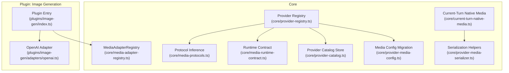
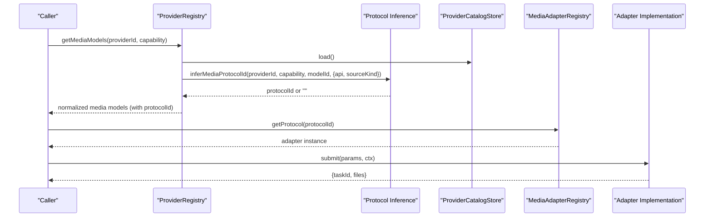
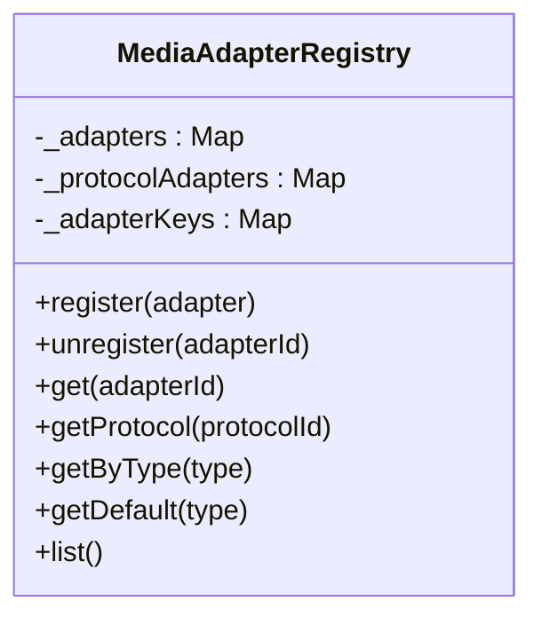
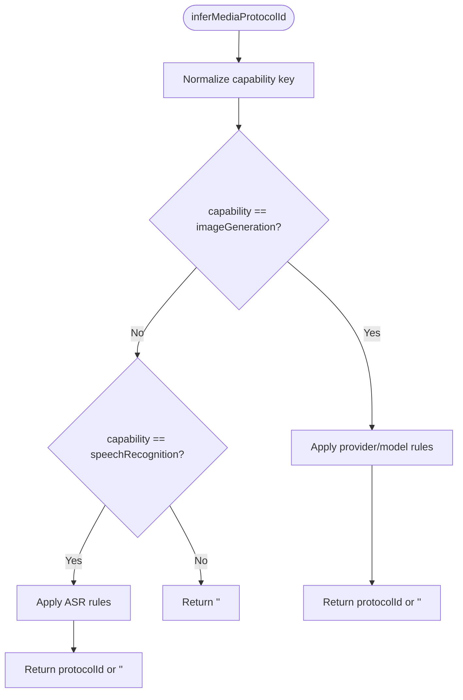
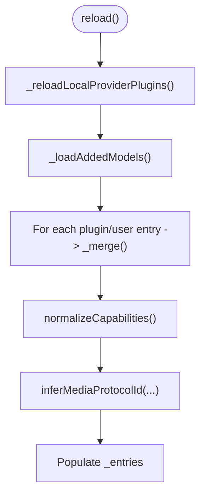
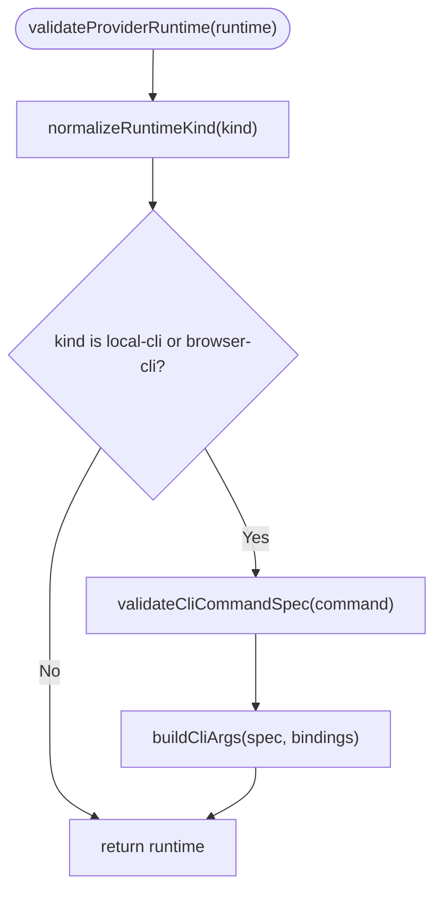
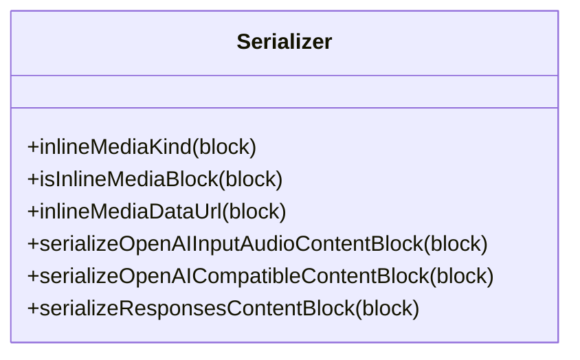
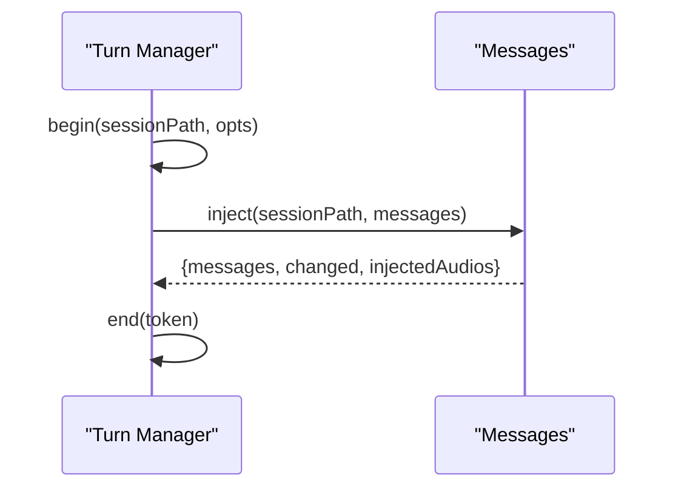
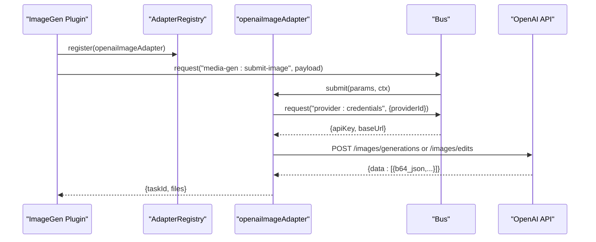
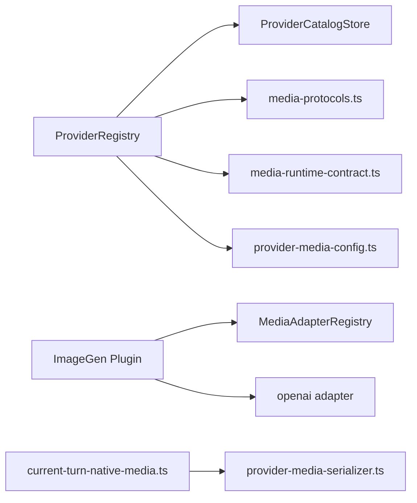

# Media Adapters & Providers

<cite>
**Referenced Files in This Document**
- [media-adapter-registry.ts](file://core/media-adapter-registry.ts)
- [media-protocols.ts](file://core/media-protocols.ts)
- [media-runtime-contract.ts](file://core/media-runtime-contract.ts)
- [provider-media-config.ts](file://core/provider-media-config.ts)
- [provider-media-serializer.ts](file://core/provider-media-serializer.ts)
- [provider-registry.ts](file://core/provider-registry.ts)
- [provider-catalog.ts](file://core/provider-catalog.ts)
- [current-turn-native-media.ts](file://core/current-turn-native-media.ts)
- [index.ts](file://plugins/image-gen/index.ts)
- [openai.ts](file://plugins/image-gen/adapters/openai.ts)
</cite>

## Table of Contents
1. [Introduction](#introduction)
2. [Project Structure](#project-structure)
3. [Core Components](#core-components)
4. [Architecture Overview](#architecture-overview)
5. [Detailed Component Analysis](#detailed-component-analysis)
6. [Dependency Analysis](#dependency-analysis)
7. [Performance Considerations](#performance-considerations)
8. [Troubleshooting Guide](#troubleshooting-guide)
9. [Conclusion](#conclusion)
10. [Appendices](#appendices)

## Introduction
This document explains the media adapter architecture and provider integration for extending media processing capabilities. It covers:
- The MediaAdapterRegistry system for discovering and executing media adapters by protocol and type
- Adapter interface contracts and lifecycle management
- Provider configuration management, including capability normalization and credential lanes
- Protocol definitions and serialization formats for cross-platform compatibility
- Practical examples for creating custom adapters, registering providers, and implementing provider-specific authentication
- Error handling patterns, testing strategies, security considerations, rate limiting, and fallback mechanisms

## Project Structure
The media subsystem spans core runtime modules and a plugin-based image generation module that demonstrates concrete adapters and orchestration.

**Diagram sources**
- [media-adapter-registry.ts:1-79](file://core/media-adapter-registry.ts#L1-L79)
- [media-protocols.ts:1-78](file://core/media-protocols.ts#L1-L78)
- [media-runtime-contract.ts:1-91](file://core/media-runtime-contract.ts#L1-L91)
- [provider-registry.ts:1-800](file://core/provider-registry.ts#L1-L800)
- [provider-catalog.ts:1-235](file://core/provider-catalog.ts#L1-L235)
- [provider-media-config.ts:1-129](file://core/provider-media-config.ts#L1-L129)
- [provider-media-serializer.ts:1-76](file://core/provider-media-serializer.ts#L1-L76)
- [current-turn-native-media.ts:1-168](file://core/current-turn-native-media.ts#L1-L168)
- [index.ts:1-170](file://plugins/image-gen/index.ts#L1-L170)
- [openai.ts:1-257](file://plugins/image-gen/adapters/openai.ts#L1-L257)

**Section sources**
- [media-adapter-registry.ts:1-79](file://core/media-adapter-registry.ts#L1-L79)
- [media-protocols.ts:1-78](file://core/media-protocols.ts#L1-L78)
- [media-runtime-contract.ts:1-91](file://core/media-runtime-contract.ts#L1-L91)
- [provider-registry.ts:1-800](file://core/provider-registry.ts#L1-L800)
- [provider-catalog.ts:1-235](file://core/provider-catalog.ts#L1-L235)
- [provider-media-config.ts:1-129](file://core/provider-media-config.ts#L1-L129)
- [provider-media-serializer.ts:1-76](file://core/provider-media-serializer.ts#L1-L76)
- [current-turn-native-media.ts:1-168](file://core/current-turn-native-media.ts#L1-L168)
- [index.ts:1-170](file://plugins/image-gen/index.ts#L1-L170)
- [openai.ts:1-257](file://plugins/image-gen/adapters/openai.ts#L1-L257)

## Core Components
- MediaAdapterRegistry: Central registry mapping adapter ids, aliases, and protocolIds to adapter implementations; supports listing, lookup by type, default selection, and unregistration.
- Protocol inference: Canonicalizes capability names and infers protocolId from provider context (provider id, model id, api, source kind).
- Runtime contract: Validates provider runtime kinds and CLI command specs, builds CLI args with structured bindings, and enforces output contracts.
- Provider registry: Merges built-in plugins, local provider plugins, and user catalog entries into normalized ProviderEntry objects; normalizes media capabilities, models, and credential lanes; resolves chat and media model lists.
- Provider catalog store: Persists provider configurations and capabilities, migrates legacy formats, and provides atomic writes and backups.
- Media config migration: Normalizes legacy added-models.yaml into modern media.image_generation structures and infers protocolId where possible.
- Serialization helpers: Converts canonical content blocks (image/video/audio) into OpenAI-compatible shapes and input_audio blocks.
- Current-turn native media: Injects audio blocks into messages based on markers during a session turn.

**Section sources**
- [media-adapter-registry.ts:1-79](file://core/media-adapter-registry.ts#L1-L79)
- [media-protocols.ts:1-78](file://core/media-protocols.ts#L1-L78)
- [media-runtime-contract.ts:1-91](file://core/media-runtime-contract.ts#L1-L91)
- [provider-registry.ts:1-800](file://core/provider-registry.ts#L1-L800)
- [provider-catalog.ts:1-235](file://core/provider-catalog.ts#L1-L235)
- [provider-media-config.ts:1-129](file://core/provider-media-config.ts#L1-L129)
- [provider-media-serializer.ts:1-76](file://core/provider-media-serializer.ts#L1-L76)
- [current-turn-native-media.ts:1-168](file://core/current-turn-native-media.ts#L1-L168)

## Architecture Overview
The system separates concerns across three layers:
- Capability and protocol layer: Defines canonical capability keys and infers protocolId per provider/model context.
- Provider configuration layer: Loads, validates, and merges provider declarations and user overrides into normalized entries with media capabilities and credential lanes.
- Execution layer: Uses adapters registered by protocolId/type to execute media tasks, serialize inputs, and persist outputs.

**Diagram sources**
- [provider-registry.ts:758-770](file://core/provider-registry.ts#L758-L770)
- [media-protocols.ts:47-77](file://core/media-protocols.ts#L47-L77)
- [provider-catalog.ts:105-148](file://core/provider-catalog.ts#L105-L148)
- [media-adapter-registry.ts:42-48](file://core/media-adapter-registry.ts#L42-L48)
- [openai.ts:116-254](file://plugins/image-gen/adapters/openai.ts#L116-L254)

## Detailed Component Analysis

### MediaAdapterRegistry
Responsibilities:
- Register/unregister adapters by id and alias
- Map protocolId(s) to adapters
- Lookup by type and provide defaults
- List all unique adapters

Key behaviors:
- Validation requires adapter.id
- Supports single or multiple protocolIds
- Deduplicates adapters when listing

**Diagram sources**
- [media-adapter-registry.ts:8-77](file://core/media-adapter-registry.ts#L8-L77)

**Section sources**
- [media-adapter-registry.ts:1-79](file://core/media-adapter-registry.ts#L1-L79)

### Protocol Definitions and Inference
Canonical capability keys map snake_case/camelCase variants to stable identifiers. The inference function determines protocolId based on provider id, model id, api, and source kind.

Highlights:
- Capability normalization via MEDIA_CAPABILITY_KEYS
- Special handling for OpenAI-compatible APIs and user-defined providers
- Returns empty string when no rule applies, forcing explicit handling upstream

**Diagram sources**
- [media-protocols.ts:10-25](file://core/media-protocols.ts#L10-L25)
- [media-protocols.ts:47-77](file://core/media-protocols.ts#L47-L77)

**Section sources**
- [media-protocols.ts:1-78](file://core/media-protocols.ts#L1-L78)

### Provider Configuration Management
The ProviderRegistry orchestrates:
- Loading built-in plugins and local provider plugins
- Validating runtime contracts
- Merging user catalog overlays
- Normalizing capabilities and media models
- Resolving credential lanes and status

Important flows:
- reload(): rebuilds entries from plugins and catalog
- normalizeCapabilities(): maps raw media capabilities to canonical keys and infers protocolId
- getMediaModels(): returns merged declared + user models with protocolId resolution
- getMediaCredentialLanes(): returns lanes for multi-credential scenarios

**Diagram sources**
- [provider-registry.ts:640-689](file://core/provider-registry.ts#L640-L689)
- [provider-registry.ts:237-255](file://core/provider-registry.ts#L237-L255)
- [provider-registry.ts:758-770](file://core/provider-registry.ts#L758-L770)
- [media-protocols.ts:47-77](file://core/media-protocols.ts#L47-L77)

**Section sources**
- [provider-registry.ts:1-800](file://core/provider-registry.ts#L1-L800)
- [provider-catalog.ts:1-235](file://core/provider-catalog.ts#L1-L235)
- [provider-media-config.ts:1-129](file://core/provider-media-config.ts#L1-L129)

### Runtime Contract and CLI Bindings
Validates provider runtime kinds and CLI command specifications:
- Supported runtime kinds: http, oauth-http, local-cli, browser-cli, plugin
- CLI spec validation: executable, structured args, binding sources, output contract, timeoutMs
- buildCliArgs: constructs arguments from literal values and option bindings

**Diagram sources**
- [media-runtime-contract.ts:16-22](file://core/media-runtime-contract.ts#L16-L22)
- [media-runtime-contract.ts:24-63](file://core/media-runtime-contract.ts#L24-L63)
- [media-runtime-contract.ts:77-90](file://core/media-runtime-contract.ts#L77-L90)

**Section sources**
- [media-runtime-contract.ts:1-91](file://core/media-runtime-contract.ts#L1-L91)

### Serialization Formats and Cross-Platform Compatibility
Converts canonical content blocks into provider-compatible payloads:
- inlineMediaDataUrl: base64 data URLs with MIME detection
- serializeOpenAIInputAudioContentBlock: maps audio to input_audio format
- serializeOpenAICompatibleContentBlock: text, image_url, input_audio
- serializeResponsesContentBlock: input_text, input_image, input_audio

**Diagram sources**
- [provider-media-serializer.ts:21-75](file://core/provider-media-serializer.ts#L21-L75)

**Section sources**
- [provider-media-serializer.ts:1-76](file://core/provider-media-serializer.ts#L1-L76)

### Current-Turn Native Media Injection
Injects audio blocks into the latest user message when markers are present:
- begin/end lifecycle per session turn
- inject scans messages for attached_audio markers and appends matching audio blocks
- path normalization ensures cross-platform matching

**Diagram sources**
- [current-turn-native-media.ts:5-89](file://core/current-turn-native-media.ts#L5-L89)
- [current-turn-native-media.ts:92-167](file://core/current-turn-native-media.ts#L92-L167)

**Section sources**
- [current-turn-native-media.ts:1-168](file://core/current-turn-native-media.ts#L1-L168)

### Example: OpenAI Image Adapter
Demonstrates an adapter implementation:
- Declares id, protocolId, types, and capabilities
- Implements checkAuth and submit
- Handles parameter translation, size/ratio resolution, multipart uploads, and file saving

**Diagram sources**
- [index.ts:52-107](file://plugins/image-gen/index.ts#L52-L107)
- [openai.ts:94-256](file://plugins/image-gen/adapters/openai.ts#L94-L256)

**Section sources**
- [index.ts:1-170](file://plugins/image-gen/index.ts#L1-L170)
- [openai.ts:1-257](file://plugins/image-gen/adapters/openai.ts#L1-L257)

## Dependency Analysis
High-level dependencies between components:

**Diagram sources**
- [provider-registry.ts:1-800](file://core/provider-registry.ts#L1-L800)
- [provider-catalog.ts:1-235](file://core/provider-catalog.ts#L1-L235)
- [media-protocols.ts:1-78](file://core/media-protocols.ts#L1-L78)
- [media-runtime-contract.ts:1-91](file://core/media-runtime-contract.ts#L1-L91)
- [provider-media-config.ts:1-129](file://core/provider-media-config.ts#L1-L129)
- [index.ts:1-170](file://plugins/image-gen/index.ts#L1-L170)
- [media-adapter-registry.ts:1-79](file://core/media-adapter-registry.ts#L1-L79)
- [openai.ts:1-257](file://plugins/image-gen/adapters/openai.ts#L1-L257)
- [current-turn-native-media.ts:1-168](file://core/current-turn-native-media.ts#L1-L168)
- [provider-media-serializer.ts:1-76](file://core/provider-media-serializer.ts#L1-L76)

**Section sources**
- [provider-registry.ts:1-800](file://core/provider-registry.ts#L1-L800)
- [provider-catalog.ts:1-235](file://core/provider-catalog.ts#L1-L235)
- [media-protocols.ts:1-78](file://core/media-protocols.ts#L1-L78)
- [media-runtime-contract.ts:1-91](file://core/media-runtime-contract.ts#L1-L91)
- [provider-media-config.ts:1-129](file://core/provider-media-config.ts#L1-L129)
- [index.ts:1-170](file://plugins/image-gen/index.ts#L1-L170)
- [media-adapter-registry.ts:1-79](file://core/media-adapter-registry.ts#L1-L79)
- [openai.ts:1-257](file://plugins/image-gen/adapters/openai.ts#L1-L257)
- [current-turn-native-media.ts:1-168](file://core/current-turn-native-media.ts#L1-L168)
- [provider-media-serializer.ts:1-76](file://core/provider-media-serializer.ts#L1-L76)

## Performance Considerations
- ProviderRegistry caches mtime for added models and auth JSON to avoid repeated disk reads.
- Atomic writes ensure safe persistence without partial corruption.
- Deduplication in registries prevents redundant adapter instances.
- Streaming support in adapters reduces latency for large responses.

[No sources needed since this section provides general guidance]

## Troubleshooting Guide
Common issues and resolutions:
- Missing protocolId: Ensure inferMediaProtocolId can resolve a protocolId for the provider/model pair, or explicitly set protocolId in model declaration.
- Invalid runtime spec: Validate runtime.kind and CLI command spec fields; ensure positive timeoutMs and supported output kinds.
- Credential errors: Use getMediaCredentialLanes and getMediaProviderCredentialStatus to diagnose missing or misconfigured credentials.
- Serialization failures: Verify MIME types and base64 data for inline media blocks; use provided serializers to convert to OpenAI-compatible shapes.
- Adapter not found: Confirm registration via list() and correct protocolId mapping; check alias usage.

**Section sources**
- [provider-registry.ts:758-800](file://core/provider-registry.ts#L758-L800)
- [media-runtime-contract.ts:16-63](file://core/media-runtime-contract.ts#L16-L63)
- [provider-media-serializer.ts:41-75](file://core/provider-media-serializer.ts#L41-L75)
- [media-adapter-registry.ts:68-77](file://core/media-adapter-registry.ts#L68-L77)

## Conclusion
The media adapter architecture cleanly separates protocol inference, provider configuration, and execution. By standardizing capability keys, validating runtime contracts, and providing robust serialization helpers, it enables extensible media processing across diverse providers. The example OpenAI adapter illustrates how to implement provider-specific logic while leveraging shared infrastructure for credentials, task management, and persistence.

[No sources needed since this section summarizes without analyzing specific files]

## Appendices

### Creating a Custom Media Adapter
Steps:
- Implement an adapter object with id, protocolId, types, capabilities, checkAuth, and submit methods
- Register the adapter using the registry’s register method
- Optionally expose bus handlers for dynamic registration/unregistration

References:
- [index.ts:52-85](file://plugins/image-gen/index.ts#L52-L85)
- [openai.ts:94-114](file://plugins/image-gen/adapters/openai.ts#L94-L114)

**Section sources**
- [index.ts:1-170](file://plugins/image-gen/index.ts#L1-L170)
- [openai.ts:1-257](file://plugins/image-gen/adapters/openai.ts#L1-L257)

### Registering New Providers
Approach:
- Add provider declarations in the catalog or as a local provider plugin
- Ensure runtime is validated and capabilities include media sections with models
- Use getMediaModels and getMediaCredentialLanes to verify configuration

References:
- [provider-registry.ts:640-689](file://core/provider-registry.ts#L640-L689)
- [provider-catalog.ts:144-168](file://core/provider-catalog.ts#L144-L168)

**Section sources**
- [provider-registry.ts:1-800](file://core/provider-registry.ts#L1-L800)
- [provider-catalog.ts:1-235](file://core/provider-catalog.ts#L1-L235)

### Implementing Provider-Specific Authentication
Patterns:
- Use checkAuth to validate credentials via bus requests
- Handle missing or invalid keys gracefully and return diagnostic messages
- Support multiple credential lanes for multi-account scenarios

References:
- [openai.ts:104-114](file://plugins/image-gen/adapters/openai.ts#L104-L114)
- [provider-registry.ts:772-789](file://core/provider-registry.ts#L772-L789)

**Section sources**
- [openai.ts:1-257](file://plugins/image-gen/adapters/openai.ts#L1-L257)
- [provider-registry.ts:772-789](file://core/provider-registry.ts#L772-L789)

### Adapter Lifecycle Management
Lifecycle:
- Registration at plugin load time
- Dynamic registration/unregistration via bus handlers
- Cleanup on plugin unload

References:
- [index.ts:63-81](file://plugins/image-gen/index.ts#L63-L81)
- [index.ts:160-165](file://plugins/image-gen/index.ts#L160-L165)

**Section sources**
- [index.ts:1-170](file://plugins/image-gen/index.ts#L1-L170)

### Testing Strategies for Custom Implementations
Recommendations:
- Unit test protocol inference with various provider/model combinations
- Validate runtime contracts and CLI argument building with edge cases
- Mock bus requests for credentials and external services
- Assert serialized content blocks match expected provider formats

References:
- [media-protocols.ts:47-77](file://core/media-protocols.ts#L47-L77)
- [media-runtime-contract.ts:77-90](file://core/media-runtime-contract.ts#L77-L90)
- [provider-media-serializer.ts:56-75](file://core/provider-media-serializer.ts#L56-L75)

**Section sources**
- [media-protocols.ts:1-78](file://core/media-protocols.ts#L1-L78)
- [media-runtime-contract.ts:1-91](file://core/media-runtime-contract.ts#L1-L91)
- [provider-media-serializer.ts:1-76](file://core/provider-media-serializer.ts#L1-L76)

### Security Considerations
Guidelines:
- Validate all provider runtime specs and CLI commands before execution
- Sanitize headers and base URLs; prefer OAuth where available
- Limit network access through sandbox policies and audit logs
- Redact sensitive information in logs and error messages

References:
- [media-runtime-contract.ts:16-63](file://core/media-runtime-contract.ts#L16-L63)
- [provider-registry.ts:673-689](file://core/provider-registry.ts#L673-L689)

**Section sources**
- [media-runtime-contract.ts:1-91](file://core/media-runtime-contract.ts#L1-L91)
- [provider-registry.ts:1-800](file://core/provider-registry.ts#L1-L800)

### Rate Limiting and Fallback Mechanisms
Practices:
- Implement retry with exponential backoff for transient errors
- Use circuit breaker patterns to fail fast when providers are unavailable
- Provide fallback adapters or alternative providers via capability resolution

[No sources needed since this section provides general guidance]