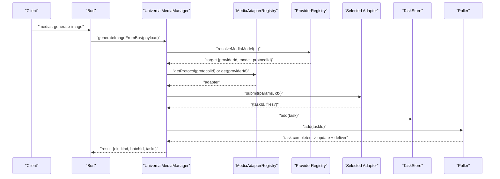
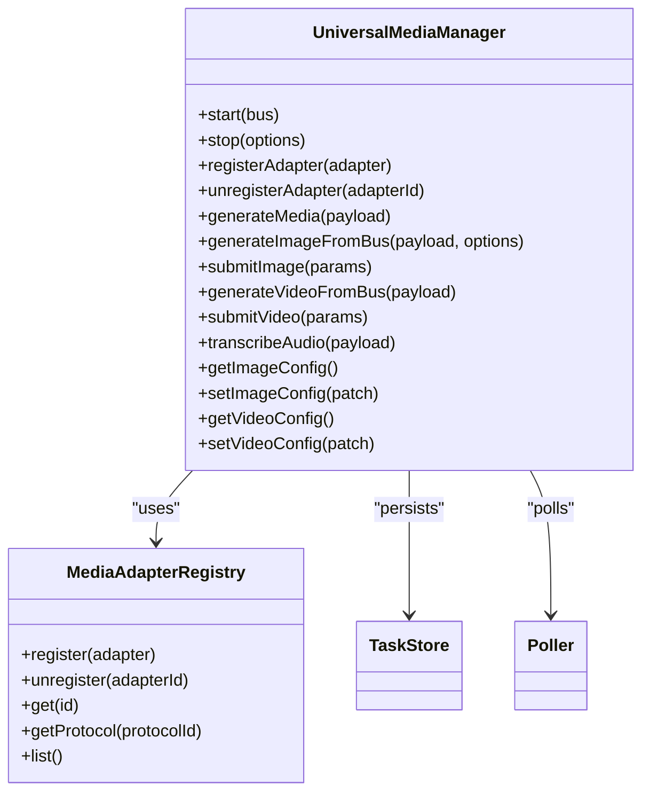
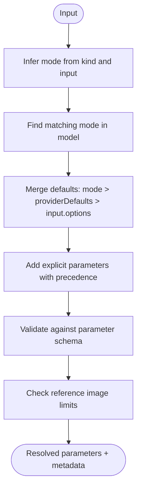
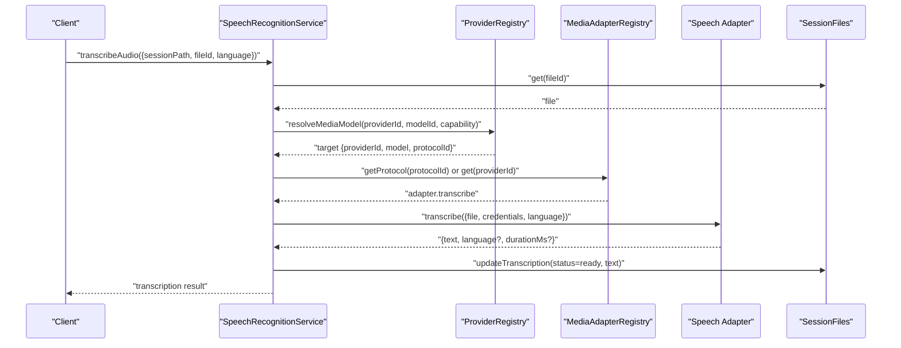
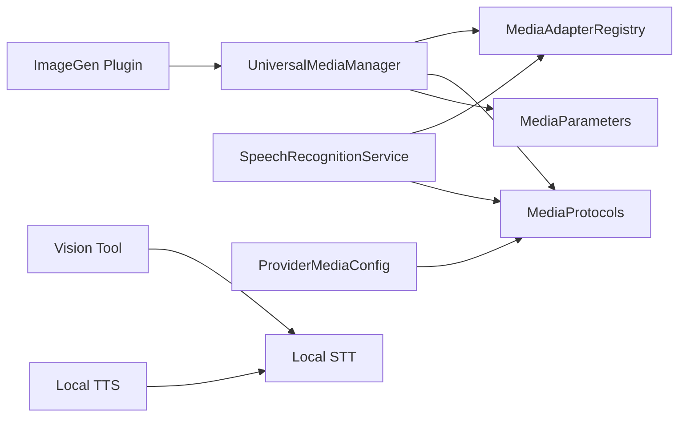

# Media Processing

<cite>
**Referenced Files in This Document**
- [universal-media-manager.ts](file://core/media/universal-media-manager.ts)
- [media-parameters.ts](file://core/media/media-parameters.ts)
- [media-adapter-registry.ts](file://core/media-adapter-registry.ts)
- [media-protocols.ts](file://core/media-protocols.ts)
- [media-runtime-contract.ts](file://core/media-runtime-contract.ts)
- [speech-recognition-service.ts](file://core/speech-recognition-service.ts)
- [adapters.ts](file://core/speech-recognition/adapters.ts)
- [stt.ts](file://core/stt.ts)
- [tts.ts](file://core/tts.ts)
- [vision.ts](file://core/tools/vision.ts)
- [provider-media-config.ts](file://core/provider-media-config.ts)
- [index.ts](file://plugins/image-gen/index.ts)
</cite>

## Table of Contents
1. [Introduction](#introduction)
2. [Project Structure](#project-structure)
3. [Core Components](#core-components)
4. [Architecture Overview](#architecture-overview)
5. [Detailed Component Analysis](#detailed-component-analysis)
6. [Dependency Analysis](#dependency-analysis)
7. [Performance Considerations](#performance-considerations)
8. [Troubleshooting Guide](#troubleshooting-guide)
9. [Conclusion](#conclusion)
10. [Appendices](#appendices)

## Introduction
This document explains the multi-modal media processing capabilities of the system, focusing on:
- Image generation from text prompts and image inputs
- Audio transcription (speech-to-text) via multiple providers
- Text-to-speech using local system tools
- Video generation workflows
- Vision capabilities for image analysis and document parsing
- Universal media management, format support, storage, caching, and performance optimization
- Custom adapter development and integration with external services

The architecture is designed around a universal media manager that coordinates provider adapters, task persistence, polling, and delivery to sessions or responses.

## Project Structure
Media-related functionality is implemented across core modules and a plugin:
- Core media runtime and parameter resolution
- Speech recognition service and adapters
- Local STT/TTS utilities
- Vision tooling for screenshot-based analysis
- Provider configuration migration for media models
- Plugin entrypoint for image generation fallback/runtime

```mermaid
graph TB
subgraph "Core"
UMM["UniversalMediaManager<br/>(core/media/universal-media-manager.ts)"]
MAP["MediaAdapterRegistry<br/>(core/media-adapter-registry.ts)]
MPR["MediaProtocols<br/>(core/media-protocols.ts)"]
MPC["ProviderMediaConfig<br/>(core/provider-media-config.ts)"]
SRV["SpeechRecognitionService<br/>(core/speech-recognition-service.ts)"]
ADP["Speech Adapters<br/>(core/speech-recognition/adapters.ts)"]
STT["Local STT<br/>(core/stt.ts)"]
TTS["Local TTS<br/>(core/tts.ts)"]
VSN["Vision Tool<br/>(core/tools/vision.ts)"]
MRC["Runtime Contract<br/>(core/media-runtime-contract.ts)"]
MPAR["Media Parameters<br/>(core/media/media-parameters.ts)"]
end
subgraph "Plugin"
IGP["ImageGen Plugin<br/>(plugins/image-gen/index.ts)"]
end
UMM --> MAP
UMM --> MPR
UMM --> MPC
UMM --> MPAR
UMM --> IGP
SRV --> ADP
SRV --> MPC
SRV --> MPR
IGP --> UMM
VSN --> STT
TTS --> STT
MRC --> UMM
```

**Diagram sources**
- [universal-media-manager.ts:244-332](file://core/media/universal-media-manager.ts#L244-L332)
- [media-adapter-registry.ts:8-78](file://core/media-adapter-registry.ts#L8-L78)
- [media-protocols.ts:9-77](file://core/media-protocols.ts#L9-L77)
- [provider-media-config.ts:64-128](file://core/provider-media-config.ts#L64-L128)
- [speech-recognition-service.ts:8-77](file://core/speech-recognition-service.ts#L8-L77)
- [adapters.ts:141-146](file://core/speech-recognition/adapters.ts#L141-L146)
- [stt.ts:106-111](file://core/stt.ts#L106-L111)
- [tts.ts:138-143](file://core/tts.ts#L138-L143)
- [vision.ts:34-109](file://core/tools/vision.ts#L34-L109)
- [media-runtime-contract.ts:16-75](file://core/media-runtime-contract.ts#L16-L75)
- [media-parameters.ts:187-219](file://core/media/media-parameters.ts#L187-L219)
- [index.ts:15-169](file://plugins/image-gen/index.ts#L15-L169)

**Section sources**
- [universal-media-manager.ts:244-332](file://core/media/universal-media-manager.ts#L244-L332)
- [media-adapter-registry.ts:8-78](file://core/media-adapter-registry.ts#L8-L78)
- [media-protocols.ts:9-77](file://core/media-protocols.ts#L9-L77)
- [provider-media-config.ts:64-128](file://core/provider-media-config.ts#L64-L128)
- [speech-recognition-service.ts:8-77](file://core/speech-recognition-service.ts#L8-L77)
- [adapters.ts:141-146](file://core/speech-recognition/adapters.ts#L141-L146)
- [stt.ts:106-111](file://core/stt.ts#L106-L111)
- [tts.ts:138-143](file://core/tts.ts#L138-L143)
- [vision.ts:34-109](file://core/tools/vision.ts#L34-L109)
- [media-runtime-contract.ts:16-75](file://core/media-runtime-contract.ts#L16-L75)
- [media-parameters.ts:187-219](file://core/media/media-parameters.ts#L187-L219)
- [index.ts:15-169](file://plugins/image-gen/index.ts#L15-L169)

## Core Components
- UniversalMediaManager: Central orchestrator for image/video generation, audio transcription, adapter registration, task lifecycle, and session file integration.
- MediaAdapterRegistry: Registry for protocol-aware adapters supporting lookup by id, alias, protocolId, and type.
- MediaProtocols: Canonical capability keys and protocol inference rules for image and speech recognition models.
- ProviderMediaConfig: Migration and normalization of provider model entries into media-specific structures.
- SpeechRecognitionService: Service to list providers, resolve default models, and execute transcription via registered adapters.
- Speech Recognition Adapters: Concrete implementations for OpenAI, MiMo, DashScope, and Volcengine BigASR.
- Local STT/TTS: Platform-specific utilities for recording and synthesizing speech using system tools.
- Vision Tool: Screenshot capture and vision-capable LLM analysis for UI/document understanding.
- Runtime Contract: Validation and binding helpers for CLI-based media runtimes.
- Media Parameters: Parameter inference, defaults merging, schema validation, and reference image limits.

**Section sources**
- [universal-media-manager.ts:244-332](file://core/media/universal-media-manager.ts#L244-L332)
- [media-adapter-registry.ts:8-78](file://core/media-adapter-registry.ts#L8-L78)
- [media-protocols.ts:9-77](file://core/media-protocols.ts#L9-L77)
- [provider-media-config.ts:64-128](file://core/provider-media-config.ts#L64-L128)
- [speech-recognition-service.ts:8-77](file://core/speech-recognition-service.ts#L8-L77)
- [adapters.ts:141-146](file://core/speech-recognition/adapters.ts#L141-L146)
- [stt.ts:106-111](file://core/stt.ts#L106-L111)
- [tts.ts:138-143](file://core/tts.ts#L138-L143)
- [vision.ts:34-109](file://core/tools/vision.ts#L34-L109)
- [media-runtime-contract.ts:16-75](file://core/media-runtime-contract.ts#L16-L75)
- [media-parameters.ts:187-219](file://core/media/media-parameters.ts#L187-L219)

## Architecture Overview
The media subsystem follows a layered design:
- Entry points expose bus handlers for generate/transcribe/list operations.
- The UniversalMediaManager normalizes inputs, resolves providers/models, and delegates to adapters.
- Providers are declared centrally; protocol inference maps models to concrete adapters.
- Tasks are persisted and polled asynchronously; results are delivered to sessions or responses.
- Speech recognition uses a dedicated service with its own registry and adapters.
- Local STT/TTS provide platform-native fallbacks.
- Vision tool integrates with multimodal LLMs for image analysis.



**Diagram sources**
- [universal-media-manager.ts:484-544](file://core/media/universal-media-manager.ts#L484-L544)
- [universal-media-manager.ts:584-637](file://core/media/universal-media-manager.ts#L584-L637)
- [universal-media-manager.ts:661-748](file://core/media/universal-media-manager.ts#L661-L748)
- [media-adapter-registry.ts:42-48](file://core/media-adapter-registry.ts#L42-L48)

## Detailed Component Analysis

### UniversalMediaManager
Responsibilities:
- Initialize data directories, config bridges, adapter registry, task store, and poller.
- Register built-in adapters for images and video.
- Expose bus handlers for media generation, transcription, adapter CRUD, and task management.
- Normalize inputs, validate references, resolve parameters, and submit tasks.
- Manage deferred task registration and cancellation hooks.

Key behaviors:
- Input normalization supports both flat payloads and nested input objects, including reference image resolution against session files.
- Delivery modes allow immediate response or deferred session delivery.
- Video generation resolves target provider/model, merges defaults, validates parameters, submits via adapter, persists task, and registers deferred/task handlers.



**Diagram sources**
- [universal-media-manager.ts:244-332](file://core/media/universal-media-manager.ts#L244-L332)
- [universal-media-manager.ts:484-544](file://core/media/universal-media-manager.ts#L484-L544)
- [universal-media-manager.ts:584-637](file://core/media/universal-media-manager.ts#L584-L637)
- [universal-media-manager.ts:661-748](file://core/media/universal-media-manager.ts#L661-L748)
- [media-adapter-registry.ts:8-78](file://core/media-adapter-registry.ts#L8-L78)

**Section sources**
- [universal-media-manager.ts:244-332](file://core/media/universal-media-manager.ts#L244-L332)
- [universal-media-manager.ts:484-544](file://core/media/universal-media-manager.ts#L484-L544)
- [universal-media-manager.ts:584-637](file://core/media/universal-media-manager.ts#L584-L637)
- [universal-media-manager.ts:661-748](file://core/media/universal-media-manager.ts#L661-L748)

### Media Protocols and Capability Keys
- Provides canonical mapping for capability aliases (e.g., image_generation → imageGeneration).
- Infers protocolId for image and speech recognition models based on provider and model patterns.
- Ensures consistent protocol selection across migrations and provider loading.

Practical implications:
- When adding new models, ensure their ids match known patterns so protocol inference applies automatically.
- For user-defined providers with OpenAI-compatible APIs, image models can be inferred to use openai-images when sourceKind is user.

**Section sources**
- [media-protocols.ts:9-77](file://core/media-protocols.ts#L9-L77)
- [provider-media-config.ts:25-48](file://core/provider-media-config.ts#L25-L48)

### Media Parameters Resolution
- Infers mode (text2image, image2image, text2video, image2video, multiframe2video) from input counts and kind.
- Merges defaults from mode, model, providerDefaults, and explicit parameters with strict precedence.
- Validates parameters against schemas, enforces enum/range constraints, and checks reference image limits.



**Diagram sources**
- [media-parameters.ts:31-42](file://core/media/media-parameters.ts#L31-L42)
- [media-parameters.ts:187-219](file://core/media/media-parameters.ts#L187-L219)

**Section sources**
- [media-parameters.ts:31-42](file://core/media/media-parameters.ts#L31-L42)
- [media-parameters.ts:187-219](file://core/media/media-parameters.ts#L187-L219)

### Speech Recognition Service and Adapters
Capabilities:
- Lists available providers and models filtered by adapter availability.
- Resolves default model from configuration if not explicitly provided.
- Executes transcription via selected adapter, updates session file transcription state, and emits events.

Adapters:
- OpenAI audio transcriptions endpoint
- MiMo chat completions ASR
- DashScope Qwen ASR chat
- Volcengine BigASR transcription



**Diagram sources**
- [speech-recognition-service.ts:103-178](file://core/speech-recognition-service.ts#L103-L178)
- [adapters.ts:7-34](file://core/speech-recognition/adapters.ts#L7-L34)
- [adapters.ts:36-65](file://core/speech-recognition/adapters.ts#L36-L65)
- [adapters.ts:67-99](file://core/speech-recognition/adapters.ts#L67-L99)
- [adapters.ts:101-139](file://core/speech-recognition/adapters.ts#L101-L139)

**Section sources**
- [speech-recognition-service.ts:8-77](file://core/speech-recognition-service.ts#L8-L77)
- [speech-recognition-service.ts:103-178](file://core/speech-recognition-service.ts#L103-L178)
- [adapters.ts:141-146](file://core/speech-recognition/adapters.ts#L141-L146)

### Local STT and TTS Utilities
- STT: Records audio and converts to text using platform tools (sox/pocketsphinx on macOS/Linux; Windows requires cloud API).
- TTS: Synthesizes speech to audio using system voices (say on macOS, espeak on Linux, PowerShell SAPI on Windows).

Use cases:
- Quick offline transcription attempts where cloud APIs are unavailable.
- Generating voice outputs without external dependencies.

**Section sources**
- [stt.ts:25-60](file://core/stt.ts#L25-L60)
- [stt.ts:65-104](file://core/stt.ts#L65-L104)
- [tts.ts:70-113](file://core/tts.ts#L70-L113)
- [tts.ts:115-136](file://core/tts.ts#L115-L136)

### Vision Capabilities
- Captures screenshots or reads provided images.
- Sends multimodal prompts to vision-capable models (e.g., gpt-4o) for description and findings extraction.
- Returns structured output suitable for downstream processing.

Typical usage:
- Analyze UI screenshots to extract text or locate elements.
- Parse documents by providing image paths and targeted questions.

**Section sources**
- [vision.ts:34-109](file://core/tools/vision.ts#L34-L109)

### Plugin Integration (Image Generation Fallback)
- The image-gen plugin binds to the native media runtime if available; otherwise, it initializes its own registry, store, poller, and bus handlers.
- Exposes adapter registration, submission, and task management endpoints for external panels.

**Section sources**
- [index.ts:15-169](file://plugins/image-gen/index.ts#L15-L169)

## Dependency Analysis
- UniversalMediaManager depends on MediaAdapterRegistry for adapter discovery and MediaProtocols for protocol inference.
- ProviderMediaConfig migrates legacy model entries into media structures and infers protocolIds.
- SpeechRecognitionService relies on MediaAdapterRegistry and provider resolution to select adapters.
- Local STT/TTS are independent utilities invoked by higher-level tools.
- Vision tool depends on screenshot capture and an OpenAI client configured via agent settings.



**Diagram sources**
- [universal-media-manager.ts:244-332](file://core/media/universal-media-manager.ts#L244-L332)
- [media-adapter-registry.ts:8-78](file://core/media-adapter-registry.ts#L8-L78)
- [media-protocols.ts:9-77](file://core/media-protocols.ts#L9-L77)
- [media-parameters.ts:187-219](file://core/media/media-parameters.ts#L187-L219)
- [speech-recognition-service.ts:8-77](file://core/speech-recognition-service.ts#L8-L77)
- [provider-media-config.ts:64-128](file://core/provider-media-config.ts#L64-L128)
- [index.ts:15-169](file://plugins/image-gen/index.ts#L15-L169)
- [vision.ts:34-109](file://core/tools/vision.ts#L34-L109)
- [stt.ts:106-111](file://core/stt.ts#L106-L111)
- [tts.ts:138-143](file://core/tts.ts#L138-L143)

**Section sources**
- [universal-media-manager.ts:244-332](file://core/media/universal-media-manager.ts#L244-L332)
- [media-adapter-registry.ts:8-78](file://core/media-adapter-registry.ts#L8-L78)
- [media-protocols.ts:9-77](file://core/media-protocols.ts#L9-L77)
- [media-parameters.ts:187-219](file://core/media/media-parameters.ts#L187-L219)
- [speech-recognition-service.ts:8-77](file://core/speech-recognition-service.ts#L8-L77)
- [provider-media-config.ts:64-128](file://core/provider-media-config.ts#L64-L128)
- [index.ts:15-169](file://plugins/image-gen/index.ts#L15-L169)
- [vision.ts:34-109](file://core/tools/vision.ts#L34-L109)
- [stt.ts:106-111](file://core/stt.ts#L106-L111)
- [tts.ts:138-143](file://core/tts.ts#L138-L143)

## Performance Considerations
- Asynchronous task polling: Use the poller to avoid blocking calls during long-running generation/transcription tasks.
- Parameter defaults: Leverage providerDefaults and mode defaults to minimize per-request overhead and reduce validation errors.
- Reference image limits: Respect inputLimits to prevent unnecessary retries due to unsupported reference counts.
- Delivery modes: Prefer deferred delivery for large assets to keep request/response sizes manageable.
- Caching strategies:
  - Generated files are stored under a generated directory managed by the media manager.
  - Favorited tasks persist longer; remove unfavorited tasks periodically to free disk space.
- Concurrency:
  - Multiple adapters can be registered; ensure rate limits and quotas are respected at the provider level.
- CLI runtime contracts:
  - Validate command specs and timeouts to avoid resource exhaustion.

[No sources needed since this section provides general guidance]

## Troubleshooting Guide
Common issues and resolutions:
- Missing sessionPath: Ensure sessionPath is provided when not using response-only delivery.
- Unavailable adapter: Verify protocol inference and adapter registration for the selected model.
- Invalid parameters: Check schema constraints and reference image limits; adjust input accordingly.
- Transcription failures: Confirm credentials, baseUrl, and supported model ids for each adapter.
- Local STT/TTS dependencies: Install required system tools (sox, pocketsphinx, espeak) or use cloud APIs.

Operational tips:
- Use list-adapters to confirm available adapters and types.
- Inspect task status via get-tasks/get-task and update/remove as needed.
- Monitor deferred registrations and task handlers for proper lifecycle management.

**Section sources**
- [universal-media-manager.ts:484-544](file://core/media/universal-media-manager.ts#L484-L544)
- [universal-media-manager.ts:584-637](file://core/media/universal-media-manager.ts#L584-L637)
- [universal-media-manager.ts:661-748](file://core/media/universal-media-manager.ts#L661-L748)
- [speech-recognition-service.ts:103-178](file://core/speech-recognition-service.ts#L103-L178)
- [media-parameters.ts:187-219](file://core/media/media-parameters.ts#L187-L219)

## Conclusion
The media processing subsystem provides a robust, extensible framework for multi-modal content handling. Through a universal manager, protocol inference, and adapter registries, it supports diverse providers and formats while maintaining clear separation of concerns. With strong parameter validation, task persistence, and deferred delivery, it scales to complex workflows. Local STT/TTS and vision tools complement cloud-based capabilities, enabling flexible deployment scenarios.

[No sources needed since this section summarizes without analyzing specific files]

## Appendices

### Practical Examples

- Generate an image from a text prompt:
  - Call the media generation handler with kind set to image, include a prompt, optional ratio/resolution, and specify delivery mode.
  - The manager resolves the provider/model, normalizes parameters, submits via the adapter, and returns a task batch.

- Transcribe an audio file:
  - Provide sessionPath and fileId; optionally specify language and provider/model.
  - The service resolves the target model, selects an adapter by protocolId, executes transcription, and updates the session file with the result.

- Convert speech to text locally:
  - Use the local STT utility to record and transcribe audio when cloud APIs are unavailable.

- Convert text to speech locally:
  - Use the local TTS utility to synthesize audio from text using system voices.

- Analyze an image or document:
  - Use the vision tool to capture or read an image and ask a question; receive a description and extracted findings.

[No sources needed since this section provides general guidance]

### Custom Media Adapters and External Integrations
- Implement an adapter object with id, name, types, and protocolId(s), then register it via the registry or bus handler.
- For speech recognition, implement a transcribe method that accepts file, provider, model, credentials, language, and fetch, returning text and optional metadata.
- For image/video generation, implement submit(params, ctx) returning taskId and optional files; integrate with the poller for completion.
- Use the runtime contract to define CLI-based runtimes with validated commands and bindings.

**Section sources**
- [media-adapter-registry.ts:8-78](file://core/media-adapter-registry.ts#L8-L78)
- [adapters.ts:7-34](file://core/speech-recognition/adapters.ts#L7-L34)
- [universal-media-manager.ts:484-544](file://core/media/universal-media-manager.ts#L484-L544)
- [media-runtime-contract.ts:16-75](file://core/media-runtime-contract.ts#L16-L75)