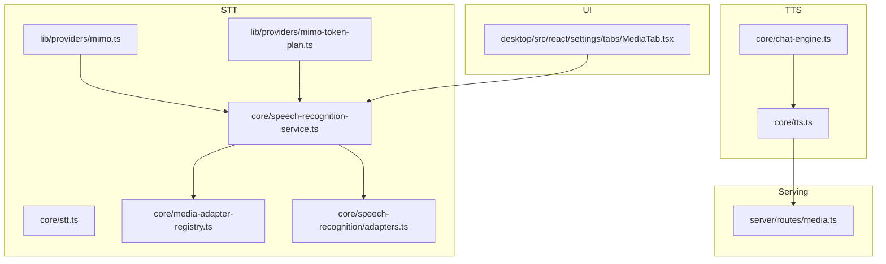
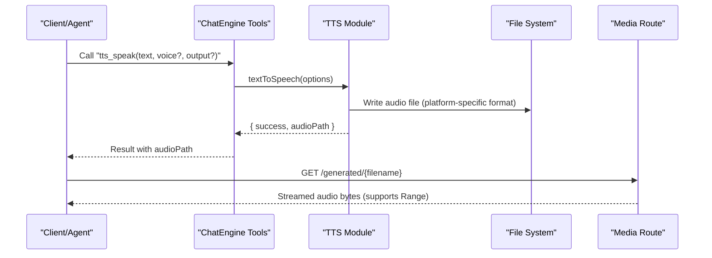
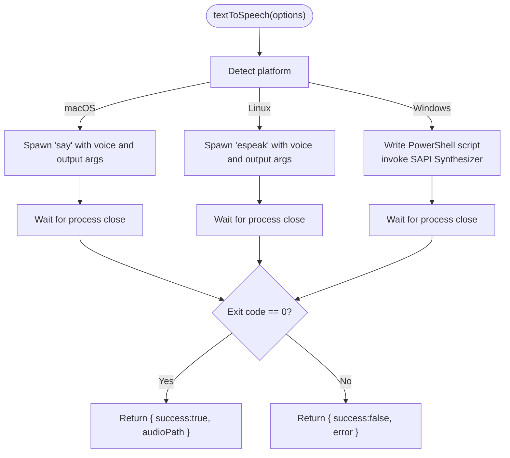
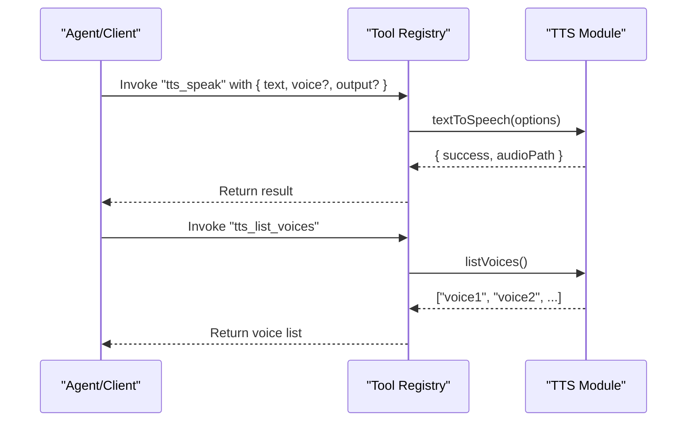
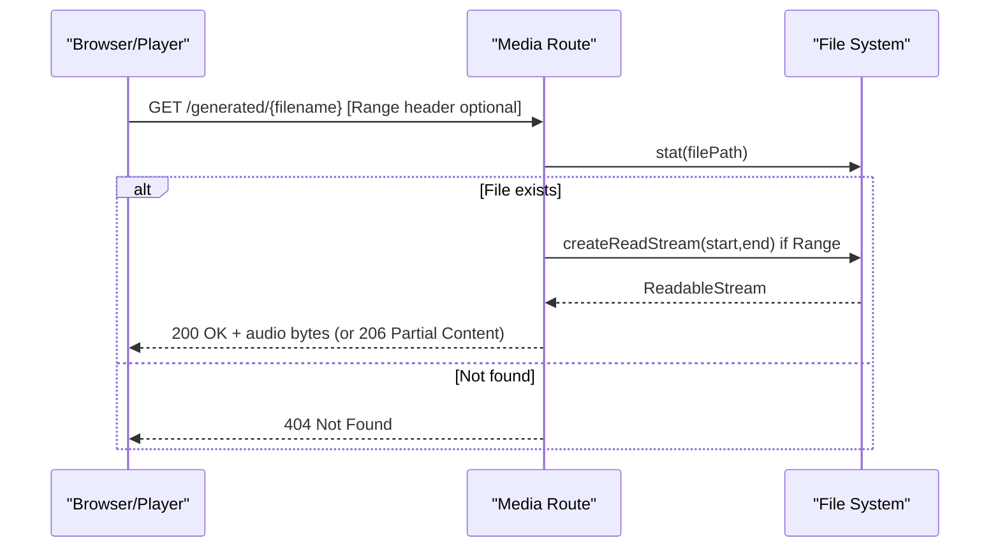
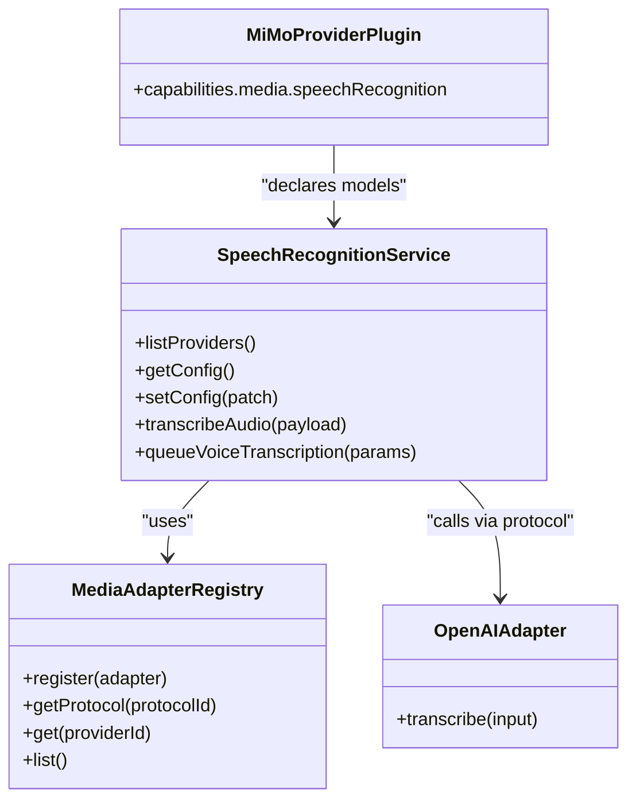
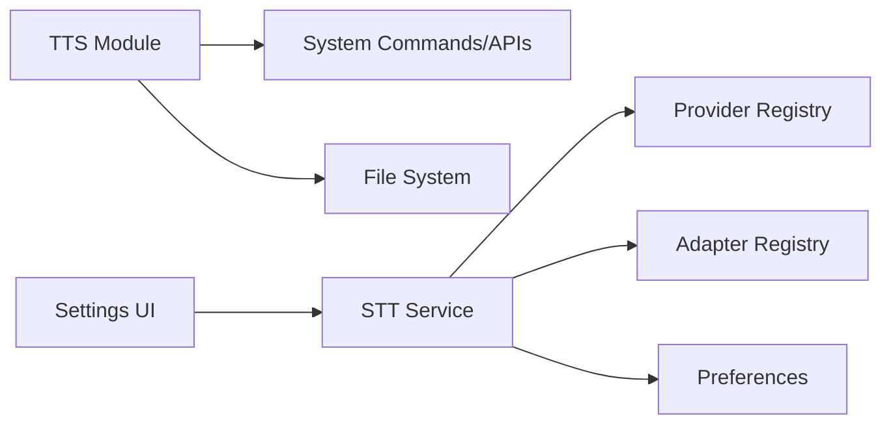

# Text-to-Speech

<cite>
**Referenced Files in This Document**
- [core/tts.ts](file://core/tts.ts)
- [core/chat-engine.ts](file://core/chat-engine.ts)
- [core/stt.ts](file://core/stt.ts)
- [core/speech-recognition-service.ts](file://core/speech-recognition-service.ts)
- [core/media-adapter-registry.ts](file://core/media-adapter-registry.ts)
- [core/speech-recognition/adapters.ts](file://core/speech-recognition/adapters.ts)
- [lib/providers/mimo.ts](file://lib/providers/mimo.ts)
- [lib/providers/mimo-token-plan.ts](file://lib/providers/mimo-token-plan.ts)
- [server/routes/media.ts](file://server/routes/media.ts)
- [desktop/src/react/settings/tabs/MediaTab.tsx](file://desktop/src/react/settings/tabs/MediaTab.tsx)
</cite>

## Table of Contents
1. [Introduction](#introduction)
2. [Project Structure](#project-structure)
3. [Core Components](#core-components)
4. [Architecture Overview](#architecture-overview)
5. [Detailed Component Analysis](#detailed-component-analysis)
6. [Dependency Analysis](#dependency-analysis)
7. [Performance Considerations](#performance-considerations)
8. [Troubleshooting Guide](#troubleshooting-guide)
9. [Conclusion](#conclusion)
10. [Appendices](#appendices)

## Introduction
This document explains the text-to-speech (TTS) capabilities and related speech features in the project. It covers:
- The local TTS engine that synthesizes speech using system tools on macOS, Linux, and Windows.
- How TTS is exposed as tools to agents and applications.
- The relationship between TTS and speech recognition (STT), including provider-based transcription workflows.
- Audio output formats and how generated media can be served over HTTP.
- Practical usage patterns for generating speech from text, selecting voices, and listing available voices.
- Notes on provider integrations for STT and where TTS provider extensions could be added.

## Project Structure
The TTS feature is implemented primarily in a platform-aware module and integrated into the agent tool registry. Speech recognition uses a provider/adapter architecture with UI configuration support. Generated audio files are served via an HTTP route.

**Diagram sources**
- [core/tts.ts:1-143](file://core/tts.ts#L1-L143)
- [core/chat-engine.ts:450-464](file://core/chat-engine.ts#L450-L464)
- [core/stt.ts:1-111](file://core/stt.ts#L1-L111)
- [core/speech-recognition-service.ts:1-286](file://core/speech-recognition-service.ts#L1-L286)
- [core/media-adapter-registry.ts:1-79](file://core/media-adapter-registry.ts#L1-L79)
- [core/speech-recognition/adapters.ts:1-39](file://core/speech-recognition/adapters.ts#L1-L39)
- [lib/providers/mimo.ts:1-24](file://lib/providers/mimo.ts#L1-L24)
- [lib/providers/mimo-token-plan.ts:1-26](file://lib/providers/mimo-token-plan.ts#L1-L26)
- [server/routes/media.ts:271-296](file://server/routes/media.ts#L271-L296)
- [desktop/src/react/settings/tabs/MediaTab.tsx:108-144](file://desktop/src/react/settings/tabs/MediaTab.tsx#L108-L144)

**Section sources**
- [core/tts.ts:1-143](file://core/tts.ts#L1-L143)
- [core/chat-engine.ts:450-464](file://core/chat-engine.ts#L450-L464)
- [core/stt.ts:1-111](file://core/stt.ts#L1-L111)
- [core/speech-recognition-service.ts:1-286](file://core/speech-recognition-service.ts#L1-L286)
- [core/media-adapter-registry.ts:1-79](file://core/media-adapter-registry.ts#L1-L79)
- [core/speech-recognition/adapters.ts:1-39](file://core/speech-recognition/adapters.ts#L1-L39)
- [lib/providers/mimo.ts:1-24](file://lib/providers/mimo.ts#L1-L24)
- [lib/providers/mimo-token-plan.ts:1-26](file://lib/providers/mimo-token-plan.ts#L1-L26)
- [server/routes/media.ts:271-296](file://server/routes/media.ts#L271-L296)
- [desktop/src/react/settings/tabs/MediaTab.tsx:108-144](file://desktop/src/react/settings/tabs/MediaTab.tsx#L108-L144)

## Core Components
- Local TTS engine: Platform-specific synthesis using system utilities or APIs.
- Tool registration: Exposes TTS functions to agents and clients.
- STT service: Provider-based transcription with adapters and UI configuration.
- Media serving: HTTP endpoint to stream generated audio files.

Key responsibilities:
- TTS: Convert text to audio files; list available voices per platform.
- Chat Engine: Register TTS tools with parameters like text, voice, and output path.
- STT Service: Manage providers, credentials, default models, and transcription lifecycle.
- Adapters: Implement protocol-specific transcription calls (e.g., OpenAI).
- Media Route: Serve generated audio with range requests for streaming playback.

**Section sources**
- [core/tts.ts:16-28](file://core/tts.ts#L16-L28)
- [core/chat-engine.ts:450-464](file://core/chat-engine.ts#L450-L464)
- [core/speech-recognition-service.ts:8-93](file://core/speech-recognition-service.ts#L8-L93)
- [core/speech-recognition/adapters.ts:7-34](file://core/speech-recognition/adapters.ts#L7-L34)
- [server/routes/media.ts:271-296](file://server/routes/media.ts#L271-L296)

## Architecture Overview
The TTS workflow is straightforward: call the TTS function with text and optional voice/output, which writes an audio file to disk. The STT workflow is more complex: it resolves a configured provider/model, selects an adapter by protocol, performs transcription, and emits updates.

**Diagram sources**
- [core/chat-engine.ts:450-464](file://core/chat-engine.ts#L450-L464)
- [core/tts.ts:70-113](file://core/tts.ts#L70-L113)
- [server/routes/media.ts:271-296](file://server/routes/media.ts#L271-L296)

## Detailed Component Analysis

### Local TTS Engine
- Platform selection:
  - macOS: Uses the system “say” command to produce AIFF audio.
  - Linux: Uses “espeak” to produce WAV audio.
  - Windows: Uses PowerShell to invoke SAPI’s SpeechSynthesizer and write a WAV file.
- Options:
  - text: Required input string.
  - voice: Optional voice identifier (platform-dependent).
  - output: Optional absolute path for the resulting audio file.
- Output:
  - Returns a result object indicating success and the audio file path, or an error message.
- Voice discovery:
  - Provides a listVoices function that queries installed voices per platform.

**Diagram sources**
- [core/tts.ts:70-113](file://core/tts.ts#L70-L113)
- [core/tts.ts:30-68](file://core/tts.ts#L30-L68)

**Section sources**
- [core/tts.ts:16-28](file://core/tts.ts#L16-L28)
- [core/tts.ts:70-113](file://core/tts.ts#L70-L113)
- [core/tts.ts:115-136](file://core/tts.ts#L115-L136)

### Tool Registration and Usage
- The chat engine registers two TTS tools:
  - tts_speak: Converts text to speech and saves an audio file. Parameters include text, optional output path, and optional voice name.
  - tts_list_voices: Lists available voices on the current platform.
- These tools are callable by agents and client applications through the engine’s tool interface.

**Diagram sources**
- [core/chat-engine.ts:450-464](file://core/chat-engine.ts#L450-L464)
- [core/tts.ts:138-143](file://core/tts.ts#L138-L143)

**Section sources**
- [core/chat-engine.ts:450-464](file://core/chat-engine.ts#L450-L464)
- [core/tts.ts:138-143](file://core/tts.ts#L138-L143)

### Audio Output Formats and Streaming
- Output formats:
  - macOS: AIFF audio file.
  - Linux: WAV audio file.
  - Windows: WAV audio file.
- Serving generated audio:
  - An HTTP route serves generated media files by filename, supports HTTP Range headers for partial content streaming, and sets MIME types based on file extension.

**Diagram sources**
- [server/routes/media.ts:271-296](file://server/routes/media.ts#L271-L296)

**Section sources**
- [core/tts.ts:75-104](file://core/tts.ts#L75-L104)
- [server/routes/media.ts:271-296](file://server/routes/media.ts#L271-L296)

### Speech Recognition (STT) Providers and Adapters
- Provider model resolution:
  - The STT service lists providers and their models, validates credentials, and resolves a target provider/model pair.
- Adapter selection:
  - Adapters implement protocol-specific transcription logic. For example, an OpenAI adapter posts audio to the OpenAI transcriptions endpoint.
- Configuration:
  - Users can enable STT and set a default provider/model via preferences. The UI exposes provider details and runnable models.

**Diagram sources**
- [core/speech-recognition-service.ts:8-93](file://core/speech-recognition-service.ts#L8-L93)
- [core/media-adapter-registry.ts:8-79](file://core/media-adapter-registry.ts#L8-L79)
- [core/speech-recognition/adapters.ts:7-34](file://core/speech-recognition/adapters.ts#L7-L34)
- [lib/providers/mimo.ts:8-24](file://lib/providers/mimo.ts#L8-L24)

**Section sources**
- [core/speech-recognition-service.ts:51-93](file://core/speech-recognition-service.ts#L51-L93)
- [core/speech-recognition/adapters.ts:7-34](file://core/speech-recognition/adapters.ts#L7-L34)
- [lib/providers/mimo.ts:8-24](file://lib/providers/mimo.ts#L8-L24)
- [lib/providers/mimo-token-plan.ts:8-26](file://lib/providers/mimo-token-plan.ts#L8-L26)
- [desktop/src/react/settings/tabs/MediaTab.tsx:108-144](file://desktop/src/react/settings/tabs/MediaTab.tsx#L108-L144)

### Practical Examples and Workflows
- Generate speech from text:
  - Use the tts_speak tool with text and optional voice/output parameters. The function returns the path to the generated audio file.
- List available voices:
  - Use the tts_list_voices tool to retrieve platform-specific voice names.
- Play back generated audio:
  - Request the generated file via the media route with the filename; the server streams the audio and supports Range requests for efficient playback.

Notes:
- Speed and pitch controls are not exposed by the current TTS implementation.
- Emotional tone control and voice cloning are not implemented in the local TTS module.

**Section sources**
- [core/chat-engine.ts:450-464](file://core/chat-engine.ts#L450-L464)
- [core/tts.ts:70-113](file://core/tts.ts#L70-L113)
- [core/tts.ts:115-136](file://core/tts.ts#L115-L136)
- [server/routes/media.ts:271-296](file://server/routes/media.ts#L271-L296)

## Dependency Analysis
- TTS depends on:
  - Operating system commands or APIs (say, espeak, PowerShell/SAPI).
  - File system for writing audio outputs.
- STT depends on:
  - Provider registry and credential management.
  - Adapter registry for protocol-specific implementations.
  - Preferences for enabling/disabling and setting default models.
- UI integration:
  - Settings UI displays providers and allows selecting default models for STT.

**Diagram sources**
- [core/tts.ts:70-113](file://core/tts.ts#L70-L113)
- [core/speech-recognition-service.ts:8-93](file://core/speech-recognition-service.ts#L8-L93)
- [core/media-adapter-registry.ts:8-79](file://core/media-adapter-registry.ts#L8-L79)
- [desktop/src/react/settings/tabs/MediaTab.tsx:108-144](file://desktop/src/react/settings/tabs/MediaTab.tsx#L108-L144)

**Section sources**
- [core/tts.ts:70-113](file://core/tts.ts#L70-L113)
- [core/speech-recognition-service.ts:8-93](file://core/speech-recognition-service.ts#L8-L93)
- [core/media-adapter-registry.ts:8-79](file://core/media-adapter-registry.ts#L8-L79)
- [desktop/src/react/settings/tabs/MediaTab.tsx:108-144](file://desktop/src/react/settings/tabs/MediaTab.tsx#L108-L144)

## Performance Considerations
- Local TTS:
  - Process spawning overhead per synthesis request.
  - Disk I/O for writing audio files; consider reusing output directories and avoiding excessive temporary files.
- Streaming playback:
  - Use HTTP Range requests to avoid downloading entire files when only portions are needed.
- STT:
  - Network latency for cloud providers; prefer caching results and batching where appropriate.
  - Ensure adapter selection and credential resolution are fast paths.

[No sources needed since this section provides general guidance]

## Troubleshooting Guide
- TTS failures:
  - macOS: Ensure “say” is available and the specified voice exists.
  - Linux: Install espeak and verify availability; check exit codes for errors.
  - Windows: Confirm PowerShell execution policy and SAPI availability; ensure output path is writable.
- STT issues:
  - Verify provider credentials and default model configuration.
  - Confirm adapter registration for the selected protocol.
  - Check session file existence and presentation type for voice-input attachments.
- Media serving:
  - Validate filename mapping to generatedFilePath and ensure the file exists before streaming.

**Section sources**
- [core/tts.ts:75-113](file://core/tts.ts#L75-L113)
- [core/speech-recognition-service.ts:112-178](file://core/speech-recognition-service.ts#L112-L178)
- [server/routes/media.ts:271-296](file://server/routes/media.ts#L271-L296)

## Conclusion
The project provides a practical local TTS solution with cross-platform support and simple tooling for agents and clients. STT is built around a flexible provider/adapter architecture with UI-driven configuration. While advanced TTS features such as speed/pitch control, emotional tone, and voice cloning are not present in the local engine, the modular design allows future expansion to integrate additional providers and protocols.

[No sources needed since this section summarizes without analyzing specific files]

## Appendices
- Audio formats:
  - macOS: AIFF
  - Linux: WAV
  - Windows: WAV
- Tool parameters:
  - tts_speak: text (required), output (optional), voice (optional).
  - tts_list_voices: no parameters.

**Section sources**
- [core/tts.ts:75-104](file://core/tts.ts#L75-L104)
- [core/chat-engine.ts:450-464](file://core/chat-engine.ts#L450-L464)