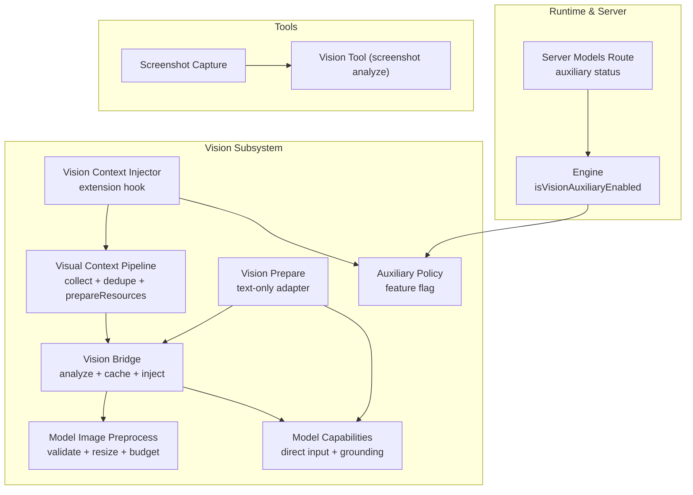
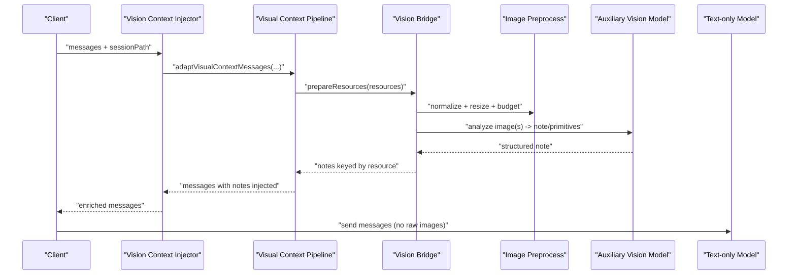
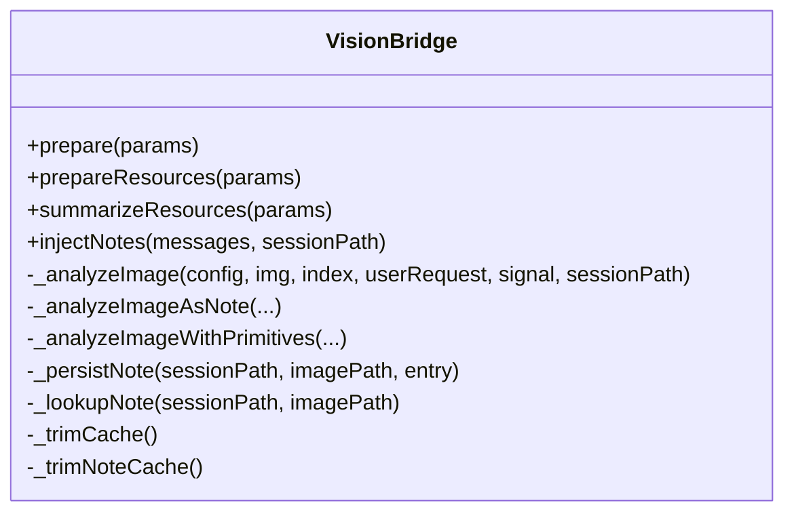
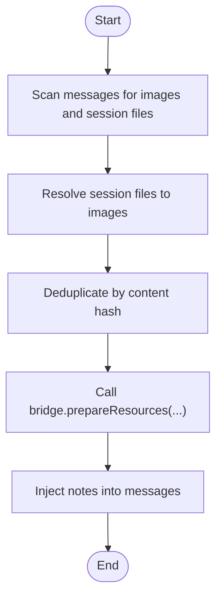
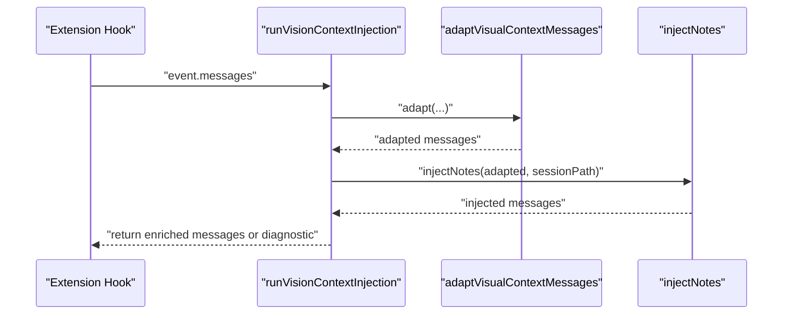
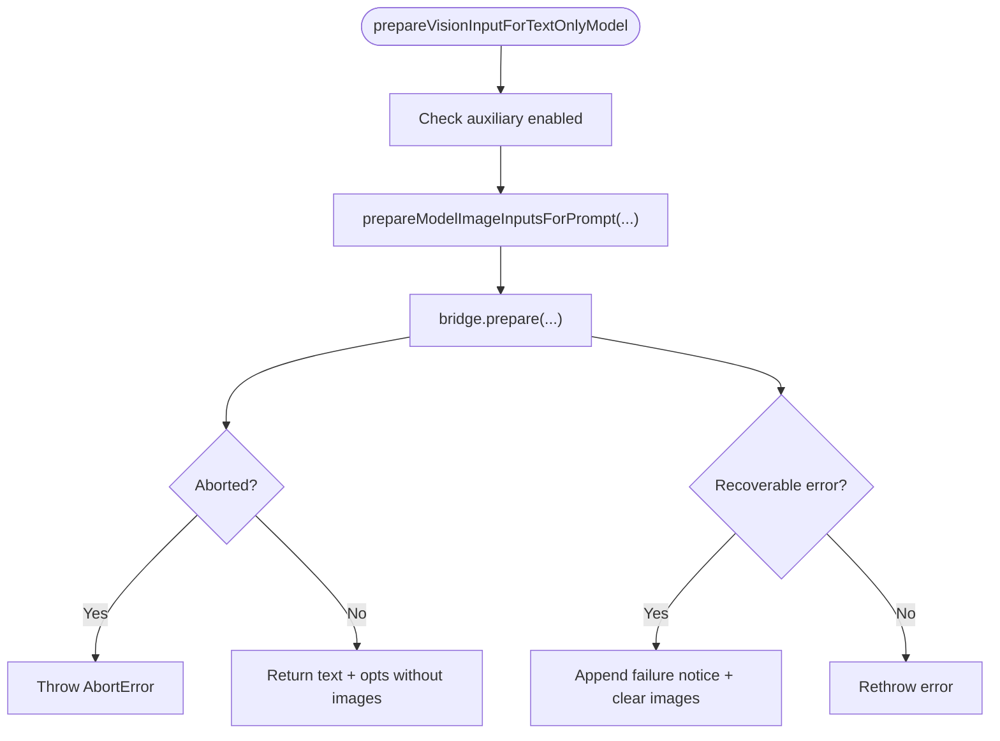
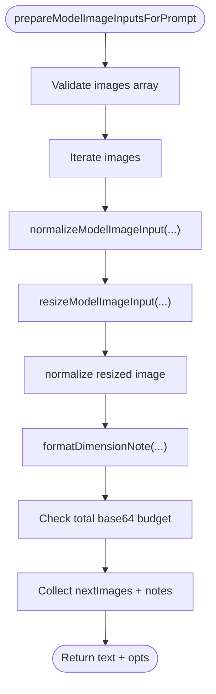
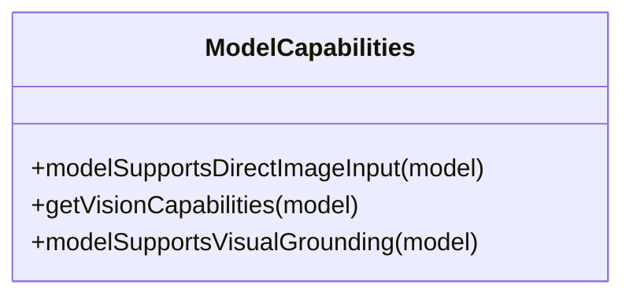
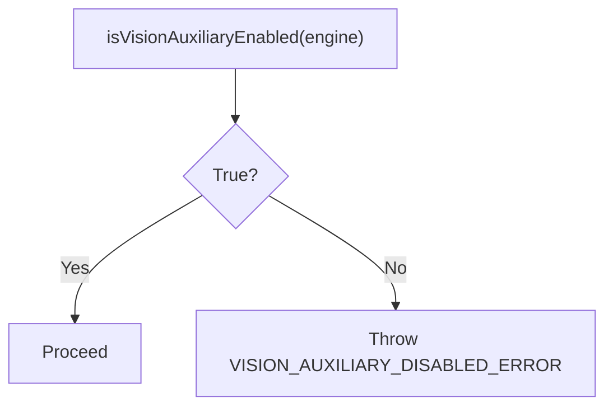
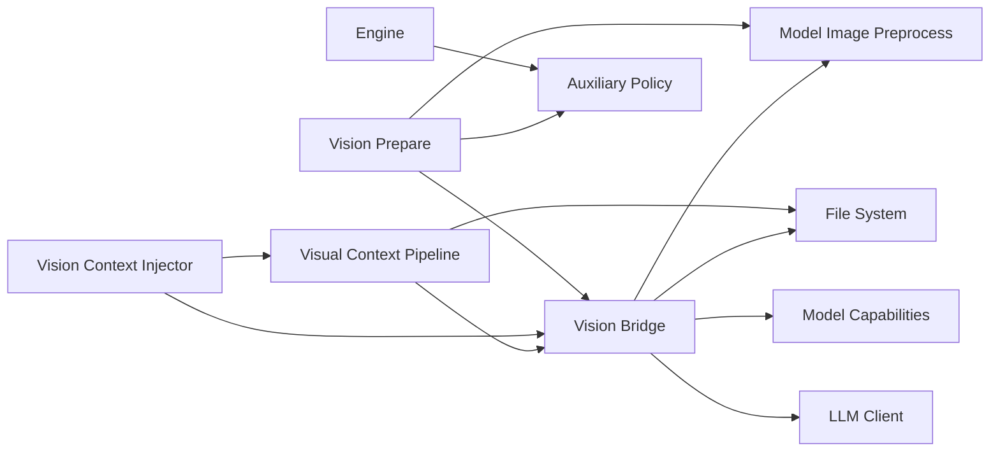

# Vision & Image Analysis

<cite>
**Referenced Files in This Document**
- [vision-bridge.ts](file://core/vision-bridge.ts)
- [visual-context-pipeline.ts](file://core/visual-context-pipeline.ts)
- [vision-context-injector.ts](file://core/vision-context-injector.ts)
- [vision-prepare.ts](file://core/vision-prepare.ts)
- [model-image-preprocess.ts](file://core/model-image-preprocess.ts)
- [model-capabilities.ts](file://shared/model-capabilities.ts)
- [vision-auxiliary-policy.ts](file://core/vision-auxiliary-policy.ts)
- [models.ts](file://server/routes/models.ts)
- [engine.ts](file://core/engine.ts)
- [tools_vision.ts](file://core/tools/vision.ts)
- [screenshot.ts](file://core/tools/screenshot.ts)
</cite>

## Table of Contents
1. Introduction
2. Project Structure
3. Core Components
4. Architecture Overview
5. Detailed Component Analysis
6. Dependency Analysis
7. Performance Considerations
8. Troubleshooting Guide
9. Conclusion

## Introduction
This document explains the vision and image analysis capabilities of the system, focusing on how images are processed, analyzed by vision-capable models, and injected as context for downstream text-only models. It covers:
- The vision bridge architecture that coordinates auxiliary vision analysis
- The image preprocessing pipeline that normalizes and compresses images
- Context injection mechanisms that embed structured notes into messages
- Workflows for analyzing uploaded images, extracting text from documents, and performing visual search operations
- Integration with vision-capable AI models, image format handling, and preprocessing optimizations
- Privacy considerations, caching strategies, and performance tuning for large datasets

## Project Structure
The vision subsystem is implemented across several core modules:
- Vision Bridge: orchestrates auxiliary vision calls, caching, and note formatting
- Visual Context Pipeline: collects images from messages and session files, deduplicates, and prepares resources
- Vision Context Injector: integrates the pipeline and bridge into the message lifecycle
- Vision Prepare: adapts prompts for text-only models using auxiliary vision
- Model Image Preprocessing: validates, decodes, resizes, and compresses images to meet model budgets
- Model Capabilities: determines whether a model supports direct image input and resolves grounding capabilities
- Auxiliary Policy: enforces feature flags for auxiliary vision
- Server Models Route: exposes auxiliary vision status and configuration
- Engine: provides runtime capability flags and shared model resolution
- Tools: screenshot capture and direct vision tooling for screenshots

**Diagram sources**
- [vision-bridge.ts:376-760](file://core/vision-bridge.ts#L376-L760)
- [visual-context-pipeline.ts:187-244](file://core/visual-context-pipeline.ts#L187-L244)
- [vision-context-injector.ts:71-124](file://core/vision-context-injector.ts#L71-L124)
- [vision-prepare.ts:48-89](file://core/vision-prepare.ts#L48-L89)
- [model-image-preprocess.ts:202-293](file://core/model-image-preprocess.ts#L202-L293)
- [model-capabilities.ts:430-461](file://shared/model-capabilities.ts#L430-L461)
- [vision-auxiliary-policy.ts:1-13](file://core/vision-auxiliary-policy.ts#L1-L13)
- [engine.ts:999-1005](file://core/engine.ts#L999-L1005)
- [models.ts:115-147](file://server/routes/models.ts#L115-L147)
- [screenshot.ts:161-179](file://core/tools/screenshot.ts#L161-L179)
- [tools_vision.ts:34-109](file://core/tools/vision.ts#L34-L109)

**Section sources**
- [vision-bridge.ts:376-760](file://core/vision-bridge.ts#L376-L760)
- [visual-context-pipeline.ts:187-244](file://core/visual-context-pipeline.ts#L187-L244)
- [vision-context-injector.ts:71-124](file://core/vision-context-injector.ts#L71-L124)
- [vision-prepare.ts:48-89](file://core/vision-prepare.ts#L48-L89)
- [model-image-preprocess.ts:202-293](file://core/model-image-preprocess.ts#L202-L293)
- [model-capabilities.ts:430-461](file://shared/model-capabilities.ts#L430-L461)
- [vision-auxiliary-policy.ts:1-13](file://core/vision-auxiliary-policy.ts#L1-L13)
- [engine.ts:999-1005](file://core/engine.ts#L999-L1005)
- [models.ts:115-147](file://server/routes/models.ts#L115-L147)
- [screenshot.ts:161-179](file://core/tools/screenshot.ts#L161-L179)
- [tools_vision.ts:34-109](file://core/tools/vision.ts#L34-L109)

## Core Components
- Vision Bridge
  - Orchestrates auxiliary vision analysis for images when the target model cannot accept images directly
  - Maintains an in-memory prompt-based cache and per-session sidecar persistence for notes
  - Normalizes structured outputs (including optional visual primitives like boxes and points) into a consistent note format
  - Injects notes into user messages via a dedicated context block
- Visual Context Pipeline
  - Scans messages for inline image blocks and session file references
  - Resolves session files to base64 images, deduplicates by content hash, and batches preparation through the bridge
  - Injects generated notes back into messages before they reach the LLM
- Vision Context Injector
  - Provides an extension hook that runs the pipeline and bridge integration during message processing
  - Adds diagnostics if injection fails, preserving conversation continuity
- Vision Prepare
  - Adapts prompts for text-only models by calling the bridge to generate notes and stripping raw images from the payload
  - Handles recoverable errors gracefully and appends a failure notice to the user-facing text
- Model Image Preprocessing
  - Validates image inputs, detects MIME types, decodes base64, resizes/compresses within configurable budgets, and annotates text with dimension notes
- Model Capabilities
  - Determines whether a model supports direct image input and resolves auxiliary vision grounding capabilities (boxes, points, coordinate space)
- Auxiliary Policy
  - Enforces the auxiliary vision feature flag and throws explicit errors when disabled
- Server Models Route
  - Exposes auxiliary vision status (enabled/configured/available) and resolved model reference
- Engine
  - Provides the runtime flag indicating whether auxiliary vision is enabled
- Tools
  - Screenshot capture utility supporting Electron IPC and CLI fallbacks
  - Vision tool for analyzing screenshots via a vision-capable model

**Section sources**
- [vision-bridge.ts:376-760](file://core/vision-bridge.ts#L376-L760)
- [visual-context-pipeline.ts:187-244](file://core/visual-context-pipeline.ts#L187-L244)
- [vision-context-injector.ts:71-124](file://core/vision-context-injector.ts#L71-L124)
- [vision-prepare.ts:48-89](file://core/vision-prepare.ts#L48-L89)
- [model-image-preprocess.ts:202-293](file://core/model-image-preprocess.ts#L202-L293)
- [model-capabilities.ts:430-461](file://shared/model-capabilities.ts#L430-L461)
- [vision-auxiliary-policy.ts:1-13](file://core/vision-auxiliary-policy.ts#L1-L13)
- [models.ts:115-147](file://server/routes/models.ts#L115-L147)
- [engine.ts:999-1005](file://core/engine.ts#L999-L1005)
- [screenshot.ts:161-179](file://core/tools/screenshot.ts#L161-L179)
- [tools_vision.ts:34-109](file://core/tools/vision.ts#L34-L109)

## Architecture Overview
The vision subsystem follows a layered approach:
- Input Collection: Messages may contain inline images or session file references; these are collected and deduplicated
- Preparation: Images are normalized and compressed according to policy; auxiliary vision is invoked only when required
- Analysis: An auxiliary vision model produces structured notes (and optionally grounded primitives)
- Injection: Notes are embedded into messages inside a dedicated context block
- Execution: Downstream text-only models receive enriched text without raw images

**Diagram sources**
- [vision-context-injector.ts:71-124](file://core/vision-context-injector.ts#L71-L124)
- [visual-context-pipeline.ts:187-244](file://core/visual-context-pipeline.ts#L187-L244)
- [vision-bridge.ts:444-520](file://core/vision-bridge.ts#L444-L520)
- [model-image-preprocess.ts:202-293](file://core/model-image-preprocess.ts#L202-L293)

## Detailed Component Analysis

### Vision Bridge
Responsibilities:
- Decide whether auxiliary vision is needed based on target model capabilities
- Analyze images via an auxiliary vision model, producing concise notes and optional grounded primitives
- Cache results by prompt signature and persist per-session notes to a sidecar file
- Inject notes into user messages using a dedicated context block

Key behaviors:
- Requires an auxiliary vision model configured and capable of image input
- Supports two output modes:
  - Plain note mode for general models
  - Structured JSON mode with optional visual primitives for models with grounding capabilities
- Normalizes primitive shapes (boxes/points) and confidence values, enforcing coordinate space and box order
- Truncates notes to fit token budgets and formats invalid responses gracefully

**Diagram sources**
- [vision-bridge.ts:376-760](file://core/vision-bridge.ts#L376-L760)

**Section sources**
- [vision-bridge.ts:376-760](file://core/vision-bridge.ts#L376-L760)

### Visual Context Pipeline
Responsibilities:
- Collect images from message content blocks and session file references
- Resolve session files to base64 images and compute content hashes
- Deduplicate resources across messages
- Batch prepare via the bridge and inject notes back into messages

**Diagram sources**
- [visual-context-pipeline.ts:187-244](file://core/visual-context-pipeline.ts#L187-L244)

**Section sources**
- [visual-context-pipeline.ts:187-244](file://core/visual-context-pipeline.ts#L187-L244)

### Vision Context Injector
Responsibilities:
- Provide an extension hook that runs the pipeline and bridge integration
- Wrap failures with diagnostics and still return messages so the conversation continues

**Diagram sources**
- [vision-context-injector.ts:71-124](file://core/vision-context-injector.ts#L71-L124)

**Section sources**
- [vision-context-injector.ts:71-124](file://core/vision-context-injector.ts#L71-L124)

### Vision Prepare (Text-only Adapter)
Responsibilities:
- Ensure auxiliary vision is enabled and available
- Normalize images for the prompt boundary
- Call the bridge to produce notes and strip raw images from opts
- Handle recoverable errors by appending a user-facing notice and proceeding without images

**Diagram sources**
- [vision-prepare.ts:48-89](file://core/vision-prepare.ts#L48-L89)
- [model-image-preprocess.ts:202-293](file://core/model-image-preprocess.ts#L202-L293)

**Section sources**
- [vision-prepare.ts:48-89](file://core/vision-prepare.ts#L48-L89)

### Model Image Preprocessing
Responsibilities:
- Validate image objects and data URLs
- Decode base64, detect MIME type, and enforce size/budget constraints
- Resize/compress images via Pi SDK adapters
- Append dimension notes to text near attached image markers

**Diagram sources**
- [model-image-preprocess.ts:202-293](file://core/model-image-preprocess.ts#L202-L293)

**Section sources**
- [model-image-preprocess.ts:202-293](file://core/model-image-preprocess.ts#L202-L293)

### Model Capabilities and Grounding
Responsibilities:
- Determine whether a model supports direct image input
- Resolve auxiliary vision grounding capabilities (boxes, points, coordinate space, output format)
- Provide transport selection for different providers

**Diagram sources**
- [model-capabilities.ts:430-461](file://shared/model-capabilities.ts#L430-L461)
- [model-capabilities.ts:644-652](file://shared/model-capabilities.ts#L644-L652)

**Section sources**
- [model-capabilities.ts:430-461](file://shared/model-capabilities.ts#L430-L461)
- [model-capabilities.ts:644-652](file://shared/model-capabilities.ts#L644-L652)

### Auxiliary Policy and Runtime Flags
Responsibilities:
- Enforce auxiliary vision feature flag
- Provide helper functions to check and require enabling

**Diagram sources**
- [vision-auxiliary-policy.ts:1-13](file://core/vision-auxiliary-policy.ts#L1-L13)
- [engine.ts:999-1005](file://core/engine.ts#L999-L1005)

**Section sources**
- [vision-auxiliary-policy.ts:1-13](file://core/vision-auxiliary-policy.ts#L1-L13)
- [engine.ts:999-1005](file://core/engine.ts#L999-L1005)

### Server Models Route (Auxiliary Status)
Responsibilities:
- Expose auxiliary vision status including enabled/configured/available states
- Serialize the configured auxiliary model reference

**Section sources**
- [models.ts:115-147](file://server/routes/models.ts#L115-L147)

### Tools: Screenshot Capture and Vision Tool
Responsibilities:
- Capture screenshots via Electron IPC or system commands
- Analyze screenshots using a vision-capable model and return descriptions/findings

**Section sources**
- [screenshot.ts:161-179](file://core/tools/screenshot.ts#L161-L179)
- [tools_vision.ts:34-109](file://core/tools/vision.ts#L34-L109)

## Dependency Analysis
- Vision Bridge depends on:
  - Model image preprocessing utilities
  - Model capabilities for direct image support and grounding
  - LLM client for auxiliary vision calls
  - File system for per-session notes sidecar
- Visual Context Pipeline depends on:
  - Vision Bridge for resource preparation
  - File system for reading session files
- Vision Context Injector depends on:
  - Visual Context Pipeline and Vision Bridge
  - Feature flag from engine
- Vision Prepare depends on:
  - Model image preprocessing
  - Vision Bridge
  - Auxiliary policy
- Model Image Preprocessing depends on:
  - Pi SDK resize/format adapters
- Model Capabilities is used by:
  - Vision Bridge and Vision Prepare to decide workflows

**Diagram sources**
- [vision-bridge.ts:376-760](file://core/vision-bridge.ts#L376-L760)
- [visual-context-pipeline.ts:187-244](file://core/visual-context-pipeline.ts#L187-L244)
- [vision-context-injector.ts:71-124](file://core/vision-context-injector.ts#L71-L124)
- [vision-prepare.ts:48-89](file://core/vision-prepare.ts#L48-L89)
- [model-image-preprocess.ts:202-293](file://core/model-image-preprocess.ts#L202-L293)
- [model-capabilities.ts:430-461](file://shared/model-capabilities.ts#L430-L461)
- [vision-auxiliary-policy.ts:1-13](file://core/vision-auxiliary-policy.ts#L1-L13)
- [engine.ts:999-1005](file://core/engine.ts#L999-L1005)

**Section sources**
- [vision-bridge.ts:376-760](file://core/vision-bridge.ts#L376-L760)
- [visual-context-pipeline.ts:187-244](file://core/visual-context-pipeline.ts#L187-L244)
- [vision-context-injector.ts:71-124](file://core/vision-context-injector.ts#L71-L124)
- [vision-prepare.ts:48-89](file://core/vision-prepare.ts#L48-L89)
- [model-image-preprocess.ts:202-293](file://core/model-image-preprocess.ts#L202-L293)
- [model-capabilities.ts:430-461](file://shared/model-capabilities.ts#L430-L461)
- [vision-auxiliary-policy.ts:1-13](file://core/vision-auxiliary-policy.ts#L1-L13)
- [engine.ts:999-1005](file://core/engine.ts#L999-L1005)

## Performance Considerations
- Image compression and resizing
  - Enforce per-image and total base64 byte budgets to avoid oversized requests
  - Use JPEG quality and max dimensions to balance fidelity and cost
- Caching
  - Prompt-based in-memory cache avoids repeated auxiliary vision calls for identical images and requests
  - Per-session sidecar persists notes to disk for reuse across sessions
- Deduplication
  - Content hashing prevents redundant analysis of identical images across messages
- Timeouts and aborts
  - Vision analysis includes timeouts and respects abort signals to keep responsiveness
- Token budgets
  - Notes are truncated to fit within limits while preserving key sections and primitives

[No sources needed since this section provides general guidance]

## Troubleshooting Guide
Common issues and resolutions:
- Auxiliary vision disabled
  - Symptom: Error indicating auxiliary vision is disabled for text-only models
  - Resolution: Enable auxiliary vision in engine/shared models and ensure a configured vision-capable model
- Auxiliary model not configured
  - Symptom: Status shows enabled but not configured; no model resolved
  - Resolution: Configure auxiliary vision model reference and credentials
- Recoverable network or timeout errors
  - Symptom: Vision prepare fails due to timeouts or rate limits
  - Behavior: System appends a user-facing notice and proceeds without images
  - Resolution: Retry later or adjust provider quotas
- Invalid structured response from auxiliary model
  - Symptom: Note indicates invalid JSON; primitives unavailable
  - Behavior: System falls back to plain note with evidence excerpt
  - Resolution: Adjust model prompt or use a model with better grounding support
- Screenshot capture failures
  - Symptom: No screenshot tool found or Electron IPC unavailable
  - Resolution: Install platform-specific tools or run in Electron environment

**Section sources**
- [vision-auxiliary-policy.ts:1-13](file://core/vision-auxiliary-policy.ts#L1-L13)
- [models.ts:115-147](file://server/routes/models.ts#L115-L147)
- [vision-prepare.ts:31-42](file://core/vision-prepare.ts#L31-L42)
- [vision-bridge.ts:360-374](file://core/vision-bridge.ts#L360-L374)
- [screenshot.ts:161-179](file://core/tools/screenshot.ts#L161-L179)

## Conclusion
The vision subsystem enables robust visual understanding for text-only models by leveraging an auxiliary vision model, comprehensive image preprocessing, and structured context injection. It balances performance with privacy and reliability through caching, deduplication, budgets, and graceful error handling. With clear APIs and extension hooks, it integrates seamlessly into the broader messaging and agent workflow.

[No sources needed since this section summarizes without analyzing specific files]