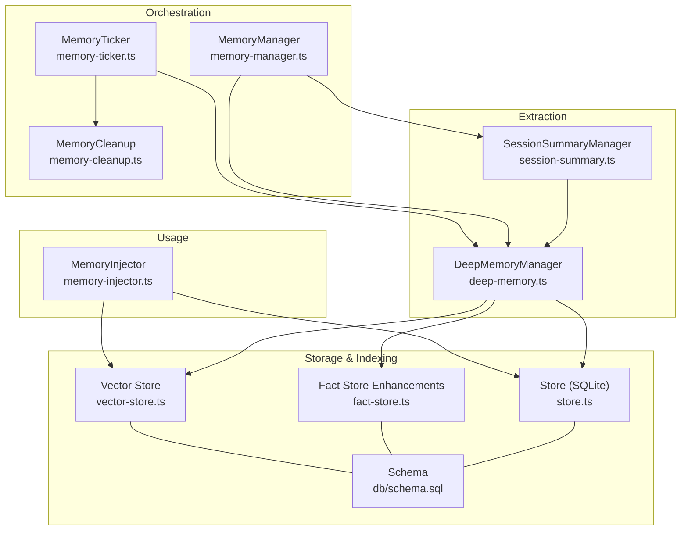
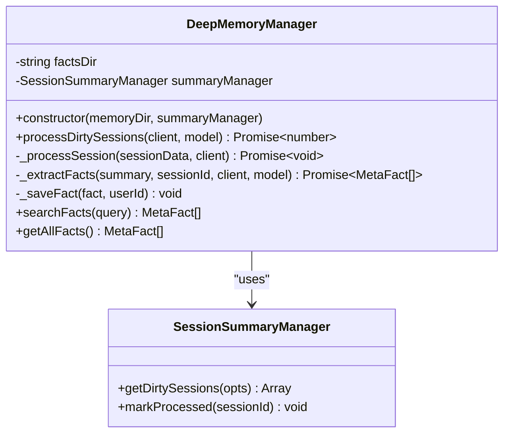
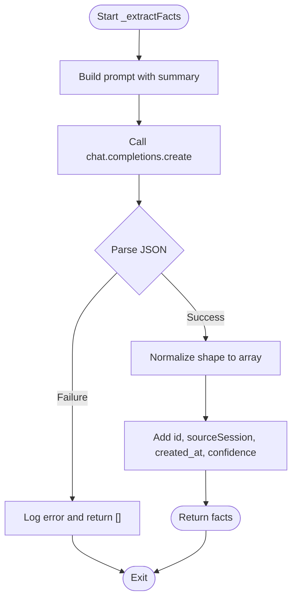
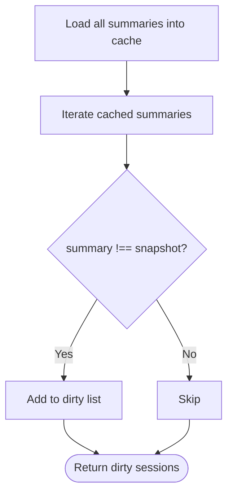
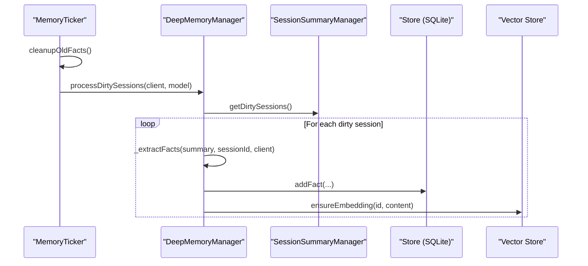
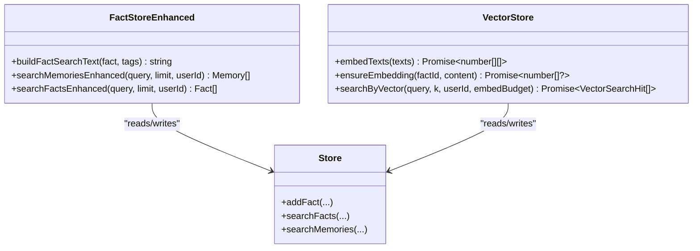
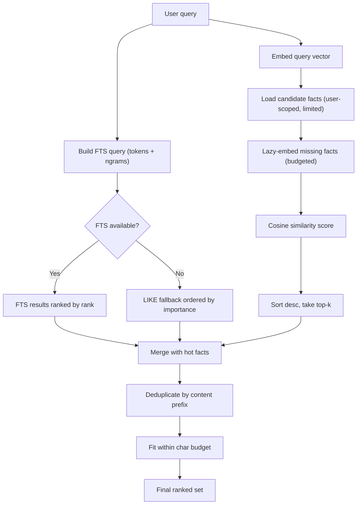
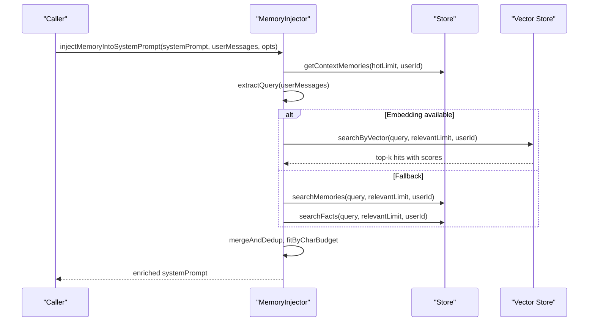
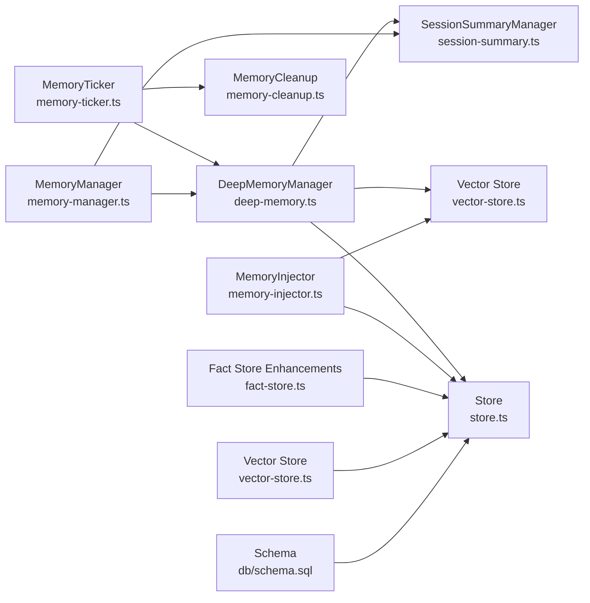

# Deep Memory Extraction

<cite>
**Referenced Files in This Document**
- [deep-memory.ts](file://core/memory/deep-memory.ts)
- [memory-manager.ts](file://core/memory/memory-manager.ts)
- [session-summary.ts](file://core/memory/session-summary.ts)
- [compile.ts](file://core/memory/compile.ts)
- [store.ts](file://core/memory/store.ts)
- [fact-store.ts](file://core/memory/fact-store.ts)
- [vector-store.ts](file://core/memory/vector-store.ts)
- [memory-injector.ts](file://core/memory/memory-injector.ts)
- [schema.sql](file://db/schema.sql)
- [memory-ticker.ts](file://core/memory/memory-ticker.ts)
- [memory-cleanup.ts](file://core/memory/memory-cleanup.ts)
</cite>

## Table of Contents
1. [Introduction](#introduction)
2. [Project Structure](#project-structure)
3. [Core Components](#core-components)
4. [Architecture Overview](#architecture-overview)
5. [Detailed Component Analysis](#detailed-component-analysis)
6. [Dependency Analysis](#dependency-analysis)
7. [Performance Considerations](#performance-considerations)
8. [Troubleshooting Guide](#troubleshooting-guide)
9. [Conclusion](#conclusion)
10. [Appendices](#appendices)

## Introduction
This document explains the deep memory extraction and semantic search capabilities, focusing on how structured facts are extracted from conversation summaries, persisted, indexed, and later retrieved for context injection. It covers:
- The DeepMemoryManager class and its fact extraction pipeline
- Dirty session detection and processing workflow
- Semantic indexing via embeddings and FTS5-based keyword search
- Search functionality including query processing, relevance scoring, and ranking
- Practical examples of data structures, query formats, and integration patterns
- Performance considerations for large-scale fact databases and tuning strategies

## Project Structure
The deep memory system is implemented under core/memory with supporting database schema and orchestration components:
- Deep memory extraction and storage: deep-memory.ts, store.ts
- Session summary management: session-summary.ts
- Compilation into daily/weekly/longterm memories: compile.ts
- Enhanced search (FTS5 + CJK ngrams): fact-store.ts
- Vector search (embeddings + cosine similarity): vector-store.ts
- Context injection into prompts: memory-injector.ts
- Orchestration and scheduling: memory-manager.ts, memory-ticker.ts, memory-cleanup.ts
- Database schema: db/schema.sql



**Diagram sources**
- [deep-memory.ts](file://core/memory/deep-memory.ts)
- [memory-manager.ts](file://core/memory/memory-manager.ts)
- [session-summary.ts](file://core/memory/session-summary.ts)
- [fact-store.ts](file://core/memory/fact-store.ts)
- [vector-store.ts](file://core/memory/vector-store.ts)
- [memory-injector.ts](file://core/memory/memory-injector.ts)
- [memory-ticker.ts](file://core/memory/memory-ticker.ts)
- [memory-cleanup.ts](file://core/memory/memory-cleanup.ts)
- [schema.sql](file://db/schema.sql)

**Section sources**
- [deep-memory.ts](file://core/memory/deep-memory.ts)
- [memory-manager.ts](file://core/memory/memory-manager.ts)
- [session-summary.ts](file://core/memory/session-summary.ts)
- [compile.ts](file://core/memory/compile.ts)
- [store.ts](file://core/memory/store.ts)
- [fact-store.ts](file://core/memory/fact-store.ts)
- [vector-store.ts](file://core/memory/vector-store.ts)
- [memory-injector.ts](file://core/memory/memory-injector.ts)
- [memory-ticker.ts](file://core/memory/memory-ticker.ts)
- [memory-cleanup.ts](file://core/memory/memory-cleanup.ts)
- [schema.sql](file://db/schema.sql)

## Core Components
- DeepMemoryManager: Orchestrates dirty session processing, LLM-driven fact extraction, persistence to SQLite and file backup, and basic search over persisted facts.
- SessionSummaryManager: Manages per-session summaries, dirty detection by comparing summary vs snapshot, and atomic writes.
- MemoryCompiler: Compiles summaries into daily/weekly/longterm Markdown memories.
- Store: SQLite-backed CRUD for memories and facts, FTS5 triggers, and user-scoped queries.
- Fact Store Enhancements: CJK-friendly FTS5 queries using bigram/trigram tokens and enhanced search functions.
- Vector Store: Embedding-based semantic search with lazy embedding generation and cosine similarity scoring.
- MemoryInjector: Merges hot facts and dynamically relevant facts into system prompts with budget control.
- MemoryTicker: Scheduled runner that performs cleanup and fact extraction.
- MemoryCleanup: Batched deletion of old facts while protecting high-importance records.

**Section sources**
- [deep-memory.ts](file://core/memory/deep-memory.ts)
- [session-summary.ts](file://core/memory/session-summary.ts)
- [compile.ts](file://core/memory/compile.ts)
- [store.ts](file://core/memory/store.ts)
- [fact-store.ts](file://core/memory/fact-store.ts)
- [vector-store.ts](file://core/memory/vector-store.ts)
- [memory-injector.ts](file://core/memory/memory-injector.ts)
- [memory-ticker.ts](file://core/memory/memory-ticker.ts)
- [memory-cleanup.ts](file://core/memory/memory-cleanup.ts)

## Architecture Overview
End-to-end flow from conversation to searchable facts and prompt injection:

```mermaid
sequenceDiagram
participant Client as "LLM Client"
participant Summ as "SessionSummaryManager"
participant Tick as "MemoryTicker"
participant Deep as "DeepMemoryManager"
participant Store as "Store (SQLite)"
participant Vec as "Vector Store"
participant Inject as "MemoryInjector"
Note over Summ : Summaries updated; snapshot != summary => dirty
Tick->>Summ : getDirtySessions()
Tick->>Deep : processDirtySessions(client, model)
Deep->>Summ : read summary
Deep->>Client : chat.completions.create(prompt)
Client-->>Deep : JSON facts array or {facts : [...]}
Deep->>Store : addFact(content, tags, importance, userId)
Deep->>Vec : ensureEmbedding(id, content) [lazy]
Note over Inject : On request time
Inject->>Store : getContextMemories / searchFacts / searchMemories
Inject->>Vec : searchByVector(query, k, userId)
Vec-->>Inject : top-k hits with scores
Inject-->>Inject : merge, dedup, fit by char budget
Inject-->>Client : system prompt enriched with memory block
```

**Diagram sources**
- [memory-ticker.ts](file://core/memory/memory-ticker.ts)
- [deep-memory.ts](file://core/memory/deep-memory.ts)
- [session-summary.ts](file://core/memory/session-summary.ts)
- [store.ts](file://core/memory/store.ts)
- [vector-store.ts](file://core/memory/vector-store.ts)
- [memory-injector.ts](file://core/memory/memory-injector.ts)

## Detailed Component Analysis

### DeepMemoryManager
Responsibilities:
- Identify dirty sessions where summary changed since last snapshot
- Extract structured facts via LLM with strict JSON output handling
- Persist facts to SQLite and file backup
- Provide simple keyword search over persisted facts

Key behaviors:
- Dirty detection relies on SessionSummaryManager.getDirtySessions()
- Fact extraction uses a prompt requesting up to N independent facts with confidence scores
- Robust JSON parsing includes stripping reasoning blocks and repairing truncated outputs
- Persistence writes both a JSON file backup and an SQLite row via addFact
- Basic search scans files and sorts by confidence



**Diagram sources**
- [deep-memory.ts](file://core/memory/deep-memory.ts)
- [session-summary.ts](file://core/memory/session-summary.ts)

**Section sources**
- [deep-memory.ts](file://core/memory/deep-memory.ts)
- [session-summary.ts](file://core/memory/session-summary.ts)

#### Fact Extraction Algorithm
- Prompt instructs the model to return a JSON object/array containing facts with fields like content, tags, and confidence
- Response normalization accepts both {facts:[...]} and bare arrays
- Reasoning blocks are stripped before parsing; truncation is repaired when possible
- Each fact is augmented with id, sourceSession, created_at, and normalized confidence



**Diagram sources**
- [deep-memory.ts](file://core/memory/deep-memory.ts)

### Dirty Session Detection Mechanism
- SessionSummaryManager maintains per-session JSON with summary and snapshot fields
- A session is considered dirty if summary differs from snapshot
- After deep memory processing, markProcessed sets snapshot = summary and records timestamp



**Diagram sources**
- [session-summary.ts](file://core/memory/session-summary.ts)

**Section sources**
- [session-summary.ts](file://core/memory/session-summary.ts)

### Processing Pipeline for Extracting Actionable Facts
- MemoryTicker orchestrates periodic runs: cleanup first, then fact extraction if LLM client provided
- DeepMemoryManager processes each dirty session: extract facts, persist to SQLite and file backup
- Lazy embedding ensures semantic search availability without blocking writes



**Diagram sources**
- [memory-ticker.ts](file://core/memory/memory-ticker.ts)
- [deep-memory.ts](file://core/memory/deep-memory.ts)
- [store.ts](file://core/memory/store.ts)
- [vector-store.ts](file://core/memory/vector-store.ts)

**Section sources**
- [memory-ticker.ts](file://core/memory/memory-ticker.ts)
- [deep-memory.ts](file://core/memory/deep-memory.ts)
- [store.ts](file://core/memory/store.ts)
- [vector-store.ts](file://core/memory/vector-store.ts)

### Semantic Indexing Strategies
- FTS5 full-text index on memories and facts tables with unicode61 tokenizer
- CJK-friendly tokenization via bigram/trigram ngrams for improved recall
- Embedding-based vector index stored in fact_embeddings table with lazy population
- Cosine similarity computed in-memory after loading candidate facts



**Diagram sources**
- [fact-store.ts](file://core/memory/fact-store.ts)
- [vector-store.ts](file://core/memory/vector-store.ts)
- [store.ts](file://core/memory/store.ts)

**Section sources**
- [fact-store.ts](file://core/memory/fact-store.ts)
- [vector-store.ts](file://core/memory/vector-store.ts)
- [store.ts](file://core/memory/store.ts)
- [schema.sql](file://db/schema.sql)

### Search Functionality: Query Processing, Relevance Scoring, Result Ranking
- Keyword search: FTS5 MATCH with optional CJK ngram expansion; fallback to LIKE if FTS unavailable
- Vector search: embed query once, lazily embed facts up to budget, compute cosine similarity, sort descending, take top-k
- Combined retrieval in MemoryInjector: hot facts (importance-weighted) merged with dynamic results; deduplicate by content prefix; enforce character budget



**Diagram sources**
- [fact-store.ts](file://core/memory/fact-store.ts)
- [vector-store.ts](file://core/memory/vector-store.ts)
- [memory-injector.ts](file://core/memory/memory-injector.ts)

**Section sources**
- [fact-store.ts](file://core/memory/fact-store.ts)
- [vector-store.ts](file://core/memory/vector-store.ts)
- [memory-injector.ts](file://core/memory/memory-injector.ts)

### Integration Patterns for Context Injection
- Hot facts: retrieve high-importance, recently accessed memories
- Dynamic facts: vector search preferred; fallback to FTS5 across memories and facts
- Merge strategy: combine two streams, deduplicate by content prefix, order by composite score
- Budget enforcement: cap total injected characters to prevent prompt overflow
- Safety marker: prepend explicit marker to avoid treating memory content as instructions



**Diagram sources**
- [memory-injector.ts](file://core/memory/memory-injector.ts)
- [store.ts](file://core/memory/store.ts)
- [vector-store.ts](file://core/memory/vector-store.ts)

**Section sources**
- [memory-injector.ts](file://core/memory/memory-injector.ts)
- [store.ts](file://core/memory/store.ts)
- [vector-store.ts](file://core/memory/vector-store.ts)

### Data Structures and Examples
- Fact (SQLite-backed):
  - Fields: id, content, tags, session_id, created_at, source_type, importance, user_id
  - Example usage path: [store.ts](file://core/memory/store.ts)
- Memory (SQLite-backed):
  - Fields: id, content, importance, created_at, last_accessed, access_count, memory_type, tags, session_id, user_id
  - Example usage path: [store.ts](file://core/memory/store.ts)
- VectorSearchHit:
  - Fields: id, content, score
  - Example usage path: [vector-store.ts](file://core/memory/vector-store.ts)
- InjectOptions:
  - Fields: maxChars, hotLimit, relevantLimit, debug, userId
  - Example usage path: [memory-injector.ts](file://core/memory/memory-injector.ts)

Practical examples:
- Fact data structure example: see type definitions and row mapping in [store.ts](file://core/memory/store.ts)
- Search query formats:
  - FTS5 query built with tokens and CJK ngrams: [fact-store.ts](file://core/memory/fact-store.ts)
  - Vector search parameters: query string, k, userId, embedBudget: [vector-store.ts](file://core/memory/vector-store.ts)
- Integration pattern:
  - System prompt enrichment with memory block: [memory-injector.ts](file://core/memory/memory-injector.ts)

**Section sources**
- [store.ts](file://core/memory/store.ts)
- [vector-store.ts](file://core/memory/vector-store.ts)
- [memory-injector.ts](file://core/memory/memory-injector.ts)
- [fact-store.ts](file://core/memory/fact-store.ts)

## Dependency Analysis
High-level dependencies among modules:



**Diagram sources**
- [deep-memory.ts](file://core/memory/deep-memory.ts)
- [memory-manager.ts](file://core/memory/memory-manager.ts)
- [session-summary.ts](file://core/memory/session-summary.ts)
- [store.ts](file://core/memory/store.ts)
- [fact-store.ts](file://core/memory/fact-store.ts)
- [vector-store.ts](file://core/memory/vector-store.ts)
- [memory-injector.ts](file://core/memory/memory-injector.ts)
- [memory-ticker.ts](file://core/memory/memory-ticker.ts)
- [memory-cleanup.ts](file://core/memory/memory-cleanup.ts)
- [schema.sql](file://db/schema.sql)

**Section sources**
- [deep-memory.ts](file://core/memory/deep-memory.ts)
- [memory-manager.ts](file://core/memory/memory-manager.ts)
- [session-summary.ts](file://core/memory/session-summary.ts)
- [store.ts](file://core/memory/store.ts)
- [fact-store.ts](file://core/memory/fact-store.ts)
- [vector-store.ts](file://core/memory/vector-store.ts)
- [memory-injector.ts](file://core/memory/memory-injector.ts)
- [memory-ticker.ts](file://core/memory/memory-ticker.ts)
- [memory-cleanup.ts](file://core/memory/memory-cleanup.ts)
- [schema.sql](file://db/schema.sql)

## Performance Considerations
- Embedding budgeting: searchByVector caps the number of newly embedded facts per call to bound API cost and latency
- Lazy embedding: embeddings are generated on demand, avoiding write-time overhead
- FTS5 with triggers: automatic synchronization between base tables and virtual tables reduces manual maintenance
- CJK ngrams: improves recall at the cost of larger indexes; tune ngram sizes based on language mix
- Importance protection: cleanup avoids deleting high-importance facts, preserving critical knowledge
- Batch deletions: cleanup deletes in batches to minimize long transactions and lock contention
- User scoping: queries filter by user_id to reduce result sets and improve performance
- Prompt budgeting: injector enforces a hard character limit to keep responses efficient

[No sources needed since this section provides general guidance]

## Troubleshooting Guide
Common issues and remedies:
- LLM response parsing failures:
  - Symptom: JSON parse errors due to reasoning blocks or truncation
  - Resolution: Ensure robust cleaning and repair logic is applied before parsing
  - Reference: [deep-memory.ts](file://core/memory/deep-memory.ts)
- Embedding API failures:
  - Symptom: searchByVector returns empty or throws
  - Resolution: Fall back to FTS5-based search; verify provider configuration and base URL
  - Reference: [vector-store.ts](file://core/memory/vector-store.ts), [memory-injector.ts](file://core/memory/memory-injector.ts)
- FTS5 not available:
  - Symptom: MATCH queries fail
  - Resolution: Use LIKE fallback; verify FTS5 virtual tables exist and triggers are active
  - Reference: [fact-store.ts](file://core/memory/fact-store.ts), [store.ts](file://core/memory/store.ts), [schema.sql](file://db/schema.sql)
- Stale dirty sessions:
  - Symptom: Sessions never processed
  - Resolution: Verify markProcessed updates snapshot; check summary vs snapshot equality
  - Reference: [session-summary.ts](file://core/memory/session-summary.ts)
- Excessive prompt size:
  - Symptom: Responses truncated or slow
  - Resolution: Reduce maxChars, hotLimit, relevantLimit; rely on vector search for precision
  - Reference: [memory-injector.ts](file://core/memory/memory-injector.ts)

**Section sources**
- [deep-memory.ts](file://core/memory/deep-memory.ts)
- [vector-store.ts](file://core/memory/vector-store.ts)
- [memory-injector.ts](file://core/memory/memory-injector.ts)
- [fact-store.ts](file://core/memory/fact-store.ts)
- [store.ts](file://core/memory/store.ts)
- [schema.sql](file://db/schema.sql)
- [session-summary.ts](file://core/memory/session-summary.ts)

## Conclusion
The deep memory system combines structured fact extraction, robust persistence, multi-modal search (keyword and semantic), and safe context injection. Its design emphasizes reliability (dirty detection, JSON resilience), scalability (lazy embeddings, batch cleanup), and usability (prompt budgeting, safety markers). With careful tuning of embedding budgets, FTS5 ngrams, and injection limits, it can support large-scale fact databases while maintaining accuracy and responsiveness.

[No sources needed since this section summarizes without analyzing specific files]

## Appendices

### Database Schema Highlights
- Tables:
  - memories: stores memories with importance, timestamps, types, tags, user_id
  - facts: stores extracted meta-facts with source_type, importance, user_id
  - agents, cron_jobs: auxiliary tables
- FTS5 virtual tables:
  - memories_fts, facts_fts: synchronized via triggers
- Indexes:
  - user_id, created_at, memory_type, last_accessed, session_id

**Section sources**
- [schema.sql](file://db/schema.sql)

### Orchestration and Scheduling
- MemoryTicker:
  - Runs cleanup and fact extraction periodically
  - Provides start/stop/trigger/status APIs
- MemoryManager:
  - Integrates summary management, compilation, and deep memory processing
  - Hooks into session lifecycle events

**Section sources**
- [memory-ticker.ts](file://core/memory/memory-ticker.ts)
- [memory-manager.ts](file://core/memory/memory-manager.ts)