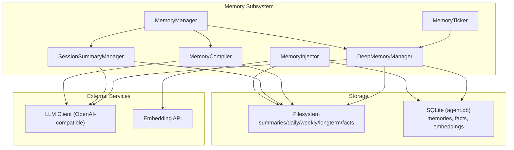
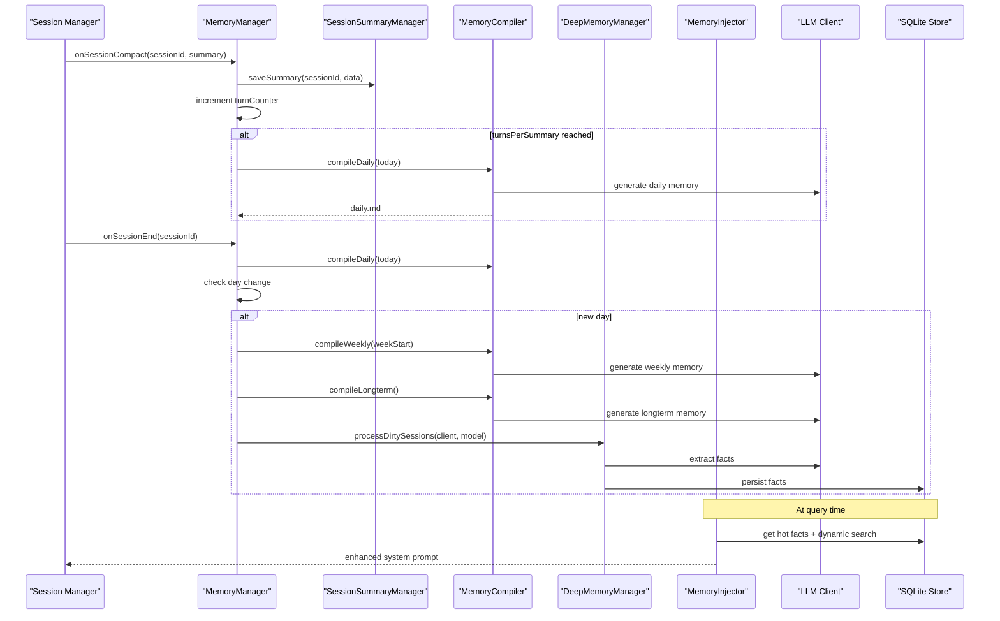
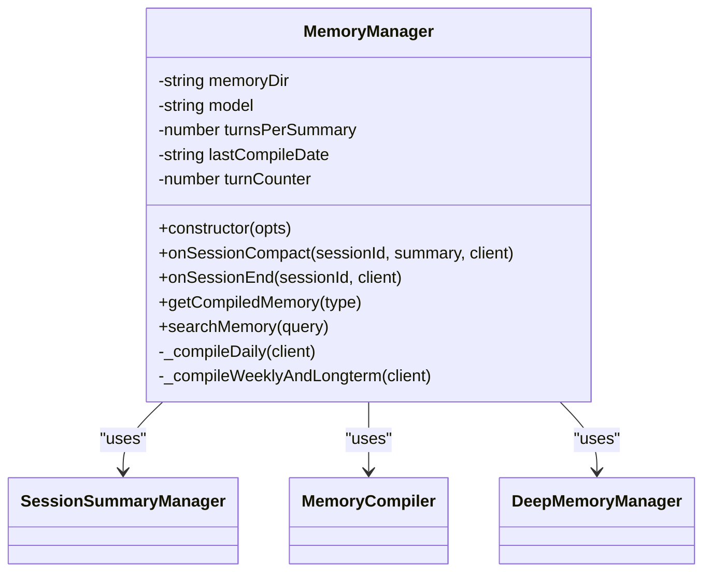
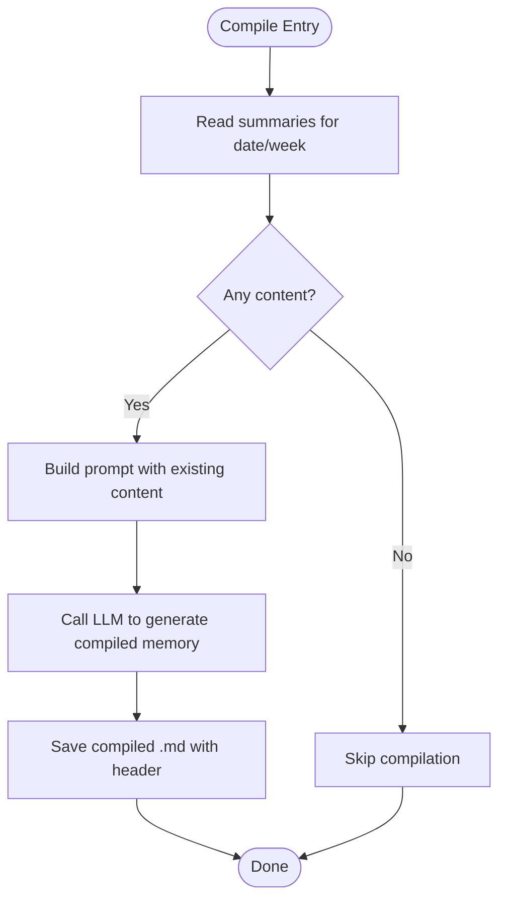
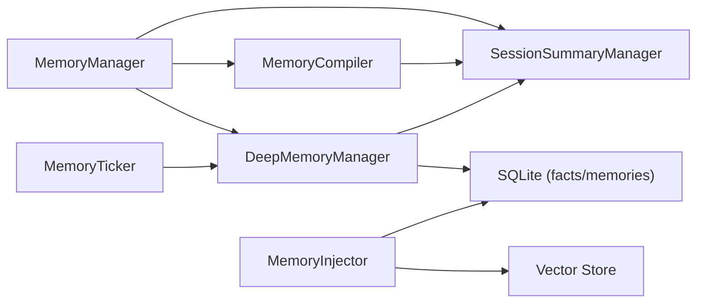

# Memory Architecture Overview

<cite>
**Referenced Files in This Document**
- [memory-manager.ts](file://core/memory/memory-manager.ts)
- [session-summary.ts](file://core/memory/session-summary.ts)
- [compile.ts](file://core/memory/compile.ts)
- [deep-memory.ts](file://core/memory/deep-memory.ts)
- [memory-ticker.ts](file://core/memory/memory-ticker.ts)
- [memory-injector.ts](file://core/memory/memory-injector.ts)
- [store.ts](file://core/memory/store.ts)
- [vector-store.ts](file://core/memory/vector-store.ts)
- [compiled-memory-state.ts](file://core/memory/compiled-memory-state.ts)
- [config.ts](file://core/config.ts)
</cite>

## Table of Contents
1. Introduction
2. Project Structure
3. Core Components
4. Architecture Overview
5. Detailed Component Analysis
6. Dependency Analysis
7. Performance Considerations
8. Troubleshooting Guide
9. Conclusion

## Introduction
This document explains the multi-tiered memory architecture that provides long-term knowledge retention for conversations. The system organizes knowledge across a hierarchy: session summaries, daily memories, weekly memories, and long-term memories, with an additional layer of structured facts extracted from summaries. A central orchestrator coordinates summarization, compilation, and deep memory processing, while a ticker schedules periodic tasks and an injector injects relevant memories into conversation context.

## Project Structure
The memory subsystem is implemented under core/memory and integrates with storage (SQLite), vector search, and configuration. Key directories created at runtime include summaries, daily, weekly, longterm, and facts.

**Diagram sources**
- [memory-manager.ts:30-79](file://core/memory/memory-manager.ts#L30-L79)
- [session-summary.ts:31-53](file://core/memory/session-summary.ts#L31-L53)
- [compile.ts:20-40](file://core/memory/compile.ts#L20-L40)
- [deep-memory.ts:32-57](file://core/memory/deep-memory.ts#L32-L57)
- [memory-ticker.ts:28-41](file://core/memory/memory-ticker.ts#L28-L41)
- [memory-injector.ts:49-128](file://core/memory/memory-injector.ts#L49-L128)
- [store.ts:35-61](file://core/memory/store.ts#L35-L61)
- [vector-store.ts:29-40](file://core/memory/vector-store.ts#L29-L40)

**Section sources**
- [memory-manager.ts:61-79](file://core/memory/memory-manager.ts#L61-L79)
- [store.ts:35-61](file://core/memory/store.ts#L35-L61)
- [vector-store.ts:29-40](file://core/memory/vector-store.ts#L29-L40)

## Core Components
- MemoryManager: Central orchestrator coordinating SessionSummaryManager, MemoryCompiler, and DeepMemoryManager. It manages directory layout, turn-based triggers, and scheduled compilations.
- SessionSummaryManager: Persists per-session JSON summaries and supports dirty tracking for deep memory processing.
- MemoryCompiler: Compiles summaries into daily, weekly, and long-term Markdown artifacts using LLM calls.
- DeepMemoryManager: Extracts structured facts from summaries and persists them to both files and SQLite; supports search.
- MemoryTicker: Periodic scheduler that runs cleanup and fact extraction on a configurable interval.
- MemoryInjector: Merges hot and dynamically retrieved facts into the system prompt with budget control.
- Storage Layer: SQLite-backed store for memories and facts, plus optional vector embeddings for semantic search.

**Section sources**
- [memory-manager.ts:30-79](file://core/memory/memory-manager.ts#L30-L79)
- [session-summary.ts:31-53](file://core/memory/session-summary.ts#L31-L53)
- [compile.ts:20-40](file://core/memory/compile.ts#L20-L40)
- [deep-memory.ts:32-57](file://core/memory/deep-memory.ts#L32-L57)
- [memory-ticker.ts:28-41](file://core/memory/memory-ticker.ts#L28-L41)
- [memory-injector.ts:49-128](file://core/memory/memory-injector.ts#L49-L128)
- [store.ts:35-61](file://core/memory/store.ts#L35-L61)

## Architecture Overview
The memory pipeline follows these phases:
- Summarization: After compaction or periodically, session summaries are generated and persisted.
- Compilation: Daily, weekly, and long-term memories are compiled from summaries and lower-level memories.
- Deep Memory: Structured facts are extracted from summaries and stored for retrieval.
- Injection: Relevant facts are merged into the system prompt before LLM inference.

**Diagram sources**
- [memory-manager.ts:91-127](file://core/memory/memory-manager.ts#L91-L127)
- [compile.ts:53-132](file://core/memory/compile.ts#L53-L132)
- [deep-memory.ts:69-105](file://core/memory/deep-memory.ts#L69-L105)
- [memory-injector.ts:49-128](file://core/memory/memory-injector.ts#L49-L128)
- [store.ts:226-274](file://core/memory/store.ts#L226-L274)

## Detailed Component Analysis

### MemoryManager (Orchestrator)
Responsibilities:
- Initialize memory directories: summaries, daily, weekly, longterm, facts.
- Track turns and trigger daily compilation after a configured number of turns.
- On session end, perform final daily compilation and, if it’s a new day, compile weekly and long-term memories and run deep memory processing.
- Provide compiled memory content for injection and expose search via DeepMemoryManager.

Key configuration options:
- memoryDir: base path for memory artifacts.
- model: default model used for compilation and deep memory.
- turnsPerSummary: threshold to trigger daily compilation.

**Diagram sources**
- [memory-manager.ts:30-79](file://core/memory/memory-manager.ts#L30-L79)
- [memory-manager.ts:163-196](file://core/memory/memory-manager.ts#L163-L196)

**Section sources**
- [memory-manager.ts:61-79](file://core/memory/memory-manager.ts#L61-L79)
- [memory-manager.ts:91-127](file://core/memory/memory-manager.ts#L91-L127)
- [memory-manager.ts:138-154](file://core/memory/memory-manager.ts#L138-L154)
- [memory-manager.ts:163-196](file://core/memory/memory-manager.ts#L163-L196)

### SessionSummaryManager
Responsibilities:
- Persist per-session summaries as JSON files under summaries/.
- Maintain a cache and support dirty detection by comparing summary vs snapshot.
- Generate summaries via LLM when needed.

Data flow:
- Save/update summary on compaction or generation.
- Mark processed when deep memory has consumed the summary.

**Section sources**
- [session-summary.ts:31-53](file://core/memory/session-summary.ts#L31-L53)
- [session-summary.ts:64-86](file://core/memory/session-summary.ts#L64-L86)
- [session-summary.ts:105-128](file://core/memory/session-summary.ts#L105-L128)
- [session-summary.ts:193-222](file://core/memory/session-summary.ts#L193-L222)

### MemoryCompiler
Responsibilities:
- Compile daily memories from same-day summaries.
- Compile weekly memories from the past seven days’ daily memories.
- Compile long-term memories from recent daily and weekly artifacts.
- Write Markdown outputs with metadata headers.

Compilation logic highlights:
- Reads existing compiled content to enable incremental updates.
- Uses LLM to produce structured, concise summaries.
- Saves outputs with source metadata.

**Diagram sources**
- [compile.ts:53-81](file://core/memory/compile.ts#L53-L81)
- [compile.ts:94-132](file://core/memory/compile.ts#L94-L132)
- [compile.ts:144-193](file://core/memory/compile.ts#L144-L193)

**Section sources**
- [compile.ts:20-40](file://core/memory/compile.ts#L20-L40)
- [compile.ts:53-81](file://core/memory/compile.ts#L53-L81)
- [compile.ts:94-132](file://core/memory/compile.ts#L94-L132)
- [compile.ts:144-193](file://core/memory/compile.ts#L144-L193)
- [compile.ts:205-229](file://core/memory/compile.ts#L205-L229)

### DeepMemoryManager
Responsibilities:
- Identify “dirty” sessions where summary changed since last processing.
- Extract up to N structured facts per summary via LLM.
- Persist facts to files and SQLite; provide simple keyword search.

Fact persistence:
- Writes JSON backup files under facts/.
- Inserts rows into SQLite facts table for efficient retrieval.

Search:
- Simple keyword matching across content and tags.
- Optional integration with vector search via vector-store.

**Section sources**
- [deep-memory.ts:32-57](file://core/memory/deep-memory.ts#L32-L57)
- [deep-memory.ts:69-105](file://core/memory/deep-memory.ts#L69-L105)
- [deep-memory.ts:115-194](file://core/memory/deep-memory.ts#L115-L194)
- [deep-memory.ts:201-212](file://core/memory/deep-memory.ts#L201-L212)
- [deep-memory.ts:223-247](file://core/memory/deep-memory.ts#L223-L247)

### MemoryTicker
Responsibilities:
- Schedule periodic execution (default every 24 hours).
- Run cleanup of old facts and optionally fact extraction if an LLM client is provided.
- Guard against concurrent runs and report results.

**Section sources**
- [memory-ticker.ts:28-41](file://core/memory/memory-ticker.ts#L28-L41)
- [memory-ticker.ts:89-133](file://core/memory/memory-ticker.ts#L89-L133)

### MemoryInjector
Responsibilities:
- Merge hot facts (high importance, recently accessed) and dynamically retrieved facts based on user messages.
- Deduplicate and enforce a character budget to avoid prompt bloat.
- Prepend a marker to clearly separate injected background from instructions.

Search strategy:
- Prefer vector similarity search; fallback to FTS5 or LIKE-based search if embedding fails.

**Section sources**
- [memory-injector.ts:49-128](file://core/memory/memory-injector.ts#L49-L128)
- [vector-store.ts:150-202](file://core/memory/vector-store.ts#L150-L202)
- [store.ts:201-216](file://core/memory/store.ts#L201-L216)
- [store.ts:253-268](file://core/memory/store.ts#L253-L268)

### Compiled Memory State Utilities
Responsibilities:
- Manage reset markers and clear compiled artifacts.
- Normalize LLM outputs by stripping thinking blocks and handling array formats.

**Section sources**
- [compiled-memory-state.ts:23-60](file://core/memory/compiled-memory-state.ts#L23-L60)
- [compiled-memory-state.ts:70-93](file://core/memory/compiled-memory-state.ts#L70-L93)
- [compiled-memory-state.ts:104-134](file://core/memory/compiled-memory-state.ts#L104-L134)

## Dependency Analysis
High-level dependencies:
- MemoryManager depends on SessionSummaryManager, MemoryCompiler, and DeepMemoryManager.
- MemoryCompiler depends on SessionSummaryManager for reading summaries and uses LLM clients for generation.
- DeepMemoryManager depends on SessionSummaryManager for dirty sessions and writes to both filesystem and SQLite.
- MemoryInjector depends on store and vector-store for retrieval and merging.
- MemoryTicker depends on DeepMemoryManager and cleanup utilities.

**Diagram sources**
- [memory-manager.ts:30-79](file://core/memory/memory-manager.ts#L30-L79)
- [compile.ts:20-40](file://core/memory/compile.ts#L20-L40)
- [deep-memory.ts:32-57](file://core/memory/deep-memory.ts#L32-L57)
- [memory-injector.ts:49-128](file://core/memory/memory-injector.ts#L49-L128)
- [vector-store.ts:150-202](file://core/memory/vector-store.ts#L150-L202)
- [store.ts:35-61](file://core/memory/store.ts#L35-L61)

**Section sources**
- [memory-manager.ts:30-79](file://core/memory/memory-manager.ts#L30-L79)
- [compile.ts:20-40](file://core/memory/compile.ts#L20-L40)
- [deep-memory.ts:32-57](file://core/memory/deep-memory.ts#L32-L57)
- [memory-injector.ts:49-128](file://core/memory/memory-injector.ts#L49-L128)
- [vector-store.ts:150-202](file://core/memory/vector-store.ts#L150-L202)
- [store.ts:35-61](file://core/memory/store.ts#L35-L61)

## Performance Considerations
- Turn-based triggering: Use turnsPerSummary to balance compilation frequency with performance.
- Incremental compilation: Existing compiled content is read and merged to reduce redundant work.
- Fact extraction limits: DeepMemoryManager caps extracted facts per session to control LLM usage.
- Vector search budget: Embedding budget limits per search call to bound API costs.
- Cleanup batching: Old facts are deleted in batches to avoid long transactions.

[No sources needed since this section provides general guidance]

## Troubleshooting Guide
Common issues and remedies:
- Compilation failures: If LLM calls fail, compilers return existing content; verify model selection and provider availability.
- Dirty sessions not processed: Ensure deep memory runs on day boundaries and that markProcessed is called after extraction.
- Search returns empty: Check FTS5 availability and fallback behavior; confirm embeddings exist or allow lazy embedding.
- Prompt too large: Adjust maxChars in MemoryInjector and tune hot/relevant limits.

Operational checks:
- Verify memory directories exist and are writable.
- Confirm SQLite database initialization and schema migration.
- Validate environment variables for data paths and retention policies.

**Section sources**
- [compile.ts:64-81](file://core/memory/compile.ts#L64-L81)
- [deep-memory.ts:115-194](file://core/memory/deep-memory.ts#L115-L194)
- [memory-injector.ts:49-128](file://core/memory/memory-injector.ts#L49-L128)
- [store.ts:35-61](file://core/memory/store.ts#L35-L61)

## Conclusion
The memory architecture provides a robust, multi-tiered approach to retaining conversational knowledge. By separating concerns across summarization, compilation, deep memory extraction, and injection, the system balances accuracy, cost, and performance. Configuration options such as turnsPerSummary, model selection, and directory paths allow customization to different operational needs.

[No sources needed since this section summarizes without analyzing specific files]