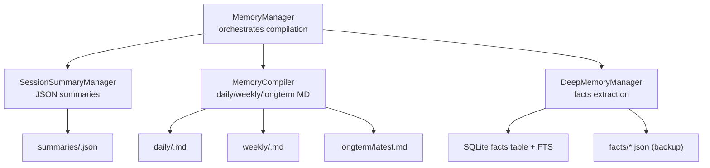
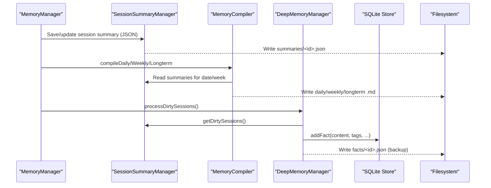
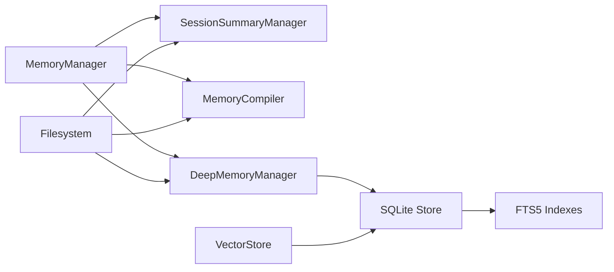

# Memory Storage & Format

<cite>
**Referenced Files in This Document**
- [store.ts](file://core/memory/store.ts)
- [schema.sql](file://db/schema.sql)
- [fact-store.ts](file://core/memory/fact-store.ts)
- [rolling-summary-format.ts](file://core/memory/rolling-summary-format.ts)
- [session-summary.ts](file://core/memory/session-summary.ts)
- [compile.ts](file://core/memory/compile.ts)
- [deep-memory.ts](file://core/memory/deep-memory.ts)
- [memory-manager.ts](file://core/memory/memory-manager.ts)
- [vector-store.ts](file://core/memory/vector-store.ts)
- [compiled-memory-snapshot.ts](file://lib/memory/compiled-memory-snapshot.ts)
- [compiled-memory-state.ts](file://lib/memory/compiled-memory-state.ts)
</cite>

## Table of Contents
1. [Introduction](#introduction)
2. [Project Structure](#project-structure)
3. [Core Components](#core-components)
4. [Architecture Overview](#architecture-overview)
5. [Detailed Component Analysis](#detailed-component-analysis)
6. [Dependency Analysis](#dependency-analysis)
7. [Performance Considerations](#performance-considerations)
8. [Troubleshooting Guide](#troubleshooting-guide)
9. [Conclusion](#conclusion)
10. [Appendices](#appendices)

## Introduction
This document describes the memory storage formats and data persistence strategies used by the system. It covers:
- File-based storage architecture and directory layout (summaries/, daily/, weekly/, longterm/, facts/)
- JSON and Markdown formats for different memory types, including field definitions, validation rules, and versioning strategies
- FactStore implementation for semantic fact management
- RollingSummaryFormat for efficient summary updates
- Examples of storage schemas, migration procedures, backup strategies, and performance optimization techniques for large datasets

## Project Structure
The memory subsystem uses a hybrid persistence model:
- SQLite database for primary structured storage and full-text search
- File-based artifacts for human-readable summaries and compiled memories
- Optional vector embeddings stored in SQLite for semantic similarity search

Key directories created at runtime under the agent’s data root:
- summaries/: per-session JSON summaries with rolling updates
- daily/: compiled daily Markdown summaries keyed by date
- weekly/: compiled weekly Markdown summaries keyed by week start
- longterm/: compiled long-term Markdown summary (latest.md)
- facts/: per-fact JSON files (backup), while canonical retrieval is via SQLite

**Diagram sources**
- [memory-manager.ts:30-79](file://core/memory/memory-manager.ts#L30-L79)
- [session-summary.ts:31-95](file://core/memory/session-summary.ts#L31-L95)
- [compile.ts:20-40](file://core/memory/compile.ts#L20-L40)
- [deep-memory.ts:32-57](file://core/memory/deep-memory.ts#L32-L57)
- [store.ts:1-61](file://core/memory/store.ts#L1-L61)

**Section sources**
- [memory-manager.ts:30-79](file://core/memory/memory-manager.ts#L30-L79)
- [session-summary.ts:31-95](file://core/memory/session-summary.ts#L31-L95)
- [compile.ts:20-40](file://core/memory/compile.ts#L20-L40)
- [deep-memory.ts:32-57](file://core/memory/deep-memory.ts#L32-L57)
- [store.ts:1-61](file://core/memory/store.ts#L1-L61)

## Core Components
- SQLite-backed store for memories and facts with FTS5 indexes
- FactStore with enhanced CJK-friendly search and snapshot compilation
- RollingSummaryFormat contract for consistent summary structure and repair
- SessionSummaryManager for per-session JSON summaries
- MemoryCompiler for daily/weekly/longterm Markdown compilation
- DeepMemoryManager for extracting structured facts from summaries
- VectorStore for embedding-based similarity search over facts

**Section sources**
- [store.ts:1-120](file://core/memory/store.ts#L1-L120)
- [fact-store.ts:1-120](file://core/memory/fact-store.ts#L1-L120)
- [rolling-summary-format.ts:22-90](file://core/memory/rolling-summary-format.ts#L22-L90)
- [session-summary.ts:31-95](file://core/memory/session-summary.ts#L31-L95)
- [compile.ts:20-81](file://core/memory/compile.ts#L20-L81)
- [deep-memory.ts:32-105](file://core/memory/deep-memory.ts#L32-L105)
- [vector-store.ts:1-40](file://core/memory/vector-store.ts#L1-L40)

## Architecture Overview
The system integrates multiple layers:
- Session-level summaries are persisted as JSON and updated incrementally
- Compiled summaries are written as Markdown to daily/weekly/longterm directories
- Facts are extracted from summaries and stored in SQLite with FTS5; file backups are kept under facts/
- Vector embeddings are lazily computed and stored in SQLite for semantic search

**Diagram sources**
- [memory-manager.ts:91-127](file://core/memory/memory-manager.ts#L91-L127)
- [session-summary.ts:81-95](file://core/memory/session-summary.ts#L81-L95)
- [compile.ts:53-81](file://core/memory/compile.ts#L53-L81)
- [deep-memory.ts:69-105](file://core/memory/deep-memory.ts#L69-L105)
- [store.ts:226-245](file://core/memory/store.ts#L226-L245)

## Detailed Component Analysis

### SQLite Schema and Data Models
- Tables:
  - memories: core memory entries with importance, timestamps, access metrics, type, tags, session_id, user_id
  - facts: extracted meta-facts with source_type, importance, tags, session_id, user_id
  - agents: agent instance configuration
  - cron_jobs: scheduled tasks linked to agents
- Full-text search:
  - memories_fts and facts_fts virtual tables using FTS5 with triggers for synchronization
- Indexes:
  - user_id, created_at, memory_type, last_accessed, session_id for optimized queries

Validation rules enforced by schema:
- importance ranges between 1 and 5
- memory_type restricted to conversation, fact, preference, system
- source_type restricted to extraction, user_input, system

Migration strategy:
- On initialization, adds missing user_id columns and indexes if not present

**Section sources**
- [schema.sql:1-104](file://db/schema.sql#L1-L104)
- [store.ts:49-61](file://core/memory/store.ts#L49-L61)

### FactStore Implementation
Responsibilities:
- Build CJK-friendly search text using bigram/trigram ngrams
- Construct FTS5 queries with lexical tokens and ngrams
- Search memories and facts with fallback to LIKE when FTS unavailable
- Compile multiple memories into a single “snapshot” fact to reduce context size
- Auto-compile old conversation memories into high-importance facts periodically

Complexity considerations:
- Ngram generation is linear in token length; deduplication uses a Set for O(1) average-time checks
- FTS MATCH queries leverage SQLite’s FTS5 ranking; fallback queries use LIKE with lower precision

Error handling:
- Graceful degradation to LIKE-based search if FTS is unavailable
- Robust tag parsing handles both array and JSON string representations

**Section sources**
- [fact-store.ts:1-120](file://core/memory/fact-store.ts#L1-L120)
- [fact-store.ts:170-253](file://core/memory/fact-store.ts#L170-L253)

### RollingSummaryFormat Contract
Purpose:
- Single source of truth for required summary sections and titles
- Enforces two fixed sections: Key Facts and Timeline
- Provides validation, repair prompts, and input builders to ensure parseable outputs

Key behaviors:
- Title constants support both Chinese and English locales
- Validation checks presence of facts heading, non-empty facts body, and termination by timeline heading
- Repair prompt instructs LLM to restructure without altering factual content
- Max repairs limited to prevent infinite loops

Usage points:
- Summary generation utilities and reflection runners produce summaries adhering to this contract
- Consumers like compileFacts extract facts based on these section boundaries

**Section sources**
- [rolling-summary-format.ts:22-90](file://core/memory/rolling-summary-format.ts#L22-L90)
- [rolling-summary-format.ts:154-179](file://core/memory/rolling-summary-format.ts#L154-L179)
- [rolling-summary-format.ts:185-271](file://core/memory/rolling-summary-format.ts#L185-L271)

### SessionSummaryManager (JSON Summaries)
Storage format:
- One JSON file per session under summaries/
- Fields include sessionId, created_at, updated_at, summary (Markdown with facts/timeline), optional snapshot and snapshot_at

Lifecycle:
- Atomic writes ensure consistency
- In-memory cache reduces repeated disk reads
- Dirty session detection compares summary vs snapshot to trigger deep memory processing

Versioning:
- No explicit schema version field; relies on stable fields and graceful error handling on read

**Section sources**
- [session-summary.ts:31-95](file://core/memory/session-summary.ts#L31-L95)
- [session-summary.ts:105-128](file://core/memory/session-summary.ts#L105-L128)

### MemoryCompiler (Markdown Compilation)
Outputs:
- daily/<YYYY-MM-DD>.md
- weekly/<YYYY-MM-DD>.md (Monday start)
- longterm/latest.md

Process:
- Reads relevant summaries or lower-level compiled contents
- Builds prompts that preserve existing content and incorporate new inputs
- Writes compiled Markdown with YAML frontmatter indicating source, date, and source sessions

Robustness:
- Returns existing content on failure to avoid losing previously compiled summaries

**Section sources**
- [compile.ts:20-81](file://core/memory/compile.ts#L20-L81)
- [compile.ts:94-132](file://core/memory/compile.ts#L94-L132)
- [compile.ts:144-193](file://core/memory/compile.ts#L144-L193)
- [compile.ts:221-229](file://core/memory/compile.ts#L221-L229)

### DeepMemoryManager (Fact Extraction and Persistence)
Workflow:
- Identifies dirty sessions where summary differs from snapshot
- Extracts up to five structured facts per summary via LLM with strict JSON output
- Persists each fact to SQLite and writes a JSON backup under facts/
- Marks processed sessions by setting snapshot = summary

Fact JSON schema (per-file):
- id, content, tags, sourceSession, created_at, confidence

Integration:
- Uses addFact to persist canonical records in SQLite facts table
- Supports multi-user isolation via user_id parameter

**Section sources**
- [deep-memory.ts:69-105](file://core/memory/deep-memory.ts#L69-L105)
- [deep-memory.ts:115-194](file://core/memory/deep-memory.ts#L115-L194)
- [deep-memory.ts:201-212](file://core/memory/deep-memory.ts#L201-L212)
- [store.ts:226-245](file://core/memory/store.ts#L226-L245)

### VectorStore (Embedding-Based Retrieval)
Design:
- Lazy embedding creation: embeddings generated on first search rather than at write time
- Embeddings stored as packed float32 buffers in SQLite fact_embeddings table
- Cosine similarity scoring performed in-process after loading vectors

Operations:
- embedTexts: calls provider embedding endpoint
- ensureEmbedding: creates embedding if missing
- searchByVector: embeds query, lazily embeds facts up to budget, scores and returns top-k

Failure modes:
- Embedding API failures are logged and skipped; callers should fallback to FTS5

**Section sources**
- [vector-store.ts:1-40](file://core/memory/vector-store.ts#L1-L40)
- [vector-store.ts:77-110](file://core/memory/vector-store.ts#L77-L110)
- [vector-store.ts:116-135](file://core/memory/vector-store.ts#L116-L135)
- [vector-store.ts:150-202](file://core/memory/vector-store.ts#L150-L202)

### Compiled Memory Snapshot (Alternative Layout)
A parallel layout exists for compiled memory blocks:
- Sections: facts, today, week, longterm
- Written as individual Markdown files plus an assembled memory.md
- Includes reset markers and fingerprint cleanup utilities

Normalization:
- Empty placeholders normalized to empty strings
- Import seed IDs sanitized for filesystem safety

**Section sources**
- [compiled-memory-snapshot.ts:1-73](file://lib/memory/compiled-memory-snapshot.ts#L1-L73)
- [compiled-memory-snapshot.ts:149-169](file://lib/memory/compiled-memory-snapshot.ts#L149-L169)
- [compiled-memory-state.ts:1-43](file://lib/memory/compiled-memory-state.ts#L1-L43)

## Dependency Analysis
High-level dependencies among components:
- MemoryManager orchestrates SessionSummaryManager, MemoryCompiler, and DeepMemoryManager
- DeepMemoryManager depends on SessionSummaryManager and SQLite store
- FactStore and VectorStore depend on SQLite store and FTS5 indexes
- RollingSummaryFormat is consumed by summary producers and consumers to enforce structure

**Diagram sources**
- [memory-manager.ts:30-79](file://core/memory/memory-manager.ts#L30-L79)
- [session-summary.ts:31-95](file://core/memory/session-summary.ts#L31-L95)
- [compile.ts:20-40](file://core/memory/compile.ts#L20-L40)
- [deep-memory.ts:32-57](file://core/memory/deep-memory.ts#L32-L57)
- [store.ts:1-61](file://core/memory/store.ts#L1-L61)
- [vector-store.ts:1-40](file://core/memory/vector-store.ts#L1-L40)

**Section sources**
- [memory-manager.ts:30-79](file://core/memory/memory-manager.ts#L30-L79)
- [store.ts:1-61](file://core/memory/store.ts#L1-L61)
- [vector-store.ts:1-40](file://core/memory/vector-store.ts#L1-L40)

## Performance Considerations
- Use FTS5 for fast full-text search; rely on triggers to keep indexes synchronized
- Prefer batch operations and prepared statements to minimize round-trips
- Limit longterm compilation scope (e.g., recent days/weeks) to control prompt sizes
- Lazy embedding generation avoids upfront costs; cap embedBudget per search call
- Atomic writes reduce corruption risk and improve reliability under concurrent access
- Tag parsing tolerates both arrays and JSON strings to handle legacy data gracefully

[No sources needed since this section provides general guidance]

## Troubleshooting Guide
Common issues and remedies:
- FTS5 unavailable: searches fall back to LIKE; verify SQLite FTS5 extension availability
- Malformed LLM responses: robust JSON extraction strips reasoning blocks and repairs truncation
- Missing summary sections: validateRollingSummaryFormat detects missing headings or empty facts; use repair prompts to fix
- Stale snapshots: ensure markProcessed is called after successful deep memory processing
- Embedding failures: log warnings and skip affected facts; fallback to keyword search

Operational tips:
- Monitor logs for failed compilations and extraction errors
- Periodically run cleanup routines to remove low-importance, rarely accessed memories
- Validate summary outputs against the RollingSummaryFormat contract before writing

**Section sources**
- [fact-store.ts:73-116](file://core/memory/fact-store.ts#L73-L116)
- [deep-memory.ts:298-327](file://core/memory/deep-memory.ts#L298-L327)
- [rolling-summary-format.ts:154-179](file://core/memory/rolling-summary-format.ts#L154-L179)

## Conclusion
The memory subsystem combines structured SQLite storage with human-readable Markdown and JSON artifacts. The RollingSummaryFormat ensures consistent summary structures, FactStore enhances searchability with CJK-aware indexing, and DeepMemoryManager extracts durable facts for long-term recall. VectorStore offers semantic retrieval with lazy embedding generation. Together, these components provide scalable, resilient, and maintainable memory persistence.

[No sources needed since this section summarizes without analyzing specific files]

## Appendices

### Storage Schemas and Field Definitions

- Session summary JSON (summaries/<sessionId>.json)
  - Fields: sessionId, created_at, updated_at, summary, snapshot, snapshot_at
  - Validation: atomic writes; graceful read errors; snapshot equals summary when processed

- Compiled Markdown (daily/weekly/longterm)
  - Frontmatter includes source, date, source_sessions
  - Content follows structured Markdown with facts and timeline sections

- Fact JSON (facts/<factId>.json)
  - Fields: id, content, tags, sourceSession, created_at, confidence

- SQLite tables
  - memories: id, content, importance, created_at, last_accessed, access_count, memory_type, tags, session_id, user_id
  - facts: id, content, tags, session_id, created_at, source_type, importance, user_id
  - agents: id, name, personality, model, api_key, base_url, allowed_paths, created_at, updated_at
  - cron_jobs: id, agent_id, schedule, task, last_run, enabled

**Section sources**
- [session-summary.ts:31-95](file://core/memory/session-summary.ts#L31-L95)
- [compile.ts:221-229](file://core/memory/compile.ts#L221-L229)
- [deep-memory.ts:201-212](file://core/memory/deep-memory.ts#L201-L212)
- [schema.sql:1-104](file://db/schema.sql#L1-L104)

### Migration Procedures
- Add user_id column and index to existing tables if missing during initialization
- Normalize tags from JSON strings to arrays on read
- Ensure FTS5 virtual tables exist and triggers are active

**Section sources**
- [store.ts:49-61](file://core/memory/store.ts#L49-L61)
- [store.ts:63-69](file://core/memory/store.ts#L63-L69)
- [schema.sql:16-37](file://db/schema.sql#L16-L37)

### Backup Strategies
- Filesystem backups:
  - summaries/, daily/, weekly/, longterm/, facts/ contain all human-readable artifacts
- Database backups:
  - agent.db contains canonical structured data and FTS indexes
- Atomic writes:
  - Ensures partial writes do not corrupt summaries and compiled files

**Section sources**
- [session-summary.ts:81-95](file://core/memory/session-summary.ts#L81-L95)
- [deep-memory.ts:201-212](file://core/memory/deep-memory.ts#L201-L212)
- [store.ts:37-47](file://core/memory/store.ts#L37-L47)

### Versioning Strategies
- Summary JSON does not declare an explicit schema version; rely on stable fields and tolerant parsing
- Compiled Markdown frontmatter includes metadata for traceability
- Reset markers track compiled memory resets and update timestamps

**Section sources**
- [session-summary.ts:31-95](file://core/memory/session-summary.ts#L31-L95)
- [compile.ts:221-229](file://core/memory/compile.ts#L221-L229)
- [compiled-memory-state.ts:1-43](file://lib/memory/compiled-memory-state.ts#L1-L43)