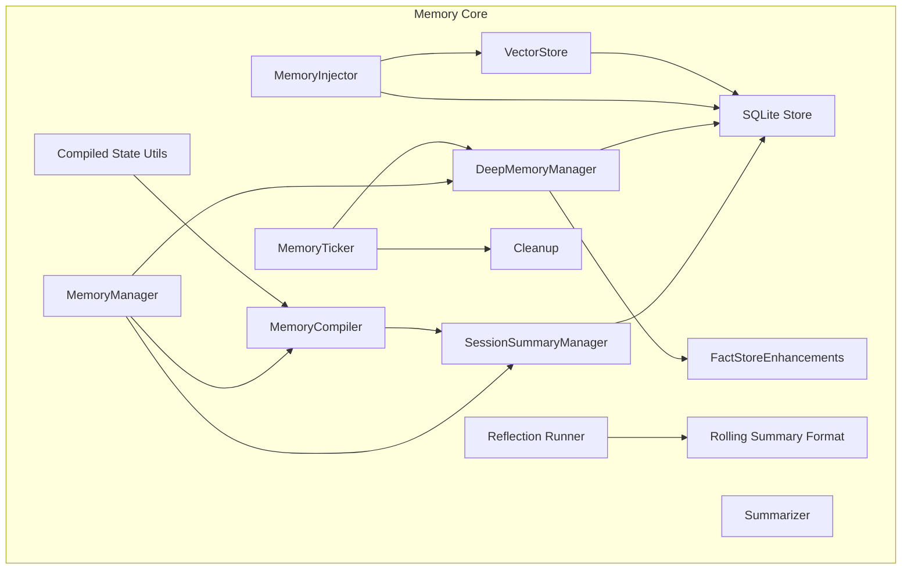
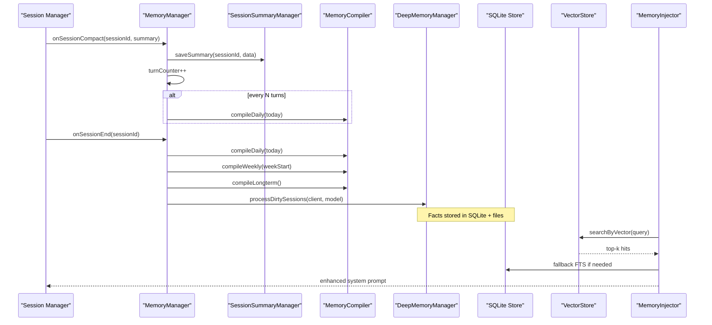
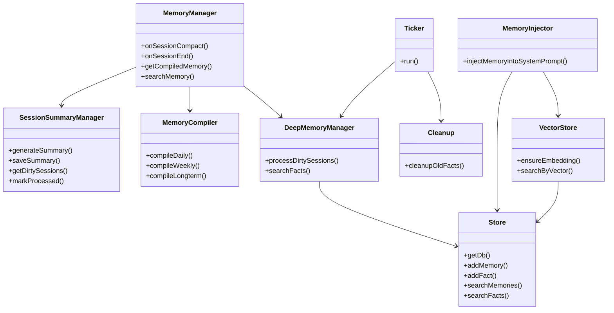

# Memory System

<cite>
**Referenced Files in This Document**
- [memory-manager.ts](file://core/memory/memory-manager.ts)
- [compile.ts](file://core/memory/compile.ts)
- [session-summary.ts](file://core/memory/session-summary.ts)
- [deep-memory.ts](file://core/memory/deep-memory.ts)
- [fact-store.ts](file://core/memory/fact-store.ts)
- [store.ts](file://core/memory/store.ts)
- [vector-store.ts](file://core/memory/vector-store.ts)
- [summarizer.ts](file://core/memory/summarizer.ts)
- [memory-injector.ts](file://core/memory/memory-injector.ts)
- [memory-cleanup.ts](file://core/memory/memory-cleanup.ts)
- [rolling-summary-format.ts](file://core/memory/rolling-summary-format.ts)
- [memory-ticker.ts](file://core/memory/memory-ticker.ts)
- [memory-reflection-runner.ts](file://core/memory/memory-reflection-runner.ts)
- [compiled-memory-state.ts](file://core/memory/compiled-memory-state.ts)
- [schema.sql](file://db/schema.sql)
</cite>

## Table of Contents
1. Introduction
2. Project Structure
3. Core Components
4. Architecture Overview
5. Detailed Component Analysis
6. Dependency Analysis
7. Performance Considerations
8. Troubleshooting Guide
9. Conclusion
10. Appendices

## Introduction
This document explains the memory system focused on knowledge retention and compilation. It covers a multi-tiered architecture that includes session summaries, daily/weekly/long-term compilations, deep fact extraction, semantic search, and context injection during conversations. It also documents storage formats, indexing strategies, performance optimization, cleanup, backup, and migration procedures.

## Project Structure
The memory subsystem is implemented under core/memory with supporting database schema in db/schema.sql. Key responsibilities:
- Session summarization and persistence
- Multi-tier compilation (daily → weekly → longterm)
- Deep fact extraction from summaries
- Semantic and keyword search
- Context injection into prompts
- Scheduled processing and cleanup

**Diagram sources**
- [memory-manager.ts](file://core/memory/memory-manager.ts)
- [session-summary.ts](file://core/memory/session-summary.ts)
- [compile.ts](file://core/memory/compile.ts)
- [deep-memory.ts](file://core/memory/deep-memory.ts)
- [summarizer.ts](file://core/memory/summarizer.ts)
- [memory-injector.ts](file://core/memory/memory-injector.ts)
- [vector-store.ts](file://core/memory/vector-store.ts)
- [fact-store.ts](file://core/memory/fact-store.ts)
- [memory-cleanup.ts](file://core/memory/memory-cleanup.ts)
- [memory-ticker.ts](file://core/memory/memory-ticker.ts)
- [rolling-summary-format.ts](file://core/memory/rolling-summary-format.ts)
- [memory-reflection-runner.ts](file://core/memory/memory-reflection-runner.ts)
- [compiled-memory-state.ts](file://core/memory/compiled-memory-state.ts)

**Section sources**
- [memory-manager.ts](file://core/memory/memory-manager.ts)
- [store.ts](file://core/memory/store.ts)
- [schema.sql](file://db/schema.sql)

## Core Components
- MemoryManager: Orchestrates summarization triggers, periodic compilation, and retrieval for injection.
- SessionSummaryManager: Persists per-session rolling summaries and tracks dirty sessions for deep processing.
- MemoryCompiler: Compiles summaries into daily, weekly, and long-term Markdown artifacts using LLMs.
- DeepMemoryManager: Extracts structured facts from summaries and persists them to SQLite and files.
- Summarizer: Provides general-purpose compaction and summary generation utilities.
- MemoryInjector: Merges hot facts and dynamically retrieved facts into system prompts with budget control.
- VectorStore: Embedding-backed similarity search with lazy embedding and cosine scoring.
- FactStoreEnhancements: CJK-friendly FTS queries and snapshot compilation helpers.
- Cleanup: Retention-based deletion of old facts and embeddings.
- Ticker: Periodic scheduler for fact extraction and cleanup.
- Reflection Runner & Rolling Summary Format: Enforce consistent summary structure and repair when needed.
- Compiled State Utils: Reset markers, artifact clearing, and output normalization.

**Section sources**
- [memory-manager.ts](file://core/memory/memory-manager.ts)
- [session-summary.ts](file://core/memory/session-summary.ts)
- [compile.ts](file://core/memory/compile.ts)
- [deep-memory.ts](file://core/memory/deep-memory.ts)
- [summarizer.ts](file://core/memory/summarizer.ts)
- [memory-injector.ts](file://core/memory/memory-injector.ts)
- [vector-store.ts](file://core/memory/vector-store.ts)
- [fact-store.ts](file://core/memory/fact-store.ts)
- [memory-cleanup.ts](file://core/memory/memory-cleanup.ts)
- [memory-ticker.ts](file://core/memory/memory-ticker.ts)
- [rolling-summary-format.ts](file://core/memory/rolling-summary-format.ts)
- [memory-reflection-runner.ts](file://core/memory/memory-reflection-runner.ts)
- [compiled-memory-state.ts](file://core/memory/compiled-memory-state.ts)

## Architecture Overview
The system uses a layered pipeline:
- Session-level summaries are generated and persisted after compaction or at session end.
- Periodic compilation aggregates summaries into daily, weekly, and long-term Markdown memories.
- Deep memory extracts structured facts from summaries and stores them in SQLite with FTS5 indexes and optional vector embeddings.
- At query time, relevant facts are injected into the system prompt via hybrid retrieval (vector + FTS).

**Diagram sources**
- [memory-manager.ts](file://core/memory/memory-manager.ts)
- [session-summary.ts](file://core/memory/session-summary.ts)
- [compile.ts](file://core/memory/compile.ts)
- [deep-memory.ts](file://core/memory/deep-memory.ts)
- [vector-store.ts](file://core/memory/vector-store.ts)
- [memory-injector.ts](file://core/memory/memory-injector.ts)

## Detailed Component Analysis

### MemoryManager
Responsibilities:
- Initialize directories and components.
- Persist session summaries and trigger compilation based on turn thresholds.
- On session end, run daily and weekly/long-term compilation and deep memory processing.
- Provide compiled memory content and search interface.

Key behaviors:
- Directory layout: summaries, daily, weekly, longterm, facts.
- Turn-based scheduling for daily compilation.
- Date-aware weekly computation and long-term aggregation.

**Section sources**
- [memory-manager.ts](file://core/memory/memory-manager.ts)

### SessionSummaryManager
Responsibilities:
- Per-session JSON persistence with created_at/updated_at timestamps.
- Dirty tracking by comparing summary vs snapshot.
- Full cache population on first access.
- LLM-powered summary generation with rolling updates.

Data format:
- sessionId, created_at, updated_at, summary, snapshot, snapshot_at.

**Section sources**
- [session-summary.ts](file://core/memory/session-summary.ts)

### MemoryCompiler
Responsibilities:
- Compile daily, weekly, and long-term memories from summaries.
- Use LLM calls with controlled temperature and token limits.
- Save compiled Markdown with YAML frontmatter including source metadata.

Compilation flow:
- Daily: aggregate summaries for a date.
- Weekly: aggregate seven days of daily outputs.
- Long-term: aggregate recent daily and weekly outputs.

**Section sources**
- [compile.ts](file://core/memory/compile.ts)

### DeepMemoryManager
Responsibilities:
- Process dirty sessions to extract structured facts via LLM.
- Persist facts to both file backups and SQLite facts table.
- Search facts by simple keyword matching; integrate with enhanced FTS later.

Robustness:
- Handles reasoning blocks and malformed JSON from models.
- Normalizes array/object responses.

**Section sources**
- [deep-memory.ts](file://core/memory/deep-memory.ts)

### Summarizer
Responsibilities:
- General-purpose summarization and auto-compaction of older conversation memories.
- Creates high-importance fact entries for compacted summaries.

**Section sources**
- [summarizer.ts](file://core/memory/summarizer.ts)

### MemoryInjector
Responsibilities:
- Merge hot facts and dynamic retrieval results into system prompts.
- Budget enforcement to prevent prompt bloat.
- Hybrid retrieval: vector search first, FTS fallback.

Injection strategy:
- Hot facts from importance and recency.
- Dynamic facts from vector similarity or FTS.
- Deduplication and character budget trimming.

**Section sources**
- [memory-injector.ts](file://core/memory/memory-injector.ts)

### VectorStore
Responsibilities:
- Lazy embedding creation and cosine similarity scoring.
- Batch embedding for candidates within a budget.
- Robust error handling with graceful fallback.

Storage:
- fact_embeddings table with packed float vectors.

**Section sources**
- [vector-store.ts](file://core/memory/vector-store.ts)

### FactStoreEnhancements
Responsibilities:
- CJK-friendly ngram tokenization for FTS queries.
- Enhanced search functions for memories and facts.
- Snapshot compilation utilities to reduce context size.

**Section sources**
- [fact-store.ts](file://core/memory/fact-store.ts)

### Cleanup
Responsibilities:
- Delete old facts beyond retention window while protecting high-importance items.
- Remove orphaned embeddings.
- Support dry-run and user-scoped operations.

**Section sources**
- [memory-cleanup.ts](file://core/memory/memory-cleanup.ts)

### MemoryTicker
Responsibilities:
- Periodic execution of cleanup and fact extraction.
- Guard against concurrent runs.
- Return structured results for observability.

**Section sources**
- [memory-ticker.ts](file://core/memory/memory-ticker.ts)

### Rolling Summary Format & Reflection Runner
Responsibilities:
- Enforce fixed two-section structure for rolling summaries.
- Validate and repair summaries with limited retries.
- Provide localized prompts and input builders.

**Section sources**
- [rolling-summary-format.ts](file://core/memory/rolling-summary-format.ts)
- [memory-reflection-runner.ts](file://core/memory/memory-reflection-runner.ts)

### Compiled Memory State Utilities
Responsibilities:
- Manage reset markers and clear compiled artifacts.
- Normalize LLM outputs (strip thinking tags, parse arrays).
- Atomic writes for safety.

**Section sources**
- [compiled-memory-state.ts](file://core/memory/compiled-memory-state.ts)

### SQLite Store and Schema
Responsibilities:
- Centralized DB access and initialization.
- Tables: memories, facts, agents, cron_jobs.
- FTS5 virtual tables with triggers for synchronization.
- User isolation via user_id columns and indexes.

Schema highlights:
- memories_fts and facts_fts for full-text search.
- Indexes for user, type, timestamps, and session.

**Section sources**
- [store.ts](file://core/memory/store.ts)
- [schema.sql](file://db/schema.sql)

## Dependency Analysis
High-level dependencies:
- MemoryManager depends on SessionSummaryManager, MemoryCompiler, DeepMemoryManager.
- DeepMemoryManager depends on store.js and fact-store enhancements.
- MemoryInjector depends on store.js and vector-store.
- VectorStore depends on store.js and provider client configuration.
- Cleanup depends on store.js.
- Ticker orchestrates DeepMemoryManager and Cleanup.

**Diagram sources**
- [memory-manager.ts](file://core/memory/memory-manager.ts)
- [session-summary.ts](file://core/memory/session-summary.ts)
- [compile.ts](file://core/memory/compile.ts)
- [deep-memory.ts](file://core/memory/deep-memory.ts)
- [memory-injector.ts](file://core/memory/memory-injector.ts)
- [vector-store.ts](file://core/memory/vector-store.ts)
- [store.ts](file://core/memory/store.ts)
- [memory-cleanup.ts](file://core/memory/memory-cleanup.ts)
- [memory-ticker.ts](file://core/memory/memory-ticker.ts)

**Section sources**
- [memory-manager.ts](file://core/memory/memory-manager.ts)
- [deep-memory.ts](file://core/memory/deep-memory.ts)
- [memory-injector.ts](file://core/memory/memory-injector.ts)
- [vector-store.ts](file://core/memory/vector-store.ts)
- [store.ts](file://core/memory/store.ts)
- [memory-cleanup.ts](file://core/memory/memory-cleanup.ts)
- [memory-ticker.ts](file://core/memory/memory-ticker.ts)

## Performance Considerations
- Token and cost control:
  - Compilation uses low temperature and bounded max_tokens to limit costs.
  - Summarizer caps tokens and merges only older, infrequently accessed memories.
- Retrieval efficiency:
  - Vector search embeds lazily and caps batch size to avoid large requests.
  - FTS5 provides fast keyword search with automatic triggers keeping indexes in sync.
- Prompt budgeting:
  - Injector enforces hard character budgets and deduplicates to keep context small.
- Storage IO:
  - Atomic writes reduce corruption risk.
  - SQLite WAL disabled due to sandbox constraints; rely on single-writer patterns.

[No sources needed since this section provides general guidance]

## Troubleshooting Guide
Common issues and resolutions:
- LLM response parsing failures:
  - Deep memory extractor strips reasoning blocks and repairs truncated JSON.
  - If parsing still fails, inspect raw LLM output and adjust model parameters.
- Embedding API errors:
  - Vector store logs warnings and returns empty results; injector falls back to FTS.
  - Ensure active provider configuration and correct base URL/key.
- FTS unavailability:
  - Enhanced searches fall back to LIKE queries; verify FTS5 extension availability.
- Orphaned embeddings:
  - Cleanup removes embeddings without corresponding facts.
- Data integrity:
  - Use atomic write utilities and reset markers to recover from partial writes.

**Section sources**
- [deep-memory.ts](file://core/memory/deep-memory.ts)
- [vector-store.ts](file://core/memory/vector-store.ts)
- [memory-cleanup.ts](file://core/memory/memory-cleanup.ts)
- [compiled-memory-state.ts](file://core/memory/compiled-memory-state.ts)

## Conclusion
The memory system provides a robust, multi-tiered approach to retaining and retrieving knowledge across sessions. It balances accuracy and cost through careful prompting, batching, and fallback strategies. The combination of FTS5 and vector embeddings ensures flexible retrieval, while scheduled tasks maintain hygiene and relevance over time.

[No sources needed since this section summarizes without analyzing specific files]

## Appendices

### Practical Configuration Examples
- Memory manager options:
  - memoryDir: path to memory root directory.
  - model: default model for summarization and compilation.
  - turnsPerSummary: frequency threshold to trigger daily compilation.
- Ticker options:
  - intervalMs: schedule interval (default 24 hours).
  - enabled: toggle ticker.
  - cleanupEnabled: enable/disable cleanup on each tick.
- Cleanup options:
  - retentionDays: how many days to retain facts (env MEMORY_RETENTION_DAYS supported).
  - batchSize: number of rows deleted per batch.
  - dryRun: preview mode without deletions.
  - userId: scope cleanup to a specific user.

**Section sources**
- [memory-manager.ts](file://core/memory/memory-manager.ts)
- [memory-ticker.ts](file://core/memory/memory-ticker.ts)
- [memory-cleanup.ts](file://core/memory/memory-cleanup.ts)

### Storage Formats and Indexing Strategies
- Session summaries:
  - JSON files per session with fields for timestamps, summary, and snapshot.
- Compiled memories:
  - Markdown files with YAML frontmatter indicating source, date, and source sessions.
- Facts:
  - SQLite facts table with tags, importance, and user isolation.
  - FTS5 virtual table with triggers for content and tags.
  - Optional fact_embeddings table storing packed float vectors for similarity search.
- Indexing:
  - FTS5 with unicode61 tokenizer.
  - Additional indexes on user_id, timestamps, and types for efficient filtering.

**Section sources**
- [session-summary.ts](file://core/memory/session-summary.ts)
- [compile.ts](file://core/memory/compile.ts)
- [store.ts](file://core/memory/store.ts)
- [schema.sql](file://db/schema.sql)
- [vector-store.ts](file://core/memory/vector-store.ts)

### Semantic Search and Context Injection
- Semantic search:
  - VectorStore embeds text via configured provider and computes cosine similarity.
  - Lazy embedding ensures writes are not blocked by embedding failures.
- Context injection:
  - MemoryInjector merges hot facts and dynamic retrieval results.
  - Hybrid strategy prefers vector search and falls back to FTS.
  - Character budget prevents prompt overflow.

**Section sources**
- [vector-store.ts](file://core/memory/vector-store.ts)
- [memory-injector.ts](file://core/memory/memory-injector.ts)

### Memory Cleanup, Backup, and Migration Procedures
- Cleanup:
  - Run cleanupOldFacts periodically to remove old facts below protection threshold.
  - Supports dry-run and user-scoped operations.
- Backup:
  - Facts are persisted as individual JSON files alongside SQLite records.
  - Compiled artifacts are Markdown files with frontmatter for traceability.
- Migration:
  - Schema migrations add user_id columns and indexes automatically.
  - Reset markers and artifact clearing utilities support reinitialization.

**Section sources**
- [memory-cleanup.ts](file://core/memory/memory-cleanup.ts)
- [deep-memory.ts](file://core/memory/deep-memory.ts)
- [store.ts](file://core/memory/store.ts)
- [schema.sql](file://db/schema.sql)
- [compiled-memory-state.ts](file://core/memory/compiled-memory-state.ts)