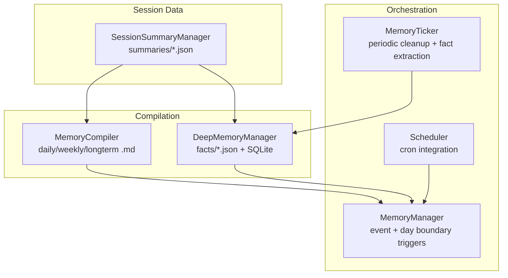
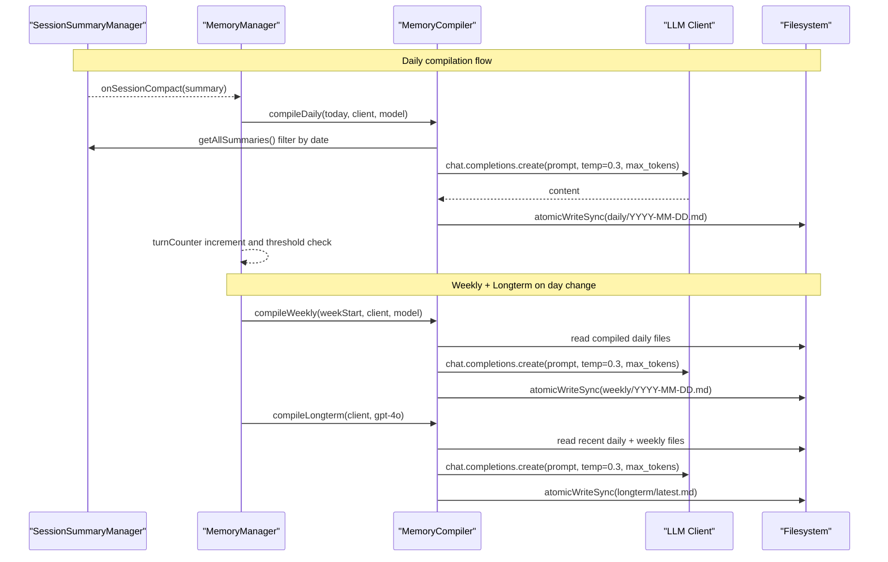
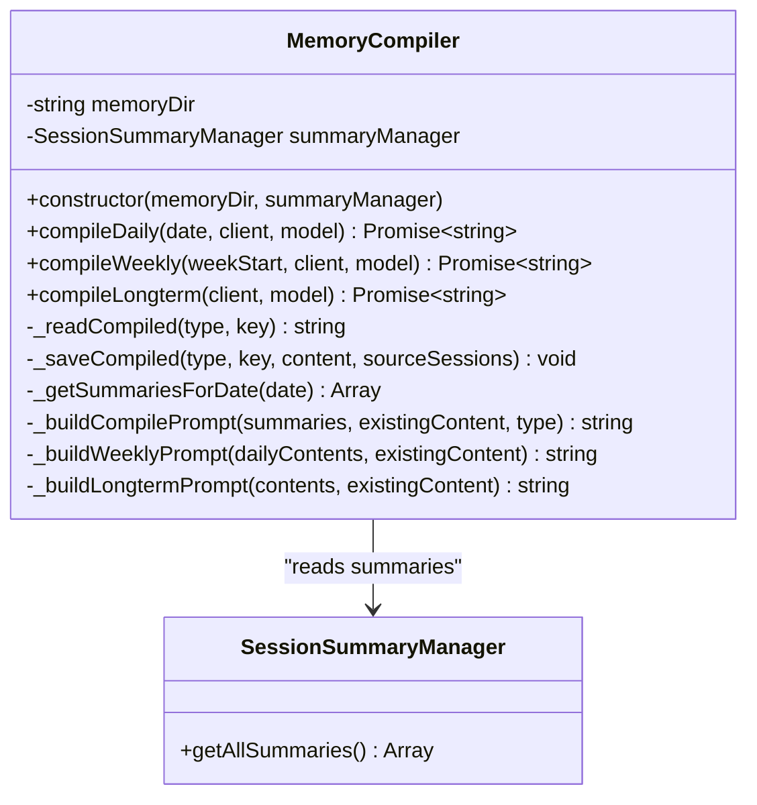
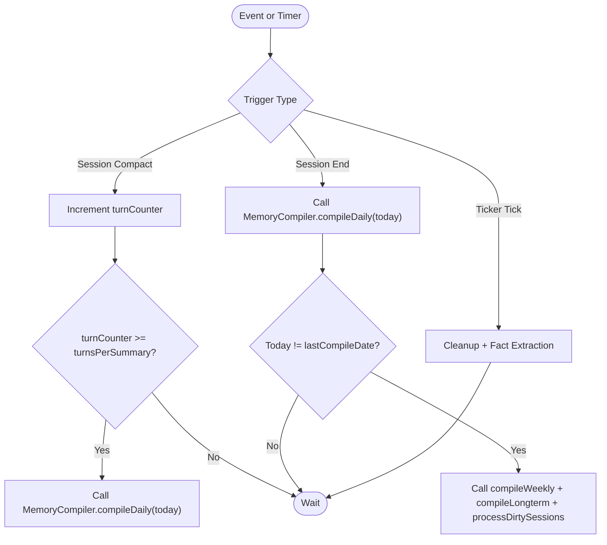
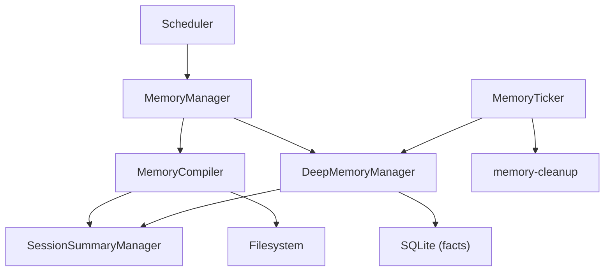

# Periodic Compilation

<cite>
**Referenced Files in This Document**
- [compile.ts](file://core/memory/compile.ts)
- [session-summary.ts](file://core/memory/session-summary.ts)
- [memory-manager.ts](file://core/memory/memory-manager.ts)
- [deep-memory.ts](file://core/memory/deep-memory.ts)
- [compiled-memory-state.ts](file://core/memory/compiled-memory-state.ts)
- [fact-store.ts](file://core/memory/fact-store.ts)
- [memory-cleanup.ts](file://core/memory/memory-cleanup.ts)
- [memory-ticker.ts](file://core/memory/memory-ticker.ts)
- [scheduler.ts](file://core/scheduler.ts)
</cite>

## Table of Contents
1. [Introduction](#introduction)
2. [Project Structure](#project-structure)
3. [Core Components](#core-components)
4. [Architecture Overview](#architecture-overview)
5. [Detailed Component Analysis](#detailed-component-analysis)
6. [Dependency Analysis](#dependency-analysis)
7. [Performance Considerations](#performance-considerations)
8. [Troubleshooting Guide](#troubleshooting-guide)
9. [Conclusion](#conclusion)
10. [Appendices](#appendices)

## Introduction
This document explains the periodic compilation system that condenses conversation history into structured, long-term knowledge. It focuses on the MemoryCompiler class and its three compilation modes: compileDaily(), compileWeekly(), and compileLongterm(). It covers scheduling triggers, input sources from session summaries, output formats, algorithmic approach to condensing conversations, configuration options (frequency, model selection per tier, custom policies), performance optimization, retry mechanisms, and recovery from failed compilations.

## Project Structure
The memory subsystem is organized around a few key modules:
- Session summaries are generated and stored by SessionSummaryManager.
- MemoryCompiler compiles summaries into daily, weekly, and long-term Markdown artifacts.
- DeepMemoryManager extracts structured facts for retrieval.
- MemoryManager orchestrates event-driven and time-based compilation flows.
- Compiled-memory-state utilities manage reset markers and artifact normalization/cleanup.
- Fact-store provides enhanced search and optional snapshot compilation.
- MemoryTicker runs periodic maintenance tasks such as cleanup and fact extraction.
- Scheduler integrates cron-like jobs at the application level.

**Diagram sources**
- [compile.ts:20-40](file://core/memory/compile.ts#L20-L40)
- [session-summary.ts:31-53](file://core/memory/session-summary.ts#L31-L53)
- [deep-memory.ts:32-57](file://core/memory/deep-memory.ts#L32-L57)
- [memory-manager.ts:30-79](file://core/memory/memory-manager.ts#L30-L79)
- [memory-ticker.ts:28-41](file://core/memory/memory-ticker.ts#L28-L41)
- [scheduler.ts:9-38](file://core/scheduler.ts#L9-L38)

**Section sources**
- [compile.ts:1-40](file://core/memory/compile.ts#L1-L40)
- [session-summary.ts:1-53](file://core/memory/session-summary.ts#L1-L53)
- [memory-manager.ts:1-79](file://core/memory/memory-manager.ts#L1-L79)
- [deep-memory.ts:1-57](file://core/memory/deep-memory.ts#L1-L57)
- [memory-ticker.ts:1-41](file://core/memory/memory-ticker.ts#L1-L41)
- [scheduler.ts:1-38](file://core/scheduler.ts#L1-L38)

## Core Components
- MemoryCompiler: Compiles session summaries into daily, weekly, and long-term Markdown files.
- SessionSummaryManager: Persists rolling summaries per session; used as input for compilation.
- DeepMemoryManager: Extracts structured facts from summaries and persists them for retrieval.
- MemoryManager: Orchestrates compilation based on session events and day boundaries.
- Compiled-memory-state: Utilities for reset markers, artifact clearing, and LLM output normalization.
- Fact-store: Enhanced search and optional snapshot compilation for memories.
- MemoryTicker: Runs periodic tasks like cleanup and fact extraction.
- Scheduler: Integrates cron-like scheduling for background tasks.

Key responsibilities and interactions:
- Summaries → Daily → Weekly → Long-term pipeline.
- Facts extracted from summaries for semantic search.
- Cleanup removes old facts while protecting high-importance entries.
- Health tracking and recovery across compilation steps.

**Section sources**
- [compile.ts:20-193](file://core/memory/compile.ts#L20-L193)
- [session-summary.ts:31-146](file://core/memory/session-summary.ts#L31-L146)
- [deep-memory.ts:32-105](file://core/memory/deep-memory.ts#L32-L105)
- [memory-manager.ts:30-197](file://core/memory/memory-manager.ts#L30-L197)
- [compiled-memory-state.ts:1-78](file://core/memory/compiled-memory-state.ts#L1-L78)
- [fact-store.ts:1-116](file://core/memory/fact-store.ts#L1-L116)
- [memory-cleanup.ts:1-123](file://core/memory/memory-cleanup.ts#L1-L123)
- [memory-ticker.ts:28-152](file://core/memory/memory-ticker.ts#L28-L152)
- [scheduler.ts:9-38](file://core/scheduler.ts#L9-L38)

## Architecture Overview
The compilation architecture follows a layered approach:
- Input: Session summaries produced by SessionSummaryManager.
- Processing: MemoryCompiler aggregates summaries into daily, weekly, and long-term Markdown artifacts using LLM calls with temperature and token limits.
- Output: Markdown files under memory/daily, memory/weekly, memory/longterm, plus facts persisted via DeepMemoryManager.
- Orchestration: MemoryManager triggers daily compilation on session events and weekly/long-term on day boundaries; MemoryTicker performs cleanup and fact extraction periodically; Scheduler can integrate cron jobs.

**Diagram sources**
- [memory-manager.ts:91-127](file://core/memory/memory-manager.ts#L91-L127)
- [memory-manager.ts:163-196](file://core/memory/memory-manager.ts#L163-L196)
- [compile.ts:53-81](file://core/memory/compile.ts#L53-L81)
- [compile.ts:94-132](file://core/memory/compile.ts#L94-L132)
- [compile.ts:144-193](file://core/memory/compile.ts#L144-L193)
- [session-summary.ts:138-146](file://core/memory/session-summary.ts#L138-L146)

## Detailed Component Analysis

### MemoryCompiler Class
MemoryCompiler implements three compilation modes:
- compileDaily(date, client, model): Aggregates session summaries for a specific date, prompts an LLM to produce a structured daily memory, and writes it to memory/daily/YYYY-MM-DD.md.
- compileWeekly(weekStart, client, model): Reads daily files for the week, prompts an LLM to summarize themes and decisions, and writes to memory/weekly/YYYY-MM-DD.md.
- compileLongterm(client, model): Reads recent daily and weekly files, prompts an LLM to extract persistent patterns and preferences, and writes to memory/longterm/latest.md.

Algorithmic approach:
- Input gathering: For daily, fetch summaries filtered by date; for weekly, read existing daily artifacts; for longterm, read recent daily and weekly artifacts.
- Prompt construction: Builds prompts that include existing compiled content when available, instructing the model to update or synthesize higher-level abstractions.
- LLM invocation: Uses OpenAI-compatible client with controlled temperature and token limits to ensure concise outputs.
- Persistence: Writes Markdown with YAML frontmatter including source type, date, and source sessions.

Configuration and defaults:
- Default models: daily and weekly use a smaller model; longterm uses a larger model.
- Temperature and tokens: Controlled to balance creativity and determinism.
- Error handling: On failure, returns existing content instead of losing compiled memory.

Output formats:
- Daily: Markdown file named by date under memory/daily/.
- Weekly: Markdown file named by week start date under memory/weekly/.
- Longterm: Single latest.md under memory/longterm/.

**Diagram sources**
- [compile.ts:20-40](file://core/memory/compile.ts#L20-L40)
- [compile.ts:53-81](file://core/memory/compile.ts#L53-L81)
- [compile.ts:94-132](file://core/memory/compile.ts#L94-L132)
- [compile.ts:144-193](file://core/memory/compile.ts#L144-L193)
- [compile.ts:205-229](file://core/memory/compile.ts#L205-L229)
- [compile.ts:236-241](file://core/memory/compile.ts#L236-L241)
- [compile.ts:250-306](file://core/memory/compile.ts#L250-L306)
- [session-summary.ts:138-146](file://core/memory/session-summary.ts#L138-L146)

**Section sources**
- [compile.ts:20-193](file://core/memory/compile.ts#L20-L193)
- [compile.ts:205-229](file://core/memory/compile.ts#L205-L229)
- [compile.ts:250-306](file://core/memory/compile.ts#L250-L306)

### Scheduling Triggers and Orchestration
Triggers:
- Event-driven: onSessionCompact increments a turn counter; when threshold reached, triggers daily compilation.
- Session end: final daily compilation and, if day changed, weekly + longterm compilation plus deep memory processing.
- Time-based: MemoryTicker runs periodic tasks (cleanup and fact extraction); Scheduler can integrate cron jobs for additional periodicity.

Flow:
- Daily: Triggered by session compaction thresholds or session end.
- Weekly + Longterm: Triggered when the logical day changes.
- Cleanup and fact extraction: Scheduled by MemoryTicker at configurable intervals.

**Diagram sources**
- [memory-manager.ts:91-127](file://core/memory/memory-manager.ts#L91-L127)
- [memory-manager.ts:163-196](file://core/memory/memory-manager.ts#L163-L196)
- [memory-ticker.ts:89-133](file://core/memory/memory-ticker.ts#L89-L133)

**Section sources**
- [memory-manager.ts:91-127](file://core/memory/memory-manager.ts#L91-L127)
- [memory-manager.ts:163-196](file://core/memory/memory-manager.ts#L163-L196)
- [memory-ticker.ts:28-152](file://core/memory/memory-ticker.ts#L28-L152)
- [scheduler.ts:9-38](file://core/scheduler.ts#L9-L38)

### Input Sources from Session Summaries
- Source: SessionSummaryManager maintains per-session JSON summaries with fields like sessionId, created_at, updated_at, and summary text.
- Filtering: compileDaily filters summaries by date using updated_at or created_at.
- Aggregation: compileWeekly reads compiled daily Markdown files; compileLongterm reads recent daily and weekly Markdown files.

Data structures and complexity:
- Summary list retrieval is O(n) over cached summaries; filtering by date is linear.
- File reads for weekly/longterm are bounded by fixed windows (e.g., last 30 days, last 8 weeks).

**Section sources**
- [session-summary.ts:31-146](file://core/memory/session-summary.ts#L31-L146)
- [compile.ts:236-241](file://core/memory/compile.ts#L236-L241)
- [compile.ts:144-193](file://core/memory/compile.ts#L144-L193)

### Output Formats
- Daily: Markdown file named YYYY-MM-DD.md under memory/daily/, with YAML frontmatter indicating source, date, and source_sessions.
- Weekly: Markdown file named YYYY-MM-DD.md under memory/weekly/, with similar frontmatter.
- Longterm: Markdown file named latest.md under memory/longterm/, with frontmatter.

Frontmatter fields:
- source: compilation type (daily/weekly/longterm)
- date: date or week start or "latest"
- source_sessions: array of session IDs (for daily)

**Section sources**
- [compile.ts:221-229](file://core/memory/compile.ts#L221-L229)

### Algorithmic Approach to Condensing Conversation History
- Daily: Summarizes multiple session summaries into a single structured daily memory, extracting key facts, decisions, and user preferences, organized by topic.
- Weekly: Synthesizes seven days of daily memories into weekly themes, important decisions, and pattern recognition.
- Longterm: Identifies cross-week patterns and trends, extracts persistent user characteristics and preferences, records important projects and decisions, and keeps structure retrievable.

Prompt engineering:
- Includes existing compiled content when present to enable incremental updates.
- Specifies output requirements to maintain concise, structured Markdown.

**Section sources**
- [compile.ts:250-306](file://core/memory/compile.ts#L250-L306)

### Configuration Options
- Frequency:
  - Daily: Triggered by turn threshold (turnsPerSummary) and session end.
  - Weekly + Longterm: Triggered on day boundary change.
  - Cleanup and fact extraction: Configurable intervalMs in MemoryTicker.
- Model selection per tier:
  - Daily and weekly default to a smaller model; longterm defaults to a larger model.
  - MemoryManager passes configured model to compiler methods; longterm explicitly uses a larger model.
- Custom policies:
  - MemoryManager constructor accepts opts.memoryDir, opts.model, opts.turnsPerSummary.
  - MemoryTicker accepts opts.intervalMs, opts.enabled, opts.cleanupEnabled.
  - Compiled-memory-state provides reset markers and artifact clearing utilities.

**Section sources**
- [memory-manager.ts:61-79](file://core/memory/memory-manager.ts#L61-L79)
- [memory-manager.ts:163-196](file://core/memory/memory-manager.ts#L163-L196)
- [memory-ticker.ts:36-41](file://core/memory/memory-ticker.ts#L36-L41)
- [compiled-memory-state.ts:23-60](file://core/memory/compiled-memory-state.ts#L23-L60)

### Retry Mechanisms and Recovery
- Compilation fallback: If LLM call fails, MemoryCompiler returns existing compiled content rather than losing data.
- Step health tracking: The ticker tracks success/failure per step and logs recovery status.
- Reset markers: compiled-memory-state supports writing and reading reset timestamps to clear artifacts and re-run compilation after resets.

Recovery workflow:
- Detect failure → log error → return existing content → continue pipeline.
- On next tick or day change, reattempt compilation; reset marker can force regeneration.

**Section sources**
- [compile.ts:77-81](file://core/memory/compile.ts#L77-L81)
- [compile.ts:128-132](file://core/memory/compile.ts#L128-L132)
- [compile.ts:189-193](file://core/memory/compile.ts#L189-L193)
- [memory-ticker.ts:153-183](file://core/memory/memory-ticker.ts#L153-L183)
- [compiled-memory-state.ts:32-60](file://core/memory/compiled-memory-state.ts#L32-L60)

## Dependency Analysis
Component relationships:
- MemoryCompiler depends on SessionSummaryManager for inputs and filesystem for persistence.
- MemoryManager composes MemoryCompiler, DeepMemoryManager, and manages orchestration logic.
- DeepMemoryManager depends on SessionSummaryManager and persists facts to both files and SQLite.
- MemoryTicker depends on DeepMemoryManager and memory-cleanup for periodic tasks.
- Scheduler can integrate with memory components via cron jobs.

**Diagram sources**
- [compile.ts:20-40](file://core/memory/compile.ts#L20-L40)
- [memory-manager.ts:30-79](file://core/memory/memory-manager.ts#L30-L79)
- [deep-memory.ts:32-57](file://core/memory/deep-memory.ts#L32-L57)
- [memory-ticker.ts:28-41](file://core/memory/memory-ticker.ts#L28-L41)
- [memory-cleanup.ts:1-123](file://core/memory/memory-cleanup.ts#L1-L123)
- [scheduler.ts:9-38](file://core/scheduler.ts#L9-L38)

**Section sources**
- [compile.ts:20-40](file://core/memory/compile.ts#L20-L40)
- [memory-manager.ts:30-79](file://core/memory/memory-manager.ts#L30-L79)
- [deep-memory.ts:32-57](file://core/memory/deep-memory.ts#L32-L57)
- [memory-ticker.ts:28-41](file://core/memory/memory-ticker.ts#L28-L41)
- [memory-cleanup.ts:1-123](file://core/memory/memory-cleanup.ts#L1-L123)
- [scheduler.ts:9-38](file://core/scheduler.ts#L9-L38)

## Performance Considerations
- Bounded windows: compileLongterm reads only recent daily (last 30 days) and weekly (last 8 weeks) files to limit prompt size.
- Token control: Temperature and max_tokens are set to constrain output length and cost.
- Atomic writes: Ensures safe persistence without partial writes.
- Batched cleanup: memory-cleanup deletes old facts in batches to avoid long transactions.
- CJK-friendly search: fact-store enhances FTS queries with ngrams for better retrieval efficiency.

Recommendations:
- Tune turnsPerSummary to balance compilation frequency vs. overhead.
- Adjust intervalMs in MemoryTicker to match workload and resource constraints.
- Use appropriate model tiers per compilation stage to optimize cost and quality.

[No sources needed since this section provides general guidance]

## Troubleshooting Guide
Common issues and resolutions:
- Missing summaries for a date: compileDaily skips compilation; verify summary generation and date alignment.
- Failed LLM calls: compilation falls back to existing content; check network and API keys; review logs.
- Stale artifacts: use reset markers and artifact clearing to force regeneration.
- High retention storage: run cleanupOldFacts with dryRun first to assess impact; adjust MEMORY_RETENTION_DAYS.

Operational checks:
- Verify directory structure: memory/daily, memory/weekly, memory/longterm exist.
- Inspect frontmatter in compiled files for correct source, date, and source_sessions.
- Monitor MemoryTicker health and step statuses for failures and recovery.

**Section sources**
- [compile.ts:56-59](file://core/memory/compile.ts#L56-L59)
- [compile.ts:77-81](file://core/memory/compile.ts#L77-L81)
- [compiled-memory-state.ts:70-78](file://core/memory/compiled-memory-state.ts#L70-L78)
- [memory-cleanup.ts:45-123](file://core/memory/memory-cleanup.ts#L45-L123)
- [memory-ticker.ts:153-183](file://core/memory/memory-ticker.ts#L153-L183)

## Conclusion
The periodic compilation system transforms raw conversation summaries into structured, multi-tier knowledge artifacts. MemoryCompiler’s daily, weekly, and long-term modes progressively abstract information, while MemoryManager and MemoryTicker coordinate triggers and maintenance. With configurable frequency, model selection, and robust error handling, the system balances quality, cost, and reliability. Cleanup and reset utilities ensure long-term sustainability and recoverability.

[No sources needed since this section summarizes without analyzing specific files]

## Appendices

### Appendix A: Key Methods and Paths
- MemoryCompiler.compileDaily: [compile.ts:53-81](file://core/memory/compile.ts#L53-L81)
- MemoryCompiler.compileWeekly: [compile.ts:94-132](file://core/memory/compile.ts#L94-L132)
- MemoryCompiler.compileLongterm: [compile.ts:144-193](file://core/memory/compile.ts#L144-L193)
- SessionSummaryManager.getAllSummaries: [session-summary.ts:138-146](file://core/memory/session-summary.ts#L138-L146)
- MemoryManager._compileDaily: [memory-manager.ts:163-170](file://core/memory/memory-manager.ts#L163-L170)
- MemoryManager._compileWeeklyAndLongterm: [memory-manager.ts:175-196](file://core/memory/memory-manager.ts#L175-L196)
- DeepMemoryManager.processDirtySessions: [deep-memory.ts:69-85](file://core/memory/deep-memory.ts#L69-L85)
- MemoryTicker.run: [memory-ticker.ts:89-133](file://core/memory/memory-ticker.ts#L89-L133)
- cleanupOldFacts: [memory-cleanup.ts:45-123](file://core/memory/memory-cleanup.ts#L45-L123)

**Section sources**
- [compile.ts:53-193](file://core/memory/compile.ts#L53-L193)
- [session-summary.ts:138-146](file://core/memory/session-summary.ts#L138-L146)
- [memory-manager.ts:163-196](file://core/memory/memory-manager.ts#L163-L196)
- [deep-memory.ts:69-85](file://core/memory/deep-memory.ts#L69-L85)
- [memory-ticker.ts:89-133](file://core/memory/memory-ticker.ts#L89-L133)
- [memory-cleanup.ts:45-123](file://core/memory/memory-cleanup.ts#L45-L123)