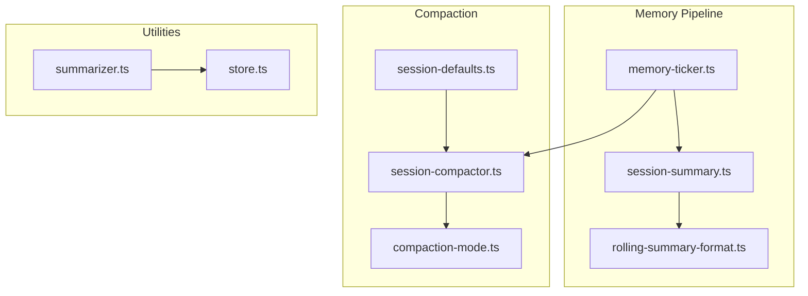
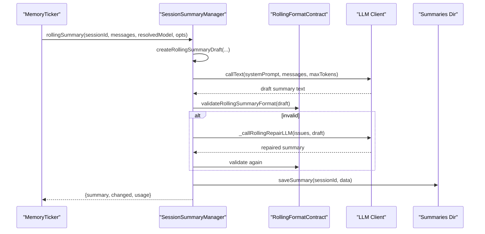
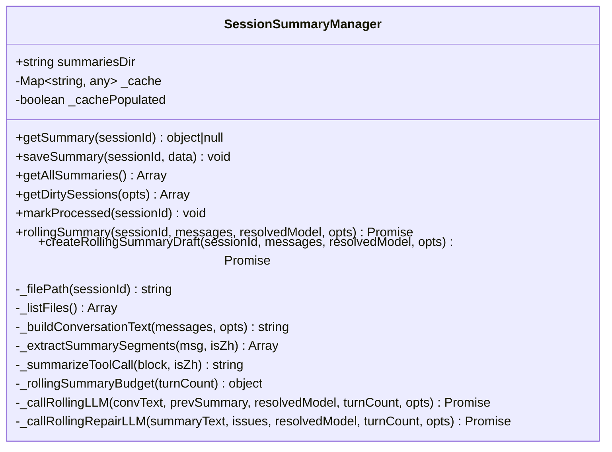
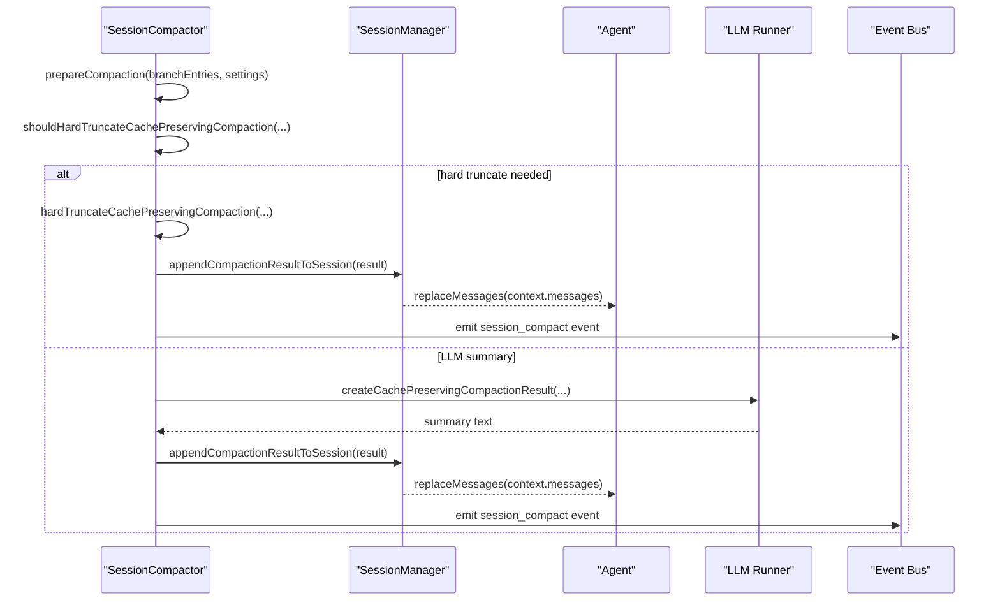

# Session Summarization

<cite>
**Referenced Files in This Document**
- [session-summary.ts](file://core/memory/session-summary.ts)
- [rolling-summary-format.ts](file://core/memory/rolling-summary-format.ts)
- [memory-ticker.ts](file://lib/memory/memory-ticker.ts)
- [session-compactor.ts](file://core/session-compactor.ts)
- [compaction-mode.ts](file://shared/compaction-mode.ts)
- [session-defaults.ts](file://core/session-defaults.ts)
- [store.ts](file://core/memory/store.ts)
- [summarizer.ts](file://core/memory/summarizer.ts)
</cite>

## Table of Contents
1. [Introduction](#introduction)
2. [Project Structure](#project-structure)
3. [Core Components](#core-components)
4. [Architecture Overview](#architecture-overview)
5. [Detailed Component Analysis](#detailed-component-analysis)
6. [Dependency Analysis](#dependency-analysis)
7. [Performance Considerations](#performance-considerations)
8. [Troubleshooting Guide](#troubleshooting-guide)
9. [Conclusion](#conclusion)

## Introduction
This document explains the session summarization functionality that automatically summarizes conversations during session compaction and routine memory maintenance. It focuses on how summaries are created, stored, retrieved, and updated using LLM-powered analysis, with emphasis on the SessionSummaryManager class, summary format contracts, triggering conditions based on turn counting and compaction events, and integration with the compaction pipeline. It also covers model selection strategies, quality optimization, and error handling when summarization fails.

## Project Structure
The summarization system spans several modules:
- SessionSummaryManager: manages per-session summary files, caching, and rolling updates.
- Rolling Summary Format Contract: defines required structure (facts + timeline), validation, and repair prompts.
- Memory Ticker: orchestrates turn-based triggers for rolling summaries and daily compilation.
- Session Compactor: performs cache-preserving compaction and integrates summary generation into compaction flows.
- Model Selection and Storage Utilities: provide provider/model resolution and persistence helpers.

**Diagram sources**
- [memory-ticker.ts](file://lib/memory/memory-ticker.ts)
- [session-summary.ts](file://core/memory/session-summary.ts)
- [rolling-summary-format.ts](file://core/memory/rolling-summary-format.ts)
- [session-compactor.ts](file://core/session-compactor.ts)
- [compaction-mode.ts](file://shared/compaction-mode.ts)
- [session-defaults.ts](file://core/session-defaults.ts)
- [summarizer.ts](file://core/memory/summarizer.ts)
- [store.ts](file://core/memory/store.ts)

**Section sources**
- [session-summary.ts](file://core/memory/session-summary.ts)
- [rolling-summary-format.ts](file://core/memory/rolling-summary-format.ts)
- [memory-ticker.ts](file://lib/memory/memory-ticker.ts)
- [session-compactor.ts](file://core/session-compactor.ts)
- [compaction-mode.ts](file://shared/compaction-mode.ts)
- [session-defaults.ts](file://core/session-defaults.ts)
- [summarizer.ts](file://core/memory/summarizer.ts)
- [store.ts](file://core/memory/store.ts)

## Core Components
- SessionSummaryManager:
  - Persists one JSON file per session under a summaries directory.
  - Provides getSummary/saveSummary, dirty tracking, and rolling summary creation.
  - Maintains an in-memory cache and populates it lazily.
  - Produces structured summaries with facts and timeline sections.
- Rolling Summary Format Contract:
  - Centralizes section titles, output requirements, validation, and repair prompts.
  - Ensures compatibility with downstream fact extraction.
- Memory Ticker:
  - Turn-based trigger: every N turns (default 10) initiates rolling summary and compile steps.
  - Session-end final pass to ensure last messages are summarized.
  - Daily job orchestration for weekly/long-term/facts compilation and deep memory processing.
- Session Compactor:
  - Builds cache-preserving compaction requests and runs LLM calls to produce summaries.
  - Integrates with session lifecycle and emits compaction events.
- Summarizer and Store:
  - Alternative summarization path using OpenAI client and SQLite-backed memory store.

**Section sources**
- [session-summary.ts](file://core/memory/session-summary.ts)
- [rolling-summary-format.ts](file://core/memory/rolling-summary-format.ts)
- [memory-ticker.ts](file://lib/memory/memory-ticker.ts)
- [session-compactor.ts](file://core/session-compactor.ts)
- [summarizer.ts](file://core/memory/summarizer.ts)
- [store.ts](file://core/memory/store.ts)

## Architecture Overview
The summarization architecture combines two primary paths:
- Rolling Summary Path (turn-based):
  - Triggered by the memory ticker at thresholds or session end.
  - Uses SessionSummaryManager to generate/update summaries via LLM.
  - Validates and repairs summary format before persisting.
- Cache-Preserving Compaction Path:
  - Triggered by compaction logic based on token budget and context window.
  - Generates structured summaries to preserve cache while reducing history size.

**Diagram sources**
- [memory-ticker.ts](file://lib/memory/memory-ticker.ts)
- [session-summary.ts](file://core/memory/session-summary.ts)
- [rolling-summary-format.ts](file://core/memory/rolling-summary-format.ts)

## Detailed Component Analysis

### SessionSummaryManager
Responsibilities:
- File I/O: read/write per-session summary JSON with atomic writes.
- In-memory cache: lazy population from disk; supports getAllSummaries and dirty detection.
- Rolling summary creation: incremental input (new messages since last messageCount), PII scrubbing, budget-aware prompting, and format validation/repair.
- Metadata fields: created_at, updated_at, snapshot/snapshot_at for deep memory processing.

Key behaviors:
- Incremental summarization: uses existing messageCount to slice new messages only.
- Budget control: totalBudget scales with user turn count; visibleMaxTokens derived accordingly.
- Format contract adherence: enforces facts/timeline structure; allows limited repair attempts.
- PII redaction: scrubs sensitive content before final write; re-validates structure.

Data model (per-session summary JSON):
- session_id: string
- created_at: ISO timestamp
- updated_at: ISO timestamp
- summary: string (facts + timeline)
- messageCount: number (total messages covered)
- source_time_range: object|null
- snapshot: string|null (deep memory snapshot)
- snapshot_at: ISO timestamp|null

Example metadata fields:
- created_at: set once when first summary is saved.
- updated_at: updated on each successful rolling summary.
- snapshot/snapshot_at: used by deep memory to track processed snapshots.

Integration points:
- Called by memory ticker for threshold-triggered and session-end summaries.
- Used by diary writer to fetch existing summaries and regenerate if stale.

Error handling:
- On empty conversation/output: returns previous summary without changes.
- On format validation failure after repairs: throws error to prevent corrupt summaries.
- On PII scrub causing format issues: throws error to maintain integrity.

**Section sources**
- [session-summary.ts](file://core/memory/session-summary.ts)
- [rolling-summary-format.ts](file://core/memory/rolling-summary-format.ts)

#### Class Diagram

**Diagram sources**
- [session-summary.ts](file://core/memory/session-summary.ts)

### Rolling Summary Format Contract
Purpose:
- Single source of truth for section titles and output format requirements.
- Provides validation and repair utilities to ensure downstream extractors can parse summaries reliably.

Key functions:
- buildRollingSummaryFormatRequirements(locale): generates prompt instructions enforcing fixed headings and list formats.
- validateRollingSummaryFormat(text, locale): checks presence and non-empty facts section, and termination by timeline heading.
- buildRollingSummaryRepairPrompt(locale) and buildRollingSummaryRepairInput(...): constructs repair system/user prompts and inputs.
- extractFactSection(text), hasFactSectionHeading(text), isEmptyFactSection(text): parsing helpers.

Quality optimization:
- Enforces concise bullet lists under facts/timeline.
- Limits repair attempts to avoid infinite loops.
- Aligns with compileFacts expectations to prevent silent loss of facts.

**Section sources**
- [rolling-summary-format.ts](file://core/memory/rolling-summary-format.ts)

### Memory Ticker (Turn-Based Triggers)
Triggers:
- Every N turns (default 10): rolling summary + compile today + assemble.
- Session end: final rolling summary + compile today + assemble.
- Daily job: compile week/longterm/facts, assemble, deep memory processing.

Behavior:
- Tracks per-session turn counts and ensures concurrency protection for rolling summaries.
- Supports cache snapshot reflection mode (shadow/write) with fallback to rolling summary.
- Emits health status per step and deduplicates repeated errors.

Integration:
- Calls SessionSummaryManager.rollingSummary with resolved model and options.
- After summary, triggers compileToday and assemble to update memory.md.

**Section sources**
- [memory-ticker.ts](file://lib/memory/memory-ticker.ts)

### Session Compactor (Cache-Preserving)
Responsibilities:
- Build compaction requests with system prompts and message sets.
- Estimate token budgets and decide hard truncation vs. LLM-generated summary.
- Run side tasks or direct completions to produce structured summaries.
- Append compaction results to session and emit lifecycle events.

Integration with summarization:
- Uses structured prompts similar to rolling summary goals but tailored for cache preservation.
- Can run parallel requests for history and split-turn prefix contexts.
- Error handling includes aborted signals and usage ledger recording.

**Section sources**
- [session-compactor.ts](file://core/session-compactor.ts)
- [compaction-mode.ts](file://shared/compaction-mode.ts)
- [session-defaults.ts](file://core/session-defaults.ts)

#### Sequence Diagram: Compaction Flow

**Diagram sources**
- [session-compactor.ts](file://core/session-compactor.ts)

### Summarizer and Store (Alternative Path)
Summarizer:
- Resolves provider/client and model for summarization.
- Summarizes recent memories and persists facts/memories via store.

Store:
- SQLite-backed storage for memories and facts with CRUD operations.
- Provides agent configuration retrieval for API keys and base URLs.

Use cases:
- Background compaction of older memories into facts.
- Retrieval of recent memories for summarization.

**Section sources**
- [summarizer.ts](file://core/memory/summarizer.ts)
- [store.ts](file://core/memory/store.ts)

## Dependency Analysis
- SessionSummaryManager depends on:
  - File system utilities for atomic writes.
  - Rolling summary format contract for validation and repair.
  - LLM client interface for generating summaries.
- Memory Ticker depends on:
  - SessionSummaryManager for rolling summaries.
  - Compile/assemble modules for memory.md updates.
  - Deep memory processor for dirty sessions.
- Session Compactor depends on:
  - PI SDK utilities for completion and preparation.
  - Session manager to append compaction results and replace messages.
  - Event bus to notify extensions about compaction.

Potential circular dependencies:
- None observed between summarization and compaction modules; they interact through well-defined APIs and events.

External integrations:
- LLM providers via OpenAI-compatible clients.
- SQLite database for memory/fact persistence in alternative path.

**Section sources**
- [session-summary.ts](file://core/memory/session-summary.ts)
- [memory-ticker.ts](file://lib/memory/memory-ticker.ts)
- [session-compactor.ts](file://core/session-compactor.ts)
- [summarizer.ts](file://core/memory/summarizer.ts)
- [store.ts](file://core/memory/store.ts)

## Performance Considerations
- Incremental summarization reduces input size by slicing new messages only.
- Budget scaling aligns output length with conversation density, avoiding over-generation.
- Atomic writes minimize corruption risk during concurrent operations.
- Hard truncation fallback prevents compaction request overflow beyond model context windows.
- Health tracking and error deduplication reduce noise and improve observability.

[No sources needed since this section provides general guidance]

## Troubleshooting Guide
Common issues and resolutions:
- Empty conversation/output:
  - Symptom: No summary change; previous summary retained.
  - Action: Verify messages exist and contain user/assistant roles; check reset watermark.
- Format validation failures:
  - Symptom: Errors thrown after repair attempts.
  - Action: Inspect validateRollingSummaryFormat issues; ensure facts/timeline headings present and non-empty.
- PII scrub causing format issues:
  - Symptom: Post-scrub validation fails.
  - Action: Review scrubbed content; adjust PII rules or manual intervention.
- Compaction errors:
  - Symptom: Aborted or failed compaction events.
  - Action: Check signal abort state; review usage ledger errors; verify model context window and budget estimates.

Operational tips:
- Use flushSession/flushSessionAndCompile to force refresh summaries before critical operations.
- Monitor health status per step to identify bottlenecks or recurring failures.
- Enable shadow mode for cache snapshot reflection to observe behavior without writing.

**Section sources**
- [session-summary.ts](file://core/memory/session-summary.ts)
- [memory-ticker.ts](file://lib/memory/memory-ticker.ts)
- [session-compactor.ts](file://core/session-compactor.ts)

## Conclusion
The session summarization system combines robust formatting contracts, turn-based triggers, and cache-preserving compaction to maintain high-quality, parsable summaries across long-running sessions. SessionSummaryManager centralizes persistence and rolling updates, while the memory ticker ensures timely generation and compilation. The compactor integrates summaries into context reduction workflows, with comprehensive error handling and performance safeguards. Together, these components deliver reliable, scalable summarization aligned with downstream memory pipelines.