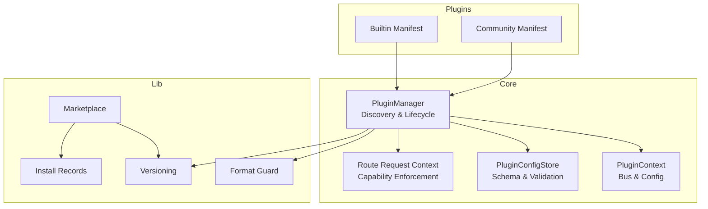
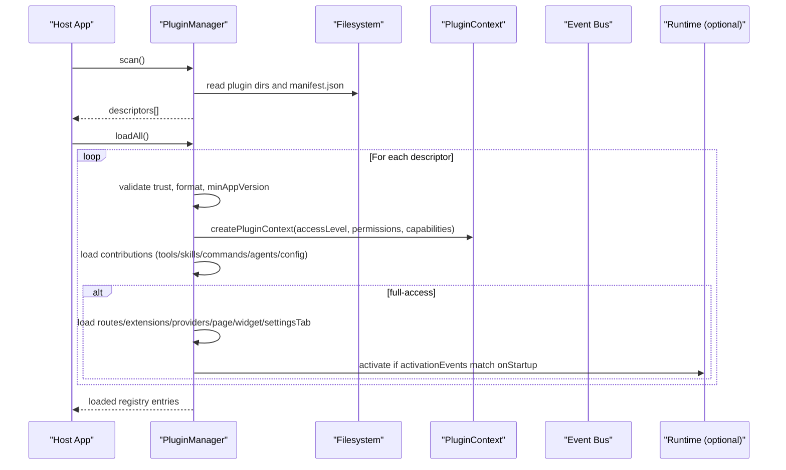
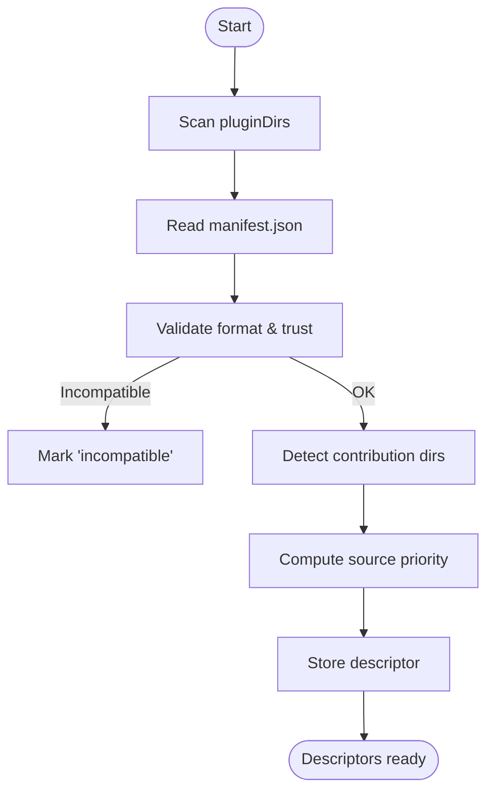
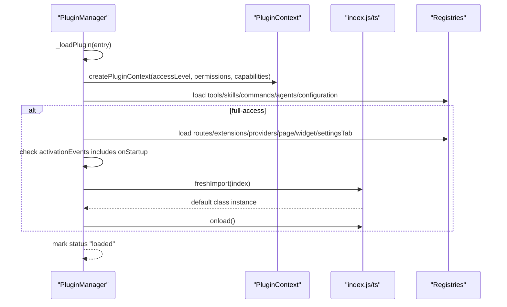
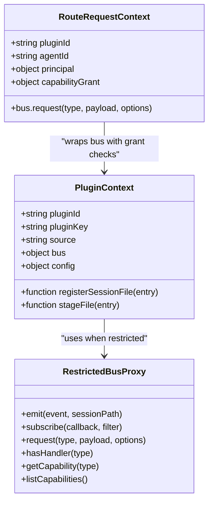
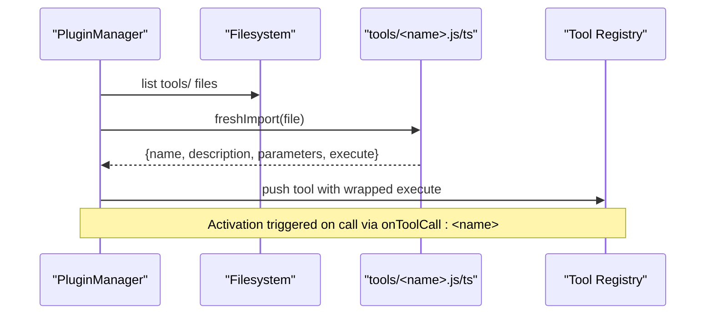
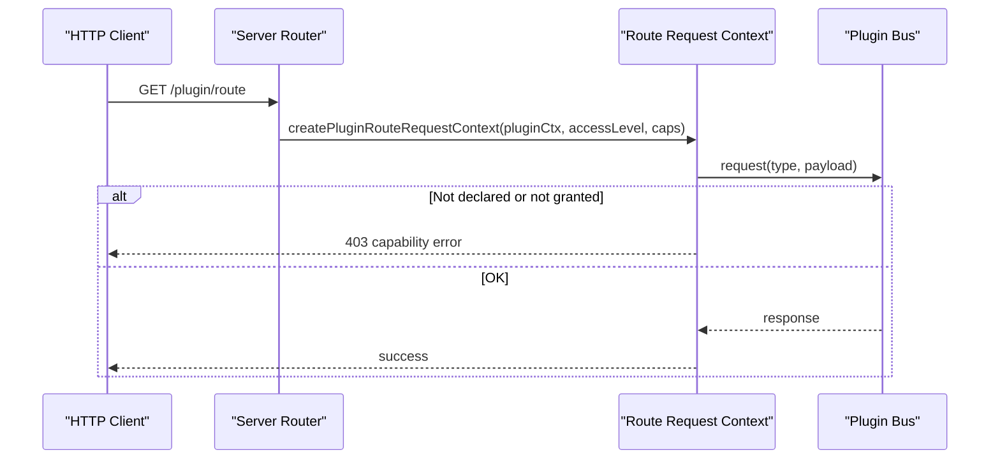
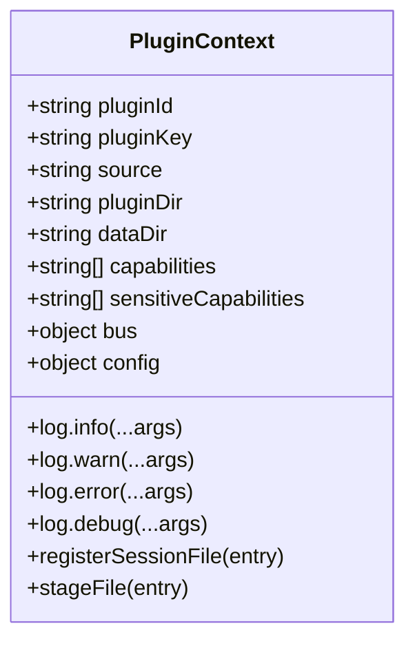
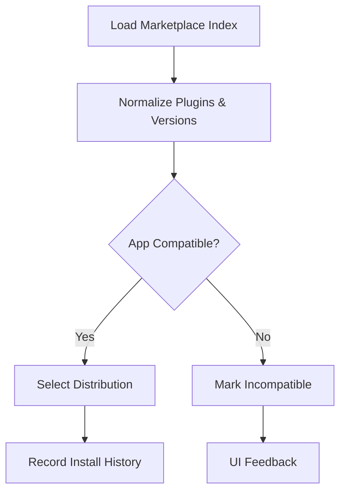
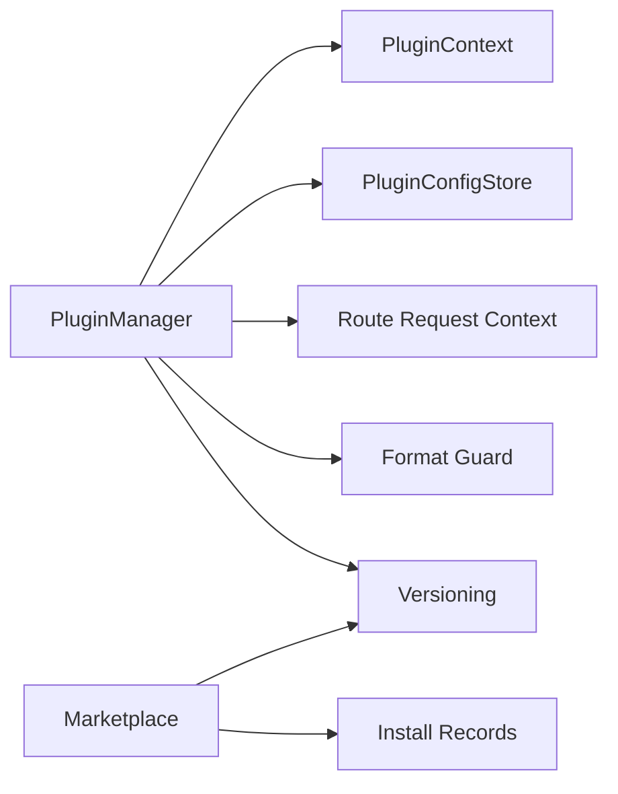

# Plugin Architecture

<cite>
**Referenced Files in This Document**
- [plugin-manager.ts](file://core/plugin-manager.ts)
- [plugin-context.ts](file://core/plugin-context.ts)
- [plugin-config.ts](file://core/plugin-config.ts)
- [plugin-route-request-context.ts](file://core/plugin-route-request-context.ts)
- [plugin-format-guard.ts](file://lib/plugin-format-guard.ts)
- [plugin-versioning.ts](file://lib/plugin-versioning.ts)
- [plugin-marketplace.ts](file://lib/plugin-marketplace.ts)
- [plugin-install-records.ts](file://lib/plugin-install-records.ts)
- [manifest.json (builtin beautify)](file://plugins/builtin/beautify/manifest.json)
- [manifest.json (community hello)](file://plugins/community/hello/manifest.json)
</cite>

## Table of Contents
1. Introduction
2. Project Structure
3. Core Components
4. Architecture Overview
5. Detailed Component Analysis
6. Dependency Analysis
7. Performance Considerations
8. Troubleshooting Guide
9. Conclusion

## Introduction
This document explains the plugin architecture focused on extensibility and customization. It covers the plugin manifest structure, discovery mechanism, loading lifecycle, two-tier permission model, security boundaries for plugin execution, practical examples for tools, routes, skills, and UI extensions, SDK interfaces, development workflow, testing strategies, distribution and marketplace integration, versioning, and best practices for security and performance.

## Project Structure
The plugin system is implemented primarily under core and lib directories with example plugins under plugins. Key responsibilities:
- Discovery and lifecycle management: core/plugin-manager.ts
- Runtime context and bus scoping: core/plugin-context.ts
- Configuration schema and storage: core/plugin-config.ts
- Route request context and capability enforcement: core/plugin-route-request-context.ts
- Format guard and versioning utilities: lib/plugin-format-guard.ts, lib/plugin-versioning.ts
- Marketplace and install records: lib/plugin-marketplace.ts, lib/plugin-install-records.ts
- Example manifests: plugins/builtin/beautify/manifest.json, plugins/community/hello/manifest.json

**Diagram sources**
- [plugin-manager.ts](file://core/plugin-manager.ts)
- [plugin-context.ts](file://core/plugin-context.ts)
- [plugin-config.ts](file://core/plugin-config.ts)
- [plugin-route-request-context.ts](file://core/plugin-route-request-context.ts)
- [plugin-format-guard.ts](file://lib/plugin-format-guard.ts)
- [plugin-versioning.ts](file://lib/plugin-versioning.ts)
- [plugin-marketplace.ts](file://lib/plugin-marketplace.ts)
- [plugin-install-records.ts](file://lib/plugin-install-records.ts)
- [manifest.json (builtin beautify)](file://plugins/builtin/beautify/manifest.json)
- [manifest.json (community hello)](file://plugins/community/hello/manifest.json)

**Section sources**
- [plugin-manager.ts](file://core/plugin-manager.ts)
- [plugin-context.ts](file://core/plugin-context.ts)
- [plugin-config.ts](file://core/plugin-config.ts)
- [plugin-route-request-context.ts](file://core/plugin-route-request-context.ts)
- [plugin-format-guard.ts](file://lib/plugin-format-guard.ts)
- [plugin-versioning.ts](file://lib/plugin-versioning.ts)
- [plugin-marketplace.ts](file://lib/plugin-marketplace.ts)
- [plugin-install-records.ts](file://lib/plugin-install-records.ts)
- [manifest.json (builtin beautify)](file://plugins/builtin/beautify/manifest.json)
- [manifest.json (community hello)](file://plugins/community/hello/manifest.json)

## Core Components
- PluginManager: Scans plugin directories, reads descriptors, enforces trust and compatibility, loads contributions, manages activation, and maintains registries for tools, routes, skills, pages, widgets, settings tabs, providers, and extension factories.
- PluginContext: Provides per-plugin runtime scope including config store, bus proxy, logging, session file staging, and capability declarations.
- PluginConfigStore: Schema-driven configuration with scopes (global, per-agent, per-session), validation, redaction, and atomic persistence.
- Route Request Context: Per-request enforcement of bus capabilities based on manifest declarations and user authorization; supports legacy vs explicit declaration semantics.
- Utilities: Format guard to reject incompatible formats, versioning helpers for app compatibility checks, marketplace loader and installer records.

**Section sources**
- [plugin-manager.ts](file://core/plugin-manager.ts)
- [plugin-context.ts](file://core/plugin-context.ts)
- [plugin-config.ts](file://core/plugin-config.ts)
- [plugin-route-request-context.ts](file://core/plugin-route-request-context.ts)
- [plugin-format-guard.ts](file://lib/plugin-format-guard.ts)
- [plugin-versioning.ts](file://lib/plugin-versioning.ts)
- [plugin-marketplace.ts](file://lib/plugin-marketplace.ts)
- [plugin-install-records.ts](file://lib/plugin-install-records.ts)

## Architecture Overview
The plugin system follows a declarative contribution model with optional lifecycle code. Plugins declare capabilities and permissions; the host enforces them at runtime. Full-access plugins can contribute routes, providers, and UI surfaces; restricted plugins are limited to safer contributions like tools and skills.

**Diagram sources**
- [plugin-manager.ts](file://core/plugin-manager.ts)
- [plugin-context.ts](file://core/plugin-context.ts)
- [plugin-format-guard.ts](file://lib/plugin-format-guard.ts)
- [plugin-versioning.ts](file://lib/plugin-versioning.ts)

## Detailed Component Analysis

### Plugin Manifest Structure
A plugin directory contains a manifest.json that declares identity, metadata, trust level, activation events, and contributions. The manager normalizes fields such as ui.hostCapabilities, contributes.configuration, activationEvents, capabilities, and sensitiveCapabilities.

Key fields and behaviors:
- id, name, version, description: identity and metadata
- trust: "full-access" or "restricted"; influences which contributions are allowed
- hidden: hides from UI listings
- activationEvents: triggers like "onStartup", "onToolCall", "onBusRequest"
- contributes: lists available contribution directories and optional configuration
- capabilities / sensitiveCapabilities: explicit permission declarations for bus capabilities; null/undefined implies legacy behavior, while arrays enforce strictness even when empty

Example manifests:
- Builtin beautify: full-access, configuration properties
- Community hello: basic tool and route contributions

**Section sources**
- [plugin-manager.ts](file://core/plugin-manager.ts)
- [manifest.json (builtin beautify)](file://plugins/builtin/beautify/manifest.json)
- [manifest.json (community hello)](file://plugins/community/hello/manifest.json)

### Discovery Mechanism
- Scans configured plugin directories in order; first directory treated as builtin, others as community.
- Detects contributions by presence of known directories: tools, routes, skills, agents, commands, providers, extensions.
- Normalizes source priority: dev < community < builtin; resolves preferred entry per pluginId and tracks shadowing.
- Reconciles missing directories and disabled plugins; marks incompatible formats early.

**Diagram sources**
- [plugin-manager.ts](file://core/plugin-manager.ts)
- [plugin-format-guard.ts](file://lib/plugin-format-guard.ts)

**Section sources**
- [plugin-manager.ts](file://core/plugin-manager.ts)
- [plugin-format-guard.ts](file://lib/plugin-format-guard.ts)

### Loading Lifecycle
- loadAll orchestrates scanning, filtering disabled/restricted/incompatible plugins, and loading contributions.
- _loadPlugin sets accessLevel based on trust and source, creates PluginContext, then loads contributions in stages with timeouts.
- Activation: If hasLifecycle and activationEvents include "onStartup", the plugin's index module is imported and onload invoked. Dynamic tool registration supported via ctx.registerTool.

**Diagram sources**
- [plugin-manager.ts](file://core/plugin-manager.ts)
- [plugin-context.ts](file://core/plugin-context.ts)

**Section sources**
- [plugin-manager.ts](file://core/plugin-manager.ts)
- [plugin-context.ts](file://core/plugin-context.ts)

### Two-Tier Permission Model and Security Boundaries
Two tiers:
- Access Level: "full-access" vs "restricted". Determined by trust and user allowance for full-access plugins. Controls whether system-level contributions (routes, providers, UI surfaces) are allowed.
- Capability Grants: Per-plugin declared capabilities and sensitiveCapabilities combined with user authorization. At runtime, bus requests are enforced:
  - Restricted mode: bus is proxied to block usage.read unless granted; emits/subscribes filtered accordingly.
  - Route request context: asserts capability grants for system-owned capabilities; distinguishes legacy vs explicit declarations; throws structured errors when not declared or not granted.

**Diagram sources**
- [plugin-context.ts](file://core/plugin-context.ts)
- [plugin-route-request-context.ts](file://core/plugin-route-request-context.ts)

**Section sources**
- [plugin-context.ts](file://core/plugin-context.ts)
- [plugin-route-request-context.ts](file://core/plugin-route-request-context.ts)

### Practical Examples

#### Developing Tools
- Place a tool module under tools/ with exports: name, description, parameters, execute(params, ctx).
- The manager imports modules dynamically, wraps execute to ensure activation and normalized context, and registers tools globally with namespaced names.
- Optional promptSnippet/promptGuidelines and isEnabledForAgentConfig can be provided.

**Diagram sources**
- [plugin-manager.ts](file://core/plugin-manager.ts)

**Section sources**
- [plugin-manager.ts](file://core/plugin-manager.ts)

#### Developing Routes
- Full-access plugins may contribute routes/ modules. Each route handler receives a per-request context with principal and capabilityGrant.
- The route request context enforces bus capability grants before allowing request calls into the bus.

**Diagram sources**
- [plugin-route-request-context.ts](file://core/plugin-route-request-context.ts)

**Section sources**
- [plugin-route-request-context.ts](file://core/plugin-route-request-context.ts)

#### Developing Skills
- Contribute skill paths by placing a skills/ directory. The manager registers skill paths during load.
- Skills are discovered and made available to the host without executing code until invoked.

**Section sources**
- [plugin-manager.ts](file://core/plugin-manager.ts)

#### Developing UI Extensions
- Full-access plugins can contribute page, widget, and settings tab via manifest.contributes.page, .widget, .settingsTab.
- These are registered and activated on demand (e.g., onPageOpen/onWidgetOpen) using activation events.

**Section sources**
- [plugin-manager.ts](file://core/plugin-manager.ts)

### Plugin SDK Interfaces
- PluginContext exposes:
  - pluginId, pluginKey, source, pluginDir, dataDir
  - capabilities, sensitiveCapabilities
  - bus (proxied in restricted mode)
  - config (schema-backed store)
  - log methods
  - registerSessionFile(entry) and stageFile(entry)
- Dynamic tool registration via ctx.registerTool(toolDef) inside lifecycle onload.

**Diagram sources**
- [plugin-context.ts](file://core/plugin-context.ts)

**Section sources**
- [plugin-context.ts](file://core/plugin-context.ts)

### Development Workflow
- Create plugin directory with manifest.json and desired contributions (tools/, routes/, skills/, etc.).
- Ensure trust level matches intended capabilities; use "restricted" for safer plugins.
- Declare capabilities and sensitiveCapabilities explicitly to avoid legacy fallback.
- Use activationEvents to control lifecycle; implement index.js/ts with onload if needed.
- Register dynamic tools via ctx.registerTool during onload.

**Section sources**
- [plugin-manager.ts](file://core/plugin-manager.ts)
- [plugin-context.ts](file://core/plugin-context.ts)

### Testing Strategies
- Unit test plugin contributions by importing tool modules directly and invoking execute with a mock context.
- Validate manifest normalization and capability handling using helper functions exposed by the manager and context.
- Simulate activation events and verify dynamic tool registration and cleanup.
- Test configuration schema validation and redaction by exercising the config store APIs.

[No sources needed since this section provides general guidance]

### Distribution, Versioning, and Marketplace Integration
- Versioning: parsePluginVersion, comparePluginVersions, semverGte, isVersionCompatible support minAppVersion checks and selection.
- Marketplace: PluginMarketplace loads index from file or URL, normalizes plugin entries, versions, distributions, and readme sources.
- Install records: PluginInstallRecords persists installation history with max history length and atomic writes.

**Diagram sources**
- [plugin-marketplace.ts](file://lib/plugin-marketplace.ts)
- [plugin-versioning.ts](file://lib/plugin-versioning.ts)
- [plugin-install-records.ts](file://lib/plugin-install-records.ts)

**Section sources**
- [plugin-versioning.ts](file://lib/plugin-versioning.ts)
- [plugin-marketplace.ts](file://lib/plugin-marketplace.ts)
- [plugin-install-records.ts](file://lib/plugin-install-records.ts)

## Dependency Analysis
- PluginManager depends on:
  - PluginContext for runtime scope and bus scoping
  - PluginConfigStore for configuration schema and persistence
  - Route Request Context for HTTP route capability enforcement
  - Format Guard to detect incompatible plugin formats
  - Versioning utilities for compatibility checks
- Marketplace depends on versioning and uses fetch/file IO to load indices and assets.
- Install records depend on safe filesystem writes.

**Diagram sources**
- [plugin-manager.ts](file://core/plugin-manager.ts)
- [plugin-context.ts](file://core/plugin-context.ts)
- [plugin-config.ts](file://core/plugin-config.ts)
- [plugin-route-request-context.ts](file://core/plugin-route-request-context.ts)
- [plugin-format-guard.ts](file://lib/plugin-format-guard.ts)
- [plugin-versioning.ts](file://lib/plugin-versioning.ts)
- [plugin-marketplace.ts](file://lib/plugin-marketplace.ts)
- [plugin-install-records.ts](file://lib/plugin-install-records.ts)

**Section sources**
- [plugin-manager.ts](file://core/plugin-manager.ts)
- [plugin-context.ts](file://core/plugin-context.ts)
- [plugin-config.ts](file://core/plugin-config.ts)
- [plugin-route-request-context.ts](file://core/plugin-route-request-context.ts)
- [plugin-format-guard.ts](file://lib/plugin-format-guard.ts)
- [plugin-versioning.ts](file://lib/plugin-versioning.ts)
- [plugin-marketplace.ts](file://lib/plugin-marketplace.ts)
- [plugin-install-records.ts](file://lib/plugin-install-records.ts)

## Performance Considerations
- Load timeouts: All plugin load stages and activations are guarded by configurable timeouts to prevent hangs.
- Contribution loading: Only present directories are scanned; dynamic imports are performed lazily per contribution type.
- Shadowing resolution: Preferred entry selection avoids redundant work by sorting by source priority once.
- Configuration persistence: Atomic writes reduce risk of partial updates and improve reliability.

[No sources needed since this section provides general guidance]

## Troubleshooting Guide
Common issues and diagnostics:
- Incompatible plugin format: Detected early; plugin marked "incompatible" with message indicating migration path.
- Missing plugin directory: Reconciliation removes stale entries and emits UI change events.
- Disabled plugins: Community plugins can be disabled; they remain in registry but status set to "disabled".
- Full-access restriction: Community plugins declaring full-access require user enablement; otherwise marked "restricted".
- Capability errors: Route request context throws structured capability errors with codes and details for debugging.
- Activation failures: Activation state transitions to "failed" with error messages; consider checking activationEvents and onload implementation.

**Section sources**
- [plugin-manager.ts](file://core/plugin-manager.ts)
- [plugin-route-request-context.ts](file://core/plugin-route-request-context.ts)

## Conclusion
The plugin system provides a robust, secure, and extensible framework for adding tools, routes, skills, and UI extensions. Its two-tier permission model and explicit capability declarations ensure strong security boundaries, while the marketplace and versioning utilities streamline distribution and upgrades. By following the manifest conventions and lifecycle patterns outlined here, developers can build reliable and performant plugins that integrate seamlessly with the host application.