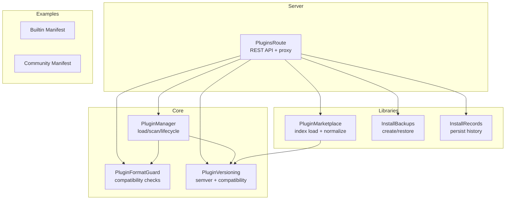
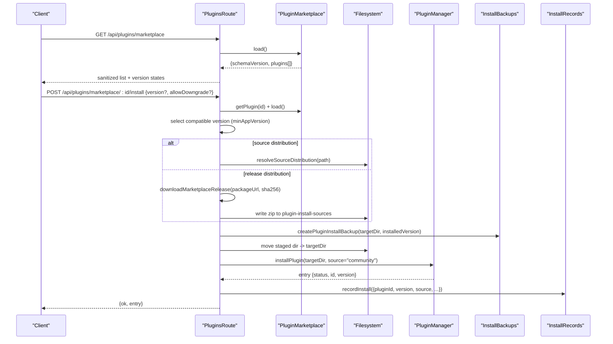
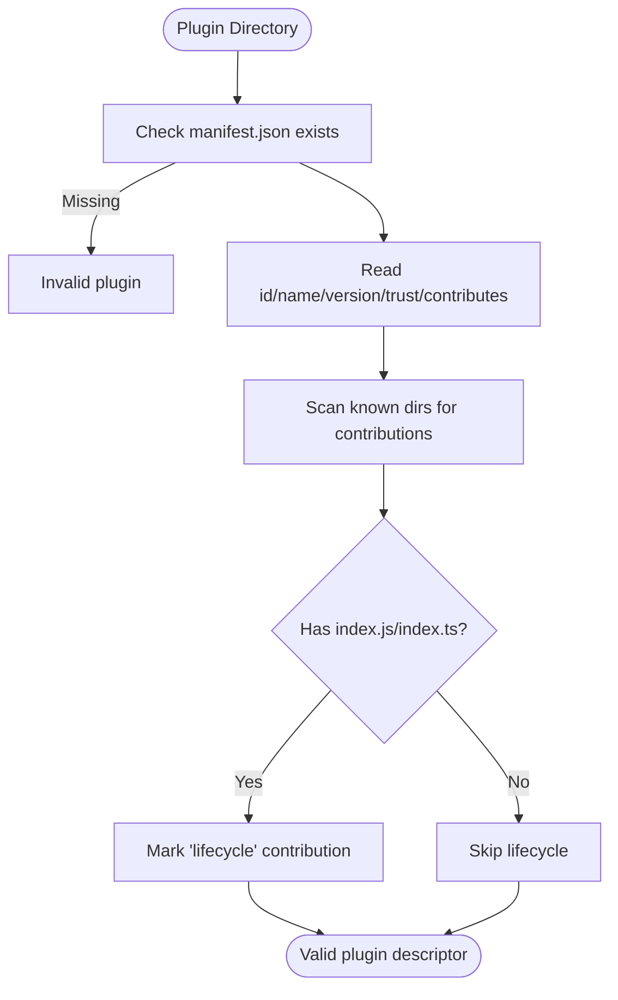
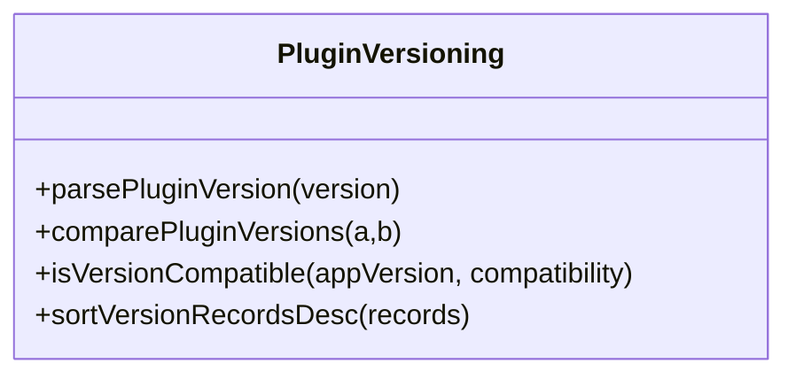
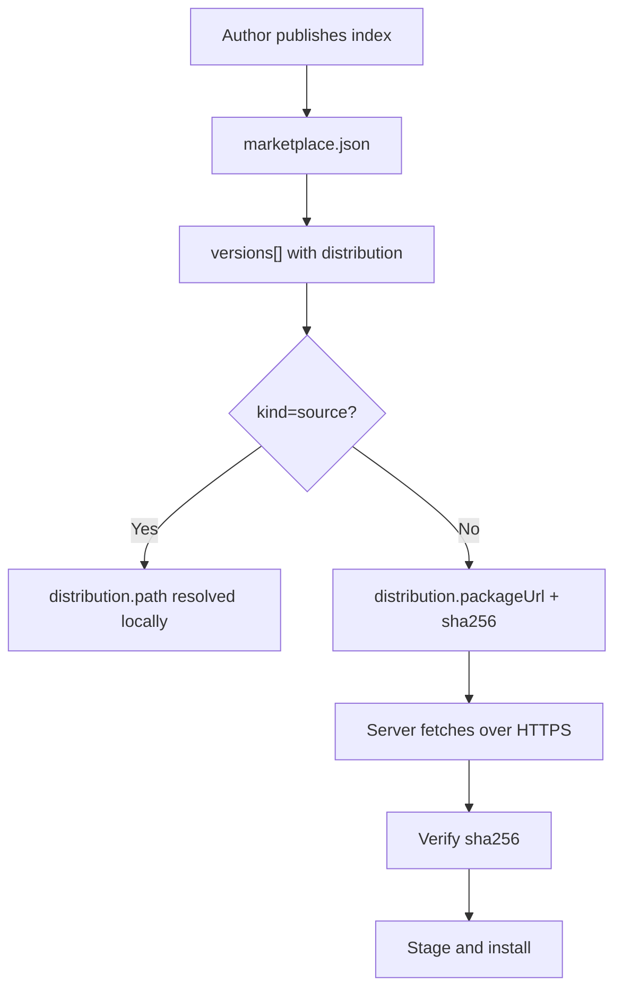
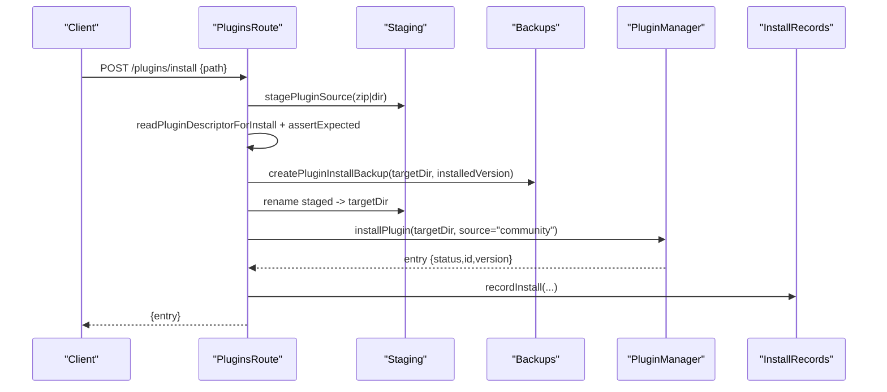
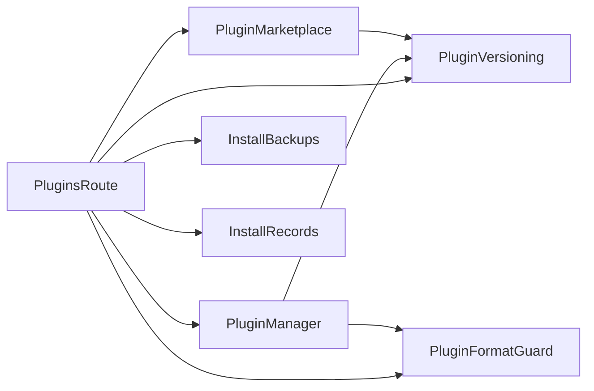

# Plugin Distribution & Marketplace

<cite>
**Referenced Files in This Document**
- [plugin-manager.ts](file://core/plugin-manager.ts)
- [plugins.ts](file://server/routes/plugins.ts)
- [plugin-marketplace.ts](file://lib/plugin-marketplace.ts)
- [plugin-versioning.ts](file://lib/plugin-versioning.ts)
- [plugin-install-backups.ts](file://lib/plugin-install-backups.ts)
- [plugin-install-records.ts](file://lib/plugin-install-records.ts)
- [plugin-format-guard.ts](file://lib/plugin-format-guard.ts)
- [manifest.json (builtin beautify)](file://plugins/builtin/beautify/manifest.json)
- [manifest.json (community hello)](file://plugins/community/hello/manifest.json)
</cite>

## Table of Contents
1. Introduction
2. Project Structure
3. Core Components
4. Architecture Overview
5. Detailed Component Analysis
6. Dependency Analysis
7. Performance Considerations
8. Troubleshooting Guide
9. Conclusion

## Introduction
This document explains how plugins are packaged, distributed, and installed in the system, including marketplace integration, versioning, dependency management, installation and update flows, backup and restore, manifest standards, and distribution channels. It also covers security boundaries, configuration, analytics hooks, and troubleshooting guidance for common issues.

## Project Structure
The plugin ecosystem is composed of:
- Plugin runtime and lifecycle management
- Marketplace index and version selection
- Installation pipeline with backups and records
- REST API endpoints for management and marketplace operations
- Example plugin manifests demonstrating structure

**Diagram sources**
- [plugin-manager.ts](file://core/plugin-manager.ts)
- [plugins.ts](file://server/routes/plugins.ts)
- [plugin-marketplace.ts](file://lib/plugin-marketplace.ts)
- [plugin-versioning.ts](file://lib/plugin-versioning.ts)
- [plugin-install-backups.ts](file://lib/plugin-install-backups.ts)
- [plugin-install-records.ts](file://lib/plugin-install-records.ts)
- [plugin-format-guard.ts](file://lib/plugin-format-guard.ts)
- [manifest.json (builtin beautify)](file://plugins/builtin/beautify/manifest.json)
- [manifest.json (community hello)](file://plugins/community/hello/manifest.json)

**Section sources**
- [plugin-manager.ts](file://core/plugin-manager.ts)
- [plugins.ts](file://server/routes/plugins.ts)
- [plugin-marketplace.ts](file://lib/plugin-marketplace.ts)
- [plugin-versioning.ts](file://lib/plugin-versioning.ts)
- [plugin-install-backups.ts](file://lib/plugin-install-backups.ts)
- [plugin-install-records.ts](file://lib/plugin-install-records.ts)
- [plugin-format-guard.ts](file://lib/plugin-format-guard.ts)
- [manifest.json (builtin beautify)](file://plugins/builtin/beautify/manifest.json)
- [manifest.json (community hello)](file://plugins/community/hello/manifest.json)

## Core Components
- PluginManager: Scans directories, reads manifests, enforces trust and capability policies, loads contributions (tools, routes, pages, widgets, settings tabs), manages activation and lifecycle, and exposes diagnostics.
- PluginsRoute: Exposes REST APIs for listing, installing, enabling/disabling, configuring, and proxying plugin UI; integrates marketplace download and install flows.
- PluginMarketplace: Loads a local or remote marketplace index, normalizes entries, resolves versions and distributions, and provides readme retrieval.
- PluginVersioning: Semver parsing/comparison and minAppVersion compatibility checks.
- InstallBackups: Creates timestamped backups before install and restores on failure.
- InstallRecords: Persists installation metadata and history.
- PluginFormatGuard: Detects incompatible formats (e.g., legacy OpenClaw) to prevent unsafe installs.

**Section sources**
- [plugin-manager.ts](file://core/plugin-manager.ts)
- [plugins.ts](file://server/routes/plugins.ts)
- [plugin-marketplace.ts](file://lib/plugin-marketplace.ts)
- [plugin-versioning.ts](file://lib/plugin-versioning.ts)
- [plugin-install-backups.ts](file://lib/plugin-install-backups.ts)
- [plugin-install-records.ts](file://lib/plugin-install-records.ts)
- [plugin-format-guard.ts](file://lib/plugin-format-guard.ts)

## Architecture Overview
The system supports two distribution channels:
- Source-based distribution: The marketplace points to a local path that the server can stage directly.
- Release-based distribution: The marketplace provides an HTTPS package URL and SHA-256 checksum; the server downloads, verifies, and installs.

**Diagram sources**
- [plugins.ts](file://server/routes/plugins.ts)
- [plugin-marketplace.ts](file://lib/plugin-marketplace.ts)
- [plugin-versioning.ts](file://lib/plugin-versioning.ts)
- [plugin-install-backups.ts](file://lib/plugin-install-backups.ts)
- [plugin-install-records.ts](file://lib/plugin-install-records.ts)
- [plugin-manager.ts](file://core/plugin-manager.ts)

## Detailed Component Analysis

### Plugin Packaging Standards
- Directory layout: A plugin directory must contain a manifest.json at its root. Optional contribution directories include tools, routes, skills, commands, agents, providers, extensions. A lifecycle entrypoint index.js/index.ts may be present.
- Manifest fields: id, name, version, description, trust (restricted or full-access), hidden, activationEvents, contributes (configuration, page, widget, settingsTab), capabilities/sensitiveCapabilities, ui.hostCapabilities, permissions.
- Compatibility: minAppVersion in manifest or per-version compatibility in marketplace index.
- Examples:
  - Builtin example manifest shows configuration schema and trust.
  - Community example manifest shows minimal fields and contribution references.

**Diagram sources**
- [plugin-manager.ts](file://core/plugin-manager.ts)
- [manifest.json (builtin beautify)](file://plugins/builtin/beautify/manifest.json)
- [manifest.json (community hello)](file://plugins/community/hello/manifest.json)

**Section sources**
- [plugin-manager.ts](file://core/plugin-manager.ts)
- [manifest.json (builtin beautify)](file://plugins/builtin/beautify/manifest.json)
- [manifest.json (community hello)](file://plugins/community/hello/manifest.json)

### Versioning Strategies
- Semver parsing and comparison support major.minor.patch and prerelease segments.
- Compatibility check uses minAppVersion from manifest or per-version compatibility in marketplace index.
- Sorting and selection logic ensures deterministic latest and selected versions based on app version and optional target version.

**Diagram sources**
- [plugin-versioning.ts](file://lib/plugin-versioning.ts)

**Section sources**
- [plugin-versioning.ts](file://lib/plugin-versioning.ts)
- [plugin-manager.ts](file://core/plugin-manager.ts)
- [plugin-marketplace.ts](file://lib/plugin-marketplace.ts)

### Dependency Management
- Plugin dependencies are not declared explicitly in manifests. Instead, compatibility is enforced via minAppVersion or per-version compatibility in the marketplace index.
- The marketplace index can specify per-version compatibility and distribution details, allowing selective availability across app versions.

**Section sources**
- [plugin-marketplace.ts](file://lib/plugin-marketplace.ts)
- [plugin-versioning.ts](file://lib/plugin-versioning.ts)

### Marketplace Submission Process and Publishing Workflows
- Marketplace index format:
  - Top-level schemaVersion and plugins array.
  - Each plugin includes id, name, publisher, version, description, license, categories, keywords, homepage, repository, compatibility, trust, permissions, contributions, screenshots, readme/readmePath/readmeUrl, install hints, and versions[].
  - versions[] items define version, compatibility, and distribution (source or release).
- Distribution kinds:
  - source: points to a local path resolvable by the server.
  - release: provides packageUrl (HTTPS) and sha256 for secure download and verification.
- Default official marketplace URL is provided; environment variables can override index file or URL.

**Diagram sources**
- [plugin-marketplace.ts](file://lib/plugin-marketplace.ts)
- [plugins.ts](file://server/routes/plugins.ts)

**Section sources**
- [plugin-marketplace.ts](file://lib/plugin-marketplace.ts)
- [plugins.ts](file://server/routes/plugins.ts)

### Installation Mechanisms and Update Procedures
- Local install: Accepts a .zip or directory path, stages into a temporary location, validates plugin format, determines target directory under user plugins dir, creates backup, moves staged content, reloads via PluginManager, and persists install records.
- Marketplace install: Selects compatible version, chooses source or release distribution, downloads and verifies release if needed, then follows the same staging and install flow.
- Downgrades: Blocked unless explicitly allowed.
- Updates: Detected by comparing selected version with installed version; higher versions trigger updates.

**Diagram sources**
- [plugins.ts](file://server/routes/plugins.ts)
- [plugin-install-backups.ts](file://lib/plugin-install-backups.ts)
- [plugin-install-records.ts](file://lib/plugin-install-records.ts)
- [plugin-manager.ts](file://core/plugin-manager.ts)

**Section sources**
- [plugins.ts](file://server/routes/plugins.ts)
- [plugin-install-backups.ts](file://lib/plugin-install-backups.ts)
- [plugin-install-records.ts](file://lib/plugin-install-records.ts)
- [plugin-manager.ts](file://core/plugin-manager.ts)

### Backup Management
- Before replacing a plugin directory, a timestamped backup is created under a dedicated backup root.
- Backups are cleaned up to a configurable maximum count per plugin.
- On failed install, the system attempts to restore the previous version from backup and reload it.

**Section sources**
- [plugin-install-backups.ts](file://lib/plugin-install-backups.ts)
- [plugins.ts](file://server/routes/plugins.ts)

### Security and Trust Model
- Trust levels: restricted vs full-access. Full-access plugins require explicit allowance and cannot be loaded for community plugins unless permitted.
- Capability gating: plugins declare capabilities and sensitiveCapabilities; route handlers enforce permission checks and return structured errors when denied.
- Route proxying: plugin UI requests are proxied through a central route with iframe ticket and surface session validation; asset access is gated by short-lived cookies.

**Section sources**
- [plugin-manager.ts](file://core/plugin-manager.ts)
- [plugins.ts](file://server/routes/plugins.ts)

### Configuration and Settings
- Plugins can contribute configuration schemas; values are scoped globally, per agent, or per session.
- The API provides endpoints to read/write config schemas and values, with special validation for certain plugins (e.g., image-gen default model).

**Section sources**
- [plugin-manager.ts](file://core/plugin-manager.ts)
- [plugins.ts](file://server/routes/plugins.ts)

### Analytics, Usage Tracking, and Feedback Integration
- The codebase includes usage tracking utilities and event bus capabilities exposed via API. While specific analytics pipelines are not detailed here, plugins can leverage the event bus and tool invocation context to integrate telemetry where appropriate.
- For concrete implementation details, refer to the event bus capabilities endpoint and usage tracker modules referenced by the server routes.

**Section sources**
- [plugins.ts](file://server/routes/plugins.ts)

### Example Plugin Manifests
- Builtin beautify manifest demonstrates configuration schema, trust level, and hidden flag.
- Community hello manifest demonstrates minimal fields and contribution references.

**Section sources**
- [manifest.json (builtin beautify)](file://plugins/builtin/beautify/manifest.json)
- [manifest.json (community hello)](file://plugins/community/hello/manifest.json)

## Dependency Analysis
- Plugins do not declare inter-plugin dependencies. Compatibility is enforced via minAppVersion or marketplace per-version compatibility.
- The server-side components have clear dependencies:
  - PluginsRoute depends on PluginManager, PluginMarketplace, PluginVersioning, InstallBackups, InstallRecords, and PluginFormatGuard.
  - PluginManager depends on PluginVersioning and PluginFormatGuard.
  - PluginMarketplace depends on PluginVersioning.

**Diagram sources**
- [plugins.ts](file://server/routes/plugins.ts)
- [plugin-manager.ts](file://core/plugin-manager.ts)
- [plugin-marketplace.ts](file://lib/plugin-marketplace.ts)
- [plugin-versioning.ts](file://lib/plugin-versioning.ts)
- [plugin-install-backups.ts](file://lib/plugin-install-backups.ts)
- [plugin-install-records.ts](file://lib/plugin-install-records.ts)
- [plugin-format-guard.ts](file://lib/plugin-format-guard.ts)

**Section sources**
- [plugins.ts](file://server/routes/plugins.ts)
- [plugin-manager.ts](file://core/plugin-manager.ts)
- [plugin-marketplace.ts](file://lib/plugin-marketplace.ts)
- [plugin-versioning.ts](file://lib/plugin-versioning.ts)
- [plugin-install-backups.ts](file://lib/plugin-install-backups.ts)
- [plugin-install-records.ts](file://lib/plugin-install-records.ts)
- [plugin-format-guard.ts](file://lib/plugin-format-guard.ts)

## Performance Considerations
- Staging and atomic moves reduce downtime during upgrades.
- Backups are limited in number to avoid disk growth.
- Marketplace loading caches normalized data; version selection is O(n) over versions list.
- Route proxying adds minimal overhead; ensure plugin apps handle errors efficiently.

[No sources needed since this section provides general guidance]

## Troubleshooting Guide
Common issues and resolutions:
- Incompatible plugin format: If a plugin appears to be from another ecosystem (e.g., OpenClaw), the installer rejects it. Convert to Hana plugin format with manifest.json.
- Version incompatibility: Ensure minAppVersion in manifest or marketplace index aligns with the current app version.
- Downgrade blocked: Use allowDowngrade=true only when necessary.
- Missing plugin directory: The manager reconciles stale registry entries; reinstall if needed.
- Full-access restrictions: Enable full-access for community plugins only if trusted.
- Network failures for releases: Verify HTTPS connectivity and correct sha256.

Operational tips:
- Use diagnostics endpoint to inspect plugin status, activation state, and errors.
- Review install records for historical changes and sources.
- Restore from backups if an update fails.

**Section sources**
- [plugin-format-guard.ts](file://lib/plugin-format-guard.ts)
- [plugin-manager.ts](file://core/plugin-manager.ts)
- [plugins.ts](file://server/routes/plugins.ts)
- [plugin-install-records.ts](file://lib/plugin-install-records.ts)
- [plugin-install-backups.ts](file://lib/plugin-install-backups.ts)

## Conclusion
The plugin system provides robust packaging standards, secure distribution channels, and comprehensive lifecycle management. Marketplace integration enables safe discovery and installation with strong versioning and compatibility controls. Backups and records ensure resilience and auditability. By adhering to manifest conventions and trust policies, developers can distribute reliable, secure plugins to users.