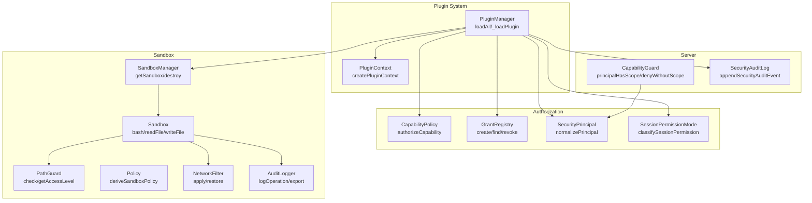
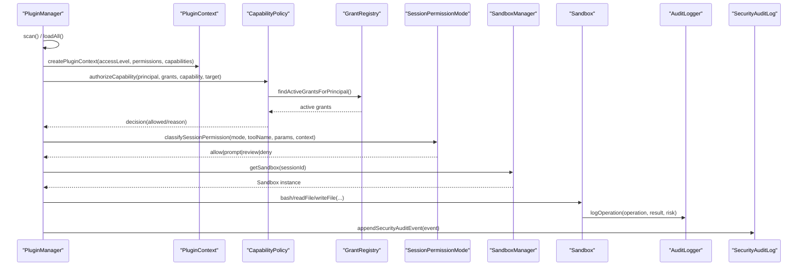
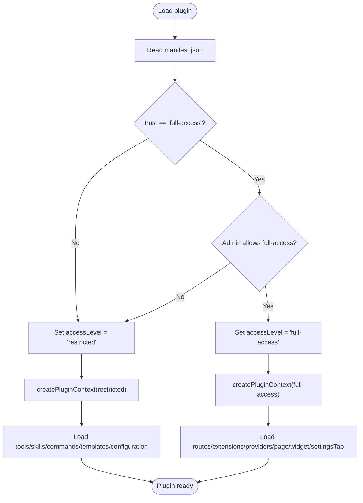
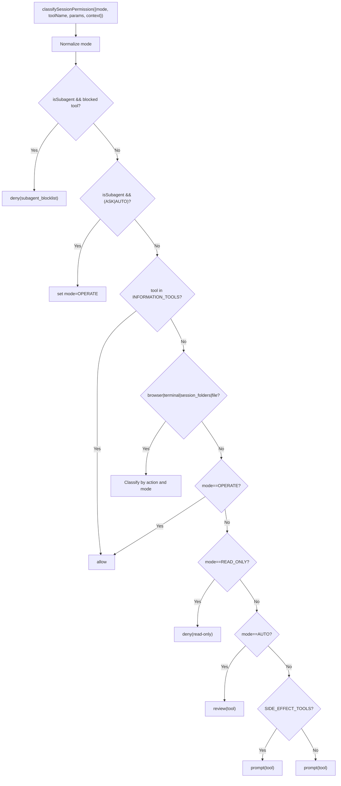
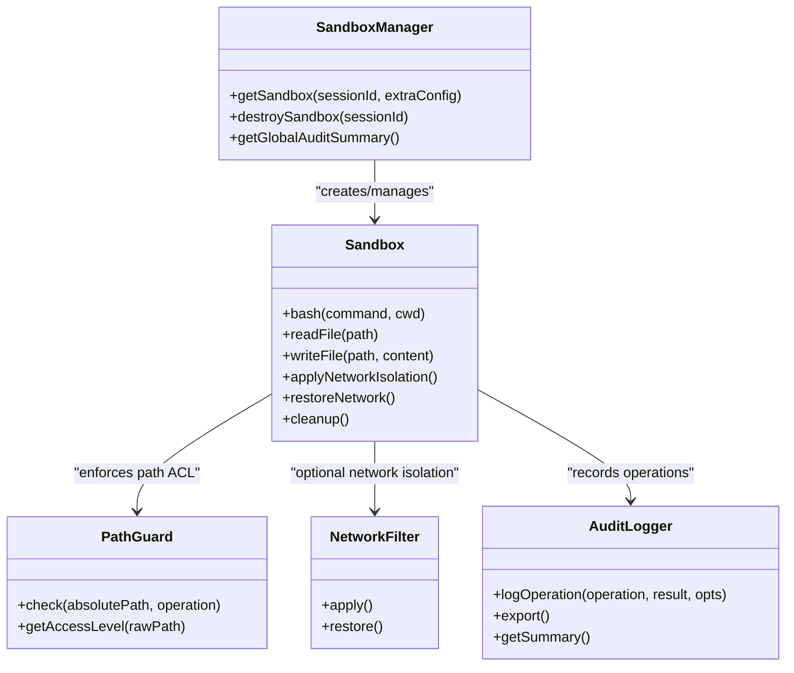
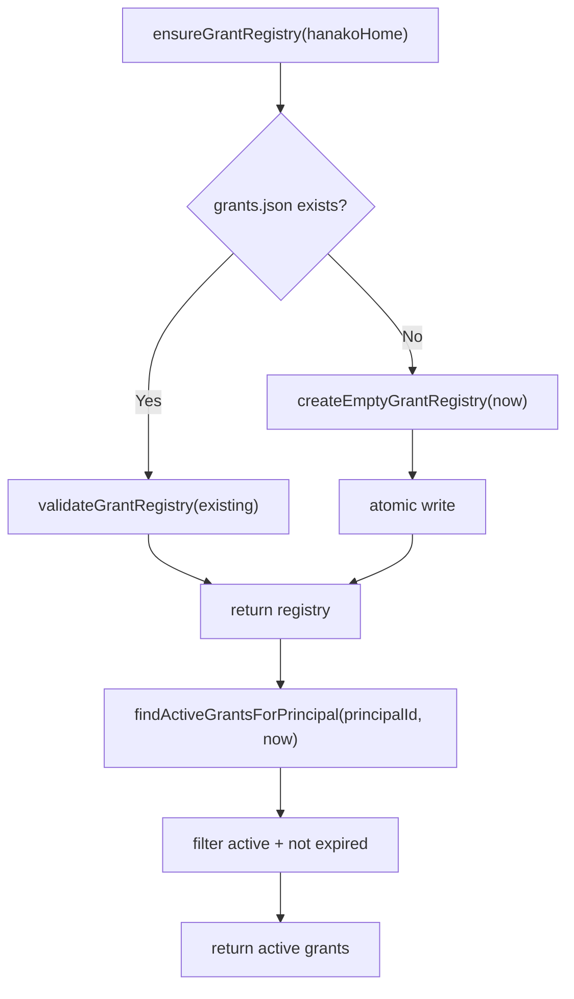
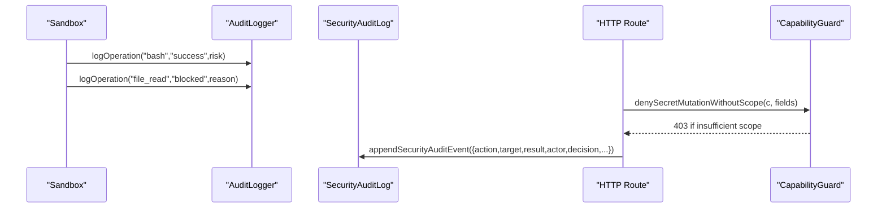
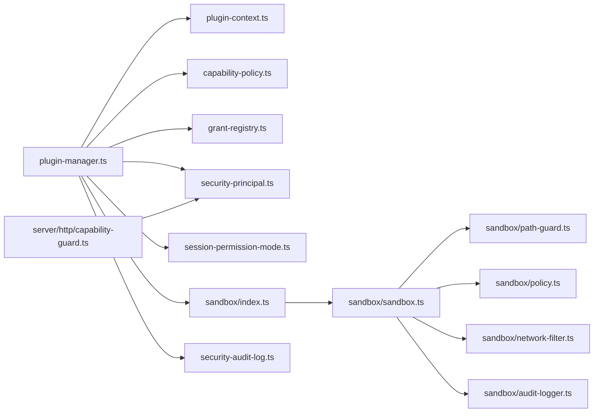

# Plugin Security & Permissions

<cite>
**Referenced Files in This Document**
- [core/plugin-manager.ts](file://core/plugin-manager.ts)
- [core/plugin-context.ts](file://core/plugin-context.ts)
- [core/capability-policy.ts](file://core/capability-policy.ts)
- [core/grant-registry.ts](file://core/grant-registry.ts)
- [core/security-principal.ts](file://core/security-principal.ts)
- [core/session-permission-mode.ts](file://core/session-permission-mode.ts)
- [core/sandbox/index.ts](file://core/sandbox/index.ts)
- [core/sandbox/sandbox.ts](file://core/sandbox/sandbox.ts)
- [core/sandbox/path-guard.ts](file://core/sandbox/path-guard.ts)
- [core/sandbox/policy.ts](file://core/sandbox/policy.ts)
- [core/sandbox/audit-logger.ts](file://core/sandbox/audit-logger.ts)
- [core/sandbox/network-filter.ts](file://core/sandbox/network-filter.ts)
- [core/security-audit-log.ts](file://core/security-audit-log.ts)
- [server/http/capability-guard.ts](file://server/http/capability-guard.ts)
</cite>

## Table of Contents
1. Introduction
2. Project Structure
3. Core Components
4. Architecture Overview
5. Detailed Component Analysis
6. Dependency Analysis
7. Performance Considerations
8. Troubleshooting Guide
9. Conclusion

## Introduction
This document explains the plugin security model and permission system, focusing on:
- Two-tier trust model (restricted vs full-access)
- Capability declarations and sensitive permissions
- Sandbox environment, file system access controls, and network request filtering
- Runtime grant system for permissions
- Audit logging and security monitoring
- Secure development practices, vulnerability assessment, and best practices
- Isolation, memory protection, and resource limitation policies

The goal is to provide a comprehensive, code-backed guide for understanding how plugins are loaded, sandboxed, authorized, and monitored.

## Project Structure
Security-related functionality spans core runtime, sandboxing, grants, capability policy, and server-side guards. The following diagram maps key modules involved in plugin security.



**Diagram sources**
- [core/plugin-manager.ts](file://core/plugin-manager.ts)
- [core/plugin-context.ts](file://core/plugin-context.ts)
- [core/capability-policy.ts](file://core/capability-policy.ts)
- [core/grant-registry.ts](file://core/grant-registry.ts)
- [core/security-principal.ts](file://core/security-principal.ts)
- [core/session-permission-mode.ts](file://core/session-permission-mode.ts)
- [core/sandbox/index.ts](file://core/sandbox/index.ts)
- [core/sandbox/sandbox.ts](file://core/sandbox/sandbox.ts)
- [core/sandbox/path-guard.ts](file://core/sandbox/path-guard.ts)
- [core/sandbox/policy.ts](file://core/sandbox/policy.ts)
- [core/sandbox/audit-logger.ts](file://core/sandbox/audit-logger.ts)
- [core/sandbox/network-filter.ts](file://core/sandbox/network-filter.ts)
- [core/security-audit-log.ts](file://core/security-audit-log.ts)
- [server/http/capability-guard.ts](file://server/http/capability-guard.ts)

**Section sources**
- [core/plugin-manager.ts](file://core/plugin-manager.ts)
- [core/plugin-context.ts](file://core/plugin-context.ts)
- [core/capability-policy.ts](file://core/capability-policy.ts)
- [core/grant-registry.ts](file://core/grant-registry.ts)
- [core/security-principal.ts](file://core/security-principal.ts)
- [core/session-permission-mode.ts](file://core/session-permission-mode.ts)
- [core/sandbox/index.ts](file://core/sandbox/index.ts)
- [core/sandbox/sandbox.ts](file://core/sandbox/sandbox.ts)
- [core/sandbox/path-guard.ts](file://core/sandbox/path-guard.ts)
- [core/sandbox/policy.ts](file://core/sandbox/policy.ts)
- [core/sandbox/audit-logger.ts](file://core/sandbox/audit-logger.ts)
- [core/sandbox/network-filter.ts](file://core/sandbox/network-filter.ts)
- [core/security-audit-log.ts](file://core/security-audit-log.ts)
- [server/http/capability-guard.ts](file://server/http/capability-guard.ts)

## Core Components
- Two-tier trust model:
  - Restricted: default for community plugins; limited bus access and no system-level extension points.
  - Full-access: reserved for builtin or explicitly trusted plugins; enables routes, extensions, providers, pages, widgets, settings tabs, and direct bus access.
- Capability declarations:
  - Plugins declare capabilities and sensitiveCapabilities in manifest.
  - Authorization checks enforce capability matching against active grants and principal scopes.
- Session permission modes:
  - Read-only, operate, ask, auto; classify tool actions and determine whether to allow, prompt, review, or deny.
- Sandbox:
  - Process isolation with command allowlist/blocklist, path guard, circuit breaker, audit logging, optional network filtering.
- Grants:
  - Persistent registry of active grants per principal with scope, constraints, and expiration.
- Principal normalization:
  - Normalizes identity, connection kind, credential kind, trust state, and scopes.
- Server-side guards:
  - Scope-based HTTP authorization helpers for secret mutation and general scope checks.

**Section sources**
- [core/plugin-manager.ts](file://core/plugin-manager.ts)
- [core/plugin-context.ts](file://core/plugin-context.ts)
- [core/capability-policy.ts](file://core/capability-policy.ts)
- [core/grant-registry.ts](file://core/grant-registry.ts)
- [core/security-principal.ts](file://core/security-principal.ts)
- [core/session-permission-mode.ts](file://core/session-permission-mode.ts)
- [core/sandbox/index.ts](file://core/sandbox/index.ts)
- [core/sandbox/sandbox.ts](file://core/sandbox/sandbox.ts)
- [core/sandbox/path-guard.ts](file://core/sandbox/path-guard.ts)
- [core/sandbox/policy.ts](file://core/sandbox/policy.ts)
- [core/sandbox/audit-logger.ts](file://core/sandbox/audit-logger.ts)
- [core/sandbox/network-filter.ts](file://core/sandbox/network-filter.ts)
- [core/security-audit-log.ts](file://core/security-audit-log.ts)
- [server/http/capability-guard.ts](file://server/http/capability-guard.ts)

## Architecture Overview
The plugin lifecycle integrates trust evaluation, capability checks, session permission classification, and sandbox enforcement.



**Diagram sources**
- [core/plugin-manager.ts](file://core/plugin-manager.ts)
- [core/plugin-context.ts](file://core/plugin-context.ts)
- [core/capability-policy.ts](file://core/capability-policy.ts)
- [core/grant-registry.ts](file://core/grant-registry.ts)
- [core/session-permission-mode.ts](file://core/session-permission-mode.ts)
- [core/sandbox/index.ts](file://core/sandbox/index.ts)
- [core/sandbox/sandbox.ts](file://core/sandbox/sandbox.ts)
- [core/sandbox/audit-logger.ts](file://core/sandbox/audit-logger.ts)
- [core/security-audit-log.ts](file://core/security-audit-log.ts)

## Detailed Component Analysis

### Two-Tier Trust Model and Plugin Loading
- Trust determination:
  - Builtin plugins always receive full-access.
  - Community plugins can declare trust: full-access requires explicit admin allowance; otherwise treated as restricted.
- Access level effects:
  - Restricted: only declarative contributions (tools, skills, commands, agent templates, configuration).
  - Full-access: additionally loads routes, extensions, providers, page, widget, settings tab, and may activate lifecycle hooks.
- Context creation:
  - Creates a scoped bus proxy for restricted plugins that enforces usage.read permission for llm_usage events.
  - Exposes config store, logging, session file staging, and declared capabilities.



**Diagram sources**
- [core/plugin-manager.ts](file://core/plugin-manager.ts)
- [core/plugin-context.ts](file://core/plugin-context.ts)

**Section sources**
- [core/plugin-manager.ts](file://core/plugin-manager.ts)
- [core/plugin-context.ts](file://core/plugin-context.ts)

### Capability Declarations and Authorization
- Manifest fields:
  - capabilities: non-sensitive capabilities required by the plugin.
  - sensitiveCapabilities: sensitive capabilities requiring explicit approval.
- Authorization flow:
  - normalizeTarget and normalizePrincipal ensure consistent inputs.
  - Local owner bypasses grants when applicable.
  - Active grants must match capability (including namespace.*), transport constraints, and scope.
- Decision summary:
  - Returns allowed/reason with normalized fields for auditing.

```mermaid
classDiagram
class CapabilityPolicy {
+authorizeCapability({principal, grants, capability, target, connectionKind, now})
+capabilityDecisionSummary(value)
}
class SecurityPrincipal {
+normalizePrincipal(input)
+principalOwnsLocalConnection(principal)
+principalHasScope(principal, required)
}
class GrantRegistry {
+findActiveGrantsForPrincipal(hanakoHome, principalId, {now})
+createGrant(hanakoHome, input)
+revokeGrant(hanakoHome, grantId, {now})
}
CapabilityPolicy --> SecurityPrincipal : "uses"
CapabilityPolicy --> GrantRegistry : "reads active grants"
```

**Diagram sources**
- [core/capability-policy.ts](file://core/capability-policy.ts)
- [core/security-principal.ts](file://core/security-principal.ts)
- [core/grant-registry.ts](file://core/grant-registry.ts)

**Section sources**
- [core/capability-policy.ts](file://core/capability-policy.ts)
- [core/security-principal.ts](file://core/security-principal.ts)
- [core/grant-registry.ts](file://core/grant-registry.ts)

### Session Permission Modes and Tool Classification
- Modes:
  - read_only, operate, ask, auto.
- Classification rules:
  - Information tools are allowed.
  - Browser/terminal/file actions classified based on mode and action type.
  - Subagent contexts have fixed boundaries and collapse ASK/AUTO to OPERATE to avoid indefinite prompts.
- Outcomes:
  - allow, prompt (human confirmation), review (auto-review), deny with layer explanation.



**Diagram sources**
- [core/session-permission-mode.ts](file://core/session-permission-mode.ts)

**Section sources**
- [core/session-permission-mode.ts](file://core/session-permission-mode.ts)

### Sandbox Environment and File System Controls
- Sandbox manager:
  - Per-session sandbox instances with eviction and global audit summary.
- Sandbox execution:
  - Command allowlist/blocklist, working directory restriction via PathGuard, process concurrency limits, timeout, output size caps.
  - Resource wrapping with ulimit for processes, file size, virtual memory.
  - Circuit breaker to protect against repeated failures/timeouts.
- Path guard:
  - Resolves real paths (follows symlinks), applies ACL levels (blocked, read_only, read_write, full).
  - Policy-driven writable/readable/deny lists derived from workspace roots and hanakoHome structure.
- Network filter:
  - Best-effort outbound control via /etc/hosts manipulation; supports custom mappings and private IP blocking.



**Diagram sources**
- [core/sandbox/index.ts](file://core/sandbox/index.ts)
- [core/sandbox/sandbox.ts](file://core/sandbox/sandbox.ts)
- [core/sandbox/path-guard.ts](file://core/sandbox/path-guard.ts)
- [core/sandbox/network-filter.ts](file://core/sandbox/network-filter.ts)
- [core/sandbox/audit-logger.ts](file://core/sandbox/audit-logger.ts)

**Section sources**
- [core/sandbox/index.ts](file://core/sandbox/index.ts)
- [core/sandbox/sandbox.ts](file://core/sandbox/sandbox.ts)
- [core/sandbox/path-guard.ts](file://core/sandbox/path-guard.ts)
- [core/sandbox/policy.ts](file://core/sandbox/policy.ts)
- [core/sandbox/network-filter.ts](file://core/sandbox/network-filter.ts)
- [core/sandbox/audit-logger.ts](file://core/sandbox/audit-logger.ts)

### Grant System for Runtime Permissions
- Registry schema:
  - Versioned grants with principalId, subjectKind, scope, capabilities, constraints (transportKinds, expiresAt, maxBytesPerRequest, allowSecretRead), status (active/revoked/expired).
- Operations:
  - Ensure/load registry, create grant, find active grants for principal, revoke grant, atomic persistence.
- Integration:
  - Capability policy uses active grants to decide authorization.



**Diagram sources**
- [core/grant-registry.ts](file://core/grant-registry.ts)
- [core/capability-policy.ts](file://core/capability-policy.ts)

**Section sources**
- [core/grant-registry.ts](file://core/grant-registry.ts)
- [core/capability-policy.ts](file://core/capability-policy.ts)

### Security Audit Logging and Monitoring
- Sandbox audit:
  - Per-operation entries with timestamp, sessionId, operation, result, reason, durationMs, risk, metadata.
  - Export and summary utilities for high-risk filtering and aggregation.
- Global security audit:
  - Append JSONL events with actor, decision, leaseId, errorCode, masked secrets, and sanitized metadata.
- Server-side scope guards:
  - Helpers to deny requests lacking required scopes (e.g., secrets.write).



**Diagram sources**
- [core/sandbox/audit-logger.ts](file://core/sandbox/audit-logger.ts)
- [core/security-audit-log.ts](file://core/security-audit-log.ts)
- [server/http/capability-guard.ts](file://server/http/capability-guard.ts)

**Section sources**
- [core/sandbox/audit-logger.ts](file://core/sandbox/audit-logger.ts)
- [core/security-audit-log.ts](file://core/security-audit-log.ts)
- [server/http/capability-guard.ts](file://server/http/capability-guard.ts)

### Conceptual Overview
- Principle of least privilege:
  - Default to restricted; escalate only when necessary and audited.
- Defense in depth:
  - Combine capability checks, session permission modes, sandbox path/network controls, and audit logs.
- Explicit boundaries:
  - Subagent restrictions prevent recursion and long-term memory writes.
  - Transport constraints limit where capabilities can be exercised.

[No sources needed since this section doesn't analyze specific files]

## Dependency Analysis
Key dependencies among security components:



**Diagram sources**
- [core/plugin-manager.ts](file://core/plugin-manager.ts)
- [core/plugin-context.ts](file://core/plugin-context.ts)
- [core/capability-policy.ts](file://core/capability-policy.ts)
- [core/grant-registry.ts](file://core/grant-registry.ts)
- [core/security-principal.ts](file://core/security-principal.ts)
- [core/session-permission-mode.ts](file://core/session-permission-mode.ts)
- [core/sandbox/index.ts](file://core/sandbox/index.ts)
- [core/sandbox/sandbox.ts](file://core/sandbox/sandbox.ts)
- [core/sandbox/path-guard.ts](file://core/sandbox/path-guard.ts)
- [core/sandbox/policy.ts](file://core/sandbox/policy.ts)
- [core/sandbox/network-filter.ts](file://core/sandbox/network-filter.ts)
- [core/sandbox/audit-logger.ts](file://core/sandbox/audit-logger.ts)
- [core/security-audit-log.ts](file://core/security-audit-log.ts)
- [server/http/capability-guard.ts](file://server/http/capability-guard.ts)

**Section sources**
- [core/plugin-manager.ts](file://core/plugin-manager.ts)
- [core/plugin-context.ts](file://core/plugin-context.ts)
- [core/capability-policy.ts](file://core/capability-policy.ts)
- [core/grant-registry.ts](file://core/grant-registry.ts)
- [core/security-principal.ts](file://core/security-principal.ts)
- [core/session-permission-mode.ts](file://core/session-permission-mode.ts)
- [core/sandbox/index.ts](file://core/sandbox/index.ts)
- [core/sandbox/sandbox.ts](file://core/sandbox/sandbox.ts)
- [core/sandbox/path-guard.ts](file://core/sandbox/path-guard.ts)
- [core/sandbox/policy.ts](file://core/sandbox/policy.ts)
- [core/sandbox/network-filter.ts](file://core/sandbox/network-filter.ts)
- [core/sandbox/audit-logger.ts](file://core/sandbox/audit-logger.ts)
- [core/security-audit-log.ts](file://core/security-audit-log.ts)
- [server/http/capability-guard.ts](file://server/http/capability-guard.ts)

## Performance Considerations
- Sandbox timeouts and buffer limits:
  - Prevent runaway processes and excessive memory use; tune timeoutMs and maxBuffer per workload.
- Circuit breaker:
  - Reduces cascading failures under repeated errors/timeouts.
- Concurrency limits:
  - maxProcesses prevents resource exhaustion.
- Audit overhead:
  - Keep metadata minimal; export summaries rather than raw logs during hot paths.
- Network filtering:
  - Hosts file manipulation is best-effort; consider containerization for stronger isolation at scale.

[No sources needed since this section provides general guidance]

## Troubleshooting Guide
- Plugin fails to load:
  - Check trust setting and admin allowance for full-access community plugins.
  - Verify minAppVersion compatibility and activation events.
- Insufficient capability:
  - Confirm active grants include the required capability and scope; check transport constraints and expiration.
- Read-only denials:
  - Adjust session permission mode or re-dispatch subagents with appropriate access.
- Sandbox blocks:
  - Review PathGuard denied reasons and policy writable/readable lists; ensure working directory is within allowed scope.
- Network issues:
  - If using NetworkFilter, verify allowedHosts/customMappings and restore hosts after use.
- Audit findings:
  - Use AuditLogger.getHighRiskEntries and getSummary to identify patterns; correlate with SecurityAuditLog events.

**Section sources**
- [core/plugin-manager.ts](file://core/plugin-manager.ts)
- [core/capability-policy.ts](file://core/capability-policy.ts)
- [core/session-permission-mode.ts](file://core/session-permission-mode.ts)
- [core/sandbox/sandbox.ts](file://core/sandbox/sandbox.ts)
- [core/sandbox/path-guard.ts](file://core/sandbox/path-guard.ts)
- [core/sandbox/network-filter.ts](file://core/sandbox/network-filter.ts)
- [core/sandbox/audit-logger.ts](file://core/sandbox/audit-logger.ts)
- [core/security-audit-log.ts](file://core/security-audit-log.ts)

## Conclusion
The plugin security model combines a two-tier trust model, explicit capability declarations, robust session permission classification, and a hardened sandbox with path and network controls. Grants and principals provide fine-grained authorization, while layered audit logging ensures visibility and accountability. Following the recommended practices—least privilege, explicit scopes, bounded subagent behavior, and strong sandbox policies—helps mitigate risks and maintain a secure, extensible plugin ecosystem.

[No sources needed since this section summarizes without analyzing specific files]