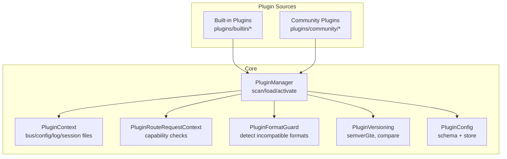
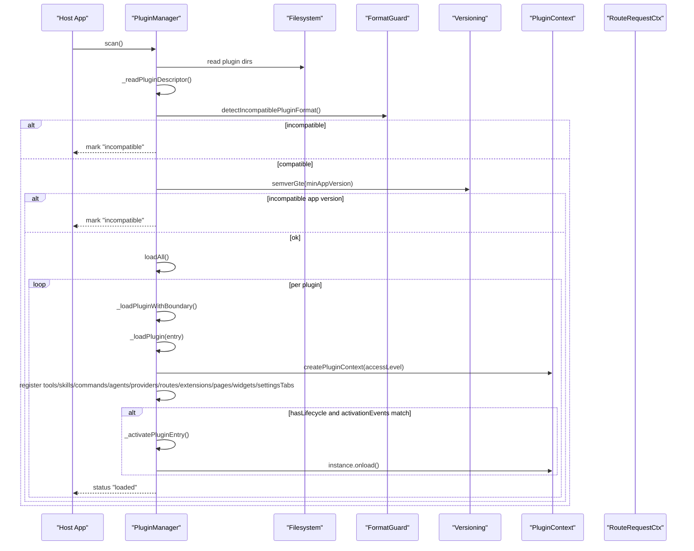
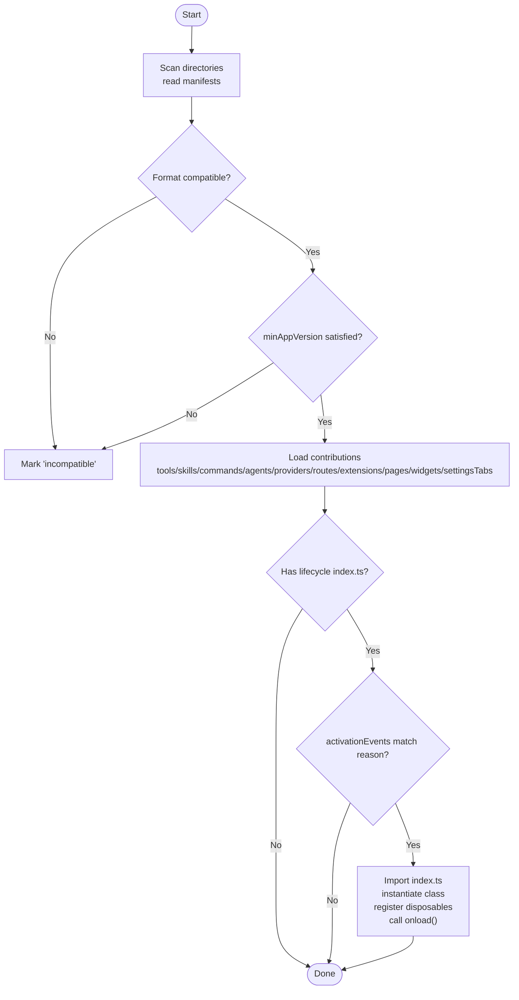
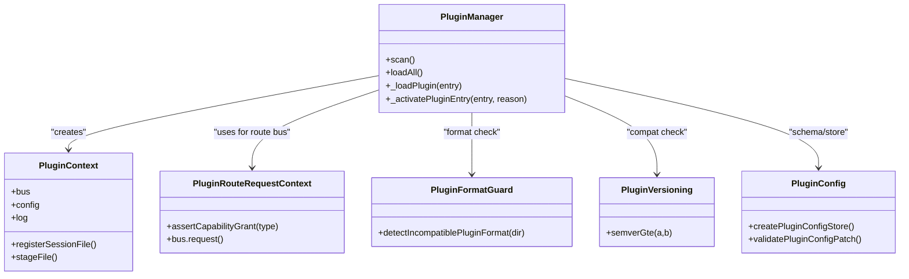
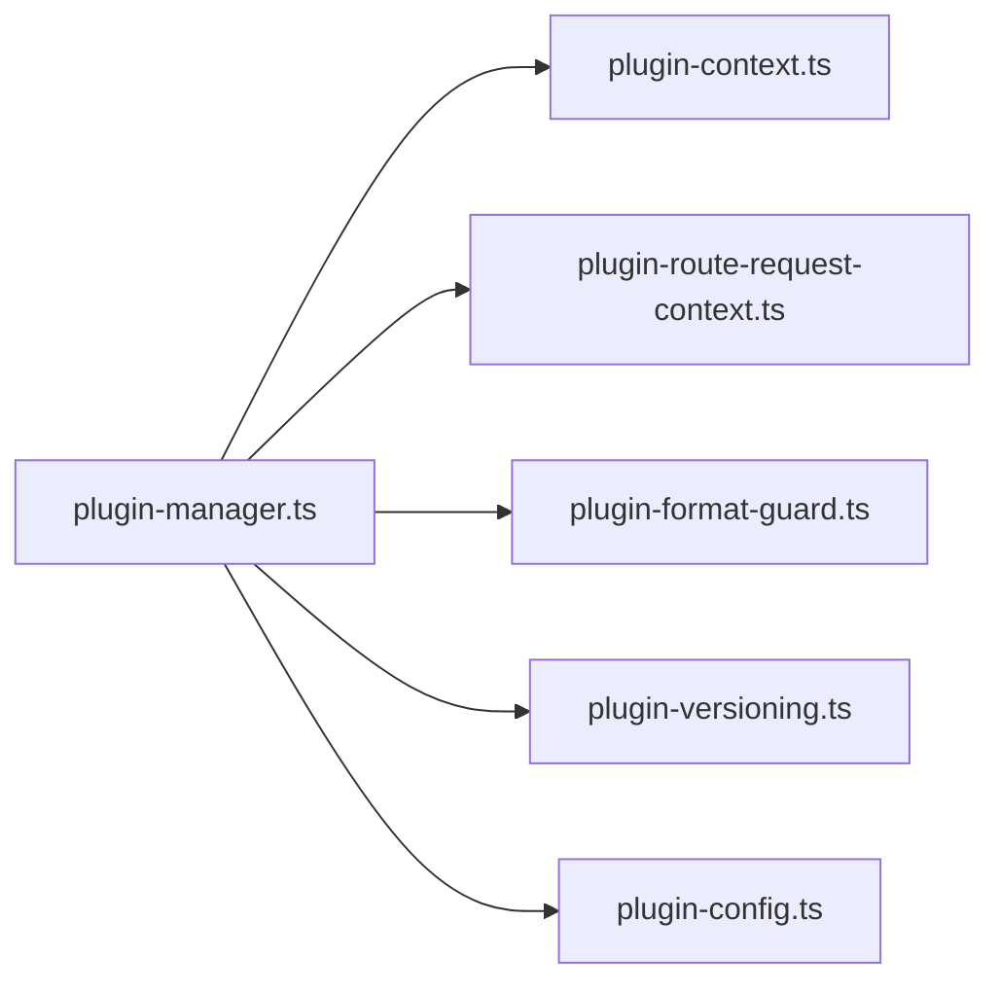

# Plugin System Overview

<cite>
**Referenced Files in This Document**
- [plugin-manager.ts](file://core/plugin-manager.ts)
- [plugin-context.ts](file://core/plugin-context.ts)
- [plugin-route-request-context.ts](file://core/plugin-route-request-context.ts)
- [plugin-format-guard.ts](file://lib/plugin-format-guard.ts)
- [plugin-versioning.ts](file://lib/plugin-versioning.ts)
- [plugin-config.ts](file://core/plugin-config.ts)
- [manifest.json (builtin beautify)](file://plugins/builtin/beautify/manifest.json)
- [manifest.json (community hello)](file://plugins/community/hello/manifest.json)
</cite>

## Table of Contents
1. [Introduction](#introduction)
2. [Project Structure](#project-structure)
3. [Core Components](#core-components)
4. [Architecture Overview](#architecture-overview)
5. [Detailed Component Analysis](#detailed-component-analysis)
6. [Dependency Analysis](#dependency-analysis)
7. [Performance Considerations](#performance-considerations)
8. [Troubleshooting Guide](#troubleshooting-guide)
9. [Conclusion](#conclusion)
10. [Appendices](#appendices)

## Introduction
This document explains the plugin system’s extensibility architecture, focusing on how plugins are discovered, validated, loaded, and activated; how permissions and security boundaries are enforced; how source priority and shadowing work; and how to author, version, and troubleshoot plugins. It is intended for both plugin authors and platform integrators.

## Project Structure
The plugin system centers around a manager that scans directories, reads manifests, validates formats and compatibility, loads contributions, and activates lifecycle-capable plugins. Supporting modules provide context, permission enforcement, format guards, versioning, and configuration schema validation.

**Diagram sources**
- [plugin-manager.ts](file://core/plugin-manager.ts)
- [plugin-context.ts](file://core/plugin-context.ts)
- [plugin-route-request-context.ts](file://core/plugin-route-request-context.ts)
- [plugin-format-guard.ts](file://lib/plugin-format-guard.ts)
- [plugin-versioning.ts](file://lib/plugin-versioning.ts)
- [plugin-config.ts](file://core/plugin-config.ts)

**Section sources**
- [plugin-manager.ts](file://core/plugin-manager.ts)
- [plugin-context.ts](file://core/plugin-context.ts)
- [plugin-route-request-context.ts](file://core/plugin-route-request-context.ts)
- [plugin-format-guard.ts](file://lib/plugin-format-guard.ts)
- [plugin-versioning.ts](file://lib/plugin-versioning.ts)
- [plugin-config.ts](file://core/plugin-config.ts)

## Core Components
- PluginManager: Orchestrates scanning, descriptor reading, loading stages, activation, contribution registration, and runtime cleanup. Implements source priority and shadowing annotations.
- PluginContext: Provides each plugin with an isolated bus proxy, config store, logging, session file staging, and runtime scope.
- PluginRouteRequestContext: Enforces capability declarations and access levels when plugins call into the host bus.
- PluginFormatGuard: Detects incompatible legacy formats and returns structured issues.
- PluginVersioning: Semver parsing and comparison utilities used for minAppVersion checks.
- PluginConfig: Schema normalization, scoped storage, validation, and redaction.

Key responsibilities and interactions are detailed in the following sections.

**Section sources**
- [plugin-manager.ts](file://core/plugin-manager.ts)
- [plugin-context.ts](file://core/plugin-context.ts)
- [plugin-route-request-context.ts](file://core/plugin-route-request-context.ts)
- [plugin-format-guard.ts](file://lib/plugin-format-guard.ts)
- [plugin-versioning.ts](file://lib/plugin-versioning.ts)
- [plugin-config.ts](file://core/plugin-config.ts)

## Architecture Overview
The plugin lifecycle flows from directory scan through manifest parsing, format and compatibility checks, staged loading of contributions, optional activation, and runtime operation with strict permission boundaries.

**Diagram sources**
- [plugin-manager.ts](file://core/plugin-manager.ts)
- [plugin-format-guard.ts](file://lib/plugin-format-guard.ts)
- [plugin-versioning.ts](file://lib/plugin-versioning.ts)
- [plugin-context.ts](file://core/plugin-context.ts)

## Detailed Component Analysis

### Plugin Discovery and Manifest Structure
- Discovery: The manager iterates configured plugin directories in order. The first directory is treated as built-in; subsequent directories are community. Each non-hidden directory is parsed for a manifest and known contribution folders.
- Manifest fields: id, name, version, description, trust, hidden, activationEvents, contributes, ui.hostCapabilities, capabilities, sensitiveCapabilities, minAppVersion.
- Contributions detected by presence of directories or manifest keys: tools, routes, skills, agents, commands, providers, extensions, page, widget, settingsTab, configuration.
- Example manifests:
  - Built-in example with full-access and configuration schema.
  - Community example declaring tools and routes.

Practical examples of directory structure:
- A minimal plugin includes a manifest.json and optionally index.ts for lifecycle.
- Tools live under tools/*.ts exporting name, description, parameters, execute.
- Routes live under routes/*.ts exporting handlers.
- Skills, agents, commands, providers follow similar conventions.

Manifest schema highlights:
- trust: "restricted" (default) or "full-access".
- activationEvents: array of events like "onStartup", "onToolCall", "onBusRequest", or wildcards.
- contributes.configuration: JSON Schema-like properties defining typed, scoped settings.
- ui.hostCapabilities: allowlist of UI host features.

**Section sources**
- [plugin-manager.ts](file://core/plugin-manager.ts)
- [manifest.json (builtin beautify)](file://plugins/builtin/beautify/manifest.json)
- [manifest.json (community hello)](file://plugins/community/hello/manifest.json)

### Loading Lifecycle: From Scan to Activation
- scan(): Reads descriptors, detects contributions, normalizes trust and activation events, and reconciles missing directories.
- loadAll(): Applies disabled list, format guard, trust policy, minAppVersion, then loads contributions and optionally activates.
- _loadPluginWithBoundary(): Wraps loading with timeouts and cancellation tokens.
- _loadPlugin(): Creates PluginContext, registers declarative contributions, and for full-access plugins also loads routes, extensions, providers, pages, widgets, settings tabs. If activation events match, triggers activation.
- _activatePluginEntry(): Imports index.ts if present, instantiates class, wires disposables and dynamic tool registration, calls onload(), marks activated.

**Diagram sources**
- [plugin-manager.ts](file://core/plugin-manager.ts)

**Section sources**
- [plugin-manager.ts](file://core/plugin-manager.ts)

### Two-Tier Permission Model and Security Boundaries
Access level determination:
- Full-access: Built-in plugins or community plugins explicitly marked trust: "full-access" and allowed by preferences.
- Restricted: All other plugins.

Restricted mode enforces:
- Bus proxy limits usage.read permission for llm_usage emit/subscribe/request.
- Capability declaration model distinguishes between declared and un-declared capabilities. Legacy behavior only applies when both capabilities and sensitiveCapabilities are absent; explicit empty arrays mean zero capabilities allowed.
- Route request context asserts capability grants based on access level and declarations.

Security boundaries:
- Full-access plugins can contribute routes, extensions, providers, pages, widgets, settings tabs.
- Restricted plugins cannot access these system-level extension points.
- PluginContext provides isolated config stores, log sinks, and session file staging.

**Diagram sources**
- [plugin-manager.ts](file://core/plugin-manager.ts)
- [plugin-context.ts](file://core/plugin-context.ts)
- [plugin-route-request-context.ts](file://core/plugin-route-request-context.ts)
- [plugin-format-guard.ts](file://lib/plugin-format-guard.ts)
- [plugin-versioning.ts](file://lib/plugin-versioning.ts)
- [plugin-config.ts](file://core/plugin-config.ts)

**Section sources**
- [plugin-context.ts](file://core/plugin-context.ts)
- [plugin-route-request-context.ts](file://core/plugin-route-request-context.ts)
- [plugin-manager.ts](file://core/plugin-manager.ts)

### Source Priority and Shadowing Behavior
Priority order (lower wins): dev > community > builtin.
- When multiple entries share the same plugin id, the one with higher priority becomes active at runtime.
- The manager annotates entries with shadowedBy and shadows to indicate which versions are overridden.

Behavior details:
- Preferred entry selection uses normalized source priority.
- Runtime entry selection prefers already-loaded instances respecting priority.
- Shadowing annotations are refreshed before listing or resolving plugins.

**Section sources**
- [plugin-manager.ts](file://core/plugin-manager.ts)

### Contribution Types and Examples
Supported contributions include:
- tools: Executable functions with name, description, parameters, execute.
- routes: HTTP endpoints for full-access plugins.
- skills: Skill paths registered for discovery.
- agents: Agent templates (JSON).
- commands: Slash command registrations.
- providers: Provider implementations (full-access).
- extensions: Extension factories (full-access).
- page, widget, settingsTab: UI surfaces (full-access).
- configuration: Typed settings via contributes.configuration.

Examples:
- Built-in beautify plugin declares configuration and full-access trust.
- Community hello plugin declares tools and routes.

**Section sources**
- [plugin-manager.ts](file://core/plugin-manager.ts)
- [manifest.json (builtin beautify)](file://plugins/builtin/beautify/manifest.json)
- [manifest.json (community hello)](file://plugins/community/hello/manifest.json)

### Plugin Versioning and Compatibility
- minAppVersion: Plugins can declare a minimum supported application version. The manager compares using semverGte and marks incompatible if not met.
- Version parsing supports major.minor.patch and pre-release identifiers.

**Section sources**
- [plugin-manager.ts](file://core/plugin-manager.ts)
- [plugin-versioning.ts](file://lib/plugin-versioning.ts)

### Format Validation
- The format guard detects legacy OpenClaw-style packages (openclaw.plugin.json or package.json openclaw block without manifest.json) and returns a structured incompatibility issue.
- During loadAll, such plugins are marked "incompatible" with a clear message.

**Section sources**
- [plugin-format-guard.ts](file://lib/plugin-format-guard.ts)
- [plugin-manager.ts](file://core/plugin-manager.ts)

### Configuration Schema and Scoped Storage
- contributes.configuration defines typed properties with scopes: global, per-agent, per-session.
- The config store validates writes against the schema, applies defaults, and redacts sensitive values when requested.

**Section sources**
- [plugin-config.ts](file://core/plugin-config.ts)
- [plugin-manager.ts](file://core/plugin-manager.ts)

## Dependency Analysis
High-level dependencies among core components:

**Diagram sources**
- [plugin-manager.ts](file://core/plugin-manager.ts)
- [plugin-context.ts](file://core/plugin-context.ts)
- [plugin-route-request-context.ts](file://core/plugin-route-request-context.ts)
- [plugin-format-guard.ts](file://lib/plugin-format-guard.ts)
- [plugin-versioning.ts](file://lib/plugin-versioning.ts)
- [plugin-config.ts](file://core/plugin-config.ts)

**Section sources**
- [plugin-manager.ts](file://core/plugin-manager.ts)

## Performance Considerations
- Load timeout: Each plugin load stage is wrapped with a configurable timeout to prevent hangs.
- Staged loading: Contributions are loaded incrementally; only required parts are executed.
- Cancellation: Load tokens ensure stale or cancelled loads do not leak resources.
- Avoid heavy initialization in onload; prefer lazy initialization where possible.

[No sources needed since this section provides general guidance]

## Troubleshooting Guide
Common issues and diagnostics:
- Incompatible format: Detected by format guard; plugin marked "incompatible" with a message indicating migration to Hana plugin format.
- Missing directory: Reconciliation removes stale registry entries for community plugins whose directories no longer exist.
- Disabled plugin: Community plugins can be disabled; they remain in registry but are not loaded.
- Trust blocked: Community plugins with trust: "full-access" require explicit allowance; otherwise marked "restricted".
- Version mismatch: minAppVersion not satisfied results in "incompatible" status.
- Activation failure: Errors during import or onload set activationState to "failed" with error details.
- Capability denied: Restricted plugins attempting to use system capabilities will receive permission errors; ensure proper declarations or upgrade trust.

Operational tips:
- Check plugin status and error fields after loadAll.
- Use getPlugin/listPlugins to inspect shadowing relationships and active entries.
- Validate configuration changes against schema to avoid write failures.

**Section sources**
- [plugin-manager.ts](file://core/plugin-manager.ts)
- [plugin-format-guard.ts](file://lib/plugin-format-guard.ts)
- [plugin-config.ts](file://core/plugin-config.ts)

## Conclusion
The plugin system provides a robust, secure, and extensible framework. It balances developer ergonomics with strong security boundaries, clear versioning and compatibility checks, and rich contribution types. By adhering to manifest conventions, understanding the two-tier permission model, and leveraging the provided tooling, authors can build safe and powerful plugins.

[No sources needed since this section summarizes without analyzing specific files]

## Appendices

### Practical Directory Layout Examples
- Minimal plugin:
  - manifest.json
  - index.ts (optional, for lifecycle)
  - tools/ (for tool contributions)
  - routes/ (for full-access route contributions)
- Example references:
  - Built-in beautify manifest with configuration and full-access trust.
  - Community hello manifest with tools and routes.

**Section sources**
- [manifest.json (builtin beautify)](file://plugins/builtin/beautify/manifest.json)
- [manifest.json (community hello)](file://plugins/community/hello/manifest.json)