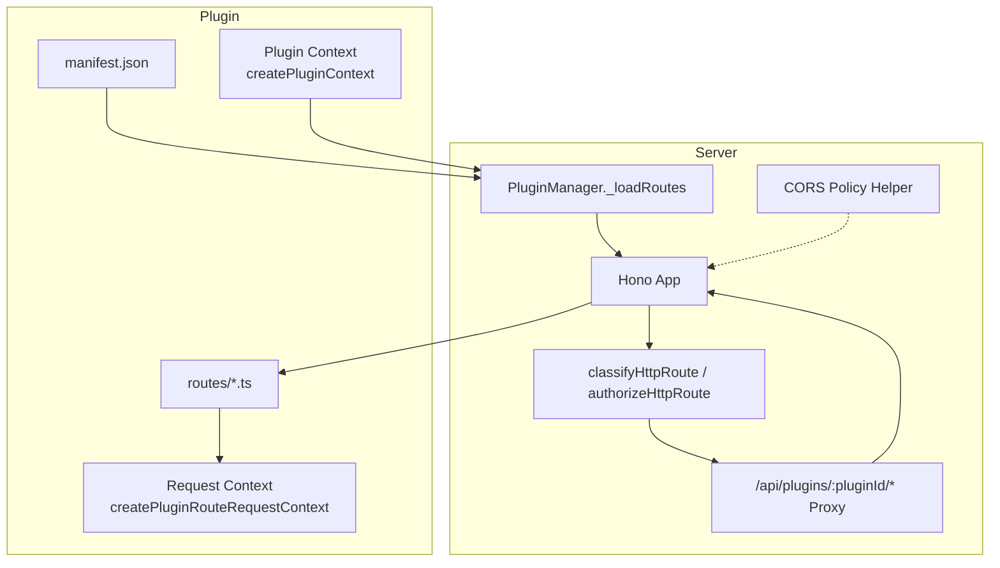
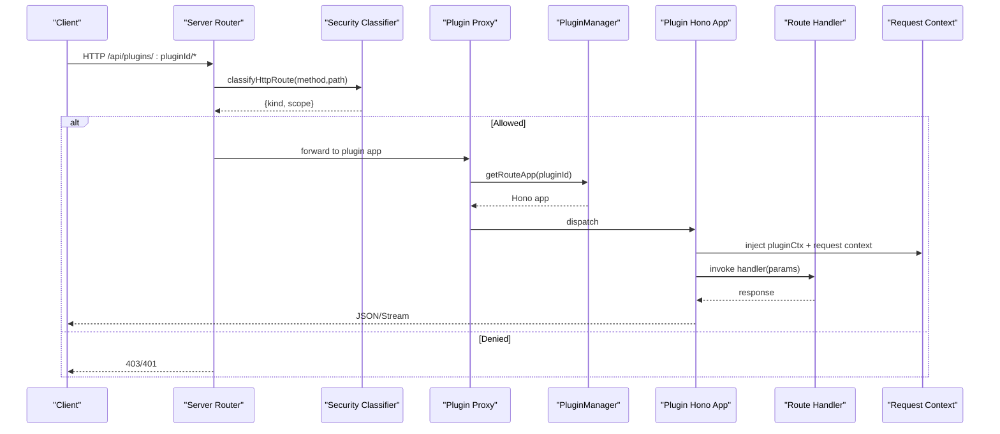
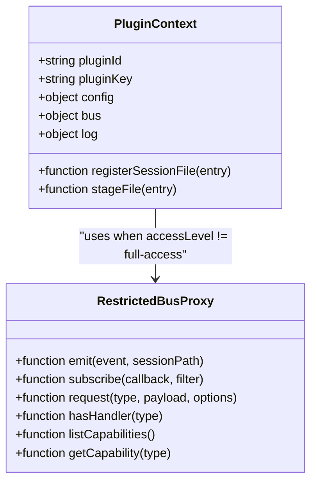
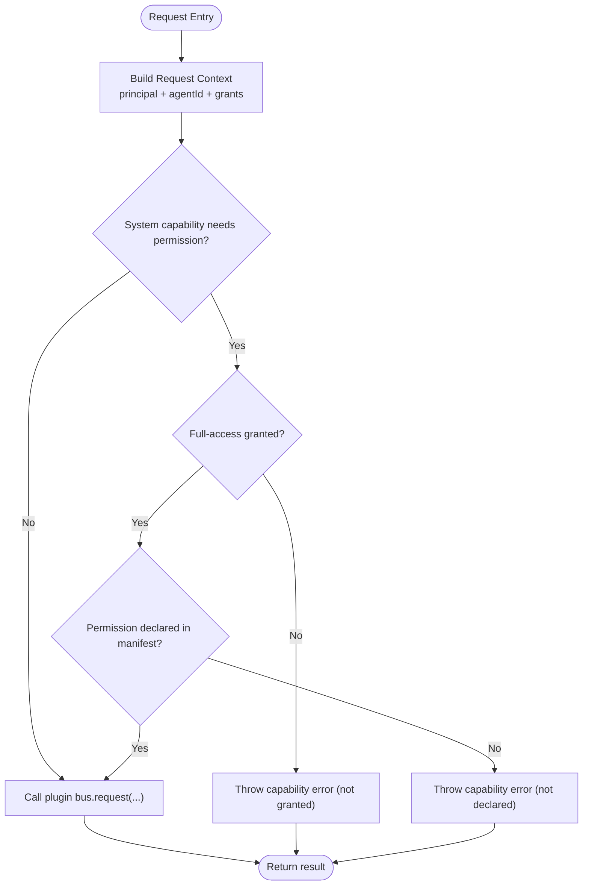
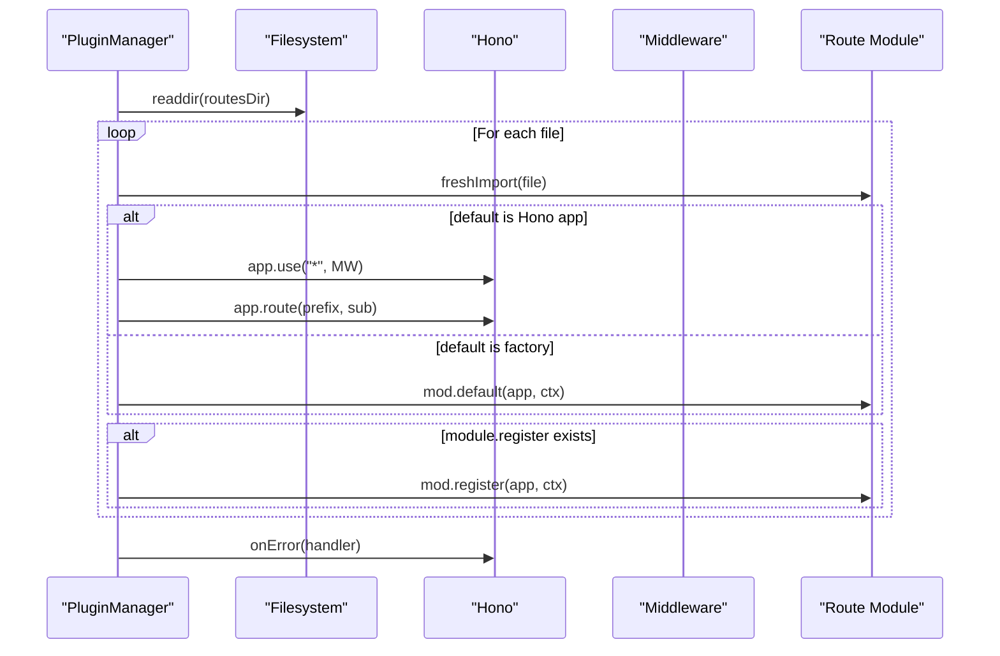
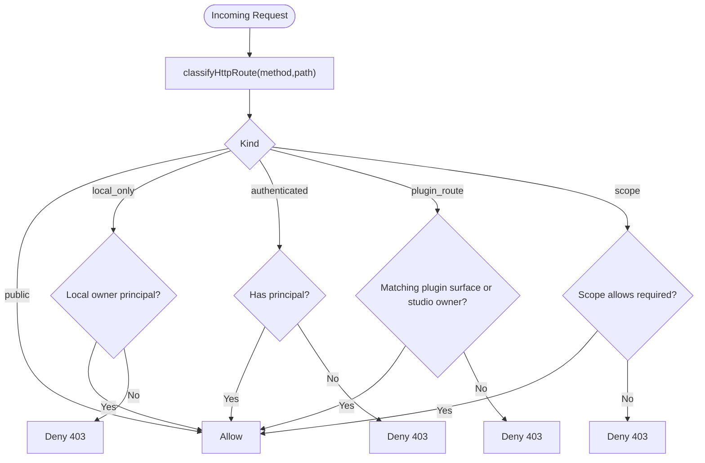
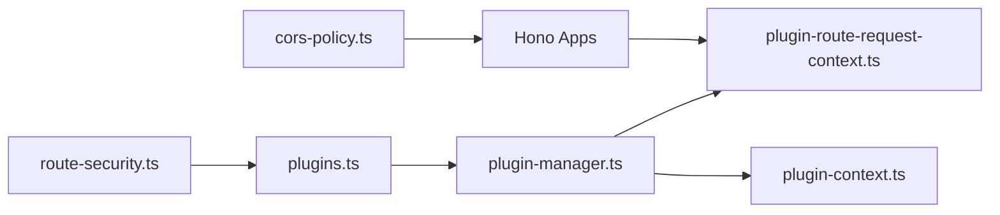

# Route Plugin Development

<cite>
**Referenced Files in This Document**
- [plugin-manager.ts](file://core/plugin-manager.ts)
- [plugin-context.ts](file://core/plugin-context.ts)
- [plugin-route-request-context.ts](file://core/plugin-route-request-context.ts)
- [route-security.ts](file://server/http/route-security.ts)
- [plugins.ts](file://server/routes/plugins.ts)
- [cors-policy.ts](file://server/http/cors-policy.ts)
- [hono-helpers.ts](file://server/hono-helpers.ts)
- [status.ts](file://plugins/community/hello/routes/status.ts)
- [manifest.json](file://plugins/community/hello/manifest.json)
- [media.ts](file://plugins/image-gen/routes/media.ts)
</cite>

## Table of Contents
1. [Introduction](#introduction)
2. [Project Structure](#project-structure)
3. [Core Components](#core-components)
4. [Architecture Overview](#architecture-overview)
5. [Detailed Component Analysis](#detailed-component-analysis)
6. [Dependency Analysis](#dependency-analysis)
7. [Performance Considerations](#performance-considerations)
8. [Troubleshooting Guide](#troubleshooting-guide)
9. [Conclusion](#conclusion)
10. [Appendices](#appendices)

## Introduction
This document explains how to develop route plugins for the server, covering HTTP endpoint creation, request/response handling, middleware integration, route registration, path matching, parameter extraction, authentication and authorization patterns, CORS configuration, security considerations for full-access plugins, practical examples (RESTful APIs, WebSocket handlers, file uploads), testing strategies, error handling, logging, and integration with the existing server architecture.

## Project Structure
Route plugin development centers around:
- Plugin runtime context and bus capabilities
- Request-level execution context with capability enforcement
- Server-side route loading and proxying
- Security classification and authorization policies
- CORS policy helpers
- Example routes demonstrating REST endpoints and streaming media

**Diagram sources**
- [plugin-manager.ts:951-1035](file://core/plugin-manager.ts#L951-L1035)
- [plugin-context.ts:9-99](file://core/plugin-context.ts#L9-L99)
- [plugin-route-request-context.ts:82-188](file://core/plugin-route-request-context.ts#L82-L188)
- [route-security.ts:82-211](file://server/http/route-security.ts#L82-L211)
- [plugins.ts:1344-1346](file://server/routes/plugins.ts#L1344-L1346)
- [cors-policy.ts:4-14](file://server/http/cors-policy.ts#L4-L14)

**Section sources**
- [plugin-manager.ts:951-1035](file://core/plugin-manager.ts#L951-L1035)
- [plugin-context.ts:9-99](file://core/plugin-context.ts#L9-L99)
- [plugin-route-request-context.ts:82-188](file://core/plugin-route-request-context.ts#L82-L188)
- [route-security.ts:82-211](file://server/http/route-security.ts#L82-L211)
- [plugins.ts:1344-1346](file://server/routes/plugins.ts#L1344-L1346)
- [cors-policy.ts:4-14](file://server/http/cors-policy.ts#L4-L14)

## Core Components
- Plugin Context: Provides plugin-scoped services like config, log, bus, and session file staging. It also enforces restricted bus permissions when access is not full-access.
- Request Context: Per-request wrapper that injects principal, agentId, and a capability-checked bus into each plugin route handler.
- Route Loader: Discovers and mounts plugin routes under a Hono app, injecting middleware and error isolation.
- Security Classifier: Classifies HTTP routes by scope and determines whether requests are public, local-only, authenticated, or require specific scopes. Also handles plugin route proxying.
- CORS Helper: Determines allowed origins for cross-origin requests.

Key responsibilities:
- Create and expose plugin context during plugin load
- Build per-request context with capability checks
- Load and mount plugin routes
- Enforce security policies at the server boundary
- Provide safe utilities for JSON parsing and CORS decisions

**Section sources**
- [plugin-context.ts:9-99](file://core/plugin-context.ts#L9-L99)
- [plugin-route-request-context.ts:82-188](file://core/plugin-route-request-context.ts#L82-L188)
- [plugin-manager.ts:951-1035](file://core/plugin-manager.ts#L951-L1035)
- [route-security.ts:82-211](file://server/http/route-security.ts#L82-L211)
- [cors-policy.ts:4-14](file://server/http/cors-policy.ts#L4-L14)

## Architecture Overview
The plugin route lifecycle:
1. Server loads plugins and their routes via PluginManager.
2. Each plugin’s routes directory is scanned; files export either a default Hono app or a factory function.
3. A global middleware injects plugin context and request-level context (principal + capability-checked bus).
4. Incoming requests to /api/plugins/:pluginId/* are classified and authorized before being proxied to the plugin’s Hono app.
5. Handlers can use the injected request context to safely call system capabilities based on manifest declarations and user grants.

**Diagram sources**
- [route-security.ts:82-211](file://server/http/route-security.ts#L82-L211)
- [plugin-manager.ts:951-1035](file://core/plugin-manager.ts#L951-L1035)
- [plugins.ts:1344-1346](file://server/routes/plugins.ts#L1344-L1346)
- [plugin-route-request-context.ts:82-188](file://core/plugin-route-request-context.ts#L82-L188)

## Detailed Component Analysis

### Plugin Context and Bus Restrictions
- The plugin context provides:
  - Config store with schema support
  - Logging sink integrated with server logs
  - Session file staging and media item formatting
  - Bus access that may be restricted based on granted permissions
- Restricted bus behavior:
  - Blocks usage-related events and subscriptions unless permission is granted
  - Wraps request/emit/subscribe to enforce permission checks

**Diagram sources**
- [plugin-context.ts:9-99](file://core/plugin-context.ts#L9-L99)
- [plugin-context.ts:102-140](file://core/plugin-context.ts#L102-L140)

**Section sources**
- [plugin-context.ts:9-99](file://core/plugin-context.ts#L9-L99)
- [plugin-context.ts:102-140](file://core/plugin-context.ts#L102-L140)

### Request-Level Execution Context and Capability Enforcement
- For each incoming request, the server constructs a request context containing:
  - Principal identity (source, pluginId, credential info)
  - AgentId (from env header or request header)
  - Capability grant metadata (access level, declared permissions, legacy declaration flag)
  - A wrapped bus that asserts capability grants for system-sensitive operations
- Capability assertion logic:
  - If a capability requires a permission and the plugin lacks full-access, it is denied
  - If a capability is not declared in manifest (capabilities/sensitiveCapabilities), it is denied
  - Legacy mode applies only when both lists are absent; explicit empty arrays mean strict deny

**Diagram sources**
- [plugin-route-request-context.ts:82-188](file://core/plugin-route-request-context.ts#L82-L188)
- [plugin-route-request-context.ts:190-206](file://core/plugin-route-request-context.ts#L190-L206)

**Section sources**
- [plugin-route-request-context.ts:82-188](file://core/plugin-route-request-context.ts#L82-L188)
- [plugin-route-request-context.ts:190-206](file://core/plugin-route-request-context.ts#L190-L206)

### Route Registration and Loading
- Plugin routes live under routes/ and are discovered at plugin load time.
- Supported module shapes:
  - Default export is a Hono app instance (sub-app) — mounted with prefix derived from filename
  - Default export is a factory function(app, ctx) — registers handlers directly
  - Module exports a register(app, ctx) function — alternative registration style
- Middleware injection:
  - Global middleware sets pluginCtx, agentId, and pluginRequestContext on each request
- Error isolation:
  - Hono onError converts capability errors to 403 responses with structured details
  - Other errors return 500 with generic message

**Diagram sources**
- [plugin-manager.ts:951-1035](file://core/plugin-manager.ts#L951-L1035)

**Section sources**
- [plugin-manager.ts:951-1035](file://core/plugin-manager.ts#L951-L1035)

### Path Matching and Parameter Extraction
- Two approaches exist in the codebase:
  - Declarative route modules exporting method/path and a handler receiving params/query/headers
  - Hono-based apps using dynamic segments and c.req.param()
- For declarative modules:
  - The server matches method and path, extracts query and headers, and invokes the handler
- For Hono apps:
  - Use c.req.param("name") to extract path parameters
  - Use c.req.query("name") to extract query parameters
  - Use c.req.header("X-Hana-Agent-Id") to read optional agent context

Practical example references:
- Declarative route: [status.ts:1-17](file://plugins/community/hello/routes/status.ts#L1-L17)
- Hono dynamic segment usage: [media.ts:65-69](file://plugins/image-gen/routes/media.ts#L65-L69)

**Section sources**
- [status.ts:1-17](file://plugins/community/hello/routes/status.ts#L1-L17)
- [media.ts:65-69](file://plugins/image-gen/routes/media.ts#L65-L69)

### Authentication and Authorization Patterns
- Route classification:
  - Public, Local-only, Authenticated, Scoped, Studio-owner, Plugin-route
- Plugin route proxy:
  - Only requests from the same plugin surface principal or studio owner are allowed
  - Host-owned plugin IDs are excluded from proxying
- Scope checks:
  - Required scopes are validated against principal.scopes with namespace support

**Diagram sources**
- [route-security.ts:82-211](file://server/http/route-security.ts#L82-L211)

**Section sources**
- [route-security.ts:82-211](file://server/http/route-security.ts#L82-L211)

### CORS Configuration
- Origin allowlist helper supports:
  - Explicit configured origin
  - null origin
  - Electron file:// origins
  - Loopback localhost/127.0.0.1 with optional port

Usage guidance:
- Apply CORS middleware in your Hono app using isCorsOriginAllowed to decide Access-Control-Allow-Origin.

**Section sources**
- [cors-policy.ts:4-14](file://server/http/cors-policy.ts#L4-L14)

### Security Considerations for Full-Access Plugins
- Full-access grants bypass some restrictions but still require:
  - Manifest-declared capabilities for system-sensitive bus operations
  - Proper principal validation and scope checks at the server boundary
- Best practices:
  - Always declare capabilities explicitly; avoid relying on legacy behavior
  - Validate all inputs and sanitize paths/filenames
  - Stream large files instead of reading into memory
  - Return structured error responses with minimal detail

**Section sources**
- [plugin-route-request-context.ts:82-188](file://core/plugin-route-request-context.ts#L82-L188)
- [plugin-manager.ts:951-1035](file://core/plugin-manager.ts#L951-L1035)

### Practical Examples

#### RESTful API Endpoint
- Declarative route pattern:
  - Export method, path, description, and an async handler
  - Handler receives body, query, headers, and params
- Reference: [status.ts:1-17](file://plugins/community/hello/routes/status.ts#L1-L17)

#### Streaming Media Endpoint (Range Requests)
- Hono app with dynamic segments and streaming:
  - Supports partial content (206) with Content-Range
  - Streams entire file when no range requested
- Reference: [media.ts:30-69](file://plugins/image-gen/routes/media.ts#L30-L69)

#### File Upload Handling
- Use multipart/form-data with Hono and stream to disk
- Validate size limits and MIME types
- Store within allowed roots and return stable URLs
- Reference utility: [safeJson:6-13](file://server/hono-helpers.ts#L6-L13) for robust body parsing

[No sources needed since this subsection provides general guidance]

#### WebSocket Handlers
- The server includes WebSocket protocol and scope management; integrate by:
  - Using the existing WS server entry points
  - Applying security classification and principal checks
  - Managing sessions and resource access through the engine
- References:
  - [ws.ts](file://server/ws.ts)
  - [ws-scope.ts](file://server/ws-scope.ts)
  - [ws-protocol.ts](file://server/ws-protocol.ts)

**Section sources**
- [status.ts:1-17](file://plugins/community/hello/routes/status.ts#L1-L17)
- [media.ts:30-69](file://plugins/image-gen/routes/media.ts#L30-L69)
- [hono-helpers.ts:6-13](file://server/hono-helpers.ts#L6-L13)
- [ws.ts](file://server/ws.ts)
- [ws-scope.ts](file://server/ws-scope.ts)
- [ws-protocol.ts](file://server/ws-protocol.ts)

### Integration with Existing Server Architecture
- Plugin routes are mounted under /api/plugins/:pluginId/*
- The server proxies requests after security classification
- Plugin assets are served securely with session verification and path validation
- References:
  - [plugins.ts:1344-1346](file://server/routes/plugins.ts#L1344-L1346)
  - [plugin-assets.ts:1-207](file://server/http/plugin-assets.ts#L1-L207)

**Section sources**
- [plugins.ts:1344-1346](file://server/routes/plugins.ts#L1344-L1346)
- [plugin-assets.ts:1-207](file://server/http/plugin-assets.ts#L1-L207)

## Dependency Analysis
High-level dependencies among core components:

**Diagram sources**
- [plugin-manager.ts:951-1035](file://core/plugin-manager.ts#L951-L1035)
- [plugin-route-request-context.ts:82-188](file://core/plugin-route-request-context.ts#L82-L188)
- [plugin-context.ts:9-99](file://core/plugin-context.ts#L9-L99)
- [route-security.ts:82-211](file://server/http/route-security.ts#L82-L211)
- [plugins.ts:1344-1346](file://server/routes/plugins.ts#L1344-L1346)
- [cors-policy.ts:4-14](file://server/http/cors-policy.ts#L4-L14)

**Section sources**
- [plugin-manager.ts:951-1035](file://core/plugin-manager.ts#L951-L1035)
- [plugin-route-request-context.ts:82-188](file://core/plugin-route-request-context.ts#L82-L188)
- [plugin-context.ts:9-99](file://core/plugin-context.ts#L9-L99)
- [route-security.ts:82-211](file://server/http/route-security.ts#L82-L211)
- [plugins.ts:1344-1346](file://server/routes/plugins.ts#L1344-L1346)
- [cors-policy.ts:4-14](file://server/http/cors-policy.ts#L4-L14)

## Performance Considerations
- Stream large payloads and files rather than buffering in memory
- Use Range requests for large media to reduce bandwidth and latency
- Keep route handlers small and offload heavy work to background tasks
- Avoid synchronous I/O in hot paths; prefer asynchronous streams
- Cache static assets appropriately with cache-control headers

[No sources needed since this section provides general guidance]

## Troubleshooting Guide
Common issues and resolutions:
- Capability denied:
  - Ensure the plugin declares required capabilities in manifest
  - Enable full-access if appropriate and necessary
- Route not found:
  - Verify method and path match exactly
  - Confirm plugin is loaded and routes directory exists
- CORS failures:
  - Check origin against isCorsOriginAllowed rules
  - Configure allowed origin explicitly if needed
- Asset serving errors:
  - Validate asset path and ensure plugin asset session cookie is present for host requests

Operational references:
- Capability error mapping and 403 responses: [plugin-manager.ts:959-974](file://core/plugin-manager.ts#L959-L974)
- Security classification and denial reasons: [route-security.ts:29-80](file://server/http/route-security.ts#L29-L80)
- CORS helper: [cors-policy.ts:4-14](file://server/http/cors-policy.ts#L4-L14)
- Safe JSON parsing fallback: [hono-helpers.ts:6-13](file://server/hono-helpers.ts#L6-L13)

**Section sources**
- [plugin-manager.ts:959-974](file://core/plugin-manager.ts#L959-L974)
- [route-security.ts:29-80](file://server/http/route-security.ts#L29-L80)
- [cors-policy.ts:4-14](file://server/http/cors-policy.ts#L4-L14)
- [hono-helpers.ts:6-13](file://server/hono-helpers.ts#L6-L13)

## Conclusion
By following the patterns outlined here—using the plugin context, leveraging request-level capability enforcement, registering routes correctly, and adhering to security and CORS policies—you can build robust, secure, and performant plugin routes. Prefer streaming for large data, validate inputs rigorously, and keep error responses informative yet safe.

[No sources needed since this section summarizes without analyzing specific files]

## Appendices

### Quick Start Checklist
- Define manifest contributions for routes
- Implement route modules (declarative or Hono app)
- Use request context for capability-safe bus calls
- Test with various principals and scopes
- Add CORS handling where needed
- Stream large files and handle range requests
- Log with structured entries and redact sensitive data

[No sources needed since this section provides general guidance]