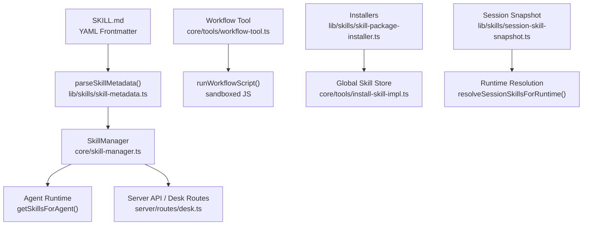
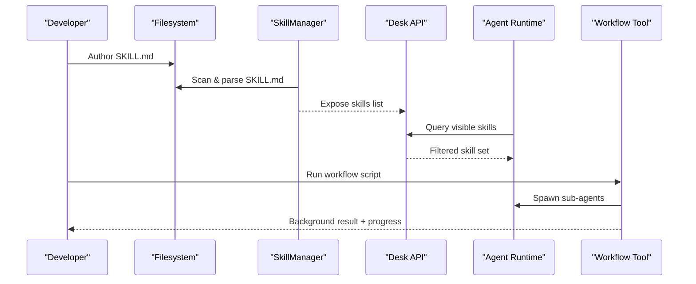
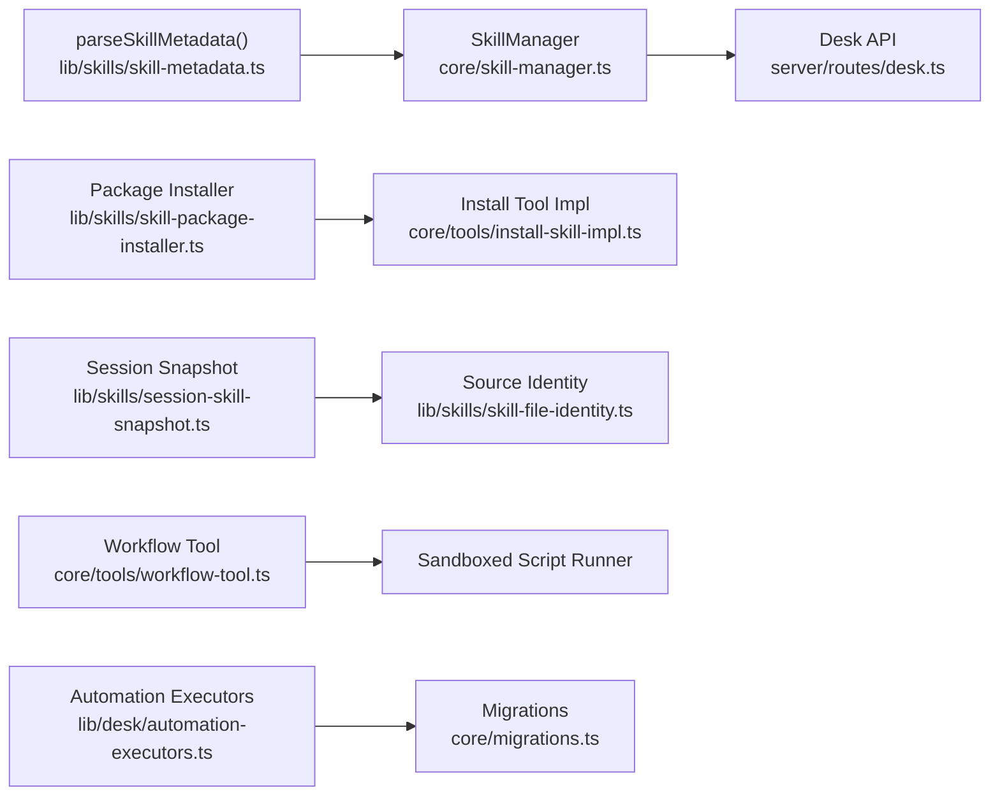

# Skill Plugin Development

<cite>
**Referenced Files in This Document**
- [skill-manager.ts](file://core/skill-manager.ts)
- [skills.ts](file://core/skills.ts)
- [skill-metadata.ts](file://lib/skills/skill-metadata.ts)
- [skill-file-identity.ts](file://lib/skills/skill-file-identity.ts)
- [session-skill-snapshot.ts](file://lib/skills/session-skill-snapshot.ts)
- [skill-package-installer.ts](file://lib/skills/skill-package-installer.ts)
- [install-skill-impl.ts](file://core/tools/install-skill-impl.ts)
- [workflow-tool.ts](file://core/tools/workflow-tool.ts)
- [desk.ts](file://server/routes/desk.ts)
- [automation-executors.ts](file://lib/desk/automation-executors.ts)
- [migrations.ts](file://core/migrations.ts)
- [audit-logger.ts](file://core/sandbox/audit-logger.ts)
- [SkillBundleTree.tsx](file://desktop/src/react/settings/tabs/skills/SkillBundleTree.tsx)
- [PluginMarketplaceTab.tsx](file://desktop/src/react/settings/tabs/PluginMarketplaceTab.tsx)
</cite>

## Table of Contents
1. Introduction
2. Project Structure
3. Core Components
4. Architecture Overview
5. Detailed Component Analysis
6. Dependency Analysis
7. Performance Considerations
8. Troubleshooting Guide
9. Conclusion
10. Appendices

## Introduction
This document explains how to develop skill plugins for the system, covering:
- Skill definition structure and metadata parsing
- Template variables and execution context
- Composition patterns, conditional logic, and workflow orchestration
- Discovery, versioning, and dependency management
- Reusable automation scripts, data transformation pipelines, and multi-step workflows
- Testing frameworks, debugging techniques, and performance monitoring
- Distribution through the marketplace and installation procedures

The goal is to enable developers to author, install, compose, test, and distribute skills that integrate with agents and workflows.

## Project Structure
Skills are primarily defined as Markdown documents (SKILL.md) with YAML frontmatter. The runtime discovers, loads, filters, and exposes them to agents and tools. Workflows provide a scripting-based orchestration layer that can call sub-agents and coordinate multi-step processes.

**Diagram sources**
- [skill-metadata.ts:1-66](file://lib/skills/skill-metadata.ts#L1-L66)
- [skill-manager.ts:1-386](file://core/skill-manager.ts#L1-L386)
- [desk.ts:1101-1129](file://server/routes/desk.ts#L1101-L1129)
- [workflow-tool.ts:1-321](file://core/tools/workflow-tool.ts#L1-L321)
- [skill-package-installer.ts:1-409](file://lib/skills/skill-package-installer.ts#L1-L409)
- [install-skill-impl.ts:254-434](file://core/tools/install-skill-impl.ts#L254-L434)
- [session-skill-snapshot.ts:1-154](file://lib/skills/session-skill-snapshot.ts#L1-L154)

**Section sources**
- [skill-manager.ts:1-386](file://core/skill-manager.ts#L1-L386)
- [desk.ts:1101-1129](file://server/routes/desk.ts#L1101-L1129)
- [workflow-tool.ts:1-321](file://core/tools/workflow-tool.ts#L1-L321)
- [skill-package-installer.ts:1-409](file://lib/skills/skill-package-installer.ts#L1-L409)
- [install-skill-impl.ts:254-434](file://core/tools/install-skill-impl.ts#L254-L434)
- [session-skill-snapshot.ts:1-154](file://lib/skills/session-skill-snapshot.ts#L1-L154)

## Core Components
- SKILL.md parser: Extracts name, description, disable-model-invocation, default-enabled from YAML frontmatter.
- Skill discovery and filtering: Aggregates built-in, user, plugin, workspace, and external skills; applies visibility rules per agent.
- Session snapshots: Freezes enabled skills as pointers for reproducibility across sessions.
- Installation pipeline: Validates packages, sanitizes names, copies content, rewrites metadata, and persists identities.
- Workflow tool: Orchestrates deterministic JS scripts with concurrency limits, budgets, journaling, and background execution.
- Automation executors: Normalizes executor configuration and execution context for scheduled or triggered jobs.

Key responsibilities:
- Metadata normalization and validation
- Source identity tracking and ownership
- Watcher-driven hot reload with safe ignore rules
- Safe package installation and symlink protection
- Deterministic workflow execution with replay and budget control

**Section sources**
- [skill-metadata.ts:1-66](file://lib/skills/skill-metadata.ts#L1-L66)
- [skill-manager.ts:1-386](file://core/skill-manager.ts#L1-L386)
- [session-skill-snapshot.ts:1-154](file://lib/skills/session-skill-snapshot.ts#L1-L154)
- [skill-package-installer.ts:1-409](file://lib/skills/skill-package-installer.ts#L1-L409)
- [install-skill-impl.ts:254-434](file://core/tools/install-skill-impl.ts#L254-L434)
- [workflow-tool.ts:1-321](file://core/tools/workflow-tool.ts#L1-L321)
- [automation-executors.ts:1-10](file://lib/desk/automation-executors.ts#L1-L10)

## Architecture Overview
The skill system integrates multiple layers:
- Definition: SKILL.md with YAML frontmatter defines capabilities and defaults.
- Discovery: File watchers scan global and external directories; server routes expose discovered skills.
- Filtering: Agent-specific visibility rules determine which skills are available at runtime.
- Orchestration: Workflow tool executes deterministic scripts to coordinate sub-agents and tasks.
- Persistence: Session snapshots capture skill pointers for reproducibility.
- Installation: Package installers validate and persist skills into the global store.

**Diagram sources**
- [skill-manager.ts:1-386](file://core/skill-manager.ts#L1-L386)
- [desk.ts:1101-1129](file://server/routes/desk.ts#L1101-L1129)
- [workflow-tool.ts:1-321](file://core/tools/workflow-tool.ts#L1-L321)

## Detailed Component Analysis

### Skill Definition Structure and Metadata
- SKILL.md must include YAML frontmatter with fields such as name, description, disable-model-invocation, and default-enabled.
- The parser normalizes values, enforces length limits on descriptions, and ensures safe defaults.
- Additional flags influence model invocation and default enablement behavior.

Practical guidance:
- Keep name short and alphanumeric with hyphens/underscores.
- Use clear, concise descriptions.
- Set default-enabled only when appropriate for broad reuse.

**Section sources**
- [skill-metadata.ts:1-66](file://lib/skills/skill-metadata.ts#L1-L66)

### Skill Discovery and Visibility
- SkillManager aggregates built-in, user, plugin, workspace, and external skills.
- It applies per-agent visibility filters and computes default enabled sets for new agents.
- File watchers monitor changes and auto-reload with debouncing and safe ignore rules to avoid heavy directories.

Operational notes:
- External paths can be configured and watched independently.
- Workspace skills are treated specially for runtime enablement.

**Section sources**
- [skill-manager.ts:1-386](file://core/skill-manager.ts#L1-L386)
- [desk.ts:1101-1129](file://server/routes/desk.ts#L1101-L1129)

### Execution Context and Template Variables
- Automation jobs carry an executionContext including kind, cwd, workspaceFolders, sourceSessionPath, and createdByAgentId.
- Executors normalize job definitions to ensure consistent runtime context.
- Migration utilities repair legacy contexts and enforce owner attribution.

Usage tips:
- Provide explicit cwd and workspaceFolders for predictable file access.
- Track createdByAgentId for auditability.

**Section sources**
- [automation-executors.ts:1-10](file://lib/desk/automation-executors.ts#L1-L10)
- [migrations.ts:1429-1503](file://core/migrations.ts#L1429-L1503)

### Workflow Orchestration and Conditional Logic
- The workflow tool runs deterministic JavaScript scripts with:
  - Concurrency limits and total backstops
  - Budget accounting via UsageLedger integration
  - Journaling for resume/replay
  - Background execution with deferred results and event streaming
- Scripts can spawn sub-agents, run parallel phases, and synthesize outputs.

Best practices:
- Use meta.name for summaries and task identification.
- Leverage args for passing budgets and parameters.
- Handle errors gracefully; use journal replay for robustness.

**Section sources**
- [workflow-tool.ts:1-321](file://core/tools/workflow-tool.ts#L1-L321)

### Session Snapshots and Reproducibility
- Sessions snapshot enabled skills as pointers to their source identities.
- On restore, unavailable sources produce diagnostics rather than stale copies.
- Runtime resolution validates pointer integrity before enabling skills.

Benefits:
- Deterministic session state across time.
- Clear diagnostics when sources change or disappear.

**Section sources**
- [session-skill-snapshot.ts:1-154](file://lib/skills/session-skill-snapshot.ts#L1-L154)
- [skill-file-identity.ts:1-100](file://lib/skills/skill-file-identity.ts#L1-L100)

### Installation Pipeline and Versioning
- Installers support local directories, zip/.skill archives, and GitHub repositories.
- Validation includes symlink checks, absolute path enforcement, and target containment.
- Name sanitization and frontmatter rewriting ensure consistency.
- Installed skills are persisted with source identities for traceability.

Security considerations:
- Reject symlinks to prevent escape paths.
- Enforce install targets within root directories.

**Section sources**
- [skill-package-installer.ts:1-409](file://lib/skills/skill-package-installer.ts#L1-L409)
- [install-skill-impl.ts:254-434](file://core/tools/install-skill-impl.ts#L254-L434)

### Marketplace and UI Integration
- Desktop settings expose skill bundles and marketplace browsing.
- Users can manage loose skills, toggle enablement, and view publisher/trust info.
- Tests mock API endpoints for skills and bundles to validate UI flows.

Operational insights:
- Bundle management groups related skills for distribution.
- Trust levels inform installation policies.

**Section sources**
- [SkillBundleTree.tsx:301-342](file://desktop/src/react/settings/tabs/skills/SkillBundleTree.tsx#L301-L342)
- [PluginMarketplaceTab.tsx:238-260](file://desktop/src/react/settings/tabs/PluginMarketplaceTab.tsx#L238-L260)

### Legacy Skill Store Model
- An older SkillStore model defines manifest structures and basic registration APIs.
- It provides examples of built-in skills and tool contribution patterns.
- Useful for understanding historical interfaces and migration considerations.

Note:
- Prefer current SKILL.md-based approach for new development.

**Section sources**
- [skills.ts:1-374](file://core/skills.ts#L1-L374)

## Dependency Analysis
The following diagram maps key dependencies among core components:

**Diagram sources**
- [skill-metadata.ts:1-66](file://lib/skills/skill-metadata.ts#L1-L66)
- [skill-manager.ts:1-386](file://core/skill-manager.ts#L1-L386)
- [desk.ts:1101-1129](file://server/routes/desk.ts#L1101-L1129)
- [skill-package-installer.ts:1-409](file://lib/skills/skill-package-installer.ts#L1-L409)
- [install-skill-impl.ts:254-434](file://core/tools/install-skill-impl.ts#L254-L434)
- [session-skill-snapshot.ts:1-154](file://lib/skills/session-skill-snapshot.ts#L1-L154)
- [skill-file-identity.ts:1-100](file://lib/skills/skill-file-identity.ts#L1-L100)
- [workflow-tool.ts:1-321](file://core/tools/workflow-tool.ts#L1-L321)
- [automation-executors.ts:1-10](file://lib/desk/automation-executors.ts#L1-L10)
- [migrations.ts:1429-1503](file://core/migrations.ts#L1429-L1503)

**Section sources**
- [skill-manager.ts:1-386](file://core/skill-manager.ts#L1-L386)
- [skill-package-installer.ts:1-409](file://lib/skills/skill-package-installer.ts#L1-L409)
- [workflow-tool.ts:1-321](file://core/tools/workflow-tool.ts#L1-L321)

## Performance Considerations
- File watcher depth and ignore rules prevent excessive resource usage by skipping heavy directories like node_modules.
- Debounced reload reduces churn during rapid edits.
- Workflow concurrency limits and total backstops protect against runaway fan-out.
- Budget accounting via UsageLedger prevents unbounded token consumption.
- Journal replay minimizes redundant work during resumption.

Recommendations:
- Keep skill directories shallow and avoid bundling large dependencies.
- Use workflow args to cap budgets where possible.
- Monitor activity hub entries and thread stores for long-running tasks.

[No sources needed since this section provides general guidance]

## Troubleshooting Guide
Common issues and remedies:
- Missing SKILL.md or invalid frontmatter: Ensure the package contains a valid SKILL.md with required fields.
- Symlink rejection: Remove symbolic links from packages before installation.
- Unavailable skill after restore: Check diagnostics indicating missing source paths; verify baseDir and filePath integrity.
- Workflow timeouts or failures: Inspect journal files and activity hub status; adjust deadlines and budgets.
- Permission or path errors: Confirm absolute paths and install targets remain within allowed roots.

Monitoring and diagnostics:
- Use sandbox audit logger summaries to track operation outcomes and risk distributions.
- Review workflow journal entries for step-level details and replay hits.
- Inspect desktop diagnostics panels for plugin activation states and capability counts.

**Section sources**
- [audit-logger.ts:101-137](file://core/sandbox/audit-logger.ts#L101-L137)
- [session-skill-snapshot.ts:1-154](file://lib/skills/session-skill-snapshot.ts#L1-L154)
- [workflow-tool.ts:1-321](file://core/tools/workflow-tool.ts#L1-L321)

## Conclusion
Skill plugin development centers on well-structured SKILL.md definitions, robust discovery and filtering, secure installation, and powerful orchestration via workflows. By leveraging session snapshots, budgets, and journals, developers can build reliable, reproducible, and scalable automation. The marketplace and UI tools streamline distribution and management, while diagnostics and monitoring aid troubleshooting and performance tuning.

[No sources needed since this section summarizes without analyzing specific files]

## Appendices

### Example Patterns and Recipes
- Reusable automation scripts:
  - Define a workflow script with meta.name and structured steps using agent(), parallel(), phase(), log().
  - Pass args.budgetTokens to constrain token usage.
  - Use resumeFromRunId to continue from previous runs.

- Data transformation pipelines:
  - Chain sequential nodes to transform inputs, validate outputs, and aggregate results.
  - Employ conditional branching based on intermediate results.

- Multi-step workflows:
  - Fan out independent tasks in parallel, then merge outputs.
  - Attach threads for long-running operations and track progress via events.

[No sources needed since this section provides general guidance]