# Advanced Tool Features

<cite>
**Referenced Files in This Document**
- [core/tool-registry.ts](file://core/tool-registry.ts)
- [core/plugin-manager.ts](file://core/plugin-manager.ts)
- [lib/tools/tool-session.ts](file://lib/tools/tool-session.ts)
- [core/sandbox/policy.ts](file://core/sandbox/policy.ts)
- [lib/sandbox/index.ts](file://lib/sandbox/index.ts)
- [core/engine.ts](file://core/engine.ts)
- [core/tools/web-fetch.ts](file://core/tools/web-fetch.ts)
- [core/tools/web-search.ts](file://core/tools/web-search.ts)
- [core/tools/file-tool.ts](file://core/tools/file-tool.ts)
- [server/routes/media.ts](file://server/routes/media.ts)
- [server/http/file-content.ts](file://server/http/file-content.ts)
- [hub/event-bus.ts](file://hub/event-bus.ts)
- [core/plugin-route-request-context.ts](file://core/plugin-route-request-context.ts)
- [tests/core/tool-registry.test.ts](file://tests/core/tool-registry.test.ts)
</cite>

## Table of Contents
1. [Introduction](#introduction)
2. [Project Structure](#project-structure)
3. [Core Components](#core-components)
4. [Architecture Overview](#architecture-overview)
5. [Detailed Component Analysis](#detailed-component-analysis)
6. [Dependency Analysis](#dependency-analysis)
7. [Performance Considerations](#performance-considerations)
8. [Troubleshooting Guide](#troubleshooting-guide)
9. [Conclusion](#conclusion)

## Introduction
This document explains advanced tool capabilities in the system, focusing on:
- Dynamic tool registration at runtime via plugin manager APIs
- Tool invocation styles (pi_tool vs sdk_tool), streaming responses, and progress updates
- Session context access and sandboxed file operations
- Cross-plugin communication patterns
- Examples for external service integration, large dataset handling, and interactive experiences
- Performance optimization, memory management, and resource cleanup patterns

## Project Structure
The tooling subsystem spans several layers:
- Tool registry and spec definitions
- Plugin manager dynamic registration and execution wrappers
- Sandbox policy and session-aware context helpers
- Example tools for web search/fetch and file operations
- Streaming utilities for HTTP responses
- Event bus for cross-plugin communication

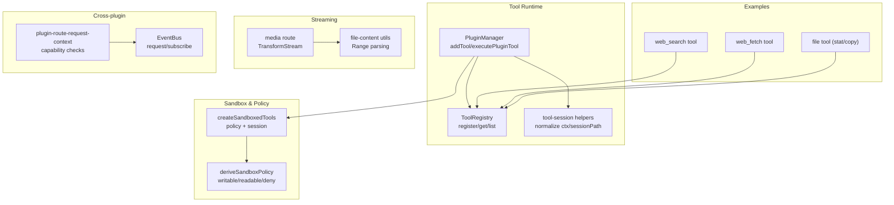

**Diagram sources**
- [core/tool-registry.ts:22-70](file://core/tool-registry.ts#L22-L70)
- [core/plugin-manager.ts:793-831](file://core/plugin-manager.ts#L793-L831)
- [lib/tools/tool-session.ts:33-53](file://lib/tools/tool-session.ts#L33-L53)
- [core/sandbox/policy.ts:89-138](file://core/sandbox/policy.ts#L89-L138)
- [lib/sandbox/index.ts:34-57](file://lib/sandbox/index.ts#L34-L57)
- [core/tools/web-search.ts:189-221](file://core/tools/web-search.ts#L189-L221)
- [core/tools/web-fetch.ts:10-77](file://core/tools/web-fetch.ts#L10-L77)
- [core/tools/file-tool.ts:31-90](file://core/tools/file-tool.ts#L31-L90)
- [server/routes/media.ts:295-341](file://server/routes/media.ts#L295-L341)
- [server/http/file-content.ts:77-115](file://server/http/file-content.ts#L77-L115)
- [hub/event-bus.ts:31-43](file://hub/event-bus.ts#L31-L43)
- [core/plugin-route-request-context.ts:126-168](file://core/plugin-route-request-context.ts#L126-L168)

**Section sources**
- [core/tool-registry.ts:1-89](file://core/tool-registry.ts#L1-L89)
- [core/plugin-manager.ts:780-979](file://core/plugin-manager.ts#L780-L979)
- [lib/tools/tool-session.ts:1-54](file://lib/tools/tool-session.ts#L1-L54)
- [core/sandbox/policy.ts:89-138](file://core/sandbox/policy.ts#L89-L138)
- [lib/sandbox/index.ts:34-57](file://lib/sandbox/index.ts#L34-L57)
- [core/tools/web-search.ts:189-221](file://core/tools/web-search.ts#L189-L221)
- [core/tools/web-fetch.ts:10-77](file://core/tools/web-fetch.ts#L10-L77)
- [core/tools/file-tool.ts:31-90](file://core/tools/file-tool.ts#L31-L90)
- [server/routes/media.ts:295-341](file://server/routes/media.ts#L295-L341)
- [server/http/file-content.ts:77-115](file://server/http/file-content.ts#L77-L115)
- [hub/event-bus.ts:31-43](file://hub/event-bus.ts#L31-L43)
- [core/plugin-route-request-context.ts:126-168](file://core/plugin-route-request-context.ts#L126-L168)

## Core Components
- ToolRegistry: Central map-based registry for tool specs and handlers with list/get/remove/merge operations.
- PluginManager.addTool: Dynamically registers a tool at runtime, wraps execute to normalize context and support multiple invocation styles.
- Tool session helpers: Normalize Pi SDK execute arguments and extract session path/cwd from runtime context.
- Sandbox policy: Derives writable/readable/deny paths and protection rules per session.
- Sandboxed tools factory: Creates session-scoped tool sets with policy enforcement and optional network controls.
- Example tools: web_search, web_fetch, file (stat/copy).
- Streaming utilities: TransformStream-based media serving and range request parsing.
- Cross-plugin communication: EventBus with subscribe/request and capability checks in plugin routes.

**Section sources**
- [core/tool-registry.ts:22-70](file://core/tool-registry.ts#L22-L70)
- [core/plugin-manager.ts:793-831](file://core/plugin-manager.ts#L793-L831)
- [lib/tools/tool-session.ts:33-53](file://lib/tools/tool-session.ts#L33-L53)
- [core/sandbox/policy.ts:89-138](file://core/sandbox/policy.ts#L89-L138)
- [lib/sandbox/index.ts:34-57](file://lib/sandbox/index.ts#L34-L57)
- [core/tools/web-search.ts:189-221](file://core/tools/web-search.ts#L189-L221)
- [core/tools/web-fetch.ts:10-77](file://core/tools/web-fetch.ts#L10-L77)
- [core/tools/file-tool.ts:31-90](file://core/tools/file-tool.ts#L31-L90)
- [server/routes/media.ts:295-341](file://server/routes/media.ts#L295-L341)
- [server/http/file-content.ts:77-115](file://server/http/file-content.ts#L77-L115)
- [hub/event-bus.ts:31-43](file://hub/event-bus.ts#L31-L43)
- [core/plugin-route-request-context.ts:126-168](file://core/plugin-route-request-context.ts#L126-L168)

## Architecture Overview
Dynamic tool registration and execution flow:
- Plugins call addTool with a tool definition (name, description, parameters, execute).
- The manager detects invocation style (pi_tool vs sdk_tool) and wraps execute to normalize context and merge sessionPath.
- Tools are executed through the wrapper, which may pass onUpdate callbacks for streaming and progress.
- File operations are enforced by sandbox policy; session-scoped tools are created with policy and optional network toggles.

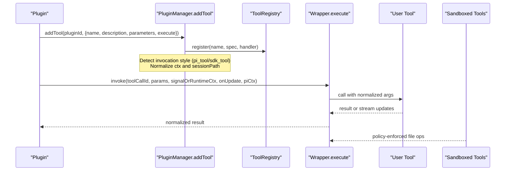

**Diagram sources**
- [core/plugin-manager.ts:793-831](file://core/plugin-manager.ts#L793-L831)
- [core/tool-registry.ts:22-70](file://core/tool-registry.ts#L22-L70)
- [lib/tools/tool-session.ts:33-53](file://lib/tools/tool-session.ts#L33-L53)
- [lib/sandbox/index.ts:34-57](file://lib/sandbox/index.ts#L34-L57)

## Detailed Component Analysis

### Dynamic Tool Registration (addTool)
- Purpose: Allow plugins to register tools at runtime during onload.
- Behavior:
  - Normalizes execution context using tool-session helpers.
  - Merges sessionPath into context when available.
  - Supports two invocation styles:
    - pi_tool: execute signature includes toolCallId, params, signalOrRuntimeCtx, onUpdate, piCtx.
    - sdk_tool: execute signature is simpler (params, ctx).
  - Returns a cleanup function that removes the tool from the internal list.
- Invocation style detection: Based on function arity and presence of onUpdate parameter.

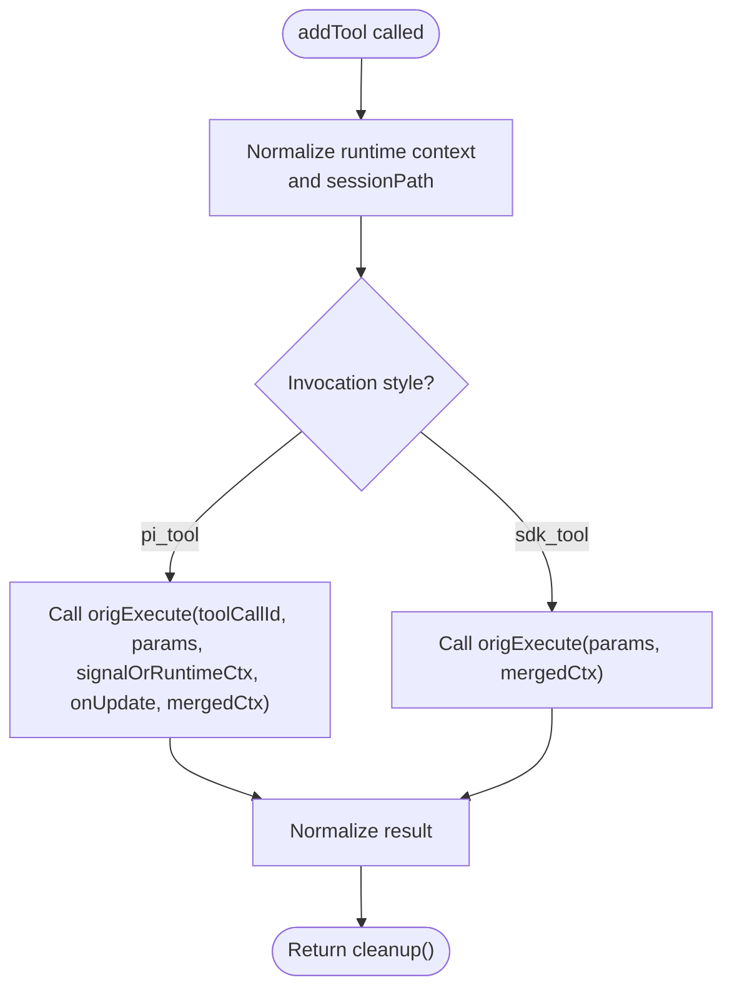

**Diagram sources**
- [core/plugin-manager.ts:793-831](file://core/plugin-manager.ts#L793-L831)
- [lib/tools/tool-session.ts:33-53](file://lib/tools/tool-session.ts#L33-L53)

**Section sources**
- [core/plugin-manager.ts:793-831](file://core/plugin-manager.ts#L793-L831)
- [lib/tools/tool-session.ts:33-53](file://lib/tools/tool-session.ts#L33-L53)

### Tool Invocation Styles (pi_tool vs sdk_tool)
- pi_tool:
  - Full signature: execute(toolCallId, params, signalOrRuntimeCtx, onUpdate, piCtx).
  - Enables streaming via onUpdate callback and supports cancellation via AbortSignal-like objects.
- sdk_tool:
  - Simplified signature: execute(params, ctx).
  - Suitable for non-streaming tools.

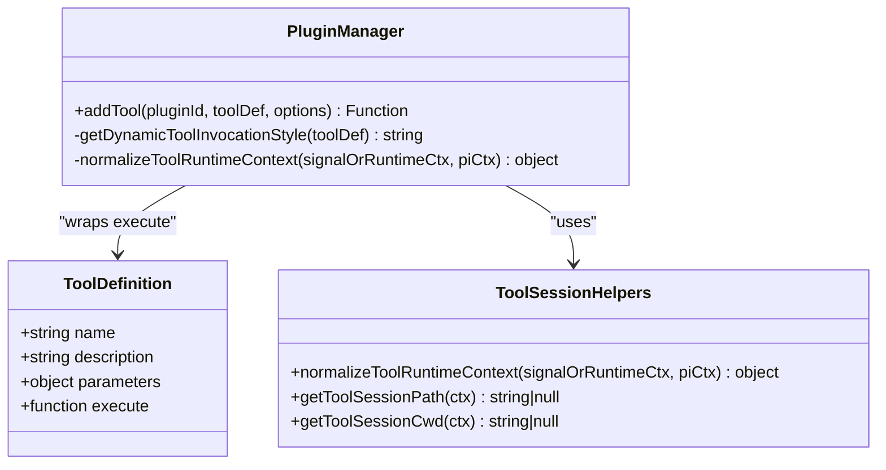

**Diagram sources**
- [core/plugin-manager.ts:793-831](file://core/plugin-manager.ts#L793-L831)
- [lib/tools/tool-session.ts:33-53](file://lib/tools/tool-session.ts#L33-L53)

**Section sources**
- [core/plugin-manager.ts:793-831](file://core/plugin-manager.ts#L793-L831)
- [lib/tools/tool-session.ts:33-53](file://lib/tools/tool-session.ts#L33-L53)

### Streaming Responses and Progress Updates
- For long-running tasks, use the onUpdate callback in pi_tool style to emit incremental results or progress.
- Server-side streaming examples:
  - Media route uses TransformStream to pipe Node streams to Web streams for efficient chunked transfer.
  - Range requests supported via parseRangeHeader and Content-Range headers.

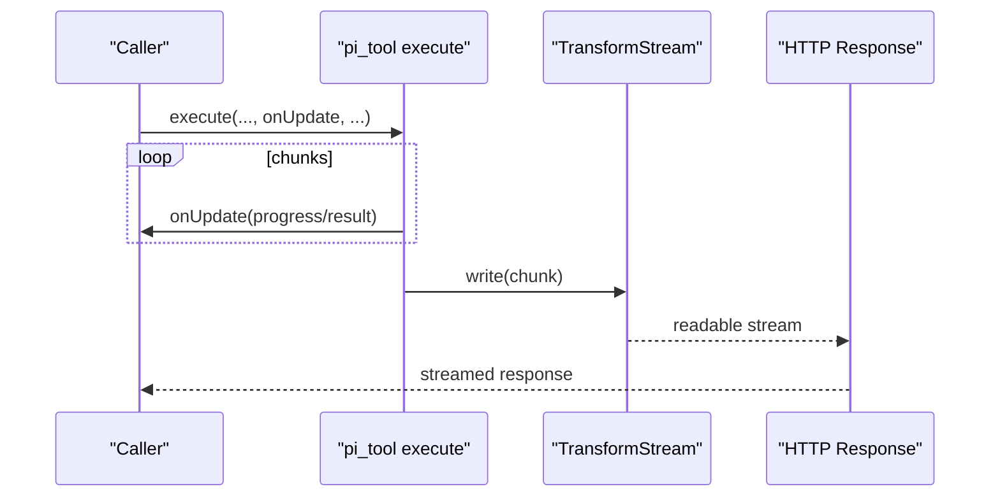

**Diagram sources**
- [server/routes/media.ts:295-341](file://server/routes/media.ts#L295-L341)
- [server/http/file-content.ts:77-115](file://server/http/file-content.ts#L77-L115)

**Section sources**
- [server/routes/media.ts:295-341](file://server/routes/media.ts#L295-L341)
- [server/http/file-content.ts:77-115](file://server/http/file-content.ts#L77-L115)

### Session Context Access and Sandbox Boundaries
- Session context extraction:
  - getToolSessionPath and getToolSessionCwd derive current session path/cwd from Pi SDK context.
  - normalizeToolRuntimeContext unifies different execute signatures.
- Sandbox policy:
  - deriveSandboxPolicy computes writablePaths, readablePaths, denyReadPaths, protectedPaths based on agentDir, hanakoHome, workspaceRoots, and mode.
  - createSandboxedTools builds session-scoped tools enforcing policy and optional network enablement.

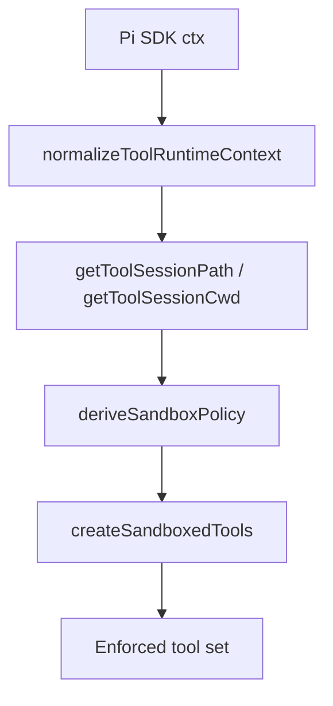

**Diagram sources**
- [lib/tools/tool-session.ts:33-53](file://lib/tools/tool-session.ts#L33-L53)
- [core/sandbox/policy.ts:89-138](file://core/sandbox/policy.ts#L89-L138)
- [lib/sandbox/index.ts:34-57](file://lib/sandbox/index.ts#L34-L57)

**Section sources**
- [lib/tools/tool-session.ts:33-53](file://lib/tools/tool-session.ts#L33-L53)
- [core/sandbox/policy.ts:89-138](file://core/sandbox/policy.ts#L89-L138)
- [lib/sandbox/index.ts:34-57](file://lib/sandbox/index.ts#L34-L57)

### Cross-Plugin Communication Patterns
- EventBus provides:
  - subscribe(callback, filter): event subscription with filtering by sessionPath/type.
  - request(type, payload, options): request/response pattern between plugins.
- Capability checks:
  - plugin-route-request-context enforces declared/granted permissions before allowing bus operations.

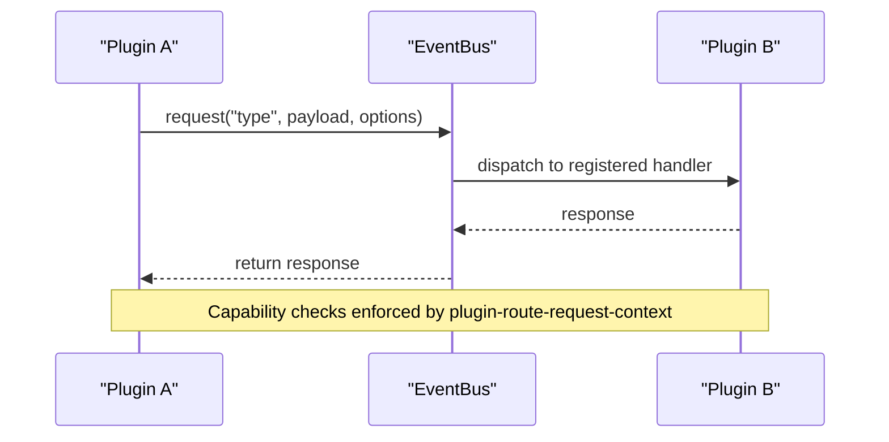

**Diagram sources**
- [hub/event-bus.ts:31-43](file://hub/event-bus.ts#L31-L43)
- [core/plugin-route-request-context.ts:126-168](file://core/plugin-route-request-context.ts#L126-L168)

**Section sources**
- [hub/event-bus.ts:31-43](file://hub/event-bus.ts#L31-L43)
- [core/plugin-route-request-context.ts:126-168](file://core/plugin-route-request-context.ts#L126-L168)

### Example Tools

#### Web Search Tool
- Multi-provider fallback: Tavily, Serper, Brave, AnySearch free, browser.
- Configurable maxResults with provider-specific limits.
- Returns formatted markdown-like results.

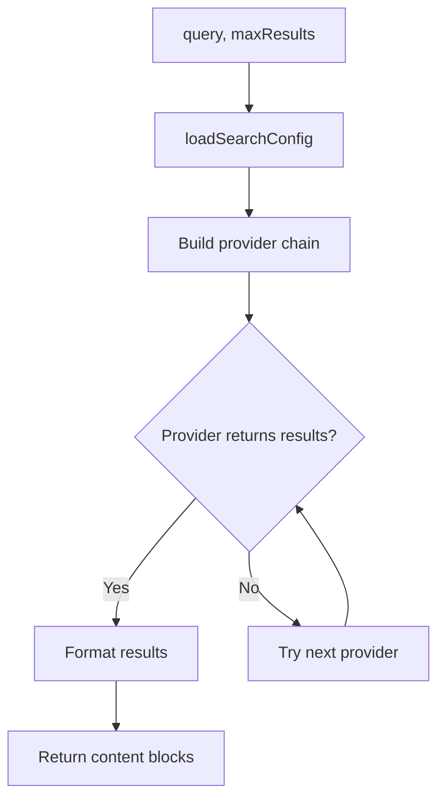

**Diagram sources**
- [core/tools/web-search.ts:141-185](file://core/tools/web-search.ts#L141-L185)
- [core/tools/web-search.ts:189-221](file://core/tools/web-search.ts#L189-L221)

**Section sources**
- [core/tools/web-search.ts:189-221](file://core/tools/web-search.ts#L189-L221)

#### Web Fetch Tool
- Fetch URL content with timeout and user-agent header.
- Handles JSON and HTML; strips tags for readability.
- Truncates output to avoid oversized payloads.

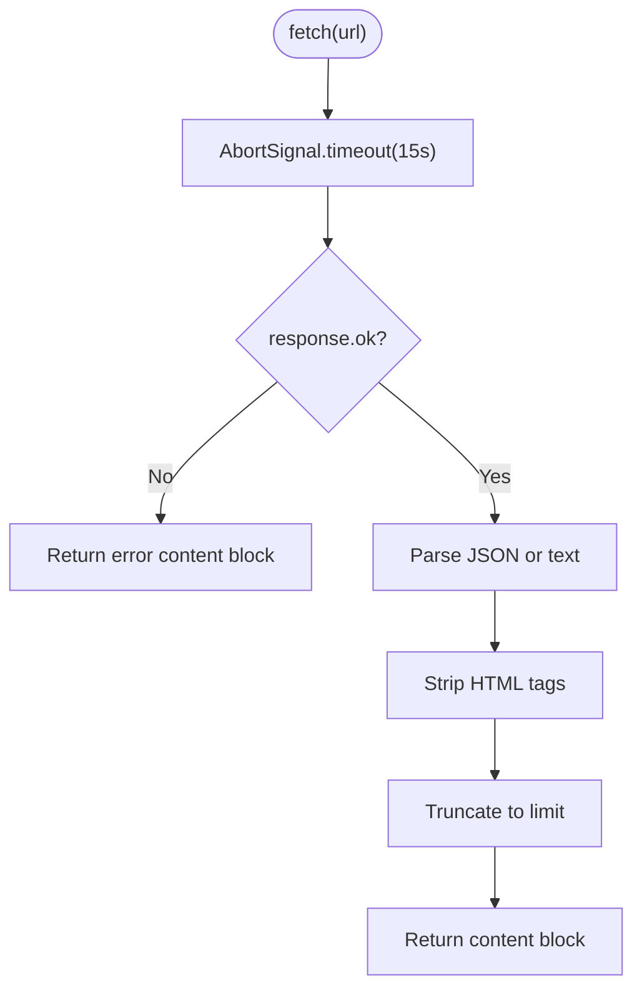

**Diagram sources**
- [core/tools/web-fetch.ts:24-74](file://core/tools/web-fetch.ts#L24-L74)

**Section sources**
- [core/tools/web-fetch.ts:10-77](file://core/tools/web-fetch.ts#L10-L77)

#### File Tool (stat/copy)
- stat: returns metadata like type, size, modified time.
- copy: copies files within allowed paths; errors handled gracefully.

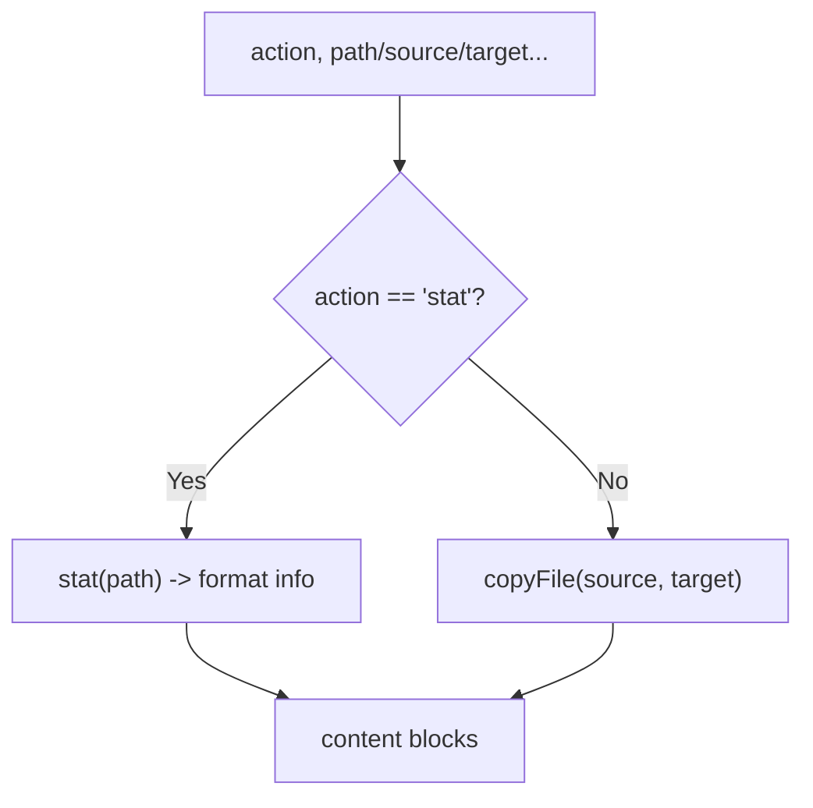

**Diagram sources**
- [core/tools/file-tool.ts:31-90](file://core/tools/file-tool.ts#L31-L90)

**Section sources**
- [core/tools/file-tool.ts:31-90](file://core/tools/file-tool.ts#L31-L90)

## Dependency Analysis
- ToolRegistry depends on Map for O(1) lookup and iteration.
- PluginManager orchestrates dynamic registration and execution, relying on tool-session helpers and sandbox policy.
- Example tools depend on standard libraries (fs/promises, fetch) and optionally config loaders.
- Streaming utilities rely on Web Streams API and Node stream interoperability.
- Cross-plugin communication relies on EventBus and capability checks.

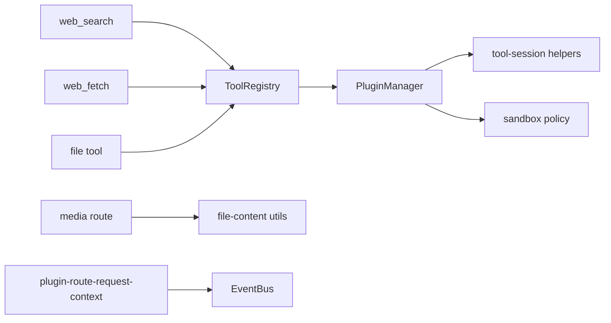

**Diagram sources**
- [core/tool-registry.ts:22-70](file://core/tool-registry.ts#L22-L70)
- [core/plugin-manager.ts:793-831](file://core/plugin-manager.ts#L793-L831)
- [lib/tools/tool-session.ts:33-53](file://lib/tools/tool-session.ts#L33-L53)
- [core/sandbox/policy.ts:89-138](file://core/sandbox/policy.ts#L89-L138)
- [core/tools/web-search.ts:189-221](file://core/tools/web-search.ts#L189-L221)
- [core/tools/web-fetch.ts:10-77](file://core/tools/web-fetch.ts#L10-L77)
- [core/tools/file-tool.ts:31-90](file://core/tools/file-tool.ts#L31-L90)
- [server/routes/media.ts:295-341](file://server/routes/media.ts#L295-L341)
- [server/http/file-content.ts:77-115](file://server/http/file-content.ts#L77-L115)
- [hub/event-bus.ts:31-43](file://hub/event-bus.ts#L31-L43)
- [core/plugin-route-request-context.ts:126-168](file://core/plugin-route-request-context.ts#L126-L168)

**Section sources**
- [core/tool-registry.ts:22-70](file://core/tool-registry.ts#L22-L70)
- [core/plugin-manager.ts:793-831](file://core/plugin-manager.ts#L793-L831)
- [lib/tools/tool-session.ts:33-53](file://lib/tools/tool-session.ts#L33-L53)
- [core/sandbox/policy.ts:89-138](file://core/sandbox/policy.ts#L89-L138)
- [core/tools/web-search.ts:189-221](file://core/tools/web-search.ts#L189-L221)
- [core/tools/web-fetch.ts:10-77](file://core/tools/web-fetch.ts#L10-L77)
- [core/tools/file-tool.ts:31-90](file://core/tools/file-tool.ts#L31-L90)
- [server/routes/media.ts:295-341](file://server/routes/media.ts#L295-L341)
- [server/http/file-content.ts:77-115](file://server/http/file-content.ts#L77-L115)
- [hub/event-bus.ts:31-43](file://hub/event-bus.ts#L31-L43)
- [core/plugin-route-request-context.ts:126-168](file://core/plugin-route-request-context.ts#L126-L168)

## Performance Considerations
- Use streaming for large outputs:
  - Prefer TransformStream pipelines for media and large file transfers.
  - Support Range requests to reduce bandwidth and improve responsiveness.
- Limit payload sizes:
  - Truncate text outputs to reasonable limits (e.g., web_fetch truncation).
  - Clamp maxResults for search providers to prevent excessive data.
- Memory pressure handling:
  - Monitor RSS and external buffers; consider hibernating sessions under pressure.
  - Clear timers and abort streaming sessions on teardown.
- Resource cleanup:
  - Provide cleanup functions for dynamically registered tools.
  - Ensure AbortSignals are used for timeouts and cancellations.

[No sources needed since this section provides general guidance]

## Troubleshooting Guide
- Tool not found:
  - Verify registration via ToolRegistry.list and ensure names match.
- Permission denied:
  - Check sandbox policy writable/readable paths and protectedPaths.
- Streaming stalls:
  - Confirm TransformStream wiring and Range header parsing.
- Cross-plugin request failures:
  - Validate capability declarations and grants in plugin-route-request-context.

**Section sources**
- [tests/core/tool-registry.test.ts:1-142](file://tests/core/tool-registry.test.ts#L1-L142)
- [core/sandbox/policy.ts:89-138](file://core/sandbox/policy.ts#L89-L138)
- [server/http/file-content.ts:77-115](file://server/http/file-content.ts#L77-L115)
- [core/plugin-route-request-context.ts:126-168](file://core/plugin-route-request-context.ts#L126-L168)

## Conclusion
Advanced tool features in this system center around dynamic registration, flexible invocation styles, robust session context handling, strict sandbox boundaries, and efficient streaming. By leveraging the provided APIs and patterns, developers can build powerful, secure, and performant tools that integrate seamlessly with external services and other plugins.

[No sources needed since this section summarizes without analyzing specific files]