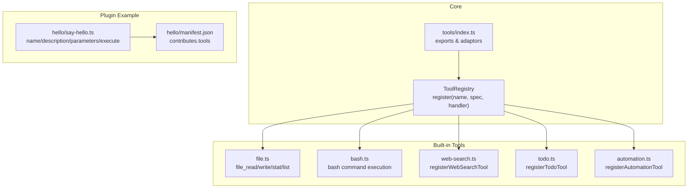
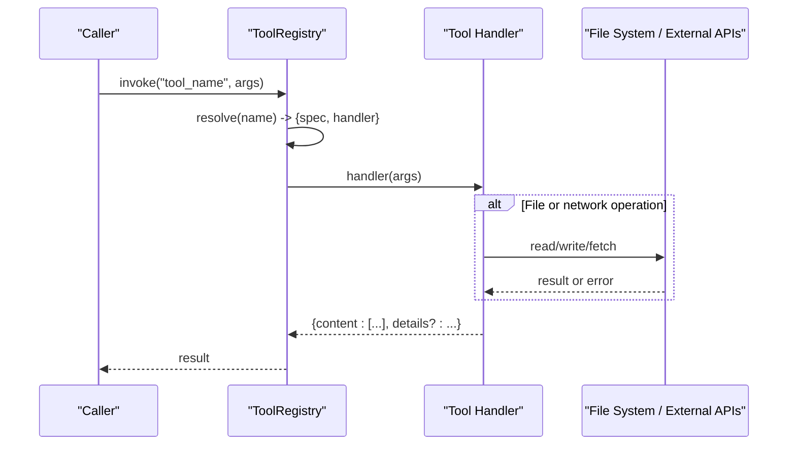
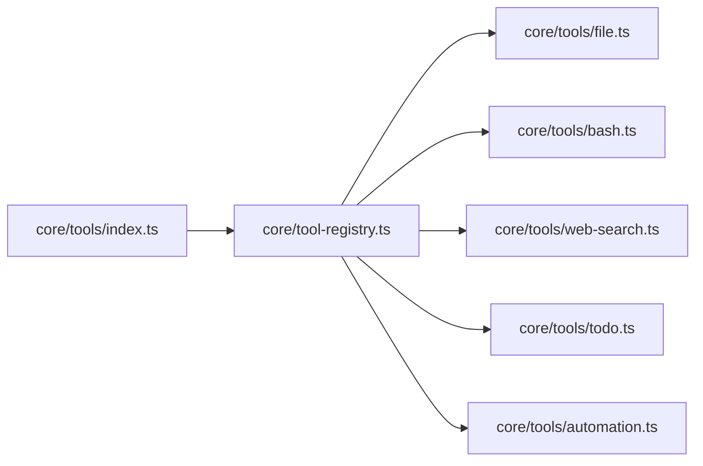

# Basic Tool Creation

<cite>
**Referenced Files in This Document**
- [core/tool-registry.ts](file://core/tool-registry.ts)
- [core/tools/index.ts](file://core/tools/index.ts)
- [core/tools/file.ts](file://core/tools/file.ts)
- [core/tools/bash.ts](file://core/tools/bash.ts)
- [core/tools/web-search.ts](file://core/tools/web-search.ts)
- [core/tools/todo.ts](file://core/tools/todo.ts)
- [core/tools/automation.ts](file://core/tools/automation.ts)
- [plugins/community/hello/tools/say-hello.ts](file://plugins/community/hello/tools/say-hello.ts)
- [plugins/community/hello/manifest.json](file://plugins/community/hello/manifest.json)
</cite>

## Table of Contents
1. [Introduction](#introduction)
2. [Project Structure](#project-structure)
3. [Core Components](#core-components)
4. [Architecture Overview](#architecture-overview)
5. [Detailed Component Analysis](#detailed-component-analysis)
6. [Dependency Analysis](#dependency-analysis)
7. [Performance Considerations](#performance-considerations)
8. [Troubleshooting Guide](#troubleshooting-guide)
9. [Conclusion](#conclusion)
10. [Appendices](#appendices)

## Introduction
This document explains how to create basic tools in the project. It covers the fundamental tool structure (name, description, parameters, and execute), parameter validation using JSON Schema, input/output formats, error handling patterns, and metadata for AI integration. You will also find step-by-step examples for creating simple tools that return text, structured data, and perform file operations. Finally, it addresses naming conventions, plugin isolation, and basic testing strategies.

## Project Structure
Tools are implemented as small modules with a clear contract:
- A tool specification describing name, description, and JSON Schema parameters
- An execute function implementing the logic
- Optional registration helpers to integrate with the central registry
- Plugin packaging via manifest files for isolation and discovery



**Diagram sources**
- [core/tool-registry.ts:1-89](file://core/tool-registry.ts#L1-L89)
- [core/tools/index.ts:1-32](file://core/tools/index.ts#L1-L32)
- [core/tools/file.ts:1-96](file://core/tools/file.ts#L1-L96)
- [core/tools/bash.ts:1-109](file://core/tools/bash.ts#L1-L109)
- [core/tools/web-search.ts:1-221](file://core/tools/web-search.ts#L1-L221)
- [core/tools/todo.ts:1-99](file://core/tools/todo.ts#L1-L99)
- [core/tools/automation.ts:1-133](file://core/tools/automation.ts#L1-L133)
- [plugins/community/hello/tools/say-hello.ts:1-15](file://plugins/community/hello/tools/say-hello.ts#L1-L15)
- [plugins/community/hello/manifest.json:1-11](file://plugins/community/hello/manifest.json#L1-L11)

**Section sources**
- [core/tool-registry.ts:1-89](file://core/tool-registry.ts#L1-L89)
- [core/tools/index.ts:1-32](file://core/tools/index.ts#L1-L32)

## Core Components
- ToolSpec and ToolHandler define the contract for all tools. The registry stores entries mapping names to specs and handlers.
- createToolSpec is a helper to build a ToolSpec from a concise definition, automatically deriving required fields based on optional flags.
- The registry provides register, get, list, getSpecs, merge, and other utilities to manage tools at runtime.

Key responsibilities:
- Centralized tool catalog and lookup
- Standardized JSON Schema-based parameter definitions
- Consistent handler signature for execution

**Section sources**
- [core/tool-registry.ts:1-89](file://core/tool-registry.ts#L1-L89)

## Architecture Overview
The system exposes a uniform interface for tools:
- Each tool declares its schema and behavior
- The registry binds names to handlers
- Consumers call tools by name; the registry invokes the handler with validated arguments
- Built-in tools demonstrate different patterns: pure functions, I/O-bound operations, and external API calls
- Plugins package tools alongside manifests for isolation and contribution



[No diagram sources needed since this diagram shows conceptual workflow, not actual code structure]

## Detailed Component Analysis

### Tool Contract and Registry
- ToolSpec describes function metadata and JSON Schema parameters
- ToolHandler is an async function returning results
- ToolEntry bundles spec and handler
- ToolRegistry manages lifecycle and retrieval

```mermaid
classDiagram
class ToolSpec {
+string type
+function {
+string name
+string description
+object parameters
}
}
class ToolHandler {
+(args) Promise~any~
}
class ToolEntry {
+ToolSpec spec
+ToolHandler handler
}
class ToolRegistry {
-Map~string, ToolEntry~ _tools
+register(name, spec, handler) void
+get(name) ToolEntry?
+list() string[]
+getSpecs() ToolSpec[]
+merge(other) void
}
ToolRegistry --> ToolEntry : "stores"
ToolEntry --> ToolSpec : "has"
ToolEntry --> ToolHandler : "invokes"
```

**Diagram sources**
- [core/tool-registry.ts:1-89](file://core/tool-registry.ts#L1-L89)

**Section sources**
- [core/tool-registry.ts:1-89](file://core/tool-registry.ts#L1-L89)

### Parameter Validation Using JSON Schema
- Parameters are defined as JSON Schema objects under parameters.properties with a required array
- createToolSpec derives required fields from properties marked optional
- Handlers should validate inputs early and return user-friendly errors when invalid

Practical guidance:
- Use types like string, number, boolean, array, object
- Provide descriptions for each property to improve AI usage
- Mark non-required fields with optional flag where applicable

**Section sources**
- [core/tool-registry.ts:72-89](file://core/tool-registry.ts#L72-L89)

### Input and Output Formats
- Inputs: plain JavaScript objects matching the declared JSON Schema
- Outputs: typically include content array with text blocks and optional details for structured data
- Some tools return typed results directly (e.g., file operations)

Examples across built-ins:
- Text output: web_search returns content with formatted text
- Structured output: todo returns content plus details with todos and summary
- File operations: file tools return typed success/error unions

**Section sources**
- [core/tools/web-search.ts:189-221](file://core/tools/web-search.ts#L189-L221)
- [core/tools/todo.ts:42-99](file://core/tools/todo.ts#L42-L99)
- [core/tools/file.ts:1-96](file://core/tools/file.ts#L1-L96)

### Error Handling Patterns
- Return explicit error shapes with success: false and error messages
- For I/O and external calls, wrap in try/catch and normalize errors
- For security-sensitive operations (e.g., bash), block dangerous patterns and enforce path guards

Patterns observed:
- File tools: return union types with success/error
- Bash tool: checks cwd against guard, blocks dangerous commands, caps output sizes, handles timeouts
- Web search: catches provider failures and returns friendly messages

**Section sources**
- [core/tools/file.ts:30-96](file://core/tools/file.ts#L30-L96)
- [core/tools/bash.ts:45-109](file://core/tools/bash.ts#L45-L109)
- [core/tools/web-search.ts:189-221](file://core/tools/web-search.ts#L189-L221)

### Step-by-Step Examples

#### Example 1: Simple Text Tool (Plugin Style)
- Define name, description, parameters (JSON Schema), and execute
- Return a string or content array depending on your integration
- Package under a plugin directory with a manifest listing contributes.tools

Steps:
1. Create say-hello.ts with exports for name, description, parameters, and execute
2. Add manifest.json with id, name, version, description, and contributes.tools
3. Ensure the plugin loader discovers and registers the tool

**Section sources**
- [plugins/community/hello/tools/say-hello.ts:1-15](file://plugins/community/hello/tools/say-hello.ts#L1-L15)
- [plugins/community/hello/manifest.json:1-11](file://plugins/community/hello/manifest.json#L1-L11)

#### Example 2: Structured Data Tool (Todo)
- Use a rich JSON Schema to describe nested arrays and enums
- Validate and normalize inputs inside execute
- Return both human-readable content and machine-readable details

Steps:
1. Define TodoItem and TodoToolResult interfaces
2. Register the tool with a comprehensive schema including status enum
3. Build summary and warnings, then return content and details

**Section sources**
- [core/tools/todo.ts:1-99](file://core/tools/todo.ts#L1-L99)

#### Example 3: File Operations Tool
- Implement read, write, stat, list with path guards
- Return typed results indicating success or error
- Enforce allowed paths and handle exceptions gracefully

Steps:
1. Create file tools with guarded access
2. Normalize results into consistent success/error shapes
3. Integrate with registry or export for direct use

**Section sources**
- [core/tools/file.ts:1-96](file://core/tools/file.ts#L1-L96)

#### Example 4: Command Execution Tool (Bash)
- Validate working directory and command safety
- Execute with platform-aware shell selection
- Cap outputs and handle timeouts/errors

Steps:
1. Check cwd against path guard
2. Block dangerous patterns
3. Run command via appropriate shell and capture stdout/stderr
4. Return normalized result

**Section sources**
- [core/tools/bash.ts:1-109](file://core/tools/bash.ts#L1-L109)

#### Example 5: External API Tool (Web Search)
- Support multiple providers with fallback
- Clamp results per provider limits
- Return formatted text content and indicate provider used

Steps:
1. Load configuration and determine provider
2. Attempt provider chain until successful
3. Format results and return content

**Section sources**
- [core/tools/web-search.ts:1-221](file://core/tools/web-search.ts#L1-L221)

#### Example 6: Automation Tool (CRUD over JSON)
- Persist automations to a local JSON file
- Provide actions: list, create, delete, enable, disable, run
- Return descriptive text and optional details

Steps:
1. Define automation schema and persistence helpers
2. Implement action switch-case logic
3. Save state changes and return results

**Section sources**
- [core/tools/automation.ts:1-133](file://core/tools/automation.ts#L1-L133)

### Tool Metadata for AI Integration
- name: unique identifier used by callers and registry
- description: guides AI models on when and how to use the tool
- parameters: JSON Schema with descriptions to inform model prompting
- promptSnippet and promptGuidelines: while not present in the analyzed files, these fields are commonly used to provide short prompts and usage guidelines for AI systems. If you need them, add them to your tool’s metadata and ensure your adapter reads and forwards them to the LLM context.

Best practices:
- Keep descriptions concise and actionable
- Include examples in descriptions when helpful
- Use enums and constraints to reduce ambiguity

[No sources needed since this section provides general guidance]

### Naming Conventions
- Use lowercase with underscores for tool names (e.g., web_search, file_read)
- Avoid reserved words and keep names stable across versions
- Group related tools under consistent prefixes if needed

Observed examples:
- web_search, todo, automation, file_read, file_write, file_stat, file_list, bash

**Section sources**
- [core/tools/web-search.ts:189-221](file://core/tools/web-search.ts#L189-L221)
- [core/tools/todo.ts:42-99](file://core/tools/todo.ts#L42-L99)
- [core/tools/automation.ts:38-133](file://core/tools/automation.ts#L38-L133)
- [core/tools/file.ts:30-96](file://core/tools/file.ts#L30-L96)
- [core/tools/bash.ts:45-109](file://core/tools/bash.ts#L45-L109)

### Plugin Isolation
- Place tool modules under plugins/<plugin-id>/tools/
- Declare contributed tools in manifest.json under contributes.tools
- The plugin system loads and isolates tool implementations per plugin

Example:
- hello plugin contributes say-hello tool via manifest

**Section sources**
- [plugins/community/hello/tools/say-hello.ts:1-15](file://plugins/community/hello/tools/say-hello.ts#L1-L15)
- [plugins/community/hello/manifest.json:1-11](file://plugins/community/hello/manifest.json#L1-L11)

### Basic Testing Strategies
- Unit tests: assert JSON Schema compliance and handler outputs for various inputs
- Mock I/O and network: stub file system and HTTP calls to verify error paths
- Regression tests: ensure backward compatibility of tool schemas and outputs
- Integration tests: register tools in a fresh registry and exercise full invocation flow

Recommended approach:
- Test happy paths and edge cases (missing fields, wrong types, empty arrays)
- Validate error normalization and message clarity
- Verify provider fallback chains and clamping logic for external tools

[No sources needed since this section provides general guidance]

## Dependency Analysis
Built-in tools depend on core registry and standard libraries; some rely on additional modules for security and I/O.



**Diagram sources**
- [core/tool-registry.ts:1-89](file://core/tool-registry.ts#L1-L89)
- [core/tools/index.ts:1-32](file://core/tools/index.ts#L1-L32)
- [core/tools/file.ts:1-96](file://core/tools/file.ts#L1-L96)
- [core/tools/bash.ts:1-109](file://core/tools/bash.ts#L1-L109)
- [core/tools/web-search.ts:1-221](file://core/tools/web-search.ts#L1-L221)
- [core/tools/todo.ts:1-99](file://core/tools/todo.ts#L1-L99)
- [core/tools/automation.ts:1-133](file://core/tools/automation.ts#L1-L133)

**Section sources**
- [core/tool-registry.ts:1-89](file://core/tool-registry.ts#L1-L89)
- [core/tools/index.ts:1-32](file://core/tools/index.ts#L1-L32)

## Performance Considerations
- Cap output sizes for long-running commands to avoid memory pressure
- Use timeouts for external API calls and process executions
- Prefer streaming or pagination for large datasets when possible
- Minimize synchronous I/O in hot paths; prefer async APIs

[No sources needed since this section provides general guidance]

## Troubleshooting Guide
Common issues and resolutions:
- Invalid parameter errors: ensure JSON Schema matches actual inputs; check required fields and types
- Provider failures: verify API keys and network connectivity; confirm fallback chain behavior
- Path guard violations: confirm working directories and file paths are within allowed scopes
- Timeouts: increase limits cautiously and monitor resource usage

Diagnostic tips:
- Log provider selection and result counts
- Capture and redact sensitive information in error messages
- Validate schema before invoking handlers

**Section sources**
- [core/tools/web-search.ts:141-185](file://core/tools/web-search.ts#L141-L185)
- [core/tools/bash.ts:45-109](file://core/tools/bash.ts#L45-L109)
- [core/tools/file.ts:30-96](file://core/tools/file.ts#L30-L96)

## Conclusion
By following the standardized tool contract, leveraging JSON Schema for validation, and adopting consistent error handling and naming conventions, you can build robust, discoverable tools. Use the registry for centralized management, isolate plugins via manifests, and test thoroughly to ensure reliability.

[No sources needed since this section summarizes without analyzing specific files]

## Appendices

### Quick Reference: Tool Registration Patterns
- Direct registration with registry.register(name, spec, handler)
- Helper-based registration using createToolSpec for concise definitions
- Plugin-style tools exported with name, description, parameters, and execute

**Section sources**
- [core/tool-registry.ts:22-70](file://core/tool-registry.ts#L22-L70)
- [core/tools/automation.ts:38-133](file://core/tools/automation.ts#L38-L133)
- [plugins/community/hello/tools/say-hello.ts:1-15](file://plugins/community/hello/tools/say-hello.ts#L1-L15)