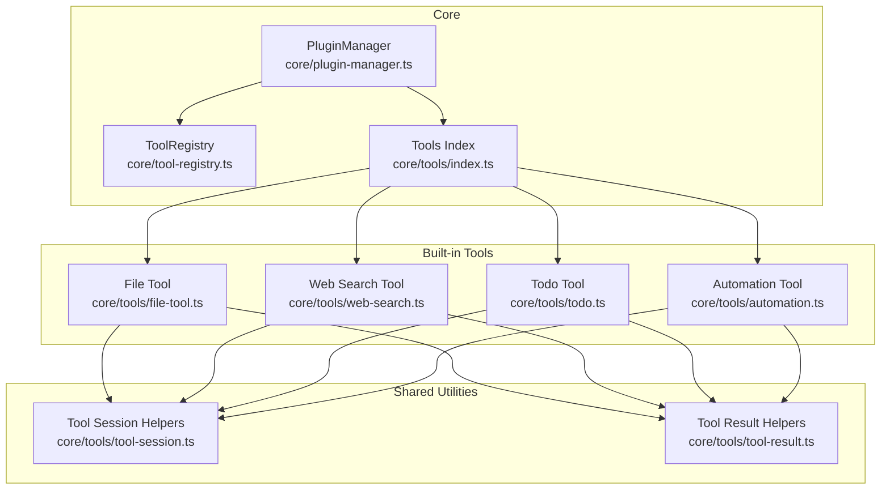
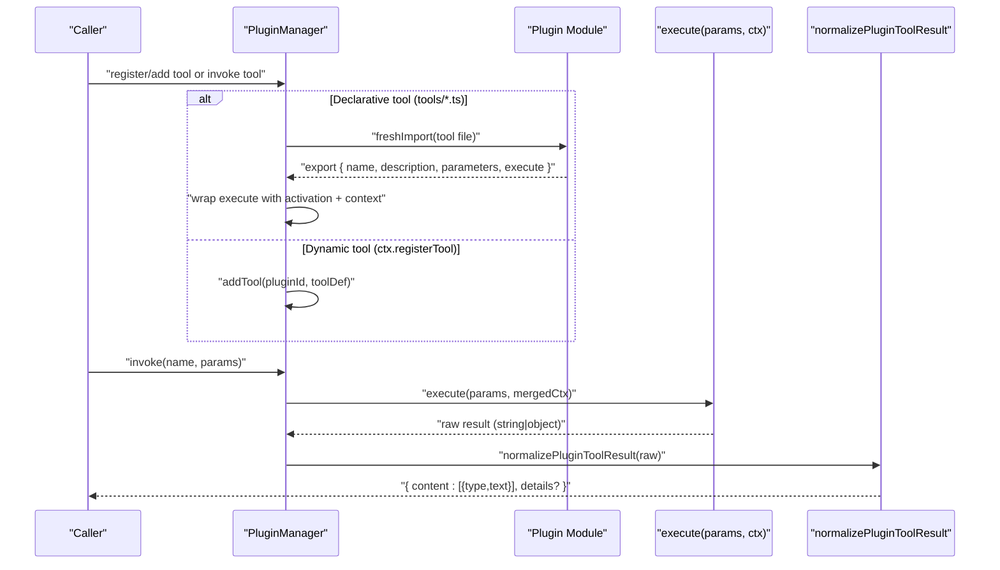
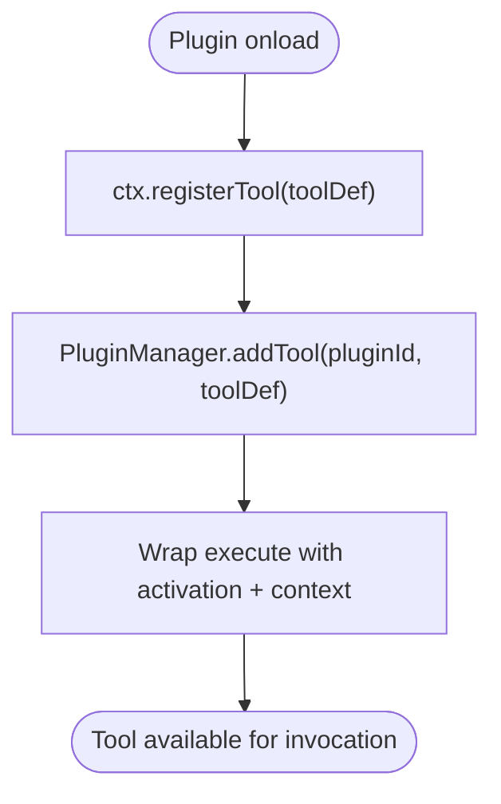
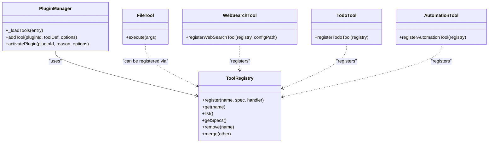

# Tool Development Guide

<cite>
**Referenced Files in This Document**
- [core/tool-registry.ts](file://core/tool-registry.ts)
- [core/tools/index.ts](file://core/tools/index.ts)
- [core/tools/file-tool.ts](file://core/tools/file-tool.ts)
- [core/tools/web-search.ts](file://core/tools/web-search.ts)
- [core/tools/todo.ts](file://core/tools/todo.ts)
- [core/tools/automation.ts](file://core/tools/automation.ts)
- [core/tools/tool-session.ts](file://core/tools/tool-session.ts)
- [core/tools/tool-result.ts](file://core/tools/tool-result.ts)
- [core/plugin-manager.ts](file://core/plugin-manager.ts)
</cite>

## Table of Contents
1. [Introduction](#introduction)
2. [Project Structure](#project-structure)
3. [Core Components](#core-components)
4. [Architecture Overview](#architecture-overview)
5. [Detailed Component Analysis](#detailed-component-analysis)
6. [Dependency Analysis](#dependency-analysis)
7. [Performance Considerations](#performance-considerations)
8. [Troubleshooting Guide](#troubleshooting-guide)
9. [Conclusion](#conclusion)
10. [Appendices](#appendices)

## Introduction
This guide explains how to develop tool plugins for the system. It covers:
- The tool definition structure (name, description, parameters schema, execute function)
- Execution context and parameter validation
- Result formatting options (text, structured data, card-based outputs)
- Dynamic tool registration at runtime
- Tool session management, error handling patterns, and performance considerations
- Testing and debugging guidance

The content is grounded in the built-in tools and plugin manager implementation.

## Project Structure
Tool-related code is primarily located under core/tools and core/tool-registry, with plugin discovery and dynamic registration handled by core/plugin-manager. Built-in examples demonstrate text responses, structured data, and card-based outputs.

**Diagram sources**
- [core/tool-registry.ts:1-89](file://core/tool-registry.ts#L1-L89)
- [core/plugin-manager.ts:744-800](file://core/plugin-manager.ts#L744-L800)
- [core/tools/index.ts:1-32](file://core/tools/index.ts#L1-L32)
- [core/tools/file-tool.ts:1-90](file://core/tools/file-tool.ts#L1-L90)
- [core/tools/web-search.ts:1-221](file://core/tools/web-search.ts#L1-L221)
- [core/tools/todo.ts:1-99](file://core/tools/todo.ts#L1-L99)
- [core/tools/automation.ts:1-133](file://core/tools/automation.ts#L1-L133)
- [core/tools/tool-session.ts:1-21](file://core/tools/tool-session.ts#L1-L21)
- [core/tools/tool-result.ts:1-17](file://core/tools/tool-result.ts#L1-L17)

**Section sources**
- [core/tool-registry.ts:1-89](file://core/tool-registry.ts#L1-L89)
- [core/plugin-manager.ts:744-800](file://core/plugin-manager.ts#L744-L800)
- [core/tools/index.ts:1-32](file://core/tools/index.ts#L1-L32)

## Core Components
- ToolRegistry: Central registry for tool specs and handlers. Provides registration, lookup, listing, and merging capabilities. Also includes a helper to create standard tool specs from simple definitions.
- PluginManager: Discovers declarative tools from plugin directories, wraps their execution, normalizes results, and supports dynamic tool registration via ctx.registerTool during plugin lifecycle.
- Tool utilities:
  - tool-session helpers: Provide current session path/cwd resolution for tools.
  - tool-result helpers: Standard constructors for success/error results.

Key responsibilities:
- Define tool schemas (name, description, parameters).
- Implement execute functions that accept arguments and return standardized results.
- Normalize results into consistent content blocks and optional details.
- Manage tool sessions and context propagation.

**Section sources**
- [core/tool-registry.ts:1-89](file://core/tool-registry.ts#L1-L89)
- [core/plugin-manager.ts:744-800](file://core/plugin-manager.ts#L744-L800)
- [core/tools/tool-session.ts:1-21](file://core/tools/tool-session.ts#L1-L21)
- [core/tools/tool-result.ts:1-17](file://core/tools/tool-result.ts#L1-L17)

## Architecture Overview
The tool pipeline integrates plugin discovery, dynamic registration, and execution normalization.

**Diagram sources**
- [core/plugin-manager.ts:744-800](file://core/plugin-manager.ts#L744-L800)
- [core/plugin-manager.ts:694-703](file://core/plugin-manager.ts#L694-L703)
- [core/plugin-manager.ts:135-148](file://core/plugin-manager.ts#L135-L148)

## Detailed Component Analysis

### Tool Definition Structure
A tool must define:
- name: Unique identifier within its plugin scope.
- description: Human-readable explanation used by callers and UI.
- parameters: JSON Schema-like object describing inputs (types, required fields).
- execute: Async function receiving parsed parameters and an execution context; returns a normalized result.

Examples:
- Declarative tool pattern: export { name, description, parameters, execute }.
- Programmatic tool pattern: use createToolSpec to build a spec and register it with a handler.

**Section sources**
- [core/tools/index.ts:21-30](file://core/tools/index.ts#L21-L30)
- [core/tool-registry.ts:72-89](file://core/tool-registry.ts#L72-L89)

### Parameter Validation
- Parameters are described using a schema object with properties and required arrays.
- Built-in tools validate inputs inside execute and return user-friendly error messages when required fields are missing or invalid.

Example references:
- File tool validates action and required fields per branch.
- Web search tool validates query presence and clamps maxResults.

**Section sources**
- [core/tools/file-tool.ts:31-90](file://core/tools/file-tool.ts#L31-L90)
- [core/tools/web-search.ts:189-221](file://core/tools/web-search.ts#L189-L221)

### Execute Function Implementation
- Signature: async execute(params, ctx) -> normalized result.
- Context (ctx) may include plugin-scoped APIs and session information (sessionPath, cwd).
- Plugins can activate themselves on tool call events before executing logic.

References:
- Declarative tools are wrapped to inject activation and context normalization.
- Dynamic tools registered via ctx.registerTool receive similar wrapping.

**Section sources**
- [core/plugin-manager.ts:762-775](file://core/plugin-manager.ts#L762-L775)
- [core/plugin-manager.ts:694-703](file://core/plugin-manager.ts#L694-L703)

### Result Formatting Options
Normalized results support:
- Text responses: content array with type "text".
- Structured data: additional details field for machine-readable payloads.
- Card-based outputs: details.card supported and auto-populated with pluginId when present.

Utility helpers:
- toolOk and toolError provide quick constructors for text results and error tagging.

Examples:
- Todo tool returns both text summary and structured details (todos, summary, warning).
- Automation tool returns text plus details (e.g., automation object or run request).

**Section sources**
- [core/tools/tool-result.ts:1-17](file://core/tools/tool-result.ts#L1-L17)
- [core/tools/todo.ts:69-98](file://core/tools/todo.ts#L69-L98)
- [core/tools/automation.ts:38-133](file://core/tools/automation.ts#L38-L133)
- [core/plugin-manager.ts:135-148](file://core/plugin-manager.ts#L135-L148)

### Built-in Tool Examples

#### Text Response Example: File Tool
- Demonstrates branching logic based on action, input validation, and returning text content.
- Useful reference for implementing multi-action tools with clear error paths.

**Section sources**
- [core/tools/file-tool.ts:1-90](file://core/tools/file-tool.ts#L1-L90)

#### Structured Data Example: Todo Tool
- Returns a human-readable summary and structured details for programmatic consumption.
- Shows status transitions and warnings.

**Section sources**
- [core/tools/todo.ts:1-99](file://core/tools/todo.ts#L1-L99)

#### Card-Based Output Example: Notification Tool
- Integrates with notification delivery and returns both text feedback and structured details.
- Illustrates usage of i18n and external services within tool execution.

**Section sources**
- [core/tools/notify-tool.ts:1-76](file://core/tools/notify-tool.ts#L1-L76)

#### Multi-provider Logic Example: Web Search Tool
- Implements provider selection, fallback chains, and result formatting.
- Demonstrates robust error handling and configuration loading.

**Section sources**
- [core/tools/web-search.ts:1-221](file://core/tools/web-search.ts#L1-L221)

### Dynamic Tool Registration API
Plugins can dynamically register tools at runtime via ctx.registerTool during onload. The manager wraps the execute function similarly to declarative tools, ensuring consistent activation and result normalization.

**Diagram sources**
- [core/plugin-manager.ts:694-703](file://core/plugin-manager.ts#L694-L703)
- [core/plugin-manager.ts:793-800](file://core/plugin-manager.ts#L793-L800)

**Section sources**
- [core/plugin-manager.ts:694-703](file://core/plugin-manager.ts#L694-L703)
- [core/plugin-manager.ts:793-800](file://core/plugin-manager.ts#L793-L800)

### Tool Session Management
- Session path and cwd are resolved from explicit context or defaults.
- Tools can rely on getToolSessionPath and getToolSessionCwd to locate session-scoped resources.

**Section sources**
- [core/tools/tool-session.ts:1-21](file://core/tools/tool-session.ts#L1-L21)

### Error Handling Patterns
- Validate inputs early and return descriptive text errors.
- Use try/catch around I/O and network calls; map exceptions to user-friendly messages.
- For structured results, include error details in the details field for diagnostics.

References:
- File tool error branches for stat/copy failures.
- Web search tool provider fallback and error mapping.

**Section sources**
- [core/tools/file-tool.ts:31-90](file://core/tools/file-tool.ts#L31-L90)
- [core/tools/web-search.ts:141-185](file://core/tools/web-search.ts#L141-L185)

### Performance Considerations
- Prefer minimal I/O and avoid unnecessary temp files where possible.
- Clamp result counts and limit network requests to reduce latency.
- Use timeouts for external calls to prevent long-running stalls.
- Batch operations when feasible and avoid redundant work across tool invocations.

[No sources needed since this section provides general guidance]

## Dependency Analysis
The following diagram shows key dependencies among tool components and registries.

**Diagram sources**
- [core/tool-registry.ts:1-89](file://core/tool-registry.ts#L1-L89)
- [core/plugin-manager.ts:744-800](file://core/plugin-manager.ts#L744-L800)
- [core/tools/web-search.ts:189-221](file://core/tools/web-search.ts#L189-L221)
- [core/tools/todo.ts:42-98](file://core/tools/todo.ts#L42-L98)
- [core/tools/automation.ts:38-133](file://core/tools/automation.ts#L38-L133)

**Section sources**
- [core/tool-registry.ts:1-89](file://core/tool-registry.ts#L1-L89)
- [core/plugin-manager.ts:744-800](file://core/plugin-manager.ts#L744-L800)

## Performance Considerations
- Keep execute functions fast and idempotent where possible.
- Avoid heavy synchronous operations; prefer asynchronous I/O.
- Limit output sizes and paginate large results if applicable.
- Cache frequently accessed read-only data within reasonable bounds.

[No sources needed since this section provides general guidance]

## Troubleshooting Guide
Common issues and remedies:
- Missing required parameters: Ensure your parameters schema marks required fields and validate them in execute.
- Unexpected result format: Return content arrays with type "text" for display; add details for structured data.
- Activation not triggered: Confirm tool names match activation events and that plugins are loaded with correct source priority.
- Session context unavailable: Verify session path/cwd resolution and ensure context is passed through correctly.

Useful references:
- Normalization of tool results and card injection.
- Dynamic tool registration and cleanup.

**Section sources**
- [core/plugin-manager.ts:135-148](file://core/plugin-manager.ts#L135-L148)
- [core/plugin-manager.ts:694-703](file://core/plugin-manager.ts#L694-L703)

## Conclusion
By adhering to the defined tool structure, leveraging the registry and plugin manager, and following the result normalization patterns, you can build robust, testable, and maintainable tools. Use built-in examples as templates for text, structured, and card-based outputs, and apply the session and error handling practices outlined here.

[No sources needed since this section summarizes without analyzing specific files]

## Appendices

### Quick Reference: Tool Definition Checklist
- name: unique string
- description: concise, actionable
- parameters: JSON Schema-like object with types and required fields
- execute: async function returning normalized result

**Section sources**
- [core/tool-registry.ts:72-89](file://core/tool-registry.ts#L72-L89)

### Example Paths for Further Reading
- Declarative tool example: [core/tools/file-tool.ts:1-90](file://core/tools/file-tool.ts#L1-L90)
- Multi-provider logic: [core/tools/web-search.ts:1-221](file://core/tools/web-search.ts#L1-L221)
- Structured output: [core/tools/todo.ts:1-99](file://core/tools/todo.ts#L1-L99)
- Dynamic registration: [core/plugin-manager.ts:694-703](file://core/plugin-manager.ts#L694-L703)