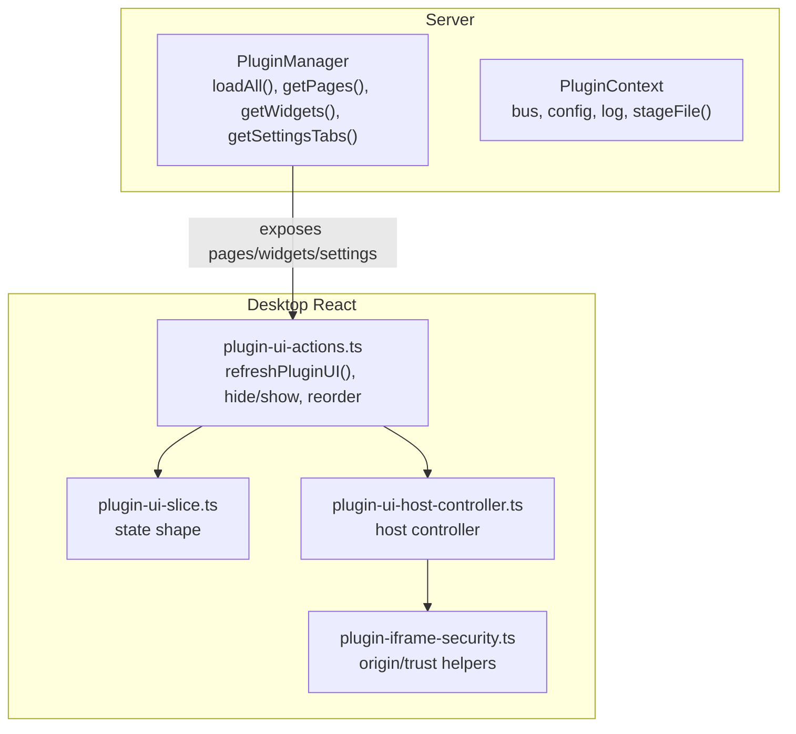
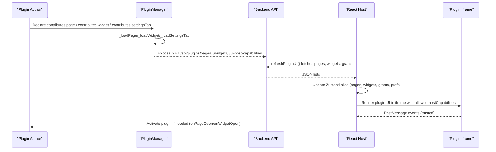
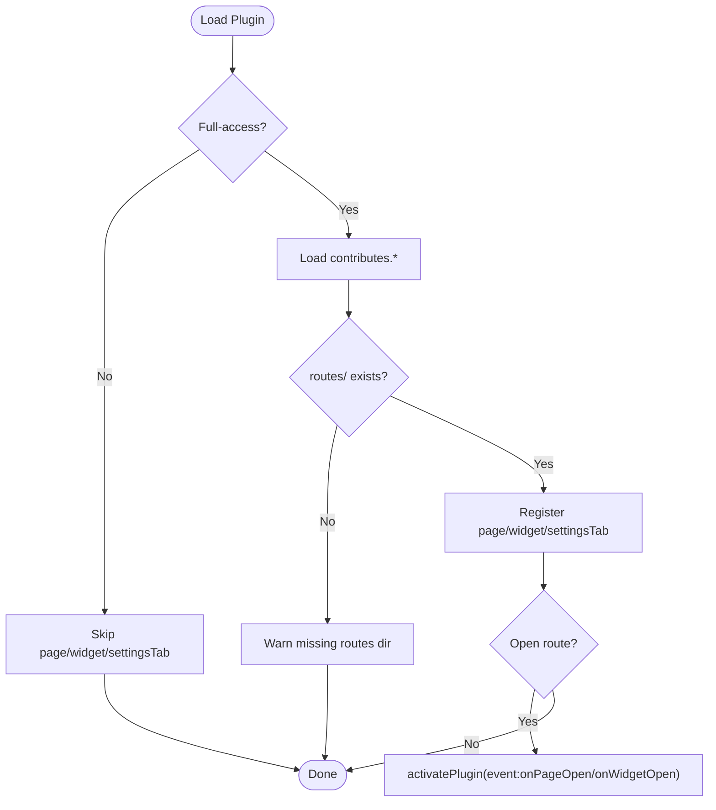
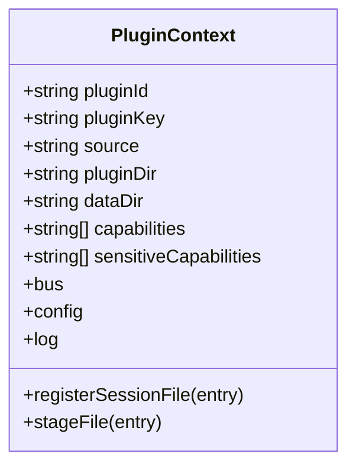
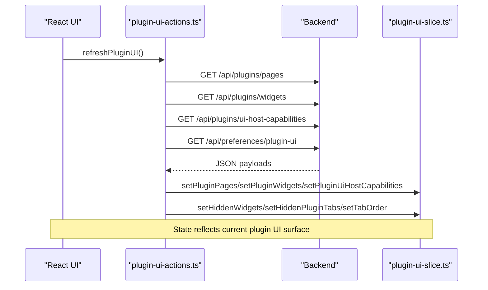
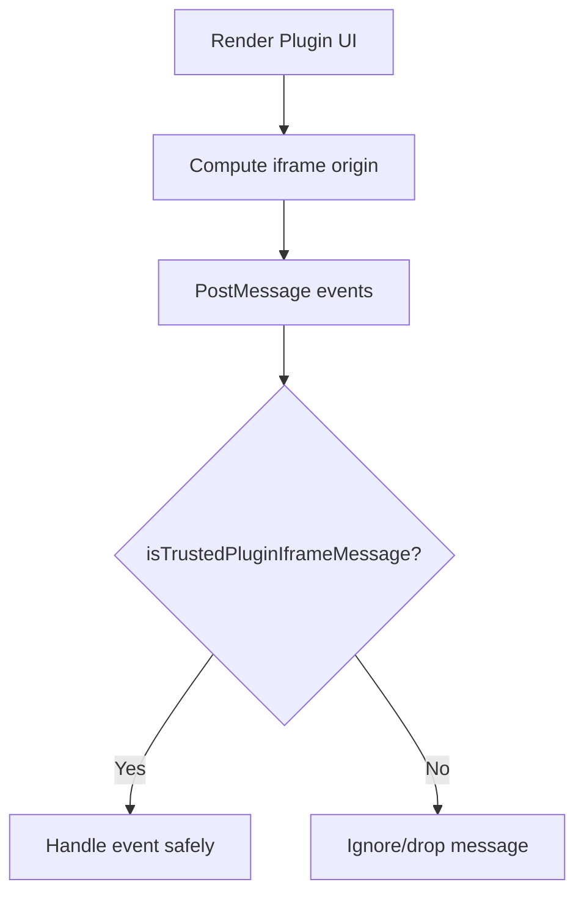
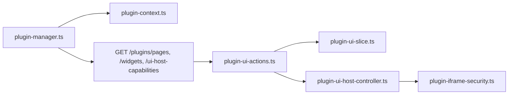

# UI Extension Development

<cite>
**Referenced Files in This Document**
- [plugin-manager.ts](file://core/plugin-manager.ts)
- [plugin-context.ts](file://core/plugin-context.ts)
- [plugin-ui-slice.ts](file://desktop/src/react/stores/plugin-ui-slice.ts)
- [plugin-ui-actions.ts](file://desktop/src/react/stores/plugin-ui-actions.ts)
- [plugin-iframe-security.ts](file://desktop/src/react/utils/plugin-iframe-security.ts)
- [plugin-ui-host-controller.ts](file://desktop/src/react/plugin-ui/plugin-ui-host-controller.ts)
</cite>

## Table of Contents
1. [Introduction](#introduction)
2. [Project Structure](#project-structure)
3. [Core Components](#core-components)
4. [Architecture Overview](#architecture-overview)
5. [Detailed Component Analysis](#detailed-component-analysis)
6. [Dependency Analysis](#dependency-analysis)
7. [Performance Considerations](#performance-considerations)
8. [Troubleshooting Guide](#troubleshooting-guide)
9. [Conclusion](#conclusion)

## Introduction
This document explains how to develop UI extensions for the application, focusing on:
- Creating custom widgets and embedded pages
- Integrating settings panels
- React component lifecycle and state management within plugin contexts
- Event handling between host and plugin UI
- Styling, theming, and responsive design patterns
- Security boundaries and cross-origin restrictions
- Performance optimization strategies
- Testing and debugging plugin interfaces

The guidance is grounded in the actual plugin system implementation and host-side UI integration.

## Project Structure
UI extension development spans server-side plugin loading and registration, and desktop-side React UI integration:
- Server-side PluginManager discovers and loads plugins, registers pages, widgets, and settings tabs, and exposes capabilities to the host UI.
- Desktop-side stores manage plugin UI state (pages, widgets, hidden items, tab order), fetch metadata from backend APIs, and coordinate iframe-based rendering with security checks.

**Diagram sources**
- [plugin-manager.ts:1528-1604](file://core/plugin-manager.ts#L1528-L1604)
- [plugin-ui-slice.ts:1-40](file://desktop/src/react/stores/plugin-ui-slice.ts#L1-L40)
- [plugin-ui-actions.ts:1-75](file://desktop/src/react/stores/plugin-ui-actions.ts#L1-L75)
- [plugin-iframe-security.ts:1-5](file://desktop/src/react/utils/plugin-iframe-security.ts#L1-L5)
- [plugin-ui-host-controller.ts](file://desktop/src/react/plugin-ui/plugin-ui-host-controller.ts)

**Section sources**
- [plugin-manager.ts:1528-1604](file://core/plugin-manager.ts#L1528-L1604)
- [plugin-ui-slice.ts:1-40](file://desktop/src/react/stores/plugin-ui-slice.ts#L1-L40)
- [plugin-ui-actions.ts:1-75](file://desktop/src/react/stores/plugin-ui-actions.ts#L1-L75)
- [plugin-iframe-security.ts:1-5](file://desktop/src/react/utils/plugin-iframe-security.ts#L1-L5)

## Core Components
- PluginManager
  - Scans plugin directories, validates manifests, enforces trust levels, and loads contributions including pages, widgets, and settings tabs.
  - Provides getters for pages, widgets, settings tabs, and capability grants consumed by the host UI.
- PluginContext
  - Provides a sandboxed bus, configuration store, logging, and file staging utilities to plugins at runtime.
- Desktop UI Store (Zustand slice + actions)
  - Holds plugin UI state and persists user preferences like hidden widgets/tabs and tab ordering.
  - Fetches plugin pages, widgets, and host capability grants via API endpoints.
- Host Controller and Security Helpers
  - Coordinates iframe-based plugin UI rendering and enforces origin/trust policies for messages.

Key responsibilities:
- Registration: Pages, widgets, and settings tabs are declared in plugin manifests and loaded by PluginManager.
- Activation: Opening a page or widget can trigger plugin activation events.
- Capability gating: Host capabilities (e.g., external.open, clipboard.writeText, sessionFile.open) are declared and granted per plugin.
- State synchronization: The host refreshes UI metadata and persists user preferences.

**Section sources**
- [plugin-manager.ts:1116-1186](file://core/plugin-manager.ts#L1116-L1186)
- [plugin-manager.ts:1528-1604](file://core/plugin-manager.ts#L1528-L1604)
- [plugin-context.ts:1-100](file://core/plugin-context.ts#L1-L100)
- [plugin-ui-slice.ts:1-40](file://desktop/src/react/stores/plugin-ui-slice.ts#L1-L40)
- [plugin-ui-actions.ts:1-75](file://desktop/src/react/stores/plugin-ui-actions.ts#L1-L75)

## Architecture Overview
The UI extension architecture connects plugin declarations to host-rendered UI surfaces:

**Diagram sources**
- [plugin-manager.ts:1116-1186](file://core/plugin-manager.ts#L1116-L1186)
- [plugin-manager.ts:1528-1604](file://core/plugin-manager.ts#L1528-L1604)
- [plugin-ui-actions.ts:26-75](file://desktop/src/react/stores/plugin-ui-actions.ts#L26-L75)

## Detailed Component Analysis

### PluginManager: Page, Widget, Settings Tab Loading
- Pages and widgets require full-access trust and a routes directory; they are registered only when manifest declares contributes.page or contributes.widget.
- Settings tabs are restricted to built-in plugins and require a nativeComponent field.
- Activation events are triggered when opening a page or widget route.

**Diagram sources**
- [plugin-manager.ts:1116-1186](file://core/plugin-manager.ts#L1116-L1186)
- [plugin-manager.ts:732-740](file://core/plugin-manager.ts#L732-L740)

**Section sources**
- [plugin-manager.ts:1116-1186](file://core/plugin-manager.ts#L1116-L1186)
- [plugin-manager.ts:732-740](file://core/plugin-manager.ts#L732-L740)

### PluginContext: Runtime Environment and Bus Restrictions
- Provides pluginId, pluginKey, source, pluginDir, dataDir, capabilities, sensitiveCapabilities, bus, config, log, registerSessionFile, stageFile.
- Restricted bus proxy enforces permissions and capability checks for usage-related events.

**Diagram sources**
- [plugin-context.ts:1-100](file://core/plugin-context.ts#L1-L100)

**Section sources**
- [plugin-context.ts:1-100](file://core/plugin-context.ts#L1-L100)

### Desktop UI Store: State and Actions
- Zustand slice holds pluginPages, pluginWidgets, pluginUiHostCapabilities, tabOrder, hiddenWidgets, hiddenPluginTabs, jianView.
- Actions fetch metadata and preferences, update state, persist changes, and handle invalidation (e.g., switching away from removed tabs).

**Diagram sources**
- [plugin-ui-actions.ts:26-75](file://desktop/src/react/stores/plugin-ui-actions.ts#L26-L75)
- [plugin-ui-slice.ts:1-40](file://desktop/src/react/stores/plugin-ui-slice.ts#L1-L40)

**Section sources**
- [plugin-ui-actions.ts:1-150](file://desktop/src/react/stores/plugin-ui-actions.ts#L1-L150)
- [plugin-ui-slice.ts:1-40](file://desktop/src/react/stores/plugin-ui-slice.ts#L1-L40)

### Host Controller and Iframe Security
- Host controller centralizes iframe origin resolution and message trust validation.
- Security helper re-exports functions used across the UI to validate plugin iframe messages.

**Diagram sources**
- [plugin-iframe-security.ts:1-5](file://desktop/src/react/utils/plugin-iframe-security.ts#L1-L5)
- [plugin-ui-host-controller.ts](file://desktop/src/react/plugin-ui/plugin-ui-host-controller.ts)

**Section sources**
- [plugin-iframe-security.ts:1-5](file://desktop/src/react/utils/plugin-iframe-security.ts#L1-L5)
- [plugin-ui-host-controller.ts](file://desktop/src/react/plugin-ui/plugin-ui-host-controller.ts)

## Dependency Analysis
- PluginManager depends on PluginContext for runtime environment and permission enforcement.
- Desktop UI actions depend on backend endpoints exposed by PluginManager’s public getters.
- Host controller and security helpers enforce safe communication with plugin iframes.

**Diagram sources**
- [plugin-manager.ts:1528-1604](file://core/plugin-manager.ts#L1528-L1604)
- [plugin-context.ts:1-100](file://core/plugin-context.ts#L1-L100)
- [plugin-ui-actions.ts:26-75](file://desktop/src/react/stores/plugin-ui-actions.ts#L26-L75)
- [plugin-ui-slice.ts:1-40](file://desktop/src/react/stores/plugin-ui-slice.ts#L1-L40)
- [plugin-iframe-security.ts:1-5](file://desktop/src/react/utils/plugin-iframe-security.ts#L1-L5)

**Section sources**
- [plugin-manager.ts:1528-1604](file://core/plugin-manager.ts#L1528-L1604)
- [plugin-context.ts:1-100](file://core/plugin-context.ts#L1-L100)
- [plugin-ui-actions.ts:26-75](file://desktop/src/react/stores/plugin-ui-actions.ts#L26-L75)
- [plugin-ui-slice.ts:1-40](file://desktop/src/react/stores/plugin-ui-slice.ts#L1-L40)
- [plugin-iframe-security.ts:1-5](file://desktop/src/react/utils/plugin-iframe-security.ts#L1-L5)

## Performance Considerations
- Batch updates: Use batched state updates in the host store to avoid excessive re-renders when refreshing plugin UI metadata.
- Lazy activation: Defer plugin activation until a page or widget is opened to reduce startup overhead.
- Minimal payloads: Keep plugin manifest metadata small; defer heavy assets to on-demand requests.
- Cache results: Persist and cache plugin UI metadata locally to minimize network calls during normal operation.
- Avoid synchronous work: Ensure plugin loaders and route handlers remain asynchronous to keep UI responsive.

[No sources needed since this section provides general guidance]

## Troubleshooting Guide
Common issues and diagnostics:
- Missing routes directory for page/widget: PluginManager warns and skips contribution if routes/ is not found.
- Trust level insufficient: Pages and widgets require full-access; settings tabs are limited to built-in plugins.
- Capability denied: Restricted bus operations throw capability errors; ensure proper permissions and capability declarations.
- Invalid tab or widget reference: Host resets view when referenced items are removed.

Actionable steps:
- Verify manifest.contributes fields and presence of routes/.
- Confirm plugin trust level and allow-full-access preference if required.
- Inspect capability grants and bus permission errors in logs.
- Use host UI actions to reset hidden widgets/tabs and tab order.

**Section sources**
- [plugin-manager.ts:1116-1186](file://core/plugin-manager.ts#L1116-L1186)
- [plugin-manager.ts:1590-1604](file://core/plugin-manager.ts#L1590-L1604)
- [plugin-ui-actions.ts:56-75](file://desktop/src/react/stores/plugin-ui-actions.ts#L56-L75)

## Conclusion
UI extension development in this system centers on declarative plugin contributions (pages, widgets, settings tabs), secure host integration via iframes, and robust state management in the desktop UI. By adhering to trust and capability models, leveraging the provided context and bus, and following performance and security best practices, developers can build reliable and extensible plugin interfaces.

[No sources needed since this section summarizes without analyzing specific files]