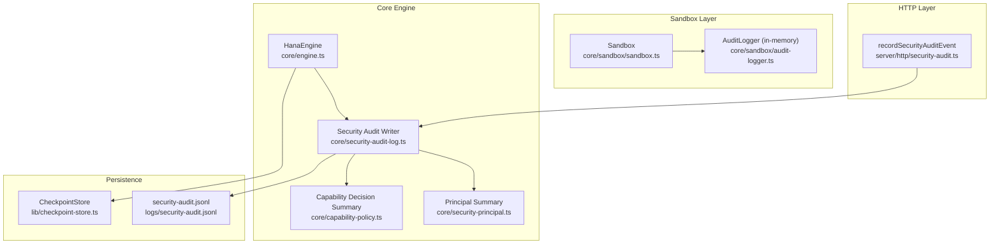
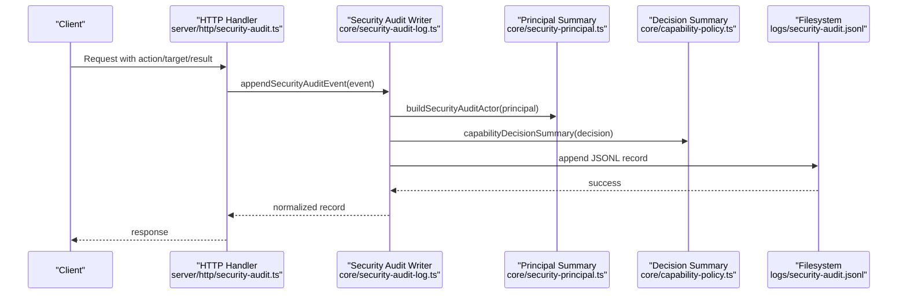
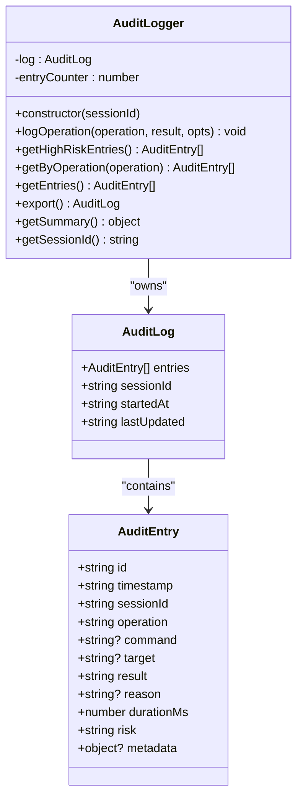
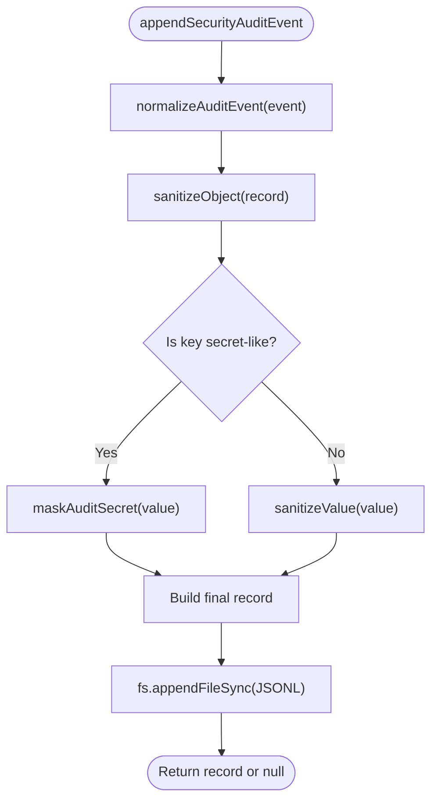
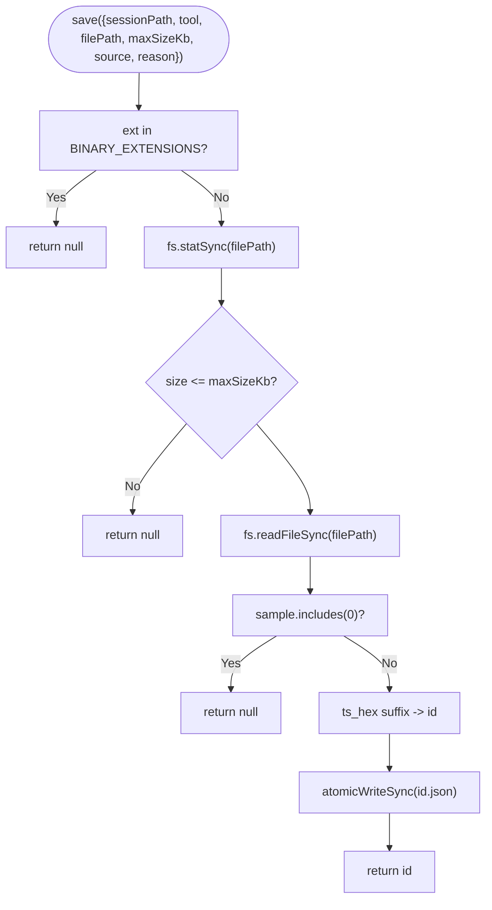
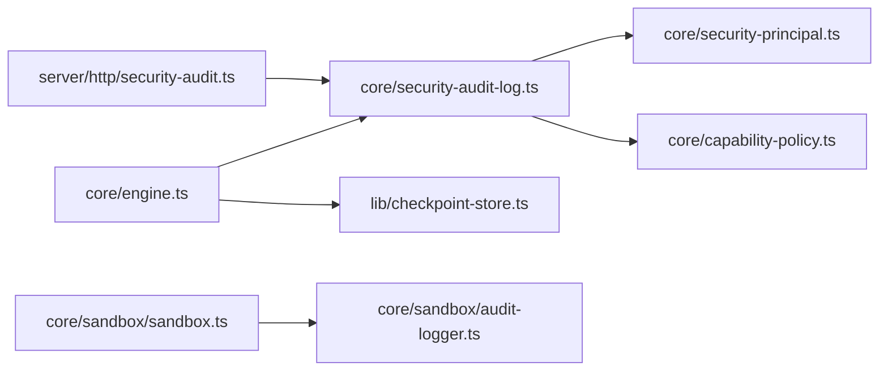

# Audit Logging

<cite>
**Referenced Files in This Document**
- [audit-logger.ts](file://core/sandbox/audit-logger.ts)
- [sandbox.ts](file://core/sandbox/sandbox.ts)
- [security-audit-log.ts](file://core/security-audit-log.ts)
- [security-audit.ts](file://server/http/security-audit.ts)
- [checkpoint-store.ts](file://lib/checkpoint-store.ts)
- [engine.ts](file://core/engine.ts)
- [security-principal.ts](file://core/security-principal.ts)
- [capability-policy.ts](file://core/capability-policy.ts)
- [debug-log.ts](file://lib/debug-log.ts)
- [security-audit.jsonl](file://logs/security-audit.jsonl)
</cite>

## Table of Contents
1. Introduction
2. Project Structure
3. Core Components
4. Architecture Overview
5. Detailed Component Analysis
6. Dependency Analysis
7. Performance Considerations
8. Troubleshooting Guide
9. Conclusion
10. Appendices

## Introduction
This document explains the audit logging system focused on security event tracking and compliance. It covers:
- The in-memory sandbox operation logger for per-session auditing with timestamps, risk assessments, and metadata
- The persistent structured security audit log format and writer
- Integration points across HTTP handlers and core engine
- The checkpoint store for operation state tracking and recovery
- Practical guidance for querying logs, generating compliance reports, and setting up real-time monitoring
- Log retention policies, privacy considerations, and forensic analysis techniques

## Project Structure
The audit logging system spans multiple layers:
- In-memory sandbox audit logger for session-scoped operations
- Persistent JSONL security audit log writer used by server routes and core engine
- Checkpoint store for file-state snapshots and restoration
- Supporting modules for principal normalization and capability decisions

**Diagram sources**
- [sandbox.ts:61-336](file://core/sandbox/sandbox.ts#L61-L336)
- [audit-logger.ts:30-137](file://core/sandbox/audit-logger.ts#L30-L137)
- [security-audit-log.ts:1-104](file://core/security-audit-log.ts#L1-L104)
- [security-audit.ts:1-35](file://server/http/security-audit.ts#L1-L35)
- [engine.ts:1-200](file://core/engine.ts#L1-L200)
- [checkpoint-store.ts:1-135](file://lib/checkpoint-store.ts#L1-L135)
- [security-principal.ts:1-162](file://core/security-principal.ts#L1-L162)
- [capability-policy.ts:1-170](file://core/capability-policy.ts#L1-L170)
- [security-audit.jsonl:1-7](file://logs/security-audit.jsonl#L1-L7)

**Section sources**
- [sandbox.ts:61-336](file://core/sandbox/sandbox.ts#L61-L336)
- [audit-logger.ts:30-137](file://core/sandbox/audit-logger.ts#L30-L137)
- [security-audit-log.ts:1-104](file://core/security-audit-log.ts#L1-L104)
- [security-audit.ts:1-35](file://server/http/security-audit.ts#L1-L35)
- [engine.ts:1-200](file://core/engine.ts#L1-L200)
- [checkpoint-store.ts:1-135](file://lib/checkpoint-store.ts#L1-L135)
- [security-principal.ts:1-162](file://core/security-principal.ts#L1-L162)
- [capability-policy.ts:1-170](file://core/capability-policy.ts#L1-L170)
- [security-audit.jsonl:1-7](file://logs/security-audit.jsonl#L1-L7)

## Core Components
- Sandbox AuditLogger: Records per-session operations with timestamps, results, durations, risk levels, and optional metadata. Provides filtering and summary utilities.
- Security Audit Writer: Normalizes events, sanitizes sensitive fields, and appends structured JSONL records to a persistent file under the logs directory.
- HTTP Audit Hook: Bridges HTTP requests to the security audit writer, injecting authenticated principal context.
- CheckpointStore: Captures text-based file snapshots with size checks and atomic writes; supports listing, restore, remove, and retention cleanup.
- Principal and Capability Helpers: Provide normalized actor summaries and decision summaries for consistent audit entries.

Key responsibilities:
- Record all security-relevant operations with precise timing and risk assessment
- Ensure sensitive data is masked before persistence
- Provide query and export interfaces for reporting and forensics
- Support operational recovery via checkpoints

**Section sources**
- [audit-logger.ts:30-137](file://core/sandbox/audit-logger.ts#L30-L137)
- [security-audit-log.ts:1-104](file://core/security-audit-log.ts#L1-L104)
- [security-audit.ts:1-35](file://server/http/security-audit.ts#L1-L35)
- [checkpoint-store.ts:1-135](file://lib/checkpoint-store.ts#L1-L135)
- [security-principal.ts:1-162](file://core/security-principal.ts#L1-L162)
- [capability-policy.ts:1-170](file://core/capability-policy.ts#L1-L170)

## Architecture Overview
The system combines two complementary logging mechanisms:
- Session-scoped in-memory audit log for sandboxed operations
- Persistent JSONL security audit log for cross-cutting security events

**Diagram sources**
- [security-audit.ts:1-35](file://server/http/security-audit.ts#L1-L35)
- [security-audit-log.ts:15-54](file://core/security-audit-log.ts#L15-L54)
- [security-principal.ts:67-87](file://core/security-principal.ts#L67-L87)
- [capability-policy.ts:102-113](file://core/capability-policy.ts#L102-L113)
- [security-audit.jsonl:1-7](file://logs/security-audit.jsonl#L1-L7)

## Detailed Component Analysis

### Sandbox AuditLogger
Purpose:
- Track sandbox operations such as bash execution, file read/write/delete, network access, and tool use
- Assign risk levels and capture duration and reason for failures or blocks
- Provide filtered views and summary statistics for quick insights

Key behaviors:
- Each entry includes a unique id, ISO timestamp, sessionId, operation type, result, optional command/target/reason, durationMs, risk, and metadata
- High-risk filtering and per-operation queries are supported
- Export returns a deep clone of the in-memory log for inspection or externalization

Complexity:
- logOperation: O(1) append
- getHighRiskEntries/getByOperation/getEntries: O(n) scan over entries
- getSummary: O(n) aggregation

**Diagram sources**
- [audit-logger.ts:30-137](file://core/sandbox/audit-logger.ts#L30-L137)

Usage integration:
- The Sandbox orchestrator calls into the logger for each operation outcome, including blocked, timeout, success, and failure cases.

**Section sources**
- [audit-logger.ts:30-137](file://core/sandbox/audit-logger.ts#L30-L137)
- [sandbox.ts:101-191](file://core/sandbox/sandbox.ts#L101-L191)

### Security Audit Writer
Purpose:
- Normalize and sanitize security events
- Persist structured JSONL records with schema versioning
- Mask sensitive fields based on key heuristics

Normalization and sanitization:
- Actor is derived from principal summary
- Decision is summarized to a stable shape
- Secret-like keys are detected and values replaced with a masked constant
- Strings are trimmed and truncated to bounded length

Persistence:
- Appends one JSON object per line to a single file under the logs directory
- Creates directories if needed and handles errors gracefully

**Diagram sources**
- [security-audit-log.ts:15-54](file://core/security-audit-log.ts#L15-L54)
- [security-audit-log.ts:63-103](file://core/security-audit-log.ts#L63-L103)

**Section sources**
- [security-audit-log.ts:1-104](file://core/security-audit-log.ts#L1-L104)

### HTTP Audit Hook
Purpose:
- Bridge HTTP request context to the security audit writer
- Inject authenticated principal and optional decision/lease/error details

Behavior:
- Reads the current auth principal from the request context
- Calls the writer with action, target, result, secretFields, metadata, decision, leaseId, errorCode

**Section sources**
- [security-audit.ts:1-35](file://server/http/security-audit.ts#L1-L35)

### Checkpoint Store
Purpose:
- Capture snapshots of text files during operations to support recovery
- Enforce size limits and binary detection
- Provide list, restore, remove, and retention cleanup

Key behaviors:
- Skips binary files and oversized content
- Uses atomic write for durability
- Lists entries sorted by timestamp
- Restores content to original path
- Removes old entries beyond configured retention days

**Diagram sources**
- [checkpoint-store.ts:23-63](file://lib/checkpoint-store.ts#L23-L63)

Integration:
- Exposed through the engine for restore operations and likely used by tool wrappers to wrap risky operations.

**Section sources**
- [checkpoint-store.ts:1-135](file://lib/checkpoint-store.ts#L1-L135)
- [engine.ts:1120-1130](file://core/engine.ts#L1120-L1130)

### Principal and Capability Helpers
- Principal summary normalizes identity fields and trust/connection attributes for consistent actor representation in audit logs
- Capability decision summary provides a compact view of authorization outcomes

**Section sources**
- [security-principal.ts:67-87](file://core/security-principal.ts#L67-L87)
- [capability-policy.ts:102-113](file://core/capability-policy.ts#L102-L113)

## Dependency Analysis

**Diagram sources**
- [security-audit.ts:1-35](file://server/http/security-audit.ts#L1-L35)
- [security-audit-log.ts:1-104](file://core/security-audit-log.ts#L1-L104)
- [security-principal.ts:1-162](file://core/security-principal.ts#L1-L162)
- [capability-policy.ts:1-170](file://core/capability-policy.ts#L1-L170)
- [engine.ts:1-200](file://core/engine.ts#L1-L200)
- [checkpoint-store.ts:1-135](file://lib/checkpoint-store.ts#L1-L135)
- [sandbox.ts:61-336](file://core/sandbox/sandbox.ts#L61-L336)
- [audit-logger.ts:30-137](file://core/sandbox/audit-logger.ts#L30-L137)

**Section sources**
- [security-audit.ts:1-35](file://server/http/security-audit.ts#L1-L35)
- [security-audit-log.ts:1-104](file://core/security-audit-log.ts#L1-L104)
- [security-principal.ts:1-162](file://core/security-principal.ts#L1-L162)
- [capability-policy.ts:1-170](file://core/capability-policy.ts#L1-L170)
- [engine.ts:1-200](file://core/engine.ts#L1-L200)
- [checkpoint-store.ts:1-135](file://lib/checkpoint-store.ts#L1-L135)
- [sandbox.ts:61-336](file://core/sandbox/sandbox.ts#L61-L336)
- [audit-logger.ts:30-137](file://core/sandbox/audit-logger.ts#L30-L137)

## Performance Considerations
- In-memory sandbox audit logger:
  - Operations are O(1) for append; filtering and summaries are O(n). For long sessions, consider periodic export and rotation to keep memory bounded.
- Persistent security audit log:
  - Append-only JSONL is efficient but can grow large. Implement external rotation (e.g., OS-level tools) or integrate a log rotation strategy at deployment time.
- Checkpoint store:
  - Atomic writes ensure durability; avoid capturing large or binary files. Use retention cleanup to bound disk usage.
- Debug log truncation:
  - The debug logger caps file size and stops writing after a threshold; similar guardrails should be considered for audit outputs in high-throughput environments.

[No sources needed since this section provides general guidance]

## Troubleshooting Guide
Common issues and resolutions:
- Missing hanakoHome:
  - The security audit writer requires a valid home directory; ensure it is provided when invoking the writer.
- Permission errors:
  - Verify write permissions to the logs directory; the writer creates directories recursively but may fail if parent paths are not writable.
- Large log growth:
  - Integrate external log rotation or implement periodic archival to prevent unbounded growth.
- Sensitive data exposure:
  - Confirm that secret-like keys are present in secretFields or match heuristic patterns so they are masked. Review metadata carefully before emitting.
- Checkpoint restore failures:
  - Ensure the target directory exists and is writable; verify the snapshot file is intact and not corrupted.

**Section sources**
- [security-audit-log.ts:10-29](file://core/security-audit-log.ts#L10-L29)
- [debug-log.ts:150-177](file://lib/debug-log.ts#L150-L177)
- [checkpoint-store.ts:97-133](file://lib/checkpoint-store.ts#L97-L133)

## Conclusion
The audit logging system provides robust, privacy-aware recording of security-relevant operations both in-memory for sandboxed actions and persistently for cross-cutting events. With normalized actors, decision summaries, and strict sanitization, it supports compliance reporting, forensic analysis, and operational recovery via checkpoints. Adopting log rotation and retention policies will further strengthen reliability and security posture.

[No sources needed since this section summarizes without analyzing specific files]

## Appendices

### Structured Log Format (Security Audit)
- Fields:
  - schemaVersion: integer
  - eventId: string
  - timestamp: ISO 8601
  - action: string
  - target: any
  - result: string
  - actor: normalized principal summary
  - decision: capability decision summary
  - leaseId: string|null
  - errorCode: string|null
  - secretFields: array of strings
  - metadata: sanitized object
- Notes:
  - Secret-like keys are masked automatically
  - Strings are sanitized and truncated

**Section sources**
- [security-audit-log.ts:38-54](file://core/security-audit-log.ts#L38-L54)
- [security-audit-log.ts:63-103](file://core/security-audit-log.ts#L63-L103)
- [security-audit.jsonl:1-7](file://logs/security-audit.jsonl#L1-L7)

### Querying Audit Logs
- Per-session sandbox operations:
  - Use the sandbox’s exported audit log to filter by operation type or risk level and compute summaries.
- Cross-cutting security events:
  - Parse the JSONL file line-by-line; filter by action, result, actor, or timestamp ranges.
- Compliance reports:
  - Aggregate counts by action, result, and risk; include actor breakdowns and decision reasons.

**Section sources**
- [audit-logger.ts:78-132](file://core/sandbox/audit-logger.ts#L78-L132)
- [security-audit-log.ts:15-54](file://core/security-audit-log.ts#L15-L54)

### Real-Time Security Monitoring
- Tail the JSONL file for new events and forward to a SIEM or alerting pipeline.
- Trigger alerts on high-risk actions, repeated failures, or unauthorized attempts.
- Correlate with checkpoint activity to detect anomalous file changes.

[No sources needed since this section provides general guidance]

### Retention Policies and Rotation
- Security audit log:
  - No built-in rotation; apply external rotation (e.g., daily or size-based) and archive securely.
- Checkpoint store:
  - Use cleanup(retentionDays) to remove snapshots older than policy.
- Debug log:
  - Truncates after a fixed size; consider similar safeguards for audit outputs.

**Section sources**
- [checkpoint-store.ts:115-133](file://lib/checkpoint-store.ts#L115-L133)
- [debug-log.ts:150-177](file://lib/debug-log.ts#L150-L177)

### Privacy Considerations
- Always provide secretFields to mark sensitive paths explicitly.
- Avoid placing secrets in metadata; rely on heuristic masking for known key patterns.
- Redact PII in custom metadata before emitting.

**Section sources**
- [security-audit-log.ts:85-103](file://core/security-audit-log.ts#L85-L103)

### Forensic Analysis Techniques
- Reconstruct timelines using timestamps and eventId ordering.
- Correlate sandbox operations with security audit events to understand cause-effect chains.
- Use checkpoints to recover pre-incident file states and compare diffs.

**Section sources**
- [security-audit.jsonl:1-7](file://logs/security-audit.jsonl#L1-L7)
- [checkpoint-store.ts:97-106](file://lib/checkpoint-store.ts#L97-L106)