# Network Security

<cite>
**Referenced Files in This Document**
- [network-filter.ts](file://core/sandbox/network-filter.ts)
- [sandbox.ts](file://core/sandbox/sandbox.ts)
- [index.ts](file://core/sandbox/index.ts)
- [approval-gateway.ts](file://core/sandbox/approval-gateway.ts)
- [lib approval-gateway.ts](file://lib/approval-gateway.ts)
- [cors-policy.ts](file://server/http/cors-policy.ts)
- [route-security.ts](file://server/http/route-security.ts)
- [security-audit.ts](file://server/http/security-audit.ts)
- [security-audit-log.ts](file://core/security-audit-log.ts)
- [network-proxy.ts](file://shared/network-proxy.ts)
</cite>

## Table of Contents
1. Introduction
2. Project Structure
3. Core Components
4. Architecture Overview
5. Detailed Component Analysis
6. Dependency Analysis
7. Performance Considerations
8. Troubleshooting Guide
9. Conclusion

## Introduction
This document explains the network security features focused on controlling outbound connections and request filtering. It covers:
- NetworkFilter for blocking unauthorized requests and enforcing domain allowlists via /etc/hosts manipulation
- CORS policy configuration for web interfaces and API endpoints
- Human-in-the-loop authorization using ApprovalGateway for risky operations
- Proxy configuration, DNS resolution considerations, certificate validation notes, and network traffic analysis through audit logs

The goal is to provide practical guidance for setting up network isolation, implementing approval workflows, and monitoring network activity.

## Project Structure
Network security spans several modules:
- Sandbox layer enforces process-level controls and optional network isolation
- HTTP server layer applies CORS and route authorization policies
- Shared proxy utilities normalize and apply proxy/no-proxy rules
- Audit logging records security decisions and outcomes

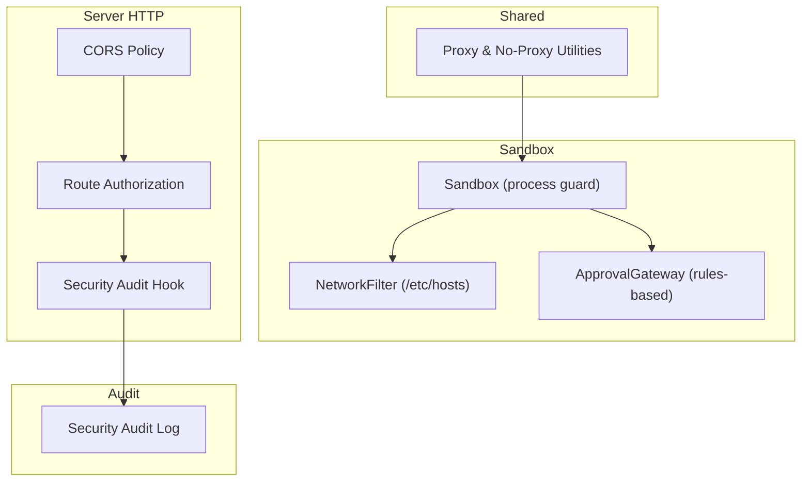

**Diagram sources**
- [sandbox.ts:60-94](file://core/sandbox/sandbox.ts#L60-L94)
- [network-filter.ts:23-78](file://core/sandbox/network-filter.ts#L23-L78)
- [approval-gateway.ts:48-159](file://core/sandbox/approval-gateway.ts#L48-L159)
- [cors-policy.ts:1-15](file://server/http/cors-policy.ts#L1-L15)
- [route-security.ts:29-80](file://server/http/route-security.ts#L29-L80)
- [security-audit.ts:1-35](file://server/http/security-audit.ts#L1-L35)
- [security-audit-log.ts:15-29](file://core/security-audit-log.ts#L15-L29)
- [network-proxy.ts:72-106](file://shared/network-proxy.ts#L72-L106)

**Section sources**
- [sandbox.ts:60-94](file://core/sandbox/sandbox.ts#L60-L94)
- [network-filter.ts:23-78](file://core/sandbox/network-filter.ts#L23-L78)
- [approval-gateway.ts:48-159](file://core/sandbox/approval-gateway.ts#L48-L159)
- [cors-policy.ts:1-15](file://server/http/cors-policy.ts#L1-L15)
- [route-security.ts:29-80](file://server/http/route-security.ts#L29-L80)
- [security-audit.ts:1-35](file://server/http/security-audit.ts#L1-L35)
- [security-audit-log.ts:15-29](file://core/security-audit-log.ts#L15-L29)
- [network-proxy.ts:72-106](file://shared/network-proxy.ts#L72-L106)

## Core Components
- NetworkFilter: Applies host-level restrictions by appending entries to /etc/hosts and supports custom mappings; provides restore and snapshot capabilities.
- Sandbox: Orchestrates execution with path guards, command pattern checks, circuit breaker, and optional network isolation via NetworkFilter.
- ApprovalGateway (rules-based): Evaluates operation risk against configurable rules, auto-approves low-risk actions, and raises pending approvals for human review.
- ApprovalGateway (model-assisted): Provides a model-driven reviewer pipeline that can escalate or approve based on policy and context.
- CORS Policy: Validates allowed origins for web clients, including loopback and Electron file origins.
- Route Security: Classifies routes into public, authenticated, local-only, studio-owner, and plugin-scoped categories and enforces scope-based access.
- Security Audit: Records security events with actor, decision, and metadata into an append-only JSONL log.
- Proxy Utilities: Normalize and resolve proxy settings, no-proxy matching, environment propagation, and Electron-specific formatting.

**Section sources**
- [network-filter.ts:9-78](file://core/sandbox/network-filter.ts#L9-L78)
- [sandbox.ts:60-94](file://core/sandbox/sandbox.ts#L60-L94)
- [approval-gateway.ts:48-159](file://core/sandbox/approval-gateway.ts#L48-L159)
- [lib approval-gateway.ts:326-358](file://lib/approval-gateway.ts#L326-L358)
- [cors-policy.ts:1-15](file://server/http/cors-policy.ts#L1-L15)
- [route-security.ts:29-80](file://server/http/route-security.ts#L29-L80)
- [security-audit.ts:1-35](file://server/http/security-audit.ts#L1-L35)
- [security-audit-log.ts:15-29](file://core/security-audit-log.ts#L15-L29)
- [network-proxy.ts:72-106](file://shared/network-proxy.ts#L72-L106)

## Architecture Overview
The system layers security across process execution, HTTP boundaries, and observability:
- Process layer: Sandbox gates commands and optionally restricts DNS via hosts file changes.
- HTTP layer: CORS and route authorization protect endpoints.
- Observability: Security audit log captures decisions and outcomes.
- Proxy layer: Centralized normalization and application of proxy/no-proxy rules.

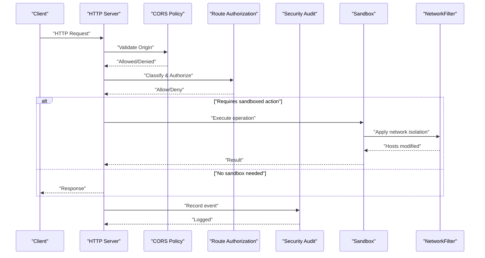

**Diagram sources**
- [cors-policy.ts:1-15](file://server/http/cors-policy.ts#L1-L15)
- [route-security.ts:29-80](file://server/http/route-security.ts#L29-L80)
- [security-audit.ts:1-35](file://server/http/security-audit.ts#L1-L35)
- [sandbox.ts:260-276](file://core/sandbox/sandbox.ts#L260-L276)
- [network-filter.ts:38-70](file://core/sandbox/network-filter.ts#L38-L70)

## Detailed Component Analysis

### NetworkFilter
Controls outbound connectivity by modifying /etc/hosts:
- Backup and restore lifecycle ensures safe application and cleanup
- Supports custom domain-to-IP mappings and default blocked entries
- Provides snapshot for auditing current effective hosts content

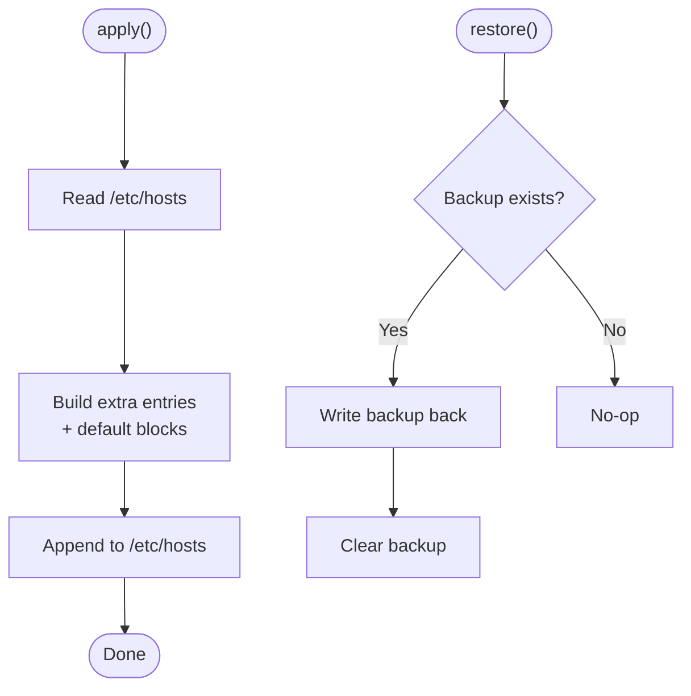

**Diagram sources**
- [network-filter.ts:38-70](file://core/sandbox/network-filter.ts#L38-L70)

Practical usage:
- Enable network isolation per session via Sandbox configuration
- Use customMappings to enforce domain allowlists by redirecting unknown domains to a sink IP
- Always call restore after use to avoid persistent system changes

**Section sources**
- [network-filter.ts:9-78](file://core/sandbox/network-filter.ts#L9-L78)
- [sandbox.ts:260-276](file://core/sandbox/sandbox.ts#L260-L276)

### Sandbox Integration
Sandbox integrates NetworkFilter and other safeguards:
- Optional networkIsolation flag enables NetworkFilter
- PathGuard, command pattern checks, and circuit breaker complement network controls
- Session-scoped temp directory and resource limits reduce blast radius

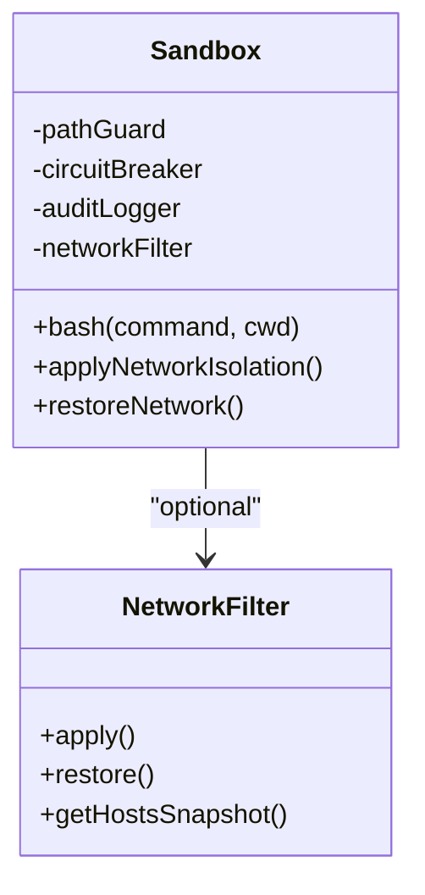

**Diagram sources**
- [sandbox.ts:60-94](file://core/sandbox/sandbox.ts#L60-L94)
- [sandbox.ts:260-276](file://core/sandbox/sandbox.ts#L260-L276)
- [network-filter.ts:23-78](file://core/sandbox/network-filter.ts#L23-L78)

**Section sources**
- [sandbox.ts:60-94](file://core/sandbox/sandbox.ts#L60-L94)
- [sandbox.ts:260-276](file://core/sandbox/sandbox.ts#L260-L276)
- [index.ts:95-102](file://core/sandbox/index.ts#L95-L102)

### ApprovalGateway (Rules-Based)
Human-in-the-loop authorization for potentially risky operations:
- Risk assessment based on operation type and target patterns
- Auto-approve low-risk operations when configured
- Pending requests surfaced via event bus for manual resolution

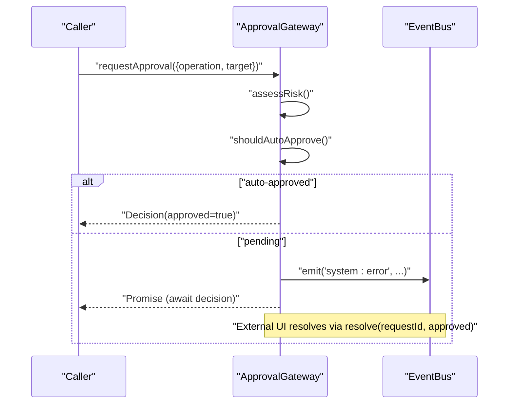

**Diagram sources**
- [approval-gateway.ts:62-115](file://core/sandbox/approval-gateway.ts#L62-L115)

Operational tips:
- Define explicit rules for network:request operations to require approval for external domains
- Use getPendingRequests() to build an admin UI for approvals
- Integrate with audit logging to record decisions

**Section sources**
- [approval-gateway.ts:33-46](file://core/sandbox/approval-gateway.ts#L33-L46)
- [approval-gateway.ts:62-115](file://core/sandbox/approval-gateway.ts#L62-L115)
- [approval-gateway.ts:117-159](file://core/sandbox/approval-gateway.ts#L117-L159)

### ApprovalGateway (Model-Assisted)
A model-driven reviewer pipeline for complex decisions:
- Deterministic policy pre-checks (e.g., block force-pushes)
- Small/large model reviewers with escalation fallback
- Structured JSON decisions normalized and enforced

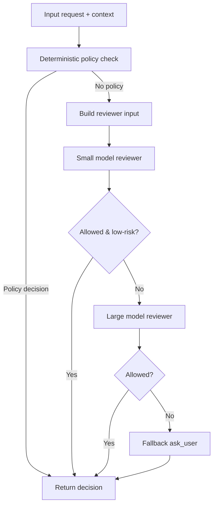

**Diagram sources**
- [lib approval-gateway.ts:112-139](file://lib/approval-gateway.ts#L112-L139)
- [lib approval-gateway.ts:259-301](file://lib/approval-gateway.ts#L259-L301)
- [lib approval-gateway.ts:326-358](file://lib/approval-gateway.ts#L326-L358)

**Section sources**
- [lib approval-gateway.ts:1-358](file://lib/approval-gateway.ts#L1-L358)

### CORS Policy
Validates browser origins for cross-origin requests:
- Allows null origin (useful for file:// contexts)
- Accepts Electron file:// origins
- Defaults to allowing loopback origins (localhost/127.0.0.1)

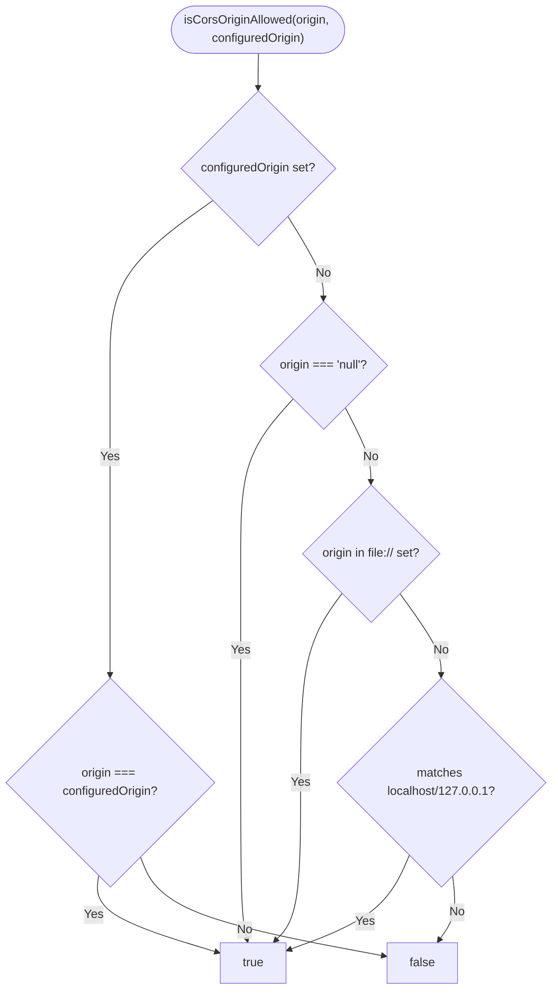

**Diagram sources**
- [cors-policy.ts:1-15](file://server/http/cors-policy.ts#L1-L15)

Configuration guidance:
- For production, prefer configuredOrigin to restrict to specific trusted origins
- Keep loopback defaults for development and desktop apps

**Section sources**
- [cors-policy.ts:1-15](file://server/http/cors-policy.ts#L1-L15)

### Route Security
Classifies and authorizes HTTP routes:
- Public, authenticated, local-only, studio-owner, and plugin-route categories
- Scope-based checks for fine-grained permissions
- Special handling for mobile/static assets and OAuth callbacks

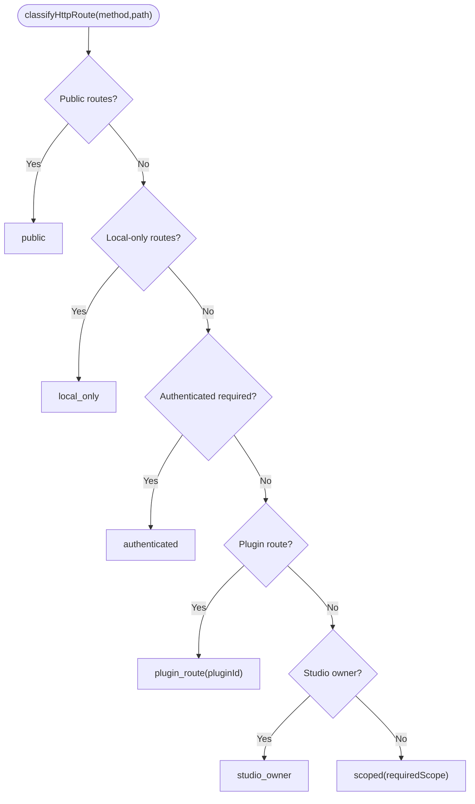

**Diagram sources**
- [route-security.ts:82-193](file://server/http/route-security.ts#L82-L193)

**Section sources**
- [route-security.ts:29-80](file://server/http/route-security.ts#L29-L80)
- [route-security.ts:82-193](file://server/http/route-security.ts#L82-L193)

### Security Audit Logging
Records security-relevant events with sanitized fields:
- Appends structured JSONL records to a dedicated log file
- Masks secret-like fields automatically
- Captures actor, decision summary, lease ID, error codes, and metadata

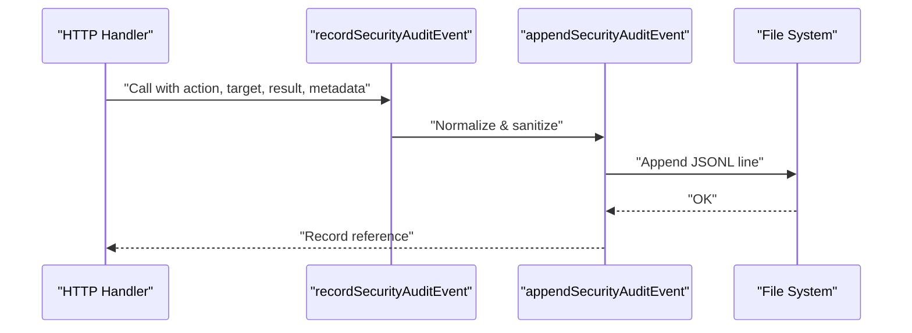

**Diagram sources**
- [security-audit.ts:1-35](file://server/http/security-audit.ts#L1-L35)
- [security-audit-log.ts:15-29](file://core/security-audit-log.ts#L15-L29)

**Section sources**
- [security-audit.ts:1-35](file://server/http/security-audit.ts#L1-L35)
- [security-audit-log.ts:15-29](file://core/security-audit-log.ts#L15-L29)

### Proxy Configuration and No-Proxy Matching
Centralized proxy utilities:
- Normalizes mode (system/manual/direct), validates URLs, and enforces allowed protocols
- Resolves effective proxy per URL protocol (http/https/ws/wss)
- Computes no-proxy matches with wildcard and port support
- Exposes helpers for Electron proxy rules and environment propagation

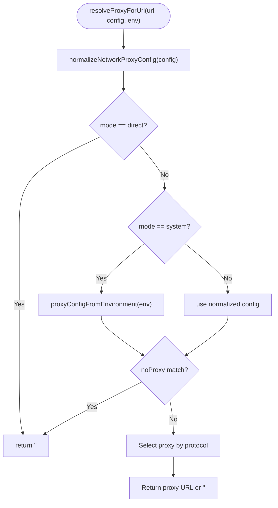

**Diagram sources**
- [network-proxy.ts:72-106](file://shared/network-proxy.ts#L72-L106)
- [network-proxy.ts:246-277](file://shared/network-proxy.ts#L246-L277)

**Section sources**
- [network-proxy.ts:72-106](file://shared/network-proxy.ts#L72-L106)
- [network-proxy.ts:246-277](file://shared/network-proxy.ts#L246-L277)

## Dependency Analysis
Key relationships:
- Sandbox depends on NetworkFilter for optional DNS-level isolation
- ApprovalGateway uses EventBus to surface pending approvals
- HTTP layer composes CORS and route authorization before invoking handlers
- Security audit hook writes to centralized audit log
- Proxy utilities are shared across components for consistent behavior

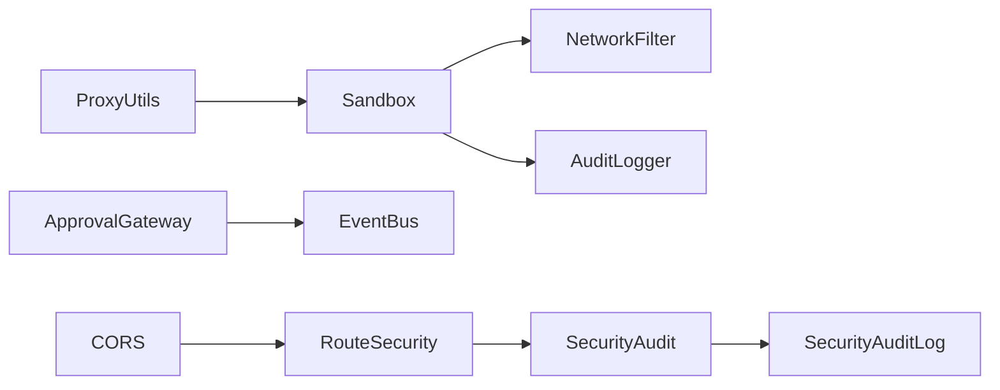

**Diagram sources**
- [sandbox.ts:60-94](file://core/sandbox/sandbox.ts#L60-L94)
- [network-filter.ts:23-78](file://core/sandbox/network-filter.ts#L23-L78)
- [approval-gateway.ts:1-10](file://core/sandbox/approval-gateway.ts#L1-L10)
- [cors-policy.ts:1-15](file://server/http/cors-policy.ts#L1-L15)
- [route-security.ts:29-80](file://server/http/route-security.ts#L29-L80)
- [security-audit.ts:1-35](file://server/http/security-audit.ts#L1-L35)
- [security-audit-log.ts:15-29](file://core/security-audit-log.ts#L15-L29)
- [network-proxy.ts:72-106](file://shared/network-proxy.ts#L72-L106)

**Section sources**
- [sandbox.ts:60-94](file://core/sandbox/sandbox.ts#L60-L94)
- [network-filter.ts:23-78](file://core/sandbox/network-filter.ts#L23-L78)
- [approval-gateway.ts:1-10](file://core/sandbox/approval-gateway.ts#L1-L10)
- [cors-policy.ts:1-15](file://server/http/cors-policy.ts#L1-L15)
- [route-security.ts:29-80](file://server/http/route-security.ts#L29-L80)
- [security-audit.ts:1-35](file://server/http/security-audit.ts#L1-L35)
- [security-audit-log.ts:15-29](file://core/security-audit-log.ts#L15-L29)
- [network-proxy.ts:72-106](file://shared/network-proxy.ts#L72-L106)

## Performance Considerations
- Hosts file I/O: Apply/restore operations touch /etc/hosts; batch changes and minimize frequency to reduce disk overhead.
- Rule evaluation: Keep approval rules concise and ordered by specificity to reduce regex evaluations.
- Proxy normalization: Cache normalized configurations where possible to avoid repeated parsing.
- Audit logging: Append-only JSONL is efficient but ensure log rotation to prevent unbounded growth.

[No sources needed since this section provides general guidance]

## Troubleshooting Guide
Common issues and resolutions:
- Network isolation not taking effect: Ensure applyNetworkIsolation is called before operations and restoreNetwork is invoked afterward. Verify /etc/hosts modifications and revert if necessary.
- Unexpected CORS failures: Confirm configuredOrigin is set appropriately for production; verify client origin matches expected values.
- Approvals stuck pending: Inspect pending requests via getPendingRequests() and resolve them using resolve(requestId, approved). Check event bus listeners for errors.
- Proxy misrouting: Validate proxy URL formats and protocols; confirm no-proxy entries include loopback and intended bypasses.

**Section sources**
- [sandbox.ts:260-276](file://core/sandbox/sandbox.ts#L260-L276)
- [network-filter.ts:38-70](file://core/sandbox/network-filter.ts#L38-L70)
- [cors-policy.ts:1-15](file://server/http/cors-policy.ts#L1-L15)
- [approval-gateway.ts:117-159](file://core/sandbox/approval-gateway.ts#L117-L159)
- [network-proxy.ts:72-106](file://shared/network-proxy.ts#L72-L106)

## Conclusion
The system implements layered network security:
- Process-level isolation with optional DNS restriction via hosts file
- Strict HTTP boundary controls with CORS and route authorization
- Human-in-the-loop approvals for risky operations
- Comprehensive audit logging for visibility and compliance
- Robust proxy configuration with precise no-proxy matching

Adopt these practices to harden outbound connectivity, control web interface access, and maintain clear oversight of network-related decisions.