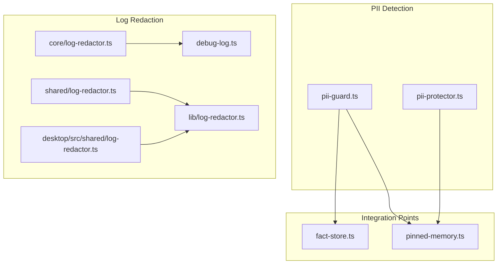
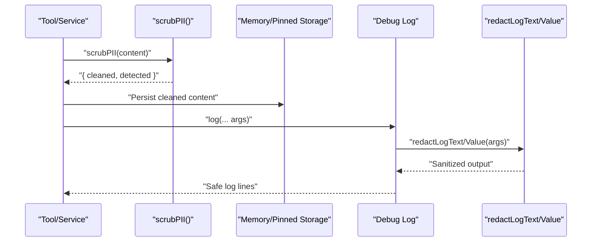
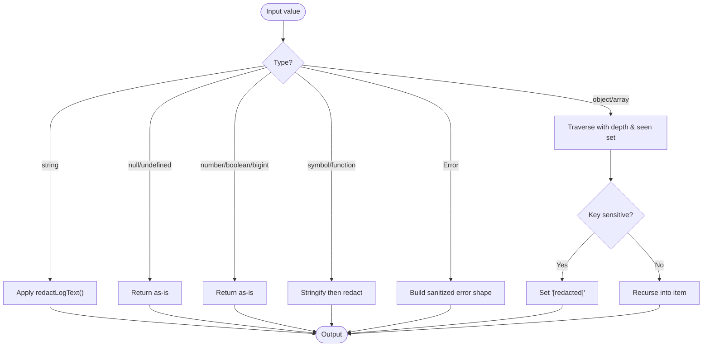
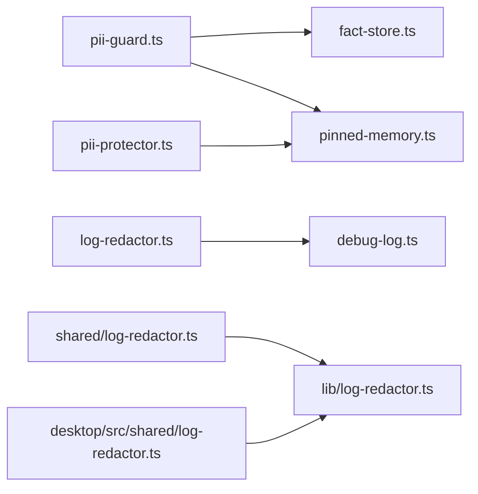

# PII Protection

<cite>
**Referenced Files in This Document**
- [core/pii-guard.ts](file://core/pii-guard.ts)
- [lib/pii-guard.ts](file://lib/pii-guard.ts)
- [core/sandbox/pii-protector.ts](file://core/sandbox/pii-protector.ts)
- [tests/core/pii-protector.test.ts](file://tests/core/pii-protector.test.ts)
- [shared/log-redactor.ts](file://shared/log-redactor.ts)
- [core/log-redactor.ts](file://core/log-redactor.ts)
- [desktop/src/shared/log-redactor.ts](file://desktop/src/shared/log-redactor.ts)
- [lib/log-redactor.ts](file://lib/log-redactor.ts)
- [core/debug-log.ts](file://core/debug-log.ts)
- [lib/memory/fact-store.ts](file://lib/memory/fact-store.ts)
- [lib/tools/pinned-memory.ts](file://lib/tools/pinned-memory.ts)
</cite>

## Table of Contents
1. Introduction
2. Project Structure
3. Core Components
4. Architecture Overview
5. Detailed Component Analysis
6. Dependency Analysis
7. Performance Considerations
8. Troubleshooting Guide
9. Conclusion
10. Appendices

## Introduction
This document explains the PII (Personally Identifiable Information) protection system implemented in the project, focusing on detection and redaction of sensitive information across logs, messages, and file contents. It covers:
- The PiiGuard implementation for detecting and redacting sensitive data before persistence or transmission
- Supported PII patterns including emails, phone numbers, credit cards, IDs, SSNs, API keys, and custom regex rules
- Practical examples for configuring detection rules, implementing custom redaction handlers, and integrating with data loss prevention systems
- The log redactor for sanitizing sensitive data before storage or transmission
- Compliance considerations (GDPR, HIPAA), data minimization principles, and privacy-by-design patterns

## Project Structure
The PII protection features are implemented across multiple modules:
- PII detection and scrubbing utilities for content at rest
- A rule-based PII protector for flexible pattern matching and replacement
- A comprehensive log redactor for safe logging across environments
- Integration points in memory stores and tools to ensure sensitive data is never persisted raw



**Diagram sources**
- [core/pii-guard.ts:1-37](file://core/pii-guard.ts#L1-L37)
- [lib/pii-guard.ts:1-66](file://lib/pii-guard.ts#L1-L66)
- [core/sandbox/pii-protector.ts:1-101](file://core/sandbox/pii-protector.ts#L1-L101)
- [shared/log-redactor.ts:1-146](file://shared/log-redactor.ts#L1-L146)
- [core/log-redactor.ts:1-143](file://core/log-redactor.ts#L1-L143)
- [desktop/src/shared/log-redactor.ts:1-146](file://desktop/src/shared/log-redactor.ts#L1-L146)
- [lib/log-redactor.ts:1-16](file://lib/log-redactor.ts#L1-L16)
- [core/debug-log.ts:1-164](file://core/debug-log.ts#L1-L164)
- [lib/memory/fact-store.ts:1-200](file://lib/memory/fact-store.ts#L1-L200)
- [lib/tools/pinned-memory.ts:1-92](file://lib/tools/pinned-memory.ts#L1-L92)

**Section sources**
- [core/pii-guard.ts:1-37](file://core/pii-guard.ts#L1-L37)
- [lib/pii-guard.ts:1-66](file://lib/pii-guard.ts#L1-L66)
- [core/sandbox/pii-protector.ts:1-101](file://core/sandbox/pii-protector.ts#L1-L101)
- [shared/log-redactor.ts:1-146](file://shared/log-redactor.ts#L1-L146)
- [core/log-redactor.ts:1-143](file://core/log-redactor.ts#L1-L143)
- [desktop/src/shared/log-redactor.ts:1-146](file://desktop/src/shared/log-redactor.ts#L1-L146)
- [lib/log-redactor.ts:1-16](file://lib/log-redactor.ts#L1-L16)
- [core/debug-log.ts:1-164](file://core/debug-log.ts#L1-L164)
- [lib/memory/fact-store.ts:1-200](file://lib/memory/fact-store.ts#L1-L200)
- [lib/tools/pinned-memory.ts:1-92](file://lib/tools/pinned-memory.ts#L1-L92)

## Core Components
- PII Guard (scrubPII/hasPII): Fast, deterministic detection and hard redaction of high-risk tokens and identifiers before persistence.
- PII Protector (class): Rule-based engine supporting customizable patterns, selective enablement, detection reporting, and message-level redaction.
- Log Redactor: Browser-safe ESM module that sanitizes strings, objects, URLs, headers, and paths for safe logging.

Key responsibilities:
- Prevent secrets and PII from being written to persistent stores
- Sanitize diagnostic logs and error traces
- Provide extensible pattern matching for domain-specific PII

**Section sources**
- [core/pii-guard.ts:1-37](file://core/pii-guard.ts#L1-L37)
- [lib/pii-guard.ts:1-66](file://lib/pii-guard.ts#L1-L66)
- [core/sandbox/pii-protector.ts:1-101](file://core/sandbox/pii-protector.ts#L1-L101)
- [shared/log-redactor.ts:1-146](file://shared/log-redactor.ts#L1-L146)
- [core/log-redactor.ts:1-143](file://core/log-redactor.ts#L1-L143)
- [desktop/src/shared/log-redactor.ts:1-146](file://desktop/src/shared/log-redactor.ts#L1-L146)
- [lib/log-redactor.ts:1-16](file://lib/log-redactor.ts#L1-L16)

## Architecture Overview
The system applies PII protection at two layers:
- Content-at-rest layer: Scrubs text before writing to memory stores and pinned memory files
- Observability layer: Redacts logs and structured values to avoid leaking secrets in diagnostics



**Diagram sources**
- [lib/tools/pinned-memory.ts:1-92](file://lib/tools/pinned-memory.ts#L1-L92)
- [lib/memory/fact-store.ts:1-200](file://lib/memory/fact-store.ts#L1-L200)
- [core/debug-log.ts:1-164](file://core/debug-log.ts#L1-L164)
- [shared/log-redactor.ts:1-146](file://shared/log-redactor.ts#L1-L146)
- [core/log-redactor.ts:1-143](file://core/log-redactor.ts#L1-L143)

## Detailed Component Analysis

### PII Guard (Hard Patterns)
Purpose:
- Detect and replace high-risk tokens and identifiers with a fixed placeholder before persistence
- Provide a fast boolean check for presence of sensitive data

Supported patterns:
- API keys by known prefixes (e.g., sk-*, AKIA*, gsk_*, ghp_*, glpat-*, xoxb-*)
- Inline secret assignments (key=..., token: ..., password=...)
- PEM private key headers
- Credit card-like sequences (grouped digits)
- Chinese ID card numbers (18-digit format)
- US Social Security Numbers (SSN)

API surface:
- scrubPII(text): returns cleaned text and list of detected categories
- hasPII(text): returns true if any pattern matches

Usage examples:
- Before persisting user notes or facts
- Prior to sending content to external services where required

**Section sources**
- [core/pii-guard.ts:1-37](file://core/pii-guard.ts#L1-L37)
- [lib/pii-guard.ts:1-66](file://lib/pii-guard.ts#L1-L66)

### PII Protector (Rule-Based Engine)
Purpose:
- Provide a configurable, label-driven PII scanner and redactor
- Support custom rules and selective enablement
- Offer detection reports with positions and replacements

Default rules include:
- Bank card numbers (partial masking)
- Chinese mobile phone numbers (partial masking)
- Email addresses (partial masking)
- Chinese ID card numbers (partial masking)
- API keys/tokens/passwords (full redaction)
- IP addresses (generic replacement)

API surface:
- constructor(options?): configure rules and enableOnly labels
- redact(text): apply enabled rules to produce sanitized text
- detect(text): return detailed detections with positions
- hasPII(text): convenience boolean
- redactMessages(messages): sanitize arrays of chat-style messages

Customization:
- Add PIIRule entries with pattern, label, and replacement function
- Filter active rules via enableOnly

Tests validate behavior for phones, emails, bank cards, IDs, API keys, IPs, detection, filtering, and custom rules.

```mermaid
classDiagram
class PIIProtector {
-rules : PIIRule[]
-enabledLabels : Set<string>
+constructor(options?)
+redact(text) : string
+detect(text) : PIIDetection[]
+hasPII(text) : boolean
+redactMessages(messages) : Array
}
class PIIRule {
+pattern : RegExp
+label : string
+replacement(match) : string
}
class PIIDetection {
+label : string
+original : string
+redacted : string
+position : { start : number; end : number }
}
PIIProtector --> PIIRule : "uses"
PIIProtector --> PIIDetection : "produces"
```

**Diagram sources**
- [core/sandbox/pii-protector.ts:1-101](file://core/sandbox/pii-protector.ts#L1-L101)

**Section sources**
- [core/sandbox/pii-protector.ts:1-101](file://core/sandbox/pii-protector.ts#L1-L101)
- [tests/core/pii-protector.test.ts:1-92](file://tests/core/pii-protector.test.ts#L1-L92)

### Log Redactor
Purpose:
- Ensure logs never contain secrets, credentials, or PII
- Work safely in browser and Node environments

Capabilities:
- Redact common secret assignments and header values (Authorization Bearer, Cookie/Set-Cookie)
- Replace inline API key values by known prefixes
- Mask email addresses, credit card-like sequences, Chinese ID numbers, SSNs
- Replace long random tokens
- Normalize and mask file paths and home directories
- Safely traverse and sanitize objects, arrays, and Error instances
- Clean object keys and limit depth to prevent heavy serialization

API surface:
- redactLogText(value, options): sanitize strings and simple values
- redactLogValue(value, options, state): recursively sanitize complex structures
- redactLogLabel(value): normalize and sanitize keys
- formatLogArgs(args, options): prepare safe log argument strings

Integration:
- Used by debug logging infrastructure to write safe files
- Re-exported through lib entry for consistent usage across components



**Diagram sources**
- [shared/log-redactor.ts:1-146](file://shared/log-redactor.ts#L1-L146)
- [core/log-redactor.ts:1-143](file://core/log-redactor.ts#L1-L143)
- [desktop/src/shared/log-redactor.ts:1-146](file://desktop/src/shared/log-redactor.ts#L1-L146)
- [lib/log-redactor.ts:1-16](file://lib/log-redactor.ts#L1-L16)

**Section sources**
- [shared/log-redactor.ts:1-146](file://shared/log-redactor.ts#L1-L146)
- [core/log-redactor.ts:1-143](file://core/log-redactor.ts#L1-L143)
- [desktop/src/shared/log-redactor.ts:1-146](file://desktop/src/shared/log-redactor.ts#L1-L146)
- [lib/log-redactor.ts:1-16](file://lib/log-redactor.ts#L1-L16)
- [core/debug-log.ts:1-164](file://core/debug-log.ts#L1-L164)

### Integration Points

#### Memory Fact Store
- Imports PII guard and uses it to scrub content prior to persistence
- Ensures fact search indexes and stored facts do not contain raw secrets or PII

**Section sources**
- [lib/memory/fact-store.ts:1-200](file://lib/memory/fact-store.ts#L1-L200)

#### Pinned Memory Tools
- Uses PII guard to clean user-provided content before saving
- Logs warnings when PII is detected and replaced

**Section sources**
- [lib/tools/pinned-memory.ts:1-92](file://lib/tools/pinned-memory.ts#L1-L92)

#### Debug Logging
- Applies log redactor to all logged lines and headers
- Normalizes module labels and deduplicates repeated lines

**Section sources**
- [core/debug-log.ts:1-164](file://core/debug-log.ts#L1-L164)

## Dependency Analysis
- PII Guard is consumed by memory and tooling modules to sanitize content at rest
- PII Protector provides an extensible interface for runtime customization and detection reporting
- Log Redactor is used by the debug logging subsystem and re-exported for consistent use across the app



**Diagram sources**
- [core/pii-guard.ts:1-37](file://core/pii-guard.ts#L1-L37)
- [lib/pii-guard.ts:1-66](file://lib/pii-guard.ts#L1-L66)
- [core/sandbox/pii-protector.ts:1-101](file://core/sandbox/pii-protector.ts#L1-L101)
- [shared/log-redactor.ts:1-146](file://shared/log-redactor.ts#L1-L146)
- [core/log-redactor.ts:1-143](file://core/log-redactor.ts#L1-L143)
- [desktop/src/shared/log-redactor.ts:1-146](file://desktop/src/shared/log-redactor.ts#L1-L146)
- [lib/log-redactor.ts:1-16](file://lib/log-redactor.ts#L1-L16)
- [core/debug-log.ts:1-164](file://core/debug-log.ts#L1-L164)
- [lib/memory/fact-store.ts:1-200](file://lib/memory/fact-store.ts#L1-L200)
- [lib/tools/pinned-memory.ts:1-92](file://lib/tools/pinned-memory.ts#L1-L92)

**Section sources**
- [core/pii-guard.ts:1-37](file://core/pii-guard.ts#L1-L37)
- [lib/pii-guard.ts:1-66](file://lib/pii-guard.ts#L1-L66)
- [core/sandbox/pii-protector.ts:1-101](file://core/sandbox/pii-protector.ts#L1-L101)
- [shared/log-redactor.ts:1-146](file://shared/log-redactor.ts#L1-L146)
- [core/log-redactor.ts:1-143](file://core/log-redactor.ts#L1-L143)
- [desktop/src/shared/log-redactor.ts:1-146](file://desktop/src/shared/log-redactor.ts#L1-L146)
- [lib/log-redactor.ts:1-16](file://lib/log-redactor.ts#L1-L16)
- [core/debug-log.ts:1-164](file://core/debug-log.ts#L1-L164)
- [lib/memory/fact-store.ts:1-200](file://lib/memory/fact-store.ts#L1-L200)
- [lib/tools/pinned-memory.ts:1-92](file://lib/tools/pinned-memory.ts#L1-L92)

## Performance Considerations
- PII Guard uses precompiled regular expressions and short-circuit checks to minimize overhead
- PII Protector allows enabling only necessary rules to reduce processing time
- Log Redactor limits recursion depth and avoids expensive operations on large structures
- Prefer batch redaction at ingestion points rather than per-line scanning where possible

[No sources needed since this section provides general guidance]

## Troubleshooting Guide
Common issues and resolutions:
- False positives/negatives in detection:
  - Adjust or add custom rules in PII Protector for domain-specific formats
  - Validate regex flags and boundaries to avoid over-matching
- Missing redaction in logs:
  - Ensure all logging paths use redactLogText/redactLogValue
  - Confirm path redaction options include homeDir and extraPaths
- Performance regressions:
  - Reduce number of active rules via enableOnly
  - Avoid logging deeply nested structures; serialize selectively

**Section sources**
- [core/sandbox/pii-protector.ts:1-101](file://core/sandbox/pii-protector.ts#L1-L101)
- [shared/log-redactor.ts:1-146](file://shared/log-redactor.ts#L1-L146)
- [core/debug-log.ts:1-164](file://core/debug-log.ts#L1-L164)

## Conclusion
The PII protection system combines deterministic hard-pattern scrubbing with a flexible rule-based engine and robust log redaction. By applying these mechanisms at ingestion and observability boundaries, the application adheres to data minimization and privacy-by-design principles while remaining extensible for evolving compliance requirements.

[No sources needed since this section summarizes without analyzing specific files]

## Appendices

### Supported PII Patterns Summary
- Emails
- Phone numbers (region-specific patterns supported)
- Credit card-like sequences
- Chinese ID card numbers
- US SSN
- API keys and tokens (by prefix and assignment patterns)
- Private key headers
- Long random tokens
- Paths and user directories (for logs)

**Section sources**
- [core/pii-guard.ts:1-37](file://core/pii-guard.ts#L1-L37)
- [lib/pii-guard.ts:1-66](file://lib/pii-guard.ts#L1-L66)
- [core/sandbox/pii-protector.ts:1-101](file://core/sandbox/pii-protector.ts#L1-L101)
- [shared/log-redactor.ts:1-146](file://shared/log-redactor.ts#L1-L146)

### Configuration Examples
- Configure PII Protector with custom rules and enableOnly filters
- Use scrubPII before persisting user content
- Wrap logging calls with redactLogText/redactLogValue

**Section sources**
- [core/sandbox/pii-protector.ts:1-101](file://core/sandbox/pii-protector.ts#L1-L101)
- [lib/tools/pinned-memory.ts:1-92](file://lib/tools/pinned-memory.ts#L1-L92)
- [core/debug-log.ts:1-164](file://core/debug-log.ts#L1-L164)

### Compliance Notes
- GDPR/HIPAA alignment:
  - Data minimization: scrub before storage
  - Purpose limitation: avoid retaining unnecessary PII
  - Security: redact logs and restrict access to sanitized outputs
- Privacy-by-design:
  - Default deny: enable only required rules
  - Auditability: leverage detection reports for monitoring
  - Portability: centralize patterns for reuse across services

[No sources needed since this section provides general guidance]